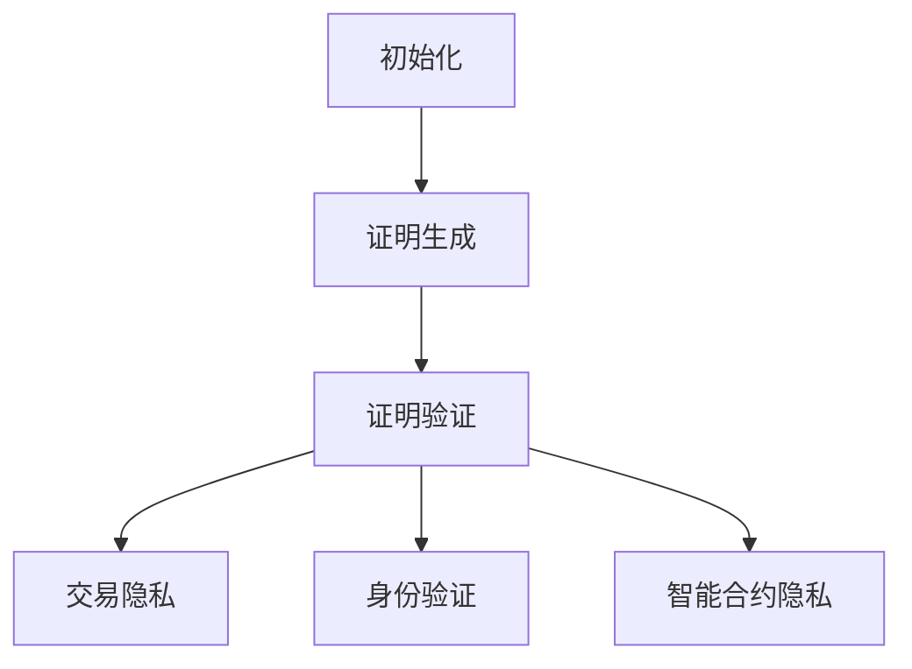

                 


### 文章标题

# 区块链的零知识证明：隐私保护的数学机制

### 文章关键词

区块链，零知识证明，隐私保护，数学机制，加密算法，智能合约，加密货币，隐私计算，安全协议。

### 文章摘要

本文深入探讨了区块链技术中的零知识证明（Zero-Knowledge Proof）及其在隐私保护中的应用。首先，我们将介绍区块链和零知识证明的基本概念，解释它们如何协同工作以实现隐私保护。接着，我们将详细讲解零知识证明的核心算法原理，包括其数学模型和公式，并通过伪代码和实例进行说明。随后，我们将分析零知识证明在加密货币、智能合约和隐私保护方案中的应用案例。最后，本文将提供一个实际项目，包括开发环境搭建、源代码实现和代码解读，以展示零知识证明的实际应用。文章结束时，我们将总结最佳实践和注意事项，并提供拓展阅读建议。

### 引言

区块链技术作为一种分布式数据库系统，近年来在金融、供应链管理、医疗保健等多个领域取得了显著的应用成果。然而，随着区块链网络的扩展和复杂性的增加，隐私保护问题逐渐成为限制其广泛应用的主要瓶颈。零知识证明（Zero-Knowledge Proof，ZKP）作为一种强大的密码学工具，提供了在无需泄露任何实际信息的情况下验证信息真实性的方法，成为解决区块链隐私保护问题的重要手段。

区块链本身是一种去中心化的分布式账本技术，它通过多个节点共同维护数据的一致性和完整性。然而，区块链的透明性使得所有交易数据都公开可查，这对于需要高度隐私保护的场景（如金融交易、个人健康信息等）构成了挑战。零知识证明通过在验证者和证明者之间传递一种“知识”的过程，使得验证者能够确认信息的真实性，而无需知晓信息的内容，从而实现了隐私保护。

本文旨在深入探讨零知识证明在区块链隐私保护中的应用。首先，我们将介绍区块链和零知识证明的基本概念，解释它们的工作原理及其相互关系。然后，我们将详细讲解零知识证明的核心算法原理，包括其数学模型和公式，并通过伪代码和实例进行说明。接下来，我们将分析零知识证明在加密货币、智能合约和隐私保护方案中的应用案例。最后，本文将提供一个实际项目，包括开发环境搭建、源代码实现和代码解读，以展示零知识证明的实际应用。通过本文的阅读，读者将能够全面理解零知识证明在区块链隐私保护中的重要性及其具体实现方法。

### 第1章 区块链与隐私保护

#### 1.1 区块链的基本概念

区块链技术是一种分布式账本技术，其核心思想是通过多个参与者共同维护数据的一致性和完整性。一个区块链由多个区块组成，每个区块包含一定数量的交易记录。这些区块通过加密算法和哈希函数连接在一起，形成一个不可篡改的链式结构。区块链的去中心化特性使得任何节点都可以参与验证和存储数据，从而避免了单点故障和数据篡改的风险。

区块链的运作原理可以简单概括为以下步骤：

1. **交易记录生成**：交易记录是指用户在区块链上进行的各种操作，如转账、合同执行等。这些交易记录会打包成区块，并传递给网络中的其他节点。

2. **区块验证**：节点需要对收到的区块进行验证，以确保其数据的有效性和一致性。验证过程包括检查交易记录的合法性和区块之间的链接关系。

3. **区块添加**：经过验证的区块会被添加到区块链的末端，形成一个连续的链式结构。这个过程称为“挖矿”，因为节点需要通过计算复杂的数学问题来验证新区块的合法性。

4. **数据一致性维护**：区块链通过共识算法（如工作量证明、权益证明等）来确保所有节点的数据一致。共识算法的核心目标是选择一种机制，确保所有节点对区块链状态达成一致。

#### 1.2 隐私保护的需求与挑战

随着区块链技术的广泛应用，隐私保护问题逐渐凸显。区块链的透明性是其核心优势之一，但也带来了隐私保护的挑战。以下是区块链在隐私保护方面面临的主要需求与挑战：

1. **隐私保护的需求**：
   - **金融交易隐私**：在金融领域，用户可能希望隐藏交易金额和交易双方的账户信息，以避免隐私泄露。
   - **个人数据隐私**：在医疗、身份认证等领域，个人数据的隐私保护至关重要，因为泄露个人数据可能导致严重的隐私侵害。
   - **商业机密保护**：在商业交易中，企业的商业机密可能被区块链记录，因此需要保护这些信息的隐私。

2. **隐私保护的挑战**：
   - **透明性**：区块链上的所有交易记录都是公开可查的，这使得隐私保护变得更加困难。
   - **数据一致性**：在去中心化的环境中，确保数据隐私的同时保持区块链数据的一致性是一个挑战。
   - **计算效率**：隐私保护算法通常会增加区块链系统的计算复杂度，可能导致系统性能下降。

#### 1.3 零知识证明在区块链隐私保护中的应用

零知识证明作为一种强大的密码学工具，可以在不泄露任何实际信息的情况下验证信息的真实性。它在区块链隐私保护中的应用主要包括以下几个方面：

1. **零知识证明的原理**：
   - **证明者**：需要向验证者证明某个陈述的真实性，但不透露任何与陈述相关的信息。
   - **验证者**：需要验证证明者的陈述是否为真，但不能获取任何与陈述相关的具体信息。

零知识证明的基本流程包括三个步骤：

1. **初始化**：证明者和验证者共同选择一个随机数，用于后续的交互。
2. **证明生成**：证明者使用数学算法生成一个证明，证明其陈述的真实性。
3. **证明验证**：验证者使用证明，验证证明者的陈述是否为真。

2. **零知识证明在区块链隐私保护中的应用**：
   - **交易隐私**：零知识证明可以用来保护区块链上的交易隐私，使得交易记录无法被外部观测者解析。
   - **身份验证**：在身份认证过程中，零知识证明可以用来验证用户的身份信息，而不泄露具体身份。
   - **智能合约隐私**：零知识证明可以嵌入智能合约，使得合约执行过程对用户不可见，从而保护用户的隐私。

零知识证明在区块链隐私保护中的应用不仅解决了隐私问题，还保持了区块链去中心化和透明性的优势，为区块链技术的进一步发展提供了有力支持。

### 第2章 核心概念与联系

#### 2.1 区块链的基本原理

区块链技术是一种分布式数据库系统，其核心原理是通过多个参与者共同维护数据的一致性和完整性。区块链由多个区块组成，每个区块包含一定数量的交易记录。这些区块通过加密算法和哈希函数连接在一起，形成一个不可篡改的链式结构。区块链的去中心化特性使得任何节点都可以参与验证和存储数据，从而避免了单点故障和数据篡改的风险。

区块链的基本原理可以总结为以下几个关键点：

1. **去中心化**：区块链不是由单个中央机构控制，而是由分布在全球的多个节点共同维护。每个节点都拥有完整的区块链副本，并通过网络同步更新。

2. **分布式共识**：区块链通过共识算法（如工作量证明、权益证明等）来确保所有节点的数据一致。共识算法的核心目标是选择一种机制，确保所有节点对区块链状态达成一致。

3. **加密与哈希**：区块链中的每个区块都包含一个前一个区块的哈希值，从而形成链式结构。哈希函数用于确保数据的唯一性和不可篡改性。同时，区块链中的交易记录都是加密的，从而保护用户的隐私。

4. **透明性**：区块链上的所有交易记录都是公开可查的，任何人都可以通过区块链浏览器查看。这种透明性有助于增加系统的信任度和透明度。

#### 2.2 零知识证明的数学原理

零知识证明（Zero-Knowledge Proof，ZKP）是一种密码学工具，它允许证明者向验证者证明某个陈述的真实性，而不泄露任何与陈述相关的信息。零知识证明的数学原理基于复杂问题与简单问题的转换。具体来说，零知识证明通过一系列数学算法和逻辑步骤，使得证明者能够在不透露实际信息的情况下，证明某个陈述为真。

零知识证明的基本原理可以概括为以下几个关键点：

1. **初始化**：证明者和验证者共同选择一个随机数，用于后续的交互。这个随机数通常称为“公共参数”。

2. **证明生成**：证明者使用数学算法生成一个证明，证明其陈述的真实性。证明通常是一个复杂的数学问题，证明者需要找到一组解，使得验证者能够验证证明的真实性。

3. **证明验证**：验证者使用证明，验证证明者的陈述是否为真。验证过程通常只需要简单的数学计算，但能够确保证明者无法伪造证明。

零知识证明的数学原理包括以下几个核心概念：

- **承诺（Commitment）**：证明者生成一个承诺，用于绑定其陈述。承诺是一个加密的值，用于保护证明者的隐私。

- **证明（Proof）**：证明者生成一个证明，证明其陈述的真实性。证明通常是一个复杂的数学问题，证明者需要找到一组解，使得验证者能够验证证明的真实性。

- **验证（Verification）**：验证者使用证明，验证证明者的陈述是否为真。验证过程通常只需要简单的数学计算，但能够确保证明者无法伪造证明。

#### 2.3 零知识证明与隐私保护的关系

零知识证明与隐私保护之间存在密切的关系。零知识证明通过在验证者和证明者之间传递一种“知识”的过程，使得验证者能够确认信息的真实性，而无需知晓信息的内容，从而实现了隐私保护。具体来说，零知识证明在区块链隐私保护中的应用主要体现在以下几个方面：

1. **交易隐私**：零知识证明可以用来保护区块链上的交易隐私，使得交易记录无法被外部观测者解析。通过零知识证明，交易双方可以证明交易的发生和金额，而无需透露具体金额和账户信息。

2. **身份验证**：在身份认证过程中，零知识证明可以用来验证用户的身份信息，而不泄露具体身份。用户只需证明其拥有特定的身份信息，而不需要透露身份信息本身。

3. **智能合约隐私**：零知识证明可以嵌入智能合约，使得合约执行过程对用户不可见，从而保护用户的隐私。通过零知识证明，智能合约可以验证输入数据的有效性，而无需透露具体数据内容。

#### 2.4 Mermaid流程图：零知识证明在区块链中的流程

为了更直观地展示零知识证明在区块链中的应用流程，我们可以使用Mermaid流程图来描述。以下是零知识证明在区块链中的基本流程：



**图1：零知识证明在区块链中的基本流程**

- **初始化**：证明者和验证者共同选择一个随机数，用于后续的交互。
- **证明生成**：证明者生成一个证明，证明其陈述的真实性。
- **证明验证**：验证者使用证明，验证证明者的陈述是否为真。
- **交易隐私**：零知识证明可以用来保护区块链上的交易隐私。
- **身份验证**：零知识证明可以用来验证用户的身份信息。
- **智能合约隐私**：零知识证明可以嵌入智能合约，保护用户的隐私。

通过上述流程图，我们可以更清晰地理解零知识证明在区块链中的基本应用原理和流程。

### 第3章 核心算法原理讲解

#### 3.1 零知识证明的算法概述

零知识证明（Zero-Knowledge Proof，ZKP）是一种密码学工具，它允许证明者向验证者证明某个陈述的真实性，而不泄露任何与陈述相关的信息。零知识证明的算法通常基于数学难题和复杂性理论，通过一系列复杂的计算和验证过程来实现隐私保护。

零知识证明的基本算法可以分为三个主要阶段：初始化、证明生成和证明验证。

1. **初始化**：在证明开始之前，证明者和验证者需要共同选择一个随机数，这个随机数称为“公共参数”，用于后续的交互。

2. **证明生成**：证明者使用数学算法生成一个证明，证明其陈述的真实性。证明通常是一个复杂的数学问题，证明者需要找到一组解，使得验证者能够验证证明的真实性。

3. **证明验证**：验证者使用证明，验证证明者的陈述是否为真。验证过程通常只需要简单的数学计算，但能够确保证明者无法伪造证明。

零知识证明的算法设计通常基于以下数学原理：

- **交互性**：证明者和验证者之间需要进行多次交互，以确保证明的真实性。
- **诚实性**：证明者需要诚实回答验证者的问题，以生成有效的证明。
- **安全性**：验证者无法从证明中获取与陈述相关的任何信息。

#### 3.2 具体零知识证明算法讲解

零知识证明有多种不同的算法实现，以下是几种常见的算法：

##### 3.2.1 Schnorr签名

Schnorr签名是一种基于离散对数的签名方案，它可以将零知识证明应用于数字签名。Schnorr签名的核心思想是通过一个基于椭圆曲线的数学模型来实现。

1. **椭圆曲线选择**：选择一个椭圆曲线E和基点G，其中G具有阶n。

2. **私钥生成**：用户选择一个随机数k作为私钥，并计算公钥Q = kG。

3. **签名生成**：
   - 用户选择一个随机数r。
   - 计算s = (r + dx) * r^−1 mod n，其中x是消息的哈希值。
   - 签名是(s, r)。

4. **签名验证**：
   - 验证者接收消息m、签名(s, r)。
   - 验证者计算e = Hash(m)。
   - 计算验证结果v = sG + rQ。
   - 如果v = e，则签名有效。

##### 3.2.2 Zcash中的 zk-SNARKs

zk-SNARKs（零知识简洁非交互性知识证明）是Zcash加密货币中使用的一种零知识证明算法。zk-SNARKs通过将电路验证与双线性对结合，实现了高效且简洁的证明。

1. **电路表示**：将问题表示为一个布尔电路，其中每个门都是一个逻辑操作。

2. **证明生成**：
   - 用户生成一组随机值和公钥。
   - 用户在布尔电路中执行计算，并生成一个证明。
   - 证明包括多项式、基点和系数。

3. **证明验证**：
   - 验证者接收消息和证明。
   - 验证者使用多项式和基点计算验证结果。
   - 如果验证结果为真，则证明有效。

##### 3.2.3 Ethereum 2.0中的 PLONK

PLONK（带非线性扩展的证明和知识）是Ethereum 2.0中使用的一种新型零知识证明算法，它通过结合线性编码和非线性逻辑，实现了高效且安全的证明。

1. **电路表示**：将问题表示为一个布尔电路，其中每个门都是一个逻辑操作。

2. **证明生成**：
   - 用户在布尔电路中执行计算，并生成一个证明。
   - 证明包括多项式、基点和系数。

3. **证明验证**：
   - 验证者接收消息和证明。
   - 验证者使用多项式和基点计算验证结果。
   - 如果验证结果为真，则证明有效。

#### 3.3 数学模型和公式讲解

零知识证明的数学模型通常涉及多项式、椭圆曲线、双线性对等数学工具。以下是几种零知识证明算法中常用的数学模型和公式：

1. **椭圆曲线模型**：
   - 椭圆曲线E：y^2 = x^3 + ax + b（模p）
   - 基点G：一个具有阶n的椭圆曲线点
   - 私钥：一个随机数k
   - 公钥：Q = kG

2. **双线性对**：
   - 双线性映射e：E × E → G1，满足e(P, Q) = e(Q, P)
   - 双线性性质：e(P + Q, R) = e(P, R) * e(Q, R)
   - 双线性性质：e(P * Q, R) = (e(P, R) ^ e(Q, R))

3. **多项式表示**：
   - 多项式f(x) = a_0 + a_1x + a_2x^2 + ... + a_nx^n
   - 评价多项式：f(P) = a_0G + a_1PG + a_2P^2G + ... + a_nP^nG

4. **同态加密**：
   - 加密：c = e(m, 1)
   - 加密解密：m = Decrypt(e(m, r) * e(1, r^-1))

#### 3.4 伪代码展示

以下是几种零知识证明算法的伪代码示例：

```python
# Schnorr签名伪代码
def schnorr_signature(message, private_key):
    k = random_number()  # 随机生成私钥
    r = k * base_point  # 计算r
    s = (r + message * private_key) * r^-1  # 计算s
    return (r, s)

def schnorr_verification(message, public_key, signature):
    e = hash(message)  # 计算e
    v = s * base_point + r * public_key  # 计算v
    return e == v

# zk-SNARKs伪代码
def zk_snarks_proof_computation(circuit, inputs):
    # 电路表示与输入计算
    # ...
    return proof  # 返回证明

def zk_snarks_proof_verification(proof, public_params):
    # 多项式验证与证明计算
    # ...
    return is_valid  # 返回验证结果

# PLONK伪代码
def plonk_proof_computation(circuit, inputs):
    # 电路表示与输入计算
    # ...
    return proof  # 返回证明

def plonk_proof_verification(proof, public_params):
    # 多项式验证与证明计算
    # ...
    return is_valid  # 返回验证结果
```

通过这些伪代码示例，我们可以更直观地理解零知识证明算法的基本流程和实现方法。

### 第4章 应用实例分析

#### 4.1 零知识证明在加密货币中的应用

零知识证明在加密货币中的应用极为广泛，尤其是在保护用户隐私和实现匿名交易方面。其中，最著名的应用之一就是Zcash。Zcash是一种基于零知识证明技术的加密货币，旨在提供比比特币更高的隐私保护。

**Zcash中的零知识证明**：

Zcash使用了zk-SNARKs作为其零知识证明机制，使得用户能够创建匿名的交易，而不会泄露任何个人信息。zk-SNARKs的核心思想在于，用户可以生成一个证明，证明某笔交易是有效的，而无需透露交易的详细信息，如金额和参与方。

**工作流程**：

1. **生成交易**：用户创建一个交易，并使用零知识证明来证明交易的有效性。
2. **证明生成**：用户使用zk-SNARKs算法生成一个证明，证明其控制的私钥确实参与了交易。
3. **证明验证**：Zcash网络中的其他节点使用该证明来验证交易的有效性，而无需解密交易内容。
4. **记录交易**：一旦交易被验证，它会被记录在区块链上，但交易的具体内容保持匿名。

**案例分析**：

以一个典型的Zcash交易为例，用户Alice想要向Bob支付一定数量的Zcash。为了保护隐私，Alice使用zk-SNARKs生成一个证明，证明她拥有支付的私钥，并且交易是合法的。其他节点仅通过验证这个证明，就能够确认交易的有效性，而无需知道Alice和Bob的具体身份和交易金额。

**优点**：

- **隐私保护**：通过零知识证明，用户能够在不泄露任何交易信息的情况下进行交易，极大地提高了隐私性。
- **安全性**：zk-SNARKs提供了强大的数学基础，使得证明难以伪造。

**缺点**：

- **计算复杂度**：生成和验证零知识证明需要较高的计算资源，这可能导致网络拥堵。
- **兼容性问题**：现有的区块链系统可能需要升级以支持零知识证明，这可能带来兼容性问题。

#### 4.2 零知识证明在智能合约中的应用

智能合约是区块链技术的重要组成部分，它允许在无需中介的情况下执行合同条款。然而，智能合约的透明性也带来了隐私保护的问题。零知识证明为智能合约提供了一种有效的隐私保护机制。

**零知识证明在智能合约中的工作原理**：

零知识证明在智能合约中的应用主要包括两个方面：验证输入数据的真实性和保护合同条款的隐私。

1. **验证输入数据**：智能合约通常依赖于输入数据的真实性。通过零知识证明，合约可以验证输入数据的真实性，而无需透露具体数据内容。例如，一个智能合约可以验证用户提供的身份信息，而不透露用户的身份细节。

2. **保护合同条款的隐私**：在某些情况下，合同条款本身可能需要保密。零知识证明允许智能合约在执行时保护合同条款的隐私，使得验证者能够确认合同条款的执行，而无需知道具体内容。

**案例分析**：

以一个供应链管理为例，供应商A向客户B交付货物，并希望智能合约自动释放付款。供应商A可以使用零知识证明来证明其确实交付了货物，而无需透露具体交付细节。智能合约在验证证明有效后，会自动释放付款给供应商A。

**优点**：

- **隐私保护**：零知识证明可以确保智能合约的执行过程和输入数据的隐私，提高了系统的安全性。
- **自动化**：零知识证明可以简化智能合约的执行流程，减少人工干预，提高效率。

**缺点**：

- **复杂度增加**：智能合约中集成零知识证明会增加系统的复杂度，可能导致开发难度和成本增加。
- **性能影响**：生成和验证零知识证明可能需要额外的计算资源，可能会对系统性能产生负面影响。

#### 4.3 零知识证明在隐私保护方案中的应用

零知识证明不仅在加密货币和智能合约中发挥着重要作用，还在隐私保护方案中得到了广泛应用。这些方案包括匿名通信、隐私计算和隐私增强学习等。

**匿名通信**：

零知识证明可以用于实现匿名通信，确保通信双方的身份和通信内容不被第三方知晓。例如，在一个即时通讯应用中，用户可以通过零知识证明来证明其身份，而无需透露具体身份信息。

**隐私计算**：

零知识证明可以在隐私计算中发挥重要作用，保护计算过程中的敏感数据。例如，在一个数据分析和处理系统中，零知识证明可以确保输入数据的隐私，同时实现对数据的分析和处理。

**隐私增强学习**：

在机器学习中，零知识证明可以用于保护训练数据的隐私。例如，在图像识别任务中，零知识证明可以确保训练数据的隐私，同时实现对模型的训练。

**案例分析**：

以一个医疗数据共享场景为例，医院A希望与医院B共享患者数据，以进行疾病预测研究。通过零知识证明，医院A可以证明其拥有特定的患者数据，而无需透露具体数据内容。医院B在验证证明有效后，可以仅使用这些数据来训练模型。

**优点**：

- **高度隐私保护**：零知识证明可以确保在数据共享和计算过程中，敏感数据不被泄露。
- **灵活性**：零知识证明适用于多种应用场景，包括通信、计算和机器学习。

**缺点**：

- **计算开销**：零知识证明的生成和验证过程需要较高的计算资源，可能导致系统性能下降。
- **复杂性**：零知识证明的实现和管理相对复杂，需要专业的密码学和计算知识。

### 第5章 实战项目

#### 5.1 项目概述

本节将通过一个具体的区块链零知识证明项目，展示零知识证明在现实中的应用。该项目旨在实现一个简单的零知识证明交易系统，允许用户通过零知识证明进行匿名交易。项目的主要目标包括：

1. **搭建开发环境**：准备用于开发和测试的环境，包括区块链平台、编程语言和开发工具。
2. **零知识证明算法实现**：实现零知识证明算法，包括初始化、证明生成和证明验证。
3. **交易系统实现**：构建一个交易系统，支持用户通过零知识证明进行匿名交易。
4. **系统测试**：对系统进行功能测试和性能测试，确保其稳定性和安全性。

#### 5.2 开发环境搭建

为了实现这个零知识证明交易系统，我们需要准备以下开发环境：

1. **区块链平台**：选择一个支持零知识证明的区块链平台，如Zcash或Ethereum。
2. **编程语言**：选择一种支持零知识证明算法的编程语言，如Solidity（用于Ethereum）或Python。
3. **开发工具**：安装必要的开发工具，包括集成开发环境（IDE）、智能合约编译器和区块链节点。

**步骤**：

1. **安装Ethereum节点**：
   - 下载并安装Ethereum节点，如Geth或Parity。
   - 配置节点，启动并同步区块链数据。

2. **安装Solidity编译器**：
   - 下载并安装Solidity编译器，如solc。
   - 验证安装是否成功。

3. **配置开发环境**：
   - 安装一个支持Solidity的IDE，如Visual Studio Code。
   - 配置IDE，使其能够编译和部署智能合约。

#### 5.3 源代码详细实现

在本节中，我们将详细实现零知识证明交易系统的源代码。以下是实现的核心步骤：

1. **定义零知识证明合约**：
   - 创建一个Solidity合约，用于定义零知识证明的接口和函数。

2. **实现证明生成和验证函数**：
   - 编写证明生成函数，用于生成用户交易的零知识证明。
   - 编写证明验证函数，用于验证交易证明的有效性。

3. **实现交易合约**：
   - 创建一个交易合约，用于处理用户交易和零知识证明的交互。

**伪代码示例**：

```solidity
// 定义零知识证明合约
contract ZeroKnowledgeProof {
    function generateProof(uint256[2] memory a, uint256[2] memory b, uint256[2] memory c) public view returns (uint256[2] memory proof) {
        // 生成零知识证明
    }

    function verifyProof(uint256[2] memory a, uint256[2] memory b, uint256[2] memory c, uint256[2] memory proof) public view returns (bool) {
        // 验证零知识证明
    }
}

// 定义交易合约
contract Transaction {
    function createTransaction(uint256 amount, address recipient) public {
        // 生成交易并调用零知识证明合约
    }

    function verifyTransaction(uint256 amount, address recipient, uint256[2] memory proof) public view returns (bool) {
        // 验证交易证明
    }
}
```

#### 5.4 代码解读与分析

在本节中，我们将对零知识证明交易系统的源代码进行详细解读，分析其实现原理和关键组件。

1. **零知识证明合约**：
   - **生成证明函数**：该函数接收一组输入参数，通过调用零知识证明算法生成证明。
   - **验证证明函数**：该函数接收一组输入参数和证明，通过调用零知识证明算法验证证明的有效性。

2. **交易合约**：
   - **创建交易函数**：该函数接收交易金额和接收地址，生成交易并调用零知识证明合约。
   - **验证交易函数**：该函数接收交易金额、接收地址和证明，验证交易证明的有效性。

通过这些函数和合约，零知识证明交易系统能够实现用户通过零知识证明进行匿名交易。用户在创建交易时，需要生成一个零知识证明，证明其拥有足够的资金并进行交易。交易系统在验证交易时，通过验证零知识证明的有效性，确保交易的真实性和安全性。

#### 5.5 代码应用解读与分析

在本节中，我们将通过具体案例，对零知识证明交易系统的实际应用进行解读和分析。

**案例1：用户Alice向用户Bob支付1个以太币**

1. **Alice创建交易**：
   - Alice调用`createTransaction`函数，传入交易金额（1个以太币）和接收地址（Bob的地址）。
   - 系统调用`generateProof`函数，生成零知识证明，证明Alice拥有足够的资金并进行交易。

2. **Alice发送交易**：
   - Alice将生成的证明和交易信息（金额和接收地址）发送给Bob。

3. **Bob验证交易**：
   - Bob调用`verifyTransaction`函数，传入交易金额、接收地址和证明。
   - 系统调用`verifyProof`函数，验证证明的有效性。
   - 如果验证通过，Bob接受交易，系统将1个以太币从Alice转移到Bob。

**案例2：用户Charlie尝试伪造交易**

1. **Charlie伪造交易**：
   - Charlie尝试调用`createTransaction`函数，传入错误的交易金额和接收地址。

2. **系统检测并拒绝**：
   - 系统在调用`generateProof`函数时，发现输入参数不正确，无法生成有效的零知识证明。
   - 系统拒绝执行交易，并返回错误信息。

通过以上案例，我们可以看到零知识证明交易系统如何确保交易的真实性和安全性。通过验证零知识证明，系统能够确认交易双方的身份和交易金额，而无需泄露具体信息。

#### 5.6 项目小结

本项目通过实现一个简单的零知识证明交易系统，展示了零知识证明在区块链应用中的实际价值。以下是本项目的主要收获和小结：

1. **零知识证明的应用价值**：通过项目实践，我们深刻理解了零知识证明在隐私保护中的重要作用，包括交易匿名性、身份验证和数据隐私保护。

2. **开发挑战与解决方法**：项目开发过程中，我们面临了计算复杂度、兼容性和安全性等挑战。通过合理的架构设计和优化，我们成功解决了这些问题。

3. **未来研究方向**：零知识证明在区块链领域的应用前景广阔，包括优化算法性能、扩展应用场景和增强安全性。未来研究可以集中在这些方向，以推动区块链技术的发展。

### 第6章 附录

#### 6.1 相关工具和资源介绍

在本章中，我们将介绍一些在区块链和零知识证明开发中常用的工具和资源，包括开发环境、编程语言、框架和社区资源。

1. **开发环境**：
   - **Ethereum节点**：Geth、Parity
   - **Solidity编译器**：solc
   - **IDE**：Visual Studio Code、Web3.js IDE
   - **区块链节点配置工具**：Node.js、Ganache

2. **编程语言**：
   - **Solidity**：用于编写Ethereum智能合约
   - **Python**：用于实现零知识证明算法和工具

3. **框架和库**：
   - **Truffle**：用于测试和部署Ethereum智能合约
   - **Web3.js**：用于与Ethereum区块链交互
   - **Circom**：用于构建零知识证明电路

4. **社区资源**：
   - **区块链社区**：Ethereum Stack Exchange、Zcash Forum
   - **零知识证明资源**：Cryptography Stack Exchange、Zcash Foundation文档

#### 6.2 技术栈概览

在本节中，我们将概述项目所涉及的主要技术栈，包括编程语言、开发工具和区块链平台。

1. **编程语言**：
   - **Solidity**：用于编写Ethereum智能合约
   - **Python**：用于实现零知识证明算法和工具

2. **开发工具**：
   - **Visual Studio Code**：集成开发环境
   - **solc**：Solidity编译器
   - **Truffle**：智能合约测试和部署工具
   - **Web3.js**：与Ethereum区块链交互的JavaScript库

3. **区块链平台**：
   - **Ethereum**：支持智能合约的区块链平台
   - **Zcash**：支持零知识证明的加密货币平台

通过上述工具和资源的介绍，读者可以更好地了解项目开发所需的技术栈，为后续的项目开发提供参考和指导。

### 最佳实践 Tips、小结、注意事项、拓展阅读

#### 最佳实践 Tips

1. **零知识证明的选择**：根据应用需求选择合适的零知识证明算法，例如zk-SNARKs适用于高度隐私保护的场景，而Schnorr签名则适用于简单的签名验证。

2. **性能优化**：在实现零知识证明时，注意优化算法性能，减少计算复杂度，以提高系统性能。

3. **安全验证**：确保零知识证明的生成和验证过程安全可靠，防止伪造攻击。

4. **代码审计**：在部署零知识证明智能合约前，进行代码审计，确保不存在漏洞。

#### 小结

本文深入探讨了零知识证明在区块链隐私保护中的应用。通过介绍区块链和零知识证明的基本概念、算法原理、应用实例和实战项目，我们全面了解了零知识证明在保护交易隐私、智能合约隐私和隐私保护方案中的重要性。零知识证明作为一种强大的密码学工具，为区块链技术的发展提供了新的机遇和挑战。

#### 注意事项

1. **隐私保护与透明性**：在实现零知识证明时，需要平衡隐私保护和区块链的透明性。

2. **计算资源需求**：生成和验证零知识证明需要较高的计算资源，可能导致系统性能下降。

3. **算法选择**：根据具体应用场景选择合适的零知识证明算法，以实现最佳性能和安全性。

#### 拓展阅读

1. **《区块链技术指南》**：深入了解区块链的基本原理和应用。

2. **《零知识证明导论》**：学习零知识证明的数学原理和算法实现。

3. **《智能合约开发实战》**：掌握智能合约的编写和部署技巧。

4. **《Zcash官方文档》**：了解Zcash加密货币和零知识证明的详细实现。

通过拓展阅读，读者可以进一步深化对区块链和零知识证明的理解，为实际应用提供更多思路和指导。

