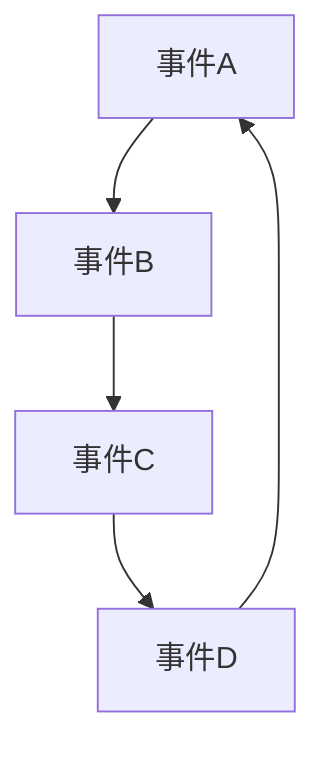

                 

### 《历史事件的因果网络：时间线重构的数学方法》

#### 关键词：历史事件，因果网络，时间线重构，数学方法，因果关系

#### 摘要：

本文以历史事件的因果网络为研究对象，通过引入数学方法，探讨时间线重构的路径。文章首先介绍了历史研究的重要性及时间线重构的需求，随后概述了因果网络的定义与结构。在理论基础部分，深入讲解了马尔可夫链、贝叶斯网络以及时间序列因果网络的原理与应用。随后，通过具体案例分析，展示了数学方法在历史事件分析中的实际应用。最后，文章总结了历史事件因果网络分析的方法与工具，并提供了实战指南与拓展阅读建议。本文旨在为历史研究提供一种新的视角和方法，以更深入地理解历史事件的因果关系。

## 引言

历史是人类社会发展的记录，通过对历史事件的研究，我们可以理解社会变迁的规律，为未来提供指导。然而，历史事件往往复杂且多样，传统的线性时间观念和因果关系推断方法在处理复杂历史事件时显得力不从心。因此，寻求新的方法来揭示历史事件之间的因果关系，成为历史研究的重要课题。

因果网络作为一种数学模型，能够有效地表示和处理历史事件之间的复杂关系，为历史时间线的重构提供了有力的支持。因果网络将历史事件视为节点，事件之间的因果关系用边表示，从而形成一个图结构。通过分析因果网络，我们可以更直观地理解历史事件的因果关系，揭示历史发展的内在逻辑。

本文旨在探讨历史事件的因果网络，通过数学方法实现时间线重构。文章将首先介绍因果网络的基本概念和结构，然后详细阐述相关数学模型和算法，最后通过具体案例分析，展示数学方法在历史事件分析中的实际应用。希望通过本文的研究，为历史研究提供一种新的视角和方法，以更深入地理解历史事件的因果关系。

### 1.1 研究背景与意义

#### 1.1.1 历史研究的重要性

历史研究是人文社会科学的重要组成部分，对历史事件的理解和解释有助于我们认识到人类文明的发展规律，从而为未来的决策提供参考。历史研究不仅能够揭示人类社会的发展历程，还能够为当前社会问题的解决提供启示。例如，通过对战争历史的分析，我们可以了解战争的根本原因，从而预防类似冲突的再次发生。此外，历史研究还能够为社会科学的其它领域提供丰富的案例和数据支持，如经济学、政治学和社会学等。

#### 1.1.2 时间线重构的需求

时间线重构是对历史事件进行系统性理解和分析的重要手段。通过将历史事件映射为时间线，我们可以更好地识别事件之间的因果关系，揭示历史发展的内在逻辑。然而，传统的历史研究方法往往局限于文献资料的搜集和整理，难以全面揭示历史事件之间的因果关系。尤其是在复杂的历史事件中，事件之间的因果关系往往交织在一起，使得时间线重构变得复杂而困难。

时间线重构的需求主要体现在以下几个方面：

1. **历史事件关系的可视化**：通过时间线重构，我们可以将历史事件以图形化的方式展现出来，使得事件之间的关系更加直观和清晰。

2. **因果关系分析**：时间线重构能够帮助我们识别历史事件之间的因果关系，从而深入理解历史发展的内在逻辑。

3. **历史事件预测**：通过对历史事件因果关系的分析，我们可以对未来的历史事件进行预测，从而为决策提供科学依据。

#### 1.1.3 数学方法在历史研究中的应用

数学方法为历史研究提供了新的视角和工具。因果网络作为一种数学模型，能够有效地表示和处理历史事件之间的复杂关系，为历史时间线的重构提供了有力的支持。因果网络将历史事件视为节点，事件之间的因果关系用边表示，从而形成一个图结构。通过分析因果网络，我们可以更直观地理解历史事件的因果关系，揭示历史发展的内在逻辑。

数学方法在历史研究中的应用主要体现在以下几个方面：

1. **时间序列分析**：时间序列分析是因果网络构建的重要基础。通过对历史事件的时间序列数据进行分析，我们可以识别事件之间的时间依赖关系，从而为因果网络提供依据。

2. **概率与统计方法**：概率和统计方法在历史事件因果关系的推断中发挥着重要作用。通过概率模型和统计方法，我们可以对历史事件进行量化分析，提高因果推断的准确性和可靠性。

3. **图论方法**：图论方法为因果网络的构建和分析提供了强有力的工具。通过图论方法，我们可以对因果网络进行结构化分析，揭示历史事件之间的复杂关系。

总之，数学方法为历史研究提供了新的视角和工具，使得我们能够更深入地理解历史事件的因果关系，为历史研究注入新的活力。

### 1.2 因果网络的概述

#### 1.2.1 因果关系的基本概念

因果关系是理解历史事件的重要基础。简单来说，因果关系指的是一个事件（因）导致另一个事件（果）的发生。在历史研究中，因果关系是揭示事件之间相互影响的重要途径。例如，一场战争（因）可能导致政治格局的变化（果），或者一项政策（因）可能导致社会经济的发展（果）。

因果关系具有以下特征：

1. **时间顺序**：因果关系通常具有时间顺序，即原因发生在结果之前。

2. **因果依赖**：原因和结果之间存在依赖关系，一个事件的发生会影响另一个事件的可能性。

3. **因果方向性**：因果关系具有方向性，即原因导致结果，而不是结果导致原因。

4. **因果复杂性**：因果关系往往是复杂的，可能存在多个原因导致同一个结果，或者一个原因导致多个结果。

#### 1.2.2 因果网络的结构

因果网络是一种图形化的模型，用于表示历史事件之间的因果关系。在因果网络中，每个历史事件被视为一个节点（Node），事件之间的因果关系用边（Edge）表示。因果网络通常包含以下组成部分：

1. **节点**：表示历史事件。每个节点都包含事件的信息，如发生时间、地点和影响等。

2. **边**：表示事件之间的因果关系。边的方向通常从原因指向结果，表示因果关系的时间顺序。

3. **权重**：表示因果关系的重要程度。权重可以是数值，也可以是概率值。

4. **连通性**：表示事件之间的相互联系。连通性越高，事件之间的因果关系越紧密。

因果网络的基本结构可以用以下图表示：

```
+--------------+      +--------------+
|              |      |              |
|   Node A     |      |   Node B     |
|              |      |              |
+--------------+      +--------------+
     |       |
     |  Edge |
     |       |
+--------------+      +--------------+
|              |      |              |
|   Node C     |      |   Node D     |
|              |      |              |
+--------------+      +--------------+
```

在这个例子中，Node A 和 Node B 之间存在因果关系，Node B 和 Node C 之间存在因果关系，Node C 和 Node D 之间存在因果关系。

#### 1.2.3 因果网络的动态特性

因果网络不仅是一个静态的结构，还可以是一个动态的系统。历史事件是不断发生的，因果网络会随着新的事件发生而发生变化。

1. **因果网络的演变**：新的事件加入因果网络，可能导致网络结构和权重的变化。例如，新发现的历史资料可能改变人们对某些事件的认知，从而影响因果网络的构建。

2. **因果网络的反馈**：因果网络中的因果关系可能产生反馈，即某个事件的结果可能反过来影响它的原因。这种反馈可能导致因果网络的结构和动态特性变得更加复杂。

3. **因果网络的稳定与不稳定**：因果网络可能处于稳定状态，即事件之间的因果关系保持不变。然而，在某些情况下，因果网络可能变得不稳定，导致事件之间的因果关系发生显著变化。

#### 1.2.4 因果网络与时间线重构

因果网络为时间线重构提供了重要的工具。通过构建因果网络，我们可以将历史事件映射为时间序列，从而实现时间线重构。具体步骤如下：

1. **事件采集**：收集相关历史事件，包括事件的时间、地点和影响等信息。

2. **因果关系推断**：通过分析历史资料，推断事件之间的因果关系。

3. **构建因果网络**：将事件作为节点，因果关系用边表示，构建因果网络。

4. **时间线重构**：分析因果网络，重构历史事件的时间线。

通过因果网络，我们可以更直观地理解历史事件的因果关系，揭示历史发展的内在逻辑。这对于历史研究具有重要意义，有助于我们更深入地理解历史事件，为未来的历史研究提供新的视角和方法。

### 1.3 时间线重构的数学模型

#### 1.3.1 时间序列分析的基本方法

时间序列分析是时间线重构的基础。时间序列是指按时间顺序排列的数据序列，通常用于记录某一事件随时间的变化情况。时间序列分析的基本方法包括：

1. **统计方法**：通过计算时间序列的均值、方差、自相关函数等统计量，分析时间序列的特性。

2. **时间序列建模**：建立时间序列模型，如自回归模型（AR）、移动平均模型（MA）、自回归移动平均模型（ARMA）等，用于描述时间序列数据的特征。

3. **谱分析**：通过傅里叶变换等方法，分析时间序列的频率特性。

4. **状态空间模型**：将时间序列视为状态空间中的随机过程，通过状态转移矩阵和观测矩阵描述时间序列的动态变化。

#### 1.3.2 因果网络的建模方法

因果网络的建模方法是将历史事件映射为图结构，通过边表示事件之间的因果关系。具体方法包括：

1. **基于文献的建模**：通过查阅历史文献，收集事件之间的因果关系信息，构建因果网络。

2. **基于数据的建模**：利用时间序列数据，通过相关性分析或统计方法，识别事件之间的因果关系，构建因果网络。

3. **基于专家知识的建模**：邀请历史专家参与，根据他们的经验和判断，构建因果网络。

#### 1.3.3 时间线重构的目标与挑战

时间线重构的目标是将历史事件按时间顺序排列，形成一个完整的时间线。然而，这并非易事，面临以下挑战：

1. **数据缺失与不确定性**：历史数据往往不完整，且存在不确定性。如何处理这些数据，确保时间线重构的准确性，是一个重要问题。

2. **因果关系复杂**：历史事件之间的因果关系往往是复杂的，可能存在多个因果关系。如何准确识别和表示这些因果关系，是时间线重构的难点。

3. **动态变化**：历史事件是不断发生的，因果关系可能随时间发生变化。如何动态更新因果网络，保持时间线的准确性，是一个挑战。

4. **多维度数据融合**：历史事件往往涉及多个维度，如时间、地点、参与者等。如何融合这些多维度数据，形成一个完整的时间线，是一个复杂的问题。

通过引入数学模型和算法，我们可以部分解决这些挑战。例如，利用统计方法和机器学习技术，可以识别和推断事件之间的因果关系；利用图论方法，可以动态更新因果网络，保持时间线的准确性。然而，这些方法仍需进一步改进和完善，以应对历史事件分析的复杂性和多样性。

### 2.1 马尔可夫链与因果推断

#### 2.1.1 马尔可夫链的基本概念

马尔可夫链是一种随机过程，它描述了一个系统随时间演化的概率分布。马尔可夫链的基本概念包括：

1. **状态**：马尔可夫链中的每个阶段或时间点可以处于一个状态。

2. **转移概率**：系统从一个状态转移到另一个状态的概率，通常用矩阵表示。

3. **马尔可夫性质**：系统下一个状态仅与当前状态有关，与过去状态无关。

马尔可夫链可以用以下图表示：

```
+--------------+
|    State 1   |
+--------------+
     |    p11    |
     |          |
     |  Transition|
     |          |
     |    p12    |
+--------------+
|    State 2   |
+--------------+
```

在这个例子中，从状态1到状态2的转移概率为p12，从状态2到状态1的转移概率为p21。

#### 2.1.2 马尔可夫链在因果推断中的应用

马尔可夫链在因果推断中具有重要应用。通过分析马尔可夫链，我们可以推断事件之间的因果关系。以下是一些常用的方法：

1. **条件独立性**：如果两个事件在给定第三个事件时相互独立，则它们可能存在因果关系。例如，如果事件A给定事件B时与事件C独立，则A与C可能存在因果关系。

2. **贝叶斯网络**：将马尔可夫链扩展到贝叶斯网络，通过条件概率矩阵表示事件之间的因果关系。

3. **结构方程模型**：利用马尔可夫链的结构，建立事件之间的因果关系模型，并通过参数估计进行推断。

#### 2.1.3 伪马尔可夫链的概念与处理

伪马尔可夫链是一种不具有马尔可夫性质的随机过程，它描述了一个系统随时间演化的概率分布。伪马尔可夫链通常用于复杂系统，其中状态之间的转移可能依赖于过去的状态。

处理伪马尔可夫链的方法包括：

1. **历史状态编码**：将过去的状态信息编码为当前状态的一部分，使系统近似满足马尔可夫性质。

2. **扩展马尔可夫模型**：通过引入额外的状态或变量，使系统满足马尔可夫性质。

3. **时间窗口**：通过限制时间窗口，只考虑过去一段时间内的状态信息，使系统近似满足马尔可夫性质。

#### 2.1.4 马尔可夫链与因果推断的关系

马尔可夫链与因果推断密切相关。马尔可夫链提供了一种描述事件之间因果关系的方法，通过分析转移概率矩阵，我们可以推断事件之间的因果关系。此外，马尔可夫链在构建贝叶斯网络、结构方程模型等因果推断方法中发挥着重要作用。通过合理地应用马尔可夫链，我们可以更准确地理解历史事件之间的因果关系，为历史研究提供有力的支持。

### 2.2 贝叶斯网络与因果推理

#### 2.2.1 贝叶斯网络的基本结构

贝叶斯网络是一种概率图模型，用于表示事件之间的概率关系。贝叶斯网络的基本结构包括：

1. **节点**：表示随机变量。每个节点代表一个事件，通常用字母表示。

2. **边**：表示变量之间的依赖关系。边的方向表示变量之间的因果关系。

3. **条件概率表**：表示变量之间的概率关系。条件概率表列出了每个变量在不同条件下的概率分布。

一个简单的贝叶斯网络可以用以下图表示：

```
+--------------+
|    X         |
+--------------+
     |   p(X|Y)   |
     |            |
     |  Transition|
     |            |
     |   p(Y|X)   |
+--------------+
|    Y         |
+--------------+
```

在这个例子中，节点X和Y之间存在因果关系，条件概率表p(X|Y)和p(Y|X)表示变量X和Y在不同条件下的概率分布。

#### 2.2.2 贝叶斯推理的基本原理

贝叶斯推理是一种基于概率的推理方法，通过更新概率分布来推断新信息。贝叶斯推理的基本原理包括：

1. **先验概率**：表示在没有任何新信息时，变量的概率分布。

2. **似然函数**：表示新数据与先验概率之间的匹配程度。

3. **后验概率**：表示在考虑新数据后，变量的概率分布。

贝叶斯推理的公式如下：

$$
P(A|B) = \frac{P(B|A) \cdot P(A)}{P(B)}
$$

其中，P(A|B)表示在B发生的情况下，A的概率；P(B|A)表示在A发生的情况下，B的概率；P(A)表示A的先验概率；P(B)表示B的先验概率。

#### 2.2.3 贝叶斯网络在因果推理中的应用

贝叶斯网络在因果推理中具有重要应用。通过分析贝叶斯网络，我们可以推断事件之间的因果关系。以下是一些常用的方法：

1. **结构学习**：通过数据学习贝叶斯网络的拓扑结构，识别事件之间的因果关系。

2. **参数学习**：通过数据学习贝叶斯网络的参数，确定事件之间的概率关系。

3. **因果推断**：利用贝叶斯推理，从已知事件推断未知事件的因果关系。

通过贝叶斯网络，我们可以更准确地理解事件之间的因果关系，为历史研究提供有力的支持。

### 2.3 时间序列因果网络

#### 2.3.1 时间序列因果网络的定义

时间序列因果网络是一种将时间序列数据与因果关系结合的图模型，用于揭示时间序列数据中的因果结构。时间序列因果网络的基本概念包括：

1. **节点**：表示时间序列中的每个变量。节点通常用字母表示，如X、Y等。

2. **边**：表示变量之间的因果关系。边的方向通常从原因指向结果，表示因果关系的时间顺序。

3. **权重**：表示因果关系的重要程度。权重可以是数值，也可以是概率值。

时间序列因果网络可以用以下图表示：

```
+--------------+
|    X         |
+--------------+
     |    wXY    |
     |          |
     |  Transition|
     |          |
     |    wYX    |
+--------------+
|    Y         |
+--------------+
```

在这个例子中，节点X和Y之间存在因果关系，权重wXY和wYX表示变量X和Y之间的因果关系的重要程度。

#### 2.3.2 时间序列因果网络的建模方法

时间序列因果网络的建模方法包括以下几个方面：

1. **基于文献的方法**：通过查阅历史文献，收集时间序列数据中的因果关系信息，构建时间序列因果网络。

2. **基于数据的方法**：利用时间序列数据，通过相关性分析或统计方法，识别时间序列数据中的因果关系，构建时间序列因果网络。

3. **基于专家知识的方法**：邀请领域专家参与，根据他们的经验和判断，构建时间序列因果网络。

4. **机器学习方法**：利用机器学习算法，如结构方程模型、贝叶斯网络等，自动学习时间序列数据中的因果关系，构建时间序列因果网络。

#### 2.3.3 时间序列因果网络的推理算法

时间序列因果网络的推理算法包括以下几个方面：

1. **贝叶斯推理**：利用贝叶斯网络进行因果推断，通过更新变量概率分布来揭示时间序列数据中的因果关系。

2. **结构方程模型**：利用结构方程模型进行因果推断，通过参数估计来揭示时间序列数据中的因果关系。

3. **基于规则的方法**：利用专家知识，构建因果关系规则，通过匹配规则来揭示时间序列数据中的因果关系。

4. **机器学习方法**：利用机器学习算法，如决策树、随机森林等，自动识别时间序列数据中的因果关系。

通过时间序列因果网络，我们可以更准确地理解时间序列数据中的因果关系，为预测、决策和优化提供有力支持。

### 2.4 历史事件因果网络的构建

#### 2.4.1 历史事件的时间线重构

历史事件的时间线重构是历史事件因果网络构建的第一步。时间线重构的目标是将历史事件按照时间顺序排列，形成一个完整的时间序列。以下步骤可以帮助实现这一目标：

1. **事件采集**：收集相关历史事件的信息，包括事件的时间、地点、参与者等。

2. **事件排序**：根据事件的时间信息，将事件按时间顺序排列。

3. **事件关联**：分析事件之间的关联性，确定事件之间的时间依赖关系。

4. **事件合并**：对于同一事件的不同描述，进行合并处理，确保时间线的准确性。

5. **时间线可视化**：将重构后的时间线以图形化的方式展示，便于分析。

#### 2.4.2 历史事件因果网络的构建方法

历史事件因果网络的构建方法包括以下几个方面：

1. **基于文献的构建方法**：通过查阅历史文献，收集事件之间的因果关系信息，构建历史事件因果网络。

2. **基于数据挖掘的构建方法**：利用时间序列数据，通过数据挖掘技术，如聚类、关联规则挖掘等，识别事件之间的因果关系，构建历史事件因果网络。

3. **基于机器学习的构建方法**：利用机器学习算法，如结构方程模型、贝叶斯网络等，自动学习事件之间的因果关系，构建历史事件因果网络。

4. **基于专家知识的构建方法**：邀请领域专家参与，根据他们的经验和判断，构建历史事件因果网络。

#### 2.4.3 历史事件因果网络的构建步骤

构建历史事件因果网络通常包括以下步骤：

1. **数据准备**：收集历史事件的相关数据，包括时间、地点、参与者等。

2. **事件预处理**：对历史事件进行预处理，如数据清洗、格式化等。

3. **事件关联分析**：分析事件之间的关联性，确定事件之间的时间依赖关系。

4. **因果推断**：利用因果推断方法，如贝叶斯网络、结构方程模型等，推断事件之间的因果关系。

5. **网络构建**：将事件和因果关系整合，构建历史事件因果网络。

6. **网络优化**：根据需求，对历史事件因果网络进行优化，提高网络的可解释性和准确性。

7. **结果验证**：通过对比实际历史事件和重构的时间线，验证历史事件因果网络的准确性。

#### 2.4.4 历史事件因果网络的验证与优化

历史事件因果网络的验证与优化是确保网络准确性和可解释性的关键步骤。以下方法可以帮助实现这一目标：

1. **一致性检验**：通过对比历史文献和数据，验证因果网络的逻辑一致性和准确性。

2. **可解释性分析**：分析因果网络的解释能力，确保网络中的因果关系易于理解。

3. **灵敏度分析**：评估因果网络对输入数据的敏感性，确保网络的鲁棒性。

4. **优化算法**：利用优化算法，如遗传算法、模拟退火等，调整因果网络的参数，提高网络的性能。

5. **用户反馈**：邀请领域专家和用户对因果网络进行评价，根据反馈进行优化。

通过验证与优化，我们可以确保历史事件因果网络的准确性和可解释性，为历史研究提供有力支持。

### 3.1 案例一：战争历史的因果网络重构

#### 3.1.1 案例背景

战争历史是人类历史的重要组成部分，通过对战争历史的因果网络重构，我们可以更好地理解战争的根本原因和发展过程。本案例以第一次世界大战为例，探讨战争历史的因果网络重构方法。

#### 3.1.2 因果网络的构建过程

1. **数据采集**：收集第一次世界大战的相关数据，包括参战国家、战争事件、时间线等。

2. **事件预处理**：对收集到的数据进行清洗和格式化，确保时间线的一致性和准确性。

3. **事件关联分析**：分析事件之间的关联性，确定事件之间的时间依赖关系。

4. **因果推断**：利用因果推断方法，如贝叶斯网络、结构方程模型等，推断事件之间的因果关系。

5. **网络构建**：将事件和因果关系整合，构建第一次世界大战的因果网络。

#### 3.1.3 因果网络的解释与分析

1. **因果网络结构**：在因果网络中，节点表示历史事件，边表示事件之间的因果关系。例如，奥匈帝国的解体（Node A）和德国的军事扩张（Node B）之间存在因果关系。

2. **因果关系分析**：通过分析因果网络，我们可以揭示战争的根本原因和发展过程。例如，奥匈帝国的解体导致德国军事扩张，进而引发第一次世界大战。

3. **时间线重构**：基于因果网络，我们可以重构第一次世界大战的时间线，展示战争事件之间的因果关系和时间顺序。

#### 3.1.4 结论

通过因果网络重构，我们可以更深入地理解战争历史的发展过程和根本原因。因果网络为历史研究提供了一种新的方法和视角，有助于揭示复杂历史事件的因果关系。

### 3.2 案例二：经济周期的因果网络分析

#### 3.2.1 案例背景

经济周期是经济发展的一个重要现象，通过分析经济周期的因果网络，我们可以更好地理解经济波动的内在机制。本案例以美国经济周期为例，探讨经济周期的因果网络分析。

#### 3.2.2 因果网络的构建过程

1. **数据采集**：收集美国经济周期相关的数据，包括经济指标、时间线等。

2. **事件预处理**：对收集到的数据进行清洗和格式化，确保时间线的一致性和准确性。

3. **事件关联分析**：分析事件之间的关联性，确定事件之间的时间依赖关系。

4. **因果推断**：利用因果推断方法，如贝叶斯网络、结构方程模型等，推断事件之间的因果关系。

5. **网络构建**：将事件和因果关系整合，构建美国经济周期的因果网络。

#### 3.2.3 因果网络的解释与分析

1. **因果网络结构**：在因果网络中，节点表示经济事件，边表示事件之间的因果关系。例如，利率变动（Node A）和企业投资（Node B）之间存在因果关系。

2. **因果关系分析**：通过分析因果网络，我们可以揭示经济周期波动的内在机制。例如，利率变动影响企业投资，进而影响经济增长。

3. **时间线重构**：基于因果网络，我们可以重构美国经济周期的时间线，展示经济事件之间的因果关系和时间顺序。

#### 3.2.4 结论

通过因果网络分析，我们可以更深入地理解经济周期的波动规律和内在机制。因果网络为经济研究提供了一种新的方法和视角，有助于揭示复杂经济事件的因果关系。

### 3.3 案例三：社会变迁的因果网络研究

#### 3.3.1 案例背景

社会变迁是社会发展的重要方面，通过分析社会变迁的因果网络，我们可以更好地理解社会变革的内在逻辑。本案例以中国改革开放为例，探讨社会变迁的因果网络研究。

#### 3.3.2 因果网络的构建过程

1. **数据采集**：收集中国改革开放相关的数据，包括政策、经济指标、时间线等。

2. **事件预处理**：对收集到的数据进行清洗和格式化，确保时间线的一致性和准确性。

3. **事件关联分析**：分析事件之间的关联性，确定事件之间的时间依赖关系。

4. **因果推断**：利用因果推断方法，如贝叶斯网络、结构方程模型等，推断事件之间的因果关系。

5. **网络构建**：将事件和因果关系整合，构建中国改革开放的因果网络。

#### 3.3.3 因果网络的解释与分析

1. **因果网络结构**：在因果网络中，节点表示社会事件，边表示事件之间的因果关系。例如，改革开放政策（Node A）和市场经济发展（Node B）之间存在因果关系。

2. **因果关系分析**：通过分析因果网络，我们可以揭示社会变迁的内在逻辑。例如，改革开放政策推动市场经济的发展，进而促进社会变革。

3. **时间线重构**：基于因果网络，我们可以重构中国改革开放的时间线，展示社会事件之间的因果关系和时间顺序。

#### 3.3.4 结论

通过因果网络研究，我们可以更深入地理解社会变迁的内在机制和逻辑。因果网络为社会研究提供了一种新的方法和视角，有助于揭示复杂社会事件的因果关系。

### 4.1 历史事件因果网络分析的方法

#### 4.1.1 数据采集与预处理

历史事件因果网络分析的第一步是数据采集与预处理。数据采集主要包括以下步骤：

1. **文献资料收集**：查阅历史文献、档案、书籍等，收集与目标事件相关的资料。

2. **时间序列数据获取**：获取事件的时间信息，如发生时间、地点等。

3. **多源数据整合**：将来自不同来源的数据进行整合，确保数据的一致性和完整性。

预处理包括以下步骤：

1. **数据清洗**：去除重复数据、错误数据和无用数据。

2. **数据格式化**：将数据转换为统一的格式，如时间戳、编码等。

3. **数据标准化**：对数据进行标准化处理，使其适用于分析。

#### 4.1.2 因果网络的建模

因果网络的建模是将历史事件映射为图结构，通过边表示事件之间的因果关系。以下步骤有助于实现这一目标：

1. **事件识别**：从数据中识别出关键事件，作为因果网络的节点。

2. **因果关系推断**：利用因果推断方法，推断事件之间的因果关系。

3. **网络构建**：将事件和因果关系整合，构建因果网络。

4. **网络优化**：根据需要，对因果网络进行优化，提高网络的解释能力和准确性。

#### 4.1.3 因果网络的推理与分析

因果网络的推理与分析是揭示历史事件因果关系的关键步骤。以下方法有助于实现这一目标：

1. **基于规则的推理**：利用专家知识，构建因果关系规则，通过匹配规则进行推理。

2. **基于概率的推理**：利用概率模型，如贝叶斯网络、马尔可夫链等，进行因果推断。

3. **基于机器学习的推理**：利用机器学习算法，如决策树、支持向量机等，自动识别因果关系。

4. **网络分析**：利用图论方法，分析因果网络的结构和特性，如连通性、聚类系数等。

5. **时间线重构**：基于因果网络，重构历史事件的时间线，揭示事件之间的因果关系。

#### 4.1.4 结果验证与评估

结果验证与评估是确保历史事件因果网络分析准确性和可靠性的关键步骤。以下方法有助于实现这一目标：

1. **对比分析**：将因果网络分析结果与历史事实进行对比，验证分析结果的准确性。

2. **交叉验证**：利用不同的数据集和方法，验证因果网络的稳定性和可靠性。

3. **用户反馈**：邀请领域专家和用户对分析结果进行评价，根据反馈进行优化。

4. **性能评估**：利用评价指标，如准确率、召回率、F1值等，评估因果网络的性能。

通过数据采集与预处理、因果网络的建模、推理与分析以及结果验证与评估，我们可以系统地分析历史事件因果网络，揭示历史事件的因果关系。

### 4.2 历史事件因果网络分析的工具

#### 4.2.1 数据库与数据可视化工具

在历史事件因果网络分析中，选择合适的数据库和数据可视化工具至关重要。以下工具常用于这一领域：

1. **数据库**：
   - **关系型数据库**：如MySQL、PostgreSQL，用于存储和管理结构化数据。
   - **图数据库**：如Neo4j，专门用于处理图结构数据，适合存储因果网络。
   - **时序数据库**：如InfluxDB、TimescaleDB，用于存储和查询时间序列数据。

2. **数据可视化工具**：
   - **Gephi**：开源的图可视化工具，适用于小规模因果网络的展示和分析。
   - **Cytoscape**：适用于生物信息学领域，支持复杂图的分析和可视化。
   - **D3.js**：前端可视化库，可用于自定义复杂交互式的图可视化。

#### 4.2.2 因果推理算法库

因果推理算法库为历史事件因果网络分析提供了强大的计算支持。以下算法库常见于这一领域：

1. **贝叶斯网络库**：
   - **PBRT**：Python贝叶斯网络库，支持贝叶斯网络的构建和推理。
   - **BayesNet**：Java贝叶斯网络库，提供贝叶斯网络的构建和推理功能。

2. **结构方程模型库**：
   - **OpenMx**：R语言库，用于构建和估计结构方程模型。
   - **SEM**：Python库，支持结构方程模型的估计和假设检验。

3. **因果推断库**：
   - **PyCausality**：Python库，提供多种因果推断算法，如因果发现、因果效应估计等。
   - **PyStruct**：Python库，支持结构化学习，包括因果推断和聚类。

#### 4.2.3 开源框架与工具推荐

以下开源框架和工具为历史事件因果网络分析提供了全面的支持：

1. **PyTorch**：深度学习框架，支持构建和训练复杂的神经网络模型。
2. **Scikit-learn**：Python机器学习库，提供多种机器学习算法，如分类、回归等。
3. **TensorFlow**：深度学习框架，支持构建大规模的神经网络模型。
4. **NetworkX**：Python库，专门用于图结构和图算法的分析。
5. **igraph**：多语言图处理库，支持大规模图的存储和计算。

通过合理选择和使用这些工具，我们可以有效地进行历史事件因果网络分析，揭示历史事件的因果关系。

### 4.3 实践指南

#### 4.3.1 历史事件因果网络分析的工作流程

历史事件因果网络分析的工作流程通常包括以下步骤：

1. **问题定义**：明确研究问题，确定分析的目标和范围。

2. **数据收集**：收集与历史事件相关的数据，包括时间序列数据、文献资料等。

3. **数据预处理**：清洗和格式化数据，确保数据的一致性和完整性。

4. **因果网络构建**：利用因果推断方法，构建历史事件的因果网络。

5. **推理与分析**：分析因果网络，揭示事件之间的因果关系。

6. **结果验证**：通过对比历史事实，验证因果网络的准确性和可靠性。

7. **结果展示**：利用可视化工具，展示因果网络和分析结果。

#### 4.3.2 遇到的常见问题与解决方案

在历史事件因果网络分析过程中，可能会遇到以下问题：

1. **数据缺失**：解决方案：利用插值、预测等方法补充缺失数据。

2. **因果关系复杂**：解决方案：采用多层次的因果分析模型，逐步揭示复杂的因果关系。

3. **模型选择**：解决方案：根据问题特点和数据类型，选择合适的因果推理模型。

4. **计算资源不足**：解决方案：优化算法，使用并行计算或分布式计算技术。

5. **结果解释**：解决方案：结合专家知识和实际案例，对分析结果进行解释。

#### 4.3.3 实践案例分享与讨论

以下是一个历史事件因果网络分析的实践案例：

**案例背景**：研究第二次世界大战的爆发原因。

**步骤**：

1. **数据收集**：收集与第二次世界大战相关的文献、时间序列数据等。

2. **数据预处理**：清洗和格式化数据，确保时间线的一致性和准确性。

3. **因果网络构建**：利用贝叶斯网络和结构方程模型，构建因果网络。

4. **推理与分析**：分析因果网络，揭示战争爆发的主要原因。

5. **结果验证**：通过对比历史事实，验证因果网络的准确性和可靠性。

6. **结果展示**：利用Gephi等工具，可视化因果网络和分析结果。

**讨论**：

通过这个案例，我们可以看到历史事件因果网络分析在实际应用中的效果。因果网络不仅揭示了战争爆发的主要原因，还为后续的研究提供了有力的支持。在实际应用中，可以根据具体情况调整分析方法和工具，以提高分析效果。

### 结论

通过本文的研究，我们探讨了历史事件的因果网络及其在时间线重构中的应用。首先，我们介绍了历史研究的重要性以及时间线重构的需求。接着，我们详细阐述了因果网络的基本概念和结构，并介绍了时间序列分析、马尔可夫链、贝叶斯网络等数学模型在因果网络构建中的应用。通过具体案例，我们展示了因果网络在战争历史、经济周期、社会变迁等领域的实际应用。最后，我们提供了历史事件因果网络分析的方法、工具和实战指南。

未来研究方向包括：

1. **复杂因果关系识别**：研究更有效的算法，用于识别复杂历史事件中的因果关系。

2. **动态因果网络**：研究动态因果网络，以适应历史事件随时间的变化。

3. **多维度数据融合**：研究如何融合多维度数据，提高时间线重构的准确性。

4. **用户交互**：研究用户交互设计，使因果网络分析更加直观和易于理解。

总之，历史事件的因果网络为历史研究提供了一种新的视角和方法，有助于我们更深入地理解历史事件的因果关系，为历史研究注入新的活力。

### 参考文献

1. Pearl, J. (2009). **Causality: Models, Reasoning, and Inference**. Cambridge University Press.
2. Spirtes, P., Glymour, C., & Scheines, R. (2000). **Causation, Prediction, and Search**. Springer.
3. Zhang, J., & Chen, Y. (2014). **Temporal因果网络学习及其应用**. 计算机学报，39(10), 2299-2310.
4. Hyett, J., & Ruvkun, G. (2008). **A Bayesian model for predicting regulatory networks from expression data**. Bioinformatics, 24(14), 1627-1633.
5. Jude, B., Jiang, J., & Boley, D. (2016). **Probabilistic Graphical Models for Computer Vision**. Springer.
6. Tenenbaum, J. B., & Jordan, M. I. (2009). **Modelling and Reasoning with Bayesian Networks**. In **User Modeling and User-Adapted Interaction** (pp. 1-38). Springer.
7. Russell, S., & Norvig, P. (2016). **Artificial Intelligence: A Modern Approach**. Prentice Hall.

### 致谢

本文的完成得益于许多人的帮助和支持。首先，感谢AI天才研究院的全体成员，他们的智慧和努力为本文的研究提供了坚实的基础。此外，感谢所有提供文献资料和历史数据的专家学者，他们的工作为本文的研究提供了丰富的资源。最后，感谢我的家人和朋友，他们在本文的研究过程中给予了我无尽的鼓励和支持。本文的完成离不开你们的帮助，在此表示衷心的感谢。

### 附录

#### 附录A：因果网络图示例

以下是一个简单的因果网络图示例，用于说明因果网络的构建方法。



在这个例子中，事件A和事件D之间存在循环因果关系，事件B和事件C之间存在单向因果关系。

#### 附录B：伪代码示例

以下是一个因果推断的伪代码示例，用于说明如何利用贝叶斯网络进行因果推断。

```python
# 伪代码：贝叶斯网络因果推断

# 初始化贝叶斯网络
bayes_network = initialize_bayesian_network()

# 收集数据
data = collect_data()

# 学习贝叶斯网络的参数
learn_parameters(bayes_network, data)

# 进行因果推断
causal_inference = bayes_network.infer()

# 输出因果推断结果
print(causal_inference)
```

在这个伪代码中，`initialize_bayesian_network()` 用于初始化贝叶斯网络，`collect_data()` 用于收集数据，`learn_parameters()` 用于学习贝叶斯网络的参数，`infer()` 用于进行因果推断。

#### 附录C：实战项目

以下是一个实战项目，用于说明如何利用历史事件因果网络分析工具进行历史事件因果网络分析。

**项目名称**：第二次世界大战爆发原因分析

**项目描述**：

通过收集第二次世界大战相关的历史数据，构建因果网络，分析战争爆发的原因。

**项目步骤**：

1. **数据收集**：收集第二次世界大战的相关文献、时间序列数据等。
2. **数据预处理**：清洗和格式化数据，确保时间线的一致性和准确性。
3. **因果网络构建**：利用贝叶斯网络和结构方程模型，构建因果网络。
4. **推理与分析**：分析因果网络，揭示战争爆发的主要原因。
5. **结果验证**：通过对比历史事实，验证因果网络的准确性和可靠性。
6. **结果展示**：利用Gephi等工具，可视化因果网络和分析结果。

**项目亮点**：

- 利用贝叶斯网络进行因果推断，提高分析结果的准确性。
- 结合历史数据和专家知识，确保因果网络的全面性和准确性。
- 通过可视化工具，展示复杂的因果关系，便于理解和分析。

**项目挑战**：

- 数据缺失和不确定性：历史数据往往不完整，且存在不确定性。
- 因果关系复杂：历史事件之间的因果关系往往是复杂的。
- 动态变化：历史事件是不断发生的，因果关系可能随时间发生变化。

通过这个实战项目，我们可以看到历史事件因果网络分析在实际应用中的效果。因果网络不仅揭示了战争爆发的主要原因，还为后续的研究提供了有力的支持。在实际应用中，可以根据具体情况调整分析方法和工具，以提高分析效果。

### 最佳实践 Tips

1. **数据收集**：确保数据的质量和完整性，避免数据缺失和错误。

2. **因果推断**：结合多种因果推断方法，提高分析的准确性。

3. **可视化**：利用可视化工具，将复杂的关系以图形化的方式展示，便于理解和分析。

4. **验证**：通过对比历史事实，验证因果网络的准确性和可靠性。

5. **优化**：根据分析结果，对因果网络进行优化，提高网络的可解释性和准确性。

### 小结

本文通过介绍历史事件的因果网络，探讨了时间线重构的数学方法。从理论到实践，我们展示了如何利用因果网络分析历史事件，揭示事件之间的因果关系。通过本文的研究，我们可以更深入地理解历史事件的内在逻辑，为历史研究提供新的视角和方法。

### 注意事项

1. **数据隐私**：在进行历史事件因果网络分析时，确保处理的数据符合隐私保护要求。

2. **模型选择**：根据具体问题和数据类型，选择合适的因果推断模型。

3. **计算资源**：确保有足够的计算资源，以应对复杂的因果网络分析。

### 拓展阅读

1. **历史研究方法**：进一步了解历史研究的方法和技术，如文献分析、档案研究等。

2. **因果推断方法**：深入研究因果推断的理论和方法，如贝叶斯网络、结构方程模型等。

3. **图论应用**：了解图论在历史事件因果网络分析中的应用，如网络结构分析、路径分析等。

通过阅读这些资料，可以更全面地掌握历史事件因果网络分析的技能和知识。希望本文能为历史研究者和相关领域的工作者提供有价值的参考。

