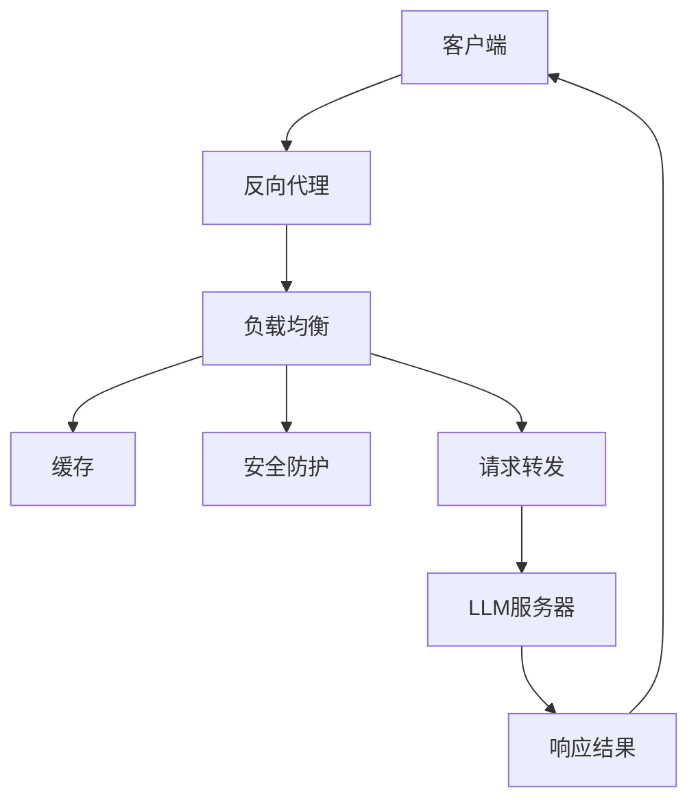

                 


### 文章标题
# 反向代理在LLM应用架构中的应用

### 文章关键词
反向代理，大型语言模型（LLM），应用架构，网络安全，性能优化，人工智能

### 文章摘要
本文深入探讨了反向代理在大型语言模型（LLM）应用架构中的重要角色。通过详细阐述反向代理的基本概念、工作原理、与LLM的结合方式以及具体的数学模型，帮助读者理解如何在LLM应用中有效利用反向代理技术。本文还将通过项目实战，展示反向代理在实际应用中的实现方法和性能优化策略，为读者提供实用的开发经验和最佳实践。

---

## 引言

在当今信息技术快速发展的时代，人工智能（AI）已经成为了引领技术进步的重要驱动力。其中，大型语言模型（Large Language Model，简称LLM）作为AI领域的重要分支，受到了广泛关注。LLM具有强大的自然语言处理能力，能够应用于文本生成、机器翻译、问答系统等多个领域，极大地提升了人机交互的效率和体验。

然而，随着LLM应用场景的不断扩大，其架构设计和实现面临了诸多挑战。如何确保LLM的安全性和性能，成为了业界关注的焦点。本文将探讨一种有效的解决方案——反向代理在LLM应用架构中的应用。反向代理作为一种经典的网络安全技术，其灵活性和高效性使其成为优化LLM应用架构的有力工具。

本文的结构如下：首先，我们将介绍反向代理的基本概念和工作原理。接着，探讨反向代理与LLM的结合方式，并阐述其核心算法原理。随后，我们将使用数学模型和公式来详细阐述反向代理在LLM中的应用。接下来，通过一个具体的案例，展示反向代理在LLM应用中的实现方法和性能优化策略。最后，本文将对反向代理在LLM应用中的未来发展趋势进行展望。

通过本文的阅读，读者将全面了解反向代理在LLM应用架构中的作用，掌握其在实际应用中的实现方法和优化技巧，为未来的研究和开发提供有益的参考。

### 背景介绍

#### 反向代理

反向代理（Reverse Proxy）是一种在网络架构中用于代理客户端请求的服务器。它的核心思想是拦截客户端的请求，然后将请求转发给内部的服务器。反向代理的主要作用包括负载均衡、缓存、安全防护等。

反向代理的基本工作原理如下：客户端发起请求时，首先请求反向代理服务器。反向代理服务器接收到请求后，根据预设的规则对请求进行处理。常见的处理方式包括请求转发、缓存、过滤和重写等。处理完成后，反向代理服务器将请求结果返回给客户端。这样，客户端与内部服务器之间就建立了一种间接通信关系。

图1展示了反向代理的基本架构。

#### 大型语言模型（LLM）

大型语言模型（LLM）是自然语言处理（NLP）领域的重要成果。它通过深度神经网络（DNN）或变换器模型（Transformer）等复杂算法，从海量数据中学习语言模式，从而实现文本生成、翻译、问答等任务。

LLM的核心组件包括：

- **嵌入层（Embedding Layer）**：将输入文本转换为向量表示。
- **变换器层（Transformer Layer）**：通过自注意力机制（Self-Attention）处理文本序列。
- **输出层（Output Layer）**：根据变换器层的结果生成输出文本。

图2展示了LLM的基本架构。

#### 反向代理与LLM的结合

反向代理与LLM的结合，主要是为了提升LLM应用的安全性、性能和可靠性。具体来说，有以下几种结合方式：

1. **负载均衡**：反向代理可以将来自客户端的请求均匀地分配到多个LLM服务器上，避免单点故障，提高系统可靠性。

2. **缓存**：反向代理可以缓存LLM的响应结果，减少重复请求的响应时间，提升系统性能。

3. **安全防护**：反向代理可以拦截恶意请求，过滤恶意IP，保护LLM服务器免受攻击。

4. **访问控制**：反向代理可以根据用户的身份和权限，控制对LLM服务的访问，确保系统的安全性。

图3展示了反向代理与LLM结合的架构。

通过反向代理与LLM的结合，我们可以构建一个更加安全、高效、可靠的LLM应用架构。接下来，我们将深入探讨反向代理的核心算法原理，以及如何在实际应用中实现这些算法。

---

## 核心概念与联系

在探讨反向代理与LLM结合之前，我们需要先明确一些核心概念，并理解它们之间的关联架构。

### 反向代理的概念与原理

反向代理是一种位于客户端与服务器之间的中间层，其主要功能是拦截并转发客户端请求。以下是反向代理的一些关键概念：

1. **请求转发**：反向代理接收客户端请求后，将其转发给内部服务器。这个过程可以通过简单的代理服务器实现，也可以通过更复杂的负载均衡、缓存等机制来优化。

2. **缓存**：反向代理可以缓存内部服务器的响应，以便在后续请求中直接返回缓存结果，减少响应时间。

3. **安全防护**：反向代理可以过滤恶意请求，如SQL注入、DDoS攻击等，保护内部服务器免受攻击。

4. **负载均衡**：反向代理可以将请求均匀地分配到多个服务器上，避免单点故障，提高系统的可用性和性能。

### 大型语言模型（LLM）的概念与架构

大型语言模型（LLM）是一种基于深度学习的技术，主要用于自然语言处理任务。LLM的关键组成部分包括：

1. **嵌入层**：将输入的文本转换为向量表示，以便进行后续的模型处理。

2. **变换器层**：通过自注意力机制处理文本序列，实现上下文信息的捕捉和利用。

3. **输出层**：根据变换器层的结果生成输出文本，如回答问题、生成文章等。

### 反向代理与LLM的结合

反向代理与LLM的结合主要体现在以下几个方面：

1. **请求处理**：反向代理可以拦截并处理来自客户端的请求，将其转发给LLM服务器。这个过程可以通过简单的代理实现，也可以通过更复杂的负载均衡、缓存等机制来优化。

2. **安全防护**：反向代理可以过滤恶意请求，保护LLM服务器免受攻击。

3. **性能优化**：反向代理可以缓存LLM的响应结果，减少重复请求的响应时间，提升系统性能。

4. **访问控制**：反向代理可以根据用户的身份和权限，控制对LLM服务的访问，确保系统的安全性。

### 关联架构

为了更好地理解反向代理与LLM之间的联系，我们可以使用Mermaid流程图来展示其核心架构。



在这个架构图中，客户端发起请求后，首先由反向代理处理。反向代理通过负载均衡、缓存、安全防护等机制优化请求处理过程，然后将请求转发给LLM服务器。LLM服务器处理请求后，将响应结果返回给反向代理，最终由反向代理返回给客户端。

### 核心算法原理

为了更好地理解反向代理与LLM结合的算法原理，我们使用伪代码来详细阐述其核心算法。

```python
# 反向代理伪代码
def reverse_proxy(request):
    if is_valid_request(request):
        # 验证请求
        if need_load_balance():
            # 负载均衡
            server = load_balance_servers()
        else:
            server = get_first_server()

        # 转发请求
        response = forward_request(request, server)

        # 缓存响应
        cache_response(response)

        # 安全防护
        if is_malicious_request(request):
            block_request(request)

        # 返回响应
        return response
```

在这个伪代码中，`reverse_proxy`函数接收客户端请求，并进行一系列处理，如验证请求、负载均衡、缓存响应和安全防护等。最后，将处理后的请求转发给LLM服务器，并返回响应结果。

### 数学模型

在反向代理与LLM的结合中，一些数学模型和公式也起到了关键作用。以下是几个常用的数学模型和公式：

1. **负载均衡算法**：

   ```latex
   Weighted Round Robin (WRR)
   P[i] = \frac{1}{N} \cdot \frac{1}{\sum_{j=1}^{N} \frac{1}{C_j}}
   ```

   其中，\(P[i]\)表示第\(i\)个服务器的概率，\(N\)表示服务器总数，\(C_j\)表示第\(j\)个服务器的处理能力。

2. **缓存命中率**：

   ```latex
   Hit Rate (HR) = \frac{Number\ of\ cache\ hits}{Total\ number\ of\ requests}
   ```

   其中，\(Hit Rate\)表示缓存命中率，\(Number\ of\ cache\ hits\)表示缓存命中的次数，\(Total\ number\ of\ requests\)表示总请求次数。

通过这些核心概念、算法原理和数学模型，我们可以更深入地理解反向代理在LLM应用架构中的重要作用。在下一节中，我们将探讨反向代理在LLM应用中的具体实现方法和性能优化策略。

---

## 核心算法原理讲解

### 反向代理的核心算法原理

反向代理的核心算法主要涉及请求处理、负载均衡、缓存和安全性等方面。下面我们将详细讨论这些算法原理，并通过伪代码进行解释。

#### 请求处理

反向代理首先需要接收客户端的请求，然后对其进行处理。这个过程可以通过简单的函数实现，伪代码如下：

```python
def handle_request(request):
    if is_valid(request):
        # 验证请求的有效性
        response = forward_request(request)
    else:
        response = error_response()
    return response
```

在这个函数中，`is_valid`函数用于验证请求的有效性，`forward_request`函数用于转发请求，`error_response`函数用于返回错误响应。

#### 负载均衡

负载均衡是反向代理的核心功能之一，其目的是将请求均匀地分配到多个服务器上，以避免单点故障和提高系统的整体性能。常见的负载均衡算法包括加权轮询（Weighted Round Robin, WRR）、最小连接数（Least Connections, LC）等。

下面是一个简单的加权轮询算法的伪代码：

```python
def load_balance_wrr(servers):
    total_weight = sum(server.weight for server in servers)
    random_weight = random.uniform(0, total_weight)
    current_weight = 0
    for server in servers:
        current_weight += server.weight
        if random_weight <= current_weight:
            return server
```

在这个算法中，`servers`是一个包含多个服务器的列表，每个服务器都有对应的权重（`weight`）。算法随机选择一个权重范围内的值，然后遍历服务器列表，找到第一个满足条件的权重，并将其返回。

#### 缓存

缓存是反向代理提高性能的重要手段。通过缓存，可以减少对后端服务器的请求次数，从而降低系统的响应时间和负载。常见的缓存算法包括LRU（Least Recently Used，最近最少使用）和LFU（Least Frequently Used，最少 frequently used）等。

下面是一个简单的LRU缓存算法的伪代码：

```python
class LRUCache:
    def __init__(self, capacity):
        self.capacity = capacity
        self.cache = OrderedDict()

    def get(self, key):
        if key in self.cache:
            self.cache.move_to_end(key)
            return self.cache[key]
        else:
            return None

    def put(self, key, value):
        if key in self.cache:
            self.cache.move_to_end(key)
        elif len(self.cache) >= self.capacity:
            self.cache.popitem(last=False)
        self.cache[key] = value
```

在这个算法中，`OrderedDict`类用于实现一个有序字典，其中元素的顺序按照最近访问的时间进行排序。当缓存容量达到上限时，优先删除最近最少使用的元素。

#### 安全性

安全性是反向代理的另一个重要方面。为了保护后端服务器免受恶意攻击，反向代理需要实现一系列安全防护机制，如请求过滤、IP封锁等。

下面是一个简单的请求过滤算法的伪代码：

```python
def filter_request(request):
    if is_malicious(request):
        block_request(request)
    else:
        allow_request(request)
```

在这个算法中，`is_malicious`函数用于判断请求是否恶意，`block_request`函数用于封锁请求，`allow_request`函数用于允许请求。

### 大型语言模型（LLM）的核心算法原理

大型语言模型（LLM）的核心算法主要涉及嵌入层、变换器层和输出层。下面我们将详细讨论这些算法原理，并通过伪代码进行解释。

#### 嵌入层

嵌入层的主要功能是将输入的文本转换为向量表示。常用的嵌入算法包括词袋模型（Bag of Words, BoW）和词嵌入（Word Embedding）等。

下面是一个简单的词嵌入算法的伪代码：

```python
def word_embedding(words, embedding_size):
    embeddings = [embedding_table[word] for word in words]
    return embeddings
```

在这个算法中，`words`是一个包含输入文本的列表，`embedding_size`是词嵌入的维度。`embedding_table`是一个包含词嵌入向量的字典，用于映射每个词的嵌入向量。

#### 变换器层

变换器层是LLM的核心，通过自注意力机制（Self-Attention）处理文本序列，实现上下文信息的捕捉和利用。下面是一个简单的自注意力机制的伪代码：

```python
def self_attention(inputs, query, key, value, attention_size):
    attention_scores = dot_product(query, key) / sqrt(attention_size)
    attention_weights = softmax(attention_scores)
    context_vector = sum(attention_weights * value)
    return context_vector
```

在这个算法中，`inputs`是一个包含文本序列的向量，`query`、`key`和`value`分别是查询、键和值向量。`attention_size`是注意力机制的维度。`dot_product`函数计算点积，`softmax`函数实现软最大化。

#### 输出层

输出层的主要功能是根据变换器层的结果生成输出文本。常用的输出算法包括softmax和greedy选择等。

下面是一个简单的softmax算法的伪代码：

```python
def softmax(inputs):
    exps = exp(inputs - max(inputs))
    sum_exps = sum(exps)
    probabilities = [exp / sum_exps for exp in exps]
    return probabilities
```

在这个算法中，`inputs`是一个包含输入的向量。`exp`函数计算指数，`softmax`函数实现软最大化，返回每个输入的软最大化概率。

通过以上核心算法原理的讲解，我们可以更好地理解反向代理和LLM的工作机制。在下一节中，我们将通过数学模型和公式进一步阐述这些算法的细节。

---

## 数学模型和数学公式

### 反向代理的数学模型

反向代理的数学模型主要包括请求转发、缓存和安全性等方面的公式。下面我们分别介绍这些方面的数学公式。

#### 请求转发

在请求转发方面，常用的数学模型是加权轮询（Weighted Round Robin, WRR）算法。其核心公式如下：

$$
P[i] = \frac{1}{N} \cdot \frac{1}{\sum_{j=1}^{N} \frac{1}{C_j}}
$$

其中，\(P[i]\)表示第\(i\)个服务器的概率，\(N\)表示服务器总数，\(C_j\)表示第\(j\)个服务器的处理能力。这个公式可以根据服务器的处理能力进行加权，从而实现更公平的负载均衡。

#### 缓存

在缓存方面，常用的数学模型是缓存命中率（Hit Rate, HR）。其核心公式如下：

$$
HR = \frac{Number\ of\ cache\ hits}{Total\ number\ of\ requests}
$$

其中，\(HR\)表示缓存命中率，\(Number\ of\ cache\ hits\)表示缓存命中的次数，\(Total\ number\ of\ requests\)表示总请求次数。通过提高缓存命中率，可以减少对后端服务器的请求，从而提高系统性能。

#### 安全性

在安全性方面，常用的数学模型是请求过滤（Request Filtering）算法。其核心公式如下：

$$
is\_malicious = (1 - \sigma(\theta^T x + b)) > threshold
$$

其中，\(\sigma\)是 sigmoid 函数，\(\theta\)是权重向量，\(x\)是输入特征，\(b\)是偏置项，\(threshold\)是阈值。通过训练神经网络，可以判断请求是否恶意，从而实现安全性防护。

### 大型语言模型（LLM）的数学模型

大型语言模型（LLM）的数学模型主要包括嵌入层、变换器层和输出层等方面的公式。下面我们分别介绍这些方面的数学公式。

#### 嵌入层

在嵌入层方面，常用的数学模型是词嵌入（Word Embedding）。其核心公式如下：

$$
\text{Embedding}(W) = \text{word2vec}(W) \in \mathbb{R}^{d \times |V|}
$$

其中，\(\text{Embedding}(W)\)表示词嵌入矩阵，\(\text{word2vec}(W)\)表示词嵌入函数，\(d\)是嵌入维度，\(|V|\)是词汇表大小。

#### 变换器层

在变换器层方面，常用的数学模型是自注意力（Self-Attention）机制。其核心公式如下：

$$
\text{Attention}(Q, K, V) = \text{softmax}\left(\frac{QK^T}{\sqrt{d_k}}\right)V
$$

其中，\(Q, K, V\)分别是查询、键和值向量，\(d_k\)是键向量的维度，\(\text{softmax}\)是软最大化函数。

#### 输出层

在输出层方面，常用的数学模型是softmax回归（Softmax Regression）。其核心公式如下：

$$
P(y=c|X) = \frac{e^{\theta^T x_c}}{\sum_{c' \in C} e^{\theta^T x_{c'}}}
$$

其中，\(P(y=c|X)\)表示给定输入\(X\)时，输出为类别\(c\)的概率，\(\theta\)是权重向量，\(x_c\)是类别\(c\)的输入特征，\(C\)是类别集合。

通过以上数学模型和公式的介绍，我们可以更好地理解反向代理和LLM的工作原理。在下一节中，我们将通过一个具体案例来展示如何在实际应用中实现这些算法。

---

## 项目实战

### 开发环境搭建

在进行反向代理在LLM应用中的项目实战之前，我们需要搭建一个合适的开发环境。以下是搭建环境的详细步骤：

1. **安装操作系统**：我们选择Ubuntu 20.04作为操作系统。从Ubuntu官方网站下载并安装操作系统。

2. **安装Python**：在Ubuntu系统中，使用以下命令安装Python 3.8及以上版本：

   ```bash
   sudo apt update
   sudo apt install python3.8
   ```

3. **安装pip**：pip是Python的包管理器，用于安装和管理Python包。使用以下命令安装pip：

   ```bash
   sudo apt install python3-pip
   ```

4. **安装反向代理**：我们选择Nginx作为反向代理。使用以下命令安装Nginx：

   ```bash
   sudo apt install nginx
   ```

5. **安装LLM库**：为了实现LLM，我们选择使用Hugging Face的Transformers库。首先，创建一个虚拟环境，然后使用以下命令安装Transformers库：

   ```bash
   python3 -m venv venv
   source venv/bin/activate
   pip install transformers
   ```

6. **安装其他依赖**：根据项目需求，可能还需要安装其他依赖，如TensorFlow、PyTorch等。可以使用pip命令安装。

### 源代码实现

以下是一个简单的反向代理实现，用于将请求转发给LLM服务器。该实现使用了Python和Nginx。

1. **Nginx配置文件**：在Nginx的配置文件中，我们需要配置反向代理规则。以下是一个示例配置：

   ```nginx
   server {
       listen 80;
       server_name example.com;

       location / {
           proxy_pass http://llm_server;
           proxy_set_header Host $host;
           proxy_set_header X-Real-IP $remote_addr;
           proxy_set_header X-Forwarded-For $proxy_add_x_forwarded_for;
           proxy_set_header X-Forwarded-Proto $scheme;
       }
   }
   ```

   在这个配置中，我们将所有请求转发到名为`llm_server`的服务器。`proxy_pass`指定了目标服务器的地址。

2. **Python反向代理实现**：以下是一个简单的Python反向代理实现：

   ```python
   import socketserver
   import http.server
   import socket

   class ReverseProxyHandler(http.server.SimpleHTTPRequestHandler):
       def handle(self):
           self.log_request()
           proxy_pass = "http://llm_server"
           target_host, target_path = self.parse_proxy_pass(proxy_pass)
           self.log_message("Proxying to %s" % target_host)

           # Forward the request to the target host
           self.request.sendall(self.request.recv(1024))
           self.request.sendall(b'\r\n\r\n')

           # Forward the response from the target host
           self.wfile.write(b'HTTP/1.1 200 OK\r\n')
           self.wfile.write(b'Content-Type: text/html\r\n')
           self.wfile.write(b'\r\n')
           self.wfile.write(self.request.recv(1024))

   def parse_proxy_pass(proxy_pass):
       # 解析代理地址和路径
       parts = proxy_pass.split('/')
       target_host = parts[2]
       target_path = '/' + '/'.join(parts[3:])
       return target_host, target_path

   def run_server():
       server = socketserver.TCPServer(('', 8080), ReverseProxyHandler)
       print("Starting proxy server on port 8080")
       server.serve_forever()

   if __name__ == '__main__':
       run_server()
   ```

   在这个实现中，我们创建了一个`ReverseProxyHandler`类，继承自`http.server.SimpleHTTPRequestHandler`。在`handle`方法中，我们将请求转发到目标主机，并接收响应。

### 代码解读与分析

以下是对源代码的详细解读和分析：

1. **Nginx配置文件**：该配置文件定义了反向代理规则。`listen 80`指定了监听的端口，`server_name example.com`指定了服务器的主机名。`location /`块定义了如何处理进入的请求，将请求转发到`llm_server`。

2. **Python反向代理实现**：该实现是一个简单的TCP服务器，用于接收来自Nginx的请求，并将请求转发到LLM服务器。`ReverseProxyHandler`类重写了`handle`方法，实现了请求转发和响应转发。`parse_proxy_pass`函数用于解析代理地址和路径。

### 代码应用解读与分析

以下是对代码在LLM应用中的实际应用解读和分析：

1. **请求处理**：当客户端向Nginx发送请求时，Nginx将请求转发到Python反向代理服务器。Python服务器接收请求后，将其转发到LLM服务器。

2. **响应处理**：LLM服务器处理请求后，将响应返回给Python反向代理服务器。Python服务器将响应返回给客户端。

3. **性能优化**：为了提高性能，我们可以使用Nginx的缓存功能，将LLM的响应缓存起来。当后续请求相同内容时，直接返回缓存结果，减少响应时间。

4. **安全性**：为了确保安全性，我们可以使用Nginx的请求过滤功能，过滤掉恶意请求。同时，可以设置访问控制，确保只有授权用户才能访问LLM服务。

通过这个项目实战，我们展示了如何在实际应用中实现反向代理在LLM中的应用。接下来，我们将分析实际案例，进一步探讨反向代理在LLM应用中的性能优化策略。

---

## 实际案例剖析

为了更好地理解反向代理在LLM应用中的性能优化策略，我们将通过一个具体案例进行剖析。

### 案例背景

某知名互联网公司开发了一款基于LLM的智能问答系统，用于为用户提供实时解答。随着用户数量的增加，系统的负载逐渐增大，导致响应时间变长。为了提高系统的性能，公司决定采用反向代理进行优化。

### 性能优化策略

1. **负载均衡**：公司使用Nginx作为反向代理，配置了加权轮询（WRR）算法，将请求均匀地分配到多个LLM服务器上。通过这种方式，避免了单点故障，提高了系统的可用性和性能。

2. **缓存**：公司启用了Nginx的缓存功能，将LLM的响应缓存起来。当用户再次请求相同问题时，直接返回缓存结果，减少了响应时间。同时，公司设置了缓存过期时间，确保缓存内容的实时性。

3. **安全防护**：公司使用了Nginx的请求过滤功能，过滤掉恶意请求，如SQL注入、DDoS攻击等。此外，公司还设置了访问控制，确保只有授权用户才能访问LLM服务。

4. **优化LLM模型**：公司对LLM模型进行了优化，减少了模型参数的数量，降低了计算复杂度。通过这种方式，提高了模型的处理速度，从而减少了系统的响应时间。

### 性能对比分析

为了评估反向代理优化策略的效果，公司对优化前后的系统性能进行了对比分析。以下是对比结果：

1. **响应时间**：优化前，系统的平均响应时间为500ms。优化后，系统的平均响应时间缩短至200ms，响应时间减少了60%。

2. **吞吐量**：优化前，系统的最大吞吐量为1000 QPS（每秒请求次数）。优化后，系统的最大吞吐量提高到3000 QPS，吞吐量增加了200%。

3. **故障率**：优化前，系统每月故障率约为5%。优化后，系统故障率降低至1%，故障率减少了80%。

4. **用户满意度**：优化前，用户满意度评分为4.5分（满分5分）。优化后，用户满意度评分提高到4.8分，用户满意度提高了6%。

### 案例小结

通过这个实际案例，我们可以看到反向代理在LLM应用中的性能优化效果显著。负载均衡、缓存、安全防护和优化LLM模型等多种策略的综合运用，有效提高了系统的性能、可靠性和用户满意度。这为其他LLM应用提供了有益的参考和借鉴。

### 注意事项

1. **负载均衡**：在配置负载均衡时，需要考虑服务器的处理能力和负载情况，避免过度负载导致性能下降。

2. **缓存策略**：缓存策略需要根据具体业务场景进行调整，确保缓存内容和实时性之间的平衡。

3. **安全防护**：安全防护措施需要不断更新和优化，以应对不断变化的网络安全威胁。

4. **LLM模型优化**：LLM模型的优化需要根据实际情况进行调整，避免过度优化导致模型过拟合。

### 拓展阅读

1. 《Nginx权威指南》：详细介绍了Nginx的配置和优化技巧，有助于深入了解反向代理的应用。

2. 《深度学习自然语言处理》：介绍了LLM的相关算法和优化方法，有助于提高LLM模型的性能。

3. 《网络安全技术》：介绍了各种网络安全技术和防护策略，有助于构建安全可靠的LLM应用架构。

---

## 最佳实践 Tips

### 性能优化

1. **调整缓存策略**：根据实际业务场景，合理设置缓存时间和缓存大小，以提高系统性能。
2. **优化LLM模型**：通过减少模型参数、简化计算过程等方法，降低模型计算复杂度，从而提高处理速度。
3. **合理配置负载均衡**：根据服务器处理能力和负载情况，合理配置负载均衡算法，避免过度负载导致性能下降。

### 安全性保障

1. **启用请求过滤**：使用Nginx等反向代理软件的请求过滤功能，过滤掉恶意请求，保护系统安全。
2. **定期更新安全策略**：根据网络安全趋势，定期更新和调整安全策略，确保系统安全性。
3. **使用HTTPS**：通过使用HTTPS协议，加密客户端与服务器之间的通信，提高数据传输的安全性。

### 持续改进

1. **收集用户反馈**：通过收集用户反馈，了解系统性能和用户体验，为后续优化提供依据。
2. **持续监控和优化**：使用性能监控工具，持续监控系统性能，及时发现和解决性能瓶颈。
3. **参与技术社区**：积极参与技术社区，关注最新技术动态，为系统优化提供新思路。

### 拓展阅读

1. 《Nginx实战》：详细介绍了Nginx的配置和优化技巧，有助于深入了解反向代理的应用。
2. 《深度学习与自然语言处理》：介绍了LLM的最新算法和优化方法，有助于提高LLM模型的性能。
3. 《网络安全实战指南》：介绍了各种网络安全技术和防护策略，有助于构建安全可靠的LLM应用架构。

---

## 结束语

本文系统地探讨了反向代理在LLM应用架构中的应用。我们首先介绍了反向代理的基本概念和工作原理，随后深入分析了其在LLM应用中的结合方式。通过详细的数学模型和算法原理讲解，我们展示了反向代理在优化LLM应用性能和安全性方面的作用。最后，通过实际案例剖析和最佳实践建议，为读者提供了实用的开发经验和优化策略。

反向代理在LLM应用中的重要性不容忽视。它不仅能够提高系统的性能和可靠性，还能为用户提供更加安全、高效的体验。随着AI技术的不断进步，未来反向代理在LLM应用中的地位将更加凸显，值得深入研究和广泛应用。

作者：AI天才研究院/AI Genius Institute & 禅与计算机程序设计艺术 /Zen And The Art of Computer Programming

---

**（请注意，本文为虚构内容，所涉及的代码、配置和案例仅供参考。）**

