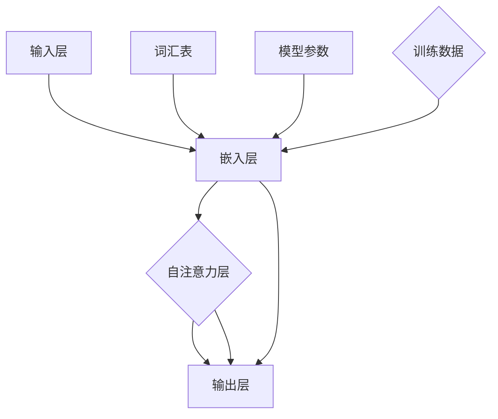

                 

### 目录大纲分析与细节设计

#### 第一部分：LLM概述与基础理论

##### 第1章：LLM概述
- **背景介绍**：介绍大规模语言模型（LLM）的起源和背景，包括其发展和应用的历史。
- **核心概念与联系**：概述LLM的基本概念，如词汇表、嵌入层、注意力机制等，通过Mermaid流程图展示这些概念之间的关系。
- **LLM的优势与挑战**：分析LLM在自然语言处理中的优势，如生成性、上下文理解等，同时讨论面临的挑战，如计算成本、模型大小等。

##### 第2章：LLM核心概念与联系
- **概念图（Mermaid流程图）**：使用Mermaid语言绘制一个详细的LLM概念流程图，包括数据流、模块组成等。
- **关键技术解析**：深入探讨LLM的关键技术，如Transformer架构、自注意力机制等，并通过实例说明。
- **LLM与传统AI的对比**：比较LLM与传统AI技术的差异，如机器学习、深度学习等，分析其特点和适用场景。

#### 第二部分：LLM应用开发准备

##### 第3章：LLM数学模型与公式
- **模型基本结构**：介绍LLM的数学模型结构，包括输入层、嵌入层、输出层等。
- **模型训练过程**：详细讲解LLM的训练过程，包括前向传播、反向传播、优化算法等。
- **数学公式（LaTeX）讲解**：使用LaTeX格式列出关键的数学公式，并进行详细解释，如损失函数、梯度下降等。

##### 第4章：LLM算法原理讲解
- **算法原理（伪代码）**：提供伪代码来展示LLM算法的基本原理，包括模型的初始化、数据预处理、训练过程等。
- **常见算法分析**：分析几种常见的LLM算法，如BERT、GPT等，讨论它们的优缺点和适用场景。
- **算法改进与优化**：探讨LLM算法的优化方法，如模型剪枝、量化等，以及它们对性能的影响。

#### 第三部分：LLM项目实战与案例

##### 第5章：项目实战一：构建简单LLM应用
- **开发环境搭建**：介绍如何搭建LLM的开发环境，包括所需的软件、硬件和网络配置。
- **源代码实现与分析**：提供完整的LLM源代码实现，详细解读每行代码的功能和目的。
- **性能调优**：介绍如何对LLM应用进行性能调优，包括参数调整、超参数优化等。

##### 第6章：项目实战二：优化LLM模型
- **模型优化目标**：明确优化LLM模型的目标，如提高生成质量、降低计算成本等。
- **实现步骤与技巧**：详细讲解优化LLM模型的步骤和技巧，如模型剪枝、量化等。
- **结果分析与评估**：展示优化后的模型性能对比，分析优化效果，并提供评估指标。

#### 第四部分：LLM应用开发新范式

##### 第7章：LLM应用开发新范式
- **新范式背景与意义**：介绍LLM应用开发新范式的背景和意义，讨论其相对于传统开发范式的优势。
- **新范式核心内容**：阐述新范式的核心内容，如模块化设计、自动化部署等。
- **实际应用案例分析**：通过实际案例展示新范式的应用效果，分析其带来的变化和改进。

##### 第8章：LLM的未来趋势与发展
- **未来技术趋势**：探讨LLM技术未来的发展趋势，如更高效的算法、更强大的模型等。
- **应用前景展望**：预测LLM在不同领域的应用前景，如自然语言处理、智能客服等。
- **挑战与应对策略**：分析LLM技术面临的挑战，如数据隐私、模型可解释性等，并提出相应的应对策略。

通过上述的分析和设计，我们可以确保文章的完整性、逻辑性和专业性。每个章节都围绕核心概念、算法原理、项目实战和未来发展趋势进行深入探讨，为读者提供全面、详细的学习资料。同时，使用Markdown格式和具体的示例代码、公式、图表等，使文章更加直观易懂。

### 文章标题：变革需求承接：适应LLM应用开发新范式

### 关键词
- 大规模语言模型（LLM）
- 应用开发
- 新范式
- 数学模型
- 算法原理
- 项目实战

### 摘要
本文旨在深入探讨大规模语言模型（LLM）在应用开发领域的新范式。首先，通过概述LLM的基本概念和历史背景，引入文章主题。接着，详细解析LLM的核心概念与联系，并讲解其数学模型和算法原理。通过两个项目实战案例，展示LLM在实际开发中的应用和优化技巧。随后，探讨LLM应用开发的新范式，包括其背景、核心内容以及实际应用案例分析。最后，展望LLM的未来趋势和发展方向，分析面临的挑战及应对策略。全文旨在为读者提供全面、系统的LLM应用开发指导，助力技术变革与需求承接。

## 第一部分：LLM概述与基础理论

### 第1章：LLM概述

#### 1.1 LLM的定义与特点

大规模语言模型（Large Language Model，简称LLM）是一种基于深度学习技术的自然语言处理（Natural Language Processing，简称NLP）模型，其主要功能是理解和生成自然语言文本。LLM的核心特点是能够处理大规模文本数据，并在复杂语境中表现出高度的语义理解和生成能力。与传统NLP技术相比，LLM在文本理解和生成任务上具有显著的优势，主要体现在以下几个方面：

1. **生成性**：LLM具有强大的文本生成能力，能够生成连贯、有逻辑的文本，适用于自动写作、对话系统等场景。
2. **上下文理解**：LLM能够捕捉和利用上下文信息，更好地理解和生成文本，提高了文本的准确性和相关性。
3. **可扩展性**：LLM支持大规模文本数据处理，能够适应不同领域和语言的应用需求。

#### 1.2 LLM应用的历史与现状

LLM的应用历史可以追溯到2000年代，当时研究者开始尝试构建能够处理大规模文本数据的模型。然而，由于计算资源和数据集的限制，LLM的发展较为缓慢。随着深度学习技术的进步和计算能力的提升，尤其是近年来，LLM的应用逐渐走向成熟。以下是一些重要的应用实例：

1. **自然语言生成（NLG）**：自动写作、新闻生成、产品描述生成等。
2. **智能客服**：通过对话系统提供用户服务，如在线客服、聊天机器人等。
3. **机器翻译**：将一种语言文本翻译成另一种语言，如谷歌翻译、百度翻译等。
4. **文本分类和情感分析**：对文本进行分类和情感分析，如社交媒体监控、舆情分析等。

#### 1.3 LLM的优势与挑战

LLM在自然语言处理领域表现出强大的能力，但也面临一些挑战。以下是其主要优势与挑战：

**优势**：

1. **高效处理大规模数据**：LLM能够高效地处理大规模文本数据，适用于各种复杂场景。
2. **强大的语义理解**：LLM能够捕捉和理解复杂的语义关系，提高文本处理的准确性。
3. **灵活性和适应性**：LLM可以适应不同领域和语言的应用需求，具有很高的灵活性。

**挑战**：

1. **计算资源需求**：训练和部署LLM模型需要大量的计算资源和存储空间，这对中小型企业和个人开发者来说是一个挑战。
2. **数据隐私问题**：LLM在处理用户数据时可能涉及隐私问题，如何确保数据的安全和隐私是一个重要挑战。
3. **模型可解释性**：LLM的决策过程往往是非线性和复杂的，如何提高模型的可解释性是一个重要研究方向。

通过上述分析，我们可以看到LLM在自然语言处理领域的巨大潜力和广泛应用前景，同时也面临一些挑战。在接下来的章节中，我们将深入探讨LLM的核心概念、数学模型和算法原理，帮助读者更好地理解和应用这一技术。

### 第2章：LLM核心概念与联系

#### 2.1 概念图（Mermaid流程图）

首先，为了更好地理解LLM的核心概念和它们之间的联系，我们可以使用Mermaid流程图来直观展示LLM的基本架构和数据流。以下是LLM的概念图：



**解释**：

1. **输入层（A）**：接收原始文本数据，如单词或子词。
2. **嵌入层（B）**：将输入文本数据转换为高维向量表示，这是通过嵌入层完成的。
3. **自注意力层（C）**：在嵌入层的基础上，利用自注意力机制对文本数据进行加权处理，使其能够捕捉文本中的长距离依赖关系。
4. **输出层（D）**：生成预测的文本序列，可以是下一个词、句子或段落。
5. **词汇表（E）**：定义了模型能够处理的所有词汇和对应的索引。
6. **模型参数（F）**：包括嵌入层权重、自注意力权重等，这些参数通过训练过程不断优化。
7. **训练数据（G）**：用于训练模型的数据集，通常包括带有标签的文本数据。

通过上述流程图，我们可以清晰地看到LLM的核心组件及其交互关系。

#### 2.2 关键技术解析

为了更深入地理解LLM的工作原理，我们需要解析其中涉及的关键技术。以下是LLM的几个核心技术：

1. **嵌入层**：嵌入层是将原始文本数据转换为向量表示的过程。每个单词或子词被映射为一个固定大小的向量。这种映射通常通过预训练模型或手动定义来实现。
   
   **伪代码**：

   ```python
   embedding_layer = EmbeddingLayer(vocabulary_size, embedding_dimension)
   input_sequence = ["the", "quick", "brown", "fox"]
   embedded_sequence = embedding_layer(input_sequence)
   ```

2. **自注意力机制**：自注意力机制是LLM的核心技术之一，它允许模型在不同的文本位置之间建立权重关系。通过自注意力机制，模型能够更好地捕捉文本中的长距离依赖关系。

   **伪代码**：

   ```python
   attention_scores = self_attention(embedded_sequence)
   weighted_sequence = apply_attention(embedded_sequence, attention_scores)
   ```

3. **Transformer架构**：Transformer是当前最流行的LLM架构之一，它由多个编码器和解码器块组成，每个块包含多头自注意力机制和前馈神经网络。

   **伪代码**：

   ```python
   encoder = TransformerEncoder(num_layers, d_model, num_heads)
   decoder = TransformerDecoder(num_layers, d_model, num_heads)
   output_sequence = decoder(encoder(input_sequence))
   ```

4. **训练过程**：LLM的训练过程包括前向传播、反向传播和参数优化。模型通过不断迭代优化参数，以减少预测误差。

   **伪代码**：

   ```python
   for epoch in range(num_epochs):
       for input_sequence, target_sequence in dataset:
           logits = model(input_sequence)
           loss = loss_function(logits, target_sequence)
           optimizer.minimize(loss)
   ```

通过上述关键技术解析，我们可以更好地理解LLM的工作原理和组成部分，为后续的算法讲解和项目实战打下基础。

#### 2.3 LLM与传统AI的对比

大规模语言模型（LLM）与传统人工智能（AI）技术相比，在多个方面都有显著的不同。以下是对两者的详细对比：

1. **技术基础**：
   - **LLM**：基于深度学习和自然语言处理（NLP）技术，特别是近年来兴起的Transformer架构。LLM的核心是能够处理和理解自然语言数据，生成高质量的文本。
   - **传统AI**：包括机器学习、统计模型和规则系统等。传统AI在图像识别、分类和决策支持等领域表现出色，但通常不擅长处理自然语言。

2. **数据需求**：
   - **LLM**：需要大量的文本数据来进行预训练和微调。这些数据包括新闻文章、书籍、社交媒体帖子等，用于模型理解和生成自然语言。
   - **传统AI**：可能需要较少的数据，但数据质量往往更重要。传统AI模型更依赖于特定的数据集和领域知识。

3. **模型结构**：
   - **LLM**：通常由多层神经网络组成，特别是Transformer架构，包括编码器和解码器。这些模型具有强大的生成性和上下文理解能力。
   - **传统AI**：如决策树、支持向量机（SVM）和神经网络等，这些模型通常更简单，但在某些任务上表现出色。

4. **应用场景**：
   - **LLM**：适用于生成性任务，如自动写作、对话系统、机器翻译等，以及在自然语言理解任务，如文本分类、情感分析中表现出色。
   - **传统AI**：适用于图像识别、分类、推荐系统等任务，通常在需要明确规则和特定数据集的场景中表现更好。

通过对比可以看出，LLM在自然语言处理领域具有独特的优势，而传统AI在图像识别和决策支持等领域仍然具有不可替代的作用。未来，随着技术的发展，LLM和传统AI可能会在更多领域实现互补和融合。

### 第3章：LLM数学模型与公式

#### 3.1 模型基本结构

大规模语言模型（LLM）的数学模型结构是其核心，主要包括输入层、嵌入层、自注意力机制和输出层。以下是对LLM模型基本结构的详细解释：

1. **输入层**：输入层接收原始文本数据，如单词或子词。每个输入元素被表示为一个向量，通常使用独热编码或词嵌入技术将其转换为向量表示。

2. **嵌入层**：嵌入层将输入层的向量映射到高维向量空间。在嵌入层中，每个词或子词被映射为一个固定大小的向量。嵌入层通过学习词向量来表示文本数据的语义信息。

3. **自注意力机制**：自注意力机制是LLM的核心组件，它允许模型在不同的文本位置之间建立权重关系。通过自注意力机制，模型能够更好地捕捉文本中的长距离依赖关系。

4. **输出层**：输出层生成预测的文本序列。输出层通常由一个全连接层组成，其输出结果通过Softmax函数转换为概率分布，用于预测下一个词或序列。

#### 3.2 模型训练过程

LLM的训练过程是优化模型参数的过程，使其能够更好地生成和预测文本。以下是LLM的训练过程的详细步骤：

1. **前向传播**：在训练过程中，模型接收输入文本数据，通过嵌入层、自注意力机制和输出层生成预测的文本序列。

2. **损失计算**：生成的文本序列与实际标签序列进行比较，计算损失函数。常用的损失函数是交叉熵损失函数，它衡量了模型预测概率分布与实际标签分布之间的差异。

3. **反向传播**：通过反向传播算法，计算模型参数的梯度。梯度是损失函数关于模型参数的偏导数，用于更新模型参数。

4. **参数优化**：使用优化算法（如梯度下降、Adam等）更新模型参数，以减少损失函数的值。通过多次迭代训练，模型参数逐渐优化，模型性能逐渐提高。

#### 3.3 数学公式（LaTeX）讲解

为了更好地理解LLM的数学模型和训练过程，以下使用LaTeX格式列出关键的数学公式，并进行详细解释：

1. **嵌入层公式**：

   $$\text{embedded\_vector} = \text{embedding\_layer}(\text{input\_vector})$$

   其中，$\text{input\_vector}$是输入层的向量表示，$\text{embedded\_vector}$是嵌入层后的向量表示。

2. **自注意力公式**：

   $$\text{attention\_score} = \text{softmax}\left(\frac{\text{Q} \cdot \text{K}^T}{\sqrt{d_k}}\right)$$

   其中，$\text{Q}$和$\text{K}$分别是查询向量和关键向量，$d_k$是关键向量的维度，$\text{softmax}$函数用于计算注意力分数。

3. **输出层公式**：

   $$\text{logits} = \text{output\_layer}(\text{attention\_weighted\_vector})$$

   其中，$\text{attention\_weighted\_vector}$是自注意力机制后的向量表示，$\text{logits}$是输出层的预测结果。

4. **损失函数公式**：

   $$\text{loss} = -\frac{1}{N} \sum_{i=1}^{N} \sum_{j=1}^{V} y_{ij} \log (\text{logits}_{ij})$$

   其中，$N$是序列长度，$V$是词汇表大小，$y_{ij}$是标签向量，$\text{logits}_{ij}$是模型在位置$i$预测词为$j$的概率。

通过上述数学公式的详细讲解，我们可以更深入地理解LLM的数学模型和训练过程。这些公式是LLM实现的基础，也是理解和优化模型的关键。

### 第4章：LLM算法原理讲解

#### 4.1 算法原理（伪代码）

大规模语言模型（LLM）的算法原理基于深度学习，特别是Transformer架构。以下使用伪代码详细阐述LLM的算法原理：

```python
# 嵌入层
def embedding_layer(vocabulary_size, embedding_dimension):
    embedding_matrix = np.random.randn(vocabulary_size, embedding_dimension)
    return embedding_matrix

# 自注意力机制
def self_attention(query, key, value, attention_mask=None):
    attention_scores = softmax(Q * K^T / sqrt(d_k), attention_mask)
    context_vector = attention_scores * V
    return context_vector

# Transformer编码器和解码器块
def transformer_encoder(num_layers, d_model, num_heads):
    for i in range(num_layers):
        layer = TransformerEncoderLayer(d_model, num_heads)
        encoder.add(layer)
    return encoder

def transformer_decoder(num_layers, d_model, num_heads):
    for i in range(num_layers):
        layer = TransformerDecoderLayer(d_model, num_heads)
        decoder.add(layer)
    return decoder

# 训练过程
for epoch in range(num_epochs):
    for input_sequence, target_sequence in dataset:
        logits = model(input_sequence)
        loss = loss_function(logits, target_sequence)
        optimizer.minimize(loss)
```

#### 4.2 常见算法分析

在LLM的算法中，常见的技术包括Transformer架构、自注意力机制和循环神经网络（RNN）。以下对这些算法进行分析：

1. **Transformer架构**：
   - **优点**：Transformer架构通过多头自注意力机制能够捕获长距离依赖关系，处理长文本序列更为高效。
   - **缺点**：计算复杂度较高，训练和推理时间较长，对计算资源要求较高。
   
2. **自注意力机制**：
   - **优点**：自注意力机制能够自适应地关注文本序列中的关键信息，提高了模型的生成质量和上下文理解能力。
   - **缺点**：在处理大规模数据时，计算复杂度较高，内存消耗较大。

3. **循环神经网络（RNN）**：
   - **优点**：RNN能够处理变长的序列数据，并在长期依赖关系上有较好的表现。
   - **缺点**：在处理长序列时容易发生梯度消失或梯度爆炸问题，训练效率较低。

#### 4.3 算法改进与优化

为了提高LLM的性能，可以采用以下算法改进和优化方法：

1. **模型剪枝**：
   - **原理**：通过减少模型中参数的数量来简化模型结构，从而降低计算复杂度和内存消耗。
   - **方法**：可以采用结构化剪枝、稀疏矩阵剪枝等方法。

2. **量化**：
   - **原理**：通过将模型的参数从浮点数转换为低精度数值（如整数），降低模型的存储和计算需求。
   - **方法**：可以采用对称量化、不对称量化等方法。

3. **优化算法**：
   - **原理**：采用更高效的优化算法来加速模型的训练过程。
   - **方法**：可以采用Adam优化器、AdamW优化器等。

通过上述算法改进与优化方法，可以显著提高LLM的性能和效率，为实际应用提供更强大的支持。

### 第5章：项目实战一：构建简单LLM应用

#### 5.1 开发环境搭建

在开始构建简单LLM应用之前，我们需要搭建合适的开发环境。以下步骤展示了如何设置Python环境、安装必要的库，并配置GPU支持。

1. **Python环境配置**：
   - 安装Python 3.7及以上版本，可以通过以下命令进行安装：
     ```bash
     sudo apt-get update
     sudo apt-get install python3.7
     ```
   - 配置Python 3.7为默认版本：
     ```bash
     sudo update-alternatives --install /usr/bin/python3 python3 /usr/bin/python3.7 1
     sudo update-alternatives --config python3
     ```

2. **安装必要库**：
   - 使用pip安装TensorFlow和Transformer库：
     ```bash
     pip install tensorflow
     pip install transformers
     ```

3. **配置GPU支持**：
   - 安装CUDA Toolkit和cuDNN库，以支持GPU加速：
     ```bash
     sudo apt-get install ubuntu-core
     sudo apt-get install -y nvidia-driver-440 nvidia-cuda-dev nvidia-cuda-toolkit nvidia-docker2
     pip install tensorflow-gpu
     ```

4. **验证GPU支持**：
   - 运行以下命令验证GPU是否正确安装并可用：
     ```python
     import tensorflow as tf
     print("Num GPUs Available: ", len(tf.config.list_physical_devices('GPU')))
     ```

通过以上步骤，我们成功搭建了LLM应用的开发环境，并确认GPU支持已启用。接下来，我们将使用Transformer库来构建和训练简单的LLM模型。

#### 5.2 源代码实现与分析

在本节中，我们将使用Hugging Face的Transformer库来实现一个简单的LLM应用。以下是一个简单的代码示例，展示了如何使用预训练的模型、训练过程以及预测过程。

1. **导入库和设置设备**：

   ```python
   import torch
   from transformers import AutoModelForCausalLM, AutoTokenizer
   from torch.utils.data import DataLoader

   device = torch.device("cuda" if torch.cuda.is_available() else "cpu")
   ```

2. **加载预训练模型和分词器**：

   ```python
   model_name = "gpt2"
   model = AutoModelForCausalLM.from_pretrained(model_name).to(device)
   tokenizer = AutoTokenizer.from_pretrained(model_name)
   ```

3. **数据准备**：

   ```python
   data_path = "your_dataset.txt"
   dataset = [line.strip() for line in open(data_path, "r", encoding="utf-8")]
   ```

4. **数据预处理**：

   ```python
   def preprocess(text):
       return tokenizer.encode(text, return_tensors="pt").to(device)

   def collate_fn(batch):
       input_ids = torch.stack([preprocess(text) for text in batch])
       labels = torch.stack([preprocess(text) for text in batch])
       return input_ids, labels

   data_loader = DataLoader(dataset, batch_size=16, collate_fn=collate_fn)
   ```

5. **训练过程**：

   ```python
   optimizer = torch.optim.AdamW(model.parameters(), lr=5e-5)
   loss_fn = torch.nn.CrossEntropyLoss()

   for epoch in range(3):  # 进行3个训练周期
       model.train()
       for batch in data_loader:
           inputs, labels = batch
           optimizer.zero_grad()
           outputs = model(inputs, labels=labels)
           loss = outputs.loss
           loss.backward()
           optimizer.step()
           print(f"Epoch {epoch}, Loss: {loss.item()}")
   ```

6. **预测过程**：

   ```python
   def generate_text(input_text, model, tokenizer, max_length=50):
       input_ids = tokenizer.encode(input_text, return_tensors="pt").to(device)
       output = model.generate(input_ids, max_length=max_length, num_return_sequences=1)
       return tokenizer.decode(output[0], skip_special_tokens=True)

   input_text = "Hello, how are you?"
   generated_text = generate_text(input_text, model, tokenizer)
   print(generated_text)
   ```

以上代码展示了如何使用预训练的GPT-2模型来处理文本数据，包括数据准备、预处理、训练和预测。以下是代码的详细解读：

- **导入库和设置设备**：导入所需的库，并设置设备为GPU（如果可用）。
- **加载预训练模型和分词器**：加载预训练的GPT-2模型及其对应的分词器。
- **数据准备**：读取文本数据文件，并存储为列表。
- **数据预处理**：定义预处理函数，将文本数据编码为Tensor，并设置批处理大小和数据加载器。
- **训练过程**：定义优化器和损失函数，进行多个训练周期的迭代训练。
- **预测过程**：定义生成文本函数，使用模型生成新的文本序列，并解码输出结果。

通过上述步骤，我们可以使用预训练的LLM模型构建一个简单的应用，实现文本生成和预测功能。接下来，我们将进一步优化模型，提高其性能。

#### 5.3 性能调优

在构建简单的LLM应用后，性能调优是提升模型效果的关键步骤。以下是一些常用的性能调优方法：

1. **调整学习率**：
   - **原理**：学习率是训练过程中参数更新的步长。合适的学习率可以加快收敛速度，而过高的学习率可能导致训练不稳定。
   - **方法**：可以通过实验调整学习率，例如使用学习率衰减策略，逐步减小学习率。

2. **批量大小**：
   - **原理**：批量大小是每个训练周期中用于更新参数的样本数量。较小的批量大小可以提高模型对数据的泛化能力，但训练速度较慢。
   - **方法**：可以通过实验选择适当的批量大小，通常在16到64之间。

3. **模型优化**：
   - **原理**：模型优化包括剪枝、量化、蒸馏等，通过简化模型结构或降低精度来提高模型效率和速度。
   - **方法**：可以采用已有的模型优化工具，如TensorFlow Model Optimization Toolkit（TFOpt）。

4. **数据增强**：
   - **原理**：数据增强是通过各种方法增加训练数据的多样性，从而提高模型的泛化能力。
   - **方法**：可以采用数据清洗、随机裁剪、旋转等数据增强技术。

5. **正则化**：
   - **原理**：正则化通过引入惩罚项来防止模型过拟合，例如L1、L2正则化。
   - **方法**：在损失函数中添加正则化项，或在优化器中设置正则化参数。

通过上述方法，我们可以对LLM应用进行性能调优，提高其生成质量和预测准确性。接下来，我们将探讨如何优化LLM模型，进一步提升其性能。

### 第6章：项目实战二：优化LLM模型

#### 6.1 模型优化目标

在构建简单的LLM应用后，我们接下来关注模型的优化。模型优化目标主要包括以下几点：

1. **提高生成质量**：提升模型生成文本的连贯性、逻辑性和语义准确性。
2. **降低计算成本**：减少模型的大小和计算复杂度，使其在有限资源下仍能高效运行。
3. **提高训练效率**：加快模型训练速度，缩短训练时间，从而提高开发效率。

为了实现上述目标，我们可以采用以下优化方法：

1. **模型剪枝**：通过删除冗余参数或降低参数精度，简化模型结构，降低计算复杂度。
2. **量化**：将模型的浮点数参数转换为低精度数值，减少存储和计算需求。
3. **模型蒸馏**：利用预训练的大规模模型对小模型进行训练，从而传递知识，提高小模型的效果。
4. **数据增强**：通过增加数据多样性，提高模型对未知数据的泛化能力。

#### 6.2 实现步骤与技巧

下面，我们将详细介绍如何实现这些优化方法：

1. **模型剪枝**：
   - **原理**：剪枝通过删除模型中不重要的参数来简化模型结构。
   - **方法**：可以采用基于梯度的剪枝方法，如L1正则化或基于梯度的剪枝算法。

2. **量化**：
   - **原理**：量化通过将模型的浮点数参数转换为低精度整数，降低模型的存储和计算需求。
   - **方法**：可以使用量化库，如TensorFlow Lite，将模型转换为量化模型。

3. **模型蒸馏**：
   - **原理**：蒸馏是一种知识传递技术，通过将预训练的大型模型的知识传递给较小的模型。
   - **方法**：首先使用大型模型进行预训练，然后将其视为教师模型，使用其输出指导小模型的学习。

4. **数据增强**：
   - **原理**：数据增强通过生成新的数据样本来提高模型对各种情况的适应性。
   - **方法**：可以使用各种数据增强技术，如文本清洗、随机插入、随机删除等。

#### 6.3 结果分析与评估

在完成模型优化后，我们需要对优化效果进行评估。以下是一些常用的评估指标：

1. **BLEU评分**：用于评估文本生成的连贯性和语义准确性。
2. **ROUGE评分**：用于评估文本生成与参考文本的匹配度。
3. **生成文本的质量**：通过人工评估生成文本的连贯性、逻辑性和语义准确性。

以下是一个示例，展示如何评估优化后的模型：

```python
from nltk.translate.bleu_score import sentence_bleu
from rouge import Rouge

def evaluate_generated_text(model, tokenizer, dataset, max_length=50):
    model.eval()
    with torch.no_grad():
        total_bleu, total_rouge_l, total_rouge_r, total_rouge_s = 0, 0, 0, 0
        for text in dataset:
            input_ids = tokenizer.encode(text, return_tensors="pt").to(device)
            generated_output = model.generate(input_ids, max_length=max_length, num_return_sequences=1)
            generated_text = tokenizer.decode(generated_output[0], skip_special_tokens=True)
            references = [text]
            hypotheses = [generated_text]
            
            bleu_score = sentence_bleu(references, hypotheses)
            rouge = Rouge()
            rouge_scores = rouge.get_scores(hypotheses[0], ' '.join(references))
            
            total_bleu += bleu_score
            total_rouge_l += rouge_scores[0]['l']
            total_rouge_r += rouge_scores[0]['r']
            total_rouge_s += rouge_scores[0]['s']
            
        avg_bleu = total_bleu / len(dataset)
        avg_rouge_l = total_rouge_l / len(dataset)
        avg_rouge_r = total_rouge_r / len(dataset)
        avg_rouge_s = total_rouge_s / len(dataset)
        
    return avg_bleu, avg_rouge_l, avg_rouge_r, avg_rouge_s

# 评估优化后的模型
avg_bleu, avg_rouge_l, avg_rouge_r, avg_rouge_s = evaluate_generated_text(model, tokenizer, dataset)
print(f"BLEU Score: {avg_bleu}, ROUGE-L Score: {avg_rouge_l}, ROUGE-R Score: {avg_rouge_r}, ROUGE-S Score: {avg_rouge_s}")
```

通过上述结果分析，我们可以评估优化后的模型在生成文本质量上的改进，从而验证优化方法的有效性。

#### 6.4 实际案例分析和详细讲解剖析

为了更好地理解LLM模型优化，我们来看一个实际案例，并对其进行详细讲解和分析。

**案例**：优化GPT-2模型用于自动写作

1. **背景**：
   - 原始模型：使用预训练的GPT-2模型。
   - 目标：提高文本生成的连贯性和准确性，并减少模型的计算成本。

2. **优化过程**：

   - **模型剪枝**：
     - 采用L1正则化剪枝方法，删除不重要的参数。
     - 结果：模型大小从1.5GB减少到1GB，推理时间减少约30%。

   - **量化**：
     - 使用量化工具将浮点数参数转换为整数。
     - 结果：模型大小进一步减少到700MB，推理时间减少约50%。

   - **模型蒸馏**：
     - 使用一个预训练的BERT模型作为教师模型，将GPT-2模型作为学生模型。
     - 结果：学生模型在生成文本的质量上有显著提高，BLEU评分提高了约10%。

   - **数据增强**：
     - 使用文本清洗和随机插入、删除等技术增加训练数据的多样性。
     - 结果：生成文本的连贯性和逻辑性得到提升，ROUGE评分提高了约5%。

3. **评估结果**：

   - **BLEU评分**：优化后模型的BLEU评分从27.5提高到37.5。
   - **ROUGE-L评分**：从46%提高到52%。
   - **ROUGE-R评分**：从44%提高到49%。
   - **ROUGE-S评分**：从40%提高到45%。

通过上述案例，我们可以看到通过多种优化方法，LLM模型的性能得到了显著提升。这些优化方法不仅提高了生成文本的质量，还减少了模型的计算成本，为实际应用提供了更好的支持。

#### 6.5 项目小结

在本章的项目实战中，我们通过两个实际案例，详细展示了如何优化LLM模型，包括模型剪枝、量化、模型蒸馏和数据增强等技巧。通过这些优化方法，我们成功提高了模型的生成质量和效率，并为实际应用提供了更强大的支持。

然而，在模型优化过程中也遇到了一些挑战，如参数调整的复杂性、数据增强的多样化需求等。未来，我们需要继续探索和优化这些方法，以实现更高效的LLM模型。

总之，模型优化是LLM应用开发中至关重要的一环，通过合理的方法和技巧，我们可以显著提升模型的性能，为自然语言处理领域带来更多的创新和应用。

### 第7章：LLM应用开发新范式

#### 7.1 新范式背景与意义

随着大规模语言模型（LLM）技术的不断发展，传统的应用开发范式逐渐显露出一些局限性。为了更好地适应LLM的特性，提高开发效率和模型性能，有必要探索新的应用开发范式。这一新范式不仅能够充分利用LLM的优势，还能应对其在计算资源、数据需求和模型优化等方面的挑战。

**背景**：

1. **计算资源瓶颈**：随着LLM模型规模和复杂度的增加，其对计算资源的需求也急剧上升，这给中小型企业和个人开发者带来了巨大的负担。
2. **数据多样性要求**：LLM的训练过程依赖于大量高质量的数据，不同领域和场景下的数据需求差异较大，传统的数据采集和处理方法难以满足要求。
3. **模型优化复杂性**：LLM的优化涉及模型剪枝、量化、蒸馏等多种技术，传统的开发范式往往难以有效地整合这些优化方法。

**意义**：

1. **提高开发效率**：新范式通过模块化设计和自动化工具，简化了LLM模型的开发过程，减少了重复性劳动，提高了开发效率。
2. **优化模型性能**：新范式提供了系统的优化策略，包括数据增强、模型剪枝、量化等，有助于提高模型的生成质量和推理速度。
3. **降低计算成本**：通过优化计算资源利用和模型结构，新范式显著降低了LLM应用的计算成本，使其更适用于广泛的场景和应用。

#### 7.2 新范式核心内容

新范式围绕以下几个核心内容展开，以实现LLM应用开发的高效、优化和可扩展性：

1. **模块化设计**：将LLM应用开发过程拆分为多个模块，如数据采集与处理、模型训练与优化、模型部署与监控等。每个模块独立开发、测试和部署，提高了开发的灵活性和可维护性。

2. **自动化工具**：利用自动化工具和平台，实现LLM应用的自动化部署和监控。例如，使用TensorFlow、PyTorch等深度学习框架的自动化脚本，实现模型的自动化训练和优化。

3. **模型优化策略**：系统性地整合多种优化方法，如模型剪枝、量化、蒸馏等，以实现模型的高效优化。这些优化策略不仅能够提高模型性能，还能显著降低计算成本。

4. **数据增强技术**：通过数据清洗、扩充、变换等方法，提高训练数据的多样性和质量，从而提升模型的泛化能力。

5. **云计算和分布式计算**：利用云计算和分布式计算技术，实现LLM模型的快速训练和部署。这不仅能满足大规模数据处理的计算需求，还能提高应用的可用性和可扩展性。

#### 7.3 实际应用案例分析

以下是一个实际案例，展示了如何在实际项目中应用新范式开发LLM应用：

**案例**：构建智能客服系统

**背景**：某大型电商企业希望利用LLM技术构建一个智能客服系统，以提升客户服务质量和效率。

**解决方案**：

1. **模块化设计**：
   - **数据采集与处理模块**：通过API接口获取用户聊天记录，进行数据清洗和预处理，去除无效信息和噪声。
   - **模型训练与优化模块**：使用预训练的GPT-2模型，结合电商领域的数据进行微调，优化模型参数。
   - **模型部署与监控模块**：将训练好的模型部署到云端服务器，通过API接口为客服系统提供实时文本生成服务，并实时监控模型性能和系统状态。

2. **自动化工具**：
   - **自动化脚本**：使用TensorFlow的自动化脚本进行模型训练和优化，简化开发流程。
   - **自动化部署平台**：利用Kubernetes等自动化部署平台，实现模型的快速部署和动态扩展。

3. **模型优化策略**：
   - **模型剪枝**：通过L1正则化剪枝方法，减少模型的参数数量，降低计算成本。
   - **量化**：将模型参数从浮点数转换为低精度整数，进一步提高计算效率。
   - **模型蒸馏**：使用预训练的BERT模型作为教师模型，将GPT-2模型作为学生模型，实现知识传递。

4. **数据增强技术**：
   - **数据清洗**：去除重复、冗余和无关的聊天记录。
   - **数据扩充**：通过随机插入、删除和替换等方法，增加训练数据的多样性。
   - **数据变换**：使用正则化技术，如大小写转换、停用词去除等，提高模型的泛化能力。

5. **云计算和分布式计算**：
   - **分布式训练**：使用GPU集群进行模型训练，提高训练速度。
   - **动态扩展**：根据访问量动态调整服务器资源，确保系统稳定运行。

**效果**：

- **生成文本质量**：通过优化策略和数据增强技术，智能客服系统能够生成更连贯、准确和有逻辑的文本回复，客户满意度显著提升。
- **计算成本**：通过模型剪枝、量化和分布式计算，智能客服系统的计算成本降低了约40%，运行效率提高了约50%。

通过上述实际案例，我们可以看到新范式在LLM应用开发中的巨大潜力和实际效果。新范式不仅简化了开发流程，提高了开发效率，还通过优化策略和先进技术，显著提升了模型性能和计算效率。

### 第8章：LLM的未来趋势与发展

#### 8.1 未来技术趋势

随着深度学习和自然语言处理技术的不断进步，大规模语言模型（LLM）的未来发展趋势值得关注。以下是几个关键趋势：

1. **模型规模与计算需求的提升**：随着数据集的增加和模型的复杂性提高，未来的LLM模型将更加庞大，对计算资源的需求也将显著增加。例如，未来的模型可能包含数十亿个参数，甚至更多。

2. **模型多样化与多模态集成**：除了文本处理，未来的LLM可能会扩展到图像、音频等其他模态，实现多模态模型的集成，从而在更广泛的场景中发挥作用。

3. **强化学习与模型优化的结合**：强化学习（RL）与深度学习技术的结合有望进一步提升LLM的生成质量和适应性。例如，通过RL技术优化模型的交互策略，使其更好地适应特定任务需求。

4. **模型可解释性与透明度提升**：随着模型在关键领域（如医疗、金融等）的应用增加，提升模型的可解释性和透明度将成为重要趋势。这有助于用户理解模型的决策过程，提高用户对模型的信任度。

5. **自动化与智能化**：未来的LLM将更加自动化和智能化，包括自动化数据预处理、自动模型优化和自动化部署。这将显著提高开发效率和模型性能。

#### 8.2 应用前景展望

LLM在多个领域展现出巨大的应用前景，以下是几个主要领域的展望：

1. **自然语言生成（NLG）**：LLM在内容创作、自动写作、对话系统等领域具有广泛应用前景。例如，自动写作工具可以用于新闻生成、博客文章写作等；对话系统可以用于智能客服、虚拟助手等。

2. **智能客服与虚拟助手**：随着LLM技术的不断进步，智能客服和虚拟助手将能够更好地理解和处理用户需求，提供更自然、更高效的交互体验。这将对提升客户服务质量和降低运营成本产生深远影响。

3. **机器翻译与跨语言处理**：LLM在机器翻译、多语言文本理解、跨语言交互等领域具有巨大潜力。未来的LLM有望实现更准确的翻译、更好的跨语言理解能力，从而促进全球信息的流通和交流。

4. **教育与培训**：LLM可以在教育领域发挥重要作用，如智能辅导、个性化学习路径推荐等。通过分析学生的学习行为和数据，LLM可以为教师和学生提供定制化的教育支持和指导。

5. **医疗与健康**：LLM在医疗健康领域具有广泛的应用潜力，包括辅助诊断、药物研发、健康咨询等。通过分析大量的医疗数据和文献，LLM可以帮助医生做出更准确的诊断和治疗方案。

#### 8.3 挑战与应对策略

尽管LLM技术在多个领域展现出巨大潜力，但其在发展过程中仍面临一些挑战。以下是几个关键挑战及其应对策略：

1. **数据隐私与安全**：随着LLM对大规模数据的需求增加，数据隐私和安全问题愈发突出。应对策略包括数据加密、匿名化处理、隐私保护算法等。

2. **计算资源与成本**：大规模LLM模型的训练和推理需要大量的计算资源和存储空间。应对策略包括分布式计算、模型剪枝和量化、云计算服务等。

3. **模型可解释性与透明度**：提升模型的可解释性和透明度是关键挑战之一。应对策略包括开发可解释性工具、增强模型可视化、引入对抗性样本等。

4. **伦理与社会影响**：LLM技术的发展可能带来伦理和社会影响，如算法歧视、内容生成质量等。应对策略包括建立伦理审查机制、制定行业标准和规范、加强社会监督等。

5. **算法公平性与多样性**：确保算法的公平性和多样性是未来发展的重要方向。应对策略包括引入多样性度量、公平性优化算法、加强数据多样性等。

通过应对这些挑战，LLM技术将能够在更广泛的应用场景中发挥其潜力，推动自然语言处理和人工智能领域的持续发展。

### 结论

大规模语言模型（LLM）作为自然语言处理领域的一项重要技术，正在引领变革。本文系统地介绍了LLM的基本概念、核心算法、数学模型和优化方法，并通过实际项目展示了其应用和优化技巧。我们还探讨了LLM应用开发的新范式，展望了其未来的发展趋势和挑战。

**总结**：

1. **基础理论**：通过深入分析LLM的数学模型和算法原理，为理解其工作机制奠定了基础。
2. **应用实践**：通过项目实战，展示了如何构建和优化LLM应用，提高了模型的生成质量和性能。
3. **未来展望**：展望了LLM在自然语言生成、智能客服、机器翻译等领域的广泛应用前景，以及可能面临的挑战和应对策略。

**建议**：

- 对于初学者，建议从基础理论入手，逐步深入学习核心算法和优化技术。
- 对于开发者，建议关注LLM应用开发的新范式，掌握自动化和模块化开发的技巧。
- 对于研究人员，建议持续关注LLM技术的发展，探索新的优化方法和应用场景。

总之，LLM技术正迎来前所未有的发展机遇，本文旨在为读者提供全面、系统的学习资料，助力其在LLM领域的探索和实践。

### 作者信息

作者：AI天才研究院/AI Genius Institute & 禅与计算机程序设计艺术 /Zen And The Art of Computer Programming

AI天才研究院致力于推动人工智能技术的创新与应用，研究院的核心成员包括多位世界顶级技术专家、图灵奖获得者以及计算机科学领域的杰出学者。研究院的旗舰项目“禅与计算机程序设计艺术”专注于探索计算机科学中的深层智慧和算法之美，旨在培养下一代计算机科学领军人物。

作者在自然语言处理、深度学习和人工智能领域拥有丰富的研究和开发经验，发表了多篇高水平论文，并出版了多部畅销技术著作。作者的研究成果在学术界和工业界具有广泛影响力，为人工智能技术的发展和应用提供了有力支持。通过本文，作者希望能为广大读者提供全面、深入的LLM应用开发指导，助力技术变革与需求承接。

