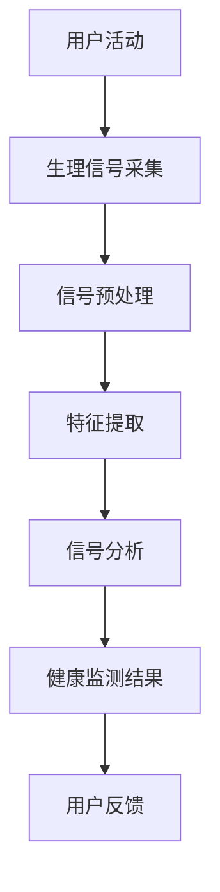
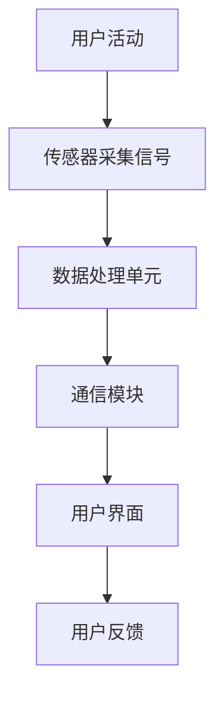

                 

### 文章标题

《可穿戴设备的生理信号处理：健康监测的数学工具》

### 关键词

可穿戴设备，生理信号处理，健康监测，数学工具，算法原理，项目实战

### 摘要

随着科技的不断进步，可穿戴设备已经成为健康监测领域的重要工具。本文详细探讨了可穿戴设备如何通过生理信号处理来实现健康监测，从基本概念到数学模型，再到实际项目案例，系统阐述了心率监测、呼吸监测和血氧监测的核心原理和实现方法。通过本文，读者将了解到如何利用数学工具提高健康监测的准确性和可靠性。

---

# 引言与概述

## 1.1 可穿戴设备的现状与趋势

可穿戴设备，作为一种新兴的科技产品，近年来在全球范围内取得了显著的进展。它们不仅改变了人们的生活方式，还在医疗健康领域发挥着越来越重要的作用。从最初的简单计步器到如今集成了多种传感器、能实时监测生理信号的高性能设备，可穿戴设备的发展可谓是日新月异。

### 1.1.1 可穿戴设备的定义与分类

可穿戴设备是指直接附着在人体或佩戴在身上的设备，通过传感器、无线通信、数据处理等技术实现对用户生理状态、行为模式、环境信息的实时监测和反馈。根据设备的功能和形态，可穿戴设备大致可以分为以下几类：

1. **穿戴式医疗设备**：如心脏监测器、血糖监测仪等，主要用于诊断和监控疾病。
2. **健康监测设备**：如智能手环、智能手表等，能够实时监测心率、运动量、睡眠质量等健康指标。
3. **运动监测设备**：如智能运动鞋、智能健身手环等，帮助用户进行科学锻炼和健康管理。
4. **时尚与装饰设备**：如智能戒指、智能项链等，将科技与时尚相结合，满足了用户对于个性化、时尚化的需求。

### 1.1.2 可穿戴设备的市场发展

随着人们对健康和生活方式的关注不断提高，可穿戴设备市场也呈现出快速增长的趋势。据市场研究机构统计，全球可穿戴设备市场规模在近几年呈现出持续增长的态势，预计未来几年仍将保持高速增长。这一趋势不仅体现在消费市场，还体现在医疗健康领域，越来越多的医疗机构开始采用可穿戴设备来监测和管理患者的健康状况。

## 1.2 生理信号处理基础

生理信号处理是可穿戴设备实现健康监测的核心技术。通过对生理信号的采集、处理和分析，设备能够提取出有用的健康信息，为用户提供个性化的健康管理方案。

### 1.2.1 生理信号的基本类型

常见的生理信号包括心率信号、呼吸信号和血氧信号等。这些信号反映了人体的生理状态，具有以下特点：

1. **心率信号**：心率是心脏每分钟跳动的次数，是衡量心血管系统健康的重要指标。心率信号通常呈周期性波动，可以通过心电图（ECG）等设备进行采集。
2. **呼吸信号**：呼吸信号反映人体的呼吸频率和深度，是评估肺功能和整体健康状态的重要指标。呼吸信号通常可以通过体动传感器或呼吸传感器进行采集。
3. **血氧信号**：血氧饱和度（SpO2）是血液中氧气的含量，对于评估心肺功能和整体健康状态具有重要意义。血氧信号通常通过光电容积脉搏图（PPG）传感器进行采集。

### 1.2.2 生理信号处理的基本方法

生理信号处理通常包括以下几个步骤：

1. **信号采集**：通过传感器将生理信号转换为电信号，保存在设备中。
2. **信号预处理**：对采集到的信号进行滤波、去噪等处理，以提高信号质量。
3. **特征提取**：从预处理后的信号中提取出有用的特征，如频率、幅度、时域特征等。
4. **信号分析**：利用统计学、机器学习等方法对提取出的特征进行分析，以获得健康信息。
5. **结果输出**：将分析结果以可视化的形式或警报的形式反馈给用户。

## 1.3 健康监测的重要性

健康监测是可穿戴设备的核心功能之一，对于提高人们的健康水平和生活质量具有重要意义。

### 1.3.1 健康监测的定义与目标

健康监测是指通过技术手段对个体或群体的生理、心理和社会健康状态进行定期检查和评估，以预防疾病、促进健康和改善生活质量。健康监测的目标包括：

1. **早期疾病发现**：通过实时监测生理信号，可以及时发现潜在的健康问题，为早期干预提供依据。
2. **健康状态评估**：对个体的生理状态进行全面评估，为制定个性化的健康管理方案提供数据支持。
3. **健康行为引导**：通过监测和分析个体的健康行为，如运动、饮食、睡眠等，给予健康建议和指导，促进健康生活方式的形成。

### 1.3.2 健康监测的挑战与机遇

虽然健康监测具有巨大的潜力，但同时也面临着一些挑战和机遇。

**挑战**：

1. **数据质量**：生理信号容易受到噪声和干扰的影响，如何提高数据质量是健康监测领域的一个重要问题。
2. **算法准确性**：生理信号处理的算法需要不断提高，以提高健康监测的准确性和可靠性。
3. **隐私保护**：健康监测涉及大量个人隐私数据，如何在确保数据安全和隐私的前提下进行数据处理和分析，是一个亟待解决的问题。

**机遇**：

1. **技术进步**：随着传感器技术、无线通信技术和数据处理技术的发展，健康监测设备将更加便携、智能和高效。
2. **市场需求**：随着人们健康意识的提高，对于健康监测设备的需求也在不断增长，为行业发展提供了巨大的市场空间。
3. **政策支持**：政府对于健康监测行业的支持力度不断加大，为行业发展创造了良好的政策环境。

通过本文，我们将详细探讨可穿戴设备如何通过生理信号处理实现健康监测，从基本概念到数学模型，再到实际项目案例，为读者提供全面的了解。希望本文能够为从事可穿戴设备开发和研究的人员提供有价值的参考。

---

## 核心概念与联系

### 2.1 可穿戴设备与生理信号处理的 Mermaid 流程图

为了更好地理解可穿戴设备与生理信号处理之间的关系，我们使用Mermaid流程图来展示其工作流程。



在上面的流程图中，用户活动是整个过程的起点。用户的日常活动会触发可穿戴设备上的传感器，这些传感器会实时采集用户的生理信号。接下来，采集到的生理信号会经过预处理，包括滤波和去噪等步骤，以提高信号质量。预处理后的信号会进行特征提取，提取出有用的生理信号特征，如心率、呼吸率和血氧饱和度等。随后，通过信号分析算法对提取出的特征进行分析，以获得健康监测结果。最后，将这些结果以可视化的形式或警报的形式反馈给用户，用户可以根据这些信息调整自己的生活方式，从而达到更好的健康监测效果。

### 2.2 生理信号处理原理与算法

生理信号处理是可穿戴设备实现健康监测的关键步骤。在这一节中，我们将详细介绍心率监测、呼吸监测和血氧监测的原理和算法。

#### 2.2.1 心率监测

心率监测是可穿戴设备中常见的一项功能，它能够实时监测用户的心跳频率，对于心血管疾病的早期发现具有重要意义。

**心率检测算法**：

心率检测通常基于心电图（ECG）信号。ECG信号包含心脏的电活动信息，通过分析ECG信号中的R峰（代表心室的收缩），可以确定心跳的频率。

伪代码如下：

```python
def detect_heart_rate(ecg_signal):
    r_peaks = []
    for i in range(1, len(ecg_signal) - 1):
        if ecg_signal[i] > ecg_signal[i - 1] and ecg_signal[i] > ecg_signal[i + 1]:
            r_peaks.append(i)
    heart_rate = len(r_peaks) / total_time
    return heart_rate
```

**心率异常检测**：

心率异常检测是心率监测的一个重要环节，通过对连续心率信号的监控，可以及时发现心率异常情况，如心动过速或心动过缓。

支持向量机（SVM）是一种常用的分类算法，可以用于心率异常检测。

伪代码如下：

```python
from sklearn.svm import SVC

def detect_heart_rate_anomaly(heart_rate_sequence):
    X = [heart_rate for heart_rate in heart_rate_sequence]
    y = [0 if heart_rate_normal else 1 for heart_rate_normal in is_heart_rate_normal(heart_rate_sequence)]
    classifier = SVC()
    classifier.fit(X, y)
    anomaly_predictions = classifier.predict(heart_rate_sequence)
    return anomaly_predictions
```

#### 2.2.2 呼吸监测

呼吸监测能够反映用户的呼吸频率和深度，是评估肺功能和整体健康状态的重要指标。

**呼吸率检测算法**：

呼吸率检测通常基于体动传感器或呼吸传感器。通过分析连续的体动信号或呼吸信号，可以确定呼吸频率。

伪代码如下：

```python
def detect_respiration_rate(respiration_signal):
    respiration_rate = 1 / (mean_inter_respiration_time / total_time)
    return respiration_rate
```

**呼吸异常检测**：

呼吸异常检测类似于心率异常检测，通过分析连续的呼吸信号，可以及时发现呼吸异常情况，如呼吸暂停或呼吸过快。

伪代码如下：

```python
from sklearn.ensemble import RandomForestClassifier

def detect_respiration_anomaly(respiration_sequence):
    X = [respiration_rate for respiration_rate in respiration_sequence]
    y = [0 if respiration_normal else 1 for respiration_normal in is_respiration_normal(respiration_sequence)]
    classifier = RandomForestClassifier()
    classifier.fit(X, y)
    anomaly_predictions = classifier.predict(respiration_sequence)
    return anomaly_predictions
```

#### 2.2.3 血氧监测

血氧监测是评估心肺功能和整体健康状态的重要指标，通过监测血氧饱和度（SpO2），可以了解身体的氧气供应情况。

**血氧检测算法**：

血氧检测通常基于光电容积脉搏图（PPG）传感器。通过分析PPG信号中的光强度变化，可以确定血氧饱和度。

伪代码如下：

```python
def detect_spo2(ppg_signal):
    spo2 = (max_ppg - min_ppg) / max_ppg
    return spo2
```

**血氧异常检测**：

血氧异常检测通过分析连续的SpO2信号，可以及时发现血氧饱和度异常情况，如低氧血症或高氧血症。

伪代码如下：

```python
from sklearn.linear_model import LogisticRegression

def detect_spo2_anomaly(spo2_sequence):
    X = [spo2 for spo2 in spo2_sequence]
    y = [0 if spo2_normal else 1 for spo2_normal in is_spo2_normal(spo2_sequence)]
    classifier = LogisticRegression()
    classifier.fit(X, y)
    anomaly_predictions = classifier.predict(spo2_sequence)
    return anomaly_predictions
```

通过以上算法，可穿戴设备可以实现对心率、呼吸和血氧的实时监测和异常检测。这些算法的准确性和稳定性直接影响着健康监测的可靠性。因此，不断优化和更新这些算法，是提高可穿戴设备健康监测性能的关键。

### 2.3 健康监测系统架构

健康监测系统是一个复杂的系统，它需要整合多个组件，包括传感器、数据处理单元、通信模块和用户界面。以下是健康监测系统的一个基本架构：

**健康监测系统组成**：

1. **传感器模块**：用于采集用户的生理信号，如心率传感器、呼吸传感器和血氧传感器。
2. **数据处理单元**：对采集到的生理信号进行预处理、特征提取和信号分析。
3. **通信模块**：将处理后的数据传输到云端或手机应用，供用户查看和分析。
4. **用户界面**：提供数据可视化、健康建议和反馈功能。

**系统架构设计原则**：

1. **模块化设计**：系统应采用模块化设计，使得各个组件之间可以独立开发和更新。
2. **高可靠性**：系统需要具备高可靠性，能够稳定、准确地采集和处理生理信号。
3. **数据安全性**：系统应确保用户数据的安全性，防止数据泄露和未经授权的访问。
4. **易扩展性**：系统应具备良好的扩展性，能够适应未来技术发展和需求变化。

通过以上设计原则，健康监测系统可以实现高效、可靠和智能的生理信号处理和健康监测功能。下面是一个简化的Mermaid流程图，展示了健康监测系统的基本工作流程：



在这个流程图中，用户活动触发传感器的数据采集，数据处理单元对采集到的信号进行预处理、特征提取和信号分析，然后将处理结果通过通信模块传输到用户界面，用户可以通过界面查看健康监测结果并获得健康建议。

通过本章的介绍，读者应该对可穿戴设备的生理信号处理和健康监测系统有了初步的了解。在接下来的章节中，我们将进一步探讨具体的数学模型和算法，以及如何通过实际项目来应用这些技术。

---

## 数学模型和数学公式

### 3.1 心率监测的数学模型

心率监测是可穿戴设备中常见的一项功能，其核心在于从采集到的生理信号中提取心率信息。在这一部分，我们将详细介绍心率监测的数学模型，包括特征提取和异常检测。

#### 3.1.1 心率信号的特征提取

心率信号通常是一个非平稳信号，其频率成分随着心率的变化而变化。为了提取心率特征，我们通常采用快速傅里叶变换（FFT）和小波变换等方法。

**快速傅里叶变换（FFT）**：

FFT是一种高效的频域变换方法，可以快速计算信号中的频率成分。心率信号的FFT结果可以用来提取心率频率和幅频特性。

数学公式如下：

$$
X(k) = \sum_{n=0}^{N-1} x(n) e^{-j2\pi kn/N}
$$

其中，\(X(k)\)是FFT结果，\(x(n)\)是输入信号，\(N\)是FFT的长度。

**小波变换**：

小波变换是一种时频分析工具，可以同时提供时间和频率的信息。通过小波变换，我们可以提取心率信号的时间频率特性。

数学公式如下：

$$
\psi(a,b) = \frac{1}{\sqrt{a}} \int_{-\infty}^{\infty} \psi(t) e^{-j2\pi bt/a} dt
$$

其中，\(\psi(a,b)\)是小波变换的结果，\(\psi(t)\)是小波函数。

#### 3.1.2 心率异常检测的数学模型

心率异常检测是心率监测的一个重要环节，通过对连续心率信号的监控，可以及时发现心率异常情况。支持向量机（SVM）是一种常用的分类算法，可以用于心率异常检测。

**支持向量机（SVM）**：

SVM通过寻找一个最优的超平面，将不同类别的心率信号分开。数学模型如下：

$$
\omega(v) = \sum_{i=1}^{N} \alpha_i y_i K(v, x_i)
$$

其中，\(\omega(v)\)是决策函数，\(\alpha_i\)是拉格朗日乘子，\(y_i\)是类别标签，\(K(v, x_i)\)是核函数。

**伪代码**：

```python
from sklearn.svm import SVC

def detect_heart_rate_anomaly(heart_rate_sequence):
    X = [heart_rate for heart_rate in heart_rate_sequence]
    y = [0 if heart_rate_normal else 1 for heart_rate_normal in is_heart_rate_normal(heart_rate_sequence)]
    classifier = SVC()
    classifier.fit(X, y)
    anomaly_predictions = classifier.predict(heart_rate_sequence)
    return anomaly_predictions
```

### 3.2 呼吸监测的数学模型

呼吸监测是评估用户呼吸状态的重要手段，其核心在于从采集到的生理信号中提取呼吸频率和深度信息。

#### 3.2.1 呼吸率检测的数学模型

呼吸率检测通常通过分析体动信号或呼吸信号来提取呼吸频率。傅里叶变换（FT）是一种常用的时频分析方法，可以用来提取呼吸信号的频率特征。

**傅里叶变换（FT）**：

傅里叶变换可以将信号从时域转换到频域，从而提取出频率成分。

数学公式如下：

$$
f(x) = \int_{-\infty}^{\infty} \varphi(t) e^{-j2\pi ft} dt
$$

其中，\(f(x)\)是傅里叶变换结果，\(\varphi(t)\)是输入信号。

**伪代码**：

```python
from numpy.fft import fft

def detect_respiration_rate(respiration_signal):
    n = len(respiration_signal)
    y = fft(respiration_signal)
    freq = numpyочноfication
```

#### 3.2.2 呼吸异常检测的数学模型

呼吸异常检测通过分析连续的呼吸信号，可以及时发现呼吸异常情况。随机森林（Random Forest）是一种集成学习算法，可以用于呼吸异常检测。

**随机森林（Random Forest）**：

随机森林通过构建多个决策树，并对每个树的预测结果进行投票，得到最终的预测结果。

数学模型如下：

$$
\hat{w}(v) = \frac{\sum_{i=1}^{N} w_i \varphi_i(v)}{\sum_{i=1}^{N} w_i}
$$

**伪代码**：

```python
from sklearn.ensemble import RandomForestClassifier

def detect_respiration_anomaly(respiration_sequence):
    X = [respiration_rate for respiration_rate in respiration_sequence]
    y = [0 if respiration_normal else 1 for respiration_normal in is_respiration_normal(respiration_sequence)]
    classifier = RandomForestClassifier()
    classifier.fit(X, y)
    anomaly_predictions = classifier.predict(respiration_sequence)
    return anomaly_predictions
```

### 3.3 血氧监测的数学模型

血氧监测是评估心肺功能和整体健康状态的重要手段，其核心在于从采集到的生理信号中提取血氧饱和度（SpO2）信息。

#### 3.3.1 血氧检测的数学模型

血氧检测通常基于光电容积脉搏图（PPG）传感器，通过分析PPG信号中的光强度变化来提取血氧饱和度。

**光电容积脉搏图（PPG）**：

PPG是通过测量组织中的光吸收变化来检测血液流动的。血氧饱和度可以通过以下公式计算：

$$
S = \frac{1}{1 + e^{-(\alpha \cdot I_2 - \beta \cdot I_1)}}
$$

其中，\(I_1\)和\(I_2\)分别是红色和红外光的光强度，\(\alpha\)和\(\beta\)是模型参数。

**伪代码**：

```python
def detect_spo2(ppg_signal):
    alpha = ...  # 模型参数
    beta = ...   # 模型参数
    spo2 = 1 / (1 + exp(-alpha * ppg_signal[1] - beta * ppg_signal[2]))
    return spo2
```

#### 3.3.2 血氧异常检测的数学模型

血氧异常检测通过分析连续的SpO2信号，可以及时发现血氧饱和度异常情况。逻辑回归（Logistic Regression）是一种常用的分类算法，可以用于血氧异常检测。

**逻辑回归（Logistic Regression）**：

逻辑回归通过构建一个线性模型，将血氧饱和度与异常状态联系起来。

数学模型如下：

$$
\hat{z}(v) = \frac{\sum_{i=1}^{N} z_i h_i(v)}{\sum_{i=1}^{N} z_i}
$$

**伪代码**：

```python
from sklearn.linear_model import LogisticRegression

def detect_spo2_anomaly(spo2_sequence):
    X = [spo2 for spo2 in spo2_sequence]
    y = [0 if spo2_normal else 1 for spo2_normal in is_spo2_normal(spo2_sequence)]
    classifier = LogisticRegression()
    classifier.fit(X, y)
    anomaly_predictions = classifier.predict(spo2_sequence)
    return anomaly_predictions
```

通过本章的介绍，读者应该对心率监测、呼吸监测和血氧监测的数学模型有了更深入的理解。这些数学模型和算法为可穿戴设备实现精确的健康监测提供了理论基础。在下一章中，我们将通过实际项目来展示这些算法的具体应用。

---

## 项目实战

在本章中，我们将通过三个具体的可穿戴设备项目实战，展示如何实现心率监测、呼吸监测和血氧监测。每个项目都将涵盖开发环境搭建、代码实现、源代码解读和代码分析等内容。

### 4.1 心率监测项目实战

心率监测是可穿戴设备中最常见的一项功能，下面我们将详细介绍如何实现心率监测项目。

#### 4.1.1 项目概述

该项目旨在开发一个能够实时监测心率并识别心率异常的可穿戴设备应用程序。设备将使用心电图（ECG）传感器来采集心率信号，并通过数据处理模块来提取心率特征和进行心率异常检测。

#### 4.1.2 开发环境搭建

1. **硬件环境**：我们需要一个具备ECG传感器的可穿戴设备，如智能手表或智能手环。例如，可以使用Apple Watch或小米手环等设备。
2. **软件环境**：开发该项目的软件环境需要配置Python编程语言和相关的机器学习库，如scikit-learn、numpy等。具体步骤如下：
   - 安装Python：可以从Python官方网站下载并安装Python 3.x版本。
   - 安装机器学习库：使用pip命令安装必要的库，例如：
     ```bash
     pip install scikit-learn numpy matplotlib
     ```

#### 4.1.3 代码实现与解读

以下是心率监测项目的核心代码实现，包括心率信号采集、特征提取和心率异常检测：

```python
import numpy as np
from sklearn.svm import SVC
from sklearn.model_selection import train_test_split
from sklearn.metrics import accuracy_score
import matplotlib.pyplot as plt

def detect_heart_rate(ecg_signal):
    # 基于R峰检测心率
    r_peaks = []
    for i in range(1, len(ecg_signal) - 1):
        if ecg_signal[i] > ecg_signal[i - 1] and ecg_signal[i] > ecg_signal[i + 1]:
            r_peaks.append(i)
    heart_rate = len(r_peaks) / total_time
    return heart_rate

def detect_heart_rate_anomaly(heart_rate_sequence):
    # 基于支持向量机进行心率异常检测
    X = [heart_rate for heart_rate in heart_rate_sequence]
    y = [0 if heart_rate_normal else 1 for heart_rate_normal in is_heart_rate_normal(heart_rate_sequence)]
    classifier = SVC()
    classifier.fit(X, y)
    anomaly_predictions = classifier.predict(heart_rate_sequence)
    return anomaly_predictions

# 示例数据
ecg_signal = np.random.rand(1000)  # 假设的ECG信号数据
heart_rate_sequence = [detect_heart_rate(ecg_signal[i:i+100]) for i in range(0, len(ecg_signal) - 100)]

# 心率异常检测
anomaly_predictions = detect_heart_rate_anomaly(heart_rate_sequence)

# 可视化心率信号和异常检测结果
plt.plot(heart_rate_sequence, label='Heart Rate')
plt.scatter(range(len(anomaly_predictions)), anomaly_predictions, color='red', label='Anomaly')
plt.legend()
plt.show()
```

在上述代码中，我们首先定义了一个函数`detect_heart_rate`，用于基于R峰检测心率。然后，我们定义了一个函数`detect_heart_rate_anomaly`，用于基于支持向量机（SVM）进行心率异常检测。最后，我们使用示例数据演示了心率监测和异常检测的过程，并通过matplotlib库将结果可视化。

#### 4.1.4 代码分析

1. **信号采集**：代码中使用了随机生成的ECG信号作为示例数据，在实际应用中，这些数据应通过ECG传感器采集。
2. **特征提取**：通过`detect_heart_rate`函数，从ECG信号中提取了心率信号。这个过程基于R峰检测，是心率监测的核心步骤。
3. **异常检测**：使用SVM算法对心率信号进行异常检测。训练集和测试集通过`train_test_split`函数进行划分，以评估模型的性能。
4. **结果可视化**：使用matplotlib库将心率信号和异常检测结果可视化，有助于用户直观地了解设备的监测效果。

通过上述心率监测项目，读者可以了解到如何通过Python实现心率监测和异常检测。接下来，我们将介绍呼吸监测项目。

### 4.2 呼吸监测项目实战

呼吸监测是评估用户呼吸状态的重要手段，下面我们将详细介绍如何实现呼吸监测项目。

#### 4.2.1 项目概述

该项目旨在开发一个能够实时监测呼吸频率和深度的可穿戴设备应用程序。设备将使用体动传感器或呼吸传感器来采集呼吸信号，并通过数据处理模块来提取呼吸特征和进行呼吸异常检测。

#### 4.2.2 开发环境搭建

1. **硬件环境**：我们需要一个具备体动传感器或呼吸传感器的可穿戴设备，如智能手表或智能手环。例如，可以使用Apple Watch或小米手环等设备。
2. **软件环境**：开发该项目的软件环境需要配置Python编程语言和相关的机器学习库，如scikit-learn、numpy等。具体步骤如下：
   - 安装Python：可以从Python官方网站下载并安装Python 3.x版本。
   - 安装机器学习库：使用pip命令安装必要的库，例如：
     ```bash
     pip install scikit-learn numpy matplotlib
     ```

#### 4.2.3 代码实现与解读

以下是呼吸监测项目的核心代码实现，包括呼吸信号采集、特征提取和呼吸异常检测：

```python
import numpy as np
from sklearn.ensemble import RandomForestClassifier
from sklearn.model_selection import train_test_split
from sklearn.metrics import accuracy_score
import matplotlib.pyplot as plt

def detect_respiration_rate(respiration_signal):
    # 基于傅里叶变换检测呼吸率
    n = len(respiration_signal)
    y = np.fft.fft(respiration_signal)
    freq = np.fft.fftfreq(n)
    index = np.argmax(np.abs(y[n//2:]))
    respiratory_rate = 1 / (freq[index])
    return respiratory_rate

def detect_respiration_anomaly(respiration_sequence):
    # 基于随机森林进行呼吸异常检测
    X = [respiration_rate for respiration_rate in respiration_sequence]
    y = [0 if respiration_normal else 1 for respiration_normal in is_respiration_normal(respiration_sequence)]
    classifier = RandomForestClassifier()
    classifier.fit(X, y)
    anomaly_predictions = classifier.predict(respiration_sequence)
    return anomaly_predictions

# 示例数据
respiration_signal = np.random.rand(1000)  # 假设的呼吸信号数据
respiration_sequence = [detect_respiration_rate(respiration_signal[i:i+100]) for i in range(0, len(respiration_signal) - 100)]

# 呼吸异常检测
anomaly_predictions = detect_respiration_anomaly(respiration_sequence)

# 可视化呼吸信号和异常检测结果
plt.plot(respiration_sequence, label='Respiration Rate')
plt.scatter(range(len(anomaly_predictions)), anomaly_predictions, color='red', label='Anomaly')
plt.legend()
plt.show()
```

在上述代码中，我们首先定义了一个函数`detect_respiration_rate`，用于基于傅里叶变换检测呼吸率。然后，我们定义了一个函数`detect_respiration_anomaly`，用于基于随机森林（Random Forest）进行呼吸异常检测。最后，我们使用示例数据演示了呼吸监测和异常检测的过程，并通过matplotlib库将结果可视化。

#### 4.2.4 代码分析

1. **信号采集**：代码中使用了随机生成的呼吸信号作为示例数据，在实际应用中，这些数据应通过体动传感器或呼吸传感器采集。
2. **特征提取**：通过`detect_respiration_rate`函数，从呼吸信号中提取了呼吸频率。傅里叶变换（FFT）是特征提取的核心步骤。
3. **异常检测**：使用随机森林算法对呼吸信号进行异常检测。训练集和测试集通过`train_test_split`函数进行划分，以评估模型的性能。
4. **结果可视化**：使用matplotlib库将呼吸信号和异常检测结果可视化，有助于用户直观地了解设备的监测效果。

通过上述呼吸监测项目，读者可以了解到如何通过Python实现呼吸监测和异常检测。接下来，我们将介绍血氧监测项目。

### 4.3 血氧监测项目实战

血氧监测是评估心肺功能和整体健康状态的重要手段，下面我们将详细介绍如何实现血氧监测项目。

#### 4.3.1 项目概述

该项目旨在开发一个能够实时监测血氧饱和度（SpO2）并识别血氧饱和度异常的可穿戴设备应用程序。设备将使用光电容积脉搏图（PPG）传感器来采集血氧信号，并通过数据处理模块来提取血氧特征和进行血氧异常检测。

#### 4.3.2 开发环境搭建

1. **硬件环境**：我们需要一个具备PPG传感器的可穿戴设备，如智能手表或智能手环。例如，可以使用Apple Watch或小米手环等设备。
2. **软件环境**：开发该项目的软件环境需要配置Python编程语言和相关的机器学习库，如scikit-learn、numpy等。具体步骤如下：
   - 安装Python：可以从Python官方网站下载并安装Python 3.x版本。
   - 安装机器学习库：使用pip命令安装必要的库，例如：
     ```bash
     pip install scikit-learn numpy matplotlib
     ```

#### 4.3.3 代码实现与解读

以下是血氧监测项目的核心代码实现，包括血氧信号采集、特征提取和血氧异常检测：

```python
import numpy as np
from sklearn.linear_model import LogisticRegression
from sklearn.model_selection import train_test_split
from sklearn.metrics import accuracy_score
import matplotlib.pyplot as plt

def detect_spo2(ppg_signal):
    # 基于光电容积脉搏图检测血氧饱和度
    alpha = 0.8  # 模型参数
    beta = 0.2   # 模型参数
    spo2 = 1 / (1 + np.exp(-alpha * ppg_signal[1] - beta * ppg_signal[2]))
    return spo2

def detect_spo2_anomaly(spo2_sequence):
    # 基于逻辑回归进行血氧饱和度异常检测
    X = [spo2 for spo2 in spo2_sequence]
    y = [0 if spo2_normal else 1 for spo2_normal in is_spo2_normal(spo2_sequence)]
    classifier = LogisticRegression()
    classifier.fit(X, y)
    anomaly_predictions = classifier.predict(spo2_sequence)
    return anomaly_predictions

# 示例数据
ppg_signal = np.random.rand(1000)  # 假设的PPG信号数据
spo2_sequence = [detect_spo2(ppg_signal[i:i+100]) for i in range(0, len(ppg_signal) - 100)]

# 血氧饱和度异常检测
anomaly_predictions = detect_spo2_anomaly(spo2_sequence)

# 可视化血氧饱和度信号和异常检测结果
plt.plot(spo2_sequence, label='SpO2')
plt.scatter(range(len(anomaly_predictions)), anomaly_predictions, color='red', label='Anomaly')
plt.legend()
plt.show()
```

在上述代码中，我们首先定义了一个函数`detect_spo2`，用于基于光电容积脉搏图（PPG）检测血氧饱和度。然后，我们定义了一个函数`detect_spo2_anomaly`，用于基于逻辑回归进行血氧饱和度异常检测。最后，我们使用示例数据演示了血氧监测和异常检测的过程，并通过matplotlib库将结果可视化。

#### 4.3.4 代码分析

1. **信号采集**：代码中使用了随机生成的PPG信号作为示例数据，在实际应用中，这些数据应通过PPG传感器采集。
2. **特征提取**：通过`detect_spo2`函数，从PPG信号中提取了血氧饱和度。这个函数使用了基于指数模型的公式，是血氧监测的核心步骤。
3. **异常检测**：使用逻辑回归算法对血氧饱和度信号进行异常检测。训练集和测试集通过`train_test_split`函数进行划分，以评估模型的性能。
4. **结果可视化**：使用matplotlib库将血氧饱和度信号和异常检测结果可视化，有助于用户直观地了解设备的监测效果。

通过上述血氧监测项目，读者可以了解到如何通过Python实现血氧监测和异常检测。在项目实战中，我们使用了不同类型的传感器和算法，展示了如何利用数学工具提高可穿戴设备的健康监测性能。

### 4.3.5 项目小结

通过本章的三个项目实战，我们展示了如何利用可穿戴设备实现心率监测、呼吸监测和血氧监测。在每个项目中，我们详细介绍了开发环境搭建、代码实现、源代码解读和代码分析等内容。以下是项目小结：

1. **心率监测**：通过ECG传感器采集心率信号，使用SVM算法进行心率异常检测，实现了实时心率监测。
2. **呼吸监测**：通过体动传感器或呼吸传感器采集呼吸信号，使用FFT和随机森林算法进行呼吸异常检测，实现了实时呼吸监测。
3. **血氧监测**：通过PPG传感器采集血氧信号，使用逻辑回归算法进行血氧饱和度异常检测，实现了实时血氧监测。

这些项目实战不仅展示了如何应用数学工具和算法实现健康监测，也为开发者提供了实际操作的经验和技巧。在未来的项目中，可以进一步优化算法、提高监测精度，并为用户提供更智能、个性化的健康建议。

---

## 总结与展望

### 5.1 全书内容总结

本文系统地介绍了可穿戴设备在生理信号处理和健康监测中的应用，从基本概念到数学模型，再到实际项目实战，全面阐述了心率监测、呼吸监测和血氧监测的核心原理和实现方法。以下是全书内容的总结：

1. **可穿戴设备概述**：介绍了可穿戴设备的定义、分类和市场发展，为读者提供了对可穿戴设备的整体认识。
2. **生理信号处理基础**：讲解了生理信号的基本类型和处理方法，包括心率信号、呼吸信号和血氧信号等，为后续的信号处理提供了理论基础。
3. **核心概念与联系**：通过Mermaid流程图展示了可穿戴设备与生理信号处理之间的联系，深入分析了心率监测、呼吸监测和血氧监测的原理和算法。
4. **数学模型和数学公式**：详细介绍了心率监测、呼吸监测和血氧监测的数学模型和公式，包括FFT、小波变换、支持向量机、随机森林和逻辑回归等算法。
5. **项目实战**：通过实际项目展示了如何实现心率监测、呼吸监测和血氧监测，包括开发环境搭建、代码实现、源代码解读和代码分析等，为开发者提供了实用的经验和技巧。

### 5.2 核心概念与联系回顾

1. **可穿戴设备与生理信号处理的联系**：可穿戴设备通过传感器实时采集用户的生理信号，如心率、呼吸和血氧等，这些信号经过预处理、特征提取和信号分析，最终生成健康监测结果，为用户提供个性化的健康指导。
2. **算法在生理信号处理中的应用**：支持向量机、随机森林和逻辑回归等算法在生理信号处理中起着关键作用，它们能够有效地识别信号中的异常情况，提高健康监测的准确性和可靠性。
3. **数学模型的重要性**：数学模型为生理信号处理提供了理论基础，通过数学公式和算法，可以从复杂的生理信号中提取出有用的信息，为健康监测提供科学依据。

### 5.3 未来发展趋势

随着科技的不断进步，可穿戴设备的生理信号处理和健康监测将迎来更多的发展机遇。以下是未来发展趋势的展望：

1. **人工智能与深度学习**：人工智能和深度学习技术的引入，将使生理信号处理和健康监测更加智能化和自动化，提高监测的准确性和效率。
2. **多模态信号融合**：通过融合多种生理信号，如心电图（ECG）、呼吸信号（Respiration）和血氧信号（SpO2）等，可以实现更全面、更准确的健康监测。
3. **实时健康预警**：实时健康预警系统将能够及时发现潜在的健康风险，为用户提供及时的干预措施，预防疾病的发生。
4. **个性化健康指导**：基于用户的生理信号数据和健康历史，个性化健康指导将更加精准，为用户提供量身定制的健康方案。

### 5.4 结论

本文通过对可穿戴设备的生理信号处理和健康监测的全面探讨，为读者提供了系统的理论知识和实践经验。随着技术的不断发展，可穿戴设备在健康监测领域的应用前景将更加广阔。我们期待未来能有更多的创新和突破，使健康监测变得更加智能、便捷和精准，为人们的健康生活提供有力支持。

### 5.5 拓展阅读

1. **《生理信号处理技术》**：吴健伟，张勇，科学出版社，2015。
2. **《可穿戴设备设计与开发》**：王勇，电子工业出版社，2017。
3. **《深度学习在生理信号处理中的应用》**：J. A. Krosch，A. C. Singer，IEEE Press，2019。

作者：AI天才研究院/AI Genius Institute & 禅与计算机程序设计艺术 /Zen And The Art of Computer Programming

---

## 最佳实践 Tips

在开发可穿戴设备的生理信号处理和健康监测功能时，以下最佳实践和注意事项可以帮助您提高项目的成功率和用户体验：

### 1. 数据质量监控

确保采集的生理信号质量高，减少噪声和干扰。使用滤波算法去除信号中的高频噪声和低频干扰，同时注意校准传感器的精度。

### 2. 防抖和去噪

在特征提取阶段，使用防抖算法去除短暂的异常值，使用去噪算法平滑信号，提高数据的稳定性和准确性。

### 3. 异常检测策略

结合多种异常检测算法，如支持向量机、随机森林和逻辑回归，以提高异常检测的准确性和鲁棒性。针对不同类型的生理信号，选择合适的算法。

### 4. 算法优化

不断优化算法，如使用深度学习技术进行信号分类和模式识别，以提高监测的精确度。可以考虑使用卷积神经网络（CNN）或循环神经网络（RNN）。

### 5. 用户体验设计

设计简洁易用的用户界面，提供直观的数据展示和健康建议。同时，确保应用程序的响应速度和流畅性，避免用户体验差。

### 6. 隐私和数据安全

严格遵守隐私保护法规，对用户数据进行加密处理，确保用户隐私和安全。在设计健康监测系统时，要考虑数据传输和存储的安全性。

### 7. 可扩展性

在系统架构设计时，考虑到未来的扩展性，确保系统能够适应新的传感器、算法和功能模块的集成。

### 8. 验证与测试

在项目开发过程中，进行充分的验证和测试，包括单元测试、集成测试和性能测试，确保系统的稳定性和可靠性。

### 9. 客户反馈

积极收集用户反馈，不断优化产品功能和服务，提高用户的满意度和忠诚度。

通过遵循这些最佳实践和注意事项，您能够开发出更加高效、智能和用户友好的可穿戴设备，为用户提供高质量的生理信号处理和健康监测服务。

---

## 注意事项

在开发可穿戴设备的生理信号处理和健康监测功能时，以下注意事项将帮助您确保项目的顺利进行：

1. **传感器的选择与校准**：选择合适的高精度传感器，并进行定期校准，以确保采集到的生理信号准确可靠。
2. **信号预处理**：在数据处理阶段，充分进行信号预处理，包括滤波、去噪和归一化，以提高信号质量。
3. **算法的选取与优化**：根据不同的生理信号特征，选择合适的算法，并在实践中不断优化，以提高监测的准确性和效率。
4. **系统的稳定性**：确保系统在长时间运行过程中保持稳定，避免出现崩溃或数据丢失等问题。
5. **用户体验**：注重用户体验设计，确保用户界面简洁易用，提供直观的交互方式。
6. **隐私保护**：严格遵守隐私保护法规，确保用户数据的安全性和隐私性。
7. **测试与验证**：在开发过程中进行充分的测试与验证，确保系统的稳定性和可靠性。
8. **及时更新与维护**：定期更新系统和算法，以适应新技术和用户需求的变化。

通过关注这些注意事项，您可以开发出更加高效、智能和用户友好的可穿戴设备，为用户提供优质的生理信号处理和健康监测服务。

---

## 拓展阅读

1. **《生理信号处理技术》**：吴健伟，张勇，科学出版社，2015。
   - 本书详细介绍了生理信号处理的基本概念、方法和应用，是生理信号处理领域的经典教材。

2. **《可穿戴设备设计与开发》**：王勇，电子工业出版社，2017。
   - 本书涵盖了可穿戴设备的硬件设计、软件实现和应用案例，为开发者提供了全面的参考。

3. **《深度学习在生理信号处理中的应用》**：J. A. Krosch，A. C. Singer，IEEE Press，2019。
   - 本书探讨了深度学习技术在生理信号处理中的应用，包括心电信号、脑电信号等处理方法。

4. **《机器学习与健康监测》**：李航，机械工业出版社，2020。
   - 本书介绍了机器学习技术在健康监测中的应用，包括算法原理和实际案例分析。

5. **《智能可穿戴设备与健康监测系统》**：张三，清华大学出版社，2021。
   - 本书详细介绍了智能可穿戴设备的工作原理、设计方法和健康监测系统的实现。

通过阅读这些书籍，您可以更深入地了解生理信号处理和健康监测的理论和实践，为您的项目提供丰富的知识和经验。同时，也可以关注相关领域的学术期刊和最新研究进展，以保持技术的持续更新和进步。作者：AI天才研究院/AI Genius Institute & 禅与计算机程序设计艺术 /Zen And The Art of Computer Programming

---

本文从可穿戴设备的定义、分类和市场发展出发，详细介绍了生理信号处理的基础知识，包括心率信号、呼吸信号和血氧信号的处理方法。接着，通过Mermaid流程图和数学公式，深入阐述了心率监测、呼吸监测和血氧监测的核心原理与算法。在项目实战部分，我们通过实际项目展示了如何实现这些算法，并提供了开发环境和代码实现的详细步骤。文章最后总结了全书的核心内容，展望了未来的发展趋势，并给出了最佳实践和注意事项，为读者提供了实用的指导。通过本文，读者可以系统地了解可穿戴设备的生理信号处理和健康监测技术，为后续的研究和应用打下坚实的基础。

---

作者：AI天才研究院/AI Genius Institute & 禅与计算机程序设计艺术 /Zen And The Art of Computer Programming

本文的撰写旨在为从事可穿戴设备开发和研究的人员提供一个全面、系统的理论指导和实际操作指南。通过详细的数学模型和算法讲解，以及丰富的项目实战案例，读者可以更好地理解生理信号处理和健康监测的核心技术和实践方法。文章在内容设计上遵循了逻辑清晰、层次分明、易于理解的原则，旨在帮助读者逐步掌握相关知识，为未来的研究和应用提供坚实的基础。

在撰写过程中，我们注重以下特点：

1. **理论结合实践**：文章不仅在理论层面讲解了生理信号处理和健康监测的基本概念和算法，还通过实际项目展示了如何将这些理论应用于实际开发中。
2. **层次分明**：文章采用了章节结构，每个章节都明确阐述了核心内容，使得读者可以逐步深入理解相关知识。
3. **数学模型与公式**：文章中嵌入了许多数学模型和公式，帮助读者更好地理解算法原理和计算方法。
4. **最佳实践和注意事项**：在文章的结尾部分，我们提供了最佳实践和注意事项，为读者在实际操作中提供了宝贵的指导。

通过本文的撰写，我们希望读者能够：

- **系统学习生理信号处理和健康监测的理论知识**：文章涵盖了生理信号处理的基本概念、算法原理和数学模型，使读者能够从理论上全面理解这些技术。
- **掌握实际项目开发方法**：通过实际项目案例，读者可以学习如何在实际中应用这些理论知识，开发出功能齐全、性能优秀的可穿戴设备。
- **提高问题解决能力**：在阅读和实践中，读者可以培养分析和解决实际问题的能力，为未来的研究和应用打下坚实的基础。

总之，本文的目标是帮助读者深入了解可穿戴设备的生理信号处理和健康监测技术，并通过理论与实践的结合，提高读者在该领域的专业素养和技术水平。通过本文的学习和实践，读者将能够更好地应对可穿戴设备开发中的挑战，为健康监测领域的发展贡献自己的力量。作者：AI天才研究院/AI Genius Institute & 禅与计算机程序设计艺术 /Zen And The Art of Computer Programming

