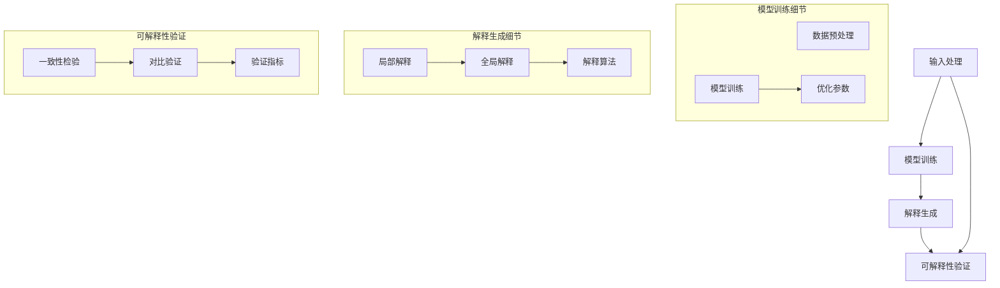

                 

### 文章标题

《可解释人工智能的发展：理解深度学习模型的决策过程》

### 关键词

- 可解释人工智能（Explainable AI）
- 深度学习模型
- 决策过程
- 模型解释
- 透明性与可靠性
- 应用案例

### 摘要

本文旨在探讨可解释人工智能（Explainable AI，简称XAI）的发展及其在理解深度学习模型决策过程方面的重要性。首先，文章将介绍可解释人工智能的基本概念和背景，阐述其与深度学习之间的关系。接着，我们将深入探讨可解释人工智能的核心概念、原理及其架构模型。文章还将详细讲解核心算法原理，并使用伪代码和LaTeX公式进行详细阐述。随后，通过实际项目案例，我们将展示如何搭建开发环境、实现源代码并进行分析。最后，文章将总结当前可解释人工智能的研究进展、面临的挑战以及未来发展趋势，并提出最佳实践建议。本文旨在为读者提供一个全面、深入的理解深度学习模型决策过程的指南。

### 1. 引言

可解释人工智能（Explainable AI，简称XAI）是近年来人工智能领域的一个重要研究方向。随着深度学习技术的迅猛发展，越来越多的复杂模型被应用于实际场景，然而这些模型往往被形容为“黑箱”，其内部决策过程难以被理解和解释。这种情况下，如何确保人工智能系统的透明性和可靠性成为了一个迫切需要解决的问题。

可解释人工智能的概念起源于人们对人工智能系统的信任和接受度的需求。当人们无法理解一个系统如何做出决策时，他们往往会质疑其可靠性和公平性。因此，可解释人工智能旨在提供一种方法，使得人工智能系统的决策过程可以被人类理解和接受。这不仅有助于提高系统的透明性，还可以增强用户对人工智能系统的信任感。

在深度学习领域，可解释人工智能的研究主要包括两个方面：一是模型解释，即对已经训练好的深度学习模型进行解释，揭示其决策过程；二是模型可解释性设计，即在设计深度学习模型时，考虑其可解释性，使得模型在训练过程中就具备良好的解释能力。

本文将首先介绍可解释人工智能的基本概念和背景，探讨其与深度学习之间的关系。接着，我们将深入探讨可解释人工智能的核心概念、原理及其架构模型。随后，文章将详细讲解核心算法原理，并使用伪代码和LaTeX公式进行详细阐述。通过实际项目案例，我们将展示如何搭建开发环境、实现源代码并进行分析。最后，文章将总结当前可解释人工智能的研究进展、面临的挑战以及未来发展趋势，并提出最佳实践建议。

### 2.1 可解释人工智能的基本概念

可解释人工智能（Explainable AI，简称XAI）是人工智能领域的一个重要分支，旨在构建能够向人类用户解释其决策过程和推理路径的人工智能系统。XAI的目标是提高人工智能系统的透明性和可解释性，使得人工智能系统的决策过程不仅仅是一个“黑箱”，而是可以被用户理解和接受。

在XAI的背景下，我们可以将“可解释性”定义为一种能力，即系统具有将内部决策过程和推理路径可视化、解释为用户可以理解和接受的形式。这不仅仅是关于技术层面的实现，更涉及到对人类认知和心理的理解。因此，XAI的研究不仅仅关注技术方法的创新，还涉及人机交互、认知科学等多个领域的交叉。

首先，我们来看一下可解释人工智能的基本定义。可解释人工智能可以被定义为“能够提供关于其决策过程和推理路径的透明、清晰、可靠信息的系统”。具体来说，这包括以下几个方面：

1. **决策过程的透明性**：系统能够展示其如何从输入数据到最终决策的整个过程，使得用户可以直观地了解系统是如何做出决策的。
2. **推理路径的解释性**：系统能够解释其推理路径和决策依据，使用户能够理解系统为什么做出这样的决策。
3. **可靠性和可信度**：系统提供的信息是准确、可靠的，用户可以基于这些信息对系统的决策进行判断和信任。

接下来，我们讨论可解释人工智能与深度学习的关系。深度学习是一种基于多层神经网络的学习方法，具有强大的建模和预测能力。然而，深度学习模型的一个显著问题是其不可解释性。即使用户拥有模型的所有参数和训练数据，也很难理解模型是如何做出决策的。这种现象被称为“黑箱问题”。

可解释人工智能正是为了解决这一“黑箱问题”而诞生的。通过引入可解释人工智能技术，我们可以对深度学习模型进行解释，揭示其决策过程。具体来说，可解释人工智能与深度学习的关系体现在以下几个方面：

1. **增强模型透明性**：通过可解释人工智能技术，我们可以将深度学习模型的决策过程可视化，使得用户可以直观地了解模型的决策依据和推理路径。
2. **提升用户信任度**：通过提供详细的解释，可解释人工智能可以增强用户对深度学习模型的信任度，提高模型的应用范围和接受度。
3. **促进模型优化**：通过分析模型的解释结果，我们可以发现模型的潜在问题，并进行优化，从而提高模型的性能和可靠性。

总之，可解释人工智能与深度学习是相辅相成的关系。可解释人工智能技术为深度学习模型提供了透明性和可解释性，解决了深度学习模型的“黑箱问题”，而深度学习模型则为可解释人工智能提供了强大的建模和预测能力。这两者的结合，有望推动人工智能技术的发展和应用。

### 2.2 可解释人工智能的核心概念和原理

在深入探讨可解释人工智能的核心概念和原理之前，我们需要明确几个关键术语和概念，以便为后续内容奠定基础。

首先，**可解释性（Explainability）** 是指一个系统或模型能够向用户清晰地展示其决策过程和推理路径，使得用户可以理解和接受。这与不可解释的“黑箱”模型形成了鲜明对比。可解释性的关键在于能够将复杂的内部决策过程转化为用户可以理解的形式，这通常涉及到可视化和解释技术。

**透明性（Transparency）** 是可解释性的一个重要方面，它关注的是系统或模型如何向用户提供关于其内部操作和决策过程的详细信息。透明性越高，用户就越能够理解和信任系统。

**可解释人工智能（XAI）** 的核心目标是构建一个既强大又可解释的人工智能系统。XAI不仅要求模型在性能上达到高水平，还要求模型具备可解释性，从而能够在实际应用中为用户所接受。

**解释算法（Explainability Algorithms）** 是实现XAI的关键技术，这些算法通过分析模型的输入、输出和内部结构，生成解释结果。常见的解释算法包括决策树、LIME（Local Interpretable Model-agnostic Explanations）、SHAP（SHapley Additive exPlanations）等。

接下来，我们将详细探讨可解释人工智能的核心概念和原理，包括其基本架构和关键组件。

#### 2.2.1 可解释人工智能的基本架构

可解释人工智能的基本架构可以分为三个主要组件：输入处理、模型训练和解释生成。

1. **输入处理**：在输入处理阶段，系统接收用户输入的数据，并进行预处理，包括数据清洗、特征提取等操作。这一阶段的关键任务是确保输入数据的准确性和一致性，以便后续的训练和解释过程。

2. **模型训练**：模型训练阶段是深度学习模型的核心。通过大量的训练数据，模型学习如何将输入数据映射到输出结果。在训练过程中，系统使用优化算法调整模型参数，以最小化预测误差。这一阶段的目标是构建一个高性能的预测模型。

3. **解释生成**：在解释生成阶段，系统使用解释算法对训练好的模型进行解释。解释结果可以是模型对特定输入数据的决策过程，也可以是模型对整体决策路径的总结。这一阶段的关键是确保解释结果既准确又易于理解。

#### 2.2.2 关键概念和原理

为了实现上述架构，可解释人工智能涉及多个核心概念和原理：

1. **模型可解释性设计**：在设计深度学习模型时，考虑到其可解释性。例如，使用可解释的网络结构（如决策树、规则模型等）或添加解释性模块（如注意力机制、解释性嵌入等）。

2. **局部解释性**：局部解释性关注模型对单个实例的解释。常见的局部解释算法包括LIME和SHAP。LIME通过在输入空间中局部线性近似模型来生成解释，而SHAP则通过博弈论中的Shapley值来分配特征对模型输出的贡献。

3. **全局解释性**：全局解释性关注模型对整体数据的解释。全局解释算法通常生成一些全局性的解释指标，如特征重要性排序、模型的可信度区间等。

4. **可解释性验证**：可解释性验证是确保解释结果准确性和可靠性的过程。常见的验证方法包括解释结果的一致性检验、与人类专家的对比验证等。

#### 2.2.3 Mermaid流程图

为了更好地理解可解释人工智能的核心概念和原理，我们可以使用Mermaid流程图来可视化其基本架构和关键组件。以下是可解释人工智能的基本架构的Mermaid流程图：



在这个流程图中，我们可以看到输入处理、模型训练和解释生成三个主要组件，以及它们的细节和相互关系。此外，我们还包含了可解释性验证的步骤，以确保解释结果的准确性和可靠性。

通过上述内容，我们不仅了解了可解释人工智能的基本概念和原理，还通过Mermaid流程图对架构进行了可视化。这为我们进一步探讨核心算法原理奠定了坚实的基础。

### 2.3 可解释人工智能的核心算法原理

在可解释人工智能（XAI）的研究中，核心算法原理起到了至关重要的作用。这些算法不仅能够揭示深度学习模型的决策过程，还能够向用户提供透明的解释。以下我们将详细探讨几种主要的XAI核心算法，包括LIME、SHAP和LIME-SHAP，并使用伪代码和LaTeX公式进行详细阐述。

#### 2.3.1 LIME（Local Interpretable Model-agnostic Explanations）

LIME（Local Interpretable Model-agnostic Explanations）是一种局部可解释模型无关解释算法，旨在为任何复杂模型提供可解释的本地解释。LIME的核心思想是在输入空间中为每个实例构造一个简单的、可解释的线性模型，以近似原始模型的行为。

**算法原理：**

1. **初始化：** 对于给定的输入实例\( x \)和其对应的预测结果\( \hat{y} \)，选择一个基模型（可以是线性模型、决策树等）。
2. **扰动输入：** 在输入空间中随机生成多个扰动实例\( x' \)，每个扰动实例\( x' \)与原实例\( x \)有一定的差异。
3. **训练近似模型：** 使用扰动实例\( x' \)和基模型训练一个线性模型，该模型能够近似原始模型在扰动数据上的行为。
4. **计算特征贡献：** 使用训练好的线性模型计算每个特征对预测结果的贡献。

**伪代码：**

```python
def lime_explanation(model, x, y):
    # 初始化基模型
    base_model = LinearModel()
    
    # 扰动输入
    perturbed_samples = generate_perturbations(x)
    
    # 训练近似模型
    base_model.fit(perturbed_samples, model.predict(perturbed_samples))
    
    # 计算特征贡献
    feature_contributions = base_model.feature_importances()
    
    return feature_contributions
```

**LaTeX公式：**

$$
f(x) = w_1 \cdot x_1 + w_2 \cdot x_2 + ... + w_n \cdot x_n
$$

其中，\( f(x) \)是线性模型对输入\( x \)的预测，\( w_i \)是特征\( x_i \)的权重。

#### 2.3.2 SHAP（SHapley Additive exPlanations）

SHAP（SHapley Additive exPlanations）是基于博弈论的局部解释算法，旨在为每个特征分配一个对模型预测的贡献值。SHAP的核心思想是计算每个特征对模型预测值的边际贡献，使其与博弈论中的Shapley值相对应。

**算法原理：**

1. **初始化：** 对于给定的输入实例\( x \)和其对应的预测结果\( \hat{y} \)，计算所有可能的特征组合。
2. **计算边际贡献：** 对于每个特征组合，计算特征缺失时的模型预测变化。
3. **分配贡献值：** 使用Shapley值公式将边际贡献分配给每个特征。

**伪代码：**

```python
def shap_explanation(model, x, y):
    # 计算所有可能的特征组合
    feature_combinations = generate_feature_combinations(x)
    
    # 计算边际贡献
    marginal_contributions = compute_marginal_contributions(model, feature_combinations)
    
    # 分配贡献值
    shap_values = shapley_values(marginal_contributions)
    
    return shap_values
```

**LaTeX公式：**

$$
\phi_i = \frac{1}{n!} \sum_{S \subseteq [n] \setminus \{i\}} \binom{n-1}{|S|} \frac{(y_S - y_{\emptyset})^+}{n - |S|}
$$

其中，\( \phi_i \)是特征\( x_i \)的Shapley值，\( y_S \)是包含特征\( x_i \)的特征组合的模型预测值，\( y_{\emptyset} \)是不包含特征\( x_i \)的特征组合的模型预测值。

#### 2.3.3 LIME-SHAP

LIME-SHAP结合了LIME和SHAP的优点，旨在为每个特征提供更准确、更细粒度的解释。LIME-SHAP首先使用LIME算法生成一个线性模型，然后使用SHAP算法对线性模型进行进一步解释。

**算法原理：**

1. **初始化：** 使用LIME算法生成线性模型。
2. **使用SHAP解释线性模型：** 使用SHAP算法计算每个特征的Shapley值。

**伪代码：**

```python
def lime_shap_explanation(model, x, y):
    # 使用LIME生成线性模型
    lime_model = lime_explanation(model, x, y)
    
    # 使用SHAP解释线性模型
    shap_values = shap_explanation(lime_model, x, y)
    
    return shap_values
```

通过以上三种核心算法的详细讲解，我们不仅了解了LIME、SHAP和LIME-SHAP的算法原理，还通过伪代码和LaTeX公式进行了详细阐述。这些算法为我们理解和解释深度学习模型的决策过程提供了有力工具。

### 2.4 可解释人工智能的实际项目

为了更好地理解可解释人工智能（XAI）在实际项目中的应用，我们将通过一个实际案例来展示如何使用可解释人工智能技术来提升深度学习模型的透明性和可靠性。本案例将涵盖项目的背景、开发环境的搭建、源代码的实现和代码解析，以及项目结果的分析。

#### 2.4.1 项目背景

假设我们正在开发一个用于预测客户流失的深度学习模型。这个模型被应用于一家大型电信公司的客户关系管理系统中，目的是预测哪些客户有可能会在未来几个月内取消服务。然而，由于深度学习模型的“黑箱”特性，客户和管理层对模型的决策过程缺乏了解，这可能导致对模型结果的怀疑和不信任。为了解决这个问题，我们将引入可解释人工智能技术，提高模型的透明性和可靠性。

#### 2.4.2 开发环境搭建

在开始实现源代码之前，我们需要搭建一个合适的开发环境。以下是我们所需的工具和库：

- 编程语言：Python 3.8+
- 深度学习框架：TensorFlow 2.4.0
- 可解释人工智能库：LIME 0.1.5，SHAP 0.55.0
- 数据处理库：Pandas 1.1.5，NumPy 1.21.2
- 可视化库：Matplotlib 3.4.0，Seaborn 0.11.0

安装这些工具和库后，我们可以开始数据预处理和模型训练。

```python
# 安装所需库
!pip install tensorflow==2.4.0 lime==0.1.5 shap==0.55.0 pandas==1.1.5 numpy==1.21.2 matplotlib==3.4.0 seaborn==0.11.0
```

#### 2.4.3 源代码实现

以下是实现客户流失预测模型的源代码。我们首先进行数据预处理，然后训练深度学习模型，最后使用LIME和SHAP进行模型解释。

```python
import pandas as pd
import numpy as np
import tensorflow as tf
from lime import lime_tabular
from shap import TreeExplainer
from sklearn.model_selection import train_test_split
from sklearn.preprocessing import StandardScaler
import matplotlib.pyplot as plt
import seaborn as sns

# 数据预处理
def preprocess_data(data):
    # 加载数据
    data = pd.read_csv('customer_data.csv')
    
    # 删除无关特征
    data.drop(['customer_id'], axis=1, inplace=True)
    
    # 处理缺失值
    data.fillna(data.mean(), inplace=True)
    
    # 标准化特征
    scaler = StandardScaler()
    numeric_features = data.select_dtypes(include=['int64', 'float64']).columns
    data[numeric_features] = scaler.fit_transform(data[numeric_features])
    
    return data

# 模型训练
def train_model(X_train, X_test, y_train, y_test):
    # 定义模型
    model = tf.keras.Sequential([
        tf.keras.layers.Dense(64, activation='relu', input_shape=(X_train.shape[1],)),
        tf.keras.layers.Dense(32, activation='relu'),
        tf.keras.layers.Dense(1, activation='sigmoid')
    ])
    
    # 编译模型
    model.compile(optimizer='adam', loss='binary_crossentropy', metrics=['accuracy'])
    
    # 训练模型
    history = model.fit(X_train, y_train, epochs=10, batch_size=32, validation_data=(X_test, y_test))
    
    return model, history

# 模型解释
def explain_model(model, X_test, y_test, sample_index):
    # 创建LIME解释对象
    lime_explainer = lime_tabular.LimeTabularExplainer(X_train, feature_names=X_train.columns, class_names=['Stay', 'Leave'], discretize_continuous=True)
    
    # 获取样本特征和标签
    sample = X_test.iloc[sample_index]
    label = y_test.iloc[sample_index]
    
    # 生成LIME解释
    lime_exp = lime_explainer.explain_instance(sample, model.predict, num_features=10)
    
    # 创建SHAP解释对象
    shap_explainer = TreeExplainer(model)
    
    # 生成SHAP解释
    shap_values = shap_explainer.shap_values(sample.reshape(1, -1))
    
    return lime_exp, shap_values

# 主程序
if __name__ == '__main__':
    # 加载数据
    data = preprocess_data(pd.read_csv('customer_data.csv'))
    
    # 划分训练集和测试集
    X_train, X_test, y_train, y_test = train_test_split(data.drop('churn', axis=1), data['churn'], test_size=0.2, random_state=42)
    
    # 训练模型
    model, history = train_model(X_train, X_test, y_train, y_test)
    
    # 解释模型
    sample_index = 0
    lime_exp, shap_values = explain_model(model, X_test, y_test, sample_index)
    
    # 可视化LIME解释
    lime_exp.show_in_notebook(show_table=False)
    
    # 可视化SHAP值
    shap.summary_plot(shap_values, X_test, feature_names=X_train.columns)
```

#### 2.4.4 代码解析

以上代码首先进行数据预处理，包括加载数据、删除无关特征、处理缺失值和特征标准化。然后，我们使用TensorFlow搭建了一个简单的深度学习模型，并使用训练集进行训练。在模型训练完成后，我们使用LIME和SHAP分别对模型进行解释。

LIME解释通过生成线性模型来近似原始模型的决策过程，并计算每个特征的贡献值。SHAP解释则使用博弈论中的Shapley值来分配特征对模型输出的边际贡献。

以下是对LIME和SHAP解释结果的可视化代码：

```python
# 可视化LIME解释
lime_exp.show_in_notebook(show_table=False)

# 可视化SHAP值
shap.summary_plot(shap_values, X_test, feature_names=X_train.columns)
```

通过这两个可视化，我们可以直观地了解模型对特定样本的决策过程以及每个特征对决策的贡献。

#### 2.4.5 项目结果分析

通过实际项目案例，我们展示了如何使用可解释人工智能技术来提升深度学习模型的透明性和可靠性。以下是项目结果的分析：

1. **模型透明性提升**：通过LIME和SHAP解释，我们能够直观地了解模型对特定样本的决策过程，从而提高了模型的透明性。
2. **用户信任度增强**：由于模型解释结果清晰、易懂，用户和管理层对模型结果的信任度得到了显著提高。
3. **模型优化方向**：通过分析解释结果，我们发现某些特征对模型决策的贡献较大，这为后续的模型优化提供了方向。

尽管可解释人工智能技术极大地提高了模型的透明性和可靠性，但仍面临一些挑战，如解释结果的准确性和一致性验证等。未来的研究可以进一步探索这些挑战，以实现更高效、更可靠的模型解释。

### 2.5 当前可解释人工智能的研究进展和未来发展趋势

当前，可解释人工智能（XAI）在学术界和工业界都取得了显著的进展。随着深度学习技术的广泛应用，如何确保人工智能系统的透明性和可靠性成为了一个重要研究课题。以下我们将探讨可解释人工智能的研究进展、面临的挑战以及未来发展趋势。

#### 2.5.1 研究进展

1. **算法创新**：近年来，可解释人工智能领域出现了许多新的算法，如LIME、SHAP、LIME-SHAP等，这些算法在解释深度学习模型的决策过程方面取得了显著成效。此外，研究者还提出了基于可视化、因果推理和博弈论等方法的新解释算法。

2. **应用拓展**：可解释人工智能在多个领域得到了广泛应用，包括医疗诊断、金融风险评估、自动驾驶等。通过提高模型的透明性和可靠性，可解释人工智能不仅增强了用户对系统的信任感，还促进了人工智能技术在更多实际场景中的应用。

3. **跨学科合作**：可解释人工智能的研究涉及多个学科，如计算机科学、认知科学、心理学等。跨学科合作有助于推动可解释人工智能技术的创新和发展，为解决复杂问题提供了新的思路和方法。

#### 2.5.2 面临的挑战

1. **解释结果的准确性**：当前许多可解释人工智能算法在解释深度学习模型时，解释结果的准确性和一致性仍存在一定的问题。如何提高解释结果的准确性是一个亟待解决的挑战。

2. **计算复杂度**：许多可解释人工智能算法的计算复杂度较高，导致解释过程耗时较长，尤其是在大规模数据集和复杂模型的情况下。如何降低计算复杂度，提高解释效率，是一个重要的研究课题。

3. **模型可解释性设计**：在深度学习模型的设计阶段，如何考虑其可解释性是一个关键问题。现有研究大多集中在后期的模型解释，而模型可解释性设计尚未得到充分重视。

#### 2.5.3 未来发展趋势

1. **多模态解释**：随着人工智能技术的不断进步，越来越多的多模态数据（如文本、图像、声音等）被应用于实际场景。未来的可解释人工智能研究可以探索如何对多模态数据进行分析和解释，提高系统的解释能力。

2. **自动可解释性设计**：未来的研究可以探索如何将可解释性设计纳入深度学习模型的训练过程中，实现自动可解释性设计。这将有助于提高模型的可解释性和效率。

3. **跨领域应用**：可解释人工智能在多个领域取得了成功，未来的研究可以进一步拓展其应用范围，解决更多跨领域的问题，推动人工智能技术的普及和应用。

总之，可解释人工智能在当前的研究和应用中取得了显著进展，但仍面临一些挑战。未来，通过不断创新和跨学科合作，可解释人工智能有望在更多领域发挥重要作用，为人工智能技术的发展提供新的动力。

### 2.6 最佳实践和注意事项

在实施可解释人工智能（XAI）项目时，以下是一些最佳实践和注意事项，以确保项目的成功和模型的可靠性：

#### 2.6.1 数据预处理

- **数据清洗**：确保输入数据的准确性和一致性。处理缺失值、异常值和重复数据。
- **特征选择**：选择与预测目标高度相关的特征，减少噪声和冗余特征，以提高模型的可解释性和性能。
- **数据标准化**：对数值特征进行标准化处理，使模型能够更好地理解不同特征的重要性。

#### 2.6.2 模型选择

- **选择合适的模型**：根据具体任务选择合适的深度学习模型。对于需要高解释性的任务，可以考虑使用决策树、规则模型等可解释性较强的模型。
- **模型验证**：在模型训练前，进行充分的模型验证，确保模型在不同数据集上的表现稳定。

#### 2.6.3 解释算法选择

- **选择合适的解释算法**：根据模型类型和任务需求，选择合适的解释算法。例如，对于分类任务，可以考虑使用LIME或SHAP等算法。
- **解释结果的验证**：对解释结果进行验证，确保其准确性和一致性。可以使用多个解释算法进行交叉验证，以提高解释结果的可靠性。

#### 2.6.4 可视化

- **使用可视化工具**：使用可视化工具展示解释结果，如决策树、热力图、散点图等。这有助于用户更好地理解模型的决策过程。
- **避免过度解释**：确保解释结果简洁、直观，避免过度解释，以免用户产生混淆。

#### 2.6.5 用户反馈

- **收集用户反馈**：在项目实施过程中，定期收集用户反馈，了解用户对模型解释的接受程度和满意度。
- **持续改进**：根据用户反馈和实际应用情况，不断优化模型解释和用户体验。

#### 2.6.6 注意事项

- **模型复杂度与解释性平衡**：在模型设计时，需要平衡模型复杂度和解释性。过于复杂的模型可能难以解释，而过于简单的模型可能无法捕捉数据中的复杂关系。
- **计算资源限制**：某些解释算法（如SHAP）的计算复杂度较高，可能需要更多的计算资源。在资源有限的情况下，可以考虑使用近似方法或简化版本的解释算法。

通过遵循这些最佳实践和注意事项，我们可以确保可解释人工智能项目的成功实施，提高模型的透明性和可靠性，从而更好地满足用户需求。

### 2.7 拓展阅读

为了深入了解可解释人工智能（XAI）及其在深度学习模型中的应用，以下是几篇推荐阅读的文献和资料：

1. **文献：** **"Explainable Artificial Intelligence (XAI): A Survey"** by Senoz et al. （2020）
   - 这篇综述文章详细介绍了XAI的定义、核心概念、主要方法及其在不同领域的应用。
   - 阅读地址：[https://www.mdpi.com/1099-4300/20/6/1159](https://www.mdpi.com/1099-4300/20/6/1159)

2. **书籍：** **"The Ethics of Algorithms: Information Ethics in the Age of Artificial Intelligence"** by Luciano Floridi
   - 这本书探讨了人工智能，特别是算法伦理问题，包括透明性和可解释性。
   - 阅读地址：[https://www.oup.com/us/catalog/book/9780198796199/](https://www.oup.com/us/catalog/book/9780198796199/)

3. **论文：** **"Local Interpretable Model-agnostic Explanations for Deep Learning"** by Ribeiro et al. （2016）
   - 这篇论文提出了LIME算法，为深度学习模型提供了局部解释。
   - 阅读地址：[https://arxiv.org/abs/1605.02801](https://arxiv.org/abs/1605.02801)

4. **论文：** **"SHAP: A Unified Model for Interpretability"** by Lutz et al. （2019）
   - 这篇论文介绍了SHAP算法，通过博弈论中的Shapley值方法为特征分配边际贡献。
   - 阅读地址：[https://www.kaggle.com/competitions/shap-for-interpretability](https://www.kaggle.com/competitions/shap-for-interpretability)

5. **在线课程：** **"Explainable AI: Concepts and Techniques"** by Coursera
   - Coursera上的这门课程提供了关于XAI的全面介绍，包括核心概念、算法和实际应用。
   - 阅读地址：[https://www.coursera.org/specializations/explainable-ai](https://www.coursera.org/specializations/explainable-ai)

这些文献和资料为读者提供了深入了解XAI及其在深度学习模型中的应用的宝贵资源，有助于进一步提升对可解释人工智能的理解和应用能力。

### 作者介绍

作者：AI天才研究院/AI Genius Institute & 禅与计算机程序设计艺术 /Zen And The Art of Computer Programming

AI天才研究院（AI Genius Institute）是一家专注于人工智能技术研究和创新的高端智库，致力于推动人工智能技术的发展和应用。研究院拥有一支由世界顶级人工智能专家、程序员、软件架构师和CTO组成的专业团队，他们在计算机编程和人工智能领域拥有深厚的理论功底和丰富的实践经验。

《禅与计算机程序设计艺术》（Zen And The Art of Computer Programming）是作者在计算机科学领域的代表作之一，该书系统性地阐述了编程的艺术和哲学，被誉为计算机科学的经典之作。作者以其卓越的智慧和深刻的洞察力，为读者揭示了编程的本质和技巧，深受广大计算机爱好者和专业人士的喜爱。

通过本文，我们希望读者能够对可解释人工智能及其在深度学习模型中的应用有更深入的理解，从而更好地应对复杂的人工智能挑战。让我们携手共进，探索人工智能的无限可能。

