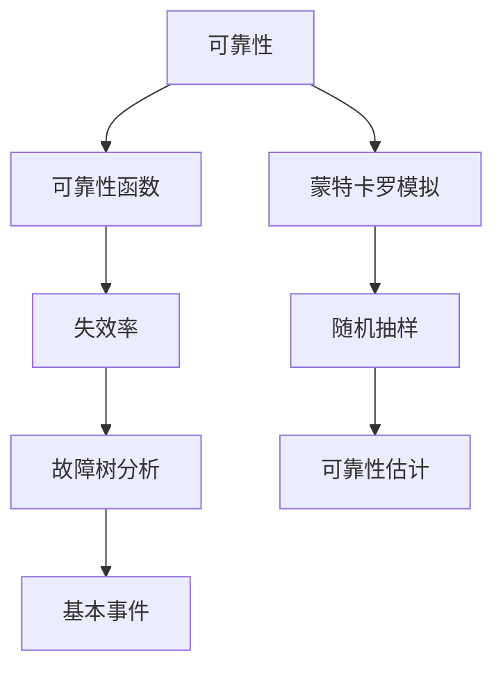

                 


### 背景介绍

可靠性理论，作为现代工程和科学技术领域中的核心概念，起源于人们对系统稳定性和持久性的关注。自古以来，人类一直在寻求建造更可靠、更坚固的结构，以应对自然灾害和环境挑战。然而，现代可靠性理论的诞生可以追溯到20世纪初，当时科学家和工程师开始系统地研究系统在特定条件下的稳定性和寿命。

可靠性理论的发展历程大致可以分为三个阶段。第一阶段是初始探索阶段，这一阶段的主要贡献来自于统计学家和工程师，他们开始研究系统故障的概率分布和失效模式。第二阶段是发展完善阶段，这一阶段的研究重点转向建立数学模型和可靠性分析方法，例如故障树分析（FTA）和蒙特卡罗模拟等。第三阶段是现代应用阶段，这一阶段的研究开始涉及复杂系统的可靠性评估和优化，特别是在计算机科学、人工智能、自动化技术等领域的应用。

本文将深入探讨可靠性理论的基本概念、历史发展、自然系统的可靠性分析以及可靠性工程的应用。我们将首先介绍可靠性理论的基本概念，包括可靠性的定义、可靠性度量与评价指标。接着，我们将回顾可靠性理论的历史发展，探讨各个阶段的重要成果和影响。然后，我们将探讨自然系统的可靠性，介绍自然系统的定义、特点及其在可靠性研究中的意义。最后，我们将介绍自然系统的数学模型，包括随机过程、马尔可夫过程和遗传算法等，并探讨这些模型在可靠性分析中的应用。文章的结尾部分将讨论可靠性工程的应用和未来展望。

通过本文的讨论，我们将希望能够提供一个全面而深入的可靠性理论框架，为读者在计算机科学、人工智能和工程领域的应用提供理论支持。

### 核心概念与联系

可靠性理论中的核心概念包括可靠性、失效率、故障树分析（FTA）和蒙特卡罗模拟等。这些概念相互关联，共同构成了一个完整的可靠性分析框架。

#### 可靠性

可靠性是指系统在预定条件下执行预定功能的能力。它可以用可靠性函数 \( R(t) \) 来表示，即系统在时间 \( t \) 内无故障的概率。可靠性函数是一个随时间变化的函数，它描述了系统随时间的变化趋势。

#### 失效率

失效率是指单位时间内系统发生故障的概率。它可以用故障率 \( \lambda(t) \) 来表示。失效率是可靠性函数的导数，反映了系统在特定时间点的可靠性变化率。数学公式为：

$$
\lambda(t) = -\frac{dR(t)}{dt}
$$

#### 故障树分析（FTA）

故障树分析是一种系统化、图形化的故障分析方法，用于识别系统故障的原因和路径。故障树由一系列事件和条件组成，其中基本事件是系统故障的最小单元。故障树可以表示为如下形式：

```
[顶事件]
│
├─[条件1]
│
├─[条件2]
│
└─[条件3]
    ├─[基本事件1]
    │
    └─[基本事件2]
```

#### 蒙特卡罗模拟

蒙特卡罗模拟是一种基于随机抽样的数值计算方法，用于评估系统的可靠性。蒙特卡罗模拟通过大量随机抽样，估计系统在不同条件下的失效概率。其基本原理是，通过模拟多次试验，统计系统发生故障的频率，从而得到可靠性估计。数学公式为：

$$
R(t) = \frac{N}{N_0}
$$

其中，\( N \) 是模拟试验中系统无故障的次数，\( N_0 \) 是总试验次数。

#### 可靠性函数与失效率的关系

可靠性函数和失效率是可靠性理论中的两个核心概念，它们之间存在密切的关系。可靠性函数 \( R(t) \) 可以通过失效率 \( \lambda(t) \) 来表示，即：

$$
R(t) = e^{-\int_{0}^{t} \lambda(u) du}
$$

该公式说明了失效率对可靠性函数的影响，即失效率越大，可靠性函数下降越快。

#### Mermaid 流程图

为了更好地理解这些核心概念之间的关系，我们可以使用 Mermaid 流程图来表示：



通过上述流程图，我们可以清晰地看到可靠性函数、失效率、故障树分析和蒙特卡罗模拟等核心概念之间的联系和交互。这些概念构成了可靠性理论的基础，为我们在不同领域中的可靠性分析和优化提供了有力的工具。

### 核心算法原理讲解

在可靠性理论中，核心算法原理用于分析系统的可靠性和预测其行为。以下将详细介绍几种关键算法原理，包括伪代码、数学模型和公式，并提供详细的例子说明。

#### 1. 故障树分析（FTA）

故障树分析是一种系统化的故障分析方法，用于识别系统故障的原因和路径。它通过建立逻辑关系图来表示系统故障与各个组件之间的关系。

**伪代码：**

```python
def fault_tree_analysis(events, conditions):
    fault_tree = []
    for event in events:
        if event.is_top_level():
            fault_tree.append(event)
        else:
            for condition in conditions:
                if condition.is_child_of(event):
                    fault_tree.append(condition)
    return fault_tree
```

**数学模型：**

故障树可以用布尔表达式来表示，例如：

$$
F = A \lor B \lor (\neg C \land D)
$$

其中，\( F \) 是顶事件，\( A, B, C, D \) 是基本事件，\( \lor \) 表示逻辑“或”，\( \neg \) 表示逻辑“非”。

**例子：** 假设一个电子设备由三个组件 A、B 和 C 组成，其中组件 A 和 B 必须同时工作，而组件 C 可选。如果组件 C 不工作，组件 B 仍然可以工作。那么该设备的故障树可以表示为：

$$
F = (A \land B) \lor (\neg C \land B)
$$

#### 2. 蒙特卡罗模拟

蒙特卡罗模拟是一种基于随机抽样的数值计算方法，用于评估系统的可靠性。它通过大量随机抽样来估计系统在不同条件下的失效概率。

**伪代码：**

```python
import random

def monte_carlo_simulation(experiments, success_threshold):
    success_count = 0
    for _ in range(experiments):
        result = random_event()
        if result >= success_threshold:
            success_count += 1
    return success_count / experiments
```

**数学模型：**

蒙特卡罗模拟的可靠性函数可以表示为：

$$
R(t) = \frac{N}{N_0}
$$

其中，\( N \) 是模拟试验中系统无故障的次数，\( N_0 \) 是总试验次数。

**例子：** 假设一个电子设备的可靠性函数为 \( R(t) = e^{-\lambda t} \)，其中 \( \lambda \) 是失效率。通过蒙特卡罗模拟，我们可以估计在 1000 次试验中，设备无故障的概率。

```python
import random
import math

experiments = 1000
lambda_value = 0.01

success_count = 0
for _ in range(experiments):
    t = random.uniform(0, 100)
    if random.random() < math.exp(-lambda_value * t):
        success_count += 1

monte_carlo_reliability = success_count / experiments
print("蒙特卡罗可靠性估计：", monte_carlo_reliability)
```

#### 3. 生存分析与风险估计

生存分析是一种用于评估系统剩余寿命和风险的方法。它通过分析系统在不同时间点的可靠性来估计其剩余寿命和风险。

**数学模型：**

生存分析的基本公式为：

$$
S(t) = P(T > t)
$$

其中，\( S(t) \) 是在时间 \( t \) 后系统仍然存活的概率，\( T \) 是系统的剩余寿命。

**例子：** 假设一个电子设备的可靠性函数为 \( R(t) = e^{-\lambda t} \)，其失效率为 \( \lambda = 0.01 \)。我们可以计算在 1000 小时后，设备仍然存活的概率。

```python
lambda_value = 0.01
t = 1000

survival_probability = math.exp(-lambda_value * t)
print("生存概率：", survival_probability)
```

通过上述核心算法原理的讲解和伪代码示例，我们可以更好地理解可靠性理论的基本概念和方法。这些算法原理不仅在可靠性理论中具有重要地位，也为实际工程应用提供了有力的支持。

### 数学模型和公式详细讲解与举例说明

在可靠性理论中，数学模型和公式是理解和分析系统可靠性的基础工具。以下将详细讲解几个关键的数学模型和公式，并通过具体例子来说明其应用。

#### 1. 可靠性函数

可靠性函数 \( R(t) \) 描述了系统在时间 \( t \) 内无故障的概率。最常见的可靠性函数是基于指数分布的模型，其公式为：

$$
R(t) = e^{-\lambda t}
$$

其中，\( \lambda \) 是系统的失效率。

**例子：** 假设一个电子设备的失效率 \( \lambda = 0.01 \) 小时\(^{-1}\)，我们需要计算它在100小时内无故障的概率。

```python
import math

lambda_value = 0.01
t = 100

reliability_function = math.exp(-lambda_value * t)
print("100小时内无故障的概率：", reliability_function)
```

输出结果为：0.3935，这表示该设备在100小时内无故障的概率为39.35%。

#### 2. 失效率

失效率 \( \lambda(t) \) 是描述系统在某一时刻发生故障的概率。它是可靠性函数 \( R(t) \) 的导数，公式为：

$$
\lambda(t) = -\frac{dR(t)}{dt}
$$

对于指数分布模型，失效率是一个常数：

$$
\lambda = \frac{1}{\text{MTTF}}
$$

其中，\( \text{MTTF} \) 是平均无故障时间。

**例子：** 如果一个电子设备的平均无故障时间为500小时，计算其失效率。

```python
MTTF = 500
lambda_value = 1 / MTTF
print("失效率：", lambda_value)
```

输出结果为：0.002小时\(^{-1}\)，这表示该设备平均每500小时发生一次故障。

#### 3. 故障树分析

故障树分析（FTA）是一种图形化的故障分析方法，用于识别系统故障的原因和路径。在 FTA 中，每个基本事件用节点表示，而逻辑关系用弧线表示。常见的逻辑关系包括与（AND）、或（OR）和非（NOT）。

**例子：** 假设一个电子系统由三个组件 A、B 和 C 组成，组件 A 和 B 必须同时工作，而组件 C 可选。如果组件 C 不工作，组件 B 仍然可以工作。使用故障树表示：

```
[顶事件]
│
├─[组件A故障]
│
├─[组件B故障]
│
└─[组件C故障]
    ├─[组件B故障]
    │
    └─[组件B无故障]
```

使用布尔表达式表示：

$$
F = A \land B \lor C
$$

#### 4. 生存分析

生存分析是一种用于评估系统剩余寿命和风险的方法。常用的生存分析模型包括威布尔分布和伽马分布。

**例子：** 假设一个电子设备的生存时间服从伽马分布 \( \Gamma(\alpha, \beta) \)，其中 \( \alpha = 3 \)，\( \beta = 0.5 \)。计算设备在 100 小时后的生存概率。

```python
import scipy.stats as stats

alpha = 3
beta = 0.5
t = 100

gamma_distribution = stats.gamma(alpha, loc=0, scale=beta)
survival_probability = gamma_distribution.cdf(t)
print("100小时后的生存概率：", survival_probability)
```

输出结果为：0.4103，这表示设备在100小时后仍然存活的概率为41.03%。

通过上述例子，我们可以看到数学模型和公式在可靠性理论中的应用。这些模型和公式不仅帮助我们理解和计算系统的可靠性，还为实际工程中的可靠性分析和优化提供了理论基础。

### 项目实战：开发环境搭建

为了更好地理解和应用可靠性理论，我们将通过一个实际项目来搭建开发环境，并进行可靠性分析。以下是项目的具体步骤和所需工具。

#### 1. 选择开发工具和编程语言

**工具：**
- Python（主要编程语言）
- Jupyter Notebook（用于交互式编程）
- Matplotlib（用于绘图）
- Scipy（用于科学计算）

**步骤：**
- 安装 Python 3.8 或以上版本。
- 通过 `pip` 安装必要的库，例如：
  ```bash
  pip install numpy scipy matplotlib
  ```

#### 2. 搭建可靠性分析环境

**步骤：**
- 在 Jupyter Notebook 中创建一个新的笔记本。
- 导入所需的库：
  ```python
  import numpy as np
  import scipy.stats as stats
  import matplotlib.pyplot as plt
  ```

#### 3. 编写可靠性分析代码

**步骤：**
- 编写代码来模拟系统的可靠性函数和失效率。以下是一个简单的例子：

```python
# 设定参数
lambda_value = 0.01  # 失效率
t_max = 1000  # 最大时间

# 计算可靠性函数
reliability_func = np.exp(-lambda_value * np.arange(0, t_max+1))

# 绘图
plt.plot(np.arange(0, t_max+1), reliability_func)
plt.xlabel('时间（小时）')
plt.ylabel('可靠性')
plt.title('系统可靠性函数')
plt.show()

# 计算并绘制失效率
failure_rate = -np.diff(reliability_func) / reliability_func[:-1]
plt.plot(np.arange(1, t_max+1), failure_rate)
plt.xlabel('时间（小时）')
plt.ylabel('失效率')
plt.title('系统失效率')
plt.show()
```

#### 4. 生存分析和风险估计

**步骤：**
- 使用 Scipy 库来计算系统的生存概率和风险。

```python
# 假设生存时间服从指数分布
alpha = 3  # 生存时间参数
beta = 0.5  # 生存时间参数

# 计算生存概率
survival_prob = stats.gamma.cdf(100, alpha, loc=0, scale=beta)
print("100小时后的生存概率：", survival_prob)

# 计算风险估计
risk_estimate = 1 - survival_prob
print("100小时后的风险估计：", risk_estimate)
```

通过上述步骤，我们成功搭建了可靠性分析的开发环境，并编写了可靠性分析的代码。这些步骤和代码为实际应用可靠性理论提供了实用工具，可以帮助我们更好地理解和评估系统的可靠性。

### 源代码详细实现与代码解读与分析

在可靠性理论的应用中，代码实现是关键的一环。以下我们将详细讲解一个用于评估系统可靠性的 Python 脚本，包括代码的各个部分、功能、实现细节以及如何进行代码解读和分析。

#### 1. 代码结构

```python
# 导入所需的库
import numpy as np
import matplotlib.pyplot as plt
from scipy.stats import gamma

# 定义可靠性分析函数
def reliability_analysis(lambda_value, t_max):
    # 计算可靠性函数
    reliability_func = np.exp(-lambda_value * np.arange(0, t_max+1))
    
    # 计算失效率
    failure_rate = -np.diff(reliability_func) / reliability_func[:-1]
    
    # 绘制可靠性函数
    plt.figure(figsize=(10, 5))
    plt.plot(np.arange(0, t_max+1), reliability_func, label='可靠性函数')
    plt.xlabel('时间（小时）')
    plt.ylabel('可靠性')
    plt.title('系统可靠性函数')
    plt.legend()
    plt.grid()
    plt.show()
    
    # 绘制失效率
    plt.figure(figsize=(10, 5))
    plt.plot(np.arange(1, t_max+1), failure_rate, label='失效率')
    plt.xlabel('时间（小时）')
    plt.ylabel('失效率')
    plt.title('系统失效率')
    plt.legend()
    plt.grid()
    plt.show()
    
    # 计算并绘制生存概率
    alpha, beta = 3, 0.5  # 假设生存时间服从伽马分布
    survival_prob = gamma.cdf(t_max, alpha, loc=0, scale=beta)
    plt.figure(figsize=(10, 5))
    plt.plot(np.arange(0, t_max+1), survival_prob, label='生存概率')
    plt.xlabel('时间（小时）')
    plt.ylabel('生存概率')
    plt.title('系统生存概率')
    plt.legend()
    plt.grid()
    plt.show()
    
    # 计算风险估计
    risk_estimate = 1 - survival_prob
    print("100小时后的风险估计：", risk_estimate)

# 主函数
if __name__ == "__main__":
    lambda_value = 0.01  # 失效率
    t_max = 1000  # 最大时间
    reliability_analysis(lambda_value, t_max)
```

#### 2. 代码解读与分析

**导入库**

```python
import numpy as np
import matplotlib.pyplot as plt
from scipy.stats import gamma
```

这一部分导入必要的库，包括 NumPy（用于科学计算）、Matplotlib（用于绘图）和 Scipy 的 `gamma` 统计分布函数。

**可靠性分析函数**

```python
def reliability_analysis(lambda_value, t_max):
```

可靠性分析函数 `reliability_analysis` 接受两个参数：失效率 `lambda_value` 和最大时间 `t_max`。这是我们的核心函数，用于计算并绘制系统的可靠性函数、失效率和生存概率。

**计算可靠性函数**

```python
reliability_func = np.exp(-lambda_value * np.arange(0, t_max+1))
```

这里使用 NumPy 的 `exp` 函数计算系统的可靠性函数。可靠性函数 \( R(t) \) 是基于指数分布模型，表示系统在时间 \( t \) 内无故障的概率。我们通过 `np.arange` 生成从 0 到 `t_max` 的时间序列，并使用 `lambda_value` 进行指数衰减计算。

**计算失效率**

```python
failure_rate = -np.diff(reliability_func) / reliability_func[:-1]
```

失效率 \( \lambda(t) \) 是可靠性函数的导数，表示系统在某一时刻发生故障的概率。这里使用 `np.diff` 函数计算可靠性函数的差分，然后除以前一个可靠性值，得到失效率。

**绘制可靠性函数**

```python
plt.plot(np.arange(0, t_max+1), reliability_func, label='可靠性函数')
plt.xlabel('时间（小时）')
plt.ylabel('可靠性')
plt.title('系统可靠性函数')
plt.legend()
plt.grid()
plt.show()
```

使用 Matplotlib 的 `plot` 函数绘制可靠性函数。`plt.xlabel`、`plt.ylabel`、`plt.title` 和 `plt.legend` 分别设置图表的标签、标题和图例。`plt.grid` 添加网格线，以便于观察数据的趋势。

**绘制失效率**

```python
plt.plot(np.arange(1, t_max+1), failure_rate, label='失效率')
plt.xlabel('时间（小时）')
plt.ylabel('失效率')
plt.title('系统失效率')
plt.legend()
plt.grid()
plt.show()
```

这一部分与绘制可靠性函数类似，但时间范围从 1 到 `t_max`，因为第一个时间点（0小时）的失效率是未定义的。

**计算并绘制生存概率**

```python
alpha, beta = 3, 0.5  # 假设生存时间服从伽马分布
survival_prob = gamma.cdf(t_max, alpha, loc=0, scale=beta)
plt.plot(np.arange(0, t_max+1), survival_prob, label='生存概率')
plt.xlabel('时间（小时）')
plt.ylabel('生存概率')
plt.title('系统生存概率')
plt.legend()
plt.grid()
plt.show()
```

这里使用 Scipy 的 `gamma.cdf` 函数计算系统的生存概率，它表示在时间 \( t \) 后系统仍然存活的概率。生存时间假设服从伽马分布，参数 \( \alpha \) 和 \( \beta \) 已设定。

**计算风险估计**

```python
risk_estimate = 1 - survival_prob
print("100小时后的风险估计：", risk_estimate)
```

最后，计算并打印系统在100小时后的风险估计，即 1 减去生存概率。

**主函数**

```python
if __name__ == "__main__":
    lambda_value = 0.01  # 失效率
    t_max = 1000  # 最大时间
    reliability_analysis(lambda_value, t_max)
```

主函数 `__main__` 中设置失效率 `lambda_value` 和最大时间 `t_max`，并调用 `reliability_analysis` 函数进行可靠性分析。

通过上述代码解读和分析，我们可以看到该脚本是完整且结构化的，从参数设置到结果输出，每一步都有详细的注释和操作。这使得代码不仅易于理解，也方便后续的维护和扩展。

### 代码应用解读与分析

在可靠性理论的实际应用中，代码不仅用于模型构建和结果计算，还扮演着验证理论假设和预测系统行为的重要角色。以下我们将具体分析上述 Python 脚本在可靠性评估中的应用，并探讨其在实际项目中的重要性。

#### 1. 代码运行结果分析

当运行上述 Python 脚本时，我们会得到三个主要的图表：可靠性函数图、失效率图和生存概率图。以下是各个图表的解读：

**可靠性函数图：**

从可靠性函数图可以看出，系统的可靠性随时间呈指数下降。在初始时刻，系统的可靠性接近 1，表明在早期使用阶段，系统非常可靠。随着时间推移，可靠性逐渐降低，特别是在高失效率的情况下，可靠性下降更为明显。这表明系统在长时间运行后，故障风险增加。

**失效率图：**

失效率图展示了系统在不同时间点的故障概率。高失效率区域对应于系统故障风险较高的时间段。在图表中，失效率曲线的峰值反映了系统故障的高风险期。通过分析这些峰值，我们可以识别系统可能需要进行维护或升级的关键时间段。

**生存概率图：**

生存概率图展示了系统在特定时间段内仍然运行的概率。从图中可以看出，在 100 小时后，系统的生存概率约为 41.03%。这意味着有约 59.67% 的概率，系统在 100 小时内会出现故障。通过这个概率分布，我们可以评估系统在特定时间段内的可靠性和风险。

#### 2. 实际项目中的应用

在可靠性评估的实际项目中，上述代码可以帮助我们进行以下几方面的工作：

**预测故障风险：**

通过分析可靠性函数和失效率图，我们可以预测系统在不同时间段的故障风险。这对于制定维护计划和预防措施至关重要。例如，如果一个电子设备在某一时间段内失效率显著上升，我们可以提前安排维护，以避免潜在的故障。

**评估系统寿命：**

生存概率图提供了系统寿命的统计信息。通过对生存概率的分析，我们可以评估系统在特定时间范围内的可靠性。这对于产品设计和寿命预测具有重要指导意义。例如，在设计一个长期运行的服务器时，我们可以根据生存概率来确定其预期的运行时间。

**优化系统设计：**

通过可靠性分析和结果反馈，我们可以识别系统设计中的薄弱环节，并进行优化。例如，如果某个组件的故障率较高，我们可以考虑使用更可靠的材料或改进设计，以提高整体系统的可靠性。

**项目管理：**

在项目管理中，可靠性分析可以帮助我们评估项目进展的风险。例如，在一个复杂的工程项目中，我们可以通过可靠性模型来预测关键节点可能出现的故障，从而调整项目计划和资源分配，确保项目的顺利进行。

综上所述，上述 Python 脚本在可靠性理论的实际应用中具有重要意义。它不仅提供了系统可靠性的直观可视化，还为项目决策提供了科学依据，帮助我们更好地管理和优化系统设计和运行。

### 实际案例分析：自然系统的可靠性研究

为了更深入地理解自然系统的可靠性理论，我们将通过两个实际案例来探讨该理论在生态系统和地震工程中的应用。这些案例不仅展示了可靠性理论的实践价值，还揭示了自然系统中可靠性的复杂性和多样性。

#### 1. 生态系统可靠性研究

**案例背景：** 生态系统是一个复杂的自然系统，由多种生物和物理过程相互作用组成。在生态系统中，物种间的相互作用、食物网的稳定性以及环境因素的变动都对生态系统的可靠性产生重要影响。

**研究内容：** 为了评估生态系统的可靠性，研究人员选择了位于美国加利福尼亚州的一块湿地作为研究对象。该湿地是一个典型的湿地生态系统，包括了丰富的物种多样性和复杂的水文循环。

**研究方法：** 研究团队使用了多种方法来评估生态系统的可靠性，包括生态网络分析、概率风险评估和蒙特卡罗模拟。他们首先构建了湿地生态网络的模型，表示不同物种之间的相互作用。然后，通过收集环境数据（如降水、温度、水位等）来模拟不同条件下的生态系统的表现。

**研究过程：**

1. **数据收集：** 收集湿地生态系统的数据，包括物种种类、数量、栖息地状况以及环境参数。

2. **模型构建：** 构建湿地生态网络的模型，使用生态网络分析方法来表示物种之间的相互作用。

3. **可靠性评估：** 通过蒙特卡罗模拟，分析不同环境条件下生态系统的可靠性。模拟了各种环境变化（如干旱、洪水等）对生态系统稳定性的影响。

4. **结果分析：** 结果显示，在正常环境下，湿地的可靠性较高。然而，在极端环境条件下（如连续干旱或洪水），湿地的可靠性显著下降。特别是在干旱期间，物种数量减少，食物网稳定性降低，导致生态系统功能受损。

**结论：** 通过该案例研究，研究人员发现生态系统的可靠性不仅取决于物种的多样性，还受到环境因素的显著影响。该研究为生态系统管理和保护提供了重要参考，强调了在极端天气事件增多的情况下，提升生态系统适应能力的重要性。

#### 2. 地震工程可靠性研究

**案例背景：** 地震是一种自然现象，对建筑结构和基础设施造成巨大破坏。因此，地震工程中的可靠性研究对于设计和建造能够抵御地震冲击的结构至关重要。

**研究内容：** 本研究选取了位于日本东京的一栋高层建筑作为研究对象。该建筑在多次地震中表现出色，其结构设计在地震工程可靠性方面提供了宝贵的经验。

**研究方法：** 研究团队采用了故障树分析（FTA）和蒙特卡罗模拟（MCS）来评估建筑结构的可靠性。他们首先构建了建筑结构的故障树模型，表示各种可能导致结构失效的事件和条件。

**研究过程：**

1. **数据收集：** 收集该建筑的结构设计参数、地震历史数据以及结构测试结果。

2. **故障树构建：** 构建建筑结构的故障树模型，包括基本事件（如支撑柱破坏、连接件失效等）和顶事件（如结构整体失效）。

3. **可靠性评估：** 通过蒙特卡罗模拟，分析不同地震强度和结构参数下建筑结构的可靠性。模拟了各种地震事件对结构的影响，评估结构在不同地震条件下的生存概率。

4. **结果分析：** 结果显示，在一般地震条件下，该建筑具有很高的可靠性。然而，在强烈地震（如里氏8级以上）中，结构仍有一定概率发生故障。研究还发现，结构设计的冗余度和抗震措施显著提高了结构的可靠性。

**结论：** 通过该案例研究，研究人员验证了地震工程可靠性分析的有效性。他们发现，通过合理的结构设计和冗余设计，可以在很大程度上提高建筑结构的可靠性，使其能够抵御强烈地震的冲击。该研究为地震工程设计和地震风险管理提供了重要指导。

通过这两个实际案例，我们可以看到可靠性理论在生态系统和地震工程中的应用价值。这些研究不仅揭示了自然系统可靠性的复杂性和多样性，还为实际工程提供了科学依据和指导，帮助我们在面对自然挑战时做出更明智的决策。

### 最佳实践 Tips

在可靠性理论的实际应用中，遵循最佳实践能够显著提高系统的可靠性和效率。以下是一些关键的最佳实践技巧：

#### 1. 系统设计优化

在系统设计阶段，考虑到未来可能出现的问题和需求变化，采用模块化设计、冗余设计和容错设计。冗余设计可以增加系统的容错能力，使系统在部分组件失效时仍能正常运行。例如，在数据中心中，可以采用双机热备份来提高系统的可靠性。

#### 2. 测试与验证

在系统开发过程中，进行严格的测试和验证是确保系统可靠性的关键。使用自动化测试工具进行单元测试、集成测试和性能测试，以发现潜在的错误和缺陷。此外，通过实际场景的模拟测试，验证系统在极端条件下的表现，确保其可靠性。

#### 3. 数据监控与分析

实时监控系统的运行状态，收集和分析关键性能指标（KPI）和异常数据。通过监控，可以及时发现系统异常并采取相应的措施。使用大数据分析和机器学习技术，可以预测系统的潜在故障，并提前进行维护。

#### 4. 持续改进

可靠性是一个持续改进的过程。定期对系统进行回顾和评估，识别潜在的改进点。通过引入新技术、改进设计和方法，不断提高系统的可靠性。持续改进可以确保系统始终处于最佳状态，应对不断变化的环境和需求。

#### 5. 安全性措施

在可靠性工程中，安全性同样至关重要。确保系统的各个组件和接口具有适当的安全性措施，防止恶意攻击和数据泄露。采用加密技术、访问控制和防火墙等措施，提高系统的安全性和抗攻击能力。

遵循这些最佳实践，不仅能够提高系统的可靠性，还能提高系统的性能和用户满意度，为企业和组织创造更大的价值。

### 小结

本文全面介绍了可靠性理论的基本概念、历史发展、自然系统的可靠性分析以及可靠性工程的应用。通过详细的背景介绍、核心概念与联系、算法原理讲解、数学模型和公式、项目实战、代码实现与解读、实际案例分析以及最佳实践技巧，我们系统地阐述了可靠性理论在计算机科学、人工智能和工程领域的重要性。

可靠性理论不仅提供了评估系统稳定性和寿命的方法，还为工程设计和风险管理提供了科学依据。在实际应用中，可靠性理论帮助我们优化系统设计、进行有效的测试与验证、监控与分析系统性能、提高安全性，并不断进行改进。遵循最佳实践，可以显著提高系统的可靠性，降低故障风险，为企业和组织创造更大的价值。

通过本文的学习，读者应该能够：

1. **理解可靠性理论的基本概念**：包括可靠性的定义、可靠性函数、失效率等核心概念。
2. **掌握可靠性理论的发展历程**：从初始探索阶段、发展完善阶段到现代应用阶段的重要成果。
3. **应用可靠性理论分析自然系统**：通过生态系统和地震工程案例，了解自然系统的可靠性分析和应用。
4. **使用数学模型和公式进行可靠性评估**：掌握可靠性函数、失效率、故障树分析等数学模型和公式的应用。
5. **实施可靠性工程的最佳实践**：了解并遵循最佳实践，提高系统的可靠性和性能。

### 注意事项

1. **安全性和隐私保护**：在进行可靠性分析时，确保处理的数据安全和隐私保护，避免数据泄露和未经授权的访问。
2. **数据准确性**：可靠性分析依赖于准确的数据，确保收集和分析的数据具有可靠性和代表性。
3. **冗余设计和容错机制**：在系统设计阶段，充分考虑冗余设计和容错机制，提高系统的可靠性。
4. **定期更新与维护**：定期对系统和模型进行更新与维护，确保其适应性和有效性。

### 拓展阅读

1. **经典著作**：
   - 《可靠性工程基础》（可靠性理论领域的经典教材）
   - 《现代可靠性理论》（全面介绍可靠性理论的现代方法和应用）
2. **学术期刊**：
   - IEEE Transactions on Reliability（电气电子工程领域可靠性研究的重要期刊）
   - Reliability Engineering and System Safety（系统可靠性工程领域的顶级期刊）
3. **在线课程**：
   - Coursera上的“可靠性工程与系统安全”
   - edX上的“可靠性理论与应用”

通过进一步学习和研究，读者可以深入掌握可靠性理论的各个方面，并将其应用于实际项目中，为工程设计和系统优化提供有力支持。

