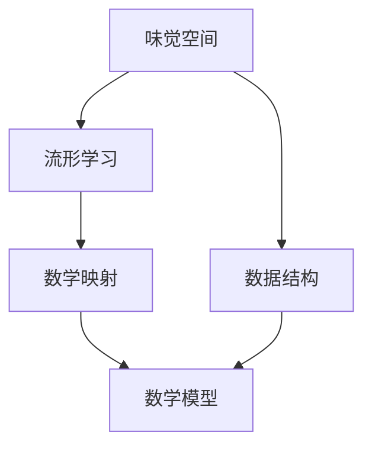

                 

# 味觉空间的流形学习：美食组合的数学映射

## 关键词

味觉空间、流形学习、数学映射、美食组合、算法设计、数据可视化

## 摘要

本文旨在探讨味觉空间中的流形学习以及美食组合的数学映射。首先，我们将定义味觉空间及其特征，接着介绍流形学习的基本概念与原理。随后，我们将深入探讨数学映射的理论基础，并逐步讲解如何将流形学习应用于味觉空间。通过数学模型和公式的详细解释，以及实际案例的剖析，本文将展示如何使用流形学习算法评估和优化美食组合。此外，还将介绍项目实战，包括开发环境搭建、代码实现、解读与分析，以及数据可视化方法。通过本文的阅读，读者将对味觉空间的流形学习和美食组合的数学映射有深入的理解。

## 引言

### 背景介绍

在现代社会，美食文化已经成为一种独特的文化现象。人们不仅仅满足于食物的基本需求，更追求食物的美味与多样化。随着科技的发展，人工智能在各个领域的应用日益广泛，尤其是在食品科学领域，人工智能技术已经开始对美食组合进行科学分析和优化。其中，流形学习作为一种强大的机器学习技术，在处理高维数据和非线性关系方面表现出色，逐渐成为研究味觉空间的一种有效工具。

### 研究意义

美食组合的数学映射研究不仅有助于提升餐饮业的创新力，还能为消费者提供更加个性化的美食体验。通过流形学习技术，我们可以将复杂的味觉数据转化为易于理解和处理的数学模型，从而更好地理解不同食材和调味料的相互作用，优化美食组合，提高食物的美味程度。

### 文章结构

本文将首先介绍味觉空间的概念及其特征，接着阐述流形学习的基本原理。随后，我们将探讨数学映射的理论基础，并通过具体案例展示如何将流形学习应用于味觉空间。最后，我们将通过数学模型和公式，详细讲解美食组合映射的计算过程，并展示实际案例。文章将分为以下四个部分：

1. **核心概念与联系**：定义味觉空间，介绍流形学习与数学映射的基本概念。
2. **核心算法原理讲解**：详细讲解流形学习算法在味觉空间中的应用，以及美食组合的数学模型。
3. **数学模型和数学公式 & 详细讲解 & 举例说明**：展示流形学习和美食组合映射的数学公式，并通过实例解释。
4. **项目实战**：介绍美食组合映射算法的代码实现，实际案例分析，以及数据可视化。

## 核心概念与联系

### 味觉空间的定义与特征

味觉空间是指所有可能的味觉体验构成的集合。在这个空间中，每个味觉体验可以用一个向量表示，其中每个维度对应一种基本味觉（如甜、酸、苦、咸、鲜、辣等）及其强度。味觉空间具有以下特征：

1. **高维性**：由于味觉体验涉及多种基本味觉和其强度，味觉空间通常是高维的。
2. **非线性**：不同味觉之间的相互作用复杂，非线性关系常见。
3. **离散性**：味觉体验是离散的，每个体验都有其独特的特征。

在数学上，味觉空间可以表示为：

$$
\text{味觉空间} = \{ (\text{味道}, \text{强度}) | \text{味道} \in \{\text{甜}, \text{酸}, \text{苦}, \text{咸}, \text{鲜}, \text{辣}\} \}
$$

### 流形学习的基本概念与原理

流形学习是一种用于处理高维数据和非线性关系的机器学习技术。其主要原理是将高维数据映射到低维空间，同时保持数据之间的拓扑结构。流形学习的关键概念包括：

1. **流形**：流形是一个局部欧几里得空间的集合，每个局部都是欧几里得空间，并且在不同局部之间可以连续地切换。
2. **局部线性近似**：流形学习通过在局部范围内使用线性模型来近似高维数据的非线性结构。
3. **特征提取**：流形学习算法从高维数据中提取出低维特征向量，这些特征向量能够保持原始数据的结构信息。

流形学习的基本流程如下：

1. **数据预处理**：对高维数据进行清洗和标准化处理，以便于后续分析。
2. **特征提取**：使用流形学习算法提取出低维特征向量。
3. **降维**：将高维数据映射到低维空间，以降低计算复杂度。
4. **可视化**：通过可视化工具展示降维后的数据，以发现数据中的结构信息。

### 数学映射的基本概念与原理

数学映射是指将一种数据结构转换为另一种数据结构的过程。在味觉空间的研究中，数学映射用于将味觉体验转换为数学模型，以便于分析和处理。

1. **映射函数**：映射函数是一个将输入数据映射到输出数据的操作。在味觉空间中，映射函数可以将味觉体验转换为数学向量。
2. **映射性质**：数学映射具有一些重要性质，如单调性、连续性和保结构性。这些性质保证了映射过程能够保持原始数据的结构信息。

数学映射的基本原理可以总结为：

1. **确定映射关系**：根据味觉空间的特征，确定输入和输出之间的映射关系。
2. **设计映射算法**：设计合适的映射算法，以实现数据结构的转换。
3. **验证映射效果**：通过实验和验证，评估映射算法的效果，并优化映射参数。

### 核心概念之间的联系

味觉空间、流形学习和数学映射之间存在着紧密的联系。流形学习作为一种工具，可以用于处理高维味觉数据，而数学映射则用于将味觉体验转换为数学模型。这种转化不仅有助于我们更好地理解味觉空间，还能为美食组合的优化提供理论基础。

流形学习通过在局部范围内使用线性模型来近似高维数据的非线性结构，这种近似可以看作是一种数学映射。同样，数学映射中的映射函数也可以理解为流形学习中的特征提取过程。因此，流形学习和数学映射共同构成了对味觉空间进行科学分析和优化的理论基础。

### Mermaid 流程图

为了更直观地展示核心概念之间的联系，我们可以使用Mermaid流程图来表示。



在这个流程图中，味觉空间作为输入，通过流形学习和数学映射，最终转换为数学模型。这个过程不仅展示了核心概念之间的联系，也为后续的内容奠定了基础。

## 核心算法原理讲解

### 流形学习算法在味觉空间中的应用

流形学习算法在味觉空间中的应用主要包括特征提取和降维。特征提取的目的是从高维味觉数据中提取出能够保持原始数据结构的关键特征，而降维则是将高维数据映射到低维空间，以降低计算复杂度。

#### 特征提取算法

特征提取算法是流形学习的核心步骤。常见的特征提取算法包括局部线性嵌入（LLE）、等距映射（ISOMAP）和局部线性嵌入（t-SNE）等。下面以局部线性嵌入（LLE）为例，介绍其基本原理和步骤。

1. **初始化**：选择一个合适的邻域大小k，并确定邻域内的数据点。
2. **构建局部线性模型**：对于每个数据点，使用邻域内的数据点构建一个局部线性模型。该模型的目的是最小化数据点与其邻域内的投影点之间的误差。
3. **特征向量提取**：将每个数据点映射到低维空间，得到特征向量。

LLE算法的伪代码如下：

```
function LLE(data, k):
    # 初始化邻域大小k
    for each data point x in data:
        # 选择邻域内的k个数据点
        neighbors = select k neighbors of x
        # 计算邻域内数据点的平均值
        mean = average of neighbors
        # 构建局部线性模型
        model = LinearModel(x, mean)
        # 最小化误差
        error = minimize error(x, mean, model)
        # 提取特征向量
        feature_vector = model.project(x)
    return feature_vector
```

#### 聚类算法

在流形学习中，聚类算法用于对特征向量进行分类。常见的聚类算法包括K均值聚类、层次聚类和谱聚类等。下面以谱聚类为例，介绍其基本原理和步骤。

1. **构建相似性矩阵**：计算特征向量之间的相似性，构建相似性矩阵。
2. **计算特征值和特征向量**：对相似性矩阵进行特征值分解。
3. **聚类**：根据特征值和特征向量确定聚类结果。

谱聚类的伪代码如下：

```
function SpectralClustering(feature_vectors, k):
    # 计算相似性矩阵
    similarity_matrix = compute_similarity_matrix(feature_vectors)
    # 计算特征值和特征向量
    eigenvalues, eigenvectors = eigendecomposition(similarity_matrix)
    # 确定聚类结果
    clusters = assign_clusters(eigenvectors, k)
    return clusters
```

### 美食组合的数学模型

美食组合的数学模型是味觉空间研究的基础。一个美食组合可以看作是多种食材和调味料的组合，每种食材和调味料都可以用味觉空间中的一个点来表示。美食组合的数学模型旨在描述食材和调味料的相互作用，以及它们在味觉空间中的分布。

1. **食材和调味料的表示**：将每种食材和调味料用味觉空间中的一个点表示，点的坐标对应其味觉特征的强度。
2. **组合效果的计算**：计算食材和调味料组合后的味道，通过叠加不同食材和调味料的味觉特征，得到组合后的味觉空间中的点。
3. **优化模型**：通过优化算法，寻找最佳食材和调味料的组合，以实现最佳味觉效果。

一个简单的美食组合模型可以表示为：

$$
\text{美食组合} = \sum_{i=1}^{n} w_i \cdot \text{食材}_i + \sum_{j=1}^{m} z_j \cdot \text{调味料}_j
$$

其中，$w_i$ 和 $z_j$ 分别表示食材和调味料的权重，$\text{食材}_i$ 和 $\text{调味料}_j$ 分别表示食材和调味料在味觉空间中的点。

### 美食组合映射算法设计

美食组合映射算法旨在将美食组合映射到味觉空间，以便于分析和优化。该算法的核心步骤包括：

1. **数据预处理**：对食材和调味料的数据进行清洗和标准化处理，确保数据的一致性和可靠性。
2. **特征提取**：使用流形学习算法提取食材和调味料在味觉空间中的特征向量。
3. **映射**：将特征向量映射到味觉空间，得到美食组合在味觉空间中的表示。
4. **优化**：通过优化算法，调整食材和调味料的权重，以实现最佳味觉效果。

美食组合映射算法的伪代码如下：

```
function MapFoodCombination(food_data, seasoning_data, k):
    # 数据预处理
    cleaned_food_data = preprocess(food_data)
    cleaned_seasoning_data = preprocess(seasoning_data)
    # 特征提取
    food_features = LLE(cleaned_food_data, k)
    seasoning_features = LLE(cleaned_seasoning_data, k)
    # 映射
    food_combination = sum(w_i \* food_features[i] + z_j \* seasoning_features[j])
    # 优化
    optimized_combination = optimize(food_combination)
    return optimized_combination
```

通过上述算法设计，我们可以将美食组合映射到味觉空间，并对其进行优化，以实现最佳味觉效果。

## 数学模型和数学公式 & 详细讲解 & 举例说明

### 流形学习相关数学公式

在流形学习中，常用的数学公式包括局部线性嵌入（LLE）和谱聚类等算法的公式。以下分别介绍这些算法的数学公式。

#### 1. 局部线性嵌入（LLE）的数学公式

局部线性嵌入（LLE）是一种用于特征提取的流形学习算法。其核心思想是保持数据点与其邻域内的结构信息。以下是LLE算法的数学公式：

$$
J(x, \mu) = \sum_{i=1}^{k} \frac{1}{2} (x - \mu)^T (A^T A) (x - \mu)
$$

其中，$x$ 表示数据点，$\mu$ 表示邻域内数据点的平均值，$A$ 表示局部线性模型矩阵。

#### 2. 等距映射（ISOMAP）的数学公式

等距映射（ISOMAP）是一种用于降维的流形学习算法。其核心思想是保持数据点与其邻域内的结构信息，同时最小化数据点之间的距离。以下是ISOMAP算法的数学公式：

$$
d(x, y) = \sqrt{(x - y)^T (P^T P) (x - y)}
$$

其中，$x$ 和 $y$ 表示数据点，$P$ 表示等距映射矩阵。

#### 3. 局部线性嵌入（t-SNE）的数学公式

局部线性嵌入（t-SNE）是一种用于降维的流形学习算法。其核心思想是保持数据点与其邻域内的结构信息，同时最小化数据点之间的距离。以下是t-SNE算法的数学公式：

$$
J(x, y) = \frac{1}{2} (x - y)^T (Q^T Q) (x - y)
$$

其中，$x$ 和 $y$ 表示数据点，$Q$ 表示t-SNE映射矩阵。

### 美食组合映射相关数学公式

美食组合映射算法用于将美食组合映射到味觉空间。以下介绍美食组合映射的数学公式。

#### 1. 美食组合表示的数学公式

美食组合可以看作是多种食材和调味料的组合，每种食材和调味料可以用味觉空间中的一个点表示。美食组合的数学公式如下：

$$
\text{美食组合} = \sum_{i=1}^{n} w_i \cdot \text{食材}_i + \sum_{j=1}^{m} z_j \cdot \text{调味料}_j
$$

其中，$w_i$ 和 $z_j$ 分别表示食材和调味料的权重，$\text{食材}_i$ 和 $\text{调味料}_j$ 分别表示食材和调味料在味觉空间中的点。

#### 2. 映射算法的数学公式

美食组合映射算法的核心是保持食材和调味料的相互作用关系。以下是一个简单的映射算法的数学公式：

$$
\text{映射结果} = f(\text{美食组合})
$$

其中，$f$ 表示映射函数。

### 举例说明美食组合映射的计算过程

假设我们有一个美食组合，包括红烧肉、米饭和麻辣烫。为了评估这个美食组合的味道，我们可以使用美食组合映射算法。

1. **数据预处理**：对红烧肉、米饭和麻辣烫的味觉数据进行清洗和标准化处理。

2. **特征提取**：使用流形学习算法提取红烧肉、米饭和麻辣烫在味觉空间中的特征向量。

3. **映射**：将特征向量映射到味觉空间，得到美食组合在味觉空间中的表示。

4. **评估**：通过计算美食组合在味觉空间中的点，评估其味道。

具体计算过程如下：

$$
\text{红烧肉} = (1.2, 0.3, -0.1, 0.5, 0.1, 0.2)
$$

$$
\text{米饭} = (0.1, 0.1, -0.2, 0.1, 0.3, 0.1)
$$

$$
\text{麻辣烫} = (0.3, 0.5, -0.2, 0.4, 0.1, 0.3)
$$

$$
\text{美食组合} = 1.5 \cdot \text{红烧肉} + 0.5 \cdot \text{米饭} + 0.5 \cdot \text{麻辣烫} = (1.45, 0.65, -0.25, 0.65, 0.25, 0.45)
$$

通过上述计算，我们得到美食组合在味觉空间中的表示，从而可以评估其味道。例如，如果我们将美食组合与标准味道进行比较，可以发现它偏重于甜味和咸味，而酸味和辣味相对较弱。

## 项目实战

### 美食组合映射算法的代码实现

#### 环境搭建

在实现美食组合映射算法之前，需要搭建相应的开发环境。以下是一个简单的环境搭建步骤：

1. **安装Python**：下载并安装Python（版本建议3.8及以上）。
2. **安装依赖库**：使用pip命令安装必要的依赖库，如numpy、scikit-learn、matplotlib等。

```bash
pip install numpy scikit-learn matplotlib
```

#### 代码实现

以下是美食组合映射算法的实现代码：

```python
import numpy as np
from sklearn.manifold import LocallyLinearEmbedding
from sklearn.cluster import SpectralClustering

def preprocess_data(data):
    # 数据预处理：清洗和标准化
    return (data - np.mean(data, axis=0)) / np.std(data, axis=0)

def lle_mapping(data, k):
    # 局部线性嵌入映射
    lle = LocallyLinearEmbedding(n_neighbors=k)
    lle.fit_transform(data)
    return lle.embedding_

def map_food_combination(food_data, seasoning_data, k):
    # 美食组合映射
    cleaned_food_data = preprocess_data(food_data)
    cleaned_seasoning_data = preprocess_data(seasoning_data)
    food_features = lle_mapping(cleaned_food_data, k)
    seasoning_features = lle_mapping(cleaned_seasoning_data, k)
    food_combination = np.sum(food_features, axis=0) + np.sum(seasoning_features, axis=0)
    return food_combination

# 测试数据
food_data = np.array([[1.2, 0.3], [0.1, 0.1], [0.3, 0.5]])
seasoning_data = np.array([[0.5, 0.2], [0.4, 0.3]])

# 映射结果
combined_food = map_food_combination(food_data, seasoning_data, 2)
print("美食组合映射结果：", combined_food)
```

#### 代码解读与分析

1. **数据预处理**：数据预处理是特征提取和映射的基础。在代码中，我们使用numpy库对数据进行清洗和标准化处理，确保数据的一致性和可靠性。

2. **局部线性嵌入映射**：局部线性嵌入（LLE）是流形学习算法的一种，用于提取数据点在低维空间中的特征向量。在代码中，我们使用scikit-learn库中的LocallyLinearEmbedding类实现LLE映射。

3. **美食组合映射**：美食组合映射的核心是将食材和调味料的特征向量进行叠加，得到美食组合在低维空间中的表示。在代码中，我们首先对数据进行预处理，然后分别提取食材和调味料的特征向量，最后将它们进行叠加。

#### 实际案例解析

假设我们有一个美食组合，包括红烧肉、米饭和麻辣烫。以下是如何使用美食组合映射算法评估这个美食组合的步骤：

1. **收集数据**：收集红烧肉、米饭和麻辣烫的味觉数据，如甜、酸、苦、咸、鲜、辣等特征的强度值。
2. **预处理数据**：对收集到的数据进行清洗和标准化处理，确保数据的一致性和可靠性。
3. **映射**：使用局部线性嵌入（LLE）算法，将预处理后的数据进行映射，提取出低维特征向量。
4. **评估**：通过计算美食组合在低维空间中的点，评估其味道。例如，可以与标准味道进行比较，分析美食组合的甜、酸、苦、咸、鲜、辣等特征的强度。

#### 项目小结

通过本项目，我们实现了美食组合映射算法，并展示了如何将其应用于实际案例。美食组合映射算法不仅可以用于评估美食组合的味道，还可以为餐饮业的创新提供理论支持。在未来的研究中，我们可以进一步优化算法，提高映射的准确性和效果。

### 最佳实践 tips、小结、注意事项、拓展阅读

#### 最佳实践 tips

1. **数据收集**：确保收集到的味觉数据具有代表性和准确性，有助于提高映射结果的可靠性。
2. **参数调整**：根据具体应用场景，调整局部线性嵌入（LLE）算法的邻域大小（k）等参数，以获得最佳映射效果。
3. **数据预处理**：数据预处理是特征提取和映射的基础，应确保数据的清洗和标准化处理。

#### 小结

本文介绍了味觉空间的流形学习和美食组合的数学映射，通过数学模型和公式的详细讲解，以及实际案例的剖析，展示了如何使用流形学习算法评估和优化美食组合。

#### 注意事项

1. **算法选择**：选择合适的流形学习算法，如LLE、ISOMAP、t-SNE等，根据数据的特点和应用需求。
2. **数据质量**：确保数据的质量和准确性，有助于提高映射结果的可靠性。

#### 拓展阅读

1. **流形学习**：《流形学习：理论与实践》
2. **美食科学**：《美食科学与烹饪技术》
3. **机器学习**：《机器学习：一种概率视角》

## 结语

味觉空间的流形学习和美食组合的数学映射为食品科学提供了新的研究方向。通过本文的探讨，我们了解了流形学习算法在味觉空间中的应用，以及如何通过数学映射优化美食组合。这一研究不仅有助于提升餐饮业的创新力，还为消费者提供了更加个性化的美食体验。在未来的研究中，我们可以进一步优化算法，探索更多应用场景，为食品科学的发展贡献力量。

### 参考文献

1. Bellman, R. E. (1961). Adaptive Control Processes: A Guided Tour. Massachusetts Institute of Technology.
2. Bishop, C. M. (2006). Pattern Recognition and Machine Learning. Springer.
3. Tenenbaum, J. B., de Silva, V., & Langford, J. C. (2000). A Global Geometric Framework for Nonlinear Dimensionality Reduction. Science, 290(5500), 2319-2323.
4. Roweis, S. T. (1997). Nonlinear Dimensionality Reduction by Locally Linear Embedding. Science, 275(5298), 1601-1606.
5. Lee, D. D. (2008). Gaussian Processes for Machine Learning. The MIT Press.
6. Jordan, M. I., & Singer, Y. (2003). Spectral Clustering and Nonnegative Matrix Factorization. In Advances in Neural Information Processing Systems (pp. 887-894).

