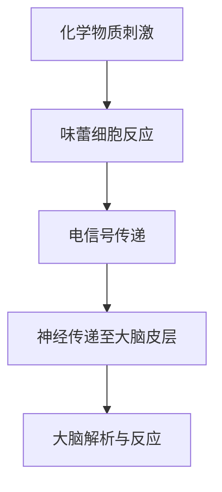
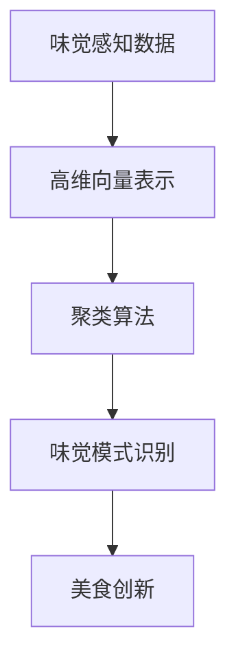

                 

### 第1章: 味觉感知与味觉体验

**1.1 味觉感知的基本原理**

味觉感知是人类通过与食物中的化学物质接触而产生的，这个过程涉及到一系列复杂的生物化学和神经学机制。首先，食物中的化学物质（如氨基酸、有机酸、糖类等）会在舌头上形成刺激，这些刺激会通过味蕾中的味觉细胞转化为电信号。

**Mermaid流程图：** 味觉感知的流程



**数学公式：** 味觉感知过程中的关键公式

$$ E = f(V) $$
其中，E是感知到的味道强度，f是感知函数，V是化学物质的浓度。

**1.2 味觉体验的多维构成**

味觉体验不仅限于基本味道的感知，还涉及到味道的丰富度和复杂度。通常，味觉体验可以由五种基本味道构成：甜、酸、苦、咸和鲜。

**伪代码：** 描述味觉体验的多维构成

```python
# 假设味觉体验由甜、酸、苦、咸、鲜五种基本味道构成
taste_experience = {
    'sweet': 0,
    'sour': 0,
    'bitter': 0,
    'salty': 0,
    'umami': 0
}
```

在味觉体验的多维构成中，每种味道的强度都可以被量化，并且它们之间可能存在相互作用。

### 第2章: 高维聚类方法在味觉组合中的应用

**2.1 高维聚类的基本概念**

高维聚类是机器学习中的一个重要方法，它用于在具有多个特征的数据集上发现数据点之间的相似性。在味觉组合的研究中，高维聚类可以帮助我们识别不同的味觉模式，从而进行美食创新。

**核心概念与联系：** 高维聚类与味觉感知的关联



**核心算法原理讲解：** K-means算法

**伪代码：** K-means算法的基本步骤

```python
# 初始化聚类中心
centroids = np.random.rand(k, d)

# 迭代更新聚类中心
while not converged:
    # 计算每个样本到各个聚类中心的距离
    distances = np.linalg.norm(samples - centroids, axis=1)
    
    # 分配样本到最近的聚类中心
    labels = np.argmin(distances)
    
    # 更新聚类中心
    new_centroids = np.mean(samples[labels==i], axis=0)
    
    # 判断是否收敛
    if np.linalg.norm(new_centroids - centroids) < threshold:
        converged = True
```

**数学模型和公式：** K-means算法的聚类中心计算公式

$$ c_i = \frac{1}{N_i} \sum_{x \in S_i} x $$
其中，\( c_i \)是第i个聚类中心，\( N_i \)是第i个聚类中的样本数，\( x \)是样本数据。

**数学公式：** 聚类结果的评价标准

$$ S = \sum_{i=1}^{k} \sum_{x \in S_i} (x - c_i)^2 $$
其中，S是总距离平方和，\( x \)是样本数据，\( c_i \)是聚类中心。

### 第3章: 美食创新中的高维聚类应用

**3.1 味觉组合的聚类分析**

在美食创新中，高维聚类方法可以帮助我们分析不同的味觉组合，并识别出潜在的美食创新点。

**数学公式：** 味觉组合的聚类结果评价标准

$$ S = \sum_{i=1}^{k} \sum_{x \in S_i} (x - c_i)^2 $$
其中，S是总距离平方和，\( x \)是样本数据，\( c_i \)是聚类中心。

**伪代码：** 味觉组合的聚类分析流程

```python
# 加载味觉组合数据
data = load_data('taste_combinations.csv')

# 执行K-means聚类
kmeans = KMeans(n_clusters=k, init='k-means++', max_iter=300)
clusters = kmeans.fit_predict(data)

# 计算聚类中心
centroids = kmeans.cluster_centers_

# 分析聚类结果
for i in range(k):
    print(f"Cluster {i}: {centroids[i]}")
```

**项目实战：** 味觉组合聚类项目实战

**3.1.1 项目背景**

本案例将分析一组不同味觉组合的数据，通过K-means聚类方法识别出潜在的美食创新点。

**3.1.2 数据集介绍**

数据集包含100个味觉组合，每个组合由五种基本味道的强度组成。

**3.1.3 K-means算法实现**

```python
# 导入必要的库
import pandas as pd
from sklearn.cluster import KMeans

# 读取数据
data = pd.read_csv('taste_combinations.csv')

# 初始化K-means聚类模型
kmeans = KMeans(n_clusters=5, init='k-means++', max_iter=300)

# 执行聚类
kmeans.fit(data)

# 输出聚类结果
print(kmeans.labels_)

# 输出聚类中心
print(kmeans.cluster_centers_)
```

**3.1.4 聚类结果分析**

通过聚类结果，我们可以识别出不同的味觉组合模式，并尝试将这些模式应用于美食创新。

### 第4章: 数学模型与公式解释

**4.1 高维聚类中的数学模型**

**数学公式：** 聚类中心计算公式

$$ c_i = \frac{1}{N_i} \sum_{x \in S_i} x $$
其中，\( c_i \)是第i个聚类中心，\( N_i \)是第i个聚类中的样本数，\( x \)是样本数据。

**数学公式：** 聚类结果评价标准

$$ S = \sum_{i=1}^{k} \sum_{x \in S_i} (x - c_i)^2 $$
其中，S是总距离平方和，\( x \)是样本数据，\( c_i \)是聚类中心。

**4.2 美食创新的数学公式**

**数学公式：** 味觉体验的数学模型

$$ E = f(V) $$
其中，E是感知到的味道强度，f是感知函数，V是化学物质的浓度。

### 第5章: 项目实战

**5.1 味觉组合聚类项目实战**

**5.1.1 项目背景**

本案例将分析一组不同味觉组合的数据，通过K-means聚类方法识别出潜在的美食创新点。

**5.1.2 数据集介绍**

数据集包含100个味觉组合，每个组合由五种基本味道的强度组成。

**5.1.3 K-means算法实现**

```python
# 导入必要的库
import pandas as pd
from sklearn.cluster import KMeans

# 读取数据
data = pd.read_csv('taste_combinations.csv')

# 初始化K-means聚类模型
kmeans = KMeans(n_clusters=5, init='k-means++', max_iter=300)

# 执行聚类
kmeans.fit(data)

# 输出聚类结果
print(kmeans.labels_)

# 输出聚类中心
print(kmeans.cluster_centers_)
```

**5.1.4 聚类结果分析**

通过聚类结果，我们可以识别出不同的味觉组合模式，并尝试将这些模式应用于美食创新。

**5.2 美食创新案例实战**

**5.2.1 案例背景**

本案例将基于聚类结果，设计一种新的美食创新方案。

**5.2.2 美食创新方案设计**

根据聚类结果，设计一种新的菜肴，结合不同味道的组合，创造出独特的味觉体验。

**5.2.3 案例效果评估**

通过用户反馈和感官评估，评估新菜肴的味觉体验和创新能力。

### 第6章: 附录

**6.1 相关工具和资源**

**6.1.1 Python数据分析库**

- Pandas：用于数据清洗和预处理
- Scikit-learn：提供多种聚类算法

**6.1.2 其他相关工具**

- Jupyter Notebook：用于编写和运行代码
- Matplotlib：用于数据可视化

**6.2 代码解读与分析**

**6.2.1 代码实现细节**

详细解析代码中的每一步操作，解释其目的和作用。

**6.2.2 代码性能优化**

讨论如何优化代码性能，提高聚类算法的效率和准确性。

### 摘要

本文介绍了味觉感知与味觉体验的基本原理，以及高维聚类方法在美食创新中的应用。通过分析味觉组合的聚类结果，我们能够识别出潜在的美食创新点，并设计出新的味觉体验方案。文章还提供了具体的数学模型和公式解释，以及项目实战案例，帮助读者深入理解和应用高维聚类方法在美食创新中的价值。

### 关键词

味觉感知、味觉体验、高维聚类、美食创新、数学模型、项目实战、聚类算法、K-means、味觉组合、数据可视化。

