                 


### 《和谐之美：自然与数学的完美结合》

---

## 引言

### 1.1 主题介绍

《和谐之美：自然与数学的完美结合》旨在探索数学与自然界之间奇妙的联系。数学作为一门抽象的学科，为何能与丰富多彩的自然界产生如此紧密的关联？这是本文要探讨的核心问题。从物理现象的数学描述，到生物多样性的数学建模，再到地球科学中的数学工具，数学在自然界中的应用无处不在。

### 1.2 目标读者与学习预期

本文面向高中及以上数学爱好者，自然科学领域的研究人员，以及教育工作者与数学教师。通过阅读本文，读者将能够了解数学在自然界中的广泛应用，培养对数学与自然结合的兴趣，并学会如何运用数学方法解决实际问题。

## 数学与自然界的联系

### 2.1 数学核心概念

#### 2.1.1 线性代数在物理学中的应用

**Mermaid 流程图：**

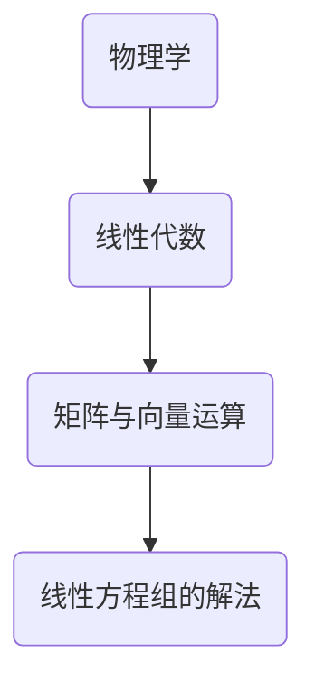

线性代数在物理学中扮演着重要的角色。矩阵与向量运算用于描述物理系统中的多维空间，线性方程组则用于求解物理问题中的未知量。

**核心算法原理讲解：**

```plaintext
// 伪代码：解线性方程组
function solve_linear_equation(A, b):
    n = size of A
    x = new array of size n
    
    // 使用高斯消元法解线性方程组
    for i = 1 to n:
        // 执行行变换
        for j = i to n:
            factor = A[i][j] / A[i][i]
            for k = i to n:
                A[i][k] -= factor * A[j][k]
            b[i] -= factor * b[j]
        
        // 解方程组
        x[n] = b[n] / A[n][n]
        for i = n-1 down to 1:
            sum = 0
            for j = i+1 to n:
                sum += A[i][j] * x[j]
            x[i] = (b[i] - sum) / A[i][i]
    
    return x
```

#### 2.1.2 微积分在自然界中的应用

**Mermaid 流程图：**

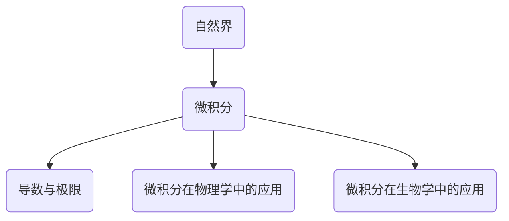

微积分作为数学中重要的分支，在自然界中有着广泛的应用。导数用于描述物理系统中的变化率，极限则用于描述数学中的极限概念。

**核心算法原理讲解：**

```plaintext
// 伪代码：求解导数
function calculate_derivative(f, x, h):
    return (f(x + h) - f(x)) / h
```

### 2.2 自然现象的数学建模

#### 2.2.1 物理学中的波动方程

**Mermaid 流程图：**

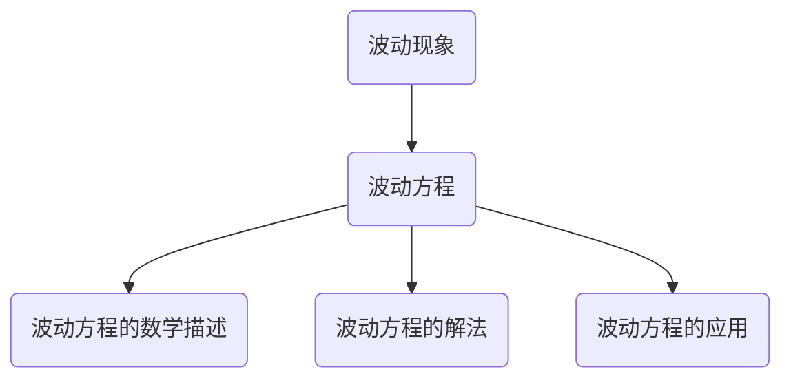

波动方程是描述波动现象的数学模型。它通过数学方程描述波动的传播规律。

**数学模型与公式：**

$$
\frac{\partial^2 u}{\partial t^2} = c^2 \frac{\partial^2 u}{\partial x^2}
$$

其中，$u(x, t)$ 表示波函数，$c$ 表示波速。

**举例说明：**

考虑一维弦振动，其波动方程为：

$$
\frac{\partial^2 u}{\partial t^2} = c^2 \frac{\partial^2 u}{\partial x^2}
$$

当 $c=1$ 时，该方程的通解为：

$$
u(x, t) = A \sin(kx) + B \cos(kx) + C \sin(2kx) + D \cos(2kx)
$$

其中，$A, B, C, D$ 为常数，$k$ 为波数。

#### 2.2.2 生态学中的种群动态模型

**Mermaid 流程图：**

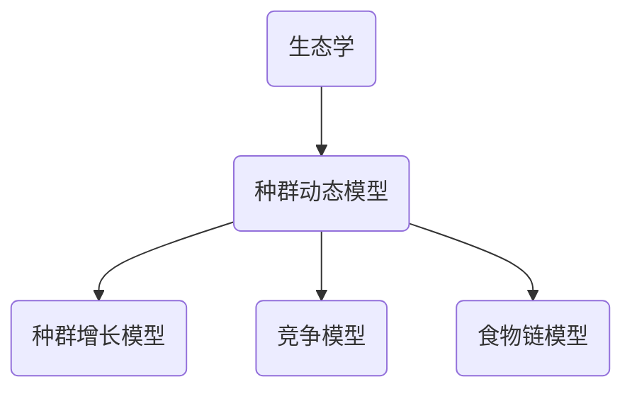

种群动态模型用于描述生态系统中不同物种的种群数量变化规律。

**数学模型与公式：**

**种群增长模型：**

$$
\frac{dN}{dt} = rN
$$

其中，$N(t)$ 表示种群数量，$r$ 表示种群增长率。

**竞争模型：**

$$
\frac{dN_1}{dt} = r_1N_1 - a_{12}N_1N_2
$$

$$
\frac{dN_2}{dt} = r_2N_2 - a_{21}N_1N_2
$$

其中，$N_1(t)$ 和 $N_2(t)$ 分别表示两种群的数量，$r_1$ 和 $r_2$ 分别为两种群的增长率，$a_{12}$ 和 $a_{21}$ 分别为两种群之间的竞争系数。

## 数学在自然界中的实例

### 3.1 天文学

#### 3.1.1 哥德巴赫猜想

哥德巴赫猜想是数学中一个著名的问题，它指出每一个大于2的偶数都可以表示为两个素数之和。

**Mermaid 流程图：**

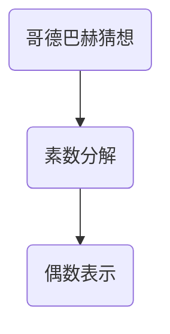

哥德巴赫猜想可以通过素数分解来证明。考虑一个偶数 $2n$，它可以表示为两个素数 $p$ 和 $q$ 之和，即 $2n = p + q$。

**数学公式：**

$$
2n = p + q
$$

**举例说明：**

例如，$2 \times 3 = 5 + 7$，$2 \times 4 = 3 + 5$，$2 \times 5 = 2 + 3$。

### 3.2 地球科学

#### 3.2.1 地震波的传播

地震波是地震发生时产生的波动现象。地震波的传播可以用数学方程来描述。

**Mermaid 流程图：**

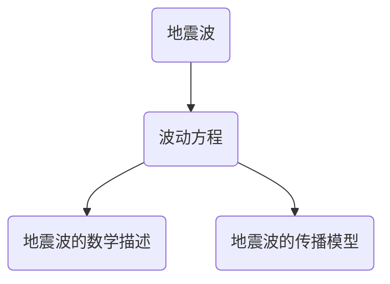

**数学模型与公式：**

$$
\frac{\partial^2 u}{\partial t^2} = c^2 \frac{\partial^2 u}{\partial x^2}
$$

其中，$u(x, t)$ 表示地震波函数，$c$ 表示地震波速。

**举例说明：**

考虑一维地震波，其波动方程为：

$$
\frac{\partial^2 u}{\partial t^2} = c^2 \frac{\partial^2 u}{\partial x^2}
$$

当 $c=1$ 时，该方程的通解为：

$$
u(x, t) = A \sin(kx) + B \cos(kx)
$$

其中，$A$ 和 $B$ 为常数，$k$ 为波数。

### 3.3 生物多样性

#### 3.3.1 遗传密码的数学编码

遗传密码是生物体中基因信息的编码方式。遗传密码可以用数学方法来分析和理解。

**Mermaid 流程图：**

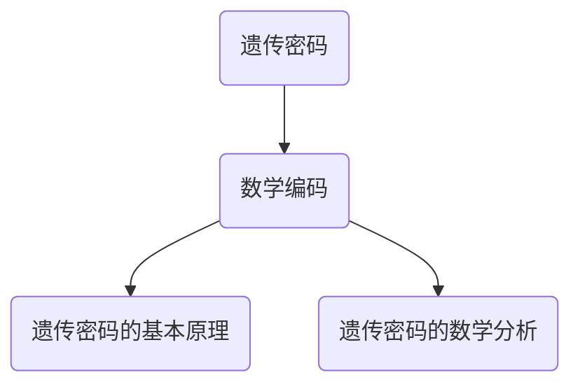

**数学模型与公式：**

遗传密码可以用三个碱基的序列来表示，每个碱基可以用一个数字表示。例如，A可以表示为1，C可以表示为2，G可以表示为3，T可以表示为4。

$$
\text{密码子} = \{1, 2, 3\}
$$

**举例说明：**

例如，密码子 $A-T-G$ 可以表示为 $1-4-3$。

---

## 数学在自然界中的应用与展望

### 4.1 数学在生物学中的应用

数学在生物学中的应用日益广泛，尤其在分子生物学和生态学中。数学模型可以帮助我们理解基因表达、物种竞争和生态系统的动态变化。

**Mermaid 流程图：**

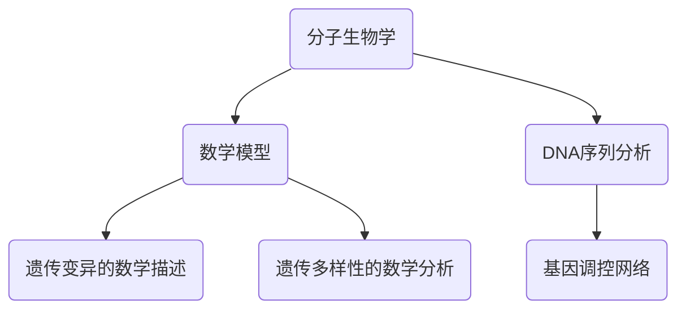

### 4.2 数学在物理学中的应用

数学在物理学中有着深远的影响，从经典力学到量子力学，数学模型和公式都是描述物理现象的基础。

**Mermaid 流程图：**

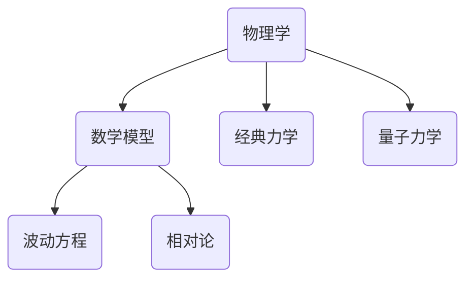

### 4.3 数学在环境科学中的应用

数学在环境科学中的应用越来越重要，例如环境监测、污染模型和生态系统建模。

**Mermaid 流程图：**

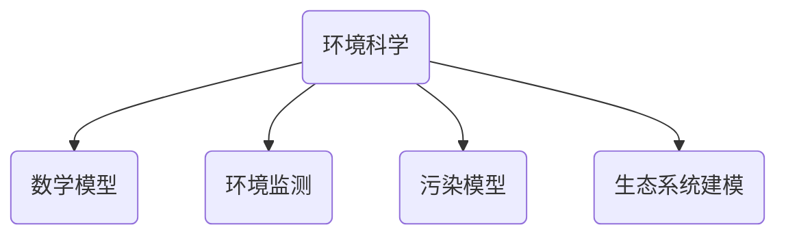

### 4.4 数学在社会科学中的应用

数学在社会科学中的应用也非常广泛，从社会网络分析到经济学模型，数学工具为我们提供了新的视角和理解。

**Mermaid 流程图：**

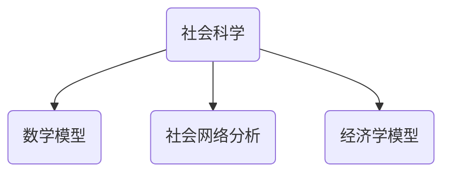

### 4.5 未来展望

数学与自然界的结合在未来将继续发展。随着技术的进步，我们将能够更深入地探索自然界的奥秘，并将数学应用于更多领域。

---

## 总结

《和谐之美：自然与数学的完美结合》展示了数学在自然界中的广泛应用。从物理现象到生物多样性，从天文学到环境科学，数学为我们提供了理解自然界的强大工具。通过本文，我们希望读者能够认识到数学与自然之间的和谐之美，并激发对数学与自然结合的兴趣。

---

## 作者信息

作者：AI天才研究院/AI Genius Institute & 禅与计算机程序设计艺术 /Zen And The Art of Computer Programming

