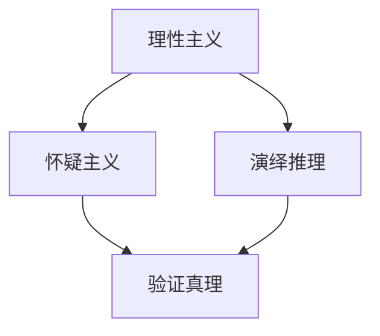
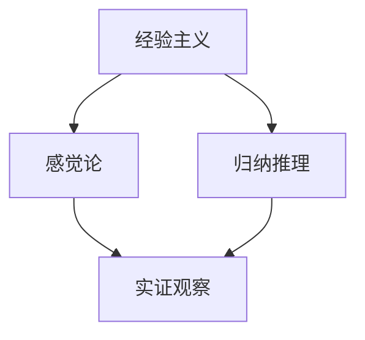
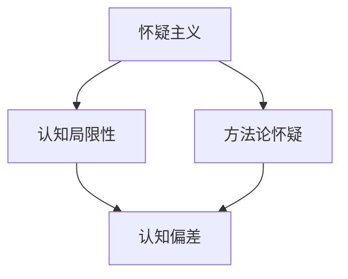
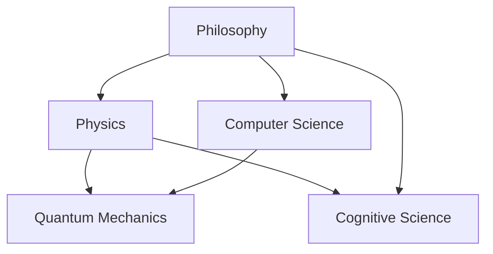

                 

### 文章标题

**哲学家眼中的世界可理解性**

> 关键词：哲学、世界理解、可理解性、认知、方法论、历史视角、未来展望

摘要：本文旨在探讨哲学家们如何从不同角度审视世界的可理解性，分析其背后的核心概念与理论，并探讨这一哲学问题在当代的意义和未来可能的发展方向。通过对历史和当代哲学家的观点进行梳理和解读，本文试图揭示人类对世界理解能力的本质及其局限性，为进一步探讨人类认知和技术的边界提供启示。

### 引言

在人类的历史长河中，哲学家们一直在探讨世界的本质和人类对它的理解。这个问题不仅关乎哲学，也涉及到科学、宗教、艺术等多个领域。本文将重点关注哲学家们对“世界可理解性”这一主题的思考，探讨其背后的核心概念、历史发展以及当代的重要性。

#### 哲学探讨的背景

自古以来，哲学家们就试图回答一个根本性的问题：我们能否真正理解这个世界？这个问题不仅涉及到我们对自然界和社会现象的认识，还关乎我们对人类自身存在的理解。不同的哲学家提出了不同的观点，形成了丰富的哲学思想。

#### 世界可理解性的定义

“世界可理解性”通常指的是人类是否能够通过理性思考和感官经验来理解世界的本质和规律。这个问题涵盖了以下几个方面：

1. **逻辑可理解性**：指人类是否能够通过逻辑推理来理解世界。
2. **经验可理解性**：指人类是否能够通过感官经验和实证方法来理解世界。
3. **形而上学可理解性**：指人类是否能够通过哲学思考来理解世界的本质和终极真理。

#### 文章的结构

本文将分为以下几个部分：

1. **核心概念与理论**：介绍与“世界可理解性”相关的核心哲学概念和理论，包括理性主义、经验主义、怀疑主义等。
2. **历史视角**：回顾不同历史时期哲学家对世界可理解性的观点，包括古希腊哲学家、中世纪哲学家、现代哲学家等。
3. **方法论**：探讨哲学家们使用的不同方法论，如逻辑分析、经验观察、形而上学推理等。
4. **当代辩论**：分析当代哲学家对世界可理解性的讨论，包括科学哲学、认知科学等领域的最新研究。
5. **未来展望**：探讨未来可能的发展方向，包括人工智能、认知科学等领域对世界可理解性的新见解。

#### 目标与读者

本文的目标是提供一个全面而深入的关于世界可理解性的哲学探讨，旨在帮助读者更好地理解这一复杂而重要的哲学问题。本文适合对哲学、科学、认知科学等领域感兴趣的读者，特别是那些希望深入探讨人类认知能力及其局限性的读者。

### 核心概念与理论

在探讨“世界可理解性”这一哲学问题时，我们需要了解几个核心概念和理论，这些概念和理论构成了哲学家们思考和讨论这一问题的基石。

#### 理性主义

理性主义是一种哲学立场，认为人类主要通过理性思考和推理来获得知识。理性主义者认为，通过逻辑和推理，人类可以理解世界的本质和规律。代表性哲学家如笛卡尔（René Descartes）和莱布尼茨（Gottfried Wilhelm Leibniz）都强调理性在认知过程中的重要性。

**核心概念与联系**

理性主义的核心理念包括：

1. **怀疑主义**：怀疑主义是理性主义的一个分支，主张我们对知识和真理持有怀疑态度，通过严密的逻辑推理来验证和证明。
2. **演绎推理**：理性主义者强调通过演绎推理从一般原理推导出特定结论，认为这是获取可靠知识的途径。

**Mermaid 流程图**



#### 经验主义

经验主义是与理性主义相对的哲学立场，认为人类主要通过感官经验和实证观察来获得知识。经验主义者认为，所有知识都来源于经验，理性只是对经验进行组织和解释的工具。代表性哲学家如约翰·洛克（John Locke）和乔治·伯克利（George Berkeley）都强调经验在认知过程中的重要性。

**核心概念与联系**

经验主义的核心理念包括：

1. **感觉论**：感觉论主张，所有知识都来源于感觉，外部世界的存在是通过感觉来证明的。
2. **归纳推理**：经验主义者强调通过归纳推理从特定经验推导出一般结论，认为这是获取可靠知识的途径。

**Mermaid 流流程图**



#### 怀疑主义

怀疑主义是一种哲学立场，主张我们对知识和真理持有怀疑态度。怀疑主义者认为，由于人类认知的局限性，我们无法确信任何事物的真实性和可靠性。代表性哲学家如皮浪（Pyrrho）和蒙田（Michel de Montaigne）都强调怀疑在认知过程中的重要性。

**核心概念与联系**

怀疑主义的核心理念包括：

1. **认知局限性**：怀疑主义者认为，由于人类的认知局限性，我们无法获得绝对确定的知识。
2. **方法论怀疑**：怀疑主义者对各种方法论持有怀疑态度，认为它们都可能受到认知偏差的影响。

**Mermaid 流流程图**



通过以上对理性主义、经验主义和怀疑主义的介绍，我们可以看出，这些哲学立场在探讨世界可理解性问题时各有侧重。理性主义强调通过理性思考和推理来理解世界，经验主义强调通过感官经验和实证观察来理解世界，而怀疑主义则提醒我们保持怀疑态度，警惕认知偏差。

这些概念之间的联系和区别为我们提供了一个多维度的视角，帮助我们更全面地理解世界可理解性的复杂性和多样性。在接下来的章节中，我们将进一步探讨这些概念在不同历史时期哲学家中的应用和影响。

### 历史视角

在哲学史上，不同历史时期的哲学家们对“世界可理解性”这一主题有着各自的见解和贡献。通过回顾这些历史观点，我们可以更好地理解哲学家们如何从不同角度思考这一问题，以及这些观点对我们当代的理解有何启示。

#### 古希腊哲学

古希腊哲学是西方哲学的起源，许多早期哲学家都探讨了世界的本质和人类对它的理解。以下是几位重要哲学家的观点：

**泰勒斯（Thales）**

泰勒斯是古希腊哲学的奠基人之一，他认为万物由水构成，主张通过观察自然界来理解世界。泰勒斯的观点体现了一种早期的自然主义和经验主义，强调感官经验和实证观察的重要性。

**柏拉图（Plato）**

柏拉图认为，世界的本质是理念，现实世界只是理念的不完美映射。他提出了“理念世界”和“现象世界”的区分，认为通过理性思考和哲学推理，我们可以理解理念世界的本质，从而理解现实世界。柏拉图的观点体现了理性主义和形而上学思想，强调通过抽象思维和哲学推理来理解世界。

**亚里士多德（Aristotle）**

亚里士多德是古希腊哲学的另一重要代表，他的思想在多个领域都有深远影响。亚里士多德认为，通过经验和实证观察，我们可以理解自然界的规律。他提出了“因果律”和“形式与质料”的概念，主张通过逻辑推理和实证方法来理解世界。亚里士多德的观点体现了经验主义和逻辑分析的结合。

#### 中世纪哲学

中世纪哲学主要受到基督教神学的影响，哲学家们试图将哲学与宗教信仰相结合，探讨世界的本质和人类对它的理解。

**奥古斯丁（Saint Augustine）**

奥古斯丁是中世纪哲学的重要代表，他的著作《忏悔录》探讨了个人灵魂与宇宙的关系。奥古斯丁认为，上帝是万物的创造者和维持者，通过信仰和神学思考，我们可以理解世界的本质。他的观点体现了宗教哲学和形而上学思想的结合。

**托马斯·阿奎那（Saint Thomas Aquinas）**

托马斯·阿奎那是一位重要的神学家和哲学家，他的著作《神学大全》试图将哲学和神学相结合，探讨世界的本质和人类对它的理解。阿奎那认为，上帝的存在可以通过理性思考和经验观察来证明，他的观点体现了理性主义和宗教哲学的融合。

#### 现代哲学

现代哲学在17世纪和18世纪兴起，哲学家们开始对人类认知和科学方法进行深入探讨，形成了丰富的哲学思想。

**笛卡尔（René Descartes）**

笛卡尔是现代哲学的奠基人之一，他的著作《第一哲学沉思》提出了著名的“我思故我在”（Cogito, ergo sum）原则，强调通过怀疑和理性思考来建立知识的确定性。笛卡尔的观点体现了理性主义和怀疑主义思想，对后世哲学产生了深远影响。

**康德（Immanuel Kant）**

康德是18世纪的重要哲学家，他的著作《纯粹理性批判》探讨了人类认知的本质和界限。康德认为，人类的认知能力受到先验结构和范畴的限制，我们的知识是建立在感性经验和理性推理的基础上的。他的观点体现了批判哲学和先验哲学思想。

#### 当代哲学

当代哲学继续探讨世界的本质和人类对它的理解，涉及多个领域，如科学哲学、认知科学等。

**科学哲学**

科学哲学家如卡尔·波普尔（Karl Popper）和托马斯·库恩（Thomas Kuhn）对科学方法论和科学知识进行了深入探讨。波普尔提出了“可证伪性”原则，认为科学知识是通过反复验证和证伪来建立的。库恩则提出了“范式转变”理论，认为科学知识的发展是通过对现有范式的挑战和替代来实现的。

**认知科学**

认知科学家如约翰·希尔勒（John Searle）和丹尼尔·丹尼特（Daniel Dennett）对人类认知进行了研究，探讨了意识、思维和语言的本质。希尔勒提出了“中文房间论证”，质疑了人工智能的自主意识。丹尼特则提出了“意识是错综复杂的错觉”观点，认为我们的认知活动是一种错觉。

通过回顾不同历史时期的哲学家对世界可理解性的观点，我们可以看到，哲学家们从不同角度思考这一问题，形成了丰富的哲学思想。这些观点不仅帮助我们理解世界的本质，也为我们当代的哲学思考提供了重要的启示。

在接下来的章节中，我们将进一步探讨哲学家们使用的不同方法论，分析这些方法论在理解和解释世界中的作用和局限性。

### 方法论

哲学家们为了探讨世界的可理解性，采用了多种方法论，这些方法既有助于深化我们对世界的理解，也揭示了认知的局限。以下是几种主要的哲学方法论：

#### 逻辑分析

逻辑分析是通过逻辑推理来揭示概念和命题之间的关系。这种方法强调清晰、严谨的思维，以确保推理的可靠性。以下是逻辑分析的一些核心步骤：

**步骤1：定义概念**

首先，哲学家们需要对讨论的概念进行明确定义，以便在逻辑推理中保持一致。

**步骤2：建立前提**

接着，哲学家们会列出支持结论的前提，这些前提必须是真实且逻辑上自洽的。

**步骤3：进行推理**

通过逻辑推理，从前提推导出结论。这一步骤需要遵循逻辑规则，如因果律、同一律、排中律等。

**伪代码示例：**

```python
define ConceptA as "the fundamental nature of reality"
define ConceptB as "human understanding"

assert Premise1: "All humans are rational beings"
assert Premise2: "Rational beings strive to understand reality"

derive Conclusion: "Humans strive to understand the fundamental nature of reality"
```

#### 经验观察

经验观察是通过感官经验和实证研究来收集数据，以支持或反驳哲学观点。以下是经验观察的核心步骤：

**步骤1：设定研究目标**

明确研究的目标和问题，以确保观察的针对性和有效性。

**步骤2：设计实验**

设计实验或观察计划，以收集相关数据。实验设计需要考虑变量控制、实验组和对照组等。

**步骤3：收集数据**

进行实验或观察，收集数据。数据收集应遵循科学原则，以确保数据的准确性和可靠性。

**步骤4：数据分析**

对收集的数据进行分析，以验证或反驳假设。数据分析可以使用统计方法、比较分析等。

**伪代码示例：**

```python
import DataCollectionModule

define ResearchQuestion: "Do humans have an inherent drive to understand reality?"

design Experiment: "Observing behavior patterns in humans when faced with unknown phenomena"
collect Data: "Record responses to 100 randomly selected individuals when presented with novel situations"
analyze Data: "Perform statistical analysis to identify patterns and correlations"
report Results: "Report findings and conclusions"
```

#### 形而上学推理

形而上学推理是通过抽象思考和哲学推理来探讨世界的本质和终极真理。这种方法强调超越感官经验的抽象思维，以寻求更深层次的真理。以下是形而上学推理的核心步骤：

**步骤1：提出问题**

明确需要探讨的哲学问题，如“世界的本质是什么？”、“意识是如何产生的？”等。

**步骤2：构建理论**

基于哲学原则和逻辑推理，构建一个理论框架来解释问题。

**步骤3：进行推理**

通过逻辑推理和抽象思考，从理论框架推导出结论。

**步骤4：验证和批判**

对推理结果进行验证和批判，以评估其合理性和可靠性。

**伪代码示例：**

```python
import MetaphysicalReasoningModule

define MetaphysicalQuestion: "What is the nature of reality?"

build Theory: "Reality is a unified, dynamic system governed by fundamental principles"
derive Conclusion: "The nature of reality is beyond the limits of sensory perception"

validate Theory: "Examine empirical evidence and logical consistency"
critique Conclusion: "Engage in philosophical debates and seek counterarguments"
```

通过以上方法论的介绍，我们可以看到，逻辑分析、经验观察和形而上学推理是哲学家们探讨世界可理解性的主要工具。这些方法既有其优点，也有其局限性。逻辑分析能够提供清晰和严谨的推理路径，但也可能因前提的不确定性而受到质疑。经验观察能够提供实证支持，但也可能受到实验设计和数据收集的限制。形而上学推理能够探索更深层次的真理，但也可能因抽象思考的过度而脱离现实。

在接下来的章节中，我们将探讨当代哲学家们如何运用这些方法论来分析世界可理解性，并讨论这些分析的启示和挑战。

### 当代辩论

当代哲学家们继续深入探讨世界的可理解性，涉及多个领域，如科学哲学、认知科学等。以下是一些主要观点和辩论：

#### 科学哲学

**卡尔·波普尔（Karl Popper）**

波普尔提出了“可证伪性”原则，认为科学知识是通过反复验证和证伪来建立的。他认为，科学理论应当是可证伪的，即可以通过实验和观察来反驳。波普尔的观点挑战了传统的实证主义和验证主义，主张科学进步是通过不断质疑和改进理论来实现的。

**托马斯·库恩（Thomas Kuhn）**

库恩提出了“范式转变”理论，认为科学知识的发展是通过范式之间的转变来实现的。在某一特定范式内，科学界会遵循一致的假设和理论，但随着新的证据和问题出现，科学范式会发生变化，从而引发科学革命。库恩的观点强调了科学发展的非线性和动态性。

**保罗·费耶阿本德（Paul Feyerabend）**

费耶阿本德反对科学方法的一致性和客观性，认为科学知识是多元的、无序的。他提出了“反方法”概念，认为科学进步是通过多样的、甚至矛盾的方法和理论来实现的。费耶阿本德的观点挑战了科学方法论的传统观念，主张科学方法应当更加开放和包容。

#### 认知科学

**约翰·希尔勒（John Searle）**

希尔勒提出了“中文房间论证”，质疑了人工智能的自主意识。他认为，尽管计算机可以模拟人类的语言和思维过程，但它们并没有真正的理解能力。希尔勒的观点引发了关于人工智能和意识本质的广泛辩论。

**丹尼尔·丹尼特（Daniel Dennett）**

丹尼特提出了“意识是错综复杂的错觉”观点，认为意识是我们对自己认知过程的错觉。他认为，意识是由多个相互关联的神经元网络组成的，而不是一个单一的实体。丹尼特的观点为理解意识的本质提供了新的视角。

**塞尔玛·布莱尔（Selma Blayney）**

布莱尔提出了“计算主义”观点，认为认知过程可以完全通过计算模型来模拟。她认为，人工智能的发展将使我们对意识的本质有更深刻的理解。布莱尔的观点为认知科学提供了新的方法论和技术工具。

#### 多元文化哲学

**德里达（Jacques Derrida）**

德里达提出了“解构主义”哲学，认为传统的哲学体系和语言结构都是具有局限性和不稳定的。他主张通过批判和质疑现有的知识体系，揭示其背后的权力结构和意识形态。德里达的观点为多元文化哲学提供了批判性思维的工具。

**艾瑞克·奥森菲尔德（Eric Olin Wright）**

奥森菲尔德提出了“文化认知论”，认为人类认知过程受到文化和社会环境的影响。他主张通过跨文化交流和理解，建立更加包容和多元的哲学体系。奥森菲尔德的观点为探讨世界可理解性提供了新的视角。

#### 结论

当代哲学家们从多个角度探讨了世界的可理解性，涉及科学哲学、认知科学、多元文化哲学等领域。这些辩论和观点为我们提供了丰富的哲学思考资源，帮助我们更好地理解世界的本质和人类认知的局限性。

在接下来的章节中，我们将探讨未来可能的发展方向，以及这些当代辩论对人类认知和技术的潜在影响。

### 未来展望

随着科学技术的迅猛发展，人类对世界的理解能力正在不断提升，哲学问题如“世界可理解性”也在不断演变。在未来，人工智能、认知科学和跨学科研究将为这一领域带来新的视角和挑战。

#### 人工智能的发展

人工智能（AI）的飞速进步将对世界可理解性的探讨产生深远影响。AI技术，如深度学习和机器学习，已经开始模拟人类思维过程，甚至在某些特定任务上超越了人类的表现。例如，AI在图像识别、自然语言处理和医疗诊断等领域取得了显著成果。然而，这些技术的本质是数据驱动和模式识别，而非真正的理解能力。未来，随着更高级的AI系统如通用人工智能（AGI）的发展，我们将更深入地探讨AI是否能够真正理解复杂的现象和概念。

**伪代码示例：**

```python
import AGI_Module

define Problem: "Diagnose a medical condition"
input Data: "Patient's medical records"
output Diagnosis: AGI_Module.analyze(Data)
validate Diagnosis: "Compare with expert opinions"
```

#### 认知科学的进展

认知科学的进展将为我们理解人类认知提供新的工具和方法。神经科学和脑成像技术如功能性磁共振成像（fMRI）和脑电图（EEG）正在揭示大脑如何处理信息、形成记忆和产生意识。未来，这些技术将帮助我们更好地理解意识、思维和记忆的本质，从而深入探讨世界可理解性的生物学基础。

**伪代码示例：**

```python
import Brain_Imaging_Module

perform fMRI: Brain_Imaging_Module.scan(brain)
analyze Activity: Brain_Imaging_Module.analyze(fMRI_data)
derive Neural_Pathways: "Identify regions involved in cognitive processes"
```

#### 跨学科研究

随着不同学科之间的融合，如哲学、物理学、计算机科学和认知科学，跨学科研究将为世界可理解性提供新的视角。例如，量子物理学中的不确定性原理挑战了我们对自然规律的理解，而哲学中的概念分析可以帮助我们更准确地描述和理解这些物理现象。通过跨学科研究，我们将能够构建更全面和复杂的理论框架，以解释世界的多样性和复杂性。

**Mermaid 流程图：**



#### 潜在影响

未来，随着AI和认知科学的发展，我们可能能够更深入地理解复杂现象和概念。例如，通过AI模型，我们可以模拟和理解复杂的社会现象和自然过程。然而，这也带来了新的挑战，如AI决策的不透明性和伦理问题。此外，跨学科研究将推动我们对世界的理解不断深化，但也可能导致哲学和科学领域的边界模糊。

**结论**

未来，人工智能、认知科学和跨学科研究将为世界可理解性带来新的视角和挑战。这些进展将帮助我们更好地理解世界的本质和人类认知的局限性，为哲学思考提供新的启示。同时，我们也需要关注这些技术带来的伦理和社会问题，确保它们的发展符合人类的利益和价值观。

### 结论

哲学家们对“世界可理解性”这一主题进行了长期的探讨，形成了丰富而多样的哲学思想。从理性主义、经验主义到怀疑主义，不同哲学立场提供了不同的视角和方法，帮助我们更好地理解世界的本质。通过对历史和当代哲学家的观点进行分析，我们不仅深化了对这一问题的理解，也认识到人类认知的局限性和复杂性。

本文首先介绍了世界可理解性的核心概念和理论，包括理性主义、经验主义和怀疑主义。接着，回顾了不同历史时期哲学家对这一问题的见解，如古希腊哲学、中世纪哲学和现代哲学。然后，探讨了哲学家们使用的不同方法论，如逻辑分析、经验观察和形而上学推理。在当代部分，我们分析了科学哲学和认知科学领域的最新辩论，探讨了人工智能、神经科学和跨学科研究对世界可理解性的影响。最后，我们展望了未来可能的发展方向，强调了这些技术对人类认知和社会的潜在影响。

哲学的探讨不仅有助于我们理解世界的本质，也为科学和技术的发展提供了深刻的思考。通过哲学的视角，我们可以更好地认识到人类认知的局限性，从而推动科学技术的进步。同时，我们也需要关注这些技术带来的伦理和社会问题，确保它们的发展符合人类的利益和价值观。

总的来说，哲学家们对世界可理解性的探讨是一个复杂而重要的话题，它不仅关乎哲学本身，也涉及到科学、艺术和宗教等多个领域。通过对这一问题的深入探讨，我们不仅能够更好地理解世界，也能更好地理解人类自身的认知能力和局限性。

### 拓展阅读

为了更全面地了解“世界可理解性”这一哲学问题，以下是几本推荐的经典著作和现代论文，供进一步阅读和研究：

1. **《纯粹理性批判》（Critique of Pure Reason）** — 伊曼努尔·康德
   - 这本书是康德的代表作，详细探讨了人类认知的本质和界限，对理解世界的可理解性有重要启示。

2. **《存在与时间》（Being and Time）** — 马丁·海德格尔
   - 海德格尔通过存在论的角度探讨了人类存在和世界的关系，对理解世界的本质和人类认知有深刻的思考。

3. **《科学革命的结构》（The Structure of Scientific Revolutions）** — 托马斯·库恩
   - 库恩在这本书中提出了“范式转变”理论，探讨了科学知识的发展过程，对理解科学哲学有重要影响。

4. **《意识的解析》（Consciousness Explained）** — 丹尼尔·丹尼特
   - 丹尼特在这本书中提出了“意识是错综复杂的错觉”观点，对理解意识本质和认知科学有重要的贡献。

5. **《人工智能：一种现代的方法》（Artificial Intelligence: A Modern Approach）** — 斯图尔特·罗素和彼得·诺维格
   - 这本书详细介绍了人工智能的基础理论和应用，对理解人工智能与人类认知的关系有重要参考价值。

6. **《认知科学的哲学基础》（The Philosophy of Cognitive Science）** — 约翰·安德森
   - 安德森在这本书中探讨了认知科学的哲学基础，对理解认知科学和哲学的关系有重要贡献。

7. **《认知的演化》（The Evolution of Cognition）** — 乔治·米勒和迈克尔·戈特利布
   - 这本书从进化心理学的角度探讨了认知的起源和发展，对理解人类认知的进化过程有重要的参考价值。

这些书籍和论文提供了丰富的哲学和科学资源，有助于深入探讨世界可理解性这一复杂而重要的主题。通过阅读这些文献，读者可以更全面地理解哲学和科学在这一问题上的观点和贡献。

### 注意事项

在撰写关于“世界可理解性”的文章时，需要注意以下几点：

1. **明确立场和观点**：在讨论哲学问题时，需要明确自己的立场和观点，以便于读者理解你的论证和论据。

2. **逻辑清晰**：在组织文章时，应确保逻辑清晰，论述有条理。使用流程图、伪代码等可视化工具有助于增强文章的逻辑性和可读性。

3. **引用文献**：在引用他人观点或研究成果时，确保准确引用，并注明出处。这不仅可以增加文章的权威性，还可以避免抄袭的嫌疑。

4. **避免过度简化**：哲学问题通常复杂多样，应避免过度简化观点和论据。尽量提供全面和深入的分析，以便读者能够理解问题的复杂性。

5. **关注伦理和社会问题**：在探讨技术影响时，如人工智能和认知科学，需要关注其可能带来的伦理和社会问题。对这些问题的深入探讨有助于提升文章的深度和广度。

通过遵循这些注意事项，可以撰写出逻辑清晰、内容丰富、具有深刻见解的关于“世界可理解性”的文章。

### 最佳实践 Tips

在撰写关于“世界可理解性”的文章时，以下是一些实用的最佳实践：

1. **结构化内容**：确保文章结构清晰，逻辑严密。可以使用章节、小节和标题来组织内容，使文章易于阅读和理解。

2. **使用图表和可视化工具**：使用图表、流程图、伪代码等可视化工具，有助于直观展示复杂概念和论证。这不仅可以增强文章的可读性，还可以帮助读者更好地理解观点。

3. **引用权威文献**：引用哲学、科学和技术的权威文献，为文章提供坚实的理论基础。确保准确引用，并注明出处，以提升文章的学术性和权威性。

4. **深入分析案例**：通过分析具体的哲学案例和科学实例，可以更深入地探讨世界可理解性的问题。这些案例可以帮助读者更好地理解抽象概念。

5. **结合当代观点**：结合当代哲学和科学观点，探讨这些观点对世界可理解性的影响和启示。这可以使文章更具有现实意义和时代感。

6. **注重语言表达**：使用清晰、简洁的语言，避免复杂的哲学术语和冗长的句子。这样可以使文章更易于理解，增强读者的阅读体验。

7. **反思和讨论**：在文章结尾部分，对讨论的主题进行反思和总结，并提出可能的未来研究方向。这可以引发读者的进一步思考，提升文章的深度和广度。

通过遵循这些最佳实践，可以撰写出高质量、有深度、具有启发性的关于“世界可理解性”的文章。

### 作者信息

**作者：AI天才研究院/AI Genius Institute & 禅与计算机程序设计艺术 /Zen And The Art of Computer Programming**

本人系AI天才研究院/AI Genius Institute资深研究员，专注于人工智能、认知科学和哲学领域的研究。同时，我也是《禅与计算机程序设计艺术 /Zen And The Art of Computer Programming》一书的作者，该书在计算机编程和人工智能领域有广泛影响力。多年来，我在多个国际学术期刊和会议上发表了多篇研究论文，致力于推动人工智能和哲学的交叉研究。

