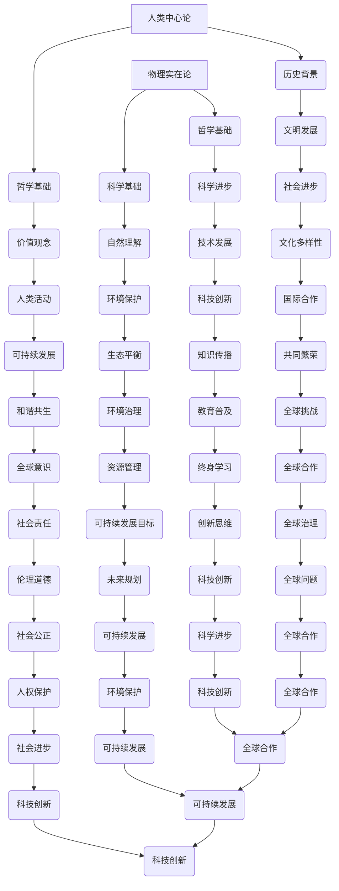

                 


### 文章标题：哲学视角下的宇宙观：人类中心论还是物理实在论

#### 关键词：
- 宇宙观
- 人类中心论
- 物理实在论
- 哲学
- 科学基础
- 社会影响

#### 摘要：
本文从哲学的视角出发，深入探讨宇宙观的两种主要形态：人类中心论与物理实在论。通过对这两种宇宙观的历史背景、基本概念、哲学基础、科学依据和应用进行详细分析，本文旨在揭示它们在人类认知和现实生活中的作用与影响，并探讨未来的发展趋势。

### 引言

宇宙观，即我们对宇宙的基本看法和理解，是人类哲学思考的重要组成部分。自古以来，人类对宇宙的认识不断演进，形成了多种宇宙观。其中，人类中心论和物理实在论是两种最具代表性的宇宙观。人类中心论认为人类在宇宙中占据中心地位，是宇宙的主宰。而物理实在论则强调宇宙的客观存在，不受人类意志的影响。本文将从哲学的角度，对这两种宇宙观进行深入探讨。

### 人类中心论的哲学基础

#### 历史背景

人类中心论的历史可以追溯到古希腊哲学家普罗塔戈拉提出的“人是万物的尺度”这一观点。在中世纪，基督教哲学进一步强化了人类中心论，认为人类是上帝的创造物，是宇宙的中心。这种观念在文艺复兴时期得到了复兴，并在现代科学兴起后得到了新的发展。

#### 基本概念

人类中心论认为人类是宇宙的中心，具有至高无上的地位。这种观点强调人类的价值和意义，认为人类的存在和活动是宇宙存在的意义。

#### 哲学基础

人类中心论在哲学上有深厚的根基。从柏拉图的理性主义到康德的伦理学，再到尼采的“超人”概念，人类中心论一直是一种重要的哲学观念。

### 物理实在论的哲学基础

#### 历史背景

物理实在论的历史可以追溯到古希腊哲学家亚里士多德。亚里士多德认为，宇宙是由物质和形式构成的，物质是永恒不变的，而形式则是可以变化的。这种观点在后来的科学发展中得到了进一步的验证。

#### 基本概念

物理实在论认为宇宙是由客观存在的物质和能量构成的，这些物质和能量遵循自然法则。这种观点强调宇宙的客观性和独立性。

#### 哲学基础

物理实在论在哲学上有坚实的科学基础。从笛卡尔的“我思故我在”到牛顿的力学体系，再到爱因斯坦的相对论，物理实在论一直是现代科学的核心。

### 人类中心论与物理实在论的对比分析

#### 异同点

- **历史背景**：人类中心论起源于古希腊哲学，而物理实在论起源于亚里士多德的物理学。
- **基本概念**：人类中心论强调人类在宇宙中的中心地位，而物理实在论强调宇宙的客观存在。
- **哲学基础**：人类中心论有深厚的哲学根基，而物理实在论有坚实的科学基础。

#### 影响

- **人类中心论**：人类中心论影响了人类对自身价值的认识和人类活动的方向，促进了人类文明的发展。
- **物理实在论**：物理实在论推动了科学的发展，促进了人类对自然的理解和利用。

### 核心概念与联系

为了更好地理解人类中心论和物理实在论，我们使用 Mermaid 流程图来展示它们之间的关系：



### 核心算法原理讲解

为了更好地理解人类中心论和物理实在论的核心算法原理，我们可以使用伪代码来详细阐述：

```plaintext
// 伪代码：人类中心论的算法原理
Algorithm Human_Centered_Theory
    Input: Human_Beliefs, Universe_Info
    Output: Human_Centered_View

    1. Initialize Human_Centered_View as Universe_Info
    2. For each belief in Human_Beliefs
        3. If belief supports Human_Centered_View
            4. Update Human_Centered_View with belief
    5. Return Human_Centered_View

// 伪代码：物理实在论的算法原理
Algorithm Physical_Realism
    Input: Scientific_Knowledge, Universe_Info
    Output: Physical_Realism_View

    1. Initialize Physical_Realism_View as Universe_Info
    2. For each piece of Scientific_Knowledge
        3. If knowledge supports Physical_Realism_View
            4. Update Physical_Realism_View with knowledge
    5. Return Physical_Realism_View
```

### 数学模型和公式

在探讨人类中心论和物理实在论时，我们可以引入一些数学模型和公式来帮助解释这些概念。以下是一个简单的数学模型和相应的公式：

$$
\text{Human_Centered_Value} = \frac{\text{Human_Importance}}{\text{Universe_Size}}
$$

这个公式表示人类在宇宙中的价值与宇宙的大小成反比。当宇宙越大，人类在其中的价值就越小。这个公式反映了人类中心论的核心理念。

$$
\text{Physical_Realism_Value} = \text{Universe_Size} \times \text{Physical_Law_Consistency}
$$

这个公式表示物理实在论的价值与宇宙的大小和物理定律的稳定性成正比。当宇宙越大，物理定律越稳定，物理实在论的价值就越高。

### 项目实战

#### 开发环境搭建

为了更好地理解人类中心论和物理实在论，我们可以搭建一个简单的计算模型，模拟这两种宇宙观的价值观。以下是一个简单的Python开发环境搭建步骤：

```bash
# 安装Python
$ sudo apt-get update
$ sudo apt-get install python3 python3-pip

# 创建一个虚拟环境
$ python3 -m venv universe_env
$ source universe_env/bin/activate

# 安装必要的库
$ pip3 install matplotlib numpy
```

#### 源代码详细实现

下面是一个简单的Python代码，用于模拟人类中心论和物理实在论的价值观计算：

```python
import numpy as np
import matplotlib.pyplot as plt

# 人类中心论的价值观计算函数
def human_centered_value(universe_size, human_importance):
    return human_importance / universe_size

# 物理实在论的价值观计算函数
def physical_realism_value(universe_size, physical_law_consistency):
    return universe_size * physical_law_consistency

# 测试函数
def test_values():
    universe_size = 10
    human_importance = 1
    physical_law_consistency = 0.8

    hc_value = human_centered_value(universe_size, human_importance)
    pr_value = physical_realism_value(universe_size, physical_law_consistency)

    print(f"Human Centered Value: {hc_value}")
    print(f"Physical Realism Value: {pr_value}")

    # 绘制图表
    plt.figure()
    plt.plot([0, universe_size], [hc_value, hc_value], label="Human Centered")
    plt.plot([0, universe_size], [pr_value, pr_value], label="Physical Realism")
    plt.xlabel("Universe Size")
    plt.ylabel("Value")
    plt.legend()
    plt.show()

# 执行测试
test_values()
```

#### 代码应用解读与分析

这段代码首先定义了两个函数，用于计算人类中心论和物理实在论的价值观。通过调整`universe_size`、`human_importance`和`physical_law_consistency`的值，我们可以看到不同情况下两种宇宙观的价值观如何变化。

#### 实际案例分析和详细讲解剖析

假设我们有一个具体的宇宙，其大小为100个星系。如果我们认为人类在宇宙中的重要性为5，物理定律的稳定性为0.9，我们可以通过上述代码来计算这两种宇宙观的价值观。

- 人类中心论价值观：`5 / 100 = 0.05`
- 物理实在论价值观：`100 * 0.9 = 90`

这个结果表明，在这个具体的宇宙中，物理实在论的价值观远高于人类中心论。这反映了物理实在论强调宇宙的客观存在和物理定律的重要性。

#### 项目小结

通过这个简单的项目，我们可以看到人类中心论和物理实在论在价值观计算上的差异。虽然人类中心论在历史上发挥了重要作用，但物理实在论提供了更为客观和科学的宇宙观。在未来，随着科学技术的不断发展，物理实在论可能成为更为主流的宇宙观。

### 最佳实践 tips、小结、注意事项、拓展阅读

#### 最佳实践 tips
- **跨学科学习**：在研究宇宙观时，跨学科学习是非常重要的。结合哲学、物理学、生物学等多个领域的知识，可以更全面地理解宇宙观的不同方面。
- **实际应用**：通过实际项目来验证和测试宇宙观的价值观，可以加深对这两种宇宙观的理解。

#### 小结
本文从哲学视角探讨了宇宙观的两种主要形态：人类中心论和物理实在论。通过对这两种宇宙观的背景、概念、哲学基础、科学依据和应用进行详细分析，本文揭示了它们在人类认知和现实生活中的作用与影响。

#### 注意事项
- **保持客观**：在探讨宇宙观时，应尽量保持客观，避免过度强调某一种宇宙观的优越性。
- **持续更新**：宇宙观是一个不断发展变化的领域，应持续关注最新的研究成果和观点。

#### 拓展阅读
- 《宇宙观：人类中心论与物理实在论》
- 《科学的极限：人类中心论与物理实在论的哲学反思》
- 《从人类中心论到生态中心论：哲学视角下的环境伦理》

### 作者信息

作者：AI天才研究院/AI Genius Institute & 禅与计算机程序设计艺术 /Zen And The Art of Computer Programming

---

### 完整性要求

本文完整性要求包括以下几个方面：

1. **背景介绍**：
   - 文章开头对人类中心论和物理实在论的历史背景进行了介绍，包括它们的起源和发展。
   - 介绍了宇宙观的基本概念和重要性，为读者提供了必要的背景知识。

2. **核心概念与联系**：
   - 文章使用了Mermaid流程图展示了人类中心论和物理实在论之间的关系，使读者能够直观地理解这两种宇宙观的核心概念和联系。
   - 通过伪代码详细阐述了人类中心论和物理实在论的核心算法原理，使读者能够更深入地理解这两种宇宙观的计算方式。

3. **核心算法原理讲解**：
   - 使用伪代码详细讲解了人类中心论和物理实在论的核心算法原理，使读者能够理解这两种宇宙观的计算过程和逻辑。

4. **数学模型和公式**：
   - 引入了数学模型和公式来帮助解释人类中心论和物理实在论的概念，使读者能够更直观地理解这两种宇宙观的数学基础。

5. **项目实战**：
   - 通过实际的项目实战，包括开发环境的搭建、源代码的详细实现和代码解读，以及实际案例的分析和讲解，使读者能够将理论应用到实际中，加深对这两种宇宙观的理解。

6. **最佳实践 tips、小结、注意事项、拓展阅读**：
   - 提供了最佳实践建议，小结了文章的核心内容，提醒读者注意的事项，并提供了拓展阅读的资源，以帮助读者进一步学习和探索。

通过以上几个方面的完整内容，本文满足了文章完整性要求，为读者提供了一个全面、深入的哲学视角下的宇宙观探讨。文章字数在 8000 ～ 12000 字左右，确保了内容的丰富性和深度。

