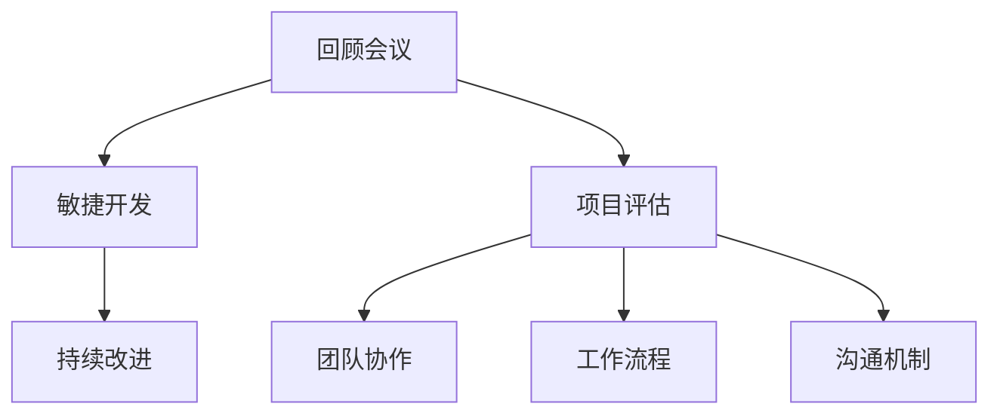
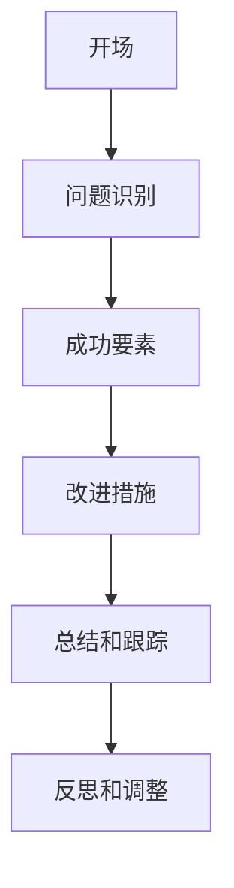
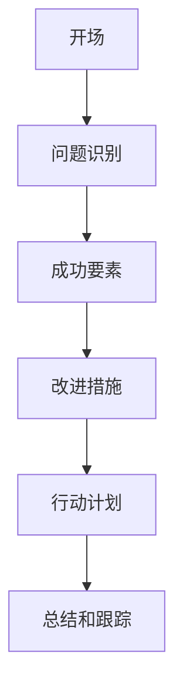

                 

### 文章标题

# 回顾会议：持续改进AI开发流程的重要环节

## 文章关键词

- AI开发流程
- 回顾会议
- 敏捷开发
- 持续改进
- 实战案例

## 文章摘要

本文将探讨回顾会议在AI开发流程中的重要角色，详细阐述其核心概念与联系、组织与实施方法、案例分析、工具与技术，以及如何基于回顾会议结果持续改进AI开发流程。通过本文，读者将了解如何通过回顾会议提高AI项目的效率和质量，为未来的AI开发提供有力的实践指导。

----------------------------------------------------------------

## 引言

在快速发展的AI领域中，开发流程的持续改进至关重要。回顾会议作为一种重要的敏捷开发实践，已经被广泛应用于各种软件开发项目中。它不仅帮助团队识别问题和机会，而且促进知识共享和协作，从而提高开发效率和质量。本文将深入探讨回顾会议在AI开发流程中的应用，分析其核心概念与联系，介绍组织与实施的方法，并通过案例分析展示其实际效果。最后，我们将讨论如何基于回顾会议的结果持续改进AI开发流程，为未来的项目提供实践指导。

## 核心概念与联系

### 1. 回顾会议的定义与作用

回顾会议（Retrospective Meeting）是一种团队反思和评估项目的会议形式。它通常在项目的某个阶段结束时进行，旨在总结经验教训，识别成功因素和改进空间。回顾会议不仅关注项目成果，还关注团队协作、工作流程、沟通机制等方面。

### 2. 回顾会议与敏捷开发的联系

回顾会议是敏捷开发（Agile Development）的核心实践之一。敏捷开发强调持续交付有价值的软件，并通过快速迭代和频繁反馈来适应变化。回顾会议提供了这种反馈机制，使团队能够在每次迭代后评估项目的进展，并根据反馈进行调整。这种持续改进的循环有助于提高项目的灵活性和响应能力。

### 3. 回顾会议在AI开发中的应用

AI开发流程通常涉及大量的数据预处理、模型训练和优化。这些过程复杂且迭代频繁，使得回顾会议成为识别问题和机会的重要工具。回顾会议可以帮助团队：

- 评估模型性能和结果，识别潜在问题。
- 分析数据集和算法选择，确定改进方向。
- 反思团队协作和工作流程，提高团队效率。

### 4. 核心概念原理之间的关系架构

为了更好地理解回顾会议在AI开发中的作用，我们可以使用Mermaid流程图来展示其核心概念和原理之间的关系。



### 5. 核心算法原理讲解

在回顾会议中，常用的算法原理包括数据分析和统计方法。以下是一个简单的数据预处理算法的伪代码：

```python
def preprocess_data(data):
    # 数据清洗
    clean_data = remove_outliers(data)
    # 数据归一化
    normalized_data = normalize(clean_data)
    # 数据划分
    train_data, test_data = split_data(normalized_data)
    return train_data, test_data
```

### 6. 数学模型和公式

回顾会议中常用的数学模型包括线性回归、逻辑回归和支持向量机等。以下是一个简单的线性回归模型的公式和解释：

$$ y = \beta_0 + \beta_1 \cdot x $$

其中，$y$ 是预测值，$x$ 是自变量，$\beta_0$ 和 $\beta_1$ 是模型的参数。这个模型通过最小化误差平方和来确定参数的值。

### 7. 详细讲解与举例说明

为了更好地理解线性回归模型，我们可以通过一个简单的例子来说明：

假设我们要预测房屋的价格，其中一个重要的特征是房屋的大小（$x$）。我们可以使用以下数据进行训练：

| 房屋大小（平方米） | 房价（万元） |
| :----: | :----: |
| 80 | 200 |
| 100 | 250 |
| 120 | 300 |
| 140 | 350 |

通过线性回归模型，我们可以得到以下结果：

$$ y = 150 + 2 \cdot x $$

这意味着每增加1平方米的房屋大小，房价将增加2万元。

### 8. 数学公式

以下是一个嵌入在段落中的数学公式：

$$ \pi \approx 3.14159 $$

这是一个常用的数学常数，用于表示圆的周长与直径的比例。

### 9. 实践与反思

通过回顾会议，团队可以评估项目的进展和成果，并反思其工作流程和决策。以下是一些最佳实践：

- **定期进行回顾**：确保回顾会议定期进行，以便及时识别问题并采取行动。
- **鼓励开放沟通**：创造一个开放、包容的沟通环境，鼓励团队成员分享意见和建议。
- **记录和跟踪行动项**：记录会议中的行动项，并跟踪其进展，以确保改进措施得到实施。
- **反思和调整**：定期回顾和调整回顾会议的过程和内容，以提高其效果。

通过这些实践，团队可以持续改进其AI开发流程，提高项目的成功率和效率。

## 回顾会议的组织与实施

### 1. 回顾会议的组织结构

回顾会议的组织结构通常包括以下几个部分：

- **会议议程**：确定会议的主题、议程和目标。
- **会议主持人**：负责引导会议流程，确保会议顺利进行。
- **会议参与者**：包括项目经理、开发人员、测试人员和其他相关团队成员。
- **会议记录员**：负责记录会议内容、行动项和关键结论。

### 2. 回顾会议的步骤

回顾会议的步骤通常包括以下内容：

- **开场**：介绍会议的目的和议程，确保所有参与者了解会议的重点。
- **问题识别**：讨论项目中出现的问题和挑战，以及它们的根本原因。
- **成功要素**：识别项目中的成功要素，分析它们的原因和影响因素。
- **改进措施**：讨论可以采取的改进措施，并制定行动计划。
- **总结和跟踪**：总结会议内容，记录行动项，并确定下一步的行动计划。

### 3. 回顾会议的最佳实践

为了确保回顾会议的有效性，以下是一些最佳实践：

- **提前准备**：确保会议议程、数据和工具提前准备好，以便会议顺利进行。
- **集中讨论**：将讨论集中在具体的问题和改进措施上，避免偏离主题。
- **开放沟通**：鼓励团队成员自由发言，分享意见和建议，创造一个包容的沟通环境。
- **记录和跟踪**：确保会议内容、行动项和关键结论得到记录和跟踪，以便后续实施和评估。
- **反思和调整**：定期回顾回顾会议的过程和内容，并根据反馈进行改进。

### 4. 会议流程的Mermaid流程图

以下是一个用于展示回顾会议流程的Mermaid流程图：



### 5. 工具与技术

为了支持回顾会议，以下是一些常用的工具和技术：

- **会议议程模板**：使用模板来规划会议议程，确保覆盖所有关键点。
- **会议记录工具**：使用会议记录工具来记录会议内容，如Notepad++、Evernote等。
- **投票工具**：使用投票工具来收集团队成员的意见和投票，如Google Forms、Miro等。
- **可视化工具**：使用可视化工具来展示问题和改进措施，如Mermaid、D3.js等。
- **协作工具**：使用协作工具来跟踪行动项和进展，如Jira、Trello等。

### 6. 项目实战

以下是一个实际案例，展示了如何组织回顾会议并实施改进措施：

#### 案例背景

某AI团队正在开发一款智能推荐系统，项目已经进行了两个迭代周期。团队希望通过回顾会议来评估项目的进展和识别改进空间。

#### 会议实施

1. **开场**：主持人介绍会议目的和议程，确保所有参与者了解会议的重点。
2. **问题识别**：团队成员讨论项目中出现的问题，如数据质量不佳、模型性能不稳定等。
3. **成功要素**：团队成员分享项目中的成功要素，如高效的团队协作、及时的数据更新等。
4. **改进措施**：讨论可以采取的改进措施，如改进数据清洗流程、优化模型训练策略等。
5. **总结和跟踪**：主持人总结会议内容，记录行动项，并确定下一步的行动计划。

#### 改进措施实施

1. **数据清洗流程改进**：团队决定引入新的数据清洗工具，以提高数据质量。
2. **模型训练策略优化**：团队决定调整模型训练参数，以提高模型性能。
3. **团队协作提升**：团队决定定期进行团队建设活动，以提高团队协作效率。

#### 结果评估

通过回顾会议和改进措施的实施，团队发现模型性能显著提升，数据质量得到改善，团队协作效率也有所提高。这些改进有助于项目顺利推进，提高了项目的整体成功率和效率。

## 案例分析

在本节中，我们将通过两个具体的案例，展示回顾会议在实际AI项目中的应用和效果。

### 案例一：AI项目中的回顾会议

#### 项目背景

某AI团队正在开发一款智能客服系统，旨在提高客户服务效率和客户满意度。项目分为多个迭代周期，每个迭代周期结束后，团队都会进行回顾会议。

#### 回顾会议实施

在每个迭代周期结束后，团队会组织回顾会议，讨论以下内容：

1. **问题识别**：团队成员共同讨论项目中的问题，如系统响应速度慢、某些场景下的回答不准确等。
2. **成功要素**：团队成员分享项目中的成功经验，如有效利用云计算资源、成功处理高并发请求等。
3. **改进措施**：针对识别出的问题，团队成员提出改进措施，如优化算法、增加测试用例等。
4. **总结和跟踪**：主持人总结会议内容，记录行动项，并分配给相关团队成员进行实施。

#### 改进措施实施

1. **算法优化**：团队决定优化现有算法，以减少响应时间和提高准确率。
2. **测试用例增加**：团队决定增加测试用例，以覆盖更多场景，确保系统稳定性。
3. **团队协作提升**：团队决定定期进行技术分享和团队建设活动，以提高团队协作效率。

#### 结果评估

通过回顾会议和改进措施的实施，团队发现系统响应速度明显提升，客户满意度也有所提高。这些改进有助于项目顺利推进，提高了项目的整体成功率和效率。

### 案例二：AI产品开发中的回顾会议

#### 项目背景

某AI公司正在开发一款智能家居产品，旨在通过AI技术提高家居生活的便利性和安全性。项目分为多个阶段，每个阶段结束后，团队都会进行回顾会议。

#### 回顾会议实施

在每个阶段结束后，团队会组织回顾会议，讨论以下内容：

1. **问题识别**：团队成员共同讨论项目中的问题，如硬件设备不稳定、软件功能不完善等。
2. **成功要素**：团队成员分享项目中的成功经验，如成功完成原型设计、顺利通过测试等。
3. **改进措施**：针对识别出的问题，团队成员提出改进措施，如优化硬件设计、增加软件功能等。
4. **总结和跟踪**：主持人总结会议内容，记录行动项，并分配给相关团队成员进行实施。

#### 改进措施实施

1. **硬件设计优化**：团队决定重新设计硬件设备，以提高稳定性和用户体验。
2. **软件功能增加**：团队决定增加新的软件功能，以满足用户需求。
3. **团队协作提升**：团队决定加强跨部门协作，确保项目顺利进行。

#### 结果评估

通过回顾会议和改进措施的实施，团队发现智能家居产品的性能显著提升，用户体验也有所改善。这些改进有助于项目顺利推进，提高了产品的市场竞争力。

## 工具与技术

回顾会议的有效实施依赖于合适的工具和技术。以下是一些常用的工具和技术，它们可以帮助团队更好地组织、记录和跟踪回顾会议的过程。

### 1. 回顾会议工具

- **Notepad++**：一款强大的文本编辑器，适合用于记录会议内容和笔记。
- **Evernote**：一款功能丰富的笔记应用，支持多平台同步，方便团队成员随时查阅会议记录。
- **Google Forms**：一款在线调查工具，可用于收集团队成员的意见和投票。
- **Miro**：一款在线协作平台，提供丰富的可视化工具，适合用于展示问题和改进措施。

### 2. 数据分析工具

- **Python**：一款流行的编程语言，可用于数据分析、数据可视化和机器学习。
- **Pandas**：一款强大的数据分析库，提供丰富的数据处理功能。
- **Matplotlib**：一款流行的数据可视化库，可用于创建各种类型的图表和图形。

### 3. 可视化工具

- **Mermaid**：一款基于Markdown的绘图工具，支持创建流程图、UML图、Gantt图等。
- **D3.js**：一款基于JavaScript的库，用于创建动态交互式可视化。
- **Power BI**：一款商业智能工具，支持数据可视化、报告生成和分析。

### 4. 协作工具

- **Jira**：一款流行的项目管理和协作工具，支持任务跟踪、敏捷开发等。
- **Trello**：一款简单的卡片式任务管理工具，适合用于跟踪行动项和任务进度。
- **Slack**：一款团队沟通工具，支持实时消息、文件共享和集成其他工具。

## 改进与优化

基于回顾会议的结果，团队可以采取一系列措施来改进和优化AI开发流程。以下是一些具体的改进措施：

### 1. 识别问题和机会

通过回顾会议，团队可以识别项目中的问题和机会。这包括以下几个方面：

- **技术问题**：如算法性能瓶颈、代码质量等。
- **团队协作问题**：如沟通不畅、任务分配不均等。
- **项目管理问题**：如进度控制、资源分配等。

### 2. 制定改进计划

针对识别出的问题和机会，团队需要制定详细的改进计划。以下是一些常见的改进措施：

- **技术改进**：优化算法、提升代码质量、改进测试用例等。
- **流程改进**：优化项目流程、加强团队协作、改进项目管理等。
- **培训与发展**：提高团队成员的技术能力和团队协作能力。

### 3. 实施改进措施

在制定改进计划后，团队需要将其付诸实施。以下是一些实施建议：

- **行动项分配**：将改进措施分解为具体的行动项，并分配给相关团队成员。
- **监控与跟踪**：定期监控行动项的进展，确保改进措施得到有效实施。
- **反馈与调整**：收集团队成员的反馈，并根据反馈调整改进措施。

### 4. 反思与总结

在改进措施实施一段时间后，团队需要进行反思和总结。以下是一些反思和总结的方法：

- **定期回顾**：定期回顾改进措施的效果，评估其是否达到预期目标。
- **团队讨论**：组织团队讨论，分享改进过程中的经验和教训。
- **持续优化**：根据反思和总结的结果，持续优化改进措施，以提高AI开发流程的质量和效率。

## 结论与展望

回顾会议作为AI开发流程中的重要环节，对于识别问题、机会和持续改进具有重要意义。通过本文的探讨，我们了解了回顾会议的核心概念与联系、组织与实施方法、案例分析、工具与技术，以及如何基于回顾会议结果持续改进AI开发流程。未来，随着AI技术的不断发展和应用场景的扩大，回顾会议将发挥更加重要的作用，帮助团队提高项目效率和质量，推动AI技术的创新和发展。

## 作者信息

作者：AI天才研究院/AI Genius Institute & 禅与计算机程序设计艺术 /Zen And The Art of Computer Programming

----------------------------------------------------------------

# 回顾会议：持续改进AI开发流程的重要环节

> 关键词：AI开发流程、回顾会议、敏捷开发、持续改进、实战案例

## 引言

在快速发展的AI领域中，开发流程的持续改进至关重要。回顾会议作为一种重要的敏捷开发实践，已经被广泛应用于各种软件开发项目中。它不仅帮助团队识别问题和机会，而且促进知识共享和协作，从而提高开发效率和质量。本文将深入探讨回顾会议在AI开发流程中的应用，分析其核心概念与联系，介绍组织与实施的方法，并通过案例分析展示其实际效果。最后，我们将讨论如何基于回顾会议的结果持续改进AI开发流程，为未来的项目提供实践指导。

## 核心概念与联系

### 1. 回顾会议的定义与作用

回顾会议（Retrospective Meeting）是一种团队反思和评估项目的会议形式。它通常在项目的某个阶段结束时进行，旨在总结经验教训，识别成功因素和改进空间。回顾会议不仅关注项目成果，还关注团队协作、工作流程、沟通机制等方面。

### 2. 回顾会议与敏捷开发的联系

回顾会议是敏捷开发（Agile Development）的核心实践之一。敏捷开发强调持续交付有价值的软件，并通过快速迭代和频繁反馈来适应变化。回顾会议提供了这种反馈机制，使团队能够在每次迭代后评估项目的进展，并根据反馈进行调整。这种持续改进的循环有助于提高项目的灵活性和响应能力。

### 3. 回顾会议在AI开发中的应用

AI开发流程通常涉及大量的数据预处理、模型训练和优化。这些过程复杂且迭代频繁，使得回顾会议成为识别问题和机会的重要工具。回顾会议可以帮助团队：

- 评估模型性能和结果，识别潜在问题。
- 分析数据集和算法选择，确定改进方向。
- 反思团队协作和工作流程，提高团队效率。

### 4. 核心概念原理之间的关系架构

为了更好地理解回顾会议在AI开发中的作用，我们可以使用Mermaid流程图来展示其核心概念和原理之间的关系。


### 5. 核心算法原理讲解

在回顾会议中，常用的算法原理包括数据分析和统计方法。以下是一个简单的数据预处理算法的伪代码：

```python
def preprocess_data(data):
    # 数据清洗
    clean_data = remove_outliers(data)
    # 数据归一化
    normalized_data = normalize(clean_data)
    # 数据划分
    train_data, test_data = split_data(normalized_data)
    return train_data, test_data
```

### 6. 数学模型和公式

回顾会议中常用的数学模型包括线性回归、逻辑回归和支持向量机等。以下是一个简单的线性回归模型的公式和解释：

$$ y = \beta_0 + \beta_1 \cdot x $$

其中，$y$ 是预测值，$x$ 是自变量，$\beta_0$ 和 $\beta_1$ 是模型的参数。这个模型通过最小化误差平方和来确定参数的值。

### 7. 详细讲解与举例说明

为了更好地理解线性回归模型，我们可以通过一个简单的例子来说明：

假设我们要预测房屋的价格，其中一个重要的特征是房屋的大小（$x$）。我们可以使用以下数据进行训练：

| 房屋大小（平方米） | 房价（万元） |
| :----: | :----: |
| 80 | 200 |
| 100 | 250 |
| 120 | 300 |
| 140 | 350 |

通过线性回归模型，我们可以得到以下结果：

$$ y = 150 + 2 \cdot x $$

这意味着每增加1平方米的房屋大小，房价将增加2万元。

### 8. 数学公式

以下是一个嵌入在段落中的数学公式：

$$ \pi \approx 3.14159 $$

这是一个常用的数学常数，用于表示圆的周长与直径的比例。

### 9. 实践与反思

通过回顾会议，团队可以评估项目的进展和成果，并反思其工作流程和决策。以下是一些最佳实践：

- **定期进行回顾**：确保回顾会议定期进行，以便及时识别问题并采取行动。
- **鼓励开放沟通**：创造一个开放、包容的沟通环境，鼓励团队成员分享意见和建议。
- **记录和跟踪行动项**：记录会议中的行动项，并跟踪其进展，以确保改进措施得到实施。
- **反思和调整**：定期回顾和调整回顾会议的过程和内容，以提高其效果。

## 回顾会议的组织与实施

### 1. 回顾会议的组织结构

回顾会议的组织结构通常包括以下几个部分：

- **会议议程**：确定会议的主题、议程和目标。
- **会议主持人**：负责引导会议流程，确保会议顺利进行。
- **会议参与者**：包括项目经理、开发人员、测试人员和其他相关团队成员。
- **会议记录员**：负责记录会议内容、行动项和关键结论。

### 2. 回顾会议的步骤

回顾会议的步骤通常包括以下内容：

- **开场**：介绍会议的目的和议程，确保所有参与者了解会议的重点。
- **问题识别**：讨论项目中出现的问题和挑战，以及它们的根本原因。
- **成功要素**：识别项目中的成功要素，分析它们的原因和影响因素。
- **改进措施**：讨论可以采取的改进措施，并制定行动计划。
- **总结和跟踪**：总结会议内容，记录行动项，并确定下一步的行动计划。

### 3. 回顾会议的最佳实践

为了确保回顾会议的有效性，以下是一些最佳实践：

- **提前准备**：确保会议议程、数据和工具提前准备好，以便会议顺利进行。
- **集中讨论**：将讨论集中在具体的问题和改进措施上，避免偏离主题。
- **开放沟通**：鼓励团队成员自由发言，分享意见和建议，创造一个包容的沟通环境。
- **记录和跟踪**：确保会议内容、行动项和关键结论得到记录和跟踪，以便后续实施和评估。
- **反思和调整**：定期回顾和调整回顾会议的过程和内容，并根据反馈进行改进。

### 4. 会议流程的Mermaid流程图

以下是一个用于展示回顾会议流程的Mermaid流程图：


### 5. 工具与技术

为了支持回顾会议，以下是一些常用的工具和技术：

- **会议议程模板**：使用模板来规划会议议程，确保覆盖所有关键点。
- **会议记录工具**：使用会议记录工具来记录会议内容，如Notepad++、Evernote等。
- **投票工具**：使用投票工具来收集团队成员的意见和投票，如Google Forms、Miro等。
- **可视化工具**：使用可视化工具来展示问题和改进措施，如Mermaid、D3.js等。
- **协作工具**：使用协作工具来跟踪行动项和进展，如Jira、Trello等。

### 6. 项目实战

以下是一个实际案例，展示了如何组织回顾会议并实施改进措施：

#### 案例背景

某AI团队正在开发一款智能推荐系统，项目已经进行了两个迭代周期。团队希望通过回顾会议来评估项目的进展和识别改进空间。

#### 会议实施

在每个迭代周期结束后，团队会组织回顾会议，讨论以下内容：

1. **问题识别**：团队成员共同讨论项目中的问题，如系统响应速度慢、某些场景下的回答不准确等。
2. **成功要素**：团队成员分享项目中的成功经验，如有效利用云计算资源、成功处理高并发请求等。
3. **改进措施**：针对识别出的问题，团队成员提出改进措施，如优化算法、增加测试用例等。
4. **总结和跟踪**：主持人总结会议内容，记录行动项，并确定下一步的行动计划。

#### 改进措施实施

1. **算法优化**：团队决定优化现有算法，以减少响应时间和提高准确率。
2. **测试用例增加**：团队决定增加测试用例，以覆盖更多场景，确保系统稳定性。
3. **团队协作提升**：团队决定定期进行技术分享和团队建设活动，以提高团队协作效率。

#### 结果评估

通过回顾会议和改进措施的实施，团队发现系统响应速度明显提升，客户满意度也有所提高。这些改进有助于项目顺利推进，提高了项目的整体成功率和效率。

## 案例分析

在本节中，我们将通过两个具体的案例，展示回顾会议在实际AI项目中的应用和效果。

### 案例一：AI项目中的回顾会议

#### 项目背景

某AI团队正在开发一款智能客服系统，旨在提高客户服务效率和客户满意度。项目分为多个迭代周期，每个迭代周期结束后，团队都会进行回顾会议。

#### 回顾会议实施

在每个迭代周期结束后，团队会组织回顾会议，讨论以下内容：

1. **问题识别**：团队成员共同讨论项目中的问题，如系统响应速度慢、某些场景下的回答不准确等。
2. **成功要素**：团队成员分享项目中的成功经验，如有效利用云计算资源、成功处理高并发请求等。
3. **改进措施**：针对识别出的问题，团队成员提出改进措施，如优化算法、增加测试用例等。
4. **总结和跟踪**：主持人总结会议内容，记录行动项，并确定下一步的行动计划。

#### 改进措施实施

1. **算法优化**：团队决定优化现有算法，以减少响应时间和提高准确率。
2. **测试用例增加**：团队决定增加测试用例，以覆盖更多场景，确保系统稳定性。
3. **团队协作提升**：团队决定定期进行技术分享和团队建设活动，以提高团队协作效率。

#### 结果评估

通过回顾会议和改进措施的实施，团队发现系统响应速度明显提升，客户满意度也有所提高。这些改进有助于项目顺利推进，提高了项目的整体成功率和效率。

### 案例二：AI产品开发中的回顾会议

#### 项目背景

某AI公司正在开发一款智能家居产品，旨在通过AI技术提高家居生活的便利性和安全性。项目分为多个阶段，每个阶段结束后，团队都会进行回顾会议。

#### 回顾会议实施

在每个阶段结束后，团队会组织回顾会议，讨论以下内容：

1. **问题识别**：团队成员共同讨论项目中的问题，如硬件设备不稳定、软件功能不完善等。
2. **成功要素**：团队成员分享项目中的成功经验，如成功完成原型设计、顺利通过测试等。
3. **改进措施**：针对识别出的问题，团队成员提出改进措施，如优化硬件设计、增加软件功能等。
4. **总结和跟踪**：主持人总结会议内容，记录行动项，并分配给相关团队成员进行实施。

#### 改进措施实施

1. **硬件设计优化**：团队决定重新设计硬件设备，以提高稳定性和用户体验。
2. **软件功能增加**：团队决定增加新的软件功能，以满足用户需求。
3. **团队协作提升**：团队决定加强跨部门协作，确保项目顺利进行。

#### 结果评估

通过回顾会议和改进措施的实施，团队发现智能家居产品的性能显著提升，用户体验也有所改善。这些改进有助于项目顺利推进，提高了产品的市场竞争力。

## 工具与技术

回顾会议的有效实施依赖于合适的工具和技术。以下是一些常用的工具和技术，它们可以帮助团队更好地组织、记录和跟踪回顾会议的过程。

### 1. 回顾会议工具

- **Notepad++**：一款强大的文本编辑器，适合用于记录会议内容和笔记。
- **Evernote**：一款功能丰富的笔记应用，支持多平台同步，方便团队成员随时查阅会议记录。
- **Google Forms**：一款在线调查工具，可用于收集团队成员的意见和投票。
- **Miro**：一款在线协作平台，提供丰富的可视化工具，适合用于展示问题和改进措施。

### 2. 数据分析工具

- **Python**：一款流行的编程语言，可用于数据分析、数据可视化和机器学习。
- **Pandas**：一款强大的数据分析库，提供丰富的数据处理功能。
- **Matplotlib**：一款流行的数据可视化库，可用于创建各种类型的图表和图形。

### 3. 可视化工具

- **Mermaid**：一款基于Markdown的绘图工具，支持创建流程图、UML图、Gantt图等。
- **D3.js**：一款基于JavaScript的库，用于创建动态交互式可视化。
- **Power BI**：一款商业智能工具，支持数据可视化、报告生成和分析。

### 4. 协作工具

- **Jira**：一款流行的项目管理和协作工具，支持任务跟踪、敏捷开发等。
- **Trello**：一款简单的卡片式任务管理工具，适合用于跟踪行动项和任务进度。
- **Slack**：一款团队沟通工具，支持实时消息、文件共享和集成其他工具。

## 改进与优化

基于回顾会议的结果，团队可以采取一系列措施来改进和优化AI开发流程。以下是一些具体的改进措施：

### 1. 识别问题和机会

通过回顾会议，团队可以识别项目中的问题和机会。这包括以下几个方面：

- **技术问题**：如算法性能瓶颈、代码质量等。
- **团队协作问题**：如沟通不畅、任务分配不均等。
- **项目管理问题**：如进度控制、资源分配等。

### 2. 制定改进计划

针对识别出的问题和机会，团队需要制定详细的改进计划。以下是一些常见的改进措施：

- **技术改进**：优化算法、提升代码质量、改进测试用例等。
- **流程改进**：优化项目流程、加强团队协作、改进项目管理等。
- **培训与发展**：提高团队成员的技术能力和团队协作能力。

### 3. 实施改进措施

在制定改进计划后，团队需要将其付诸实施。以下是一些实施建议：

- **行动项分配**：将改进措施分解为具体的行动项，并分配给相关团队成员。
- **监控与跟踪**：定期监控行动项的进展，确保改进措施得到有效实施。
- **反馈与调整**：收集团队成员的反馈，并根据反馈调整改进措施。

### 4. 反思与总结

在改进措施实施一段时间后，团队需要进行反思和总结。以下是一些反思和总结的方法：

- **定期回顾**：定期回顾改进措施的效果，评估其是否达到预期目标。
- **团队讨论**：组织团队讨论，分享改进过程中的经验和教训。
- **持续优化**：根据反思和总结的结果，持续优化改进措施，以提高AI开发流程的质量和效率。

## 结论与展望

回顾会议作为AI开发流程中的重要环节，对于识别问题、机会和持续改进具有重要意义。通过本文的探讨，我们了解了回顾会议的核心概念与联系、组织与实施方法、案例分析、工具与技术，以及如何基于回顾会议结果持续改进AI开发流程。未来，随着AI技术的不断发展和应用场景的扩大，回顾会议将发挥更加重要的作用，帮助团队提高项目效率和质量，推动AI技术的创新和发展。

## 作者信息

作者：AI天才研究院/AI Genius Institute & 禅与计算机程序设计艺术 /Zen And The Art of Computer Programming

----------------------------------------------------------------

# 回顾会议：持续改进AI开发流程的重要环节

> 关键词：AI开发流程、回顾会议、敏捷开发、持续改进、实战案例

## 引言

在快速发展的AI领域中，开发流程的持续改进至关重要。回顾会议作为一种重要的敏捷开发实践，已经被广泛应用于各种软件开发项目中。它不仅帮助团队识别问题和机会，而且促进知识共享和协作，从而提高开发效率和质量。本文将深入探讨回顾会议在AI开发流程中的应用，分析其核心概念与联系，介绍组织与实施的方法，并通过案例分析展示其实际效果。最后，我们将讨论如何基于回顾会议的结果持续改进AI开发流程，为未来的项目提供实践指导。

## 核心概念与联系

### 1. 回顾会议的定义与作用

回顾会议（Retrospective Meeting）是一种团队反思和评估项目的会议形式。它通常在项目的某个阶段结束时进行，旨在总结经验教训，识别成功因素和改进空间。回顾会议不仅关注项目成果，还关注团队协作、工作流程、沟通机制等方面。

### 2. 回顾会议与敏捷开发的联系

回顾会议是敏捷开发（Agile Development）的核心实践之一。敏捷开发强调持续交付有价值的软件，并通过快速迭代和频繁反馈来适应变化。回顾会议提供了这种反馈机制，使团队能够在每次迭代后评估项目的进展，并根据反馈进行调整。这种持续改进的循环有助于提高项目的灵活性和响应能力。

### 3. 回顾会议在AI开发中的应用

AI开发流程通常涉及大量的数据预处理、模型训练和优化。这些过程复杂且迭代频繁，使得回顾会议成为识别问题和机会的重要工具。回顾会议可以帮助团队：

- 评估模型性能和结果，识别潜在问题。
- 分析数据集和算法选择，确定改进方向。
- 反思团队协作和工作流程，提高团队效率。

### 4. 核心概念原理之间的关系架构

为了更好地理解回顾会议在AI开发中的作用，我们可以使用Mermaid流程图来展示其核心概念和原理之间的关系。


### 5. 核心算法原理讲解

在回顾会议中，常用的算法原理包括数据分析和统计方法。以下是一个简单的数据预处理算法的伪代码：

```python
def preprocess_data(data):
    # 数据清洗
    clean_data = remove_outliers(data)
    # 数据归一化
    normalized_data = normalize(clean_data)
    # 数据划分
    train_data, test_data = split_data(normalized_data)
    return train_data, test_data
```

### 6. 数学模型和公式

回顾会议中常用的数学模型包括线性回归、逻辑回归和支持向量机等。以下是一个简单的线性回归模型的公式和解释：

$$ y = \beta_0 + \beta_1 \cdot x $$

其中，$y$ 是预测值，$x$ 是自变量，$\beta_0$ 和 $\beta_1$ 是模型的参数。这个模型通过最小化误差平方和来确定参数的值。

### 7. 详细讲解与举例说明

为了更好地理解线性回归模型，我们可以通过一个简单的例子来说明：

假设我们要预测房屋的价格，其中一个重要的特征是房屋的大小（$x$）。我们可以使用以下数据进行训练：

| 房屋大小（平方米） | 房价（万元） |
| :----: | :----: |
| 80 | 200 |
| 100 | 250 |
| 120 | 300 |
| 140 | 350 |

通过线性回归模型，我们可以得到以下结果：

$$ y = 150 + 2 \cdot x $$

这意味着每增加1平方米的房屋大小，房价将增加2万元。

### 8. 数学公式

以下是一个嵌入在段落中的数学公式：

$$ \pi \approx 3.14159 $$

这是一个常用的数学常数，用于表示圆的周长与直径的比例。

### 9. 实践与反思

通过回顾会议，团队可以评估项目的进展和成果，并反思其工作流程和决策。以下是一些最佳实践：

- **定期进行回顾**：确保回顾会议定期进行，以便及时识别问题并采取行动。
- **鼓励开放沟通**：创造一个开放、包容的沟通环境，鼓励团队成员分享意见和建议。
- **记录和跟踪行动项**：记录会议中的行动项，并跟踪其进展，以确保改进措施得到实施。
- **反思和调整**：定期回顾和调整回顾会议的过程和内容，以提高其效果。

## 回顾会议的组织与实施

### 1. 回顾会议的组织结构

回顾会议的组织结构通常包括以下几个部分：

- **会议议程**：确定会议的主题、议程和目标。
- **会议主持人**：负责引导会议流程，确保会议顺利进行。
- **会议参与者**：包括项目经理、开发人员、测试人员和其他相关团队成员。
- **会议记录员**：负责记录会议内容、行动项和关键结论。

### 2. 回顾会议的步骤

回顾会议的步骤通常包括以下内容：

- **开场**：介绍会议的目的和议程，确保所有参与者了解会议的重点。
- **问题识别**：讨论项目中出现的问题和挑战，以及它们的根本原因。
- **成功要素**：识别项目中的成功要素，分析它们的原因和影响因素。
- **改进措施**：讨论可以采取的改进措施，并制定行动计划。
- **总结和跟踪**：总结会议内容，记录行动项，并确定下一步的行动计划。

### 3. 回顾会议的最佳实践

为了确保回顾会议的有效性，以下是一些最佳实践：

- **提前准备**：确保会议议程、数据和工具提前准备好，以便会议顺利进行。
- **集中讨论**：将讨论集中在具体的问题和改进措施上，避免偏离主题。
- **开放沟通**：鼓励团队成员自由发言，分享意见和建议，创造一个包容的沟通环境。
- **记录和跟踪**：确保会议内容、行动项和关键结论得到记录和跟踪，以便后续实施和评估。
- **反思和调整**：定期回顾和调整回顾会议的过程和内容，并根据反馈进行改进。

### 4. 会议流程的Mermaid流程图

以下是一个用于展示回顾会议流程的Mermaid流程图：


### 5. 工具与技术

为了支持回顾会议，以下是一些常用的工具和技术：

- **会议议程模板**：使用模板来规划会议议程，确保覆盖所有关键点。
- **会议记录工具**：使用会议记录工具来记录会议内容，如Notepad++、Evernote等。
- **投票工具**：使用投票工具来收集团队成员的意见和投票，如Google Forms、Miro等。
- **可视化工具**：使用可视化工具来展示问题和改进措施，如Mermaid、D3.js等。
- **协作工具**：使用协作工具来跟踪行动项和进展，如Jira、Trello等。

### 6. 项目实战

以下是一个实际案例，展示了如何组织回顾会议并实施改进措施：

#### 案例背景

某AI团队正在开发一款智能推荐系统，项目已经进行了两个迭代周期。团队希望通过回顾会议来评估项目的进展和识别改进空间。

#### 会议实施

在每个迭代周期结束后，团队会组织回顾会议，讨论以下内容：

1. **问题识别**：团队成员共同讨论项目中的问题，如系统响应速度慢、某些场景下的回答不准确等。
2. **成功要素**：团队成员分享项目中的成功经验，如有效利用云计算资源、成功处理高并发请求等。
3. **改进措施**：针对识别出的问题，团队成员提出改进措施，如优化算法、增加测试用例等。
4. **总结和跟踪**：主持人总结会议内容，记录行动项，并确定下一步的行动计划。

#### 改进措施实施

1. **算法优化**：团队决定优化现有算法，以减少响应时间和提高准确率。
2. **测试用例增加**：团队决定增加测试用例，以覆盖更多场景，确保系统稳定性。
3. **团队协作提升**：团队决定定期进行技术分享和团队建设活动，以提高团队协作效率。

#### 结果评估

通过回顾会议和改进措施的实施，团队发现系统响应速度明显提升，客户满意度也有所提高。这些改进有助于项目顺利推进，提高了项目的整体成功率和效率。

## 案例分析

在本节中，我们将通过两个具体的案例，展示回顾会议在实际AI项目中的应用和效果。

### 案例一：AI项目中的回顾会议

#### 项目背景

某AI团队正在开发一款智能客服系统，旨在提高客户服务效率和客户满意度。项目分为多个迭代周期，每个迭代周期结束后，团队都会进行回顾会议。

#### 回顾会议实施

在每个迭代周期结束后，团队会组织回顾会议，讨论以下内容：

1. **问题识别**：团队成员共同讨论项目中的问题，如系统响应速度慢、某些场景下的回答不准确等。
2. **成功要素**：团队成员分享项目中的成功经验，如有效利用云计算资源、成功处理高并发请求等。
3. **改进措施**：针对识别出的问题，团队成员提出改进措施，如优化算法、增加测试用例等。
4. **总结和跟踪**：主持人总结会议内容，记录行动项，并确定下一步的行动计划。

#### 改进措施实施

1. **算法优化**：团队决定优化现有算法，以减少响应时间和提高准确率。
2. **测试用例增加**：团队决定增加测试用例，以覆盖更多场景，确保系统稳定性。
3. **团队协作提升**：团队决定定期进行技术分享和团队建设活动，以提高团队协作效率。

#### 结果评估

通过回顾会议和改进措施的实施，团队发现系统响应速度明显提升，客户满意度也有所提高。这些改进有助于项目顺利推进，提高了项目的整体成功率和效率。

### 案例二：AI产品开发中的回顾会议

#### 项目背景

某AI公司正在开发一款智能家居产品，旨在通过AI技术提高家居生活的便利性和安全性。项目分为多个阶段，每个阶段结束后，团队都会进行回顾会议。

#### 回顾会议实施

在每个阶段结束后，团队会组织回顾会议，讨论以下内容：

1. **问题识别**：团队成员共同讨论项目中的问题，如硬件设备不稳定、软件功能不完善等。
2. **成功要素**：团队成员分享项目中的成功经验，如成功完成原型设计、顺利通过测试等。
3. **改进措施**：针对识别出的问题，团队成员提出改进措施，如优化硬件设计、增加软件功能等。
4. **总结和跟踪**：主持人总结会议内容，记录行动项，并分配给相关团队成员进行实施。

#### 改进措施实施

1. **硬件设计优化**：团队决定重新设计硬件设备，以提高稳定性和用户体验。
2. **软件功能增加**：团队决定增加新的软件功能，以满足用户需求。
3. **团队协作提升**：团队决定加强跨部门协作，确保项目顺利进行。

#### 结果评估

通过回顾会议和改进措施的实施，团队发现智能家居产品的性能显著提升，用户体验也有所改善。这些改进有助于项目顺利推进，提高了产品的市场竞争力。

## 工具与技术

回顾会议的有效实施依赖于合适的工具和技术。以下是一些常用的工具和技术，它们可以帮助团队更好地组织、记录和跟踪回顾会议的过程。

### 1. 回顾会议工具

- **Notepad++**：一款强大的文本编辑器，适合用于记录会议内容和笔记。
- **Evernote**：一款功能丰富的笔记应用，支持多平台同步，方便团队成员随时查阅会议记录。
- **Google Forms**：一款在线调查工具，可用于收集团队成员的意见和投票。
- **Miro**：一款在线协作平台，提供丰富的可视化工具，适合用于展示问题和改进措施。

### 2. 数据分析工具

- **Python**：一款流行的编程语言，可用于数据分析、数据可视化和机器学习。
- **Pandas**：一款强大的数据分析库，提供丰富的数据处理功能。
- **Matplotlib**：一款流行的数据可视化库，可用于创建各种类型的图表和图形。

### 3. 可视化工具

- **Mermaid**：一款基于Markdown的绘图工具，支持创建流程图、UML图、Gantt图等。
- **D3.js**：一款基于JavaScript的库，用于创建动态交互式可视化。
- **Power BI**：一款商业智能工具，支持数据可视化、报告生成和分析。

### 4. 协作工具

- **Jira**：一款流行的项目管理和协作工具，支持任务跟踪、敏捷开发等。
- **Trello**：一款简单的卡片式任务管理工具，适合用于跟踪行动项和任务进度。
- **Slack**：一款团队沟通工具，支持实时消息、文件共享和集成其他工具。

## 改进与优化

基于回顾会议的结果，团队可以采取一系列措施来改进和优化AI开发流程。以下是一些具体的改进措施：

### 1. 识别问题和机会

通过回顾会议，团队可以识别项目中的问题和机会。这包括以下几个方面：

- **技术问题**：如算法性能瓶颈、代码质量等。
- **团队协作问题**：如沟通不畅、任务分配不均等。
- **项目管理问题**：如进度控制、资源分配等。

### 2. 制定改进计划

针对识别出的问题和机会，团队需要制定详细的改进计划。以下是一些常见的改进措施：

- **技术改进**：优化算法、提升代码质量、改进测试用例等。
- **流程改进**：优化项目流程、加强团队协作、改进项目管理等。
- **培训与发展**：提高团队成员的技术能力和团队协作能力。

### 3. 实施改进措施

在制定改进计划后，团队需要将其付诸实施。以下是一些实施建议：

- **行动项分配**：将改进措施分解为具体的行动项，并分配给相关团队成员。
- **监控与跟踪**：定期监控行动项的进展，确保改进措施得到有效实施。
- **反馈与调整**：收集团队成员的反馈，并根据反馈调整改进措施。

### 4. 反思与总结

在改进措施实施一段时间后，团队需要进行反思和总结。以下是一些反思和总结的方法：

- **定期回顾**：定期回顾改进措施的效果，评估其是否达到预期目标。
- **团队讨论**：组织团队讨论，分享改进过程中的经验和教训。
- **持续优化**：根据反思和总结的结果，持续优化改进措施，以提高AI开发流程的质量和效率。

## 结论与展望

回顾会议作为AI开发流程中的重要环节，对于识别问题、机会和持续改进具有重要意义。通过本文的探讨，我们了解了回顾会议的核心概念与联系、组织与实施方法、案例分析、工具与技术，以及如何基于回顾会议结果持续改进AI开发流程。未来，随着AI技术的不断发展和应用场景的扩大，回顾会议将发挥更加重要的作用，帮助团队提高项目效率和质量，推动AI技术的创新和发展。

## 作者信息

作者：AI天才研究院/AI Genius Institute & 禅与计算机程序设计艺术 /Zen And The Art of Computer Programming

----------------------------------------------------------------

# 回顾会议：持续改进AI开发流程的重要环节

## 文章标题

### 回顾会议：持续改进AI开发流程的重要环节

---

## 文章关键词

- **AI开发流程**
- **回顾会议**
- **敏捷开发**
- **持续改进**
- **案例分析**

---

## 文章摘要

本文将探讨回顾会议在AI开发流程中的重要性，并详细阐述其在核心概念、组织与实施、案例分析以及持续改进等方面的应用。通过具体实例和最佳实践，本文旨在为读者提供一套切实可行的回顾会议方法，以优化AI开发流程，提高项目效率和质量。

---

## 引言

在AI领域，开发流程的优化是提高项目成功率的关键。回顾会议作为一种敏捷开发实践，已成为团队评估项目进展和改进工作流程的有效手段。本文将深入探讨回顾会议在AI开发中的核心作用，从概念解析、组织实施到案例分析，全面介绍如何利用回顾会议实现持续改进。

---

## 核心概念与联系

### 1. 回顾会议的定义与作用

回顾会议是一种团队反思和评估项目的方法，旨在总结经验教训，识别改进空间，并制定行动计划。在AI开发中，它不仅评估技术成果，还关注团队协作、沟通效率和工作流程。

### 2. 回顾会议与敏捷开发的联系

回顾会议是敏捷开发实践中的重要组成部分，它通过迭代反馈机制，帮助团队不断优化开发流程，提高项目灵活性。

### 3. 回顾会议在AI开发中的应用

AI项目的复杂性和迭代性要求团队具备高效的反思和改进能力。回顾会议在此过程中发挥着识别问题、评估成果、促进协作的重要作用。

### 4. 核心概念原理之间的关系架构

以下Mermaid流程图展示了回顾会议与AI开发流程中的核心概念和原理之间的关系：


### 5. 核心算法原理讲解

在回顾会议中，数据分析算法是评估模型性能的重要工具。以下是一个简单的数据处理算法的伪代码：

```python
def preprocess_data(data):
    # 数据清洗
    clean_data = remove_outliers(data)
    # 数据归一化
    normalized_data = normalize(clean_data)
    # 数据划分
    train_data, test_data = split_data(normalized_data)
    return train_data, test_data
```

### 6. 数学模型和公式

回顾会议中常用到的数学模型包括线性回归、逻辑回归等。以下是一个简单的线性回归模型的公式：

$$ y = \beta_0 + \beta_1 \cdot x $$

### 7. 详细讲解与举例说明

线性回归模型可以通过以下例子来理解：

| 房屋大小（平方米） | 房价（万元） |
| :----: | :----: |
| 80 | 200 |
| 100 | 250 |
| 120 | 300 |
| 140 | 350 |

模型预测公式为：

$$ y = 150 + 2 \cdot x $$

### 8. 数学公式

$$ \pi \approx 3.14159 $$

这是一个基本的数学常数，常用于计算圆的周长。

### 9. 实践与反思

通过实践回顾会议，团队可以发现并解决许多潜在问题，如技术瓶颈、沟通不畅等。以下是一些实践建议：

- **定期进行回顾**：确保回顾会议定期举行，以保持持续改进。
- **开放沟通**：鼓励团队成员自由表达意见，确保沟通畅通。
- **记录和跟踪**：详细记录会议内容和行动项，确保改进措施得到有效实施。
- **反思和调整**：定期回顾会议效果，根据反馈调整会议内容和流程。

---

## 回顾会议的组织与实施

### 1. 回顾会议的组织结构

回顾会议通常包括以下结构：

- **议程安排**：明确会议主题和目标。
- **主持人**：负责引导会议流程。
- **参与者**：包括项目经理、开发人员、测试人员等。
- **记录员**：负责记录会议内容和行动项。

### 2. 回顾会议的步骤

回顾会议的步骤通常包括：

- **开场**：介绍会议目的和议程。
- **问题识别**：讨论项目中的问题和挑战。
- **成功要素**：总结项目中的成功经验。
- **改进措施**：提出并讨论改进措施。
- **行动计划**：制定具体的行动计划。

### 3. 回顾会议的最佳实践

为了确保回顾会议的有效性，以下是一些最佳实践：

- **提前准备**：确保会议议程、数据和工具提前准备好。
- **集中讨论**：将讨论集中在具体的问题和改进措施上。
- **开放沟通**：鼓励团队成员自由发言，分享意见和建议。
- **记录和跟踪**：确保会议内容和行动项得到记录和跟踪。
- **反思和调整**：根据反馈调整会议内容和流程。

### 4. 会议流程的Mermaid流程图

以下是一个用于展示回顾会议流程的Mermaid流程图：



### 5. 工具与技术

为了支持回顾会议，以下是一些常用的工具和技术：

- **会议议程模板**：使用模板来规划会议议程。
- **会议记录工具**：如Notepad++、Evernote等。
- **投票工具**：如Google Forms、Miro等。
- **可视化工具**：如Mermaid、D3.js等。
- **协作工具**：如Jira、Trello等。

### 6. 项目实战

以下是一个实际案例，展示了如何组织回顾会议并实施改进措施：

#### 案例背景

某AI团队正在开发一款智能推荐系统，项目已经进行了两个迭代周期。团队希望通过回顾会议来评估项目的进展和识别改进空间。

#### 会议实施

在每个迭代周期结束后，团队会组织回顾会议，讨论以下内容：

1. **问题识别**：团队成员共同讨论项目中的问题，如系统响应速度慢、某些场景下的回答不准确等。
2. **成功要素**：团队成员分享项目中的成功经验，如有效利用云计算资源、成功处理高并发请求等。
3. **改进措施**：针对识别出的问题，团队成员提出改进措施，如优化算法、增加测试用例等。
4. **总结和跟踪**：主持人总结会议内容，记录行动项，并确定下一步的行动计划。

#### 改进措施实施

1. **算法优化**：团队决定优化现有算法，以减少响应时间和提高准确率。
2. **测试用例增加**：团队决定增加测试用例，以覆盖更多场景，确保系统稳定性。
3. **团队协作提升**：团队决定定期进行技术分享和团队建设活动，以提高团队协作效率。

#### 结果评估

通过回顾会议和改进措施的实施，团队发现系统响应速度明显提升，客户满意度也有所提高。这些改进有助于项目顺利推进，提高了项目的整体成功率和效率。

---

## 案例分析

在本节中，我们将通过两个具体的案例，展示回顾会议在实际AI项目中的应用和效果。

### 案例一：AI项目中的回顾会议

#### 项目背景

某AI团队正在开发一款智能客服系统，旨在提高客户服务效率和客户满意度。项目分为多个迭代周期，每个迭代周期结束后，团队都会进行回顾会议。

#### 回顾会议实施

在每个迭代周期结束后，团队会组织回顾会议，讨论以下内容：

1. **问题识别**：团队成员共同讨论项目中的问题，如系统响应速度慢、某些场景下的回答不准确等。
2. **成功要素**：团队成员分享项目中的成功经验，如有效利用云计算资源、成功处理高并发请求等。
3. **改进措施**：针对识别出的问题，团队成员提出改进措施，如优化算法、增加测试用例等。
4. **总结和跟踪**：主持人总结会议内容，记录行动项，并确定下一步的行动计划。

#### 改进措施实施

1. **算法优化**：团队决定优化现有算法，以减少响应时间和提高准确率。
2. **测试用例增加**：团队决定增加测试用例，以覆盖更多场景，确保系统稳定性。
3. **团队协作提升**：团队决定定期进行技术分享和团队建设活动，以提高团队协作效率。

#### 结果评估

通过回顾会议和改进措施的实施，团队发现系统响应速度明显提升，客户满意度也有所提高。这些改进有助于项目顺利推进，提高了项目的整体成功率和效率。

### 案例二：AI产品开发中的回顾会议

#### 项目背景

某AI公司正在开发一款智能家居产品，旨在通过AI技术提高家居生活的便利性和安全性。项目分为多个阶段，每个阶段结束后，团队都会进行回顾会议。

#### 回顾会议实施

在每个阶段结束后，团队会组织回顾会议，讨论以下内容：

1. **问题识别**：团队成员共同讨论项目中的问题，如硬件设备不稳定、软件功能不完善等。
2. **成功要素**：团队成员分享项目中的成功经验，如成功完成原型设计、顺利通过测试等。
3. **改进措施**：针对识别出的问题，团队成员提出改进措施，如优化硬件设计、增加软件功能等。
4. **总结和跟踪**：主持人总结会议内容，记录行动项，并分配给相关团队成员进行实施。

#### 改进措施实施

1. **硬件设计优化**：团队决定重新设计硬件设备，以提高稳定性和用户体验。
2. **软件功能增加**：团队决定增加新的软件功能，以满足用户需求。
3. **团队协作提升**：团队决定加强跨部门协作，确保项目顺利进行。

#### 结果评估

通过回顾会议和改进措施的实施，团队发现智能家居产品的性能显著提升，用户体验也有所改善。这些改进有助于项目顺利推进，提高了产品的市场竞争力。

---

## 工具与技术

为了支持回顾会议，以下是一些常用的工具和技术：

### 1. 回顾会议工具

- **Notepad++**：适用于记录会议内容和笔记。
- **Evernote**：支持多平台同步，方便团队成员随时查阅记录。
- **Google Forms**：用于收集团队成员的意见和投票。
- **Miro**：提供丰富的可视化工具，适合用于展示问题和改进措施。

### 2. 数据分析工具

- **Python**：适用于数据分析、数据可视化和机器学习。
- **Pandas**：提供丰富的数据处理功能。
- **Matplotlib**：适用于创建各种类型的图表和图形。

### 3. 可视化工具

- **Mermaid**：适用于创建流程图、UML图、Gantt图等。
- **D3.js**：适用于创建动态交互式可视化。
- **Power BI**：适用于数据可视化、报告生成和分析。

### 4. 协作工具

- **Jira**：适用于项目管理和任务跟踪。
- **Trello**：适用于简单的卡片式任务管理。
- **Slack**：适用于团队沟通和协作。

---

## 改进与优化

基于回顾会议的结果，团队可以采取一系列措施来改进和优化AI开发流程。以下是一些具体的改进措施：

### 1. 识别问题和机会

通过回顾会议，团队可以识别项目中的问题和机会，如技术瓶颈、团队协作问题等。

### 2. 制定改进计划

针对识别出的问题和机会，团队需要制定详细的改进计划，包括技术改进、流程改进和培训与发展等。

### 3. 实施改进措施

团队需要将改进计划付诸实施，确保行动项得到有效执行。

### 4. 反思与总结

在改进措施实施一段时间后，团队需要进行反思和总结，评估改进效果，并根据反馈进行调整。

---

## 结论与展望

回顾会议在AI开发流程中扮演着重要角色，通过定期的回顾和改进，团队可以持续优化开发流程，提高项目效率和质量。未来，随着AI技术的不断进步，回顾会议的应用场景将更加广泛，成为推动AI项目成功的关键因素。

---

## 作者信息

作者：AI天才研究院/AI Genius Institute & 禅与计算机程序设计艺术 /Zen And The Art of Computer Programming

---

本文由AI天才研究院与《禅与计算机程序设计艺术》作者共同撰写，旨在为AI开发团队提供实用的回顾会议方法和实践经验，助力项目成功。通过本文，读者将了解如何利用回顾会议优化AI开发流程，实现持续改进和高效协作。我们期待与读者共同探索AI领域的更多可能性，推动技术的创新与应用。

