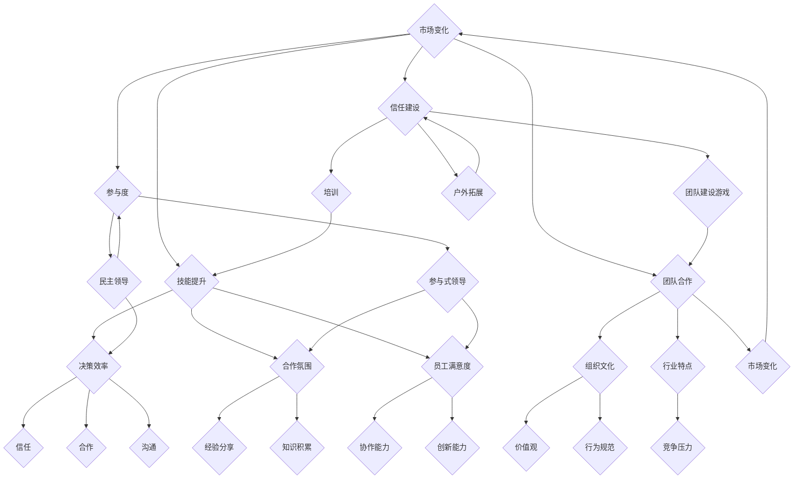
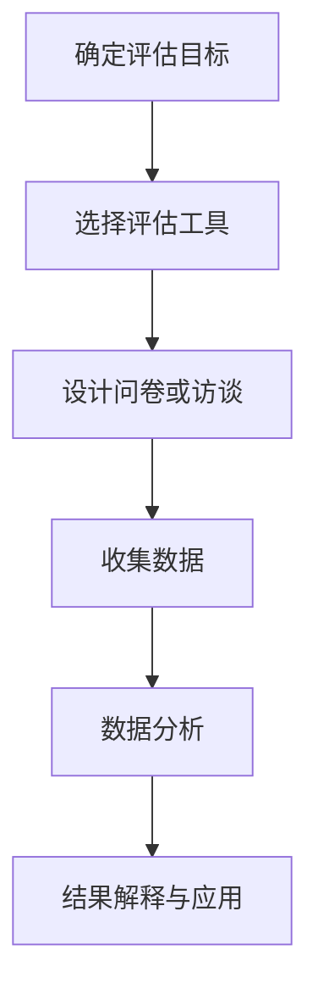
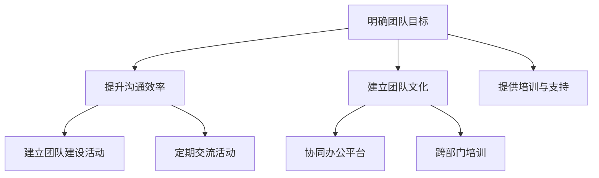
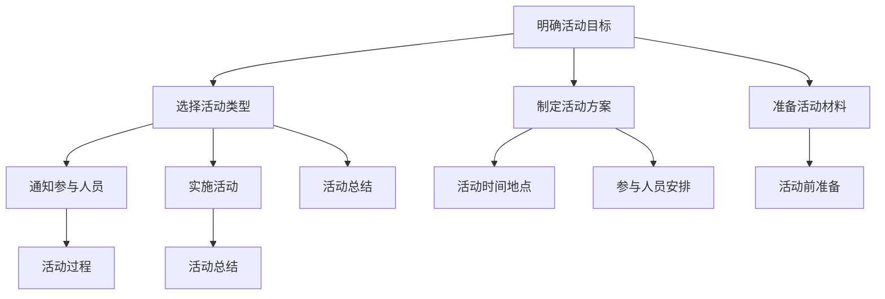

                 

## 《团队凝聚力建设：增强向心力的实践方案》

### 关键词：团队凝聚力，向心力，团队建设，实践方案，组织绩效

### 摘要：
本文旨在探讨团队凝聚力的重要性及其对组织绩效的影响，提供了一系列增强团队凝聚力的实践方案。通过对团队凝聚力理论的概述、测量与评估方法、增强团队凝聚力的策略、团队建设活动以及案例分析，本文系统地阐述了如何有效地提升团队向心力，从而促进组织绩效的提升。文章以逻辑清晰、结构紧凑、简单易懂的方式，为读者提供了一份全面且实用的团队凝聚力建设指南。

## 引言

在当今快速变化和竞争激烈的市场环境中，企业组织面临着前所未有的挑战。如何提高组织的竞争力，实现持续发展，成为企业管理者关注的焦点。而一个关键的因素是团队凝聚力。团队凝聚力不仅影响着团队内部的合作与沟通，还直接关系到组织绩效的优劣。因此，团队凝聚力建设成为企业管理中的重要任务。

本文将围绕团队凝聚力建设展开讨论，首先介绍团队凝聚力的基本概念和重要性，然后分析团队凝聚力的测量与评估方法，接着提供一系列增强团队凝聚力的实践方案，最后通过实际案例分析，探讨如何有效地提升团队向心力，促进组织绩效的提升。希望通过本文的探讨，为企业提供一份有价值的团队凝聚力建设指南。

## 团队凝聚力理论概述

### 团队凝聚力的重要性

团队凝聚力是指团队成员之间的相互吸引、互动和协作程度，反映了团队成员在团队中形成的一种共同意识和协作意愿。团队凝聚力的重要性不容忽视，主要体现在以下几个方面：

1. **提升团队效能**：高凝聚力的团队能更好地协调和合作，提高工作效率和效能。团队成员之间的信任和合作有助于减少冲突和误解，增强团队的整体战斗力。

2. **增强团队稳定性**：团队凝聚力有助于增强团队的稳定性，减少成员流动率。稳定的团队有利于企业减少培训和重新招聘的成本，提高员工的工作满意度和忠诚度。

3. **促进创新与学习**：团队凝聚力可以促进团队成员之间的知识共享和经验交流，激发创新思维和持续学习，从而推动组织的创新能力和竞争力。

4. **提升组织绩效**：高凝聚力的团队能更好地完成组织任务，提高组织绩效。团队凝聚力对组织绩效的影响已被大量研究所证实。

### 团队凝聚力的定义

团队凝聚力是一个多维度的概念，可以从多个角度进行定义和理解。以下是对团队凝聚力的一些定义：

1. **成员关系**：团队成员之间的相互吸引和互动，包括信任、支持、依赖等。

2. **共同目标**：团队成员对共同目标的认同和追求，包括目标明确、目标一致等。

3. **沟通与协作**：团队成员之间的有效沟通和协作能力，包括沟通技巧、协作机制等。

4. **组织文化**：团队成员对组织文化的认同和接受，包括价值观、行为规范等。

### 团队凝聚力的影响因素

团队凝聚力受多种因素的影响，主要包括以下几个方面：

1. **个人特征**：团队成员的个人特征，如个性、经验、技能等，对团队凝聚力有重要影响。具有相似背景和价值观的成员更容易形成高凝聚力团队。

2. **外部环境**：团队所处的环境，如组织文化、行业特点、市场变化等，对团队凝聚力有重要影响。一个支持性、开放、竞争激烈的生态环境有助于提升团队凝聚力。

3. **团队建设活动**：团队建设活动，如培训、团队建设游戏、户外拓展等，对团队凝聚力有显著影响。这些活动有助于增强团队成员之间的了解和信任，提升团队凝聚力。

4. **领导风格**：领导者的风格和态度对团队凝聚力有直接影响。民主、参与式的领导风格有助于提升团队凝聚力。

### 团队凝聚力与团队效能的关系

团队凝聚力与团队效能之间存在密切的关系。高凝聚力的团队往往表现出更高的效能，原因如下：

1. **更好的沟通**：团队凝聚力有助于增强团队成员之间的沟通和协作，减少误解和冲突，提高工作效率。

2. **更高的信任**：团队凝聚力增强团队成员之间的信任感，降低信息不对称，有助于形成协同效应。

3. **更好的团队合作**：团队凝聚力促进团队成员之间的合作，共同应对挑战，实现团队目标。

4. **更高的创新能力**：团队凝聚力有助于团队成员之间的知识共享和创新思维碰撞，提高团队的创新能力和竞争力。

### 团队凝聚力对组织绩效的影响

团队凝聚力不仅影响团队效能，还直接关系到组织绩效。以下从几个方面探讨团队凝聚力对组织绩效的影响：

1. **任务完成质量**：高凝聚力的团队能更高效地完成任务，提高任务完成质量。

2. **团队士气**：团队凝聚力有助于提升团队士气，增强员工的积极性和归属感，提高工作满意度。

3. **员工流失率**：高凝聚力的团队能有效降低员工流失率，减少企业成本。

4. **创新能力**：团队凝聚力促进团队成员之间的知识共享和合作，提高组织的创新能力和竞争力。

### Mermaid流程图：团队凝聚力影响因素关系图

以下是一个Mermaid流程图，展示了团队凝聚力的影响因素及其相互关系：

## 团队凝聚力的测量与评估

### 测量团队凝聚力的方法

测量团队凝聚力是团队建设的重要环节，通过科学的方法可以准确地了解团队凝聚力的现状，为后续的改进提供依据。以下介绍几种常用的测量团队凝聚力的方法：

1. **问卷法**：问卷法是一种简便有效的测量团队凝聚力的方法。问卷可以设计成结构化的问题，包括团队成员关系、共同目标、沟通与协作、组织文化等多个方面。通过收集团队成员的反馈，可以全面了解团队的凝聚力状况。

2. **访谈法**：访谈法是一种深入了解团队凝聚力的方法。通过面对面或在线访谈，可以与团队成员进行深入的交流，了解他们的感受、看法和建议。访谈法能够获得更细致、具体的信息，有助于发现团队凝聚力的具体问题。

3. **行为观察法**：行为观察法是通过观察团队成员在工作中的行为，评估团队凝聚力。这种方法适用于团队日常工作和活动中，可以观察到团队成员的互动、沟通、协作等行为，从而评估团队的凝聚力水平。

4. **绩效评估法**：绩效评估法是通过评估团队的工作绩效，间接了解团队的凝聚力。团队的工作绩效往往受到团队凝聚力的直接影响，通过分析团队的绩效数据，可以推断团队凝聚力的高低。

### 团队凝聚力的评估工具

为了更科学地测量团队凝聚力，可以使用一些专门的评估工具。以下介绍几种常用的团队凝聚力评估工具：

1. **L Liebermann团队凝聚力量表（TLCS）**：TLCS 是一种常用的团队凝聚力评估量表，包括信任、合作、沟通、共同目标等维度，具有较高的信度和效度。

2. **Latham团队凝聚力问卷（TCQ）**：TCQ 是一种结构化的问卷，涵盖团队凝聚力、团队效能、团队成员满意度等多个方面，适用于不同类型的团队。

3. **Parry团队凝聚力问卷（TPQ）**：TPQ 是一种多维度的团队凝聚力评估工具，包括团队互动、团队支持、团队目标、团队信任等维度，适用于企业组织。

4. **Mini-Majestic团队凝聚力量表（MMCS）**：MMCS 是一种简洁的团队凝聚力评估量表，包括信任、合作、沟通、目标一致性等维度，适用于快速评估团队凝聚力。

### 团队凝聚力评估流程

团队凝聚力评估通常包括以下步骤：

1. **确定评估目标**：明确评估的目的和范围，如团队凝聚力、团队效能等。

2. **设计评估工具**：根据评估目标，选择合适的评估工具，如问卷、访谈、观察等。

3. **实施评估**：按照评估工具的要求，实施评估过程，确保评估的公正性和有效性。

4. **数据分析**：对收集到的数据进行整理和分析，提取关键信息。

5. **结果解释与应用**：根据分析结果，对团队凝聚力进行评估和解释，制定改进措施。

### 团队凝聚力评估案例

以下是一个团队凝聚力评估的案例：

**案例背景**：某企业研发团队在项目推进过程中，发现团队成员之间的沟通不畅，合作不够默契，导致项目进度受阻。为了了解团队凝聚力的现状，团队领导决定进行一次团队凝聚力评估。

**评估工具**：选择Latham团队凝聚力问卷（TCQ）作为评估工具。

**评估过程**：

1. **设计问卷**：根据TCQ的框架，设计符合团队实际情况的问卷。

2. **实施问卷**：将问卷发送给团队成员，要求他们在规定时间内填写。

3. **数据分析**：对收集到的数据进行统计分析，提取关键信息。

4. **结果解释**：根据分析结果，发现团队在信任、合作、沟通等方面存在一定问题，导致团队凝聚力较低。

5. **改进措施**：制定改进计划，包括加强团队建设活动、提升沟通技巧、明确共同目标等。

通过这次评估，团队领导对团队凝聚力的现状有了更清晰的认识，为后续的改进提供了有力支持。

### Mermaid流程图：团队凝聚力测量方法流程图

以下是一个Mermaid流程图，展示了团队凝聚力测量方法的流程：

## 增强团队凝聚力策略

### 管理策略

管理策略是增强团队凝聚力的重要手段，以下介绍几种常用的管理策略：

1. **明确团队目标**：明确团队目标是增强团队凝聚力的关键。团队目标应具有明确性、可行性和激励性，能够激发团队成员的积极性。通过共同的目标，团队成员能够形成合力，共同推进项目进展。

2. **提升沟通效率**：沟通是团队凝聚力的基石。管理者应注重提升团队的沟通效率，建立畅通的沟通渠道，确保信息传递准确、及时。同时，鼓励团队成员之间的开放性沟通，促进相互理解和信任。

3. **建立团队文化**：团队文化是团队凝聚力的重要体现。管理者应积极营造积极向上、和谐融洽的团队文化，让团队成员在共同的文化价值观下工作，增强团队的归属感和认同感。

4. **提供培训与支持**：培训与支持是提升团队成员能力的重要手段。管理者应定期组织培训，提高团队成员的专业技能和综合素质，为团队提供必要的资源和支持，帮助团队成员克服工作中的困难。

### 培训与发展

培训与发展是增强团队凝聚力的重要途径，以下介绍几种常见的培训与发展方法：

1. **团队建设培训**：团队建设培训旨在提升团队成员的团队协作能力和沟通技巧。通过角色扮演、小组讨论、案例分析等方式，帮助团队成员更好地理解团队协作的重要性，提高团队整体协作水平。

2. **领导力培训**：领导力培训旨在提升团队领导者的领导能力和管理技巧。通过培训，领导者能够更好地理解团队需求，提升领导力，从而增强团队凝聚力。

3. **专业技能培训**：专业技能培训旨在提升团队成员的专业技能和业务水平。通过培训，团队成员能够更好地完成工作任务，提高工作效率，增强团队的整体实力。

4. **心理辅导与支持**：心理辅导与支持旨在帮助团队成员解决心理问题，提高心理健康水平。通过心理辅导，团队成员能够更好地应对工作压力，增强心理韧性，提高团队凝聚力。

### 内部沟通

内部沟通是团队凝聚力的关键因素，以下介绍几种有效的内部沟通方法：

1. **定期会议**：定期会议是团队内部沟通的重要形式。通过定期会议，团队成员能够及时了解团队动态、项目进展和团队成员的需求，促进信息共享和协作。

2. **团队讨论**：团队讨论是团队成员之间深入交流的重要方式。通过团队讨论，团队成员能够共同探讨问题、分析解决方案，提高团队协作水平。

3. **在线沟通工具**：在线沟通工具如即时通讯软件、视频会议系统等，能够方便团队成员之间的实时沟通和协作。通过在线沟通工具，团队成员可以随时交流，提高沟通效率。

4. **意见反馈机制**：建立意见反馈机制，鼓励团队成员提出意见和建议，促进团队内部信息的透明和开放。通过意见反馈，团队成员能够更好地理解团队需求，提高团队凝聚力。

### 跨部门合作

跨部门合作是提升团队凝聚力的重要手段，以下介绍几种有效的跨部门合作方法：

1. **跨部门项目**：通过跨部门项目，促进不同部门之间的合作和交流。在项目过程中，团队成员需要相互协调、共同完成任务，提高团队协作能力。

2. **定期交流活动**：定期举办跨部门交流活动，如部门联谊、经验分享会等，增进不同部门之间的了解和信任，提高团队凝聚力。

3. **协同办公平台**：建立协同办公平台，如项目管理软件、协作工具等，方便不同部门之间的信息共享和协作，提高工作效率。

4. **跨部门培训**：组织跨部门培训，提高团队成员的多部门综合能力，增强团队协作意识。

### 实践案例

以下是一个增强团队凝聚力的实践案例：

**案例背景**：某企业市场部和技术部在项目合作中，由于部门之间的沟通不畅和协作不力，导致项目进度严重滞后。为了提升团队凝聚力，企业决定采取一系列措施进行团队建设。

**实施策略**：

1. **明确团队目标**：企业明确了项目目标，并通过团队会议传达给全体成员，确保团队成员对项目目标有清晰的认识。

2. **提升沟通效率**：企业建立了定期的项目进度会议，确保各部门能够及时沟通项目进展和需求，减少信息传递的滞后。

3. **建立团队文化**：企业通过组织团队建设活动，如户外拓展、部门联谊等，增强团队成员之间的互动和了解，营造和谐融洽的团队氛围。

4. **提供培训与支持**：企业为市场部和技术部提供了跨部门培训，提高团队成员的专业技能和协作能力。

5. **跨部门合作**：企业通过跨部门项目，促进市场部和技术部之间的合作和交流，提高团队整体协作水平。

**实施效果**：

通过以上措施，市场部和技术部之间的沟通不畅和协作不力问题得到了明显改善，项目进度得到了有效推进，团队凝聚力得到了显著提升。团队成员之间的信任感和协作意愿增强，项目成功完成，取得了良好的业绩。

### Mermaid流程图：增强团队凝聚力策略流程图

以下是一个Mermaid流程图，展示了增强团队凝聚力的策略流程：

## 团队建设活动

### 团队建设活动的类型

团队建设活动是增强团队凝聚力的重要手段，根据活动的内容和形式，可以分为以下几种类型：

1. **户外拓展**：户外拓展活动是一种以户外自然景观为背景，通过一系列挑战性任务和团队协作游戏，增强团队成员之间信任、沟通和协作能力的活动。常见的户外拓展活动有高空断桥、攀岩、定向越野等。

2. **团队培训**：团队培训活动旨在提升团队成员的专业技能和团队协作能力。培训内容包括领导力培训、沟通技巧培训、团队协作技巧培训等。通过培训，团队成员能够更好地理解团队协作的重要性，提高团队协作能力。

3. **团队游戏**：团队游戏活动是一种以游戏为载体，通过团队合作完成任务的活动。常见的团队游戏有团队拼图、团队接力赛、团队寻宝等。团队游戏活动能够激发团队成员的积极性，增强团队凝聚力。

4. **主题晚会**：主题晚会是一种以团队娱乐为主题的活动，通过文艺表演、游戏互动等形式，增强团队成员之间的互动和沟通。常见的主题有“欢庆新年”、“庆祝团队胜利”等。

5. **座谈会**：座谈会是一种以团队成员之间交流、分享为主要内容的团队建设活动。座谈会可以邀请外部专家进行讲座，也可以由团队成员自由发言，分享工作经验和心得体会。座谈会有助于增强团队成员之间的了解和信任。

### 团队建设活动的组织与实施

为了确保团队建设活动的有效实施，需要遵循以下步骤：

1. **明确活动目标**：在组织团队建设活动前，首先要明确活动的目标，如增强团队凝聚力、提升团队协作能力、激发创新思维等。

2. **选择活动类型**：根据活动目标，选择适合的团队建设活动类型。不同的活动类型具有不同的特点和作用，需要根据实际情况进行选择。

3. **制定活动方案**：制定详细的活动方案，包括活动的时间、地点、内容、流程、参与人员等。活动方案应充分考虑团队成员的需求和实际情况，确保活动的顺利进行。

4. **准备活动材料**：根据活动方案，准备必要的活动材料，如活动道具、场地布置、培训资料等。

5. **通知参与人员**：提前通知参与人员，确保他们能够按时参加活动。通知应包括活动的时间、地点、内容、注意事项等。

6. **实施活动**：按照活动方案，有序实施活动。活动中，组织者应密切关注活动进展，确保活动顺利进行。

7. **活动总结**：活动结束后，进行活动总结，收集团队成员的反馈和建议，总结活动经验教训，为后续的团队建设活动提供参考。

### 团队建设活动的效果评估

团队建设活动的效果评估是衡量活动成效的重要环节，以下介绍几种常用的效果评估方法：

1. **问卷调查**：通过问卷调查，收集团队成员对活动的满意度和活动效果的反馈。问卷可以设计成结构化的问题，包括活动内容、活动组织、活动效果等方面。

2. **访谈法**：通过面对面或在线访谈，深入了解团队成员对活动的感受和看法。访谈法可以获得更细致、具体的信息，有助于发现团队建设活动的优势和不足。

3. **行为观察法**：通过观察团队成员在活动中的行为，评估团队建设活动的效果。行为观察法适用于评估团队协作能力、沟通技巧等方面的提升。

4. **绩效评估**：通过评估团队在活动后的工作绩效，间接了解团队建设活动的效果。如果团队在活动后能够更高效地完成任务，提高工作质量，可以认为团队建设活动取得了较好的效果。

### 团队建设活动的注意事项

在组织团队建设活动时，需要注意以下事项：

1. **目标明确**：确保团队建设活动的目标明确、具体，能够激发团队成员的积极参与。

2. **内容丰富**：活动内容应丰富多样，符合团队成员的兴趣和需求，提高活动吸引力。

3. **组织有序**：活动组织应有序进行，确保活动顺利进行，减少不必要的干扰和冲突。

4. **反馈及时**：活动结束后，及时收集团队成员的反馈和建议，总结活动经验教训，为后续活动提供参考。

5. **持续关注**：团队建设活动不是一次性的，需要持续关注团队凝聚力的提升，不断优化团队建设活动的内容和形式。

### 实践案例

以下是一个团队建设活动的实践案例：

**案例背景**：某企业研发团队在项目推进过程中，发现团队成员之间的沟通不畅，合作不够默契，导致项目进度受阻。为了提升团队凝聚力，企业决定组织一次户外拓展活动。

**活动类型**：户外拓展活动

**活动方案**：

1. **活动目标**：增强团队凝聚力、提升团队协作能力、改善团队沟通。

2. **活动内容**：高空断桥、攀岩、定向越野。

3. **活动时间**：周末两天

4. **活动地点**：某户外拓展基地

5. **参与人员**：研发团队成员及领导

**活动实施**：

1. **活动前的准备**：企业提前与户外拓展基地联系，确认活动场地和活动安排。同时，为团队成员准备拓展器材和活动道具。

2. **活动过程**：活动开始后，团队成员按照活动安排，逐一完成高空断桥、攀岩和定向越野等任务。在活动中，团队成员需要密切协作，共同完成任务，提高团队协作能力。

3. **活动总结**：活动结束后，团队成员进行了总结，分享了在活动中的感受和体会。通过总结，团队成员更加了解彼此，增强了团队凝聚力。

**活动效果**：

通过这次户外拓展活动，研发团队的沟通和协作能力得到了显著提升，项目进度得到了有效推进。团队成员之间的信任感和归属感增强，团队凝聚力得到了明显提升。

### Mermaid流程图：团队建设活动流程图

以下是一个Mermaid流程图，展示了团队建设活动的流程：

## 案例分析一

### 案例背景

某企业市场部在项目实施过程中，发现团队成员之间缺乏有效的沟通和协作，导致项目进度严重滞后。为了提升团队凝聚力，企业决定进行一次深入的团队建设活动，以增强团队成员之间的信任和协作能力。

### 实施策略

1. **明确团队目标**：首先，企业明确了团队目标，即通过团队建设活动，提升团队成员之间的信任和协作能力，确保项目能够按计划顺利进行。

2. **选择合适的团队建设活动**：企业选择了“信任背摔”这一具有挑战性和互动性的团队建设活动。该活动要求团队成员站在高台上，在队友的支撑下向后倒下，体验信任和协作的力量。

3. **制定详细的实施方案**：企业制定了详细的实施方案，包括活动的时间、地点、参与人员、活动流程等。同时，为活动准备必要的设备和安全措施。

4. **组织活动前的动员**：在活动前，企业进行了动员，向团队成员详细介绍了活动的内容、目的和注意事项，确保团队成员充分了解活动并积极参与。

### 实施过程

1. **活动前的准备**：企业为活动准备了活动场地、拓展设备、安全措施等，并邀请了专业的拓展教练进行指导。

2. **活动过程**：在活动中，团队成员逐一完成了信任背摔任务。每个团队成员在倒下时，都感受到了队友的支撑和信任，这一过程不仅增强了团队成员之间的信任感，还提升了团队的协作能力。

3. **活动总结**：活动结束后，团队成员进行了总结，分享了在活动中的感受和体会。通过总结，团队成员更加了解彼此，增强了团队凝聚力。

### 案例结果

通过这次团队建设活动，市场部的团队成员之间的信任和协作能力得到了显著提升。团队成员在项目实施过程中，能够更加有效地沟通和协作，项目进度得到了有效推进。此外，团队成员的积极性和满意度也得到提高，团队凝聚力得到了明显增强。

### 反思与建议

1. **活动前应充分了解团队成员的需求和特点**：在组织团队建设活动前，应充分了解团队成员的需求和特点，选择适合的团队建设活动，确保活动的针对性和有效性。

2. **注重活动过程中的安全与保障**：在团队建设活动中，应注重活动过程中的安全与保障，确保活动的顺利进行。

3. **活动后应进行及时的总结和反馈**：活动结束后，应进行及时的总结和反馈，收集团队成员的意见和建议，为后续的团队建设活动提供参考。

## 案例分析二

### 案例背景

某企业研发部门在项目实施过程中，由于团队成员之间缺乏有效的沟通和协作，导致项目进度严重滞后，项目质量也受到一定影响。为了提升团队凝聚力，企业决定进行一系列的团队建设活动，以增强团队成员之间的信任和协作能力。

### 实施策略

1. **明确团队目标**：企业明确了团队目标，即通过团队建设活动，提升团队成员之间的信任和协作能力，确保项目能够按计划顺利进行，并达到预期的质量标准。

2. **设计多样化的团队建设活动**：企业设计了包括团队拓展训练、团队协作游戏和主题晚会在内的多样化团队建设活动，以满足不同团队成员的需求，提升团队的凝聚力。

3. **制定详细的实施方案**：企业制定了详细的实施方案，包括活动的时间、地点、内容、参与人员等，确保每个活动环节都有序进行。

4. **组织活动前的动员**：在活动前，企业进行了动员，向团队成员详细介绍了活动的内容、目的和注意事项，确保团队成员充分了解活动并积极参与。

### 实施过程

1. **团队拓展训练**：企业组织了为期一天的团队拓展训练，包括高空断桥、攀岩、信任背摔等挑战性任务。这些任务要求团队成员密切协作，共同克服困难，增强了团队成员之间的信任和团队协作能力。

2. **团队协作游戏**：企业组织了一系列的团队协作游戏，如“团队拼图”、“团队接力赛”等，通过这些游戏，团队成员在轻松愉快的氛围中加深了相互了解，提升了团队协作能力。

3. **主题晚会**：企业举办了一场主题晚会，团队成员通过文艺表演、互动游戏等形式，增进了彼此的感情，增强了团队的凝聚力。

4. **活动总结**：活动结束后，企业组织了总结会议，团队成员分享了在活动中的感受和体会，对团队建设活动的效果进行了评估。

### 案例结果

通过这一系列的团队建设活动，研发部门的团队成员之间的信任和协作能力得到了显著提升。团队成员在项目实施过程中，能够更加有效地沟通和协作，项目进度得到了有效推进，项目质量也得到了显著提高。此外，团队成员的积极性和满意度也得到了提升，团队凝聚力得到了明显增强。

### 反思与建议

1. **活动前应充分了解团队成员的需求和特点**：在组织团队建设活动前，应充分了解团队成员的需求和特点，设计适合的团队建设活动，确保活动的针对性和有效性。

2. **注重活动过程中的安全与保障**：在团队建设活动中，应注重活动过程中的安全与保障，确保活动的顺利进行。

3. **活动后应进行及时的总结和反馈**：活动结束后，应进行及时的总结和反馈，收集团队成员的意见和建议，为后续的团队建设活动提供参考。

4. **持续关注团队凝聚力的提升**：团队建设活动不是一次性的，企业应持续关注团队凝聚力的提升，通过定期的活动和培训，不断巩固和增强团队凝聚力。

## 团队凝聚力与组织绩效

### 团队凝聚力对组织绩效的影响

团队凝聚力对组织绩效有着重要的影响。高凝聚力的团队能够更高效地完成工作任务，提高组织绩效。以下从几个方面探讨团队凝聚力对组织绩效的影响：

1. **工作效率**：高凝聚力的团队能够更好地协调和合作，减少工作过程中的摩擦和误解，提高工作效率。团队成员之间能够高效地共享信息和资源，快速响应工作需求，从而提高组织整体的工作效率。

2. **任务完成质量**：高凝聚力的团队能够更好地执行任务，确保任务完成质量。团队成员之间的相互信任和协作能力有助于减少错误和缺陷，提高工作的准确性和可靠性，从而提高任务完成质量。

3. **创新能力**：团队凝聚力有助于团队成员之间的知识共享和创新思维碰撞，激发创新能力和创新思维。团队成员在相互交流和合作的过程中，能够发现新的问题和解决方案，推动组织的创新和发展。

4. **团队士气**：高凝聚力的团队能够提高团队成员的工作满意度和归属感，增强团队士气。团队成员之间相互支持、相互鼓励，能够减轻工作压力，提高工作积极性，从而提高团队的士气和战斗力。

5. **员工流失率**：团队凝聚力有助于降低员工流失率。高凝聚力的团队能够增强员工的归属感和忠诚度，减少员工因个人原因离职的情况，从而降低企业的培训成本和招聘成本。

### 提高组织绩效的团队凝聚力策略

为了提高组织绩效，企业可以采取以下策略来增强团队凝聚力：

1. **明确团队目标**：明确团队目标是增强团队凝聚力的重要手段。企业应确保团队成员对团队目标有清晰的认识，并通过共同的目标激发团队成员的积极性和协作意愿。

2. **加强内部沟通**：有效的内部沟通是增强团队凝聚力的关键。企业应建立畅通的沟通渠道，鼓励团队成员之间的开放性沟通，确保信息传递准确、及时，减少误解和冲突。

3. **建立团队文化**：团队文化是团队凝聚力的基石。企业应积极营造积极向上、和谐融洽的团队文化，让团队成员在共同的文化价值观下工作，增强团队的归属感和认同感。

4. **提供培训与支持**：培训与支持是提升团队成员能力的重要手段。企业应定期组织培训，提高团队成员的专业技能和综合素质，为团队提供必要的资源和支持，帮助团队成员克服工作中的困难。

5. **组织团队建设活动**：团队建设活动是增强团队凝聚力的重要方式。企业可以定期组织各种形式的团队建设活动，如户外拓展、团队培训、团队游戏等，增强团队成员之间的了解和信任。

6. **激发创新思维**：创新思维是提高组织绩效的重要动力。企业应鼓励团队成员进行创新思维训练，提供创新支持，营造创新氛围，激发团队成员的创新潜力。

7. **关注员工心理健康**：员工心理健康是团队凝聚力的重要保障。企业应关注员工的心理健康，提供心理辅导和支持，帮助员工缓解工作压力，提高工作满意度和归属感。

### 实践案例

以下是一个企业通过增强团队凝聚力提高组织绩效的实践案例：

**案例背景**：某企业研发部门在项目实施过程中，发现团队成员之间的沟通不畅，合作不够默契，导致项目进度严重滞后，项目质量也受到一定影响。为了提高组织绩效，企业决定采取一系列措施来增强团队凝聚力。

**实施策略**：

1. **明确团队目标**：企业明确了项目目标，并通过团队会议传达给全体成员，确保团队成员对项目目标有清晰的认识。

2. **加强内部沟通**：企业建立了定期的项目进度会议，确保团队成员能够及时沟通项目进展和需求，减少信息传递的滞后。

3. **建立团队文化**：企业通过组织团队建设活动，如团队拓展训练和团队游戏，增强团队成员之间的信任和协作能力。

4. **提供培训与支持**：企业为研发团队成员提供了专业的技术培训和管理培训，提高团队成员的专业技能和综合素质。

5. **激发创新思维**：企业鼓励团队成员进行创新思维训练，提供创新支持，营造创新氛围。

**实施效果**：

通过以上措施，研发部门的团队成员之间的沟通和协作能力得到了显著提升，项目进度得到了有效推进，项目质量也得到了显著提高。团队成员的积极性和满意度也得到提高，团队凝聚力得到了明显增强。企业整体组织绩效得到了提升，项目成功完成，取得了良好的业绩。

### 总结

团队凝聚力是提高组织绩效的关键因素之一。通过明确团队目标、加强内部沟通、建立团队文化、提供培训与支持、组织团队建设活动、激发创新思维等策略，企业可以有效地增强团队凝聚力，提高组织绩效。企业应根据自身情况，制定合适的团队凝聚力建设策略，持续关注和提升团队凝聚力，以实现组织的持续发展和竞争优势。

## 结论与未来展望

### 全书总结

本文围绕团队凝聚力建设展开讨论，从理论概述、测量与评估方法、增强团队凝聚力的策略、团队建设活动以及案例分析等多个方面，系统地阐述了如何有效地提升团队凝聚力，从而促进组织绩效的提升。通过本文的探讨，读者可以了解到团队凝聚力的重要性、影响因素、测量与评估方法、增强策略以及实际应用，为企业在团队凝聚力建设方面提供了有价值的参考。

### 团队凝聚力建设的发展方向

1. **数字化管理**：随着数字化技术的不断发展，团队凝聚力建设也将逐渐向数字化管理转变。利用大数据、人工智能等技术，企业可以更精准地了解团队凝聚力的现状，制定更科学的团队建设策略。

2. **个性化培训**：未来团队凝聚力建设将更加注重个性化培训，根据团队成员的特点和需求，制定个性化的培训计划，提高培训的针对性和有效性。

3. **跨文化团队建设**：随着全球化进程的加快，企业面临的团队将更加多元化，跨文化团队建设将成为团队凝聚力建设的重要方向。通过加强跨文化沟通与协作，提高跨文化团队的凝聚力和协同效应。

4. **心理辅导与支持**：未来团队凝聚力建设将更加关注团队成员的心理健康，提供心理辅导与支持，帮助团队成员缓解工作压力，提高工作满意度和归属感。

### 对读者的建议

1. **实践与反思**：在团队凝聚力建设过程中，读者应注重实践与反思，通过实际操作和反馈，不断优化团队建设策略。

2. **持续学习**：团队凝聚力建设是一个持续的过程，读者应保持学习的态度，不断更新知识和技能，以适应不断变化的工作环境和团队需求。

3. **借鉴经验**：通过本文的案例分析，读者可以借鉴成功经验，结合自身实际情况，制定适合的团队建设策略。

4. **创新思维**：鼓励读者在团队凝聚力建设过程中，发挥创新思维，探索新的方法和工具，提高团队凝聚力和组织绩效。

### 拓展阅读

- **《团队建设与管理艺术》**：作者通过丰富的案例和实践经验，深入探讨了团队建设与管理的方法和技巧。
- **《团队凝聚力：从理论到实践》**：本书系统介绍了团队凝聚力的理论体系，并结合实际案例，提供了实用的团队建设策略。
- **《跨文化团队沟通与协作》**：本书针对全球化背景下的跨文化团队，提供了有效的沟通与协作方法。

作者：AI天才研究院/AI Genius Institute & 禅与计算机程序设计艺术 /Zen And The Art of Computer Programming。

