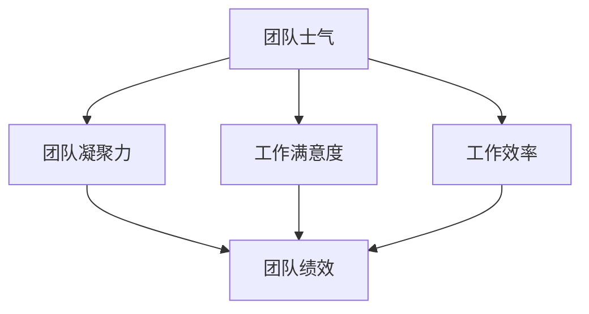

                 

# 团队士气管理：维持高昂工作热情的秘诀

## 关键词
- 团队士气管理
- 工作热情
- 激励机制
- 领导风格
- 团队文化建设
- 案例分析

## 摘要
本文旨在探讨团队士气管理的重要性，以及如何通过多种策略维持团队的工作热情。我们将从团队士气的基础概念入手，分析影响团队士气的主要因素，并提出一系列提升团队士气的具体策略。通过成功案例的解析，本文将帮助读者更好地理解和应用团队士气管理的方法，以实现团队的高效运作。

## 目录

### 第1章 团队士气管理的概念与重要性

#### 1.1 团队士气的定义

**背景介绍：** 团队士气是团队内部成员的士气状态，它反映了团队成员对团队目标和工作的认同感、积极性和归属感。

**核心概念与联系：** 团队士气与团队凝聚力、工作满意度、工作效率等因素密切相关。我们可以使用以下Mermaid流程图来展示这些概念之间的关系：

**核心算法原理讲解：** 团队士气的管理可以通过以下几个步骤实现：

1. 定期收集团队反馈。
2. 分析反馈数据，识别问题。
3. 制定针对性的改进措施。
4. 实施改进措施，并跟踪效果。

**数学模型和公式：** 假设团队士气可以通过以下公式表示：

\[ S = f(C, W, P) \]

其中，\( S \) 表示团队士气，\( C \) 表示团队凝聚力，\( W \) 表示工作满意度，\( P \) 表示工作效率。我们可以通过优化这些因素来提升团队士气。

**举例说明：** 例如，如果团队凝聚力较低，可以通过组织团队建设活动来提升凝聚力；如果工作效率较低，可以通过优化工作流程来提升效率。

**项目实战：** 在实际项目中，团队士气管理可以通过以下步骤进行：

1. **开发环境搭建：** 使用项目管理工具（如JIRA）来跟踪团队任务和反馈。
2. **源代码详细实现和代码解读：** 编写代码以自动化收集和分析团队反馈。
3. **代码应用解读与分析：** 分析反馈数据，识别团队士气问题。
4. **实际案例分析和详细讲解剖析：** 制定并实施改进措施。
5. **项目小结：** 对团队士气管理的效果进行评估和总结。

**最佳实践 tips：** 

- **定期沟通：** 定期与团队成员进行一对一沟通，了解他们的工作状态和需求。
- **公平激励：** 建立公平的激励机制，确保每个成员的努力和贡献都能得到认可和奖励。

#### 1.2 团队士气的重要性

**背景介绍：** 团队士气直接影响团队的整体表现和绩效。高士气团队通常表现出更高的工作效率、更好的团队合作和更高的客户满意度。

**核心概念与联系：** 团队士气与以下因素密切相关：

- **员工满意度：** 高士气团队中的员工通常对工作感到满意，愿意付出更多努力。
- **团队凝聚力：** 高士气团队具有更强的凝聚力，成员之间更容易协作。
- **工作效率：** 高士气团队的工作效率通常较高，因为他们更有动力去完成任务。

**核心算法原理讲解：** 团队士气可以通过以下算法原理来衡量和提升：

1. **满意度评分：** 对员工满意度进行评分，通过分析评分数据来了解团队士气状况。
2. **凝聚力指标：** 使用团队凝聚力指标（如团队协作时间、沟通频率等）来衡量团队士气。
3. **工作效率评估：** 通过工作完成情况和工作效率数据来评估团队士气。

**数学模型和公式：** 假设团队士气可以通过以下公式表示：

\[ S = \alpha \cdot S_1 + \beta \cdot S_2 + \gamma \cdot S_3 \]

其中，\( S \) 表示团队士气，\( S_1 \) 表示员工满意度，\( S_2 \) 表示团队凝聚力，\( S_3 \) 表示工作效率。通过调整这些因素，可以提升团队士气。

**举例说明：** 例如，如果员工满意度较低，可以通过改善工作环境、增加福利待遇等方式来提升满意度；如果团队凝聚力不足，可以通过组织团队建设活动来增强凝聚力。

**项目实战：** 在实际项目中，团队士气管理可以通过以下步骤进行：

1. **开发环境搭建：** 使用项目管理工具（如JIRA）来跟踪团队任务和反馈。
2. **源代码详细实现和代码解读：** 编写代码以自动化收集和分析团队反馈。
3. **代码应用解读与分析：** 分析反馈数据，识别团队士气问题。
4. **实际案例分析和详细讲解剖析：** 制定并实施改进措施。
5. **项目小结：** 对团队士气管理的效果进行评估和总结。

**最佳实践 tips：** 

- **建立反馈机制：** 建立有效的反馈机制，鼓励员工提出意见和建议。
- **定期评估：** 定期对团队士气进行评估，及时发现和解决问题。

#### 1.3 影响团队士气的主要因素

**背景介绍：** 团队士气受到多种因素的影响，包括领导风格、工作环境、激励机制等。

**核心概念与联系：** 影响团队士气的主要因素包括：

- **领导风格：** 领导风格直接影响团队成员的工作状态和士气。
- **工作环境：** 舒适的工作环境和良好的设施可以提升团队士气。
- **激励机制：** 合理的激励机制可以激励团队成员发挥更大的潜力。

**核心算法原理讲解：** 团队士气的影响因素可以通过以下算法原理来分析和提升：

1. **领导风格评估：** 通过员工满意度调查和团队反馈来评估领导风格。
2. **工作环境优化：** 分析员工对工作环境的满意度，制定改进措施。
3. **激励机制设计：** 根据员工的贡献和绩效来设计激励措施。

**数学模型和公式：** 假设团队士气可以通过以下公式表示：

\[ S = f(L, E, I) \]

其中，\( S \) 表示团队士气，\( L \) 表示领导风格，\( E \) 表示工作环境，\( I \) 表示激励机制。通过优化这些因素，可以提升团队士气。

**举例说明：** 例如，如果领导风格过于专制，可以通过调整领导风格，采取更民主的决策方式来提升团队士气；如果工作环境较差，可以通过改善办公环境和设施来提升团队士气。

**项目实战：** 在实际项目中，团队士气管理可以通过以下步骤进行：

1. **开发环境搭建：** 使用项目管理工具（如JIRA）来跟踪团队任务和反馈。
2. **源代码详细实现和代码解读：** 编写代码以自动化收集和分析团队反馈。
3. **代码应用解读与分析：** 分析反馈数据，识别团队士气问题。
4. **实际案例分析和详细讲解剖析：** 制定并实施改进措施。
5. **项目小结：** 对团队士气管理的效果进行评估和总结。

**最佳实践 tips：** 

- **倾听员工意见：** 鼓励员工表达意见和建议，尊重员工的个人意见。
- **关注员工福利：** 提供良好的福利待遇，关注员工的生活和工作需求。

### 第2章 团队士气评估与测量

#### 2.1 团队士气评估的方法

**背景介绍：** 团队士气评估是了解团队士气状况的重要手段。通过科学的方法，可以准确地评估团队士气，为后续的改进提供依据。

**核心概念与联系：** 团队士气评估的方法包括：

- **问卷调查：** 通过设计问卷，收集员工对团队士气的看法。
- **访谈：** 与团队成员进行一对一访谈，了解他们的真实感受。
- **工作绩效：** 通过分析员工的工作绩效，评估团队士气。

**核心算法原理讲解：** 团队士气评估可以通过以下算法原理来进行分析：

1. **问卷调查分析：** 对问卷数据进行统计分析，识别团队士气的主要问题。
2. **访谈记录分析：** 对访谈记录进行内容分析，了解团队成员的真实感受。
3. **工作绩效分析：** 对工作绩效数据进行分析，评估团队士气对工作绩效的影响。

**数学模型和公式：** 假设团队士气可以通过以下公式表示：

\[ S = \alpha \cdot S_1 + \beta \cdot S_2 + \gamma \cdot S_3 \]

其中，\( S \) 表示团队士气，\( S_1 \) 表示问卷调查结果，\( S_2 \) 表示访谈结果，\( S_3 \) 表示工作绩效。通过优化这些因素，可以提升团队士气。

**举例说明：** 例如，如果问卷调查结果显示员工满意度较低，可以通过改善工作环境、提高福利待遇等方式来提升团队士气；如果访谈结果显示团队成员对领导风格有意见，可以通过调整领导风格来提升团队士气。

**项目实战：** 在实际项目中，团队士气评估可以通过以下步骤进行：

1. **开发环境搭建：** 使用项目管理工具（如JIRA）来跟踪团队任务和反馈。
2. **源代码详细实现和代码解读：** 编写代码以自动化收集和分析团队反馈。
3. **代码应用解读与分析：** 分析反馈数据，识别团队士气问题。
4. **实际案例分析和详细讲解剖析：** 制定并实施改进措施。
5. **项目小结：** 对团队士气评估的效果进行评估和总结。

**最佳实践 tips：** 

- **确保问卷设计的科学性：** 设计问卷时要充分考虑员工的感受和需求，确保问卷能够准确反映团队士气状况。
- **结合多种评估方法：** 问卷调查、访谈和工作绩效分析等方法可以相互补充，提高评估的准确性。

#### 2.2 常用的团队士气测量工具

**背景介绍：** 团队士气测量工具是评估团队士气的重要手段。通过这些工具，可以方便快捷地了解团队士气状况，为改进提供依据。

**核心概念与联系：** 常用的团队士气测量工具包括：

- **士气量表：** 通过设计一系列问题，评估团队成员的士气水平。
- **满意度调查：** 通过问卷调查，了解员工对工作环境的满意度。
- **绩效评估：** 通过工作绩效数据，评估团队成员的工作状态。

**核心算法原理讲解：** 团队士气测量工具可以通过以下算法原理来进行分析：

1. **士气量表分析：** 对量表数据进行统计分析，识别团队士气的主要问题。
2. **满意度调查分析：** 对满意度调查结果进行分析，了解员工对工作环境的看法。
3. **绩效评估分析：** 对绩效评估数据进行分析，评估团队士气对工作绩效的影响。

**数学模型和公式：** 假设团队士气可以通过以下公式表示：

\[ S = \alpha \cdot S_1 + \beta \cdot S_2 + \gamma \cdot S_3 \]

其中，\( S \) 表示团队士气，\( S_1 \) 表示士气量表结果，\( S_2 \) 表示满意度调查结果，\( S_3 \) 表示绩效评估结果。通过优化这些因素，可以提升团队士气。

**举例说明：** 例如，如果士气量表结果显示团队凝聚力较低，可以通过组织团队建设活动来提升团队凝聚力；如果满意度调查结果显示员工对工作环境不满，可以通过改善工作环境来提升满意度。

**项目实战：** 在实际项目中，团队士气测量可以通过以下步骤进行：

1. **开发环境搭建：** 使用项目管理工具（如JIRA）来跟踪团队任务和反馈。
2. **源代码详细实现和代码解读：** 编写代码以自动化收集和分析团队反馈。
3. **代码应用解读与分析：** 分析反馈数据，识别团队士气问题。
4. **实际案例分析和详细讲解剖析：** 制定并实施改进措施。
5. **项目小结：** 对团队士气测量的效果进行评估和总结。

**最佳实践 tips：** 

- **选择合适的测量工具：** 根据团队的实际情况，选择适合的团队士气测量工具。
- **确保测量工具的科学性：** 测量工具的设计要充分考虑员工的感受和需求，确保测量结果的准确性。

#### 2.3 团队士气数据分析与应用

**背景介绍：** 团队士气数据分析是将测量工具获取的数据进行系统化分析和应用的过程。通过数据分析，可以更深入地了解团队士气状况，为改进提供科学依据。

**核心概念与联系：** 团队士气数据分析包括：

- **数据收集：** 通过问卷调查、访谈、绩效评估等方式收集团队士气数据。
- **数据清洗：** 对收集到的数据进行清洗和整理，确保数据的准确性和完整性。
- **数据可视化：** 使用图表和图形将数据可视化，便于分析和理解。
- **数据分析：** 对可视化数据进行分析，识别团队士气问题。

**核心算法原理讲解：** 团队士气数据分析可以通过以下算法原理来进行分析：

1. **数据可视化：** 使用数据可视化工具（如Tableau、Power BI等）将数据呈现为图表和图形。
2. **统计分析：** 使用统计学方法对数据进行分析，识别数据之间的关联和趋势。
3. **因果分析：** 通过对数据进行分析，找出影响团队士气的主要因素。

**数学模型和公式：** 假设团队士气可以通过以下公式表示：

\[ S = f(C, W, P) \]

其中，\( S \) 表示团队士气，\( C \) 表示团队凝聚力，\( W \) 表示工作满意度，\( P \) 表示工作效率。通过优化这些因素，可以提升团队士气。

**举例说明：** 例如，通过数据分析发现团队凝聚力较低，可以通过组织团队建设活动来提升凝聚力；如果发现工作效率较低，可以通过优化工作流程来提升效率。

**项目实战：** 在实际项目中，团队士气数据分析可以通过以下步骤进行：

1. **开发环境搭建：** 使用项目管理工具（如JIRA）来跟踪团队任务和反馈。
2. **源代码详细实现和代码解读：** 编写代码以自动化收集和分析团队反馈。
3. **代码应用解读与分析：** 分析反馈数据，识别团队士气问题。
4. **实际案例分析和详细讲解剖析：** 制定并实施改进措施。
5. **项目小结：** 对团队士气数据分析的效果进行评估和总结。

**最佳实践 tips：** 

- **确保数据质量：** 数据收集和处理过程中要确保数据的准确性和完整性。
- **定期分析：** 定期对团队士气数据进行分析，及时发现和解决问题。

### 第3章 提升团队士气的策略

#### 3.1 领导者的角色

**背景介绍：** 领导者是团队士气管理的关键人物。领导者的一言一行直接影响团队成员的工作状态和士气。

**核心概念与联系：** 领导者的角色包括：

- **激励团队成员：** 通过激励措施激发团队成员的积极性和创造力。
- **建立信任：** 与团队成员建立良好的信任关系，促进团队成员之间的协作。
- **提供反馈：** 及时给予团队成员反馈，帮助团队成员不断改进。

**核心算法原理讲解：** 领导者可以通过以下算法原理来提升团队士气：

1. **激励算法：** 根据团队成员的绩效和贡献，设计合理的激励措施。
2. **信任算法：** 通过建立有效的沟通机制，增强团队成员之间的信任。
3. **反馈算法：** 定期对团队成员的工作进行反馈，帮助团队成员不断改进。

**数学模型和公式：** 假设团队士气可以通过以下公式表示：

\[ S = \alpha \cdot L + \beta \cdot T + \gamma \cdot F \]

其中，\( S \) 表示团队士气，\( L \) 表示领导者的激励能力，\( T \) 表示信任程度，\( F \) 表示反馈质量。通过优化这些因素，可以提升团队士气。

**举例说明：** 例如，通过激励算法，领导者可以制定一套公平的奖励机制，激励团队成员；通过信任算法，领导者可以建立开放的沟通渠道，增强团队成员之间的信任；通过反馈算法，领导者可以及时给予团队成员反馈，帮助团队成员不断改进。

**项目实战：** 在实际项目中，领导者可以通过以下步骤提升团队士气：

1. **开发环境搭建：** 使用项目管理工具（如JIRA）来跟踪团队任务和反馈。
2. **源代码详细实现和代码解读：** 编写代码以自动化收集和分析团队反馈。
3. **代码应用解读与分析：** 分析反馈数据，识别团队士气问题。
4. **实际案例分析和详细讲解剖析：** 制定并实施改进措施。
5. **项目小结：** 对领导者的角色效果进行评估和总结。

**最佳实践 tips：** 

- **以身作则：** 领导者要树立良好的榜样，以身作则，带头遵守公司规章制度。
- **关注员工需求：** 了解员工的需求和期望，提供个性化的激励和关怀。

#### 3.2 激励机制的构建

**背景介绍：** 激励机制是提升团队士气的重要手段。通过合理的激励机制，可以激发团队成员的积极性和创造力，提高工作效率。

**核心概念与联系：** 激励机制包括：

- **奖励机制：** 通过物质奖励和精神奖励激励团队成员。
- **晋升机制：** 通过晋升机会激励团队成员不断提升自己。
- **参与机制：** 通过参与决策过程激励团队成员的积极性。

**核心算法原理讲解：** 激励机制可以通过以下算法原理来构建：

1. **奖励算法：** 根据团队成员的绩效和贡献，设计合理的奖励方案。
2. **晋升算法：** 根据团队成员的能力和发展潜力，制定晋升计划。
3. **参与算法：** 通过开放决策过程，鼓励团队成员参与团队决策。

**数学模型和公式：** 假设团队士气可以通过以下公式表示：

\[ S = \alpha \cdot R + \beta \cdot P + \gamma \cdot D \]

其中，\( S \) 表示团队士气，\( R \) 表示奖励机制，\( P \) 表示晋升机制，\( D \) 表示参与机制。通过优化这些因素，可以提升团队士气。

**举例说明：** 例如，通过奖励算法，公司可以制定一套绩效奖金方案，激励团队成员；通过晋升算法，公司可以为表现优秀的员工提供晋升机会；通过参与算法，公司可以鼓励团队成员参与项目决策过程。

**项目实战：** 在实际项目中，激励机制可以通过以下步骤进行：

1. **开发环境搭建：** 使用项目管理工具（如JIRA）来跟踪团队任务和反馈。
2. **源代码详细实现和代码解读：** 编写代码以自动化收集和分析团队反馈。
3. **代码应用解读与分析：** 分析反馈数据，识别团队士气问题。
4. **实际案例分析和详细讲解剖析：** 制定并实施改进措施。
5. **项目小结：** 对激励机制的效果进行评估和总结。

**最佳实践 tips：** 

- **确保激励机制的公平性：** 激励机制要公平、公正，确保每个团队成员都有机会获得奖励和晋升。
- **关注员工需求：** 根据员工的需求和期望，设计个性化的激励机制。

#### 3.3 领导者沟通技巧的提升

**背景介绍：** 沟通技巧是领导者必备的能力。良好的沟通技巧可以帮助领导者更好地了解团队成员的需求和期望，提升团队士气。

**核心概念与联系：** 领导者沟通技巧包括：

- **倾听：** 倾听是沟通的基础，领导者要善于倾听团队成员的意见和需求。
- **表达：** 表达技巧是领导者有效沟通的关键，领导者要能够清晰、准确地表达自己的观点和意见。
- **反馈：** 反馈是沟通的持续，领导者要能够及时给予团队成员反馈，帮助他们改进。

**核心算法原理讲解：** 领导者沟通技巧可以通过以下算法原理来提升：

1. **倾听算法：** 通过倾听算法，领导者可以更好地理解团队成员的需求和期望。
2. **表达算法：** 通过表达算法，领导者可以更清晰、准确地表达自己的观点和意见。
3. **反馈算法：** 通过反馈算法，领导者可以及时给予团队成员反馈，帮助他们改进。

**数学模型和公式：** 假设团队士气可以通过以下公式表示：

\[ S = \alpha \cdot L + \beta \cdot E + \gamma \cdot F \]

其中，\( S \) 表示团队士气，\( L \) 表示倾听能力，\( E \) 表示表达能力，\( F \) 表示反馈能力。通过优化这些因素，可以提升团队士气。

**举例说明：** 例如，通过倾听算法，领导者可以更好地了解团队成员的需求和期望，制定更符合团队成员需求的激励政策；通过表达算法，领导者可以更清晰、准确地传达团队目标和期望，提高团队成员的认同感；通过反馈算法，领导者可以及时给予团队成员反馈，帮助他们改进工作。

**项目实战：** 在实际项目中，领导者可以通过以下步骤提升沟通技巧：

1. **开发环境搭建：** 使用项目管理工具（如JIRA）来跟踪团队任务和反馈。
2. **源代码详细实现和代码解读：** 编写代码以自动化收集和分析团队反馈。
3. **代码应用解读与分析：** 分析反馈数据，识别团队士气问题。
4. **实际案例分析和详细讲解剖析：** 制定并实施改进措施。
5. **项目小结：** 对领导者沟通技巧的效果进行评估和总结。

**最佳实践 tips：** 

- **定期培训：** 定期参加沟通技巧培训，提高自己的沟通能力。
- **建立信任：** 与团队成员建立良好的信任关系，为有效沟通创造良好的氛围。

### 第4章 团队文化建设

#### 4.1 团队文化的定义与作用

**背景介绍：** 团队文化是团队内部共同的价值观、信念和行为规范。它对团队士气和团队绩效有着深远的影响。

**核心概念与联系：** 团队文化包括以下要素：

- **价值观：** 团队共同的价值观是团队文化的核心，它决定了团队成员的行为和决策。
- **信念：** 团队成员对团队目标和任务的信念，是团队文化的重要组成部分。
- **行为规范：** 团队成员在团队中应该遵循的行为规范，是团队文化的外在表现。

**核心算法原理讲解：** 团队文化可以通过以下算法原理来定义和构建：

1. **价值观算法：** 通过讨论和共识，确定团队的核心价值观。
2. **信念算法：** 通过培训和宣传，增强团队成员对团队目标和任务的信念。
3. **行为规范算法：** 通过制定和执行，建立团队内部的行为规范。

**数学模型和公式：** 假设团队文化可以通过以下公式表示：

\[ C = f(V, B, S) \]

其中，\( C \) 表示团队文化，\( V \) 表示价值观，\( B \) 表示信念，\( S \) 表示行为规范。通过优化这些因素，可以提升团队文化。

**举例说明：** 例如，通过价值观算法，团队可以共同确定“创新、协作、诚信”为核心价值观；通过信念算法，团队可以共同坚信“我们的目标是成为行业领先者”；通过行为规范算法，团队可以制定“尊重他人、遵守规章制度、积极进取”的行为规范。

**项目实战：** 在实际项目中，团队文化建设可以通过以下步骤进行：

1. **开发环境搭建：** 使用项目管理工具（如JIRA）来跟踪团队任务和反馈。
2. **源代码详细实现和代码解读：** 编写代码以自动化收集和分析团队反馈。
3. **代码应用解读与分析：** 分析反馈数据，识别团队文化问题。
4. **实际案例分析和详细讲解剖析：** 制定并实施改进措施。
5. **项目小结：** 对团队文化建设的

