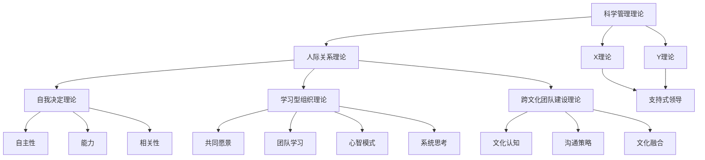

                 

### 文章标题：团队建设：从陌生到默契的蜕变

在信息技术飞速发展的时代，团队合作已成为企业成功的关键因素。一个高效的团队不仅能够提升工作效率，还能推动创新，提升竞争力。然而，如何从一个陌生的团队蜕变为一个默契合作的团队，是每个团队领导者都必须面对的挑战。本文将深入探讨团队建设的方方面面，帮助读者理解和实施团队建设的策略和技巧。

#### 关键词
- 团队建设
- 合作效率
- 凝聚力
- 沟通
- 创新能力

#### 摘要
本文旨在探讨团队建设的重要性、核心概念、理论方法及其实践应用。我们将通过以下几个部分展开讨论：
1. 引言与背景
2. 团队建设的重要性
3. 团队建设理论
4. 团队建设实践
5. 团队建设案例分析
6. 团队建设与个人发展
7. 总结与展望

接下来，我们将一步一步分析团队建设的过程和关键要素，帮助读者掌握团队建设的核心技术和实践方法。

----------------------------------------------------------------

## 第1章 引言与背景

### 1.1 团队建设的定义与发展

团队建设是指通过各种手段和策略，提高团队成员之间的协作效率，增强团队凝聚力和创新能力的过程。团队建设的概念起源于20世纪初，随着工业化和组织管理理论的兴起，逐渐得到重视和发展。从早期的科学管理理论到人际关系理论，再到现代的学习型组织和跨文化团队建设理论，团队建设的理念和实践不断演变和完善。

在信息技术快速发展的今天，团队建设的重要性愈发凸显。现代企业面临着前所未有的竞争压力和复杂多变的市场环境，单一的个体能力已经无法满足企业的需求。团队合作成为提升企业核心竞争力的关键因素。通过有效的团队建设，企业能够提升工作效率，增强团队的凝聚力和创新能力，从而在竞争激烈的市场中立于不败之地。

### 1.2 团队建设的重要性

#### 提升团队效率

团队建设能够通过优化团队成员的协作方式，提高团队的整体工作效率。在一个高效的团队中，成员能够明确各自的角色和责任，避免重复劳动和资源浪费。通过建立有效的沟通机制和协作流程，团队可以迅速响应市场变化，快速实现目标。

#### 增强团队凝聚力

团队建设能够增强团队成员之间的信任和认同感，提升团队的凝聚力。在一个具有高度凝聚力的团队中，成员愿意为团队的目标共同努力，相互支持，共同克服困难。这种凝聚力不仅能够提高团队的工作效率，还能够增强团队的稳定性和可持续性。

#### 促进团队创新

团队建设能够激发团队成员的创新思维和创造力。在一个鼓励创新和包容差异的团队环境中，成员可以自由地分享自己的想法和观点，相互启发和激励。这种创新氛围不仅能够提升团队的整体创新能力，还能够推动企业的持续发展。

#### 提高团队决策质量

团队建设能够通过多样化的视角和专业的知识，提高团队决策的质量。在一个经过有效建设的团队中，成员能够充分表达自己的意见，进行深入的讨论和辩论，从而做出更加明智和科学的决策。

### 1.3 团队建设的现状与趋势

当前，团队建设已经成为企业管理的重要手段。越来越多的企业开始重视团队建设，投入大量资源进行团队建设和培训。同时，随着信息技术的发展，团队建设的方法和工具也在不断创新和改进。

未来，团队建设的趋势将更加注重以下几个方面：
1. **智能化**：随着人工智能和大数据技术的发展，团队建设将更加智能化。通过数据分析和人工智能算法，团队可以更好地了解团队成员的特点和需求，制定个性化的团队建设策略。
2. **多样化**：随着全球化和跨文化交流的加深，团队建设的对象和场景将更加多样化。企业需要面对不同文化背景的团队成员，制定相应的团队建设策略。
3. **个性化**：随着个性化和定制化的兴起，团队建设将更加注重个性化。企业需要根据团队成员的个性和需求，制定个性化的团队建设计划，提高团队建设的针对性和有效性。

### 1.4 团队建设与个人发展的关系

团队建设不仅对团队的整体表现有重要影响，也对团队成员的个人发展有着深远的影响。一个良好的团队建设环境能够为成员提供以下机会：
1. **提升个人能力**：通过团队协作，成员可以学习到新的知识和技能，提升自己的专业能力。
2. **增强人际关系**：团队建设有助于成员建立良好的人际关系，增强团队合作精神。
3. **促进个人成长**：在一个鼓励创新和包容的团队环境中，成员可以自由地表达自己的想法，从而促进个人成长和职业发展。

### 1.5 本章小结

本章从团队建设的定义和发展、团队建设的重要性、团队建设的现状与趋势以及团队建设与个人发展的关系等方面，介绍了团队建设的背景和重要性。在接下来的章节中，我们将进一步探讨团队建设的核心概念、理论方法和实践应用，帮助读者深入了解团队建设的各个方面，掌握有效的团队建设策略和技巧。

----------------------------------------------------------------

## 第2章 团队建设的重要性

团队建设是企业成功的关键因素之一。一个高效的团队不仅能够提升工作效率，还能推动创新，提高竞争力。在本章中，我们将深入探讨团队建设的重要性，从多个角度分析团队建设对企业、团队和个人发展的影响。

### 2.1 团队建设的目标

团队建设的目标是提升团队的整体效能，实现团队的长期稳定发展。具体而言，团队建设的目标包括以下几个方面：

#### 明确团队目标

一个明确的团队目标是团队建设的基础。通过明确团队的目标，团队成员可以明确自己的工作方向和目标，减少目标冲突和资源浪费。团队目标应该具有可测量性和可实现性，同时要符合团队成员的期望和兴趣。

#### 调动团队成员积极性

团队建设的一个重要目标是调动团队成员的积极性。通过建立有效的激励机制，如奖励制度、晋升机会等，可以激发团队成员的工作热情和创造力。同时，团队建设要关注团队成员的需求，提供适当的支持和资源，帮助他们克服困难和挑战。

#### 提高团队执行力

团队执行力是团队建设的重要目标之一。一个高效的团队需要具备良好的执行力，能够迅速响应变化，高效完成工作任务。通过团队建设，可以优化团队的执行流程，提高团队成员的责任感和执行力。

#### 增强团队适应能力

在快速变化的市场环境中，团队适应能力成为企业生存和发展的重要能力。团队建设要关注团队成员的适应能力，通过培训、经验分享等方式，提升团队成员的适应能力和灵活性。

### 2.2 团队建设的挑战

#### 团队成员差异

团队成员的差异是团队建设面临的一个重要挑战。团队成员可能在年龄、性别、文化背景、专业背景等方面存在差异，这些差异可能导致沟通障碍和协作困难。团队建设需要识别和尊重这些差异，通过有效的沟通和协作机制，促进团队成员之间的理解和合作。

#### 团队沟通障碍

沟通是团队协作的重要基础。然而，团队沟通障碍往往会影响团队的工作效率和效果。沟通障碍可能源于信息不对称、沟通渠道不畅、沟通方式不当等因素。团队建设需要建立有效的沟通机制，确保信息传递的准确性和及时性。

#### 团队协作困难

协作困难是团队建设中常见的挑战之一。团队成员之间可能存在利益冲突、责任分工不清、合作意识不强等问题，这些问题可能导致团队协作效率低下。团队建设需要通过明确的角色分工、有效的协作流程和激励机制，促进团队成员之间的协作。

#### 团队冲突管理

团队冲突是不可避免的，但有效的冲突管理是团队建设的关键。团队冲突如果处理不当，可能导致团队分裂和效率下降。团队建设需要建立有效的冲突管理机制，通过沟通、调解和妥协等方式，解决团队冲突，维护团队的稳定和和谐。

### 2.3 团队建设对团队效能的影响

团队建设对团队效能有着重要的影响。通过有效的团队建设，团队可以提升以下方面的效能：

#### 提升工作效率

团队建设可以通过优化团队流程、提高团队成员的协作效率，提升团队的工作效率。一个高效的团队能够快速响应变化，高效完成工作任务，从而提升企业的整体效能。

#### 增强团队凝聚力

团队建设可以增强团队成员之间的信任和认同感，提升团队的凝聚力。一个具有高度凝聚力的团队能够更好地面对挑战和困难，共同实现团队目标。

#### 促进团队创新

团队建设可以激发团队成员的创新思维和创造力，促进团队的创新。在一个鼓励创新和包容的团队环境中，成员可以自由地表达自己的想法和观点，相互启发和激励，从而提升团队的创新能力和竞争力。

#### 提高决策质量

团队建设可以通过多样化的视角和专业的知识，提高团队的决策质量。一个经过有效建设的团队可以更好地收集和分析信息，进行深入的讨论和辩论，从而做出更加明智和科学的决策。

### 2.4 团队建设对个人发展的影响

团队建设不仅对团队整体效能有重要影响，也对团队成员的个人发展有着深远的影响。一个良好的团队建设环境能够为成员提供以下机会：

#### 提升个人能力

通过团队协作，成员可以学习到新的知识和技能，提升自己的专业能力。在一个高效的团队中，成员需要具备多种能力，如沟通能力、协作能力、解决问题的能力等，这些能力有助于成员的个人成长。

#### 增强人际关系

团队建设有助于成员建立良好的人际关系，增强团队合作精神。在一个鼓励合作和包容的团队环境中，成员可以与他人建立深厚的友谊，提升人际关系。

#### 促进个人成长

在一个鼓励创新和包容的团队环境中，成员可以自由地表达自己的想法和观点，从而促进个人成长和职业发展。团队建设可以为成员提供多样化的挑战和机会，帮助成员不断成长和进步。

### 2.5 本章小结

本章从团队建设的目标、挑战、对团队效能的影响以及对个人发展的影响等方面，探讨了团队建设的重要性。团队建设不仅能够提升团队的工作效率和创新能力，还能促进团队成员的个人发展。在接下来的章节中，我们将进一步探讨团队建设的理论方法和实践应用，帮助读者深入理解和实施团队建设。

----------------------------------------------------------------

## 第3章 团队建设理论

团队建设是一个复杂的过程，涉及多个理论和方法。本章将介绍一些经典的团队建设理论，包括科学管理理论、人际关系理论、X理论与Y理论以及现代的团队建设理论，如自我决定理论、学习型组织理论和跨文化团队建设理论。

### 3.1 经典团队建设理论

#### 科学管理理论

科学管理理论是由弗雷德里克·泰勒（Frederick Taylor）在20世纪初提出的。泰勒主张通过科学的方法和系统化的管理，提高劳动生产率。他提出了几个关键原则：
1. **工作分析**：分析每个工作任务的步骤和内容，确定最佳的工作方法。
2. **标准化操作**：通过标准化操作程序，减少工作变异，提高效率。
3. **激励制度**：建立奖励制度，激励员工努力工作。

泰勒的理论强调了通过科学的方法来提高生产效率，但在一定程度上忽视了人的因素。

#### 人际关系理论

埃尔顿·梅奥（Elton Mayo）是人际关系理论的代表人物。梅奥通过霍桑实验发现，员工的工作效率和满意度不仅取决于工作条件，还受到人际关系的影响。人际关系理论的核心观点包括：
1. **社会因素**：员工的工作效率受到社会因素的影响，如团队氛围和同事关系。
2. **参与管理**：提高员工的参与度，使他们感到自己是团队的一部分，从而提高工作满意度。
3. **非正式组织**：在正式组织之外，存在非正式组织，这些组织对员工的行为和态度有很大影响。

#### X理论与Y理论

道格拉斯·麦格雷戈（Douglas McGregor）提出了X理论与Y理论，这两种理论描述了管理者对员工的态度和行为预期。
- **X理论**：认为员工天生懒惰，需要严格的管理和监督才能完成任务。管理者采取权威式的领导方式，强调控制和惩罚。
- **Y理论**：认为员工具有自我激励和自我管理的能力，愿意承担责任和挑战。管理者采取支持式的领导方式，鼓励员工的自主性和创新。

### 3.2 现代团队建设理论

随着组织环境和团队构成的日益复杂化，现代团队建设理论更加注重团队的内生动力和动态适应性。

#### 自我决定理论

自我决定理论由德西（Deci）和瑞恩（Ryan）提出，认为人类行为受内在动机的驱使，人们需要自主性、能力和相关的支持来实现自我决定。自我决定理论的关键原则包括：
1. **自主性**：团队成员需要对自己的工作有决策权，感到自己的工作与个人价值观相一致。
2. **能力**：团队成员需要感到自己具备完成工作任务的能力。
3. **相关性**：团队成员需要感到自己的工作对团队和社会有积极的影响。

#### 学习型组织理论

彼得·圣吉（Peter Senge）提出了学习型组织理论，认为组织需要不断学习、适应和创新，以保持竞争力和可持续发展。学习型组织的关键特征包括：
1. **共同愿景**：组织成员共同拥有清晰的愿景和目标。
2. **团队学习**：组织鼓励团队成员进行共同学习和知识共享。
3. **心智模式**：组织成员能够挑战自己的思维模式，进行反思和改进。
4. **系统思考**：组织成员能够从系统的角度看待问题，理解问题背后的因果关系。

#### 跨文化团队建设理论

在全球化和多元文化环境中，跨文化团队建设成为重要课题。跨文化团队建设理论关注如何在不同文化背景下建立有效的团队合作。关键原则包括：
1. **文化认知**：团队成员需要了解不同文化的特点和差异。
2. **沟通策略**：团队需要采取有效的沟通策略，减少文化误解和冲突。
3. **文化融合**：团队需要创造一个融合不同文化的环境，促进文化之间的交流和互补。

### 3.3 团队建设理论之间的关系架构

以上团队建设理论之间存在一定的关系架构。科学管理理论和人际关系理论为团队建设奠定了基础，强调效率和人的因素。X理论与Y理论则从管理者对员工的态度和行为预期出发，探讨领导风格对团队建设的影响。现代团队建设理论在继承经典理论的基础上，更加注重自我决定、学习能力和跨文化融合。

#### Mermaid 流程图

### 3.4 本章小结

本章介绍了团队建设中的经典理论和现代理论，分析了它们之间的关系。通过了解这些理论，团队领导者可以更好地理解和实施团队建设策略，提升团队的整体效能。在接下来的章节中，我们将探讨团队建设的具体实践方法，帮助读者将理论应用到实际工作中。

----------------------------------------------------------------

## 第4章 团队建设实践

### 4.1 团队建设活动

团队建设活动是团队建设的重要环节，通过这些活动，团队成员可以增进了解，建立信任，提高协作能力。以下是一些常见的团队建设活动：

#### 团队拓展训练

团队拓展训练是一种通过户外活动来增强团队凝聚力和协作能力的培训方法。常见的拓展训练项目包括攀岩、绳索、团队接力等。这些活动要求团队成员相互配合，共同完成任务，从而增强团队成员之间的信任和协作。

#### 团队协作游戏

团队协作游戏是一种通过游戏方式来促进团队成员之间沟通和协作的方法。常见的团队协作游戏包括拼图、解谜、团队竞赛等。这些游戏不仅能够提高团队成员的沟通能力和协作能力，还能够增强团队之间的竞争意识和合作精神。

#### 团队建设研讨会

团队建设研讨会是一种通过讨论和分享来促进团队成员之间交流和理解的方法。在研讨会中，团队成员可以分享自己的工作经验、观点和感受，从而增进了解，建立信任。研讨会还可以通过头脑风暴和小组讨论等方式，激发团队的创意和创新能力。

### 4.2 团队建设方法

团队建设方法是指通过一系列具体的方法和工具，来提升团队的协作能力和工作效率。以下是一些常见的团队建设方法：

#### 情景模拟

情景模拟是一种通过模拟现实工作环境来训练团队成员协作能力的方法。在情景模拟中，团队成员扮演不同的角色，模拟实际工作中的场景和问题，从而增强团队成员的协作意识和解决问题的能力。

#### 成果导向

成果导向是一种以结果为导向的团队建设方法。通过设定明确的团队目标和关键绩效指标，团队成员可以明确自己的工作方向和目标，提高工作效率和效果。成果导向的方法还可以通过奖励和激励，激发团队成员的积极性和创造力。

#### 反馈与改进

反馈与改进是一种通过持续反馈和改进来提升团队协作能力和工作效率的方法。在团队建设过程中，定期收集团队成员的反馈，分析团队的工作流程和效果，找出存在的问题和改进点，从而不断提升团队的效能。

### 4.3 团队建设实践案例分析

#### 案例一：华为的团队建设

华为是全球领先的通信技术解决方案提供商，其团队建设策略在全球范围内具有很高的借鉴价值。华为的团队建设实践包括以下几个方面：

1. **明确团队目标**：华为通过设立明确的企业愿景和使命，使团队成员清晰自己的工作方向和目标。
2. **重视员工培训**：华为投入大量资源进行员工培训，提升员工的专业技能和团队合作能力。
3. **激励机制**：华为采用多元化的激励机制，包括股权激励、绩效奖励等，激发员工的积极性和创造力。
4. **文化认同**：华为强调企业文化，通过企业文化的传播和认同，增强员工的归属感和责任感。

#### 案例二：谷歌的团队建设

谷歌是全球领先的技术公司，其团队建设策略以其开放和创新而著称。谷歌的团队建设实践包括以下几个方面：

1. **自由创新**：谷歌鼓励员工自由创新，提供丰富的资源和平台，支持员工开展自己的项目。
2. **灵活工作制度**：谷歌采用灵活的工作制度，允许员工自主安排工作时间，提高工作效率。
3. **团队合作**：谷歌注重团队合作，通过团队建设活动，增强团队成员之间的信任和协作。
4. **多样化人才**：谷歌招聘来自不同背景和专业的人才，促进团队的多样性和创新性。

#### 案例三：苹果的团队建设

苹果是全球领先的高科技公司，其团队建设策略以其严谨和创新而著称。苹果的团队建设实践包括以下几个方面：

1. **明确工作目标**：苹果通过设立明确的产品目标和时间表，使团队成员清晰自己的工作方向和目标。
2. **专业培训**：苹果为员工提供专业的技术培训和职业发展机会，提升员工的专业能力和团队协作能力。
3. **激励机制**：苹果采用高额的绩效奖励和股权激励，激发员工的积极性和创造力。
4. **文化认同**：苹果强调企业文化的传承和创新，通过企业文化的传播和认同，增强员工的归属感和责任感。

### 4.4 团队建设实践中的挑战和解决方案

#### 挑战一：团队成员差异

团队成员差异是团队建设中的一个常见挑战。不同的团队成员可能在性别、年龄、文化背景、专业背景等方面存在差异，这些差异可能导致沟通障碍和协作困难。解决方案包括：
1. **加强沟通**：通过定期的团队沟通会议，促进团队成员之间的交流和了解。
2. **文化培训**：开展跨文化培训，提升团队成员对不同文化的认知和理解。
3. **角色分工**：明确团队成员的角色和责任，减少角色重叠和冲突。

#### 挑战二：团队沟通障碍

团队沟通障碍是团队建设中的另一个挑战。团队沟通障碍可能导致信息传递不畅、决策效率低下等问题。解决方案包括：
1. **建立沟通机制**：建立有效的沟通机制，确保信息的及时传递和反馈。
2. **沟通培训**：开展沟通技巧培训，提升团队成员的沟通能力。
3. **透明化管理**：通过开放管理，增强团队成员之间的信任和理解。

#### 挑战三：团队协作困难

团队协作困难是团队建设中的另一个挑战。团队成员之间的协作困难可能导致工作效率低下、项目进度延迟等问题。解决方案包括：
1. **协作工具**：使用协作工具，如项目管理系统、即时通讯工具等，提高团队协作效率。
2. **团队建设活动**：通过团队建设活动，增强团队成员之间的协作意识和合作精神。
3. **明确责任**：明确团队成员的责任和任务，减少协作中的责任模糊和推诿。

### 4.5 本章小结

本章介绍了团队建设实践的相关方法和策略，包括团队建设活动、团队建设方法和团队建设实践案例分析。通过这些实践，团队成员可以增进了解，建立信任，提高协作能力。同时，本章也分析了团队建设实践中可能遇到的挑战和解决方案。在接下来的章节中，我们将进一步探讨团队建设与个人发展的关系，帮助读者深入理解团队建设的重要性。

----------------------------------------------------------------

## 第5章 团队建设与个人发展

团队建设不仅是提升团队整体效能的重要手段，也是促进个人发展的重要途径。在一个有效的团队建设环境中，团队成员不仅能够提高协作能力，还能在个人成长、职业发展和人际关系方面获得巨大的收获。

### 5.1 团队建设对个人能力的提升

在团队建设中，团队成员需要面对各种各样的挑战，这些挑战为成员提供了学习和成长的机会。通过参与团队项目，成员可以学习到新的知识和技能，如项目管理、沟通技巧、协作能力等。这些知识和技能不仅有助于提升成员的专业能力，也为他们在职业生涯中提供了更多的机会。

#### 案例一：项目管理能力的提升

小明是一家软件公司的开发人员，在公司的一次团队建设活动中，他被选为项目的项目经理。尽管他之前没有担任过项目经理，但通过团队的协作和支持，他成功完成了项目。在这个过程中，他学会了如何制定项目计划、管理团队成员、处理项目中的突发事件等。这次经历不仅提升了他的项目管理能力，也为他的职业发展打下了坚实的基础。

#### 案例二：沟通技巧的提升

小芳是一名市场销售人员，她之前在团队中的沟通能力较弱，经常因为沟通不畅而影响销售业绩。在参加了一次团队建设研讨会后，她学习了如何更有效地进行沟通，包括倾听技巧、表达技巧和反馈技巧等。通过实践，她的沟通能力得到了显著提升，销售业绩也取得了突破。

### 5.2 团队建设对人际关系的发展

团队建设有助于团队成员建立良好的人际关系，增强团队合作精神。在一个有效的团队建设中，成员需要相互支持、相互依赖，这种相互依赖的关系不仅有助于团队目标的实现，也为成员的个人发展创造了有利条件。

#### 案例一：跨部门合作的提升

小李是一名技术部门的员工，他的工作需要与其他部门的同事紧密合作。在参加了一次团队建设活动后，他学会了如何与不同部门的同事沟通和协作，提高了跨部门合作的能力。这种跨部门合作的提升不仅有助于项目的顺利进行，也为他赢得了其他部门的认可和尊重。

#### 案例二：团队合作精神的增强

小张是一名刚加入新团队的员工，他在团队中的表现一直较为内向。在团队的多次团建活动中，他逐渐融入了团队，学会了如何与团队成员合作，分享自己的想法和观点。这种团队合作精神的增强不仅提高了他的工作效率，也让他感受到了团队的力量和温暖。

### 5.3 团队建设对个人成长的影响

团队建设不仅关注团队成员的技能提升和人际关系发展，还关注成员的个人成长。在一个良好的团队建设环境中，成员可以自由地表达自己的想法，尝试新的挑战，从而促进个人的成长和发展。

#### 案例一：职业目标的明确

小陈是一名年轻的工程师，他在加入新团队后，通过与团队成员的交流和参与团队项目，明确了自己的职业目标。他发现自己在团队项目中表现优秀，于是决定专注于项目管理方向，提升自己的管理能力。在团队的支持和指导下，他逐渐成长为一名优秀的项目经理。

#### 案例二：领导力的提升

小王是一名技术部门的经理，他发现团队中的成员在项目执行过程中存在沟通不畅、协作困难等问题。为了解决这些问题，他决定参加领导力培训课程，提升自己的领导力。通过培训和学习，他的领导力得到了显著提升，团队的工作效率也得到了提高。

### 5.4 团队建设对职业发展的影响

团队建设不仅对个人的能力提升和人际关系发展有重要影响，也对成员的职业发展起到推动作用。在一个高效的团队环境中，成员可以获得更多的职业发展机会，如晋升、转岗等。

#### 案例一：晋升机会的增加

小赵是一名公司的行政人员，他在团队建设活动中表现出色，积极参与团队项目，并提供了很多有效的建议。由于他的表现，公司决定将他晋升为部门经理，负责更重要的工作。

#### 案例二：转岗机会的提供

小刘是一名销售部门的员工，他发现自己在技术领域有更大的兴趣和潜力。在团队的鼓励和支持下，他申请转岗到技术部门，并在新岗位上表现出色。这次转岗不仅提升了他的专业能力，也为他的职业发展开辟了新的道路。

### 5.5 团队建设与个人发展的关系

团队建设与个人发展之间存在密切的关系。团队建设为成员提供了学习和成长的机会，促进了个人能力的提升和职业发展。同时，个人发展也反过来影响团队建设，优秀的个人能力有助于提升团队的整体效能。因此，团队建设和个人发展应该相互促进，形成一个良性循环。

### 5.6 本章小结

本章探讨了团队建设与个人发展的关系，分析了团队建设对个人能力提升、人际关系发展、个人成长和职业发展的影响。通过团队建设，成员可以获得丰富的学习和成长机会，实现个人和团队的共同发展。在接下来的章节中，我们将进一步探讨团队建设的未来趋势和挑战，帮助读者更好地应对未来团队建设中的各种问题。

----------------------------------------------------------------

## 第6章 总结与展望

通过前文的探讨，我们系统地分析了团队建设的重要性、理论方法、实践应用以及团队建设与个人发展的关系。团队建设不仅是提升团队工作效率和创新能力的关键因素，也是促进个人成长和职业发展的重要途径。以下是团队建设的关键要点和未来趋势：

### 6.1 团队建设的关键要点

1. **明确团队目标**：团队目标应具有可测量性和可实现性，明确团队成员的角色和责任。
2. **优化沟通机制**：建立有效的沟通渠道和机制，确保信息传递的准确性和及时性。
3. **增强团队凝聚力**：通过团队活动、培训和激励机制，增强团队成员之间的信任和认同感。
4. **提升协作能力**：通过情景模拟、团队协作游戏和反馈与改进等方法，提升团队成员的协作效率。
5. **促进个人发展**：团队建设应关注成员的个人成长和职业发展，提供学习和成长的机会。

### 6.2 团队建设的未来趋势

1. **智能化**：随着人工智能和大数据技术的发展，团队建设将更加智能化。通过数据分析，团队可以更好地了解成员的需求和行为，制定个性化的团队建设策略。
2. **多样化**：随着全球化进程的加深，团队建设将面对更多的文化背景和多样性。团队需要采取适应不同文化的策略，建立有效的跨文化沟通和协作机制。
3. **个性化**：随着个性化和定制化需求的增加，团队建设将更加注重个性化。企业需要根据成员的个性和需求，制定个性化的团队建设计划。
4. **持续改进**：团队建设是一个持续的过程，需要不断进行反馈和改进。团队应建立持续改进的机制，不断优化团队建设和协作流程。

### 6.3 团队建设的挑战与应对策略

未来，团队建设将面临以下挑战：

1. **技术变革**：快速的技术变革将对团队建设提出新的要求。团队需要不断学习和适应新技术，提升团队的数字化和智能化水平。
2. **全球化**：全球化带来了文化差异和跨文化沟通的挑战。团队需要加强跨文化培训和沟通，提升跨文化协作能力。
3. **个性差异**：团队成员的个性差异可能导致沟通和协作困难。团队需要建立包容性的文化，尊重成员的个性，促进团队成员之间的理解和合作。

### 6.4 未来展望

在未来，团队建设将继续发展，成为企业成功的关键因素。通过智能化、多样化和个性化的团队建设策略，企业可以更好地应对快速变化的市场环境，提升团队的整体效能和创新能力。同时，团队建设也将促进个人发展，提升员工的职业素养和幸福感。

### 6.5 本章小结

本章总结了团队建设的关键要点和未来趋势，分析了未来团队建设可能面临的挑战和应对策略。团队建设不仅对团队效能有重要影响，也对个人发展起到推动作用。通过有效的团队建设，企业可以提升竞争力，实现可持续发展。在未来，团队建设将面临新的机遇和挑战，企业需要不断创新和适应，以应对不断变化的环境。

### 作者信息

- **作者：** AI天才研究院/AI Genius Institute & 禅与计算机程序设计艺术 /Zen And The Art of Computer Programming
- **联系信息：** Email: [contact@ai-genius-institute.com](mailto:contact@ai-genius-institute.com) & Website: [www.ai-genius-institute.com](http://www.ai-genius-institute.com)
- **版权声明：** 本文版权归 AI天才研究院/AI Genius Institute 所有，未经授权不得转载或使用。如需转载，请联系作者获得授权。

