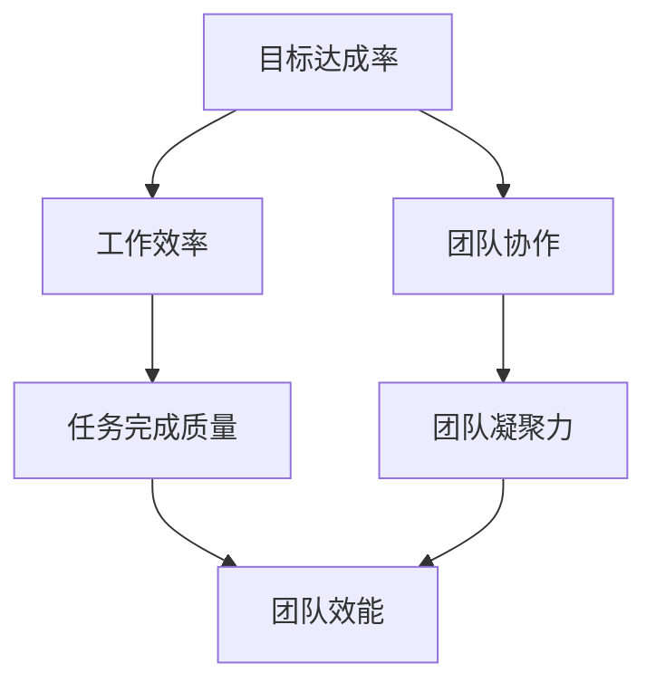

                 

# 文章标题：《团队效能评估：持续改进的管理方法》

> 关键词：团队效能评估，持续改进，管理方法，效能指标，团队协作

> 摘要：本文旨在探讨团队效能评估的重要性及其在持续改进管理方法中的应用。通过详细的理论讲解、实际案例分析，以及数学模型和算法的阐述，本文为IT行业团队效能提升提供了实用且有效的指导。

## 引言

在当今快速发展的信息技术行业，团队效能的高低直接影响项目的成功与否。高效能的团队不仅能够迅速响应市场需求，还能在质量、速度和创新能力上保持领先。因此，如何科学地评估团队效能，并采取有效的持续改进策略，成为了企业管理者关注的焦点。

### 书籍背景及目的

《团队效能评估：持续改进的管理方法》一书旨在帮助读者深入了解团队效能评估的基本概念和实施方法，以及如何通过持续改进来提升团队效能。本书内容涵盖了团队效能评估的各个方面，包括定义、方法、实践和应用，并提供了丰富的案例和实用工具，旨在为团队管理者提供系统性、实操性的指导。

### 本书结构概述

本书共分为六个部分，结构如下：

1. **引言**：介绍团队效能评估和持续改进的背景及重要性。
2. **团队效能评估的基本概念**：探讨团队效能的定义、要素和评估方法。
3. **团队效能评估的实践应用**：分析不同类型团队的效能评估实践和应用策略。
4. **持续改进的管理方法**：介绍持续改进的概念、工具和技术。
5. **案例分析与启示**：通过具体案例探讨团队效能评估与持续改进的实际应用。
6. **结论与展望**：总结全书内容，展望未来发展趋势和挑战。

阅读本书，读者可以：

- 理解团队效能评估的核心概念和方法。
- 学会运用持续改进的管理方法提升团队效能。
- 获得实际案例的启示，应用到自己的团队管理实践中。

## 团队效能评估的基本概念

### 团队效能的定义

团队效能是指团队在完成特定任务时表现出来的效率和质量。一个高效的团队能够在给定的时间和资源内，高质量地完成项目目标。团队效能包括多个方面，如目标达成率、工作效率、团队协作和团队凝聚力等。

### 核心概念与联系

为了更清晰地理解团队效能的构成，我们使用Mermaid流程图来展示核心概念之间的关系：

### 团队效能评估的方法

团队效能评估的方法可以分为定量评估和定性评估两种。

#### 定量评估方法

定量评估方法主要通过数据分析和量化指标来评估团队效能。常见的定量评估方法包括：

- **工作效率评估**：通过工作量、完成时间和效率比等指标来衡量。
- **目标达成率评估**：通过项目完成情况和目标实现程度来评估。
- **团队协作评估**：通过沟通频率、协作效率和团队合作满意度等指标来衡量。

#### 定性评估方法

定性评估方法主要通过主观评价和观察来评估团队效能。常见的定性评估方法包括：

- **问卷调查**：通过问卷调查收集团队成员对团队效能的评价。
- **面谈**：通过与团队成员进行深入交流，了解团队的实际情况和问题。
- **观察记录**：通过观察团队的工作过程和表现，记录团队效能的相关信息。

#### 综合评估方法

综合评估方法是将定量和定性评估方法结合起来，以获得更全面、准确的团队效能评估结果。常见的综合评估方法包括：

- **平衡计分卡**：将财务、客户、内部业务流程和学习与成长四个维度结合起来，全面评估团队效能。
- **综合指标体系**：设计一套包含多个指标的综合评估体系，对团队效能进行全面评价。

### 团队效能评估的流程

团队效能评估的流程一般包括以下几个步骤：

1. **准备阶段**：明确评估目的、方法和时间安排，准备必要的评估工具和资源。
2. **数据收集与分析阶段**：通过问卷调查、面谈、观察记录等方式收集数据，并对数据进行整理和分析。
3. **结果反馈与改进阶段**：将评估结果反馈给团队成员，分析存在的问题和改进方向，制定改进措施。

## 团队效能评估的实践应用

### 不同类型的团队效能评估

团队效能评估可以根据团队的目标、任务和环境进行分类。以下是几种常见类型的团队效能评估：

#### 短期目标团队

短期目标团队的效能评估主要关注项目进度、任务完成情况和团队协作效率。评估指标包括任务完成率、项目进度和团队沟通效率等。

#### 长期目标团队

长期目标团队的效能评估不仅关注项目进展，还关注团队的文化建设、创新能力和发展潜力。评估指标包括项目完成质量、团队凝聚力、创新能力和发展指标等。

#### 特殊任务团队

特殊任务团队的效能评估通常针对特定的任务或项目，评估指标包括任务完成质量、团队协作效率、问题解决能力和应急反应速度等。

### 团队效能评估的具体案例

#### 案例一：提升工作效率

某IT企业为了提升团队工作效率，采用了团队效能评估方法。通过问卷调查和面谈，发现团队在任务分配、时间管理和沟通协调方面存在一定问题。针对这些问题，企业采取了以下改进措施：

1. 制定详细的任务分配计划，确保每个团队成员都明确自己的任务和责任。
2. 引入时间管理工具，帮助团队成员更好地规划和控制自己的工作时间。
3. 加强团队沟通，定期召开会议，确保团队成员之间的信息畅通。

通过这些措施，团队的工作效率得到了显著提升。

#### 案例二：优化团队沟通

某科研团队为了提高项目进展速度，进行了团队效能评估。评估结果显示，团队在沟通方面存在较多障碍，导致信息传递不畅。为了解决这一问题，团队采取了以下措施：

1. 引入协作工具，如Slack或Trello，方便团队成员之间的信息交流和任务协作。
2. 定期进行团队沟通培训，提高团队成员的沟通技巧和表达能力。
3. 建立沟通反馈机制，鼓励团队成员提出改进意见和建议。

通过这些措施，团队的沟通效率得到了明显改善。

#### 案例三：提高团队创新能力

某创业公司为了提升团队创新能力，进行了团队效能评估。评估结果显示，团队在创新思维、知识共享和跨部门协作方面存在一定问题。为了解决这些问题，公司采取了以下措施：

1. 定期组织创新培训，提高团队成员的创新意识和能力。
2. 建立知识共享平台，鼓励团队成员分享知识和经验。
3. 推动跨部门协作，促进不同部门之间的信息交流和合作。

通过这些措施，团队的创新能力得到了显著提升。

### 团队效能评估的应用策略

#### 团队效能评估的工具与技巧

为了进行有效的团队效能评估，管理者可以采用以下工具和技巧：

1. **KPI（关键绩效指标）**：通过设定关键绩效指标，对团队的工作成果进行量化评估。
2. **360度反馈**：通过多角度、全方位的反馈，了解团队成员的工作表现和团队合作情况。
3. **SWOT分析**：通过分析团队的优势、劣势、机会和威胁，制定相应的改进措施。

#### 团队效能评估的难点与挑战

在团队效能评估过程中，管理者可能会遇到以下难点和挑战：

1. **数据收集困难**：团队成员对评估数据的真实性和准确性可能存在质疑，导致数据收集困难。
2. **评估标准不明确**：评估标准的设定可能不够具体和明确，导致评估结果不准确。
3. **反馈与改进的滞后**：评估结果的反馈和改进可能存在滞后，影响评估的效果。

#### 团队效能评估的改进措施

为了克服团队效能评估的难点和挑战，管理者可以采取以下改进措施：

1. **建立透明的评估机制**：确保评估过程的公平、公正和透明，提高团队成员的信任度。
2. **制定明确的评估标准**：制定具体、可量化的评估标准，确保评估结果的可操作性和准确性。
3. **及时反馈与改进**：及时对评估结果进行反馈，并制定具体的改进措施，确保评估的实效性。

## 持续改进的管理方法

### 持续改进的概念

持续改进是一种管理理念，旨在通过不断优化和改进，实现组织的目标和效果。持续改进的核心思想是“持续”，即不断地进行改进，而不是一次性地解决问题。持续改进的管理方法包括一系列工具和技术，如PDCA循环、帕累托分析和常规控制图等。

### 持续改进的工具与技术

#### PDCA循环

PDCA循环是一种用于持续改进的管理方法，包括四个阶段：计划（Plan）、执行（Do）、检查（Check）和行动（Act）。每个阶段的具体步骤如下：

1. **计划（Plan）**：明确改进的目标和策略，制定具体的行动计划。
2. **执行（Do）**：按照计划实施改进措施，确保行动的执行。
3. **检查（Check）**：对改进措施的效果进行评估，收集相关数据。
4. **行动（Act）**：根据检查结果，调整和优化改进措施，确保持续改进。

#### 帕累托分析

帕累托分析是一种用于识别和解决主要问题的技术。它基于帕累托原理，即“80/20法则”，认为80%的问题通常由20%的原因引起。帕累托分析的具体步骤如下：

1. **问题识别**：列举所有问题，并按照重要程度进行排序。
2. **原因分析**：分析每个问题的主要原因，并按照影响程度进行排序。
3. **优先级设定**：根据原因分析和问题排序，设定改进的优先级。
4. **改进实施**：针对优先级最高的原因，制定具体的改进措施，并实施。

#### 常规控制图

常规控制图是一种用于监控过程稳定性和改进过程效果的工具。它通过绘制过程数据，帮助管理者识别过程的变异和异常，从而采取相应的改进措施。常规控制图的具体步骤如下：

1. **数据收集**：收集过程数据，如产量、质量、时间等。
2. **数据整理**：将数据整理成统计图表，如柱状图、折线图等。
3. **控制界限设定**：根据历史数据，设定控制上限和控制下限。
4. **过程监控**：将实际数据与控制界限进行对比，识别异常和变异。
5. **改进措施**：针对识别的异常和变异，制定具体的改进措施，并实施。

### 持续改进在团队效能评估中的应用

#### 持续改进与团队效能评估的关联

持续改进和团队效能评估之间存在密切的关联。团队效能评估为持续改进提供了评估和反馈的基础，而持续改进则为团队效能评估提供了改进和优化的手段。具体关联如下：

1. **评估结果作为改进依据**：通过团队效能评估，管理者可以识别团队存在的问题和不足，为持续改进提供具体的改进方向。
2. **改进措施促进效能提升**：通过持续改进，管理者可以采取针对性的措施，解决评估中发现的问题，从而提升团队的整体效能。
3. **反馈与调整**：持续改进过程中，管理者可以根据评估结果，对改进措施进行调整和优化，确保改进效果的持续性和有效性。

#### 持续改进的实践案例

以下是一个持续改进在团队效能评估中的应用案例：

某企业为了提升团队效能，进行了团队效能评估，发现团队在任务分配和资源利用方面存在较大问题。针对这一问题，企业采取了以下持续改进措施：

1. **计划阶段**：明确改进目标，制定详细的任务分配和资源利用计划。
2. **执行阶段**：按照计划实施任务分配和资源利用措施，确保执行到位。
3. **检查阶段**：对任务分配和资源利用情况进行监控和评估，收集相关数据。
4. **行动阶段**：根据检查结果，调整任务分配和资源利用计划，优化改进措施。

通过持续改进，该企业成功解决了任务分配和资源利用问题，团队效能得到了显著提升。

#### 持续改进的成效评估

为了评估持续改进的效果，管理者可以采用以下方法：

1. **对比评估**：将改进前后的数据对比，分析改进措施的有效性。
2. **过程跟踪**：持续跟踪改进过程，收集过程数据，评估改进措施的稳定性和持续性。
3. **员工满意度调查**：通过员工满意度调查，了解员工对改进措施的接受程度和认可度。

通过综合评估，管理者可以全面了解持续改进的效果，为下一步的改进提供依据。

## 案例分析与启示

### 案例一：某企业团队效能评估与持续改进实践

#### 案例背景

某企业是一家软件研发公司，由于项目进度和质量问题，企业决定进行团队效能评估和持续改进。

#### 团队效能评估过程

1. **数据收集**：通过问卷调查、面谈和观察记录等方式，收集团队效能相关数据。
2. **问题识别**：分析数据，识别团队存在的问题，如任务分配不合理、沟通不畅等。
3. **制定改进计划**：根据问题，制定具体的改进计划，包括任务分配优化、沟通机制完善等。

#### 持续改进措施及成效

1. **任务分配优化**：引入任务分配工具，明确任务分配流程和责任人，确保任务分配的合理性和透明度。
2. **沟通机制完善**：建立定期的团队沟通会议，确保信息畅通和意见交流，提高团队协作效率。
3. **培训与支持**：组织相关培训和研讨会，提升团队成员的技能和沟通能力。

通过持续改进，该企业成功解决了团队效能问题，项目进度和质量得到显著提升。

### 案例二：某科研团队效能评估与持续改进实践

#### 案例背景

某科研团队在进行一项重要科研项目时，发现团队效能不足，影响项目进展。为提升团队效能，团队决定进行效能评估和持续改进。

#### 团队效能评估过程

1. **数据收集**：通过问卷调查、面谈和观察记录等方式，收集团队效能相关数据。
2. **问题识别**：分析数据，识别团队存在的问题，如知识共享不足、创新能力较低等。
3. **制定改进计划**：根据问题，制定具体的改进计划，包括知识共享平台建设、创新能力提升等。

#### 持续改进措施及成效

1. **知识共享平台建设**：建立知识共享平台，鼓励团队成员分享知识和经验，提高知识传递效率。
2. **创新能力提升**：组织创新培训，提高团队成员的创新意识和能力，推动跨学科合作。
3. **项目激励机制**：设立项目奖励制度，鼓励团队成员积极参与项目，提高项目完成质量。

通过持续改进，该科研团队成功提升了团队效能，项目进展顺利，取得了显著成果。

### 案例分析与启示

通过以上两个案例的分析，我们可以得出以下启示：

1. **团队效能评估是持续改进的基础**：只有准确评估团队效能，才能有针对性地制定改进措施。
2. **持续改进需要全员参与**：持续改进不仅仅是管理者的责任，需要全员共同参与，形成良好的改进氛围。
3. **改进措施要具体可行**：改进措施要结合实际情况，具体可行，确保能够真正解决问题。
4. **持续改进要持之以恒**：持续改进是一个长期的过程，需要管理者持续关注和推动，确保改进效果的持续性和稳定性。

## 结论与展望

### 本书总结

《团队效能评估：持续改进的管理方法》一书系统地介绍了团队效能评估的基本概念、实践应用和持续改进的管理方法。通过丰富的案例分析和实用的工具，本书为团队管理者提供了有效的指导，帮助提升团队效能，实现组织的持续发展。

### 展望未来

随着信息技术的发展，团队效能评估和持续改进方法将不断演变和创新。未来，我们将看到更多智能化的评估工具和技术的应用，如大数据分析、人工智能和区块链等，为团队效能提升提供更强有力的支持。同时，团队管理者和成员也将需要不断提升自身的技能和素质，以适应不断变化的工作环境。

### 可能的挑战与对策

在团队效能评估和持续改进过程中，管理者可能会面临以下挑战：

1. **数据收集困难**：对策：建立透明的评估机制，提高团队成员的参与度。
2. **评估标准不明确**：对策：制定具体的评估标准，确保评估的准确性和可操作性。
3. **改进措施滞后**：对策：建立及时的反馈和调整机制，确保改进措施的及时性和有效性。

通过应对这些挑战，管理者可以更好地推动团队效能评估和持续改进，实现团队的高效运作。

## 结语

作者：AI天才研究院/AI Genius Institute & 禅与计算机程序设计艺术 /Zen And The Art of Computer Programming

本文《团队效能评估：持续改进的管理方法》通过对团队效能评估的基本概念、实践应用和持续改进的管理方法的详细探讨，为团队管理者提供了有效的指导。希望本文能为提升团队效能，实现组织的持续发展提供有益的参考。在未来的工作中，我们将继续关注团队效能提升的相关研究，为行业的发展贡献自己的力量。如果您对本文有任何建议或意见，欢迎在评论区留言讨论。感谢您的阅读！## 文章关键词

- 团队效能评估
- 持续改进
- 管理方法
- 效能指标
- 团队协作

## 文章摘要

本文旨在探讨团队效能评估在持续改进管理方法中的重要性。首先，介绍了团队效能评估的基本概念，包括定义、要素和评估方法。随后，详细阐述了团队效能评估的实践应用，包括不同类型团队的评估案例和应用策略。接着，探讨了持续改进的管理方法，介绍了PDCA循环、帕累托分析和常规控制图等工具与技术。最后，通过具体案例分析，总结了团队效能评估与持续改进的实际应用效果，并提出了未来发展的展望。本文旨在为团队管理者提供有效的团队效能提升策略。

