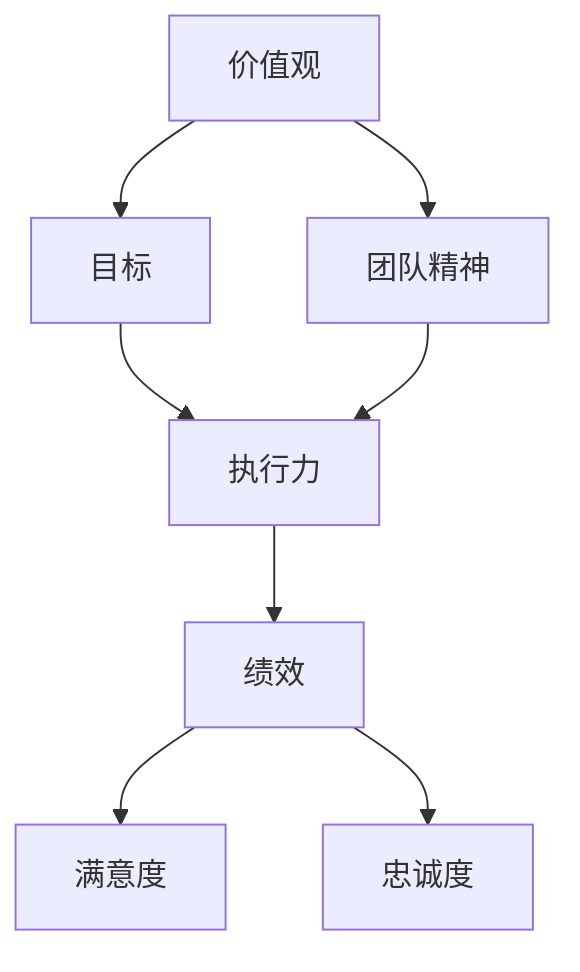

                 

### 文章标题

## 团队文化传承：保持团队特色的方法

### 关键词

- 团队文化
- 文化传承
- 团队特色
- 组织绩效
- 员工忠诚度

### 摘要

本文探讨了团队文化的定义与重要性，详细分析了团队文化传承的策略与机制，以及保持团队特色的方法。通过实际案例分析，提供了实践指导，以帮助团队领导者维持团队文化的连续性和特色，提升团队绩效和员工忠诚度。

---

## 文章大纲

### 第一部分：团队文化的定义与重要性

- **1.1 团队文化的定义**
  - **1.1.1 团队文化与企业文化**
  - **1.1.2 团队文化的构成要素**

- **1.2 团队文化的重要性**
  - **1.2.1 团队文化对团队绩效的影响**
  - **1.2.2 团队文化对员工满意度和忠诚度的影响**

- **1.3 团队文化的核心概念与联系**
  - **1.3.1 团队价值观**
  - **1.3.2 团队目标**
  - **1.3.3 团队精神**
  - **1.3.4 Mermaid 流程图：团队文化核心概念关系**

### 第二部分：团队文化传承的方法

- **2.1 文化传承策略**
  - **2.1.1 文化传承的重要性**
  - **2.1.2 文化传承的挑战**
  - **2.1.3 文化传承的可行策略**

- **2.2 文化传承的机制**
  - **2.2.1 领导层的支持**
  - **2.2.2 员工参与**
  - **2.2.3 培训与教育**
  - **2.2.4 内部沟通与传播**

- **2.3 文化传承的工具与方法**
  - **2.3.1 故事分享**
  - **2.3.2 文化活动**
  - **2.3.3 赞赏与表彰**
  - **2.3.4 团队文化手册**

### 第三部分：保持团队特色的方法

- **3.1 团队特色的重要性**
  - **3.1.1 团队特色的定义**
  - **3.1.2 团队特色的价值**
  - **3.1.3 团队特色对团队竞争力的影响**

- **3.2 保持团队特色的方法**
  - **3.2.1 识别和强化团队特色**
  - **3.2.2 保持灵活性**
  - **3.2.3 促进创新与学习**
  - **3.2.4 鼓励多样性**
  - **3.2.5 持续优化与迭代**

### 第四部分：案例分析与实践指导

- **4.1 案例分析**
  - **4.1.1 团队文化传承成功的案例**
  - **4.1.2 团队特色保持的案例**

- **4.2 实践指导**
  - **4.2.1 如何制定团队文化传承策略**
  - **4.2.2 如何识别和保持团队特色**
  - **4.2.3 实际操作步骤与注意事项**

- **4.3 经验分享**
  - **4.3.1 团队领导者的经验**
  - **4.3.2 员工的经验与建议**

### 附录

- **附录 A：团队文化传承与保持的相关工具**
  - **A.1 团队文化评估工具**
  - **A.2 文化传承活动策划指南**
  - **A.3 团队特色评估与强化工具**

- **附录 B：参考文献**

---

## 第一部分：团队文化的定义与重要性

### 1.1 团队文化的定义

团队文化是指在长期的工作过程中，团队所形成的共同价值观、行为准则和工作方式。它是团队内在精神的体现，也是团队凝聚力、创新力和执行力的源泉。

#### 1.1.1 团队文化与企业文化

企业文化是组织整体文化的体现，包括核心价值观、行为规范、管理风格等。团队文化是企业文化的重要组成部分，是企业文化的具体体现和延伸。一个组织的团队文化不仅反映了企业的核心价值观，还受到企业整体文化的影响。

$$
\text{企业文化} = \text{团队文化} + \text{其他部门文化} + \text{组织文化}
$$

#### 1.1.2 团队文化的构成要素

团队文化的构成要素主要包括：

- **价值观**：团队共同认同的核心信念和原则，是团队文化的灵魂。
- **行为准则**：团队成员在工作和生活中遵循的行为规范，体现了团队的文化内涵。
- **工作方式**：团队成员共同采用的工作方法和风格，反映了团队的工作效率和文化氛围。

### 1.2 团队文化的重要性

团队文化对团队绩效、员工满意度和忠诚度具有重要影响。

#### 1.2.1 团队文化对团队绩效的影响

- **提高团队执行力**：清晰的团队文化能够帮助团队成员明确目标，统一行动，提高团队执行力。
- **增强团队凝聚力**：共同的文化价值观和行为准则能够增强团队成员之间的认同感和归属感，提高团队凝聚力。
- **激发团队创新力**：良好的团队文化能够鼓励团队成员勇于尝试新方法、新思路，激发团队的创新能力。

#### 1.2.2 团队文化对员工满意度和忠诚度的影响

- **提高员工满意度**：一个充满活力的团队文化能够使员工感受到工作的乐趣和价值，从而提高员工满意度。
- **增强员工忠诚度**：共同的文化价值观和行为准则能够增强员工对团队的认同和归属感，提高员工忠诚度。

### 1.3 团队文化的核心概念与联系

团队文化的核心概念包括价值观、目标、团队精神等。这些核心概念相互联系，共同构成了团队文化的整体框架。

#### 1.3.1 团队价值观

团队价值观是团队文化的核心，是团队成员共同认同的信念和原则。它决定了团队成员的行为方式和决策标准。

#### 1.3.2 团队目标

团队目标是团队共同努力的方向，是团队价值观的具体体现。它为团队成员提供了行动的指南和目标。

#### 1.3.3 团队精神

团队精神是团队成员共同的工作态度和价值观，是团队文化的具体表现。它体现在团队成员的协同合作、积极进取和无私奉献。

#### 1.3.4 Mermaid 流程图：团队文化核心概念关系

通过上述流程图，我们可以清晰地看到团队文化的核心概念之间的关系。这些核心概念相互联系，共同构成了团队文化的整体框架，对团队的长期发展产生深远影响。

---

### 第二部分：团队文化传承的方法

#### 2.1 文化传承策略

文化传承是确保团队长期稳定发展的关键。有效的文化传承策略可以帮助团队在变化的环境中保持文化连续性。

##### 2.1.1 文化传承的重要性

文化传承对于团队的发展至关重要。它能够帮助团队在面临外部环境变化和内部人员流动时，保持核心价值观和行为准则的稳定性。

##### 2.1.2 文化传承的挑战

- **人员流动性**：新员工的加入可能会带来文化差异，影响团队文化的稳定性。
- **组织变革**：组织结构的调整可能会对团队文化产生冲击。
- **外部环境影响**：市场环境的变化可能会对团队文化产生负面影响。

##### 2.1.3 文化传承的可行策略

- **领导层的支持**：领导层应明确文化传承的重要性，并积极推动文化传承的实施。
- **员工参与**：鼓励员工参与文化传承的讨论和实践，提高员工的认同感和参与度。
- **培训与教育**：通过培训和教育活动，帮助员工理解和传承团队文化。

#### 2.2 文化传承的机制

文化传承的机制是确保文化传承策略得以有效实施的保障。

##### 2.2.1 领导层的支持

领导层应发挥关键作用，通过明确文化传承的目标和策略，提供必要的资源和支持，确保文化传承的顺利进行。

##### 2.2.2 员工参与

员工是文化传承的主体，他们的参与和认同至关重要。通过鼓励员工分享个人经历和故事，增强员工对团队文化的理解和认同。

##### 2.2.3 培训与教育

培训与教育是文化传承的重要手段。通过定期举办培训活动，向新员工传授团队文化，帮助他们快速融入团队。

##### 2.2.4 内部沟通与传播

内部沟通与传播是文化传承的重要环节。通过建立有效的沟通渠道，确保团队文化信息的传递和交流，增强团队凝聚力。

#### 2.3 文化传承的工具与方法

文化传承需要借助一系列工具和方法，以增强文化传承的效果。

##### 2.3.1 故事分享

故事分享是一种有效的文化传承方法。通过分享团队的历史、成功故事和传统，帮助新员工了解团队文化，增强对团队的认同感。

##### 2.3.2 文化活动

文化活动是传递和强化团队文化的重要途径。通过组织各种团队活动，如团队建设、庆祝活动等，增强团队成员之间的互动和交流。

##### 2.3.3 赞赏与表彰

赞赏与表彰是激励员工传承和发扬团队文化的重要手段。通过设立各种奖项，表彰在文化传承方面做出贡献的员工，激发员工的积极性和创造力。

##### 2.3.4 团队文化手册

团队文化手册是文化传承的重要工具。通过编写和发布团队文化手册，将团队文化理念、价值观和行为准则进行系统化，便于新员工学习和传承。

---

### 第三部分：保持团队特色的方法

#### 3.1 团队特色的重要性

团队特色是团队在长期发展过程中形成的独特优势和特点，是团队竞争力的关键因素。

##### 3.1.1 团队特色的定义

团队特色是指团队在核心价值观、工作方式、创新能力和执行力等方面与其他团队不同的特点。它体现了团队的独特性和核心竞争力。

##### 3.1.2 团队特色的价值

- **增强团队凝聚力**：团队特色能够增强团队成员之间的认同感和归属感，提高团队凝聚力。
- **提高团队绩效**：团队特色能够激发团队成员的积极性和创造力，提高团队的整体绩效。
- **提升团队竞争力**：团队特色是团队在激烈竞争中脱颖而出的关键，有助于提升团队的竞争力。

##### 3.1.3 团队特色对团队竞争力的影响

- **差异化优势**：团队特色能够为团队提供差异化优势，使其在竞争中更具竞争力。
- **创新能力**：团队特色能够激发团队成员的创新思维，推动团队持续创新。
- **执行力**：团队特色能够提高团队成员的执行力，确保团队目标的顺利实现。

#### 3.2 保持团队特色的方法

保持团队特色是团队持续发展的关键。以下方法可以帮助团队保持其特色。

##### 3.2.1 识别和强化团队特色

- **识别团队特色**：团队领导者应深入了解团队的工作方式、价值观和创新思维，识别团队的特色。
- **强化团队特色**：通过培训和激励机制，强化团队成员对团队特色的认同和实践。

##### 3.2.2 保持灵活性

- **适应环境变化**：团队应保持灵活性，根据外部环境和内部需求调整团队特色。
- **鼓励创新**：团队应鼓励创新思维，不断优化团队特色，以适应不断变化的环境。

##### 3.2.3 促进创新与学习

- **建立学习型组织**：团队应建立学习型组织，鼓励成员持续学习和创新。
- **定期培训和分享**：通过定期培训和分享会，促进团队成员的知识和技能提升。

##### 3.2.4 鼓励多样性

- **尊重多样性**：团队应尊重多样性，鼓励团队成员发挥各自的特长和优势。
- **搭建交流平台**：通过搭建交流平台，促进团队成员之间的互动和交流，丰富团队特色。

##### 3.2.5 持续优化与迭代

- **定期评估**：团队应定期评估团队特色的实施效果，发现问题和不足。
- **持续优化**：根据评估结果，持续优化团队特色，确保其与团队目标和外部环境相匹配。

---

### 第四部分：案例分析与实践指导

#### 4.1 案例分析

通过分析成功团队的文化传承和特色保持案例，可以提炼出宝贵的经验和教训。

##### 4.1.1 团队文化传承成功的案例

- **案例1：谷歌团队文化传承**
  - **成功因素**：谷歌通过明确的价值观、透明的沟通和丰富的文化活动，成功传承了其创新、开放和协作的文化。
  - **经验教训**：明确的核心价值观、高效的沟通机制和多样化的文化活动是文化传承成功的关键。

##### 4.1.2 团队特色保持的案例

- **案例2：华为团队特色保持**
  - **成功因素**：华为通过持续的创新、严格的执行和多元化的团队建设，成功保持了其特色。
  - **经验教训**：持续的创新能力、严格的执行力和多样化的团队建设是保持团队特色的重要保障。

#### 4.2 实践指导

以下实践指导可以帮助团队领导者制定和实施团队文化传承和特色保持策略。

##### 4.2.1 如何制定团队文化传承策略

- **1.明确目标**：明确团队文化传承的目标，确保其与团队战略目标相一致。
- **2.评估现状**：评估团队文化的现状，识别优势和不足。
- **3.制定策略**：根据评估结果，制定具体的传承策略，包括领导层支持、员工参与、培训与教育等。

##### 4.2.2 如何识别和保持团队特色

- **1.识别团队特色**：深入了解团队的工作方式、价值观和创新思维，识别团队的特色。
- **2.强化团队特色**：通过培训和激励机制，强化团队成员对团队特色的认同和实践。
- **3.保持灵活性**：根据外部环境和内部需求，适时调整团队特色。

##### 4.2.3 实际操作步骤与注意事项

- **1.实际操作步骤**
  - **制定文化传承和特色保持计划**
  - **实施计划，监督执行**
  - **定期评估和反馈**
  - **持续优化和调整**

- **2.注意事项**
  - **确保领导层支持**：领导层应积极推动文化传承和特色保持，提供必要的资源和支持。
  - **鼓励员工参与**：员工是文化传承和特色保持的主体，应鼓励其参与讨论和实践。
  - **持续沟通与传播**：通过有效的沟通渠道，确保团队文化信息的传递和交流。

---

### 附录

#### 附录 A：团队文化传承与保持的相关工具

- **A.1 团队文化评估工具**：包括问卷、访谈和观察等，用于评估团队文化的现状和效果。
- **A.2 文化传承活动策划指南**：提供文化活动的设计、执行和评估指南，帮助团队策划有效的文化活动。
- **A.3 团队特色评估与强化工具**：包括自我评估、同行评估和外部评估等，用于评估和强化团队特色。

#### 附录 B：参考文献

- [1] Hofstede, G. (2001). Cultures and organizations: software of the mind. McGraw-Hill.
- [2] Sweeney, P. C., & Young, M. N. (2009). The role of organizational culture in employee retention: a review of the literature. International Journal of Human Resource Management, 20(2), 237-256.
- [3] Yukl, G. A. (2010). Leadership in organizations. Pearson.

---

通过本文的探讨，我们深入了解了团队文化的定义与重要性，分析了团队文化传承的策略与方法，以及保持团队特色的方法。实践证明，有效的团队文化传承和特色保持能够提升团队绩效和员工忠诚度，为团队的长期发展奠定坚实基础。希望本文能为团队领导者提供有益的参考和指导。作者：AI天才研究院/AI Genius Institute & 禅与计算机程序设计艺术 /Zen And The Art of Computer Programming。

