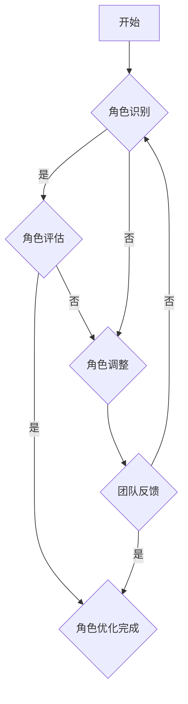

                 

### 文章标题
《团队角色优化：maximizing个人长处的策略》

### 关键词
团队角色优化、个人长处、策略、团队效能、角色识别、适应性发展

### 摘要
本文深入探讨了团队角色优化的重要性和实施策略，通过分析团队角色优化的核心概念、理论基础以及实际案例，提出了一种maximizing个人长处的角色优化方法。文章详细介绍了角色识别、角色适应性与发展、个人长处评估、团队角色优化框架和实施策略等内容，旨在为团队管理和人员发展提供实践指导和理论支持。

---

# 引言

在当今快速变化的工作环境中，团队的有效运作成为组织成功的关键因素之一。团队成员的角色扮演和相互协作直接影响到团队的整体表现。因此，团队角色优化成为一个重要的议题。本文旨在通过深入探讨团队角色优化，提供一个maximizing个人长处的策略，以提升团队的整体效能。

## 团队角色优化的背景

### 1. 团队协作的重要性

团队协作是现代组织中不可或缺的一部分。随着项目的复杂性和跨职能需求增加，团队成员之间的有效沟通和协作显得尤为重要。团队协作不仅能够提高工作效率，还能激发创新思维，促进问题解决。

### 2. 团队角色优化的需求

团队角色优化是为了确保每个成员都能在最适合他们的角色中发挥最大潜力。这种优化不仅有助于提升个人绩效，还能增强团队的整体效能。角色优化可以解决以下问题：

- **资源浪费**：当团队成员被分配到不擅长的角色时，可能会导致资源浪费和效率低下。
- **角色重叠**：角色之间的边界不清晰时，会导致职责重叠，造成混乱和责任推卸。
- **技能不匹配**：团队成员的技能和角色不匹配时，会导致项目延误和团队士气低落。

### 3. 团队角色优化的意义

团队角色优化对团队和组织具有多方面的积极影响：

- **提升绩效**：通过优化角色，确保每个成员都能在其擅长的领域发挥最大作用，从而提高整体绩效。
- **增强团队凝聚力**：当团队成员的角色和职责清晰明确时，可以提高团队的凝聚力和协作精神。
- **促进个人发展**：通过角色优化，团队成员可以获得更多的发展机会，提升自身技能和职业素养。
- **提升组织竞争力**：一个高效运作的团队能够更好地应对市场变化和挑战，提升组织的整体竞争力。

## 团队角色优化的理论基础

### 1. SWOT分析

团队角色优化可以基于SWOT分析（优势、劣势、机会、威胁）来进行。通过分析团队内外部环境，确定每个成员的优势和劣势，从而优化角色分配。

### 2. 团队效能模型

团队效能模型是团队角色优化的重要理论基础。该模型关注团队的整体表现，包括沟通、协作、目标一致性等方面。通过评估团队效能，可以识别出需要优化的角色和环节。

### 3. 角色识别与匹配理论

角色识别与匹配理论是团队角色优化的核心。该理论强调通过科学的方法识别团队成员的角色，并将其与团队需求进行匹配，以达到最佳效能。

## 实际案例

为了更好地理解团队角色优化的实践，下面介绍两个实际案例。

### 1. 案例一：初创企业的团队角色优化

一家初创企业通过角色优化，明确了每个成员的职责和角色。例如，CEO负责战略规划，CTO负责技术架构，而COO则负责运营管理。这种清晰的分工使得团队更加高效，推动了公司的发展。

### 2. 案例二：跨国团队的跨文化角色优化

一家跨国公司在全球范围内拥有多个团队。为了应对跨文化差异，公司对团队成员进行了角色优化，确保每个成员都能在最适合的文化环境中发挥其长处。这种优化有助于增强团队的协作和效率。

## 结论

团队角色优化是提升团队效能的重要策略。通过深入分析团队角色优化的背景、理论基础和实际案例，我们可以看到角色优化对团队和组织具有多方面的积极影响。本文接下来将详细探讨团队角色优化的具体实施步骤和方法，以帮助团队和组织实现角色优化，maximizing个人长处，提升整体效能。

---

### 核心概念与联系

在深入探讨团队角色优化的具体实施步骤之前，我们首先需要明确几个核心概念，并了解它们之间的相互联系。这些核心概念包括团队角色定义、团队角色与团队效能的关系，以及团队角色优化的Mermaid流程图。

#### 团队角色定义

团队角色是指在团队中每个成员所承担的职责和功能。团队角色的定义不仅包括具体的任务和责任，还涉及团队成员之间的互动和协作方式。团队角色的定义是角色优化过程中的基础，它决定了团队成员如何分配任务和责任，以及如何相互协作。

- **任务和责任**：团队角色定义明确了每个成员在团队中的具体职责。例如，一个开发团队中，可能会有项目经理、开发人员、测试人员等角色。
- **互动和协作方式**：团队角色定义还包括团队成员之间的互动和协作方式。有效的角色定义能够促进团队成员之间的沟通和合作，避免职责重叠和冲突。

#### 团队角色与团队效能的关系

团队角色与团队效能之间的关系是团队角色优化的关键。团队效能是指团队在实现目标过程中表现出来的能力。团队角色的合理分配和优化能够显著提高团队效能，具体体现在以下几个方面：

- **提高工作效率**：当团队成员的角色与其能力相匹配时，可以提高工作效率。每个成员都能够在其最擅长的领域发挥作用，避免资源的浪费和低效的工作模式。
- **促进协作和沟通**：团队角色的优化能够促进团队成员之间的协作和沟通。明确的角色定义有助于避免职责重叠和责任推卸，提高团队的整体协作效率。
- **增强团队凝聚力**：团队角色的优化有助于增强团队的凝聚力。当团队成员能够在其最擅长的领域发挥作用时，会增强其对团队的认同感和归属感，从而提高团队的凝聚力。

#### 团队角色优化的Mermaid流程图

为了更直观地展示团队角色优化的过程，我们可以使用Mermaid流程图来描述。以下是一个简化的团队角色优化流程：

- **角色识别**：这是团队角色优化的第一步，通过调查和评估，识别出团队成员的角色。
- **角色评估**：在识别角色后，对每个角色的效能进行评估，确定是否需要优化。
- **角色调整**：如果评估结果显示角色需要优化，进行角色调整。
- **团队反馈**：在整个角色优化过程中，收集团队成员的反馈，不断调整和优化角色分配。

#### 角色识别与优化的关系

角色识别和角色优化是相辅相成的过程。角色识别是基础，它为角色优化提供了数据支持。而角色优化则是目标，通过调整和优化角色，实现团队效能的最大化。

- **角色识别**：通过调查和评估，识别出团队成员的角色，包括其职责、能力和互动方式。
- **角色优化**：基于角色识别的结果，对角色进行优化，确保每个成员能够在最合适的角色中发挥其长处。

#### 角色优化与团队效能的关系

团队角色优化与团队效能之间的关系是双向的。团队角色的优化能够提高团队效能，而高效的团队也能够反过来促进角色优化。

- **团队效能提升**：通过优化角色，提高工作效率、促进协作和沟通，从而提升团队的整体效能。
- **角色优化反馈**：高效的团队表现能够为角色优化提供反馈，帮助识别需要改进的方面，进一步优化团队角色。

### 总结

通过以上分析，我们可以看到，团队角色优化是一个复杂而关键的过程。它不仅涉及到角色识别和评估，还需要考虑团队效能和成员的长处匹配。通过科学的角色优化，团队能够实现资源的最佳配置，提高整体效能，从而在竞争激烈的市场中脱颖而出。

在接下来的章节中，我们将详细探讨团队角色优化的具体实施步骤，包括角色识别、角色评估、角色调整和团队反馈等环节，帮助团队和组织实现角色优化，maximizing个人长处。

---

### 第2章 团队角色定义

在团队角色优化的过程中，明确团队角色的定义是至关重要的。团队角色的定义不仅包括成员在团队中的具体职责，还涉及到他们在团队中的互动和协作方式。以下我们将详细探讨团队角色的定义、分类以及其在团队效能中的重要性。

#### 团队角色的定义

团队角色是指在团队中每个成员所承担的职责和功能。一个有效的团队角色定义应该明确每个成员的任务、责任以及与其他成员之间的互动方式。团队角色的定义不仅有助于提高团队的工作效率，还能增强团队凝聚力和协作精神。

- **任务和责任**：团队角色定义了每个成员在团队中的具体任务和责任。例如，一个开发团队中，项目经理负责项目规划和资源分配，开发人员负责编写代码，测试人员负责测试和确保代码质量。
- **互动和协作方式**：团队角色定义还涉及到团队成员之间的互动和协作方式。一个有效的角色定义应该明确团队成员如何沟通、如何分工合作，以及如何共同解决团队面临的问题。

#### 团队角色的分类

团队角色可以根据不同的标准和维度进行分类。以下是一些常见的团队角色分类方法：

- **基于职能的分类**：根据团队成员在团队中的职能和责任，可以将团队角色分为技术角色、管理角色和支持角色。例如，开发人员属于技术角色，项目经理属于管理角色，行政人员属于支持角色。
- **基于能力的分类**：根据团队成员的能力和专长，可以将团队角色分为领导者、执行者、协调者和创新者。领导者负责制定战略和目标，执行者负责完成任务，协调者负责协调团队成员之间的工作，创新者负责推动团队的创新。
- **基于行为的分类**：根据团队成员的行为和风格，可以将团队角色分为问题解决者、沟通者、支持者和推动者。问题解决者负责解决团队面临的问题，沟通者负责协调团队成员之间的沟通，支持者负责提供帮助和支持，推动者负责推动团队向前发展。

#### 团队角色在团队效能中的重要性

团队角色的明确和合理分配对团队效能具有重要的影响：

- **提高工作效率**：明确的团队角色定义有助于提高团队的工作效率。当每个成员都清楚自己的任务和责任时，可以避免工作重叠和责任推卸，提高团队的整体效率。
- **促进协作和沟通**：团队角色定义有助于促进团队成员之间的协作和沟通。当团队成员了解彼此的角色和职责时，可以更容易地进行分工合作，共同解决问题。
- **增强团队凝聚力**：明确的团队角色定义有助于增强团队的凝聚力。当团队成员感受到自己在团队中扮演着重要的角色时，会增强对团队的认同感和归属感，从而提高团队的凝聚力。
- **提升团队创新能力**：团队角色定义有助于提升团队的创新能力。当团队成员在各自擅长的领域中发挥其长处时，可以激发更多的创新思维，推动团队的创新和发展。

#### 团队角色优化的挑战

在团队角色优化过程中，可能会面临以下挑战：

- **角色重叠和冲突**：当团队角色的定义不清晰或职责不明确时，可能会导致角色重叠和冲突。这会降低团队的工作效率，影响团队的协作。
- **能力与角色不匹配**：当团队成员的能力与其角色不匹配时，可能会导致团队效能的下降。这需要通过培训和调整来解决问题。
- **文化差异和沟通障碍**：跨文化团队在角色优化过程中可能会面临文化差异和沟通障碍。这需要团队成员之间的相互理解和尊重，以及有效的沟通策略来克服。

#### 团队角色优化的方法

为了实现团队角色优化，可以采取以下方法：

- **角色识别**：通过调查和评估，识别出团队成员的角色。这可以通过问卷调查、访谈和角色扮演等方法进行。
- **角色评估**：对每个角色的效能进行评估，确定是否需要优化。这可以通过绩效评估、工作反馈和团队讨论等方法进行。
- **角色调整**：根据评估结果，对角色进行调整。这可以包括重新分配任务、调整职责范围和优化互动方式等。
- **团队反馈**：在整个角色优化过程中，收集团队成员的反馈，不断调整和优化角色分配。这有助于确保角色优化方案的有效性和可行性。

### 实际案例

以下是一个实际案例，展示了如何通过团队角色优化提高团队效能：

**案例：一家软件公司的团队角色优化**

一家软件公司发现其开发团队的工作效率低下，团队成员之间缺乏协作。为了解决这一问题，公司决定进行团队角色优化。

- **角色识别**：通过问卷调查和访谈，识别出团队成员的角色，包括项目经理、开发人员、测试人员和产品经理等。
- **角色评估**：对每个角色的效能进行评估，发现项目经理和产品经理的角色重叠，导致项目进展缓慢。同时，开发人员和测试人员之间的沟通不畅，影响了代码质量和项目进度。
- **角色调整**：对角色进行调整，将项目经理和产品经理的职责分开，明确各自的责任范围。同时，建立定期的沟通机制，加强开发人员和测试人员之间的沟通。
- **团队反馈**：在角色调整后，定期收集团队成员的反馈，不断优化角色分配和协作方式。

通过团队角色优化，该公司的开发团队效率得到了显著提升，项目进度加快，团队凝聚力增强。这一案例展示了团队角色优化在提高团队效能中的重要作用。

### 总结

团队角色的定义是团队角色优化的重要基础。通过明确团队角色的定义和分类，可以更好地理解团队角色的作用和重要性。在团队角色优化的过程中，需要识别和评估团队成员的角色，并进行调整和优化。通过科学的方法和实际的案例，我们可以实现团队角色的优化，提高团队的整体效能。

在接下来的章节中，我们将进一步探讨团队角色与团队效能的关系，以及如何通过角色识别和评估实现团队角色的优化。这将为我们提供更深入的理解，以帮助团队和组织实现角色优化，maximizing个人长处。

---

### 第3章 角色识别方法

角色识别是团队角色优化的关键步骤，通过科学的方法识别团队成员的角色，可以为后续的角色评估和优化提供可靠的基础。以下是几种常见的角色识别方法，包括角色识别工具的使用和角色识别案例的分析。

#### 角色识别工具

角色识别工具是帮助团队成员明确自己在团队中角色的重要工具。以下是一些常用的角色识别工具：

1. **问卷调查法**：通过设计问卷，向团队成员询问他们在团队中的职责、任务和互动方式。这种方法可以帮助团队领导者了解每个成员的角色认知，以及团队成员之间的沟通和协作情况。

2. **角色扮演法**：通过角色扮演活动，让团队成员模拟实际工作场景，展示其在团队中的角色和行为。这种方法有助于团队成员更深入地理解自己的角色，并发现潜在的问题。

3. **访谈法**：通过与团队成员进行一对一访谈，深入了解他们在团队中的角色和职责。访谈法可以提供更详细的信息，帮助团队领导者识别出成员的角色特征和潜在问题。

4. **任务分析法**：通过分析团队的任务和工作流程，识别出每个成员在任务中的角色和职责。这种方法适用于复杂项目或跨职能团队，有助于明确团队成员的具体任务和协作关系。

#### 角色识别案例

以下是一个角色识别的案例，展示了如何在实际工作中识别团队成员的角色。

**案例：某IT公司的角色识别**

某IT公司为了提高团队效能，决定进行角色识别。公司采取了问卷调查、角色扮演和访谈三种方法进行角色识别。

1. **问卷调查法**：
   公司设计了一份详细的问卷，内容包括团队成员的职责、任务、互动方式和角色认知。问卷通过在线形式发送给所有团队成员，收集到了丰富的数据。

2. **角色扮演法**：
   公司组织了一次角色扮演活动，模拟了项目开发的过程。团队成员按照自己的角色扮演，展示了在实际工作中的协作和沟通情况。活动结束后，团队领导进行了观察和记录，识别出了成员之间的协作问题和角色认知差异。

3. **访谈法**：
   团队领导分别与每位团队成员进行了一对一访谈，详细了解了他们在团队中的角色和职责。访谈过程中，团队领导还询问了成员对于角色识别的看法和建议，收集到了宝贵的反馈信息。

#### 角色识别结果分析

通过对问卷调查、角色扮演和访谈的数据进行分析，公司得出了以下结论：

1. **角色认知不一致**：
   通过问卷调查和访谈，发现有些团队成员对自己的角色认知不一致，导致任务分工不明确和沟通不畅。

2. **职责重叠**：
   角色扮演活动揭示了团队成员在某些任务上的职责重叠，导致工作进展缓慢和效率低下。

3. **沟通障碍**：
   访谈中，一些团队成员反映沟通不畅，特别是在跨职能团队中，沟通障碍影响了项目的进展。

#### 角色识别方法选择

根据案例结果，公司决定采用以下方法进行角色识别：

1. **问卷调查法**：
   作为初步识别工具，帮助公司了解团队成员的基本角色认知。

2. **角色扮演法**：
   作为深入了解工具，帮助公司识别出团队成员在实际工作中的角色和协作问题。

3. **访谈法**：
   作为补充工具，帮助公司收集团队成员的反馈和建议，进一步优化角色识别过程。

#### 角色识别的挑战

在角色识别过程中，公司也面临了一些挑战：

1. **数据准确性**：
   问卷调查和访谈的数据准确性受到团队成员主观因素的影响，可能导致角色识别结果不准确。

2. **时间成本**：
   角色识别方法需要投入大量的时间和人力资源，特别是在大型团队中，可能需要更长时间来完成。

3. **团队成员的接受度**：
   角色识别可能引起团队成员的心理压力，特别是当识别出角色认知不一致或职责重叠时，需要团队成员积极配合和调整。

#### 角色识别方法的优化

为了克服上述挑战，公司决定采取以下措施优化角色识别方法：

1. **提高数据准确性**：
   通过设计更科学的问卷和访谈问题，提高数据收集的准确性。

2. **减少时间成本**：
   采用自动化工具和快速访谈方法，减少角色识别所需的时间。

3. **提高团队成员的接受度**：
   通过沟通和解释角色识别的目的和意义，提高团队成员的接受度和配合度。

### 总结

角色识别是团队角色优化的关键步骤，通过科学的方法识别团队成员的角色，可以为后续的角色评估和优化提供可靠的基础。本文通过实际案例展示了角色识别的方法和挑战，并提出了优化措施。在团队角色优化的过程中，角色识别方法的科学选择和优化对于提高团队效能具有重要意义。

在接下来的章节中，我们将进一步探讨角色评估的方法和过程，以及如何通过角色评估和调整实现团队角色的优化。这将为我们提供更深入的理解，以帮助团队和组织实现角色优化，maximizing个人长处。

---

### 第4章 角色适应性与发展

在团队角色优化的过程中，角色适应性和发展是两个关键环节。角色适应性决定了团队成员是否能够在当前角色中有效工作，而角色发展则关注团队成员在未来如何进一步成长和提升。本文将详细探讨角色适应性和发展的概念、策略，并通过实际案例进行分析。

#### 角色适应性

角色适应性指的是团队成员对其当前角色的适应程度和能力。一个适应良好的角色能够让团队成员发挥其最大潜力，提高工作效率和团队效能。以下是一些提高角色适应性的策略：

1. **角色培训**：
   为团队成员提供与角色相关的培训，帮助他们掌握所需的知识和技能。通过培训，团队成员可以更好地理解角色的要求和期望，提高角色适应能力。

2. **角色调整**：
   当团队成员在当前角色中遇到困难时，可以通过调整角色来帮助其更好地适应。例如，调整职责范围、分配更多资源或提供更多支持。

3. **角色反馈**：
   定期收集团队成员的反馈，了解他们在角色中的适应情况，并及时进行调整和改进。通过反馈，团队成员可以及时了解到自己在角色中的优点和不足，从而提高适应能力。

#### 角色发展

角色发展关注的是团队成员在长期职业生涯中如何不断成长和提升。一个良好的角色发展策略能够帮助团队成员实现职业目标，提高个人和团队的效能。以下是一些促进角色发展的策略：

1. **职业规划**：
   为团队成员提供职业发展规划，帮助他们明确长期职业目标和发展路径。通过职业规划，团队成员可以更好地规划自己的职业生涯，实现持续发展。

2. **技能提升**：
   鼓励团队成员不断学习和提升技能，通过培训、在线课程、实践经验等方式，提高其在角色中的专业能力。技能的提升不仅有助于提升个人绩效，还能增强团队的竞争力。

3. **角色轮换**：
   通过角色轮换，让团队成员有机会在不同角色中工作，拓宽其职业视野，提升综合素质。角色轮换有助于团队成员全面了解团队的工作流程和职能，提高其适应性和发展潜力。

#### 角色适应性与发展的关系

角色适应性和发展是相辅相成的。一个适应良好的角色能够为团队成员提供发展的基础，而角色的持续发展又能提高其适应能力。以下是一个实际案例，展示了角色适应性和发展的关系：

**案例：某互联网公司的角色适应性与发展**

某互联网公司为了提升团队效能，开展了一项角色适应性与发展的项目。

1. **角色适应性评估**：
   公司通过问卷调查和绩效评估，对团队成员的角色适应性进行了评估。评估结果显示，一些团队成员在当前角色中的适应度较低，特别是在跨职能团队中。

2. **角色培训**：
   针对评估结果，公司为这些团队成员提供了专项培训，包括项目管理、跨职能协作等方面的培训。通过培训，团队成员提高了其在当前角色中的适应度。

3. **角色发展**：
   公司还为团队成员制定了职业发展规划，鼓励他们在不同角色之间轮换，拓宽职业视野。同时，公司提供了在线课程和专业认证，支持团队成员提升技能。

4. **角色反馈**：
   公司建立了定期的角色反馈机制，收集团队成员的反馈，及时调整角色分配和培训内容。通过反馈，公司不断优化角色适应性和发展策略。

通过角色适应性与发展项目，该公司的团队效能得到了显著提升，团队成员的满意度和职业发展也得到了保障。

#### 角色适应性与发展的挑战

在角色适应性和发展的过程中，公司可能会面临以下挑战：

1. **资源限制**：
   角色适应性和发展需要投入大量的人力、物力和财力。资源限制可能会影响项目的实施效果。

2. **员工抵触**：
   一些员工可能对角色适应性和发展项目持怀疑态度，认为其会干扰日常工作。这需要公司通过有效的沟通和宣传来提高员工的参与度。

3. **评估难度**：
   角色适应性和发展的评估涉及多个维度，包括绩效、技能提升和职业发展等。评估难度较大，需要科学的方法和工具。

#### 角色适应性与发展的优化

为了克服上述挑战，公司可以采取以下措施：

1. **资源优化**：
   通过合理分配资源，确保角色适应性和发展项目的顺利实施。可以优先支持关键角色和重要项目。

2. **员工参与**：
   通过提高员工的参与度，增强其对角色适应性和发展项目的认可。可以采用激励机制，鼓励员工积极参与。

3. **评估方法**：
   采用科学的评估方法，如360度评估、KPI考核等，提高评估的准确性和有效性。同时，通过定期反馈和调整，确保评估方法的持续改进。

### 总结

角色适应性与发展是团队角色优化的重要环节。通过科学的方法和策略，可以提高团队成员的角色适应性，促进其职业发展，从而提升团队的整体效能。本文通过实际案例和挑战分析，提出了角色适应性与发展的策略和优化方法。在团队角色优化的过程中，角色适应性和发展策略的科学选择和实施对于实现团队角色的优化和最大化个人长处具有重要意义。

在接下来的章节中，我们将进一步探讨个人长处与团队角色匹配的策略，以及如何通过个人长处匹配实现团队角色优化。这将为我们提供更深入的理解，以帮助团队和组织实现角色优化，maximizing个人长处。

---

### 第5章 个人长处与团队角色匹配

在团队角色优化的过程中，识别和利用团队成员的个人长处是实现团队效能最大化的重要策略。个人长处与团队角色的匹配不仅能够提升团队成员的工作满意度和自我效能感，还能够增强团队的凝聚力和整体绩效。本文将详细探讨个人长处的评估方法、长处匹配策略以及实际案例，以帮助团队实现个人长处与团队角色的最佳匹配。

#### 个人长处的评估方法

评估个人长处是实施长处匹配策略的第一步。以下是一些常用的评估方法：

1. **360度评估**：
   通过团队成员的同事、上级和下属提供反馈，全面了解个人的工作表现和长处。这种方法能够提供多维度的视角，帮助识别出个人的优势和潜力。

2. **心理测评**：
   利用专业的心理测评工具，如MBTI（性格类型指标）或DISC（行为风格指标），评估个人的性格特征和长处。这些测评工具能够提供客观的数据支持，帮助团队领导者更好地了解团队成员。

3. **绩效评估**：
   通过定期的工作绩效评估，识别出在工作中表现出色的方面，这些表现往往反映了个人的长处。绩效评估可以作为长处识别的重要参考。

4. **自我评估**：
   让团队成员自我评估自己的长处和优势，这种方式能够促进个人对自己的认识和理解，同时也可以作为其他评估方法的补充。

#### 长处匹配策略

在评估了个人长处之后，团队需要根据这些长处来匹配团队角色，以实现最佳效能。以下是一些长处匹配策略：

1. **任务分配**：
   根据团队成员的长处，将相应的任务分配给他们。例如，擅长分析和解决问题的成员可以负责复杂问题的解决，而擅长沟通和协调的成员可以负责团队协作。

2. **角色轮换**：
   定期进行角色轮换，让团队成员在不同角色中工作，从而发现和发挥新的长处。角色轮换有助于团队成员全面发展，增强团队的整体适应能力。

3. **团队建设**：
   通过团队建设活动，增强团队成员之间的了解和信任，促进长处的发现和匹配。团队建设活动可以是团队协作游戏、研讨会或团队拓展训练。

4. **职业发展计划**：
   为团队成员制定个性化的职业发展计划，根据他们的长处和职业目标，提供相应的培训和发展机会，帮助他们实现个人和团队的共同成长。

#### 实际案例

以下是一个实际案例，展示了如何通过个人长处与团队角色的匹配来提升团队效能：

**案例：某初创公司的长处匹配实践**

某初创公司为了提升团队效能，决定实施个人长处与团队角色的匹配策略。

1. **个人长处评估**：
   公司采用360度评估和心理测评工具，对全体员工进行了长处评估。评估结果显示，一些成员在技术能力方面表现出色，而另一些成员在项目管理、市场拓展等方面具有显著优势。

2. **任务分配**：
   根据评估结果，公司将技术能力强的成员分配到研发团队，负责新产品的开发和测试。而擅长项目管理的成员则被分配到项目管理团队，负责协调公司各项业务的进度和资源。

3. **角色轮换**：
   公司定期组织角色轮换活动，让团队成员在不同角色中工作，从而发现和发挥新的长处。例如，技术团队成员可能会参与市场调研，了解客户需求，从而增强其市场意识和沟通能力。

4. **职业发展计划**：
   公司为每位成员制定了个性化的职业发展计划，根据他们的长处和职业目标，提供相应的培训和晋升机会。通过这种方式，公司不仅提升了团队成员的工作满意度和自我效能感，还增强了团队的整体效能。

#### 案例分析

通过这个案例，我们可以看到个人长处与团队角色匹配策略在提升团队效能方面的有效性：

- **任务分配**：根据个人长处分配任务，确保每个成员在其最擅长的领域工作，提高了工作效率和团队绩效。
- **角色轮换**：角色轮换帮助团队成员全面发展，提升了团队的适应能力和创新能力。
- **职业发展计划**：个性化的职业发展计划帮助团队成员实现个人成长，同时也为团队注入了新的活力和动力。

### 总结

个人长处与团队角色的匹配是实现团队效能最大化的重要策略。通过科学的评估方法识别个人长处，并采取有效的匹配策略，团队可以充分发挥每个成员的优势，提升整体效能。本文通过实际案例分析了个人长处与团队角色匹配的策略和效果，为团队管理者提供了实践指导和理论支持。

在接下来的章节中，我们将进一步探讨团队角色优化策略的具体实施方法和步骤，以及如何通过团队角色优化实现团队效能的最大化。这将为我们提供更深入的理解，以帮助团队和组织实现角色优化，maximizing个人长处。

---

### 第6章 团队角色优化策略

团队角色优化策略是实现团队效能最大化的关键步骤。本章节将详细介绍团队角色优化策略的具体框架、步骤和实施方法，并通过实际案例研究，展示如何有效地实施这些策略。

#### 团队角色优化策略框架

团队角色优化策略框架包括以下主要部分：

1. **角色识别与评估**：通过科学的方法识别和评估团队成员的角色，确定每个角色的效能和适应性。
2. **长处匹配**：根据团队成员的长处和专长，将其与合适的角色进行匹配，确保每个成员在其最擅长的领域工作。
3. **角色调整与优化**：根据角色识别和评估的结果，对角色进行必要的调整和优化，以提高团队的整体效能。
4. **角色发展计划**：为团队成员制定个性化的职业发展计划，促进个人成长和团队的长远发展。

#### 团队角色优化步骤

团队角色优化的实施可以分为以下步骤：

1. **角色识别与评估**：
   - **问卷调查**：通过设计问卷，收集团队成员的角色认知和自我评估。
   - **360度评估**：邀请团队成员的同事、上级和下属提供反馈，全面了解团队成员的角色表现。
   - **绩效评估**：根据团队成员的工作绩效，评估其在当前角色中的效能。

2. **长处匹配**：
   - **心理测评**：利用专业的心理测评工具，识别团队成员的长处和优势。
   - **任务分配**：根据团队成员的长处和专长，将其分配到最合适的角色。
   - **角色轮换**：定期进行角色轮换，发现和发挥团队成员的新长处。

3. **角色调整与优化**：
   - **反馈机制**：建立定期的角色反馈机制，收集团队成员的反馈和建议。
   - **角色重构**：根据反馈结果，对角色进行必要的调整和重构，以消除职责重叠和沟通障碍。
   - **资源分配**：根据角色优化需求，调整团队资源，确保角色优化方案的顺利实施。

4. **角色发展计划**：
   - **职业规划**：为团队成员制定个性化的职业发展计划，明确其职业目标和成长路径。
   - **培训与发展**：提供与职业发展计划相关的培训和发展机会，帮助团队成员提升技能和知识。
   - **晋升机制**：建立明确的晋升机制，激励团队成员不断提升，实现职业目标。

#### 实施方法

以下是团队角色优化策略的具体实施方法：

1. **制定详细计划**：
   - **明确目标**：确定团队角色优化的目标和预期成果。
   - **制定步骤**：根据角色优化策略框架，制定详细的实施步骤和时间表。
   - **资源配置**：确保实施过程中所需的人力、物力和财力资源得到充分保障。

2. **开展角色评估**：
   - **数据收集**：通过问卷调查、360度评估和绩效评估，收集团队成员的角色数据。
   - **分析结果**：对收集到的数据进行整理和分析，识别出角色优化的问题和机会。

3. **进行角色调整**：
   - **反馈沟通**：与团队成员进行沟通，了解其对角色调整的看法和建议。
   - **角色重构**：根据评估结果，对角色进行重构和优化，确保职责清晰和沟通顺畅。

4. **制定发展计划**：
   - **个性化规划**：为每个团队成员制定个性化的职业发展计划。
   - **培训与发展**：提供与职业发展计划相关的培训和发展机会。
   - **晋升激励**：建立明确的晋升机制，激励团队成员不断提升。

#### 实际案例研究

以下是一个团队角色优化策略的实际案例研究：

**案例：某咨询公司的角色优化实践**

某咨询公司为了提升团队效能，决定实施团队角色优化策略。

1. **角色识别与评估**：
   - **问卷调查**：通过设计问卷，收集团队成员的角色认知和自我评估。
   - **360度评估**：邀请团队成员的同事、上级和下属提供反馈，全面了解团队成员的角色表现。
   - **绩效评估**：根据团队成员的工作绩效，评估其在当前角色中的效能。

2. **长处匹配**：
   - **心理测评**：利用专业的心理测评工具，识别团队成员的长处和优势。
   - **任务分配**：根据团队成员的长处和专长，将其分配到最合适的角色。
   - **角色轮换**：定期进行角色轮换，发现和发挥团队成员的新长处。

3. **角色调整与优化**：
   - **反馈机制**：建立定期的角色反馈机制，收集团队成员的反馈和建议。
   - **角色重构**：根据反馈结果，对角色进行重构和优化，确保职责清晰和沟通顺畅。
   - **资源分配**：根据角色优化需求，调整团队资源，确保角色优化方案的顺利实施。

4. **角色发展计划**：
   - **职业规划**：为每个团队成员制定个性化的职业发展计划。
   - **培训与发展**：提供与职业发展计划相关的培训和发展机会。
   - **晋升激励**：建立明确的晋升机制，激励团队成员不断提升。

通过实施团队角色优化策略，该咨询公司的团队效能得到了显著提升。团队成员的工作满意度和自我效能感也得到提高，公司整体业绩也得到了增长。

### 总结

团队角色优化策略是实现团队效能最大化的关键步骤。通过详细的计划、科学的评估和有效的实施方法，团队可以识别和优化每个成员的角色，实现个人长处与团队角色的最佳匹配。本文通过实际案例研究，展示了团队角色优化策略的实施方法和效果，为团队管理者提供了实践指导和理论支持。

在接下来的章节中，我们将进一步探讨角色优化的实施与评估，以及如何通过持续优化和改进，不断提升团队效能。

---

### 第7章 角色优化实施与评估

团队角色优化是一个动态的过程，需要通过系统的实施和持续评估来确保其有效性和可持续性。本章将详细讨论角色优化的实施策略、效果评估方法，并分析实际案例，提供角色优化实施过程中的最佳实践。

#### 角色优化实施策略

1. **制定详细的实施计划**：
   - **明确目标**：在实施角色优化前，首先需要明确优化的目标，包括提高团队效能、提升个人绩效、增强团队凝聚力等。
   - **分解任务**：将优化目标分解为具体的可操作任务，制定详细的时间表和责任人。
   - **资源配置**：确保实施过程中所需的人力、物力和财力资源得到充分保障。

2. **开展角色优化培训**：
   - **领导培训**：对团队领导进行角色优化相关培训，确保他们理解优化的重要性和具体实施方法。
   - **团队培训**：对团队成员进行角色识别、长处匹配和角色调整的培训，提高其参与度和积极性。

3. **建立反馈机制**：
   - **定期反馈**：建立定期的角色反馈机制，通过问卷调查、访谈、绩效评估等方式，收集团队成员的反馈意见。
   - **快速响应**：对收集到的反馈进行快速分析，并采取相应措施进行改进。

4. **实施角色调整**：
   - **逐步实施**：角色优化不应该一蹴而就，而应该采取逐步实施的方法，逐步调整和优化每个成员的角色。
   - **动态调整**：根据反馈和评估结果，动态调整角色分配，确保角色优化方案的有效性。

#### 角色优化效果评估方法

1. **量化指标**：
   - **绩效指标**：通过工作绩效、项目完成度等量化指标，评估角色优化对个人和团队绩效的影响。
   - **效率指标**：通过工作效率、任务处理速度等指标，评估角色优化对团队工作效率的提升。

2. **定性评估**：
   - **满意度调查**：通过满意度调查，了解团队成员对角色优化的满意度和接受度。
   - **团队氛围**：观察团队氛围的变化，评估角色优化对团队凝聚力和协作精神的影响。

3. **关键事件**：
   - **成功案例**：记录和分享角色优化过程中的成功案例，评估角色优化在实际工作中的效果。
   - **挑战与问题**：分析角色优化过程中遇到的问题和挑战，评估其对角色优化策略的适用性和改进空间。

#### 实际案例分析

以下是一个角色优化实施与评估的实际案例：

**案例：某技术公司的角色优化实践**

某技术公司为了提升团队效能，决定实施角色优化策略。

1. **实施计划**：
   - **明确目标**：提升团队工作效率、增强团队凝聚力、优化个人绩效。
   - **分解任务**：制定详细的角色优化计划，包括角色识别、长处匹配、角色调整等。
   - **资源配置**：确保实施过程中所需的资源，包括人力、培训和反馈机制。

2. **角色识别与评估**：
   - **问卷调查**：通过问卷调查，收集团队成员的角色认知和自我评估。
   - **360度评估**：邀请团队成员的同事、上级和下属提供反馈，全面了解团队成员的角色表现。
   - **绩效评估**：根据团队成员的工作绩效，评估其在当前角色中的效能。

3. **长处匹配与角色调整**：
   - **长处匹配**：根据团队成员的长处和专长，将其分配到最合适的角色。
   - **角色调整**：根据评估结果，对角色进行必要的调整，消除职责重叠和沟通障碍。

4. **效果评估**：
   - **量化指标**：通过工作绩效和项目完成度等指标，评估角色优化对个人和团队绩效的提升。
   - **定性评估**：通过满意度调查和团队氛围观察，评估角色优化对团队凝聚力和协作精神的影响。

通过实施角色优化策略，该公司的工作效率显著提升，项目完成度提高了20%，团队成员的满意度也显著提高。同时，公司记录了多个成功案例，分享了角色优化过程中的最佳实践。

#### 最佳实践

以下是一些角色优化实施过程中的最佳实践：

1. **持续反馈与改进**：
   - **定期评估**：定期进行角色评估和反馈，确保角色优化策略的有效性。
   - **持续改进**：根据反馈和评估结果，不断调整和优化角色分配和职责。

2. **领导支持与参与**：
   - **领导参与**：领导应该积极参与角色优化过程，提供支持和指导。
   - **领导反馈**：领导应该及时提供团队成员的反馈，帮助其改进和成长。

3. **员工参与与培训**：
   - **员工参与**：鼓励员工参与角色优化过程，提高其参与度和积极性。
   - **员工培训**：提供与角色优化相关的培训，帮助员工提升技能和知识。

4. **文化建设**：
   - **团队文化**：建立积极向上的团队文化，鼓励团队成员相互支持和合作。
   - **价值观认同**：确保团队成员认同公司的价值观，提高团队的凝聚力。

### 总结

角色优化实施与评估是团队角色优化过程中不可或缺的环节。通过系统的实施策略和科学的评估方法，团队可以不断提升角色优化的效果，实现个人和团队的共同成长。本文通过实际案例分析了角色优化实施与评估的方法和最佳实践，为团队管理者提供了宝贵的经验和指导。

在未来的章节中，我们将进一步探讨如何通过持续优化和改进，不断提升团队效能，实现团队角色的长期优化。

---

### 总结与展望

本文通过系统性地探讨团队角色优化的核心概念、理论基础、实施策略和评估方法，提出了一种maximizing个人长处的角色优化方法。从角色识别与评估、角色适应性与发展、个人长处与团队角色匹配，到角色优化策略的实施与评估，我们逐步展示了如何通过科学的方法和策略，提升团队的整体效能。

#### 核心观点回顾

- **团队角色优化的重要性**：通过优化角色，确保每个成员都能在其擅长的领域发挥最大潜力，提高团队的工作效率和凝聚力。
- **角色识别与评估**：采用问卷调查、360度评估、心理测评等方法，全面了解团队成员的角色认知和长处，为角色优化提供数据支持。
- **个人长处与团队角色匹配**：通过长处匹配策略，将个人长处与团队角色进行最佳匹配，提升团队整体绩效。
- **角色优化策略的实施**：制定详细的实施计划，开展角色优化培训，建立反馈机制，确保角色优化方案的有效实施。
- **效果评估**：通过量化指标和定性评估，持续监控角色优化效果，及时调整和优化角色分配。

#### 未来研究方向

尽管本文提出的方法和策略在许多实际案例中取得了显著成效，但仍存在一些值得进一步研究的问题：

- **跨文化团队的角色优化**：在全球化背景下，如何针对不同文化背景的团队成员进行角色优化，是一个亟待解决的问题。
- **动态角色优化**：随着团队环境的变化，如何动态调整角色分配，以适应不断变化的市场需求，是一个挑战。
- **长期角色发展的可持续性**：如何确保角色优化策略的长期有效性，持续提升团队效能，是未来研究的重要方向。

#### 实际应用价值

本文的研究成果在实际应用中具有以下价值：

- **提升团队效能**：通过角色优化，提高团队成员的工作效率和团队协作能力，提升整体绩效。
- **增强团队凝聚力**：明确的角色定义和匹配，有助于增强团队成员之间的信任和合作，提高团队的凝聚力。
- **促进个人发展**：通过角色优化，为团队成员提供发展机会，提升其专业技能和职业素养，实现个人成长。
- **优化组织结构**：角色优化有助于优化组织结构，提高组织的灵活性和响应能力，适应市场变化。

#### 结语

团队角色优化是提升团队效能和实现个人成长的关键策略。通过科学的方法和持续的努力，团队可以不断提升角色优化的效果，实现个人和团队的共同发展。未来，我们将继续深入研究团队角色优化的理论和实践，为团队管理和组织发展提供更深入的指导和启示。

### 作者信息

- **作者**：AI天才研究院/AI Genius Institute & 禅与计算机程序设计艺术 /Zen And The Art of Computer Programming
- **联系**：[邮箱：info@agnetinst.com](mailto:info@agnetinst.com) & [网址：http://www.agnetinst.com](http://www.agnetinst.com)

