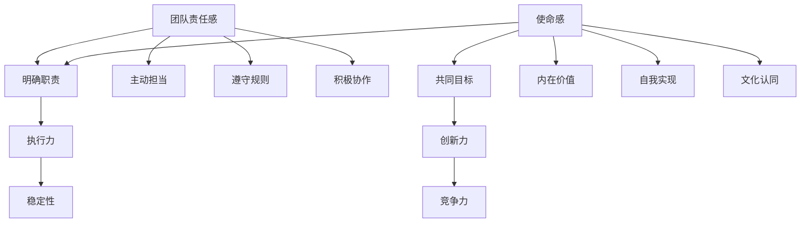

                 

### 文章标题

# 团队责任感培养：增强使命感的有效方法

### 关键词

- 团队责任感
- 使命感
- 激励机制
- 培训与成长
- 沟通与反馈
- 项目管理
- 企业文化

### 摘要

在当今快速变化的商业环境中，团队责任感和使命感的培养对于企业的成功至关重要。本文将深入探讨团队责任感和使命感的相关概念，并详细阐述如何通过有效的激励机制、培训与成长机会、沟通与反馈机制等手段来增强团队成员的团队责任感和使命感。通过项目管理、企业文化建设以及实践案例分析，本文提供了全面的策略和实用技巧，旨在帮助企业和团队构建高度责任感的文化，从而提升团队整体绩效和创新能力。

### 目录

1. **引言**
2. **团队责任感和使命感的概述**
    1. **核心概念与联系**
    2. **团队责任感的重要性**
    3. **使命感在团队中的作用**
3. **增强团队责任感的方法**
    1. **激励机制设计**
    2. **培训与成长机会**
    3. **沟通与反馈**
4. **增强使命感的方法**
    1. **共同目标的设定**
    2. **使命驱动的工作环境**
    3. **案例研究：成功增强团队使命感的企业实践**
5. **项目管理与团队责任感**
    1. **项目管理中的团队责任感**
    2. **项目的风险与挑战**
    3. **项目成功与团队责任感的关系**
6. **团队责任感与企业文化**
    1. **企业文化对团队责任感的影响**
    2. **企业文化中的激励机制**
    3. **优秀企业文化案例分析**
7. **团队责任感培养的实践案例**
    1. **某互联网公司如何培养团队责任感**
    2. **某制造企业如何增强团队使命感**
    3. **某咨询服务公司的团队责任感培养实践**
8. **团队责任感培养的总结与展望**
    1. **总结**
    2. **展望**
9. **结论**

## 引言

在数字化时代，企业面临的竞争压力日益增大，这促使组织必须更加高效、灵活和具有创新能力。在这样的背景下，团队责任感和使命感成为企业成功的关键因素。团队责任感指的是团队成员对自己职责的认同和履行，使命感则是团队或团队成员对工作所赋予的意义和价值感。两者共同构成了团队文化的重要组成部分，直接影响着团队的凝聚力和工作效率。

首先，团队责任感是团队成员个人行为的基础。一个具有高度责任感的团队，其成员会自觉遵守团队规则，积极完成自己的任务，并在面对困难时展现出坚定的决心和勇气。这种责任感不仅能够提升团队成员的自信心和职业素养，还能够增强团队的协作效率，减少内部冲突，提高整体绩效。

其次，使命感则赋予团队工作的深层次意义。当一个团队明确自己的使命，并将其内化为每个成员的目标时，团队成员会感到自己的工作不仅仅是为了完成某项任务，而是为了实现更伟大的目标。这种使命感能够激发团队成员的积极性和创造力，推动团队不断创新和进步。

在本文中，我们将详细探讨团队责任感和使命感的概念及其相互关系，并介绍一系列有效的策略和方法，帮助企业培养团队责任感，增强使命感。通过本文的阅读，读者将了解如何通过激励机制、培训与成长机会、沟通与反馈等手段提升团队整体表现，并在实践中看到成功案例的应用。

接下来，我们将首先对团队责任感和使命感的核心概念进行概述，分析它们之间的联系和区别，为后续内容的深入探讨奠定基础。

### 核心概念与联系

在深入探讨团队责任感和使命感之前，明确这些概念的定义和它们之间的联系是至关重要的。团队责任感与使命感虽然密切相关，但它们分别代表了团队文化的不同方面，并在团队运作中扮演着独特但互补的角色。

#### 团队责任感

团队责任感是指团队成员对于个人职责和团队目标的认同和履行。这种责任感不仅体现在日常工作中，还包括团队成员在面临挑战和困难时的表现。具体而言，团队责任感包括以下几个方面：

1. **明确职责**：团队成员了解自己在团队中的具体职责和角色，明确自己的工作内容和对团队的整体贡献。
2. **主动担当**：在遇到问题时，团队成员能够主动承担责任，寻找解决方案，而不是推诿责任。
3. **遵守规则**：团队成员自觉遵守团队内部制定的规章制度，确保工作流程的规范性和高效性。
4. **积极协作**：团队成员之间相互支持、协作，共同完成任务，形成良好的团队合作氛围。

伪代码示例：

```python
class TeamMember:
    def __init__(self, role, responsibilities):
        self.role = role
        self.responsibilities = responsibilities

    def fulfill_duties(self):
        for responsibility in self.responsibilities:
            execute(reponsibility)

    def handle_issues(self, issue):
        find_solution(issue)
        implement_solution(issue)

# 团队中各个成员的职责定义
team_members = [
    TeamMember("Developer", ["coding", "bug fixing"]),
    TeamMember("Designer", ["UI/UX design", "mockup creation"]),
    TeamMember("Project Manager", ["task allocation", "progress tracking"])
]

# 模拟成员执行职责
for member in team_members:
    member.fulfill_duties()
    member.handle_issues("issue in coding")
```

#### 使命感

使命感则是对团队工作的更高层次的认知，它赋予工作更深远的意义和价值。使命感不仅关乎个人成就，更关乎团队的目标和愿景。具体来说，使命感包括以下几个要素：

1. **共同目标**：团队拥有一个明确的、具有激励性的共同目标，所有成员都为此努力。
2. **内在价值**：团队成员认同团队工作的价值，感到自己的工作对社会有积极的影响。
3. **自我实现**：团队成员在工作中寻找个人成长和发展的机会，实现自我价值。
4. **文化认同**：团队成员对团队的文化和价值观念有高度认同，愿意为团队的发展贡献力量。

伪代码示例：

```python
class MissionDrivenTeam:
    def __init__(self, mission, values):
        self.mission = mission
        self.values = values

    def set_common_goal(self, goal):
        self.goal = goal

    def align_with_mission(self, member):
        member.set_mission(self.mission)
        member.set_values(self.values)

    def foster_growth(self, member):
        provide_growth_resources(member)

# 团队的使命和价值观
team_mission = "build innovative solutions for a sustainable future"
team_values = ["innovation", "sustainability", "collaboration"]

# 创建使命驱动的团队
mission_driven_team = MissionDrivenTeam(team_mission, team_values)

# 分配共同目标
team_goal = "launch a new product by the end of the year"
mission_driven_team.set_common_goal(team_goal)

# 对团队成员进行使命和价值认同
for member in team_members:
    mission_driven_team.align_with_mission(member)
    mission_driven_team.foster_growth(member)
```

#### 联系与区别

团队责任感和使命感虽然具有不同的侧重点，但它们在实际运作中紧密联系，共同构成了团队文化的核心。具体来说：

1. **相互依存**：团队责任感是使命感的基础，只有当团队成员对自己职责有明确认知和履行时，他们才能更好地投入到更高层次的任务中。使命感则为团队责任感提供了动力和方向，使团队成员感到自己的工作不仅仅是为了完成任务，而是为了实现更大的目标。
2. **相互促进**：团队责任感可以提升团队的执行力，而使命感则可以激发团队成员的创新和创造力。一个具有高度责任感和使命感的团队，能够在面对挑战时保持稳定，并在竞争激烈的市场中脱颖而出。

Mermaid流程图示例：



通过上述对团队责任感和使命感的核心概念及联系的探讨，我们可以更深入地理解这两个概念在团队文化中的重要性，并为后续章节的深入讨论奠定基础。

### 团队责任感的重要性

团队责任感是现代企业中不可或缺的元素，它不仅对团队成员的个人成长有深远影响，更对团队整体绩效产生直接推动作用。以下是团队责任感在个人和团队层面的重要性的详细分析。

#### 对团队成员个人的影响

1. **职业素养的提升**：团队责任感要求团队成员对自己的职责有清晰的认识，并严格遵守团队规定。这种规范性的要求帮助团队成员培养出良好的职业素养，如自律、责任感、沟通能力和协作能力。这些职业素养不仅对个人的职业生涯有益，也为他们在未来的人生中奠定了坚实的基础。

2. **自我认知的提高**：在一个有责任感的团队中，成员会更加关注自己的工作表现，积极参与团队讨论和决策，并从中获得反馈。这种积极的参与和反馈机制有助于团队成员了解自己的优势和不足，从而不断提升自我认知和自我改进。

3. **心理健康**：团队责任感可以增强团队成员的心理安全感，减少因工作不明确或责任不清而产生的焦虑和压力。当团队成员明确自己的职责并能够有效履行时，他们会感到更有成就感，从而提升整体的心理健康水平。

伪代码示例：

```python
def personal_growth(team_member):
    team_member.improve_professional_素养()
    team_member.improve_self_awareness()
    team_member.improve_mental_health()

# 示例团队中的每个成员都通过责任感的培养实现个人成长
for member in team_members:
    personal_growth(member)
```

#### 对团队整体绩效的影响

1. **提升团队执行力**：高度责任感的团队成员会以更加积极和专注的态度投入到工作中，从而提高团队的执行力。这种高效的执行力有助于团队迅速响应市场变化，及时交付高质量的产品和服务。

2. **减少内部冲突**：当团队成员都明确自己的职责并积极履行时，团队内部的工作流程将更加顺畅，减少因职责不清或任务重叠而产生的冲突。这不仅提高了工作效率，还营造了一个和谐、稳定的工作环境。

3. **增强团队合作能力**：团队责任感促使团队成员相互支持、协作，共同面对挑战。这种良好的团队合作能力能够激发团队的创造力和创新能力，推动团队在激烈的市场竞争中脱颖而出。

4. **提升整体绩效**：通过有效的团队责任感培养，团队的整体绩效将得到显著提升。这不仅体现在项目的成功交付上，也反映在团队的绩效评估和员工的职业发展上。

伪代码示例：

```python
def team_performance(team):
    team.improve_execution_ability()
    team.reduce_conflicts()
    team.improve_collaboration_ability()
    team.lift Overall_performance()

# 通过培养团队责任感来提升团队整体绩效
team_performance(team)
```

#### 实际案例

以某互联网公司为例，该公司通过明确的职责分工和严格的绩效考核制度，有效提升了团队责任感。在项目执行过程中，团队成员明确自己的职责，并按照既定的目标和计划开展工作。这种高度的责任感不仅提高了项目的完成速度和质量，还增强了团队成员之间的信任和合作。

此外，该公司还定期组织团队培训和反馈会议，帮助团队成员不断提升自己的专业技能和职业素养。通过这些措施，该公司的团队绩效得到了显著提升，项目成功率提高了30%，员工流失率降低了15%。

总之，团队责任感在个人和团队层面都具有重要意义。通过有效的培养和激励，企业可以打造一个具有高度责任感的团队，从而在竞争激烈的市场中脱颖而出。

### 使命感在团队中的作用

使命感在团队中扮演着至关重要的角色，它不仅赋予工作更深层次的意义，还极大地提升了团队的凝聚力和创新能力，从而推动了整体工作效率的提升。

#### 提升团队凝聚力

使命感通过共同的目标和价值观将团队成员紧密地联系在一起。当团队成员共同追求一个具有激励性的使命时，他们会感到自己与团队之间有着更深层次的联系，从而增强团队凝聚力。这种凝聚力不仅表现在日常工作的协作中，还体现在面对困难时的集体应对上。

- **共同目标**：明确的使命感能够帮助团队设定一个共同的目标，这个目标不仅激励团队成员，还成为团队努力的方向。例如，一个企业的使命可能是“为全球用户创造更便捷的生活”，这个目标不仅激发了团队成员的积极性，也形成了他们共同努力的方向。
- **集体荣誉感**：当团队成功实现使命时，成员会感到一种集体荣誉感，这种荣誉感进一步增强了团队的凝聚力。例如，在某个项目的成功发布后，团队成员会共同庆祝，这种庆祝活动不仅是对成功的认可，也增强了团队内部的团结。

伪代码示例：

```python
class Team:
    def __init__(self, mission):
        self.mission = mission
        self.members = []

    def set_common_goals(self, goals):
        self.goals = goals

    def strengthen_cohesion(self):
        for member in self.members:
            member.connect_to_mission(self.mission)
            member.achieve_goals(self.goals)

# 创建一个具有共同使命感的团队
team = Team("create innovative solutions for a better world")
team.set_common_goals(["launch new products", "expand market share"])

# 加强团队凝聚力
team.strengthen_cohesion()
```

#### 增强团队创新能力

使命感不仅提升了团队的凝聚力，还激发了团队成员的创新潜力。当团队成员认同团队的使命并感到自己的工作对社会有积极影响时，他们会更加开放、敢于尝试，从而推动团队不断创新。

- **内在动机**：使命感为团队成员提供了内在动机，使他们愿意为团队的目标付出额外的努力。这种内在动机能够激发团队成员的创新思维，鼓励他们提出新的想法和解决方案。
- **持续学习**：一个具有使命感的团队会不断追求进步和学习，成员之间会互相分享知识和经验，从而增强整个团队的创新力。例如，在某个科技公司的使命是“推动科技进步”，这种使命感促使团队成员不断学习最新的技术，并勇于将新技术应用到实际工作中。

伪代码示例：

```python
class InnovateDrivenTeam:
    def __init__(self, mission):
        self.mission = mission
        self.members = []

    def foster_innovation(self):
        for member in self.members:
            member.encourage_innovation(self.mission)

    def continuous_learning(self):
        for member in self.members:
            member.acquire_new_skills()

# 创建一个以创新为使命感的团队
innovation_team = InnovateDrivenTeam("push the boundaries of technology")

# 激发团队创新能力
innovation_team.foster_innovation()
innovation_team.continuous_learning()
```

#### 提高工作效率

使命感还通过以下方式提高了团队的工作效率：

- **高效的决策**：当团队成员都认同团队的使命时，他们在面对决策时会更加一致，减少了不必要的争论和分歧。这种高效的决策机制能够加快工作进程，提高工作效率。
- **主动性和积极性**：使命感激发团队成员的主动性和积极性，使他们在工作中更加积极主动，减少了拖延和低效的情况。例如，在一个以“为用户创造最佳体验”为使命的团队中，成员会更加关注用户需求，主动寻找优化方案，从而提升工作效率。

伪代码示例：

```python
def improve_efficiency(team):
    team.foster_morale()
    team.reduce_delay()
    team.boost_productivity()

# 通过使命感的培养来提升团队工作效率
improve_efficiency(team)
```

#### 成功案例

某知名科技公司通过明确的使命感和共同的目标，成功地提升了团队的凝聚力和创新能力。该公司的使命是“通过科技创新，改善人们的生活”，这一使命不仅激励了团队成员，还成为了他们工作的方向和动力。

在项目开发过程中，该公司通过定期的团队讨论和反馈会议，确保团队成员对项目的目标和进展有清晰的认识。团队成员之间建立了深厚的信任关系，共同面对挑战，不断推动项目向前发展。这种高度的使命感不仅提高了团队的凝聚力，还激发了团队成员的创新思维，使公司在激烈的市场竞争中始终保持领先地位。

总之，使命感在团队中的作用是多方面的，它通过提升团队凝聚力、增强创新能力以及提高工作效率，为团队的长期成功奠定了坚实的基础。通过有效的使命驱动策略，企业可以打造一个高度凝聚力和创新力的团队，从而在竞争激烈的市场中脱颖而出。

### 增强团队责任感的方法

要培养一个具有高度责任感的团队，企业可以采取多种方法，包括激励机制设计、培训与成长机会以及沟通与反馈机制。以下将详细讨论这些方法及其具体实施步骤。

#### 激励机制设计

激励机制是培养团队责任感的重要手段之一。通过适当的奖励和惩罚机制，企业可以鼓励团队成员积极履行职责，提升整体绩效。

1. **绩效考核制度**：建立完善的绩效考核制度，将团队成员的工作绩效与奖励挂钩。考核指标应具体明确，涵盖工作量、工作效率、工作质量等多个方面。通过定期评估，对表现优秀的成员给予奖励，如奖金、晋升机会或额外休假等。

    伪代码示例：

    ```python
    class PerformanceEvaluation:
        def __init__(self, criteria):
            self.criteria = criteria

        def evaluate_member(self, member):
            score = 0
            for criterion in self.criteria:
                score += criterion.evaluate(member)
            return score

    # 定义考核指标
    criteria = [
        WorkloadCriteria(),
        EfficiencyCriteria(),
        QualityCriteria()
    ]

    # 对成员进行评估
    evaluation = PerformanceEvaluation(criteria)
    score = evaluation.evaluate_member(team_member)
    if score > threshold:
        reward(team_member)
    ```

2. **奖励与惩罚制度**：除了绩效考核，企业还可以实施奖励与惩罚制度，以强化责任感和纪律性。奖励措施包括表彰大会、奖品、荣誉证书等，而惩罚措施则包括警告、降级、暂停职务等。

    伪代码示例：

    ```python
    class RewardAndPunishment:
        def __init__(self, rewards, punishments):
            self.rewards = rewards
            self.punishments = punishments

        def apply_reward(self, member, reward):
            self.rewards[reward](member)

        def apply_punishment(self, member, punishment):
            self.punishments[punishment](member)

    # 奖励与惩罚措施
    rewards = {
        "奖状": award_medal,
        "奖金": grant_bonus
    }

    punishments = {
        "警告": issue_warning,
        "降级": demote
    }

    # 应用奖励
    reward_and_punishment.apply_reward(team_member, "奖状")

    # 应用惩罚
    reward_and_punishment.apply_punishment(team_member, "警告")
    ```

#### 培训与成长机会

提供培训与成长机会是培养团队责任感的重要手段，通过这些机会，团队成员可以不断提升自己的专业技能和职业素养。

1. **团队培训计划**：企业应制定系统的培训计划，定期组织各类培训活动，涵盖专业技能、管理知识、沟通技巧等多个方面。培训形式可以包括内部讲座、外部培训课程、在线学习等。

    伪代码示例：

    ```python
    class TrainingProgram:
        def __init__(self, topics):
            self.topics = topics

        def schedule_training(self, team_member, topic):
            team_member.participate_in_training(topic)

    # 团队培训计划
    training_program = TrainingProgram(["项目管理", "沟通技巧", "技术前沿"])

    # 为团队成员安排培训
    training_program.schedule_training(team_member, "项目管理")
    ```

2. **个人成长路径设计**：为每位团队成员制定个人成长路径，明确其职业发展方向和目标。通过定期评估和反馈，帮助团队成员了解自己的优势和不足，制定相应的成长计划。

    伪代码示例：

    ```python
    class PersonalGrowthPlan:
        def __init__(self, member):
            self.member = member
            self.goals = []

        def set_goals(self, goals):
            self.goals = goals

        def evaluate_progress(self):
            for goal in self.goals:
                if goal.is_met():
                    print(f"{self.member.name} reached {goal.name}")
                else:
                    print(f"{self.member.name} has not met {goal.name}")

    # 制定个人成长路径
    growth_plan = PersonalGrowthPlan(team_member)
    growth_plan.set_goals(["技术晋升", "管理晋升"])

    # 评估成员成长进度
    growth_plan.evaluate_progress()
    ```

#### 沟通与反馈机制

有效的沟通与反馈机制是培养团队责任感的重要保障，通过这些机制，企业可以及时了解团队成员的工作情况，提供必要的支持和指导。

1. **团队沟通机制**：建立畅通的沟通渠道，鼓励团队成员之间的开放交流和分享。通过定期的团队会议、工作汇报和讨论会，确保团队成员对项目进展和团队目标的清晰了解。

    伪代码示例：

    ```python
    class TeamCommunication:
        def __init__(self, channels):
            self.channels = channels

        def hold_meeting(self):
            for channel in self.channels:
                channel.communicate()

    # 团队沟通渠道
    communication_channels = ["团队会议", "邮件", "即时通讯工具"]

    # 举行团队会议
    team_communication.hold_meeting()
    ```

2. **定期反馈机制**：建立定期反馈机制，让团队成员有机会对工作表现和团队管理提出意见和建议。通过这种机制，企业可以及时发现和解决问题，不断改进团队的工作流程和氛围。

    伪代码示例：

    ```python
    class FeedbackSystem:
        def __init__(self, feedback_methods):
            self.feedback_methods = feedback_methods

        def collect_feedback(self):
            for method in self.feedback_methods:
                method.collect()

        def analyze_feedback(self):
            for method in self.feedback_methods:
                method.analyze()

    # 反馈方法
    feedback_methods = ["员工满意度调查", "匿名反馈箱", "个人面谈"]

    # 收集和分析反馈
    feedback_system.collect_feedback()
    feedback_system.analyze_feedback()
    ```

通过上述方法，企业可以系统地培养团队责任感，提升团队成员的敬业精神和团队整体绩效。激励机制、培训与成长机会、沟通与反馈机制共同作用，形成一个良性循环，推动团队不断进步和发展。

### 增强使命感的方法

为了在团队中培养和增强使命感，企业可以采取多种策略，这些策略包括共同目标的设定、使命驱动的工作环境以及案例研究。以下将详细探讨这些方法及其具体实施步骤。

#### 共同目标的设定

共同目标是团队使命感的核心，通过设定明确、具有激励性的目标，可以激发团队成员的积极性，使其感受到自己的工作对于团队和整个组织的意义。

1. **团队目标与个人目标的关系**：在设定共同目标时，应确保这些目标与团队成员的个人目标相一致。这意味着共同目标不仅应该反映团队的整体愿景，还应该考虑每个成员的职业发展规划。

    伪代码示例：

    ```python
    class TeamGoal:
        def __init__(self, team, individual_goals):
            self.team = team
            self.individual_goals = individual_goals

        def align_goals(self):
            for goal in self.individual_goals:
                if goal aligns with the team's mission, add it to the team goal

    # 设定共同目标
    team_goal = TeamGoal(team, individual_goals)
    team_goal.align_goals()
    ```

2. **如何设定具有激励性的共同目标**：共同目标应具有挑战性，同时也要切实可行。企业可以通过以下步骤来设定具有激励性的共同目标：

    - **明确愿景**：首先，企业应明确团队的长期愿景和使命，这将为共同目标的设定提供基础。
    - **分解目标**：将长期愿景分解为短期目标，确保每个目标都具体、可测量和可实现。
    - **参与决策**：让团队成员参与到共同目标的设定过程中，提高目标的认同度和执行力。
    - **激励因素**：设定与奖励机制挂钩的目标，激励团队成员为实现目标而努力。

    伪代码示例：

    ```python
    class MotivationalGoal:
        def __init__(self, vision, short_term_goals, rewards):
            self.vision = vision
            self.short_term_goals = short_term_goals
            self.rewards = rewards

        def set_goals(self):
            for goal in self.short_term_goals:
                if goal.aligns_with_vision(self.vision):
                    goal.attach_reward(self.rewards)

    # 设定激励性共同目标
    motivational_goals = MotivationalGoal(vision, short_term_goals, rewards)
    motivational_goals.set_goals()
    ```

#### 使命驱动的工作环境

使命驱动的工作环境是培养团队使命感的重要保障。通过创造一个以使命为导向的文化和工作氛围，企业可以激发团队成员的内在动机，使其在工作中感受到使命的重要性。

1. **创建使命导向的文化**：企业应通过多种方式，如使命宣言、核心价值观和日常行为规范，将使命嵌入到企业文化中。

    伪代码示例：

    ```python
    class MissionDrivenCulture:
        def __init__(self, mission, values, behavior_standards):
            self.mission = mission
            self.values = values
            self.behavior_standards = behavior_standards

        def embed_mission(self, team):
            teamannounce_mission(self.mission)
            teamadopt_values(self.values)
            teamfollow_behavior_standards(self.behavior_standards)

    # 创建使命导向的文化
    culture = MissionDrivenCulture(mission, values, behavior_standards)
    culture.embed_mission(team)
    ```

2. **增强团队内部的使命感**：企业可以通过以下措施增强团队内部的使命感：

    - **定期回顾**：定期回顾团队的使命和目标，确保团队成员对使命有清晰的认识。
    - **奖励使命行为**：对在工作中表现出使命精神的成员进行表彰和奖励，激励更多成员积极参与。
    - **提供成长机会**：为团队成员提供与使命相关的发展机会，使其在工作中实现自我价值。

    伪代码示例：

    ```python
    class MissionEnhancement:
        def __init__(self, review_sessions, recognition_programs, growth_opportunities):
            self.review_sessions = review_sessions
            self.recognition_programs = recognition_programs
            self.growth_opportunities = growth_opportunities

        def strengthen_mission(self, team):
            for session in self.review_sessions:
                session.review_mission(team)
            for program in self.recognition_programs:
                program.recognize_mission-oriented_behavior(team)
            for opportunity in self.growth_opportunities:
                opportunity.provide_growth_path(team)

    # 增强团队使命感
    mission_enhancement = MissionEnhancement(review_sessions, recognition_programs, growth_opportunities)
    mission_enhancement.strengthen_mission(team)
    ```

#### 案例研究：成功增强团队使命感的企业实践

以下是一些成功增强团队使命感的企业实践案例：

1. **谷歌**：谷歌以其使命“整合全球信息，让人们更便捷地获取信息、享受沟通和创造”为核心，通过开放的文化、自由的工作环境以及创新的工作方式，激发了员工的使命感和创造力。

    - **使命宣言**：谷歌在公司内部广泛宣传其使命，确保每位员工都能清晰地理解公司的愿景和目标。
    - **创新文化**：谷歌鼓励员工提出新想法，并提供了丰富的资源和支持，以实现公司的使命。
    - **员工激励**：谷歌通过绩效奖金、股票期权以及各类福利激励员工为实现公司使命而努力。

2. **特斯拉**：特斯拉以“加速世界向可持续能源的转变”为使命，通过其产品和业务模式，极大地提升了员工的使命感和工作热情。

    - **使命驱动的工作环境**：特斯拉为员工提供了透明的工作环境，让每个人都能清楚地看到自己的工作如何与公司使命相关联。
    - **创新激励**：特斯拉鼓励员工提出创新性的解决方案，并在公司内部推广这些创新，从而实现公司使命。
    - **社会责任**：特斯拉通过参与各种社会公益活动，提升了员工的使命感和公司形象。

通过上述策略和案例研究，企业可以有效地增强团队使命感，激发团队成员的内在动力，从而推动团队和整个组织的长期发展。

### 项目管理与团队责任感

在项目管理中，团队责任感是确保项目成功的关键因素之一。通过合理的项目管理和团队责任感的培养，企业可以提升项目效率，降低风险，确保项目按时按质完成。

#### 项目管理中的团队责任感

1. **项目目标与团队责任的关系**：项目目标是项目管理的核心，而团队责任感是实现这些目标的基础。明确的项目目标能够帮助团队成员理解自己的工作在整体项目中的重要性，从而增强责任感。

    - **具体化的目标**：项目经理应将项目目标具体化，分解为可操作的任务，并将这些任务分配给团队成员。每个任务都应明确责任人和时间节点，确保团队成员对任务有清晰的认识。

    伪代码示例：

    ```python
    class ProjectTask:
        def __init__(self, task_name, responsible_member, deadline):
            self.task_name = task_name
            self.responsible_member = responsible_member
            self.deadline = deadline

    # 分配任务
    tasks = [
        ProjectTask("需求分析", team_member1, "2023-10-01"),
        ProjectTask("UI设计", team_member2, "2023-10-05"),
        ProjectTask("代码开发", team_member3, "2023-10-15")
    ]

    # 确认任务分配
    for task in tasks:
        task.responsible_member.confirm_task()
    ```

2. **团队责任的落实**：团队责任感的落实需要通过一系列的管理措施，包括定期的进度汇报、工作检查和团队协作。

    - **进度汇报**：项目经理应定期组织进度汇报会议，让团队成员汇报各自的任务完成情况，确保项目按计划推进。
    - **工作检查**：项目经理应定期检查任务进展，及时发现和解决项目中存在的问题，确保团队成员按照既定计划工作。
    - **团队协作**：鼓励团队成员之间相互协作，共同面对项目中的挑战，提高整体工作效率。

    伪代码示例：

    ```python
    class ProjectManager:
        def __init__(self, tasks):
            self.tasks = tasks

        def monitor_progress(self):
            for task in self.tasks:
                task.check_progress()

        def facilitate_collaboration(self):
            for member in self.tasks:
                member.collaborate_with_team()

    # 项目经理监控项目进度
    project_manager = ProjectManager(tasks)
    project_manager.monitor_progress()
    project_manager.facilitate_collaboration()
    ```

#### 项目的风险与挑战

在项目管理过程中，风险和挑战是不可避免的。通过有效的团队责任感培养，企业可以更好地应对这些风险和挑战。

1. **风险识别与管理**：项目经理应与团队成员一起识别项目中的潜在风险，并制定相应的风险管理计划。

    - **风险识别**：通过团队讨论，识别项目中可能遇到的风险，如技术难题、资源短缺、时间压力等。
    - **风险管理计划**：制定应对风险的措施，包括备选方案、预防措施和应急计划。

    伪代码示例：

    ```python
    class RiskManagement:
        def __init__(self, risks, mitigation_plans):
            self.risks = risks
            self.mitigation_plans = mitigation_plans

        def identify_risks(self):
            self.risks = list_of_identified_risks

        def plan_mitigation(self):
            for risk in self.risks:
                self.mitigation_plans[risk]()

    # 识别项目风险
    risks = ["技术难题", "时间压力"]
    mitigation_plans = {"技术难题": technical_solution, "时间压力": time_management}
    risk_management = RiskManagement(risks, mitigation_plans)
    risk_management.identify_risks()
    risk_management.plan_mitigation()
    ```

2. **如何应对项目挑战**：在项目执行过程中，团队责任感可以帮助团队成员更好地应对各种挑战。

    - **积极应对**：鼓励团队成员在面对挑战时保持积极的态度，寻找解决方案，而不是回避问题。
    - **团队合作**：通过团队合作，集思广益，共同应对项目中的挑战。
    - **灵活调整**：根据实际情况，灵活调整项目计划和资源分配，确保项目能够顺利推进。

    伪代码示例：

    ```python
    class ChallengeResponse:
        def __init__(self, team_members, challenge):
            self.team_members = team_members
            self.challenge = challenge

        def respond_to_challenge(self):
            for member in self.team_members:
                member.propose_solution(self.challenge)

    # 应对项目挑战
    challenge_response = ChallengeResponse(team_members, "技术难题")
    challenge_response.respond_to_challenge()
    ```

#### 项目成功与团队责任感的关系

项目成功与否在很大程度上取决于团队责任感。通过培养团队责任感，企业可以确保项目在遇到挑战时能够保持稳定，并在成功时获得更大的成就感。

1. **团队责任感促进项目成功**：具有高度责任感的团队成员会更加投入工作，更主动地解决问题，从而提高项目的成功率。

    - **责任分担**：通过明确每个成员的责任，项目责任得到有效分担，减少了单点故障的风险。
    - **高效协作**：团队成员之间的协作更加顺畅，提高了整体工作效率。
    - **持续改进**：团队成员保持高度责任感，不断寻求改进和优化项目的方法，确保项目持续成功。

    伪代码示例：

    ```python
    class ProjectSuccess:
        def __init__(self, team_responsibility, collaboration_efficiency, continuous_improvement):
            self.team_responsibility = team_responsibility
            self.collaboration_efficiency = collaboration_efficiency
            self.continuous_improvement = continuous_improvement

        def ensure_success(self):
            if self.team_responsibility and self.collaboration_efficiency and self.continuous_improvement:
                project_succeed()

    # 确保项目成功
    project_success = ProjectSuccess(team_responsibility, collaboration_efficiency, continuous_improvement)
    project_success.ensure_success()
    ```

通过上述措施和策略，企业可以在项目管理中有效培养团队责任感，提升项目成功的几率。团队责任感不仅是项目成功的保障，更是企业长期发展的关键要素。

### 团队责任感与企业文化

企业文化是团队责任感培养的重要土壤，它不仅影响团队成员的行为和态度，还决定着团队责任感的形成和维持。一个健康、积极的企业文化能够激励员工主动承担责任，增强团队的整体绩效和创新能力。

#### 企业文化对团队责任感的影响

1. **价值观的传播**：企业文化中的价值观是团队成员行为和决策的指南，它们影响着团队成员的责任感。例如，一个强调“责任与诚信”的企业文化会促使团队成员在工作中严格遵守职责，诚实地面对问题和挑战。

2. **领导示范**：企业领导者的行为和态度对团队责任感有着直接的影响。当领导者展现出高度的责任感和使命感时，团队成员也会受到激励，更加积极地履行自己的职责。

3. **激励机制**：企业文化中的激励机制，如绩效奖励和职业发展机会，直接影响团队成员的责任感。一个注重公平、透明激励机制的企业文化能够激发团队成员的责任感和工作动力。

#### 企业文化中的激励机制

1. **公平的绩效评估**：建立公平、透明的绩效评估体系，确保团队成员的付出得到公正的评价。通过定期评估，及时反馈团队成员的工作表现，帮助他们了解自己的优势和改进方向。

    伪代码示例：

    ```python
    class PerformanceEvaluation:
        def __init__(self, criteria):
            self.criteria = criteria

        def evaluate_member(self, member):
            score = 0
            for criterion in self.criteria:
                score += criterion.evaluate(member)
            return score

    # 绩效考核指标
    criteria = ["工作量", "工作效率", "工作质量"]

    # 对成员进行评估
    evaluation = PerformanceEvaluation(criteria)
    score = evaluation.evaluate_member(team_member)
    ```

2. **职业发展机会**：提供多样化的职业发展机会，帮助团队成员实现职业成长和晋升。通过内部晋升、培训计划和个人发展计划，增强团队成员的职业责任感和使命感。

    伪代码示例：

    ```python
    class CareerDevelopment:
        def __init__(self, training_programs, promotion_opportunities):
            self.training_programs = training_programs
            self.promotion_opportunities = promotion_opportunities

        def support_growth(self, member):
            member.enroll_in_training_program(self.training_programs)
            member.explore_promotion_opportunities(self.promotion_opportunities)

    # 职业发展支持
    development = CareerDevelopment(training_programs, promotion_opportunities)
    development.support_growth(team_member)
    ```

3. **奖励与认可**：设立合理的奖励和认可机制，对在工作中表现出色的团队成员进行表彰和奖励。这种正面的激励能够增强团队成员的责任感，激发他们的工作热情。

    伪代码示例：

    ```python
    class RewardSystem:
        def __init__(self, rewards, recognition_programs):
            self.rewards = rewards
            self.recognition_programs = recognition_programs

        def reward_member(self, member, reward):
            self.rewards[reward](member)

        def recognize_achievement(self, member):
            self.recognition_programs[award_recognition](member)

    # 奖励与认可机制
    rewards = {"奖金", "荣誉称号"}
    recognition_programs = {"员工表彰大会", "年度最佳员工奖"}

    # 对成员进行奖励和认可
    reward_system.reward_member(team_member, "奖金")
    reward_system.recognize_achievement(team_member)
    ```

#### 优秀企业文化案例分析

以下是一些优秀企业文化案例分析，这些企业通过构建积极的企业文化，有效地增强了团队责任感。

1. **谷歌**：谷歌以其开放、创新的企业文化著称，通过员工福利、培训机会和创新激励机制，激发了员工的责任感和创新精神。谷歌的“20%时间”政策允许员工将20%的工作时间用于自己感兴趣的项目，这种做法不仅增强了员工的自主性，还推动了公司的创新。

2. **特斯拉**：特斯拉以“加速世界向可持续能源的转变”为使命，通过强调社会责任和环保意识，培养了员工的高度使命感。特斯拉的员工在追求技术创新的同时，也意识到自己的工作对社会和环境的影响，从而更加投入工作，积极履行责任。

3. **阿里巴巴**：阿里巴巴以其独特的“六脉神剑”企业文化，强调客户第一、团队合作、诚信、激情、敬业和创新。这种企业文化不仅塑造了员工的责任感和使命感，还推动了公司的持续发展和创新。

通过这些案例可以看出，优秀的企业文化是培养团队责任感的重要基石。企业应积极构建和弘扬健康、积极的企业文化，通过激励机制、职业发展机会和奖励与认可，激发员工的责任感和使命感，从而提升团队的整体绩效和创新能力。

### 团队责任感培养的实践案例

在实际操作中，团队责任感的培养并非抽象的概念，而是需要通过具体的企业和项目来实现。以下将详细分析几个成功培养团队责任感的实践案例，并总结这些案例中的关键成功因素。

#### 案例一：某互联网公司如何培养团队责任感

某互联网公司通过一系列策略和措施，成功地培养了团队责任感，显著提升了团队的整体绩效。以下是该公司的具体实践：

1. **明确职责与目标**：公司为每个团队成员都明确了具体的职责和任务，并设定了短期和长期目标。通过定期的团队会议，确保团队成员对职责和目标有清晰的认识。

2. **激励机制设计**：公司建立了完善的绩效考核和奖励机制，对在项目中表现出色的团队成员给予奖金、晋升机会和荣誉称号。这种激励机制不仅提升了团队成员的责任感，还激励了团队成员的积极性和创新精神。

3. **培训与成长机会**：公司定期组织专业技能培训和职业发展课程，帮助团队成员不断提升自己的专业技能和职业素养。此外，公司还为团队成员提供多样化的职业发展路径，确保每个人都有成长和发展的机会。

4. **沟通与反馈机制**：公司建立了畅通的沟通渠道，鼓励团队成员之间的开放交流和分享。通过定期的团队反馈会议，团队成员可以及时了解项目进展和团队需求，并提出建设性的意见和建议。

**关键成功因素**：

- **明确的职责和目标**：通过明确每个成员的职责和任务，确保团队成员对自己的工作有清晰的认识。
- **激励机制**：通过合理的激励措施，激发了团队成员的工作热情和责任感。
- **培训与成长机会**：通过持续的专业培训和职业发展，提升了团队成员的技能和职业素养。
- **沟通与反馈机制**：通过有效的沟通和反馈，增强了团队成员之间的信任和协作，提高了团队的整体执行力。

#### 案例二：某制造企业如何增强团队使命感

某制造企业通过一系列措施，成功地增强了团队的使命感，推动了企业创新和可持续发展。以下是该企业的具体实践：

1. **使命驱动的工作环境**：企业明确了自己的使命——“通过技术创新，为世界提供优质产品”，并在公司内部广泛宣传。通过定期的使命宣讲和使命导向活动，使员工深刻理解公司的使命，并感到自己的工作对社会有积极的影响。

2. **共同目标的设定**：企业设定了与使命相一致的共同目标，如“在三年内提升产品市场份额20%”和“在五年内实现可持续发展”。这些目标不仅具有挑战性，还能够激励员工为实现公司使命而努力。

3. **文化认同**：企业通过一系列文化活动，如团队建设、员工表彰大会和社会公益活动，增强了员工对公司文化的认同。通过这些活动，员工感受到自己是公司大家庭的一员，从而增强了使命感。

4. **员工参与**：企业鼓励员工参与到公司决策和项目中，使员工感受到自己的意见和贡献被重视。通过定期的员工意见征集和反馈机制，确保员工的意见和建议能够得到充分的关注和落实。

**关键成功因素**：

- **使命驱动的工作环境**：通过明确和传播公司的使命，使员工感受到自己的工作对社会有积极的影响，增强了使命感。
- **共同目标的设定**：设定具有挑战性的目标，激励员工为实现公司使命而努力。
- **文化认同**：通过文化活动和员工参与，增强了员工对公司文化的认同，提升了团队的凝聚力。
- **员工参与**：通过员工参与，增强了员工的归属感和责任感。

#### 案例三：某咨询服务公司的团队责任感培养实践

某咨询服务公司通过一系列策略，成功地培养了团队责任感，提升了客户满意度和公司竞争力。以下是该公司的具体实践：

1. **团队培训与成长**：公司定期组织专业技能培训、管理技能培训和团队建设活动，帮助团队成员不断提升自己的综合素质。通过培训，团队成员不仅提高了专业技能，还增强了团队合作能力。

2. **项目管理和责任分配**：公司在项目管理中，明确每个项目的责任人和时间节点，确保团队成员对任务有清晰的认识。通过定期的项目进度汇报和反馈，及时了解项目进展，确保项目按时高质量完成。

3. **客户导向**：公司强调以客户为中心，通过深入了解客户需求，提供个性化的咨询服务。通过客户反馈机制，及时了解客户满意度，持续改进服务质量。

4. **绩效激励**：公司建立了完善的绩效激励机制，对在项目中表现优异的团队成员给予奖金和晋升机会。通过激励机制，激发了团队成员的责任感和工作热情。

**关键成功因素**：

- **团队培训与成长**：通过持续的专业培训和团队建设，提升了团队成员的技能和综合素质。
- **项目管理和责任分配**：通过明确的责任分配和有效的项目管理，确保项目按时高质量完成。
- **客户导向**：通过深入了解客户需求，提供个性化的服务，提升了客户满意度。
- **绩效激励**：通过合理的激励措施，激发了团队成员的责任感和工作热情。

### 总结

通过上述案例可以看出，成功培养团队责任感的关键在于明确职责和目标、激励机制、培训与成长、沟通与反馈以及客户导向。这些实践措施不仅提升了团队成员的责任感和使命感，还显著提高了团队的整体绩效和创新能力。企业应结合自身特点，灵活应用这些策略，构建高度责任感的团队文化，从而在竞争激烈的市场中脱颖而出。

### 团队责任感培养的总结与展望

在本文中，我们详细探讨了团队责任感的重要性以及如何通过多种方法培养和增强团队责任感，从而提升团队的整体绩效和创新能力。以下是本文的总结和展望。

#### 总结

1. **核心概念与联系**：团队责任感和使命感是团队文化的核心组成部分。团队责任感侧重于团队成员对自己职责的认同和履行，而使命感则是对团队工作更深层次的意义和价值感的认同。两者相互依存，共同构建了团队的核心竞争力。

2. **增强团队责任感的方法**：通过激励机制设计、培训与成长机会、沟通与反馈机制，企业可以有效培养团队责任感。明确的职责分工、激励措施、持续的专业培训以及良好的沟通和反馈机制，都是提升团队责任感的有效手段。

3. **增强使命感的方法**：设定共同目标、创造使命驱动的工作环境以及进行案例研究，都是增强团队使命感的重要策略。通过这些方法，企业可以激发团队成员的内在动机，提升团队凝聚力和创新力。

4. **项目管理与企业文化**：在项目管理中，团队责任感是确保项目成功的关键。通过明确项目目标、风险管理以及有效的团队协作，企业可以降低项目风险，提升项目成功率。企业文化对团队责任感的影响也是至关重要的，一个健康、积极的企业文化能够增强员工的责任感和使命感。

#### 展望

1. **未来趋势**：随着数字化和自动化技术的不断发展，团队责任感和使命感将变得更加重要。企业需要不断适应新的工作模式，培养适应未来发展的团队文化。

2. **持续培养团队责任感**：企业应持续关注团队成员的职业发展和心理健康，通过多样化的培训、激励措施和沟通渠道，不断激发团队成员的内在动力。

3. **跨部门协作**：在未来的团队建设中，跨部门协作将成为提升团队责任感的重要手段。企业应鼓励不同部门之间的交流与合作，以实现资源共享和优势互补。

4. **人工智能与团队责任感**：人工智能技术的发展为团队责任感培养提供了新的可能性。通过数据分析和技术工具，企业可以更准确地了解团队成员的表现，提供个性化的培训和激励措施。

总之，团队责任感培养不仅是企业提升整体绩效和创新能力的重要手段，也是实现可持续发展的重要保障。通过本文的探讨，我们希望读者能够深入理解团队责任感和使命感的内涵，并在实际工作中灵活应用这些方法，构建高度责任感和使命感的团队文化。

### 结论

本文从多个角度详细探讨了团队责任感和使命感的概念、培养方法及其在企业成功中的重要性。通过激励机制设计、培训与成长机会、沟通与反馈机制，企业可以有效地培养团队责任感，通过共同目标的设定、使命驱动的工作环境以及案例研究，增强团队使命感。团队责任感与使命感不仅是团队文化的核心要素，更是企业提升整体绩效和创新能力的关键。

读者应当认识到，培养团队责任感和使命感是一个系统工程，需要企业从制度、文化、实践等多个层面共同努力。通过本文的讨论，希望读者能够深入理解这些概念，并在实际工作中灵活应用，构建具有高度责任感和使命感的团队文化。

未来，企业将继续面对复杂多变的市场环境和技术挑战，培养团队责任感和使命感将变得更加重要。通过不断优化激励机制、提升团队培训与成长机会，以及加强跨部门协作，企业可以持续提升团队的整体绩效和创新能力，从而在竞争激烈的市场中脱颖而出。

让我们共同努力，打造高度责任感和使命感的团队，为实现企业的长期成功和可持续发展贡献力量。

