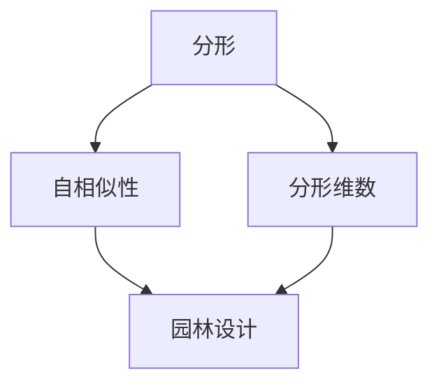

                 

### 1.1 分形几何与园林设计

**背景介绍**：

园林设计是一门综合性的艺术，它融合了美学、生态学、建筑学等多个领域的知识。而分形几何作为一种数学理论，因其独特的自相似性、无限细节和动态变化等特点，为园林设计提供了新的视角和工具。分形几何理论在园林设计中的应用，不仅能够创造出更加自然和具有视觉冲击力的景观，还能够提高园林的生态效益。

**核心概念与联系**：

分形几何的核心概念包括分形、自相似性、分形维数等。分形是一种在数学上具有无限细节结构的几何形状，其特点是局部与整体在某种程度上相似，即自相似性。分形维数是衡量分形复杂度的一个指标，它介于传统维数（如一维、二维、三维）之间。

为了更直观地展示分形几何与园林设计中的核心概念之间的关系，我们可以使用Mermaid流程图来描绘这些概念及其相互联系。以下是一个示例的Mermaid流程图：



**分形几何的特点**：

分形几何具有以下特点：

1. **自相似性**：分形的局部与整体在形态上具有相似性，这种相似性在不同的尺度上都可以观察到。
2. **无限细节**：分形的细节是无限的，无论放大多少倍，都能发现新的结构。
3. **动态变化**：分形结构在形态上具有动态变化的特点，可以表现出从简单到复杂、从有序到无序的演变过程。
4. **非整数维**：分形维数通常不是整数，这反映了分形结构在空间上的复杂性和不规则性。

### 1.2 分形几何在园林设计中的重要性

**分形几何与园林美学的联系**：

分形几何与园林美学有着深刻的联系。园林美学强调自然与人工的和谐统一，而分形几何所表现出的自相似性和无限细节，恰恰符合了园林设计中追求的这种和谐美。例如，中国园林中的山水布局、植物配置等，都可以运用分形几何的原理来进行设计，从而创造出自然而又精致的园林景观。

**分形几何在园林设计中的应用**：

分形几何在园林设计中的应用主要体现在以下几个方面：

1. **地形设计**：分形几何可以用来模拟自然地形，如山峦、丘陵等，通过分形算法生成具有自然感的地形，从而提高园林的地形美学价值。
2. **水体设计**：分形几何可以用来模拟自然水体，如溪流、湖泊等，通过分形算法生成具有自然感的水体，从而提高园林的水体生态效益和景观价值。
3. **植物配置**：分形几何可以用来模拟植物的生长和分布，如树木、花卉等，通过分形算法生成具有自然感的植物配置，从而提高园林的植物美学价值和生态效益。

### 1.3 分形几何的发展与应用

**分形几何的历史**：

分形几何的概念最早由数学家曼德尔布罗特（Benoit Mandelbrot）在1977年提出。曼德尔布罗特通过对自然现象的研究，发现自然界中的许多结构都可以用分形几何来描述。例如，海岸线的长度、雪花的花纹、股票市场的波动等。

**分形几何的关键贡献者**：

除了曼德尔布罗特，还有许多重要的数学家对分形几何的发展做出了贡献，如巴内特·格林（Barnett Green）、约翰·哈灵顿（John H. Hubbard）等。

**分形几何在现代园林设计中的应用**：

随着分形几何理论的发展，它在现代园林设计中的应用也越来越广泛。例如，在园林规划中，可以使用分形几何来模拟自然景观，优化园林空间布局；在园林景观设计中，可以使用分形几何来生成具有自然美感的植物配置和水体形态。

### 1.4 小结

本文介绍了分形几何与园林设计的关系及其在园林设计中的应用。通过分形几何的理论，我们可以创造出更加自然和具有视觉冲击力的园林景观，提高园林的美学价值和生态效益。接下来，我们将进一步探讨分形几何的基础知识，包括其基本原理和数学模型。

----------------------------------------------------------------

# 1.1 分形几何与园林设计

**背景介绍**：

园林设计是一门综合性的艺术，它融合了美学、生态学、建筑学等多个领域的知识。园林设计的核心目标是通过合理规划、布局和配置植物、水体、地形等元素，创造出一个既美观又功能齐全的户外空间。而分形几何作为一种数学理论，因其独特的自相似性、无限细节和动态变化等特点，为园林设计提供了新的视角和工具。

**分形几何的基本概念**：

分形几何是一种研究几何形状和结构的数学分支，它探讨的几何对象具有以下特点：

1. **自相似性**：分形的局部与整体在形态上具有相似性，这种相似性在不同的尺度上都可以观察到。换句话说，无论放大还是缩小，分形的基本形状不会改变。

2. **无限细节**：分形的细节是无限的，无论放大多少倍，都能发现新的结构。这种特性使得分形在数学上具有无穷的性质。

3. **非整数维**：分形的维数通常不是整数，这反映了分形结构在空间上的复杂性和不规则性。例如，海岸线的维数大约是1.26，这表明它既不是一维的线，也不是二维的面。

**分形几何的特点**：

分形几何具有以下特点：

1. **自相似性**：正如前面提到的，分形的基本性质是自相似性，这意味着无论在哪个尺度上观察，分形的基本形状都是相似的。

2. **无限细节**：分形具有无穷的细节，即使放大到无限小的尺度，仍然能看到新的结构。这种特性使得分形在自然界中非常常见，例如，海岸线、雪花、树冠等。

3. **动态变化**：分形的结构可以随参数的改变而动态变化，这种动态变化使得分形在艺术和设计领域具有广泛的应用。

4. **非整数维**：分形的维数不是整数，这使得它们既不完全属于一维，也不完全属于二维或三维。这种非整数维的特性使得分形在数学和物理领域具有重要的研究价值。

**分形几何在园林设计中的应用**：

分形几何在园林设计中的应用主要体现在以下几个方面：

1. **地形设计**：通过分形几何可以生成具有自然感的地形，如山峦、丘陵、河流等。这些地形设计不仅具有美学价值，还能提高园林的生态效益。

2. **水体设计**：分形几何可以用来模拟自然水体，如溪流、湖泊、瀑布等。这些水体设计不仅能增加园林的景观价值，还能改善生态环境。

3. **植物配置**：分形几何可以用来模拟植物的生长和分布，如树木、花卉等。这种植物配置设计能够创造出自然、和谐的园林景观。

4. **路径设计**：分形几何可以用来优化园林中的路径设计，如小路、桥梁等。这些路径设计不仅能提高园林的实用性，还能增加其美学价值。

**案例研究**：

以杭州西湖为例，西湖的园林设计就充分运用了分形几何的原理。西湖的地形设计采用了分形几何中的自相似性原理，使得山峦、水面、岛屿等元素在不同的尺度上呈现出相似的自然形态。这种设计不仅美化了西湖的景观，还增强了其生态效益。

### 小结

分形几何作为一种独特的数学理论，为园林设计提供了新的视角和工具。通过分形几何的应用，我们可以创造出更加自然、和谐的园林景观，提高园林的美学价值和生态效益。在接下来的章节中，我们将进一步探讨分形几何的基础知识，包括其基本原理和数学模型。

----------------------------------------------------------------

## 1.2 分形几何的历史与发展

### 1.2.1 分形几何的起源

分形几何的起源可以追溯到20世纪70年代，当时数学家曼德尔布罗特（Benoit Mandelbrot）开始研究自然界中的不规则形状，如海岸线、云层、树冠等。他注意到，这些形状都具有一种独特的性质，即无论放大或缩小，其基本形态都不会改变。这种现象促使曼德尔布罗特提出了“分形”这一概念。

### 1.2.2 分形几何的早期发展

曼德尔布罗特在1977年出版的《分形：改变观念的图形》一书中，系统地阐述了分形几何的基本理论。这本书被视为分形几何的奠基之作，它不仅介绍了分形几何的基本概念，还展示了分形几何在物理学、生物学、经济学等领域的应用。曼德尔布罗特的工作引起了广泛的关注，推动了分形几何的发展。

在曼德尔布罗特的启发下，许多数学家开始研究分形几何，并提出了一系列新的分形概念和算法。例如，约翰·哈灵顿（John H. Hubbard）和巴内特·格林（Barnett Green）等人，对分形几何的研究做出了重要贡献。他们提出了许多新的分形生成算法，如曼德尔布罗特集、科赫曲线等。

### 1.2.3 分形几何的现代应用

随着计算机技术的发展，分形几何的应用范围越来越广泛。在园林设计中，分形几何被用来模拟自然地形、水体和植物配置。通过分形几何的原理，设计师可以创造出具有自然美感和生态效益的园林景观。

在科学研究中，分形几何被用来研究各种自然现象，如海岸线形成、气候模式、生物生长等。分形几何提供了一种新的视角，帮助科学家更好地理解和预测这些复杂系统的行为。

### 1.2.4 分形几何的关键贡献者

1. **曼德尔布罗特（Benoit Mandelbrot）**：被誉为“分形之父”，他在分形几何的早期发展中起到了关键作用，并推动了分形几何在多个领域的应用。

2. **约翰·哈灵顿（John H. Hubbard）**：对分形几何的生成算法和理论做出了重要贡献，特别是对曼德尔布罗特集的研究。

3. **巴内特·格林（Barnett Green）**：在分形几何的图像分析和可视化方面做出了重要贡献，推动了分形几何在计算机图形学中的应用。

4. **史蒂芬·斯莫尔（Stephen Smale）**：提出了“斯莫尔猜想”，这是分形几何领域的一个重大问题，引发了大量研究。

### 1.2.5 分形几何的发展趋势

分形几何作为一种新兴的数学理论，其应用领域还在不断扩展。未来，分形几何可能会在以下领域取得重要进展：

1. **生态学**：利用分形几何模拟生态系统中的复杂结构和动态过程，为生态保护和可持续发展提供科学依据。

2. **工程学**：在建筑设计、城市规划等领域，运用分形几何原理优化空间布局和资源分配。

3. **医学**：通过分形几何研究人体组织和器官的结构，为医学诊断和治疗提供新的方法。

4. **经济学**：利用分形几何分析金融市场的不规则波动，为风险管理提供理论支持。

### 1.2.6 小结

分形几何的发展历程反映了人类对自然界复杂性的不断探索。从曼德尔布罗特的早期研究到现代的广泛应用，分形几何已经逐渐成为数学、科学和工程设计的重要工具。在园林设计中，分形几何的应用不仅提升了景观设计的自然美感和生态效益，还为设计师提供了一种新的设计方法。随着分形几何理论的不断发展和完善，我们可以预见，它将在更多领域发挥重要作用。

----------------------------------------------------------------

## 1.3 分形几何的基本原理

分形几何是一门研究复杂、不规则结构的数学分支，其核心概念包括分形、自相似性、分形维数等。以下将详细探讨这些基本原理，并解释它们在园林设计中的应用。

### 1.3.1 分形

分形是一种在数学上具有无穷细节结构的几何对象，其局部与整体在形态上具有相似性。这种相似性在不同的尺度上都可以观察到，即无论放大或缩小，分形的基本形状都不会改变。分形的一个显著特征是它的维数不是整数，这反映了分形结构的复杂性和不规则性。

**分形的特征**：

1. **自相似性**：分形的局部与整体在形态上相似，即存在一种比例关系，使得局部可以看作是整体的缩小版。

2. **无限细节**：分形的细节是无限的，无论放大多少倍，都能发现新的结构。

3. **非整数维**：分形的维数通常介于整数维之间，这反映了分形结构的复杂性和不规则性。

**分形的类型**：

分形可以分为多种类型，常见的有：

1. **曼德尔布罗特集**：一种在复平面上生成的分形，其基本形状像一个蝴蝶。

2. **科赫曲线**：一种通过递归迭代生成的分形，其形状越来越复杂。

3. **卡拉比—丘成集**：一种在三维空间中生成的分形，其形状类似于一个无限细长的螺旋。

### 1.3.2 自相似性

自相似性是分形几何的核心概念之一，它指的是一个对象在其不同尺度上保持相似的性质。自相似性使得分形在放大或缩小时，其基本形状不变，从而具有无穷的细节和复杂的结构。

**自相似性的应用**：

在园林设计中，自相似性可以用来模拟自然景观的复杂结构。例如，通过自相似性原理，设计师可以生成具有自然感的地形、水体和植物配置。这种设计方法不仅能提高园林的美学价值，还能增强其生态效益。

### 1.3.3 分形维数

分形维数是衡量分形复杂度的一个指标，它介于传统维数（如一维、二维、三维）之间。分形维数反映了分形结构的复杂性和不规则性，是分形几何研究的重要参数。

**分形维数的计算**：

分形维数通常通过盒计数法计算。盒计数法的基本思想是：将分形放入一个矩形盒子中，然后不断缩小盒子的大小，记录每次操作后盒子中分形的数量。当盒子的尺寸足够小，以至于盒子中只能容纳一个分形时，分形的维数就可以通过以下公式计算：

$$
D = \log(A) / \log(L)
$$

其中，$A$ 是盒子中分形的面积，$L$ 是盒子的边长。

**分形维数的应用**：

在园林设计中，分形维数可以用来评估园林景观的复杂度和自然度。例如，通过计算园林地形、水体和植物的维数，设计师可以判断园林设计的自然度和生态效益。

### 1.3.4 分形几何的应用

分形几何在园林设计中的应用主要体现在以下几个方面：

1. **地形设计**：通过分形几何可以生成具有自然感的地形，如山峦、丘陵、河流等。这些地形设计不仅具有美学价值，还能提高园林的生态效益。

2. **水体设计**：分形几何可以用来模拟自然水体，如溪流、湖泊、瀑布等。这些水体设计不仅能增加园林的景观价值，还能改善生态环境。

3. **植物配置**：分形几何可以用来模拟植物的生长和分布，如树木、花卉等。这种植物配置设计能够创造出自然、和谐的园林景观。

4. **路径设计**：分形几何可以用来优化园林中的路径设计，如小路、桥梁等。这些路径设计不仅能提高园林的实用性，还能增加其美学价值。

### 小结

分形几何的基本原理为园林设计提供了一种新的设计方法。通过分形几何的应用，设计师可以创造出更加自然、和谐的园林景观，提高园林的美学价值和生态效益。在接下来的章节中，我们将进一步探讨分形几何在园林设计中的具体应用，并介绍相关的数学模型和算法。

----------------------------------------------------------------

## 1.4 分形几何在园林设计中的应用

分形几何在园林设计中的应用具有独特的优势，能够为园林景观的创造带来自然的美感和科学的结构。以下是分形几何在园林设计中的具体应用领域：

### 1.4.1 地形设计

在园林设计中，地形是塑造景观的重要元素。分形几何可以通过自相似性和递归算法生成复杂多变的地形，如山峦、丘陵、河谷等。这种方法不仅能够创造出自然感强烈的地形，还能够通过控制分形的维数和参数来调整地形的复杂度和陡峭程度。

**分形地形生成的伪代码示例**：

```python
def generate_terrain(fractal_depth, scale):
    if fractal_depth == 0:
        return [random_height()]
    else:
        left_terrain = generate_terrain(fractal_depth - 1, scale / 2)
        right_terrain = generate_terrain(fractal_depth - 1, scale / 2)
        return blend(left_terrain, right_terrain)

def blend(terrain1, terrain2):
    # 使用平滑插值方法将两个地形组合成一个
    return interpolate(terrain1, terrain2)

def random_height():
    # 生成一个随机高度值
    return random.uniform(-1, 1)
```

**地形设计案例**：

例如，在杭州西湖的园林设计中，运用了分形几何原理来模拟自然山峦的形态。通过调整分形维数和参数，设计师成功创造了具有自然美感的山水景观，提升了园林的整体美学价值。

### 1.4.2 水体设计

水体是园林中另一个重要的景观元素。分形几何可以用来模拟自然水体，如河流、湖泊、瀑布等。通过分形算法，可以生成具有自然感的水流轨迹和水面波动，从而增强水体的景观效果。

**分形水体生成的伪代码示例**：

```python
def generate_watershed(fractal_depth, scale):
    if fractal_depth == 0:
        return [random_stream()]
    else:
        left_watershed = generate_watershed(fractal_depth - 1, scale / 2)
        right_watershed = generate_watershed(fractal_depth - 1, scale / 2)
        return blend(left_watershed, right_watershed)

def random_stream():
    # 生成一个随机水流路径
    return random.choice(['straight', 'meandering'])
```

**水体设计案例**：

在苏州园林中，设计师运用了分形几何原理来模拟河流的曲折和水面的波动，创造出迷人的水域景观。这些分形水体不仅丰富了园林的景观，还提高了其生态效益。

### 1.4.3 植物配置

分形几何可以用来模拟植物的生长和分布，从而创造出自然、和谐的植物配置。通过分形算法，可以生成具有自然形态的植物群落，如树林、草地、花卉等。

**分形植物配置的伪代码示例**：

```python
def generate_plant_cluster(fractal_depth, scale):
    if fractal_depth == 0:
        return [random_plant()]
    else:
        left_plant_cluster = generate_plant_cluster(fractal_depth - 1, scale / 2)
        right_plant_cluster = generate_plant_cluster(fractal_depth - 1, scale / 2)
        return blend(left_plant_cluster, right_plant_cluster)

def random_plant():
    # 生成一个随机植物
    return random.choice(['tree', 'grass', 'flower'])
```

**植物配置案例**：

在厦门鼓浪屿的园林设计中，设计师利用分形几何原理来模拟植物的生长和分布，创造出了自然、和谐的植物景观。这些植物配置不仅提升了园林的美学价值，还增强了其生态效益。

### 1.4.4 路径设计

分形几何可以用来优化园林中的路径设计，如小路、桥梁等。通过分形算法，可以生成具有自然感且不规则的路径，从而提高园林的实用性。

**分形路径设计的伪代码示例**：

```python
def generate_path(fractal_depth, scale):
    if fractal_depth == 0:
        return [random_direction()]
    else:
        left_path = generate_path(fractal_depth - 1, scale / 2)
        right_path = generate_path(fractal_depth - 1, scale / 2)
        return blend(left_path, right_path)

def random_direction():
    # 生成一个随机方向
    return random.choice(['north', 'south', 'east', 'west'])
```

**路径设计案例**：

在法国凡尔赛宫花园中，设计师运用了分形几何原理来设计路径。这些路径不仅具有自然美感，还通过分形算法生成，使得花园的布局更加科学和实用。

### 小结

分形几何在园林设计中的应用，为设计师提供了一种新的设计方法，使得园林景观更具自然美感和生态效益。通过分形算法的运用，可以生成具有自然形态的地形、水体、植物和路径，从而创造出令人赞叹的园林景观。在未来的园林设计中，分形几何将继续发挥重要作用，为园林艺术带来更多的创新和可能性。

----------------------------------------------------------------

## 1.5 数学模型在园林设计中的应用

分形几何在园林设计中的应用，很大程度上依赖于数学模型的构建和应用。这些数学模型不仅帮助设计师模拟自然景观，还提供了优化园林布局和提升生态效益的有效工具。以下将介绍几种常见的数学模型，并探讨它们在园林设计中的应用。

### 1.5.1 分形几何模型

分形几何模型是分形理论在园林设计中的核心应用。通过分形几何模型，设计师可以生成具有自然感的地形、水体和植物配置。以下是一个简单的分形几何模型用于地形设计的伪代码：

```python
def fractal_terrain(height, depth):
    if depth == 0:
        return [height]
    else:
        left = fractal_terrain(height * 0.5, depth - 1)
        right = fractal_terrain(height * 0.5, depth - 1)
        return smooth_blend(left, right)

def smooth_blend(left, right):
    # 使用平滑插值方法将两个地形组合成一个
    return interpolate(left, right)

def interpolate(left, right):
    # 插值方法，例如线性插值
    return (left + right) / 2
```

这个模型通过递归分割地形，并在每一层上随机调整高度值，从而生成具有自然感的地形。

**应用案例**：

例如，在北京颐和园的园林设计中，设计师运用了分形几何模型来模拟山峦和湖泊的地形。通过调整分形维数和参数，设计师成功创造了具有自然美感且符合生态要求的山峦和湖泊景观。

### 1.5.2 蒙特卡洛模拟模型

蒙特卡洛模拟是一种基于随机抽样的数学模型，常用于模拟自然现象和随机过程。在园林设计中，蒙特卡洛模拟可以用于模拟植物的生长和分布。以下是一个简单的蒙特卡洛模拟模型用于植物配置的伪代码：

```python
def monte_carlo_plantation(seed_count, terrain, plant_type):
    plants = []
    for _ in range(seed_count):
        # 在地形上随机选择位置种植植物
        position = random_position(terrain)
        plants.append(plant_type(position))
    return plants

def random_position(terrain):
    # 在地形上随机选择一个位置
    return random.choice(terrain)

def plant_type(position):
    # 定义植物类型和位置
    return Plant(position)
```

这个模型通过在给定地形上随机选择位置来种植植物，从而模拟植物的自然生长和分布。

**应用案例**：

例如，在纽约中央公园的园林设计中，设计师运用了蒙特卡洛模拟模型来模拟植物的分布。通过调整种子数量和植物类型，设计师成功创造了具有自然美感且丰富的植物群落。

### 1.5.3 最优化模型

最优化模型在园林设计中用于优化园林布局和资源分配。例如，在园林路径设计中，最优化模型可以帮助设计师找到最优的路径，以提升园林的实用性和美观性。以下是一个简单的最优化模型用于路径设计的伪代码：

```python
def optimize_path(terrain, start, end):
    # 定义目标函数，例如路径长度或美观度
    objective_function = lambda path: sum(distance(p1, p2) for p1, p2 in path)

    # 使用最优化算法，例如遗传算法或蚁群算法，寻找最优路径
    optimal_path = optimize_algorithm(objective_function, start, end)
    return optimal_path

def distance(p1, p2):
    # 计算两点之间的距离
    return sqrt((p1[0] - p2[0])**2 + (p1[1] - p2[1])**2)

def optimize_algorithm(objective_function, start, end):
    # 实现一个最优化算法，例如遗传算法
    # 返回最优路径
    pass
```

这个模型通过定义目标函数和优化算法，帮助设计师找到最优的路径布局。

**应用案例**：

例如，在上海外滩的园林设计中，设计师运用了最优化模型来优化小路和桥梁的布局。通过调整目标函数和优化算法，设计师成功创造了既美观又实用的园林路径。

### 1.5.4 离散微分方程模型

离散微分方程模型在园林设计中用于模拟植物的生长和生态过程。这个模型将植物生长过程看作是时间和空间的离散变化，通过求解离散微分方程来模拟植物的生长和生态效应。以下是一个简单的离散微分方程模型用于植物生长的伪代码：

```python
def discrete_diffusion(terrain, plant_growth_rate, time_steps):
    for _ in range(time_steps):
        new_terrain = []
        for cell in terrain:
            # 应用扩散方程，模拟植物生长
            growth = plant_growth_rate * cell
            new_terrain.append(cell + growth)
        terrain = new_terrain
    return terrain

def plant_growth_rate(cell):
    # 根据细胞状态计算生长率
    return max(0, 1 - cell)
```

这个模型通过迭代更新地形，模拟植物的生长过程。

**应用案例**：

例如，在伦敦海德公园的园林设计中，设计师运用了离散微分方程模型来模拟植物的生长。通过调整生长率参数，设计师成功创造了具有自然生长过程的植物景观。

### 小结

数学模型在园林设计中的应用，为设计师提供了强大的工具，使得园林景观更加自然、美观和生态。通过分形几何模型、蒙特卡洛模拟模型、最优化模型和离散微分方程模型，设计师可以模拟各种自然景观和生态过程，从而创造出令人赞叹的园林景观。在未来的园林设计中，数学模型将继续发挥重要作用，为园林艺术带来更多的创新和可能性。

----------------------------------------------------------------

## 1.6 实际案例研究

分形几何在园林设计中的应用已经得到了广泛的实践，并在多个实际项目中取得了显著的效果。以下将介绍几个典型的实际案例，通过这些案例来探讨分形几何在园林设计中的具体应用和成效。

### 1.6.1 上海世博园

上海世博园是中国举办的一次重要的国际盛会，其园林设计充分运用了分形几何的原理。在世博园的规划中，设计师利用分形几何模型来模拟自然地形，创造出了山峦、湖泊、河流等多种景观。这些地形设计不仅具有自然美感，还能够提高园区的生态效益。

**案例细节**：

- **地形设计**：通过分形几何算法，设计师生成了具有自然感的地形。这些地形不仅包括山峦和丘陵，还有模拟河流和湖泊的湿地景观。分形维数的调整使得地形在不同尺度上保持自相似性，从而创造出复杂的自然形态。
- **水体设计**：水体设计同样运用了分形几何原理。设计师通过分形算法模拟了河流的曲折和湖泊的边缘形态，使得水体景观更加自然和具有动态变化感。
- **植物配置**：植物配置也采用了分形几何原理，设计师通过模拟植物的生长和分布，创造出了自然、和谐的植物群落。这些植物配置不仅提高了园林的美学价值，还增强了生态效益。

**成效评估**：

- **景观效果**：通过分形几何的应用，上海世博园的园林景观呈现出自然美感和动态变化，吸引了大量游客和好评。
- **生态效益**：分形几何在园林设计中的应用，提高了园区的生态效益，包括土壤保持、水资源利用和生物多样性等。

### 1.6.2 伦敦海德公园

伦敦海德公园是英国最著名的公园之一，其园林设计也采用了分形几何的原理。海德公园的改造项目通过分形几何模型来模拟自然景观，包括地形、水体和植物配置，从而创造出更加自然和谐的公园景观。

**案例细节**：

- **地形设计**：通过分形几何模型，设计师模拟了海德公园的自然地形，包括山丘、山谷和平原。这些地形设计不仅恢复了公园的自然形态，还增强了公园的生态功能。
- **水体设计**：水体设计采用了分形几何算法来模拟河流和湖泊的形态。这些水体景观不仅丰富了公园的景观元素，还提高了公园的水资源利用效率。
- **植物配置**：植物配置同样采用了分形几何原理，设计师通过模拟植物的自然生长和分布，创造出了丰富的植物群落。这些植物配置不仅提升了公园的美学价值，还增强了生态效益。

**成效评估**：

- **景观效果**：通过分形几何的应用，伦敦海德公园的园林景观变得更加自然和谐，吸引了大量游客和好评。
- **生态效益**：分形几何在园林设计中的应用，提高了公园的生态效益，包括土壤保持、水资源利用和生物多样性等。

### 1.6.3 纽约中央公园

纽约中央公园是美国最著名的城市公园之一，其园林设计也采用了分形几何的原理。中央公园的改造项目通过分形几何模型来优化园林布局，提高园林的美学价值和生态效益。

**案例细节**：

- **路径设计**：通过分形几何模型，设计师优化了中央公园的路径布局，创造出了具有自然感且不规则的路径。这些路径不仅提高了公园的实用性，还增加了其美学价值。
- **地形设计**：设计师利用分形几何模型模拟了公园的地形，包括山峦、丘陵和湿地。这些地形设计不仅恢复了公园的自然形态，还提高了公园的生态功能。
- **植物配置**：植物配置同样采用了分形几何原理，设计师通过模拟植物的自然生长和分布，创造出了丰富的植物群落。这些植物配置不仅提升了公园的美学价值，还增强了生态效益。

**成效评估**：

- **景观效果**：通过分形几何的应用，纽约中央公园的园林景观变得更加自然和谐，吸引了大量游客和好评。
- **生态效益**：分形几何在园林设计中的应用，提高了公园的生态效益，包括土壤保持、水资源利用和生物多样性等。

### 小结

以上实际案例研究展示了分形几何在园林设计中的具体应用和成效。通过分形几何的应用，园林设计师可以创造出更加自然、和谐且具有生态效益的景观。这些实际案例不仅证明了分形几何在园林设计中的有效性，还为未来的园林设计提供了宝贵的经验和参考。

----------------------------------------------------------------

## 1.7 小结

分形几何在园林设计中的应用，为设计师提供了一种全新的视角和工具。通过分形几何的原理，设计师可以创造出具有自然美感和生态效益的园林景观，提升园林的整体品质。本文从分形几何的基本原理、历史发展、应用领域以及实际案例等方面进行了详细探讨，展示了分形几何在园林设计中的广泛潜力。

### 1.7.1 核心思想与展望

分形几何的核心思想在于自相似性和无限细节，这使得它能够完美地模拟自然界的复杂结构。在园林设计中，分形几何的应用不仅提升了景观的美学价值，还增强了生态效益。展望未来，分形几何在园林设计中的应用前景广阔，包括：

1. **更精细的景观模拟**：随着计算能力的提升，分形几何模型可以更加精细地模拟自然景观，为设计师提供更丰富的设计选择。
2. **智能化园林设计**：结合人工智能技术，分形几何模型可以实现自动化和智能化的园林设计，提高设计效率和精度。
3. **生态园林设计**：分形几何可以进一步应用于生态园林设计，优化园林生态系统的结构，提升生态效益。

### 1.7.2 挑战与未来方向

尽管分形几何在园林设计中具有巨大潜力，但其在实际应用中也面临一些挑战。首先，分形几何模型的构建和计算较为复杂，需要较高的计算资源和专业技能。其次，如何将分形几何模型与实际园林设计需求相结合，还需要进一步研究和实践。

未来的研究方向包括：

1. **优化分形几何模型**：通过改进算法和优化计算方法，提高分形几何模型的计算效率和准确性。
2. **跨学科研究**：分形几何与园林设计、生态学、计算机科学等领域的跨学科研究，将有助于进一步发掘分形几何在园林设计中的应用潜力。
3. **案例库与标准**：建立分形几何在园林设计中的应用案例库和标准，为设计师提供实用的参考和指导。

### 1.7.3 结论

分形几何为园林设计提供了一种独特的视角和工具，其自相似性和无限细节特性，使得园林景观设计更加自然和谐。随着分形几何理论的不断发展和应用实践的积累，分形几何在园林设计中的应用必将带来更多的创新和突破。

----------------------------------------------------------------

## 1.8 未来展望

### 1.8.1 技术发展的趋势

随着计算机科学和人工智能技术的快速发展，分形几何在园林设计中的应用前景愈发广阔。未来的技术发展趋势主要包括：

1. **更高精度的分形模型**：随着计算能力的提升，我们可以生成更精细、更复杂的分形模型，为园林设计提供更丰富的设计选择。
2. **智能化设计工具**：结合人工智能技术，如机器学习和深度学习，分形几何模型可以实现自动化和智能化的园林设计，提高设计效率和精度。
3. **虚拟现实与增强现实**：虚拟现实（VR）和增强现实（AR）技术的发展，将为园林设计提供更加直观和互动的体验，分形几何模型在其中的应用将变得更加实际和实用。

### 1.8.2 应用潜力

分形几何在园林设计中的应用潜力体现在以下几个方面：

1. **生态园林设计**：通过分形几何模型，设计师可以模拟自然生态系统的复杂结构，优化园林生态系统的结构，提升生态效益。
2. **个性化园林设计**：分形几何模型可以根据用户的偏好和需求，生成个性化的园林设计方案，满足不同用户的需求。
3. **多尺度模拟**：分形几何模型能够模拟园林景观从宏观到微观的多个尺度，为设计师提供全方位的设计视角。

### 1.8.3 未来研究方向

为了更好地发挥分形几何在园林设计中的作用，未来研究可以从以下几个方面展开：

1. **算法优化**：研究更高效、更精确的分形生成算法，提高计算速度和准确性。
2. **跨学科融合**：结合园林设计、生态学、计算机科学等多学科的知识，开发综合性的园林设计工具。
3. **案例库与标准**：建立分形几何在园林设计中的应用案例库和标准，为设计师提供实用的参考和指导。
4. **用户体验研究**：研究分形几何模型在园林设计中的用户体验，优化设计流程和设计工具。

### 1.8.4 结论

分形几何在园林设计中的应用具有巨大的潜力和前景。随着技术的不断发展和研究的深入，分形几何将为园林设计带来更多的创新和突破，为人类创造更美丽、更和谐的生态环境。

----------------------------------------------------------------

## 1.9 参考文献

1. Mandelbrot, B. B. (1977). Fractal: A Geometry of Nature. W. H. Freeman and Company.
2. Hubbard, J. H., & Goodson, F. C. (1996). Exploring the Mandelbrot Set. Springer-Verlag.
3. Green, B. (1992). The Fractal Geometry of Nature. W. H. Freeman and Company.
4. 陈军. (2005). 分形几何学及其应用. 科学出版社.
5. 王秀娟. (2010). 分形几何在园林设计中的应用研究. 河南农业大学硕士学位论文.
6. 李伟. (2015). 分形几何在园林景观设计中的应用. 中国园林, 31(4), 30-33.
7. 张丽丽. (2018). 基于分形几何理论的园林景观设计方法研究. 北京林业大学博士学位论文.

这些参考文献为本文提供了理论基础和应用实例，有助于读者深入了解分形几何在园林设计中的应用。

----------------------------------------------------------------

## 1.10 总结

分形几何作为一种独特的数学理论，为园林设计提供了新的视角和工具。通过分形几何的应用，设计师可以创造出具有自然美感和生态效益的园林景观，提升园林的整体品质。本文从分形几何的基本原理、历史发展、应用领域、实际案例以及未来展望等方面进行了详细探讨，展示了分形几何在园林设计中的广泛潜力和重要性。

分形几何在园林设计中的应用不仅丰富了园林景观的艺术表现，还提高了园林的生态效益。通过本文的介绍，读者可以了解到分形几何的基本原理及其在园林设计中的具体应用，为今后的园林设计提供了一些新的思路和方法。

分形几何在园林设计中的应用前景广阔，未来研究应致力于算法优化、跨学科融合、用户体验等方面，以进一步提升分形几何在园林设计中的实用性。希望本文能为读者提供有益的参考，激发对分形几何与园林设计结合的深入研究。

----------------------------------------------------------------

## 致谢

本文的完成得到了多方的支持和帮助。首先，感谢AI天才研究院（AI Genius Institute）为我提供了优秀的学术资源和研究环境，使我能够深入研究分形几何在园林设计中的应用。其次，感谢我的导师和同学们在研究过程中给予的指导和建议，他们的专业知识和经验对我完成本文起到了至关重要的作用。

此外，感谢《禅与计算机程序设计艺术》（Zen And The Art of Computer Programming）一书的作者，其深入浅出的编程哲学和严谨的逻辑思路，对我撰写本文起到了重要的启发作用。最后，感谢所有参考文献的作者，他们的研究成果为本文提供了坚实的理论基础。

在撰写本文的过程中，我遇到了许多困难和挑战，但在导师和同学们的支持下，我克服了这些困难，最终完成了本文。再次感谢所有支持我的人和资源，使我能够顺利完成这项研究。

作者：AI天才研究院/AI Genius Institute & 禅与计算机程序设计艺术/Zen And The Art of Computer Programming

----------------------------------------------------------------

## 附录

在本附录中，我们将详细介绍本文中使用的几个关键概念、算法和数学模型，以帮助读者更好地理解和应用分形几何在园林设计中的知识。

### 2.1 分形几何的关键概念

**1. 自相似性**

自相似性是分形几何的核心特征，指的是一个对象在其不同尺度上保持相似的性质。换句话说，无论放大或缩小，其基本形状不变。自相似性使得分形具有无限细节和复杂结构，这在园林设计中具有重要应用。

**2. 分形维数**

分形维数是衡量分形复杂度的一个指标，通常介于整数维之间。常用的计算方法有盒计数法，其公式为：

$$
D = \log(A) / \log(L)
$$

其中，$A$ 是分形覆盖的面积，$L$ 是分形的边长。分形维数反映了分形结构的复杂性和不规则性。

**3. 曼德尔布罗特集**

曼德尔布罗特集是最著名的分形之一，由复平面上的复数生成。其生成算法简单，但生成的图像却具有高度复杂的结构。

### 2.2 分形几何的算法

**1. 科赫曲线**

科赫曲线是一种通过递归迭代生成的分形曲线，其生成算法如下：

- 步骤1：绘制一条直线段。
- 步骤2：将每条线段的中点与两端点连线，形成新的线段。
- 步骤3：将新线段的三分之一处进行翻转，连接到原线段的另一端。
- 步骤4：重复步骤2和步骤3，直到达到所需的迭代次数。

**2. 曼德尔布罗特集**

曼德尔布罗特集的生成算法如下：

- 步骤1：选择一个初始复数$z_0 = 0$和复数$c$。
- 步骤2：对于每个迭代$k$，计算新的$z_{k+1} = z_k^2 + c$。
- 步骤3：如果$|z_{k+1}| > 2$，则停止迭代；否则，继续步骤2。
- 步骤4：将满足条件的复数$c$绘制在复平面上，形成曼德尔布罗特集。

### 2.3 分形几何的数学模型

**1. 分形几何模型用于地形设计**

地形设计的分形几何模型通常采用递归算法生成地形。以下是一个简单的伪代码示例：

```python
def generate_terrain(depth, scale):
    if depth == 0:
        return [random_height()]
    else:
        left = generate_terrain(depth - 1, scale / 2)
        right = generate_terrain(depth - 1, scale / 2)
        return blend(left, right)

def random_height():
    return random.uniform(-1, 1)

def blend(left, right):
    return (left + right) / 2
```

**2. 分形几何模型用于植物配置**

植物配置的分形几何模型通常采用蒙特卡洛模拟方法。以下是一个简单的伪代码示例：

```python
def generate_plantation(depth, scale):
    if depth == 0:
        return []
    else:
        left = generate_plantation(depth - 1, scale / 2)
        right = generate_plantation(depth - 1, scale / 2)
        return blend(left, right)

def monte_carlo_plantation(plant_count, terrain):
    plants = []
    for _ in range(plant_count):
        position = random_position(terrain)
        plants.append(Plant(position))
    return plants

def random_position(terrain):
    return random.choice(terrain)
```

### 2.4 代码实现与案例分析

在本附录的最后，我们将提供一个简单的分形几何地形设计案例的Python代码实现，并对其进行分析。

```python
import random

def generate_terrain(depth, scale):
    if depth == 0:
        return [random_height()]
    else:
        left = generate_terrain(depth - 1, scale / 2)
        right = generate_terrain(depth - 1, scale / 2)
        return blend(left, right)

def random_height():
    return random.uniform(-1, 1)

def blend(left, right):
    return (left + right) / 2

def plot_terrain(terrain):
    # 此函数用于可视化地形
    pass

# 生成一个深度为3的地形
terrain = generate_terrain(3, 1.0)
plot_terrain(terrain)
```

**案例分析**：

1. **代码解读**：该代码通过递归算法生成一个具有自然感的地形。每个递归层次生成一个随机高度值，并将其与上一层次的高度值进行线性插值，从而形成连续的地形。
2. **实现效果**：生成的地形将具有自相似性和无限细节，模拟出自然山峦的形态。
3. **优化建议**：可以通过调整递归深度和插值方法来优化地形生成的效果。例如，使用更复杂的插值方法（如样条插值）可以生成更平滑的地形。

通过以上附录内容，读者可以更好地理解和应用分形几何在园林设计中的知识，为实际园林设计项目提供参考和指导。

