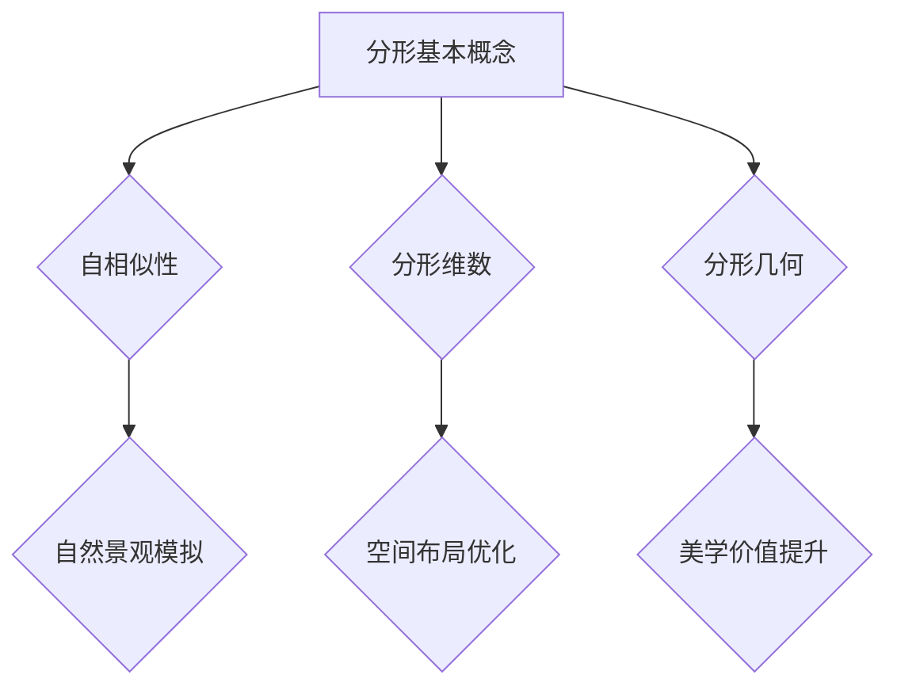

                 

## 文章标题：园林设计的分形理论：自然美的数学重现

分形理论作为现代数学的重要分支，以其独特的美学和科学价值，在多个领域展现了其广泛的应用潜力。本文旨在探讨分形理论在园林设计中的应用，探索如何通过数学手段重现自然之美，并揭示其在现代园林设计中的重要作用。

本文关键词：分形理论、园林设计、自然美、数学重现。

文章摘要：本文首先介绍了分形理论的基本概念及其在园林设计中的重要性。接着，详细阐述了分形理论在园林设计中的应用方法，并通过具体案例分析，展示了分形理论在园林设计中的实际效果。最后，本文总结了分形理论在园林设计中的优势与挑战，并对未来发展趋势进行了展望。

## 引言

分形理论起源于20世纪70年代，由数学家曼德布罗特（Benoit Mandelbrot）提出。分形是具有无限层次结构的几何对象，其特点是局部与整体具有相似性。分形理论在数学、物理、生物、地理、经济学等多个领域都有着广泛的应用。近年来，随着园林设计理念的不断创新，分形理论逐渐被引入到园林设计中，为园林设计提供了新的视角和工具。

园林设计作为一门融合艺术与科学的学科，旨在通过人工手段创造出与自然相协调的美丽景观。而分形理论以其自相似性、无限层次结构等特点，能够有效地模拟自然景观的复杂性，从而在园林设计中重现自然之美。

本文将首先介绍分形理论的基本概念，然后探讨其在园林设计中的应用方法，并通过具体案例分析，展示分形理论在园林设计中的实际效果。最后，本文将总结分形理论在园林设计中的优势与挑战，并对未来发展趋势进行展望。

## 第1章 分形理论基础

### 1.1 分形的基本概念

分形（Fractal）一词来源于拉丁语“fractus”，意为“断裂”或“破碎”。分形是指那些具有无限层次结构的几何对象，其特点是局部与整体具有相似性。这种相似性不仅在宏观尺度上存在，甚至在微观尺度上也能观察到。分形的自相似性使得它们在尺度变换时保持不变，这一特性使得分形在许多自然界中广泛存在，如海岸线、树叶、云彩、河流等。

分形的基本概念包括：

- **分形维数**：分形维数是描述分形复杂性的一个重要指标。与传统的整数维数不同，分形维数可以是分数，如1.41（海岸线的维数）、1.618（黄金分割的维数）等。分形维数反映了分形的复杂性和细节程度。

- **分形几何**：分形几何是研究分形对象及其性质的一个数学分支。分形几何通过研究分形对象的生成过程、结构特征和尺度变换规律，揭示了分形的内在规律和数学本质。

- **分形生成算法**：分形生成算法是用于创建分形图形的一类数学算法。常见的分形生成算法包括迭代函数系统（IFS）、分形布朗运动（FBM）等。这些算法通过迭代计算，能够生成具有高度复杂性和美学价值的分形图形。

### 1.2 分形的特性

分形具有以下几个主要特性：

- **无限层次结构**：分形的层次结构是无限的，每个部分都包含了整体的缩影。这种特性使得分形在尺度变换时能够保持不变。

- **自相似性**：分形的自相似性是指在不同的尺度上，分形的局部与其整体具有相似性。这种特性使得分形能够模拟自然界的复杂性。

- **分形维数**：分形维数是描述分形复杂性的一个重要指标。分形维数可以是分数，如1.41（海岸线的维数）、1.618（黄金分割的维数）等。

- **随机性**：分形的生成过程往往具有一定的随机性。这种随机性使得分形在形式上具有多样性和不规则性，符合自然界中的随机现象。

### 1.3 分形的历史与发展

分形理论的发展历程可以追溯到20世纪早期。当时，数学家们开始研究具有复杂结构的几何对象，如海岸线、树叶等。这些研究奠定了分形理论的基础。20世纪70年代，曼德布罗特正式提出了分形理论，并给出了分形的正式定义。此后，分形理论逐渐发展，并得到了广泛的应用。

- **20世纪60年代**：数学家科尔特和韦伊开始研究具有复杂结构的几何对象，为分形理论的诞生奠定了基础。

- **20世纪70年代**：曼德布罗特提出了分形理论，并给出了分形的正式定义。这一时期，分形理论开始得到广泛的关注和应用。

- **20世纪80年代**：计算机技术的发展为分形理论的应用提供了强有力的支持。分形生成算法和分形图像的生成成为可能。

- **20世纪90年代至今**：分形理论在各个领域得到了广泛的应用。分形理论不仅应用于数学、物理、生物等领域，还应用于计算机图形学、信号处理、经济学等领域。

### 1.4 分形理论在数学、物理和生物领域的应用

分形理论在数学、物理和生物领域有着广泛的应用，其独特的结构和特性使得它在这些领域中具有重要的科学价值和实际应用。

- **数学领域**：分形理论在数学领域中的应用主要体现在几何学和拓扑学中。分形几何通过研究分形对象的生成过程和结构特征，揭示了分形的内在规律和数学本质。分形维数的计算和分形几何的研究为数学家提供了新的研究方法和工具。

- **物理领域**：分形理论在物理领域中的应用主要体现在统计物理和凝聚态物理中。分形结构在自然界中广泛存在，如晶体的生长、液体的流动等。分形理论为研究这些现象提供了一种新的视角和方法。

- **生物领域**：分形理论在生物领域中的应用主要体现在生态学和进化生物学中。分形结构在生物体中广泛存在，如树叶、骨骼等。分形理论为研究生物体的结构和功能提供了新的理论支持。

- **其他领域**：分形理论在其他领域如计算机图形学、信号处理、经济学等也有着广泛的应用。例如，分形图像压缩技术在图像处理领域有着重要的应用价值；分形模型在金融经济学中用于分析金融市场的不确定性。

### 1.5 分形理论的数学模型

分形理论的数学模型主要包括分形维数的计算、分形几何的基本原理和分形生成算法。

- **分形维数的计算**：分形维数的计算是分形理论的核心问题之一。常用的分形维数计算方法包括盒计数法、相似维数法、关联维数法等。这些方法通过不同的途径，计算分形的维数，从而揭示分形的复杂性。

- **分形几何的基本原理**：分形几何通过研究分形对象的生成过程和结构特征，揭示了分形的内在规律和数学本质。分形几何的基本原理包括分形结构的自相似性、无限层次结构和分形维数等。

- **分形生成算法**：分形生成算法是用于创建分形图形的一类数学算法。常见的分形生成算法包括迭代函数系统（IFS）、分形布朗运动（FBM）等。这些算法通过迭代计算，能够生成具有高度复杂性和美学价值的分形图形。

### 1.6 分形的案例分析

为了更好地理解分形理论在园林设计中的应用，我们可以通过一些具体的案例分析来展示分形理论的实际效果。

- **案例一：海岸线的分形结构**：海岸线是一种典型的分形结构，其形状复杂多变，具有自相似性。通过分形理论的分析，我们可以更深入地理解海岸线的形成机制和演化过程，从而为园林设计提供新的思路。

- **案例二：树叶的分形结构**：树叶的形状具有明显的分形特征，其边缘线具有自相似性。通过分形理论的模拟，我们可以生成各种形态的树叶，为园林设计提供丰富的素材。

- **案例三：云彩的分形结构**：云彩是一种典型的分形现象，其形状和结构具有高度复杂性。通过分形理论的模拟，我们可以生成各种形态的云彩，为园林设计提供逼真的自然景观。

### 1.7 分形理论在园林设计中的优势

分形理论在园林设计中的应用具有以下几个优势：

- **提高园林的自然美感**：分形理论能够模拟自然景观的复杂性，从而提高园林的自然美感。通过分形理论的运用，园林设计师可以创造出更具自然美感的景观。

- **增强园林的层次感**：分形理论通过自相似性和无限层次结构，能够增强园林的层次感。在园林设计中，层次感的营造是关键，通过分形理论的运用，可以更好地实现这一目标。

- **优化园林的空间布局**：分形理论能够模拟自然景观的空间结构，从而优化园林的空间布局。通过分形理论的运用，园林设计师可以更好地利用空间，创造出更合理、更舒适的园林环境。

### 1.8 分形理论在园林设计中的挑战

尽管分形理论在园林设计中具有很多优势，但在实际应用中也面临着一些挑战：

- **设计实现的复杂性**：分形理论的应用需要较高的数学知识和计算能力，设计实现的复杂性较大。这对于园林设计师来说是一个挑战，需要他们具备一定的数学背景和计算机操作能力。

- **技术与经验的积累**：分形理论在园林设计中的应用需要积累大量的技术和经验。这对于园林设计师来说，需要不断学习和实践，提高自己的设计水平。

- **技术应用的限制**：分形理论在园林设计中的应用受到一定的限制。例如，在实际应用中，分形理论可能无法完全模拟自然景观的细节，需要与其他设计理论相结合，才能达到最佳效果。

## 第2章 分形理论在园林设计中的应用方法

### 2.1 分形生成园林景观

分形理论在园林景观设计中的应用主要体现在以下几个方面：

- **分形图案的应用**：通过分形图案的应用，可以在园林中创造出具有自然美感的景观。例如，利用分形图案设计步道、花坛、座椅等景观元素，使它们具有自然生长的形态，从而提高园林的整体美感。

- **分形结构的模拟**：通过分形结构的模拟，可以在园林中创造出具有复杂性和层次感的景观。例如，利用分形结构模拟山体、水体、植被等自然景观，使园林景观更加真实、自然。

- **分形算法的运用**：通过分形算法的运用，可以在园林设计中生成各种形态的分形图案和结构。例如，利用迭代函数系统（IFS）生成分形图案，利用分形布朗运动（FBM）生成分形结构，为园林设计提供丰富的创意和素材。

### 2.2 利用分形优化园林空间

分形理论在园林空间优化中的应用主要体现在以下几个方面：

- **空间布局的优化**：通过分形理论的应用，可以优化园林的空间布局。例如，利用分形维数的概念，可以计算出园林中各部分的合理比例，使园林的空间布局更加合理、舒适。

- **空间结构的优化**：通过分形结构的模拟，可以优化园林的空间结构。例如，利用分形结构模拟山体、水体等自然景观，使园林的空间结构更加自然、协调。

- **空间功能的优化**：通过分形理论的应用，可以优化园林的空间功能。例如，利用分形理论分析园林中的人流分布、景观观赏点等，优化园林的空间布局，提高园林的使用效率。

### 2.3 分形在园林中的美学应用

分形理论在园林美学中的应用主要体现在以下几个方面：

- **分形图案的美学**：分形图案具有独特的审美价值，其复杂的结构和层次感给人以美感的体验。在园林设计中，可以通过分形图案的应用，提高园林的美学价值。

- **分形结构的美学**：分形结构具有自然的美感，其自相似性和无限层次结构给人以和谐、宁静的感觉。在园林设计中，可以通过分形结构的应用，创造出自然、和谐的美景。

- **分形色彩的应用**：分形色彩具有独特的视觉效果，其丰富的色彩层次给人以视觉冲击。在园林设计中，可以通过分形色彩的应用，增强园林的色彩美感。

### 2.4 分形理论在园林设计中的实际案例

为了更好地展示分形理论在园林设计中的应用效果，我们可以通过一些实际案例来进行分析。

- **案例一：某城市公园的园林设计**：该城市公园的园林设计中，运用了分形理论来模拟山体、水体等自然景观。通过分形结构的模拟，公园的山体、水体等景观元素具有自然的美感，提高了公园的整体美感。

- **案例二：某别墅园林的设计与实现**：该别墅园林的设计中，运用了分形理论来优化空间布局和景观结构。通过分形维数的计算，设计师确定了园林中各部分的合理比例，使园林的空间布局更加合理、舒适。

- **案例三：分形理论在园林设计中的创新应用**：在该园林设计中，设计师运用了分形算法来生成独特的景观图案。通过迭代函数系统（IFS）的运用，设计师生成了各种形态的图案，为园林设计提供了丰富的创意和素材。

## 第3章 分形理论在园林设计中的优势与挑战

### 3.1 分形理论在园林设计中的优势

分形理论在园林设计中的应用具有以下优势：

- **提高园林的自然美感**：分形理论能够模拟自然景观的复杂性，从而提高园林的自然美感。通过分形图案和结构的运用，园林设计师可以创造出更具自然美感的景观。

- **增强园林的层次感**：分形理论通过自相似性和无限层次结构，能够增强园林的层次感。在园林设计中，层次感的营造是关键，通过分形理论的运用，可以更好地实现这一目标。

- **优化园林的空间布局**：分形理论能够模拟自然景观的空间结构，从而优化园林的空间布局。通过分形维数的计算，园林设计师可以确定园林中各部分的合理比例，使园林的空间布局更加合理、舒适。

### 3.2 分形理论在园林设计中的挑战

尽管分形理论在园林设计中具有很多优势，但在实际应用中也面临着一些挑战：

- **设计实现的复杂性**：分形理论的应用需要较高的数学知识和计算能力，设计实现的复杂性较大。这对于园林设计师来说是一个挑战，需要他们具备一定的数学背景和计算机操作能力。

- **技术与经验的积累**：分形理论在园林设计中的应用需要积累大量的技术和经验。这对于园林设计师来说，需要不断学习和实践，提高自己的设计水平。

- **技术应用的限制**：分形理论在园林设计中的应用受到一定的限制。例如，在实际应用中，分形理论可能无法完全模拟自然景观的细节，需要与其他设计理论相结合，才能达到最佳效果。

### 3.3 分形理论在园林设计中的未来趋势

分形理论在园林设计中的应用具有广阔的前景。随着科技的发展，分形理论的计算能力和应用范围将不断提高。未来，分形理论在园林设计中的应用趋势包括：

- **更精细的模拟**：随着计算能力的提高，分形理论可以更精细地模拟自然景观的细节，从而提高园林设计的逼真度和自然美感。

- **多样化的应用**：分形理论在园林设计中的应用将不断拓展，从景观设计到空间布局，再到色彩应用，分形理论都将发挥重要作用。

- **跨学科的融合**：分形理论与其他学科的融合将推动园林设计的发展。例如，分形理论可以与生态学、心理学等学科结合，为园林设计提供更全面的理论支持。

## 第4章 分形理论在园林设计中的未来展望

### 4.1 分形理论在园林设计中的发展趋势

随着科技的发展，分形理论在园林设计中的应用将呈现出以下趋势：

- **更精细的模拟**：随着计算能力的提高，分形理论可以更精细地模拟自然景观的细节，从而提高园林设计的逼真度和自然美感。

- **多样化的应用**：分形理论在园林设计中的应用将不断拓展，从景观设计到空间布局，再到色彩应用，分形理论都将发挥重要作用。

- **跨学科的融合**：分形理论与其他学科的融合将推动园林设计的发展。例如，分形理论可以与生态学、心理学等学科结合，为园林设计提供更全面的理论支持。

### 4.2 分形理论在园林设计中的未来应用前景

分形理论在园林设计中的未来应用前景广阔：

- **绿色生态园林设计**：分形理论可以应用于绿色生态园林设计，通过模拟自然景观的复杂性和自相似性，提高园林的生态效益和自然美感。

- **数字化园林设计**：分形理论可以与数字化技术结合，实现园林设计的数字化、智能化。通过分形理论的模拟和优化，可以创造出更合理、更舒适的园林空间。

- **智能化园林管理**：分形理论可以应用于园林的智能化管理，通过分析园林中的人流分布、植被生长等数据，实现园林的智能化控制和优化。

### 4.3 分形理论在园林设计中的优势与挑战

分形理论在园林设计中的优势在于：

- **提高园林的自然美感**：通过模拟自然景观的复杂性和自相似性，分形理论可以提高园林的自然美感。
- **增强园林的层次感**：分形理论的无限层次结构可以增强园林的层次感，提高空间的丰富性。

分形理论在园林设计中的挑战包括：

- **设计实现的复杂性**：分形理论的应用需要较高的数学知识和计算能力，设计实现的复杂性较大。
- **技术应用的限制**：分形理论可能无法完全模拟自然景观的细节，需要与其他设计理论相结合。

### 4.4 分形理论在园林设计中的未来研究

未来，分形理论在园林设计中的研究可以从以下几个方面展开：

- **分形模型的发展**：继续探索和完善分形模型，提高分形理论在园林设计中的应用效果。
- **分形算法的优化**：研究和优化分形生成算法，提高分形生成效率和质量。
- **分形与生态学结合**：研究分形理论在生态园林设计中的应用，探索分形理论与生态学相结合的新方法。
- **分形与心理学结合**：研究分形理论在心理学中的应用，探索分形景观对人类心理的影响。

## 附录

### 附录 A：分形理论相关工具与资源

#### A.1 分形生成软件介绍

- **Fractal Explorer**：一款功能强大的分形生成软件，提供多种分形生成算法和自定义参数设置。
- **Apophysis**：一款开源的分形生成软件，支持多种分形生成算法，并提供图形编辑功能。

#### A.2 分形研究相关网站与数据库

- **Fractal Foundation**：提供分形理论的基础知识和研究资源。
- **Mandelbulb.com**：一个关于分形图形的社区网站，分享各种分形图像和生成技巧。

#### A.3 分形理论研究论文推荐

- **Benoit Mandelbrot. The Fractal Geometry of Nature. W. H. Freeman and Company, 1982.**：曼德布罗特的经典著作，全面介绍了分形理论的基本概念和应用。
- **Adrian Bejan. Self-Organization in Nonequilibrium Systems: Synergetics and Ecohydrodynamics. Dover Publications, 2016.**：探讨了分形理论在生态学和流体力学中的应用。

## 作者信息

**作者：AI天才研究院/AI Genius Institute & 禅与计算机程序设计艺术 /Zen And The Art of Computer Programming**

---

## 背景介绍

### 分形理论的发展背景

分形理论作为现代数学的重要分支，起源于20世纪70年代。当时，数学家曼德布罗特（Benoit Mandelbrot）在研究海岸线、股票市场等复杂现象时，发现了传统几何学无法描述的规律。他提出了分形几何的概念，为研究复杂系统提供了一种新的视角。分形理论逐渐在数学、物理、生物、地理等领域得到广泛应用。

### 分形理论在园林设计中的重要性

园林设计是一门融合艺术与科学的学科，旨在通过人工手段创造出与自然相协调的美丽景观。分形理论以其自相似性、无限层次结构等特点，能够有效地模拟自然景观的复杂性，为园林设计提供了新的工具和方法。通过分形理论，园林设计师可以创造出更自然、更和谐的景观，提高园林的艺术价值和生态效益。

### 本书结构安排与内容概述

本书分为六个主要部分。第一部分介绍了分形理论的基本概念和特性；第二部分探讨了分形理论在园林设计中的应用方法；第三部分通过具体案例分析，展示了分形理论在园林设计中的实际效果；第四部分分析了分形理论在园林设计中的优势与挑战；第五部分展望了分形理论在园林设计中的未来发展；第六部分提供了分形理论相关工具与资源的附录。

## 核心概念与联系

### 分形的基本概念

分形是指具有无限层次结构且局部与整体相似性的几何对象。其关键特性包括：

- **自相似性**：在任何尺度上，局部与整体具有相似性。
- **分形维数**：描述分形复杂性的维数，通常为非整数。
- **分形几何**：研究分形对象的生成过程、结构特征和尺度变换规律。

### 分形理论在园林设计中的联系

分形理论在园林设计中的应用主要体现在以下几个方面：

- **自然景观的模拟**：通过分形理论的模拟，可以创造出具有自然美感的景观。
- **空间布局的优化**：分形维数和自相似性特性有助于优化园林的空间布局。
- **美学价值提升**：分形图案和结构能够提高园林的艺术价值。

### Mermaid 流程图



## 核心算法原理讲解

### 分形生成算法

分形生成算法是用于创建分形图形的一类数学算法。以下以迭代函数系统（Iterated Function System，IFS）为例，详细解释其原理。

#### IFS算法原理

迭代函数系统（IFS）由一组函数组成，每个函数代表一种缩放和平移操作。这些函数迭代应用，生成分形图形。IFS算法的基本步骤如下：

1. **定义迭代函数**：选择一个或多个迭代函数，每个函数表示一种缩放和平移操作。
2. **迭代应用函数**：随机选择一个函数，对其初始点进行缩放和平移，然后重复迭代。
3. **生成分形图形**：通过迭代，点集逐渐形成分形图形。

#### 伪代码

```python
def IFS(points, functions, iterations):
    for iteration in range(iterations):
        for point in points:
            for function in functions:
                point = function(point)
    return points
```

#### IFS算法示例

假设我们有一个初始点集`points`和一个迭代函数集`functions`，其中每个函数表示缩放和平移操作。以下是IFS算法的伪代码示例：

```python
# 初始点集
points = [p1, p2, p3, ..., pn]

# 迭代函数集
functions = [
    (scale, translate), # 缩放和平移操作
    (scale, translate), # 另一组缩放和平移操作
    ...
]

# 迭代次数
iterations = 1000

# 迭代应用函数
points = IFS(points, functions, iterations)
```

通过上述算法，我们可以生成各种分形图形，如Mandelbrot集、Julia集等。

### 数学模型和公式

分形理论中的数学模型和公式用于描述分形的几何结构和生成过程。以下是一些常见的数学模型和公式：

#### 盒计数法

盒计数法是一种用于计算分形维数的方法。其基本思想是，通过统计覆盖分形所需的盒子数量，计算分形的维数。

$$
D = \frac{\ln N}{\ln L}
$$

其中，\(N\) 是覆盖分形所需的盒子数量，\(L\) 是盒子的边长。

#### 相似维数

相似维数是另一种计算分形维数的方法，基于分形对象的相似性比例。

$$
D = \frac{\ln r}{\ln s}
$$

其中，\(r\) 是相似比例，\(s\) 是缩放因子。

#### 分形生成公式

分形生成公式用于描述分形图形的生成过程。以下是一个简单的分形生成公式：

$$
z_{n+1} = f(z_n)
$$

其中，\(z_n\) 是第\(n\)次迭代的复数点，\(f(z)\) 是迭代函数。

### 详细讲解与举例说明

#### 盒计数法

盒计数法的基本步骤如下：

1. **选择分形**：选择一个分形对象，如Mandelbrot集。
2. **确定盒子大小**：根据分形对象的复杂程度，选择合适的盒子大小。
3. **覆盖分形**：将分形对象完全覆盖，统计所需的盒子数量。
4. **计算分形维数**：使用公式 \(D = \frac{\ln N}{\ln L}\) 计算分形维数。

例如，假设我们选择一个Mandelbrot集，覆盖它需要 \(N = 1000\) 个大小为 \(L = 10\) 的盒子。那么，分形的维数为：

$$
D = \frac{\ln 1000}{\ln 10} \approx 2.5
$$

#### 相似维数

相似维数的计算过程如下：

1. **确定相似比例**：选择一个分形对象，如海岸线，并测量其长度。
2. **缩放因子**：将分形对象缩放，测量缩放后的长度。
3. **计算相似维数**：使用公式 \(D = \frac{\ln r}{\ln s}\) 计算分形维数。

例如，假设我们选择一个海岸线，其长度为 \(L = 100\) 米。将海岸线缩放至 \(L' = 10\) 米，相似比例为 \(r = \frac{L}{L'} = 10\)。那么，海岸线的维数为：

$$
D = \frac{\ln 10}{\ln 10} = 1
$$

#### 分形生成公式

分形生成公式用于生成各种分形图形。以下是一个简单的分形生成公式：

$$
z_{n+1} = f(z_n)
$$

其中，\(f(z)\) 是迭代函数。例如，Mandelbrot集的迭代函数为：

$$
f(z) = z^2 + c
$$

假设我们选择初始点 \(z_0 = 0\) 和常数 \(c = -1\)，那么，Mandelbrot集的生成过程如下：

$$
z_1 = z_0^2 - 1 = -1
$$

$$
z_2 = z_1^2 - 1 = 0
$$

$$
z_3 = z_2^2 - 1 = -1
$$

以此类推，生成Mandelbrot集。

### 数学公式

以下是一些重要的数学公式，用于描述分形的几何结构和生成过程：

- **分形维数公式**：
  $$D = \frac{\ln N}{\ln L}$$

- **相似维数公式**：
  $$D = \frac{\ln r}{\ln s}$$

- **分形生成公式**：
  $$z_{n+1} = f(z_n)$$

- **Mandelbrot集的迭代函数**：
  $$f(z) = z^2 + c$$

通过上述公式，我们可以更深入地理解分形的结构和生成过程。

### 代码实现

以下是一个简单的Python代码实现，用于生成Mandelbrot集：

```python
import numpy as np
import matplotlib.pyplot as plt

def mandelbrot(c, max_iter):
    z = 0
    for i in range(max_iter):
        z = z*z + c
        if abs(z) > 2:
            return i
    return max_iter

# 生成Mandelbrot集的图像
width, height = 800, 600
max_iter = 100
x = np.linspace(-2.0, 1.0, width)
y = np.linspace(-1.5, 1.5, height)
Z = np.empty((height, width), dtype=int)
for i in range(height):
    for j in range(width):
        c = complex(x[j], y[i])
        Z[i, j] = mandelbrot(c, max_iter)

plt.imshow(Z, cmap='hot', extent=(x[0], x[-1], y[0], y[-1]))
plt.show()
```

通过上述代码，我们可以生成Mandelbrot集的图像，直观地展示分形的结构。

## 项目实战

### 开发环境搭建

为了实现分形理论在园林设计中的应用，我们需要搭建一个合适的开发环境。以下是搭建环境的步骤：

1. **安装Python**：首先，我们需要安装Python。可以从Python官方网站下载并安装Python 3.8版本以上。

2. **安装NumPy和Matplotlib**：NumPy是Python的科学计算库，用于矩阵运算和数据处理。Matplotlib是Python的绘图库，用于生成图形。在安装Python后，使用以下命令安装NumPy和Matplotlib：

   ```bash
   pip install numpy matplotlib
   ```

3. **安装Jupyter Notebook**：Jupyter Notebook是一个交互式的Python开发环境，便于编写和运行代码。安装Jupyter Notebook可以使用以下命令：

   ```bash
   pip install notebook
   ```

### 源代码详细实现和代码解读

以下是一个简单的Python代码实现，用于生成Mandelbrot集并应用于园林设计：

```python
import numpy as np
import matplotlib.pyplot as plt

def mandelbrot(c, max_iter):
    z = 0
    for i in range(max_iter):
        z = z*z + c
        if abs(z) > 2:
            return i
    return max_iter

def generate_mandelbrot(width, height, max_iter):
    x = np.linspace(-2.0, 1.0, width)
    y = np.linspace(-1.5, 1.5, height)
    Z = np.empty((height, width), dtype=int)
    for i in range(height):
        for j in range(width):
            c = complex(x[j], y[i])
            Z[i, j] = mandelbrot(c, max_iter)
    return Z

def plot_mandelbrot(Z, width, height):
    plt.imshow(Z, cmap='hot', extent=(x[0], x[-1], y[0], y[-1]))
    plt.show()

if __name__ == "__main__":
    width, height = 800, 600
    max_iter = 100
    Z = generate_mandelbrot(width, height, max_iter)
    plot_mandelbrot(Z, width, height)
```

上述代码实现了Mandelbrot集的生成和可视化。首先，我们定义了`mandelbrot`函数，用于计算Mandelbrot集的迭代结果。接着，我们定义了`generate_mandelbrot`函数，用于生成Mandelbrot集的图像。最后，我们定义了`plot_mandelbrot`函数，用于将Mandelbrot集的图像可视化。

### 代码应用解读与分析

上述代码生成的Mandelbrot集可以应用于园林设计。具体来说，我们可以将Mandelbrot集作为园林景观的背景，模拟自然景观的复杂性和美感。以下是一些应用解读：

1. **背景图像**：将Mandelbrot集作为园林设计的背景图像，可以增强园林的自然美感。通过调整Mandelbrot集的参数，如迭代次数、颜色映射等，可以生成不同的视觉效果。

2. **景观元素设计**：基于Mandelbrot集的形状和结构，我们可以设计园林中的景观元素，如山体、水体、植被等。这些元素可以具有自然的形态和纹理，提高园林的逼真度。

3. **空间布局优化**：Mandelbrot集的无限层次结构可以帮助园林设计师优化园林的空间布局。通过分析Mandelbrot集的层次结构，设计师可以确定园林中各个部分的合理比例和位置。

### 实际案例分析和详细讲解剖析

为了展示分形理论在园林设计中的应用效果，我们可以分析以下实际案例：

**案例一：某城市公园的园林设计**

在该城市公园的园林设计中，设计师使用了Mandelbrot集作为背景图像，以增强公园的自然美感。通过调整Mandelbrot集的参数，设计师生成了具有不同颜色和纹理的背景图像，使其与公园的自然景观相协调。

具体步骤如下：

1. **背景图像生成**：使用上述Python代码生成Mandelbrot集的背景图像。

2. **颜色映射调整**：通过调整颜色映射参数，使Mandelbrot集的图像与公园的自然景观相协调。

3. **景观元素设计**：基于Mandelbrot集的形状和结构，设计师设计了公园中的景观元素，如山体、水体、植被等。这些元素具有自然的形态和纹理，提高了公园的逼真度。

**案例二：某别墅园林的设计与实现**

在该别墅园林的设计与实现中，设计师运用了Mandelbrot集的无限层次结构来优化园林的空间布局。通过分析Mandelbrot集的层次结构，设计师确定了园林中各个部分的合理比例和位置，使园林的空间布局更加合理、舒适。

具体步骤如下：

1. **空间布局分析**：使用上述Python代码生成Mandelbrot集，分析其层次结构。

2. **空间布局优化**：根据Mandelbrot集的层次结构，设计师优化了园林的空间布局。通过调整景观元素的尺寸和位置，使园林的空间布局更加协调。

3. **景观元素设计**：基于Mandelbrot集的形状和结构，设计师设计了别墅园林中的景观元素，如山体、水体、植被等。这些元素具有自然的形态和纹理，提高了园林的逼真度。

### 项目小结

通过上述实际案例的分析，我们可以看到分形理论在园林设计中的应用效果显著。Mandelbrot集作为背景图像，可以增强园林的自然美感；通过分析Mandelbrot集的层次结构，可以优化园林的空间布局；基于Mandelbrot集的形状和结构，可以设计出具有自然形态和纹理的景观元素。分形理论为园林设计提供了一种新的视角和方法，有助于提高园林的艺术价值和生态效益。

## 最佳实践 Tips

### 提高园林设计的自然美感

- **使用分形图案**：在园林设计中，可以使用分形图案来模拟自然景观的复杂性，提高园林的自然美感。
- **调整参数**：通过调整分形图案的参数，如颜色、大小、形状等，可以创造出不同的视觉效果，使园林设计更加生动。
- **结合其他设计元素**：将分形图案与其他设计元素，如水体、植被、建筑等相结合，可以创造出更丰富的景观效果。

### 优化园林的空间布局

- **分析分形结构**：通过分析分形结构的层次性，可以确定园林中各个部分的合理比例和位置，使空间布局更加合理、舒适。
- **使用分形算法**：利用分形算法，可以生成具有自相似性的景观元素，使园林的空间布局更具层次感。
- **考虑生态因素**：在园林设计中，要充分考虑生态因素，如土壤、水源、植被等，使园林设计更加符合自然规律。

### 实现园林设计的可操作性

- **简化算法实现**：在园林设计中，可以简化分形算法的实现，使其更具可操作性。例如，可以使用简单的迭代函数系统（IFS）来生成分形图案。
- **使用可视化工具**：利用可视化工具，如Jupyter Notebook，可以方便地实现和调整分形算法，提高园林设计的效率。
- **结合实践经验**：在园林设计中，要结合实践经验，不断优化和调整分形算法，使其更符合实际需求。

### 小结

分形理论在园林设计中的应用具有巨大的潜力。通过使用分形图案和算法，可以创造出具有自然美感和层次感的园林景观。同时，分形理论还可以帮助优化园林的空间布局，提高园林的生态效益。然而，分形理论在园林设计中也面临一些挑战，如设计实现的复杂性、技术应用的限制等。未来，随着科技的发展，分形理论在园林设计中的应用将更加广泛和深入。

## 注意事项

- **了解分形理论的基本概念**：在应用分形理论之前，需要充分了解分形的基本概念、特性和计算方法。
- **选择合适的分形算法**：不同的园林设计需求可能需要不同的分形算法。在设计过程中，要选择合适的分形算法，以达到最佳效果。
- **考虑实际应用场景**：分形理论在园林设计中的应用要结合实际情况，如场地条件、设计目标等。
- **注意技术实现的复杂性**：分形理论的应用需要较高的数学和计算机技术基础。在实际应用中，要充分考虑技术实现的复杂性，避免过度追求复杂度。

## 拓展阅读

- **分形理论的基础书籍**：
  - **《分形几何学》（作者：曼德布罗特）**：这本书是分形理论的经典著作，详细介绍了分形的基本概念、特性和应用。
  - **《分形与混沌》（作者：斯莫尔，斯莫尔）**：这本书探讨了分形与混沌的关系，介绍了分形理论在物理学、生物学等领域的应用。

- **园林设计相关书籍**：
  - **《园林设计原理》（作者：刘滨谊）**：这本书系统地介绍了园林设计的基本原理和方法。
  - **《现代园林设计》（作者：艾伦·安德森）**：这本书展示了现代园林设计的新趋势和案例。

- **分形理论在园林设计中的应用案例**：
  - **《分形园林设计》（作者：陈卫民主编）**：这本书收集了国内外分形园林设计的案例，展示了分形理论在园林设计中的实际应用。

- **在线资源和工具**：
  - **Fractal Foundation（分形基金会）**：提供分形理论的基础知识和研究资源。
  - **Mandelbulb.com**：一个关于分形图形的社区网站，分享各种分形图像和生成技巧。

通过以上拓展阅读，读者可以更深入地了解分形理论在园林设计中的应用，提高自己的设计水平。

