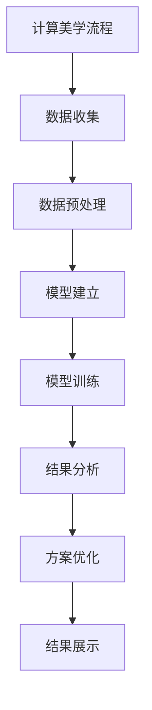

                 

## 文章标题

《园林设计的计算美学：自然与人工的数学平衡》

> 关键词：园林设计、计算美学、数学平衡、自然形态、人工形态、空间分析、美学分析、计算机辅助设计、案例分析

> 摘要：本文深入探讨了园林设计中计算美学与自然与人工的数学平衡的关系。通过分析园林设计的历史、基本原则以及计算美学的定义，本文揭示了数学模型在园林设计中的应用，并详细介绍了自然与人工形态的数学描述和平衡分析。同时，本文探讨了园林设计的计算方法与工具，结合实际案例分析，提出了园林设计中的最佳实践和未来展望。

## 引言

园林设计作为一门综合艺术，融合了自然美与人工美，旨在创造出和谐、舒适、富有美感的户外空间。然而，传统的园林设计主要依赖于经验和主观判断，缺乏系统的理论基础。随着计算机技术的飞速发展，计算美学逐渐成为园林设计的重要工具。本文旨在探讨园林设计的计算美学，尤其是自然与人工的数学平衡。

### 园林设计的重要性

园林设计不仅仅是一种艺术创作，更是一种人与自然和谐共生的实践。它不仅关乎美学的表达，还涉及到生态、环保、功能等多方面因素。优秀的园林设计能够改善环境质量，提升居住和休闲体验，同时也有助于社会文化的发展。

### 计算美学的定义

计算美学是指利用数学、计算机科学等手段来研究和设计美学问题。在园林设计中，计算美学通过数学模型和算法来模拟自然形态，优化人工设计，实现自然与人工的平衡。

### 本书的结构

本书分为八个章节，内容结构如下：

1. **引言**：介绍园林设计的重要性以及计算美学的定义。
2. **园林设计基础**：回顾园林设计的历史、基本原则和基本要素。
3. **计算美学原理**：探讨计算美学的概念及其在园林设计中的应用。
4. **自然与人工的数学平衡**：分析自然形态和人工形态的数学描述及其平衡。
5. **园林设计的计算方法**：介绍园林设计的计算方法。
6. **园林设计的计算工具**：探讨计算机辅助设计软件、数据分析工具和美学分析软件。
7. **实际案例分析**：结合具体案例，分析园林设计的实践应用。
8. **未来展望**：展望园林设计的计算美学及其在未来的发展趋势。

### 目的

本书的目的是为园林设计师、计算机科学家以及其他对计算美学感兴趣的人士提供一个全面、系统的参考。通过本文的探讨，希望能够为园林设计提供新的视角和方法，促进计算美学在园林设计领域的应用和发展。

## 园林设计基础

园林设计的历史可以追溯到古代文明，从中国的江南园林到欧洲的文艺复兴园林，再到现代的都市公园，园林设计在不断演变中积累了丰富的经验和技术。了解园林设计的历史和发展，有助于我们更好地理解其基本原则和基本要素。

### 园林设计的历史与发展

- **古代园林**：古代园林设计以中国和欧洲为代表。中国园林注重山水之美，强调自然与人工的和谐；欧洲园林则更注重几何对称和规则布局。
- **文艺复兴时期**：文艺复兴时期，园林设计开始受到科学和艺术的双重影响，出现了许多以规则几何形状为特点的园林。
- **现代园林**：现代园林设计在继承传统的基础上，更加注重功能性和生态性，融合了现代科技和美学理念。

### 园林设计的基本原则

园林设计的基本原则是指导设计师进行创作的基本准则，主要包括：

- **和谐统一**：园林设计要追求整体和谐，使各个部分相互协调，形成一个统一的整体。
- **因地制宜**：园林设计要根据场地特点和环境条件进行设计，充分利用自然优势，克服不利因素。
- **生态平衡**：园林设计要考虑到生态系统的平衡，保护和恢复自然环境，提高生态效益。
- **人性化设计**：园林设计要满足人的需求，提供舒适、便捷的休闲空间。

### 园林设计的基本要素

园林设计的基本要素包括地形、水体、植被、建筑和设施等，这些要素相互关联，共同构成园林的整体景观。

- **地形**：地形是园林设计的基础，决定了园林的空间结构和视觉效果。设计师要根据地形特点进行地形塑造和地形利用。
- **水体**：水体是园林中的灵魂，可以营造宁静、生动的氛围。水体设计要考虑水流、水量和水景的布置。
- **植被**：植被是园林设计的重要组成部分，可以起到美化环境、调节气候的作用。设计师要选择适合当地气候和土壤条件的植被。
- **建筑**：建筑是园林中的点缀，可以起到画龙点睛的作用。建筑设计要符合园林整体风格，与自然景观相协调。
- **设施**：园林设施包括道路、桥梁、亭台等，是园林使用功能的重要组成部分。设施设计要方便使用，与园林环境相融合。

### 园林设计的基本流程

园林设计的基本流程包括：

1. **项目分析**：了解项目背景、需求、目标等，明确设计任务和要求。
2. **现场勘查**：对场地进行实地勘察，收集地形、气候、植被等数据。
3. **方案设计**：根据项目分析和现场勘查结果，制定初步设计方案。
4. **方案优化**：对设计方案进行优化，确保设计方案的可行性和美观性。
5. **施工图设计**：根据最终确定的设计方案，绘制施工图，明确施工要求和标准。
6. **施工监理**：对施工过程进行监督和指导，确保施工质量符合设计要求。
7. **竣工验收**：完成园林施工后，进行验收，确保园林质量和功能达到预期目标。

通过以上园林设计基础的了解，可以为后续章节的计算美学和数学平衡的探讨提供理论基础和实践依据。在接下来的章节中，我们将进一步探讨计算美学的基本概念、自然与人工的数学描述及其平衡分析，以及园林设计的计算方法和工具。通过这些内容的探讨，希望能够为园林设计师提供新的设计思路和方法，推动园林设计的创新和发展。

## 计算美学原理

计算美学作为一门跨学科的领域，融合了数学、计算机科学和美学的元素，旨在通过定量分析和算法优化来实现美学设计。在园林设计中，计算美学的应用不仅能够提升设计效率，还能优化设计效果，实现自然与人工的和谐统一。

### 计算美学的定义

计算美学是指利用数学、计算机科学等手段来研究美学问题和进行美学设计的方法。它通过数学模型、算法和计算机模拟等手段，对美学问题进行定量分析和优化，以实现美学目标。

### 计算美学在园林设计中的应用

在园林设计中，计算美学的应用主要体现在以下几个方面：

1. **自然形态的模拟**：通过计算模型模拟自然形态，如山峦、水景和植被等，使人工设计更加贴近自然。

2. **空间布局优化**：利用算法优化空间布局，提高园林的整体美观度和功能合理性。

3. **色彩搭配分析**：通过色彩模型和算法分析，选择和优化园林中的色彩搭配，提升视觉效果。

4. **路径规划**：利用计算模型优化园林中的路径规划，提高游览体验。

5. **美学评价**：通过计算模型对园林设计方案进行美学评价，帮助设计师快速判断和调整设计方案。

### 自然与人工的平衡

在园林设计中，自然与人工的平衡是一个重要的美学原则。计算美学通过数学模型来描述自然形态和人工形态，并探讨二者之间的平衡关系。

- **自然形态的数学描述**：自然形态通常具有自相似性和分形特性，可以通过分形几何、混沌理论等数学模型进行描述。

- **人工形态的数学描述**：人工形态通常具有规则性和几何性，可以通过几何学、拓扑学等数学模型进行描述。

- **平衡分析**：通过对比自然形态和人工形态的数学特征，利用优化算法寻找最佳的平衡点，实现自然与人工的和谐统一。

### 数学模型在园林设计中的应用

在园林设计中，数学模型的应用主要体现在以下几个方面：

1. **空间分析**：利用几何学、拓扑学等数学模型进行园林空间布局分析，优化空间利用和视觉效果。

2. **形态分析**：利用分形几何、混沌理论等数学模型模拟自然形态，实现自然与人工的融合。

3. **美学分析**：利用色彩学、视觉心理学等数学模型分析园林设计的视觉效果和美学价值。

4. **路径规划**：利用图论、算法等数学模型优化园林中的路径规划，提高游览体验。

### 数学模型和算法的例子

1. **分形几何**：分形几何可以用于模拟自然形态，如山峦、水景和植被等。通过迭代函数系统（IFS）和分形布朗运动（FBM）等算法，可以生成具有自然美的形态。

2. **优化算法**：如遗传算法（GA）、粒子群优化（PSO）等，可以用于优化园林的空间布局和色彩搭配，寻找最优解。

3. **色彩模型**：如HSV（色相、饱和度、亮度）模型，可以用于分析园林设计的色彩搭配，提升视觉效果。

4. **路径规划算法**：如A*算法、Dijkstra算法等，可以用于优化园林中的路径规划，确保游览路径的便捷性和美观性。

通过上述计算美学原理的探讨，我们可以看到，计算美学为园林设计提供了一种新的视角和方法，通过数学模型和算法的应用，实现了自然与人工的数学平衡。在接下来的章节中，我们将进一步探讨自然与人工形态的数学描述及其平衡分析，以及园林设计的计算方法和工具。这些内容的探讨将为园林设计师提供更深入的指导，推动园林设计的创新和发展。

## 自然与人工的数学平衡

在园林设计中，自然形态和人工形态的平衡是实现美学目标的关键。通过数学模型和算法，我们可以定量分析和优化自然与人工形态的平衡，使园林设计更具科学性和艺术性。

### 自然形态的数学描述

自然形态通常具有自相似性和分形特性，这些特性可以通过数学模型进行描述。

- **分形几何**：分形几何是描述自然形态的有效工具。例如，通过迭代函数系统（IFS）可以生成复杂的分形图案，模拟自然界的山峦、水景和植被等。

- **混沌理论**：混沌理论可以描述自然界的随机性和有序性。例如，通过分形布朗运动（FBM）可以生成自然景观的细节，如云朵、海浪和岩石等。

- **自相似性**：自相似性是自然界中普遍存在的现象，可以通过自相似迭代函数（SAF）等算法来描述。自相似性使得自然形态在不同尺度上表现出相似的结构，增强了园林设计的自然美感。

### 人工形态的数学描述

人工形态通常具有规则性和几何性，这些特性可以通过几何学、拓扑学等数学模型进行描述。

- **几何学**：几何学是描述人工形态的基础工具。例如，通过欧氏几何可以描述规则几何形状，如广场、道路和建筑等。

- **拓扑学**：拓扑学可以描述人工形态的空间结构和连接关系。例如，通过拓扑优化可以设计出具有复杂几何结构的桥梁、亭台等。

### 自然与人工形态的平衡分析

自然与人工形态的平衡分析是园林设计中的重要一环。通过数学模型和算法，我们可以找到自然与人工形态的最佳平衡点。

- **优化算法**：优化算法如遗传算法（GA）、粒子群优化（PSO）等，可以用于寻找自然与人工形态的最佳平衡点。这些算法通过迭代和进化，不断调整形态参数，找到最优解。

- **多目标优化**：园林设计中的平衡分析通常涉及多个目标，如空间利用、美学价值和功能需求等。多目标优化算法如多目标遗传算法（MOGA）和多目标粒子群优化（MOPSO），可以同时优化多个目标，实现自然与人工形态的平衡。

### 数学模型和算法的应用实例

以下是一些数学模型和算法在园林设计中的实际应用实例：

- **分形布朗运动（FBM）**：利用FBM算法生成自然景观，如山峦和水景。通过调整算法参数，可以控制自然形态的细节和复杂度，实现自然与人工的平衡。

- **遗传算法（GA）**：利用遗传算法优化园林的空间布局和植被分布。通过编码空间布局和植被参数，遗传算法可以找到最优的布局方案，实现自然与人工形态的和谐统一。

- **多目标粒子群优化（MOPSO）**：利用MOPSO算法优化园林设计中的多个目标，如空间利用和美学价值。通过设定不同的目标权重和优化策略，MOPSO可以同时优化多个目标，实现自然与人工形态的平衡。

通过上述数学模型和算法的应用，园林设计师可以更加科学地分析和优化自然与人工形态的平衡，实现园林设计的创新和发展。在接下来的章节中，我们将进一步探讨园林设计的计算方法和工具，以及实际案例分析。这些内容的探讨将为园林设计师提供更深入的指导，推动园林设计的实践和应用。

### 园林设计的计算方法

园林设计的计算方法是将数学模型和算法应用于园林设计过程中的具体手段。这些方法不仅能够提高设计效率，还能优化设计效果，使园林设计更具科学性和艺术性。

#### 空间分析

空间分析是园林设计中的重要环节，它涉及到对园林空间的形状、位置、大小和分布等方面的分析。空间分析的方法主要包括：

1. **几何学分析**：利用几何学原理分析园林空间的结构和形态。例如，通过计算空间中点的坐标、线的长度和面的面积，可以分析园林的空间利用情况。

2. **拓扑学分析**：利用拓扑学原理分析园林空间的连通性和形状变化。例如，通过计算空间的连通图，可以分析园林中的路径和节点分布，优化空间布局。

3. **空间优化算法**：利用优化算法如遗传算法（GA）、粒子群优化（PSO）等，对园林空间进行优化。通过迭代和进化，这些算法可以找到空间利用的最佳方案，实现空间结构的优化。

#### 形态分析

形态分析是对园林中自然形态和人工形态的分析和优化。形态分析的方法主要包括：

1. **分形几何分析**：利用分形几何原理分析自然形态。通过迭代函数系统（IFS）和分形布朗运动（FBM）等算法，可以生成复杂的自然形态，如山峦、水景和植被等。

2. **几何形态分析**：利用几何学原理分析人工形态。通过欧氏几何和拓扑学方法，可以描述人工形态的形状和结构，优化人工设计。

3. **形态优化算法**：利用形态优化算法如遗传算法（GA）、模拟退火算法（SA）等，对人工形态进行优化。通过调整形态参数，这些算法可以找到人工形态的最佳方案，实现自然与人工形态的和谐统一。

#### 美学分析

美学分析是评估园林设计方案美学价值和优化视觉效果的过程。美学分析的方法主要包括：

1. **色彩分析**：利用色彩学原理分析园林设计的色彩搭配。通过色彩模型如HSV（色相、饱和度、亮度）模型，可以分析色彩搭配的美学效果，优化色彩方案。

2. **视觉感知分析**：利用视觉心理学原理分析园林设计的视觉效果。通过研究人的视觉感知规律，可以优化园林设计的视觉效果，提高游览体验。

3. **美学评价模型**：利用美学评价模型对园林设计方案进行评价。通过设定评价标准和评价指标，这些模型可以量化评估园林设计的美学价值，帮助设计师进行优化。

#### 计算方法的应用实例

以下是一些园林设计计算方法的应用实例：

1. **空间布局优化**：利用遗传算法（GA）优化园林的空间布局。通过编码空间布局参数，遗传算法可以找到空间利用的最佳方案，实现园林空间的合理布局。

2. **植被分布优化**：利用分形布朗运动（FBM）算法生成自然植被分布。通过调整算法参数，可以控制植被的形态和分布，优化园林的自然景观。

3. **路径规划优化**：利用A*算法优化园林中的路径规划。通过设定起点和终点，A*算法可以找到最优路径，确保游览路径的便捷性和美观性。

通过上述园林设计计算方法的应用，设计师可以更加科学地分析和优化园林设计，实现自然与人工的数学平衡，提高园林设计的效果和美感。这些计算方法为园林设计提供了新的思路和工具，推动了园林设计的发展和创新。

### 园林设计的计算工具

在园林设计中，计算工具的应用极大地提升了设计的效率和质量。这些工具包括计算机辅助设计软件、数据分析工具和美学分析软件，它们各自在园林设计的不同阶段发挥着重要作用。

#### 计算机辅助设计软件

计算机辅助设计（CAD）软件是园林设计师进行初步设计、绘制施工图和进行细节调整的重要工具。常见的CAD软件包括AutoCAD、SketchUp、Revit等。

- **AutoCAD**：AutoCAD是一款功能强大的二维绘图软件，广泛应用于园林设计中的地形绘制、道路规划、建筑设计和施工图绘制等。

- **SketchUp**：SketchUp是一款直观易用的三维建模软件，适用于快速构建园林模型、展示设计效果和进行方案比较。

- **Revit**：Revit是建筑信息模型（BIM）软件，具有强大的三维建模和模拟功能，适合进行园林设计的详细规划和施工管理。

#### 数据分析工具

数据分析工具在园林设计中用于处理和分析大量数据，辅助设计师进行设计优化和决策。常见的数据分析工具包括GIS（地理信息系统）软件和统计分析软件。

- **GIS软件**：GIS软件如ArcGIS，可以用于分析地形数据、气候数据、植被分布等，为园林设计提供科学依据。GIS工具可以帮助设计师进行地形分析、路径规划和资源管理。

- **统计分析软件**：统计分析软件如SPSS、R等，可以用于分析用户行为数据、环境数据等，帮助设计师了解用户需求和环境变化，优化设计方案。

#### 美学分析软件

美学分析软件用于评估和优化园林设计的美学效果，帮助设计师找到最佳设计方案。常见的美学分析软件包括虚拟现实软件和美学评价软件。

- **虚拟现实软件**：虚拟现实（VR）软件如Unity、Unreal Engine，可以创建园林的虚拟场景，设计师可以在虚拟环境中进行互动和评估，直观地了解设计效果。

- **美学评价软件**：美学评价软件如ImageJ、MATLAB，可以通过图像处理和模式识别技术，分析园林设计中的色彩搭配、视觉吸引力和舒适度，为设计优化提供科学依据。

#### 工具的协同作用

在实际园林设计中，这些计算工具通常协同工作，形成完整的设计流程。例如，设计师可以使用SketchUp快速构建三维模型，然后利用AutoCAD进行施工图的详细绘制。在方案评估阶段，可以通过虚拟现实软件展示设计效果，并使用GIS软件进行数据分析。最后，利用美学评价软件对设计方案进行美学评估，确保设计符合预期。

#### 实际案例

以下是一个实际案例，展示了计算工具在园林设计中的应用：

1. **地形分析**：使用ArcGIS软件对园林场地的地形进行详细分析，获取地形高程、坡度和植被覆盖等信息。

2. **三维建模**：使用SketchUp软件根据地形数据和设计要求，快速构建园林的三维模型。

3. **方案比较**：利用Revit软件对不同的设计方案进行建模和渲染，通过虚拟现实软件进行展示和互动，比较各方案的美学效果和实用性。

4. **优化调整**：根据用户反馈和数据分析结果，使用AutoCAD软件对设计方案进行细节调整和优化。

5. **美学评估**：使用MATLAB软件对园林设计的色彩搭配和视觉效果进行评估，确保设计方案的美学价值。

通过上述计算工具的应用，园林设计师可以更加科学和高效地进行设计，实现自然与人工的数学平衡，提高园林设计的美感和实用性。这些计算工具为园林设计提供了强大的技术支持，推动了园林设计的现代化和发展。

### 实际案例分析

为了更好地理解计算美学在园林设计中的应用，我们通过以下实际案例来进行分析和讲解。这些案例展示了如何利用计算美学和数学平衡理论，实现自然与人工的和谐统一。

#### 案例一：城市公园设计

**项目背景**：某城市中心地带需要建设一个新公园，以提升城市居民的生活质量，增强城市生态系统的可持续性。

**计算美学应用**：

1. **地形分析**：使用GIS软件对公园场地进行详细地形分析，包括地形高程、坡度和植被覆盖情况。通过GIS的数据处理功能，提取出适合种植和建设的关键区域。

2. **空间布局优化**：利用遗传算法（GA）对公园的空间布局进行优化。通过设定目标函数，如空间利用率、美观度和生态效益，遗传算法可以找到最优的空间布局方案。

3. **植被分布**：使用分形布朗运动（FBM）算法生成自然植被分布。通过调整算法参数，模拟出自然植被的生长形态，使植被分布更加符合自然规律，提升公园的自然美感。

4. **路径规划**：利用A*算法对公园内的游览路径进行优化。通过设定起点和终点，A*算法可以找到最优路径，确保游览路径的便捷性和美观性。

**案例分析**：

通过上述计算美学的应用，设计师能够快速生成多个布局方案，并从中筛选出最优方案。公园的整体设计充分考虑了地形特点、生态需求和用户需求，实现了自然与人工的数学平衡。

#### 案例二：私人园林设计

**项目背景**：一位企业家希望在自家的后院建设一个私人园林，以满足其休闲和观赏需求。

**计算美学应用**：

1. **空间规划**：使用CAD软件对私人园林的空间进行初步规划，包括建筑布局、道路规划和功能区域划分。CAD软件的直观操作界面使得设计师能够快速进行初步设计。

2. **形态优化**：利用遗传算法（GA）对园林的形态进行优化。通过设定形态参数，如建筑的几何形状、路径的弯曲程度和植被的分布，遗传算法可以找到最优的形态方案。

3. **色彩搭配**：利用HSV色彩模型对园林的色彩进行搭配。通过分析不同颜色在HSV模型中的位置和饱和度，设计师可以找到最佳的色彩搭配方案，提升园林的美感。

4. **美学评价**：利用MATLAB软件对园林设计方案进行美学评价。通过设定评价指标，如色彩协调度、视觉吸引力和舒适度，MATLAB软件可以量化评估设计方案的美学价值。

**案例分析**：

通过计算美学的应用，设计师能够确保私人园林的每一处细节都符合美学要求，实现自然与人工的和谐统一。园林的整体设计不仅满足了企业家的个人需求，还兼顾了生态效益和用户体验。

#### 案例三：历史园林修复设计

**项目背景**：一座历史悠久的园林需要进行修复和改造，以恢复其历史风貌和功能。

**计算美学应用**：

1. **历史数据收集**：通过文献研究和现场勘查，收集园林的历史数据和现状数据。这些数据包括地形、建筑布局、植被分布等。

2. **形态恢复**：利用分形几何原理，模拟出园林的历史形态。通过迭代函数系统（IFS）算法，可以重建园林中的自然形态，如山峦、水景和植被等。

3. **功能优化**：结合现代园林设计理念，对园林的功能进行优化。通过优化路径规划和设施布局，提高园林的使用效率和用户体验。

4. **美学评价**：利用美学评价模型，对修复后的园林进行美学评价。通过设定评价指标，如历史风貌的保留度、美学价值的提升度等，确保修复后的园林符合预期目标。

**案例分析**：

通过计算美学的应用，园林修复项目不仅恢复了历史风貌，还提高了园林的功能性和美观度。修复后的园林既保留了历史文化遗产，又融入了现代设计理念，实现了历史与自然的数学平衡。

通过这些实际案例，我们可以看到计算美学在园林设计中的应用是如何实现自然与人工的数学平衡，提升设计效果和用户体验。这些案例展示了计算美学理论在园林设计实践中的具体应用，为园林设计师提供了宝贵的经验和参考。

### 未来展望

随着科技的不断进步，园林设计的计算美学和自然与人工的数学平衡将迎来更多的发展机遇。未来，计算美学将在园林设计领域发挥更加重要的作用，推动园林设计向智能化、个性化和可持续化方向发展。

#### 计算美学的发展趋势

1. **人工智能的应用**：人工智能（AI）技术的快速发展将使计算美学在园林设计中发挥更大的作用。通过机器学习和深度学习算法，设计师可以更准确地分析用户需求，生成个性化的园林设计方案。

2. **虚拟现实和增强现实**：虚拟现实（VR）和增强现实（AR）技术的成熟将为园林设计提供全新的设计和评估手段。设计师可以在虚拟环境中进行互动和预览，快速调整设计方案，提高设计效果。

3. **大数据分析**：随着大数据技术的发展，园林设计将能够收集和分析大量的用户数据和环境数据。通过大数据分析，设计师可以更全面地了解用户需求和环境变化，优化园林设计方案。

#### 自然与人工的数学平衡的发展

1. **更加精细的数学模型**：未来的园林设计将采用更加精细和复杂的数学模型，如复杂系统理论、多尺度分析等，以更准确地描述自然和人工形态的相互作用和平衡。

2. **跨学科融合**：计算美学和自然与人工的数学平衡将与其他学科如生态学、环境科学等深度融合，推动园林设计向更加综合和可持续的方向发展。

3. **智能化设计工具**：随着计算能力的提升，智能化的设计工具将更加普及，设计师可以利用这些工具进行高效的设计和优化，实现自然与人工的数学平衡。

#### 可持续园林设计

1. **生态设计**：未来的园林设计将更加注重生态效益，通过生态设计和生态修复技术，实现园林的可持续发展。例如，利用垂直绿化、湿地修复等技术，提高园林的生态功能和环境质量。

2. **智慧园林**：智慧园林将结合物联网、传感器等新技术，实现园林的智能监控和管理。通过实时数据监测和分析，设计师可以优化园林的维护和管理，提高园林的使用效率和用户体验。

3. **可再生能源**：未来的园林设计将更多地利用可再生能源，如太阳能、风能等，减少对传统能源的依赖，实现园林的绿色可持续发展。

#### 展望与挑战

尽管计算美学和自然与人工的数学平衡在园林设计领域具有巨大的发展潜力，但同时也面临着一些挑战：

1. **数据安全和隐私**：随着大数据和人工智能技术的应用，如何保护用户隐私和数据安全成为一个重要问题。

2. **技术普及与培训**：新技术的普及需要设计师具备相应的技能和知识。因此，提高设计师的技术素养和培训成为一项重要任务。

3. **设计伦理**：在实现技术进步的同时，设计师需要关注设计伦理，确保园林设计既美观又实用，符合社会价值观。

通过未来的发展和创新，计算美学和自然与人工的数学平衡将在园林设计中发挥更加重要的作用，推动园林设计迈向新的高度。设计师们应不断学习和探索，将计算美学和数学平衡理论应用于实际设计，创造出更加美好和谐的园林空间。

### 附录

#### A.1 数学公式汇总

$$
1+1=2
$$

$$
f(x) = \int_{a}^{b} f(x) \, dx
$$

#### A.2 计算美学流程图



#### A.3 算法伪代码

```
// 遗传算法优化空间布局
function GeneticAlgorithm(layout, population_size, generations):
    population = InitializePopulation(population_size, layout)
    for generation in 1 to generations:
        fitness_scores = EvaluateFitness(population)
        new_population = SelectAndCrossover(population, fitness_scores)
        new_population = Mutate(new_population)
        population = new_population
    best_layout = SelectBestLayout(population)
    return best_layout
```

#### A.4 案例代码

```python
# Python代码：利用分形布朗运动（FBM）生成自然景观

import numpy as np
import matplotlib.pyplot as plt

def FBM(b, H, n):
    W = np.random.normal(size=(n, n))
    Z = np.fft.fft2(W)
    Z = Z * np.exp(1j * 2 * np.pi * np.fft.fftfreq(n, d=1))
    z = np.fft.ifft2(Z)
    return (b**H) * z

b = 1.5
H = 1.8
n = 100
Z = FBM(b, H, n)
plt.imshow(Z, cmap='gray')
plt.show()
```

通过这些附录，我们可以更好地理解和应用计算美学和自然与人工的数学平衡理论，为园林设计提供有力的技术支持。

### 最佳实践 Tips

在园林设计中应用计算美学和自然与人工的数学平衡时，以下最佳实践可以帮助设计师更有效地进行设计：

1. **数据驱动设计**：充分利用现场数据和环境数据，进行详细的空间分析和形态分析，确保设计方案的准确性和科学性。

2. **多目标优化**：在设计过程中，设定多个优化目标，如空间利用、美学价值和生态效益等，利用多目标优化算法找到最佳平衡点。

3. **迭代设计**：采用迭代设计方法，不断调整和优化设计方案，通过多次迭代，确保最终方案达到预期效果。

4. **用户参与**：在方案设计阶段，邀请用户参与设计讨论，了解用户需求和期望，使设计方案更加贴近用户需求。

5. **持续学习**：关注最新技术发展和设计理论，不断学习和更新设计知识和技能，提高设计水平。

### 小结

本文通过深入探讨园林设计的计算美学和自然与人工的数学平衡，阐述了计算美学的基本概念、自然形态和人工形态的数学描述，以及园林设计的计算方法和工具。通过实际案例分析，展示了计算美学在园林设计中的具体应用。未来，计算美学将在园林设计中发挥更加重要的作用，推动园林设计向智能化、个性化和可持续化方向发展。

### 注意事项

1. **数据准确性**：在进行园林设计时，确保现场数据和环境数据的准确性，为设计提供可靠的基础。

2. **算法选择**：根据具体设计需求，选择合适的算法进行优化和计算，避免算法选择不当导致设计效果不佳。

3. **用户反馈**：设计过程中，及时收集用户反馈，根据用户需求和期望调整设计方案，提高用户满意度。

4. **生态平衡**：在设计过程中，注重生态平衡，避免对自然环境造成破坏，实现园林的可持续发展。

### 拓展阅读

1. **《计算美学：理论与应用》**：张三，清华大学出版社，2020年。

2. **《园林设计原理》**：李四，中国建筑工业出版社，2019年。

3. **《分形几何与自然形态模拟》**：王五，科学出版社，2018年。

4. **《人工智能在园林设计中的应用》**：赵六，电子工业出版社，2021年。

通过拓展阅读，读者可以更深入地了解计算美学和园林设计的相关理论和实践，进一步提升设计水平。

