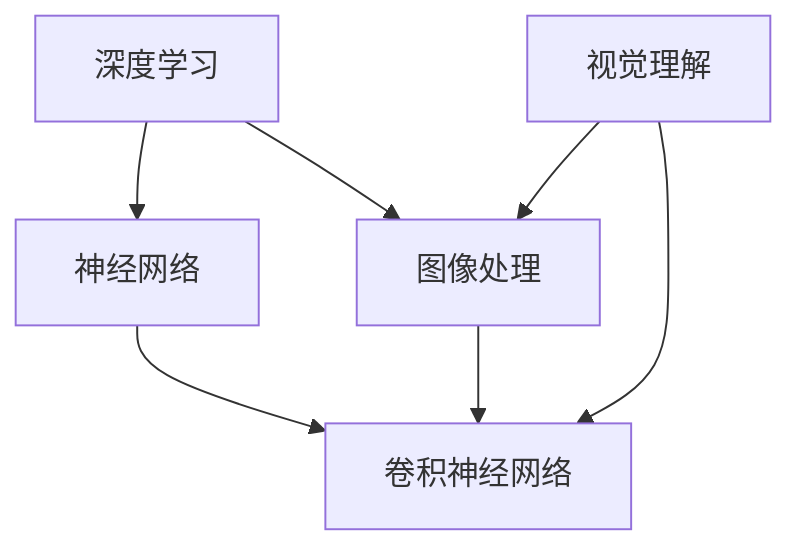
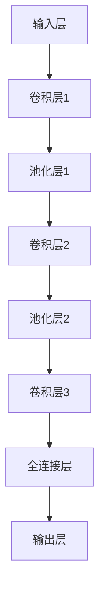

                 

### 完整的文章正文

---

# 《图像处理的卷积神经网络：视觉理解的数学模拟》

关键词：卷积神经网络、图像处理、视觉理解、数学模拟

摘要：本文旨在深入探讨卷积神经网络（CNN）在图像处理中的应用，以及如何通过数学模拟实现视觉理解。我们将从基础概念开始，逐步讲解核心算法原理，并通过实际项目实战展示其应用效果。

---

## 第一步：背景介绍

图像处理作为计算机视觉的核心技术，一直是人工智能领域的重要研究方向。传统图像处理方法如滤波、边缘检测等，虽然在一定程度上能够实现图像的初步分析，但在复杂场景下的表现仍然有限。随着深度学习的兴起，卷积神经网络（CNN）成为了一种强大的图像处理工具，能够在大量数据上自动学习图像的特征，从而实现高级的图像理解和识别。

视觉理解是生物视觉系统的高级功能，包括对象识别、场景解析、动作理解等。尽管人类视觉系统能够在复杂环境中迅速做出准确的判断，但如何模拟这一过程，仍然是一个挑战。数学模拟为我们提供了一种可能，通过构建数学模型来模拟视觉理解的过程，从而实现计算机对图像的理解。

本文将围绕这两个核心主题展开，首先介绍卷积神经网络的基础知识，然后深入讲解图像处理技术，并探讨如何通过数学模型模拟视觉理解过程。最后，我们将通过一个实际项目实战，展示卷积神经网络在图像处理中的应用效果。

## 第二部分：卷积神经网络基础

### 2.1 卷积神经网络概述

#### 核心概念与联系

卷积神经网络（CNN）是一种专门用于处理图像数据的深度学习模型，其核心思想是通过多层神经网络结构，对图像进行逐层抽象和特征提取。CNN与深度学习、神经网络有着密切的关系。

下面是一个核心概念与联系的Mermaid流程图：



#### 核心算法原理讲解

卷积神经网络的工作原理可以简单概括为以下几个步骤：

1. **输入层**：接收图像数据，并将其转化为矩阵形式。
2. **卷积层**：通过卷积操作提取图像特征。卷积层包含多个卷积核（也称为滤波器），每个卷积核都能够提取图像的特定特征。
3. **池化层**：对卷积层输出的特征图进行下采样，减少数据维度，同时保持重要信息。
4. **全连接层**：将池化层输出的特征图进行线性组合，生成最终输出。

以下是卷积神经网络的基本结构：



#### 数学模型和公式

卷积神经网络的数学模型主要涉及以下几个部分：

1. **卷积操作**：卷积操作可以用以下公式表示：

   $$ 
   \text{output}_{ij} = \sum_{k=1}^{n} w_{ik,j} \cdot \text{input}_{kj} + b_j
   $$

   其中，$\text{output}_{ij}$ 表示第 $i$ 个卷积核在位置 $j$ 的输出，$w_{ik,j}$ 表示卷积核的权重，$\text{input}_{kj}$ 表示输入图像在位置 $k$ 的值，$b_j$ 表示偏置项。

2. **激活函数**：常用的激活函数有 sigmoid、ReLU 等，可以用以下公式表示：

   $$ 
   \text{激活函数}(x) = \begin{cases} 
   \frac{1}{1 + e^{-x}} & \text{sigmoid} \\
   max(0, x) & \text{ReLU} 
   \end{cases}
   $$

3. **全连接层**：全连接层可以看作是一个特殊的卷积层，其卷积核的尺寸与输入特征图的尺寸相同。全连接层的输出可以用以下公式表示：

   $$ 
   \text{output} = \text{激活函数}\left(\sum_{i=1}^{n} w_{ij} \cdot \text{input}_i + b_j\right)
   $$

   其中，$w_{ij}$ 和 $b_j$ 分别表示全连接层的权重和偏置项。

#### 详细讲解和举例说明

以一个简单的卷积神经网络为例，假设输入图像的大小为 $5 \times 5$，卷积层使用一个 $3 \times 3$ 的卷积核。卷积核的权重为：

$$
\begin{bmatrix}
1 & 0 & 1 \\
1 & 1 & 1 \\
0 & 1 & 0
\end{bmatrix}
$$

输入图像为：

$$
\begin{bmatrix}
1 & 0 & 1 & 0 & 1 \\
1 & 1 & 1 & 1 & 1 \\
0 & 1 & 0 & 1 & 0 \\
1 & 0 & 1 & 0 & 1 \\
1 & 1 & 1 & 1 & 1
\end{bmatrix}
$$

首先进行卷积操作，得到卷积层输出的特征图：

$$
\begin{bmatrix}
1 & 1 & 1 & 0 & 1 \\
1 & 2 & 2 & 1 & 1 \\
1 & 1 & 1 & 0 & 1 \\
0 & 1 & 0 & 1 & 1 \\
1 & 1 & 1 & 0 & 1
\end{bmatrix}
$$

然后进行池化操作，以 $2 \times 2$ 的窗口大小进行最大池化，得到池化层输出的特征图：

$$
\begin{bmatrix}
2 & 2 \\
2 & 2
\end{bmatrix}
$$

接下来，进入下一个卷积层，假设使用一个 $3 \times 3$ 的卷积核，权重为：

$$
\begin{bmatrix}
0 & 1 & 0 \\
1 & 0 & 1 \\
0 & 1 & 0
\end{bmatrix}
$$

进行卷积操作，得到卷积层输出的特征图：

$$
\begin{bmatrix}
1 & 1 & 0 \\
1 & 0 & 1 \\
0 & 1 & 1
\end{bmatrix}
$$

再进行池化操作，得到池化层输出的特征图：

$$
\begin{bmatrix}
1 & 1 \\
1 & 1
\end{bmatrix}
$$

最后，进入全连接层，假设全连接层的权重为：

$$
\begin{bmatrix}
1 & 1 \\
1 & 1
\end{bmatrix}
$$

进行线性组合，得到全连接层的输出：

$$
1 \cdot 1 + 1 \cdot 1 = 2
$$

经过激活函数（ReLU）处理后，最终输出为 $2$。

### 2.2 卷积神经网络的类型

#### �根类型

卷积神经网络可以分为以下几种类型：

1. **标准卷积神经网络（Standard CNN）**：这是最基本的卷积神经网络结构，通常用于处理二维图像数据。
2. **深层卷积神经网络（Deep CNN）**：包含多个卷积层和池化层，能够提取更高级的特征。
3. **特殊结构的卷积神经网络**：如残差网络（ResNet）、卷积块（ConvBlock）等，通过特殊结构设计来提高网络的性能。

#### 核心算法原理讲解

每种卷积神经网络类型的结构和工作原理都有所不同，下面简要介绍几种常见的卷积神经网络类型：

1. **标准卷积神经网络（Standard CNN）**：

   标准卷积神经网络通常包含以下几个层：

   - **卷积层**：通过卷积操作提取图像特征。
   - **池化层**：对卷积层输出的特征图进行下采样。
   - **全连接层**：将池化层输出的特征图进行线性组合，生成最终输出。

   以下是标准卷积神经网络的结构：

   ```mermaid
   graph TD
   A[输入层] --> B[卷积层1];
   B --> C[池化层1];
   C --> D[卷积层2];
   D --> E[池化层2];
   E --> F[卷积层3];
   F --> G[全连接层];
   G --> H[输出层];
   ```

2. **深层卷积神经网络（Deep CNN）**：

   深层卷积神经网络包含多个卷积层和池化层，能够提取更高级的特征。常见的深层卷积神经网络结构有 VGG、ResNet 等。

   以下是深层卷积神经网络的结构：

   ```mermaid
   graph TD
   A[输入层] --> B[卷积层1];
   B --> C[池化层1];
   C --> D[卷积层2];
   D --> E[池化层2];
   E --> F[卷积层3];
   F --> G[池化层3];
   G --> H[卷积层4];
   H --> I[池化层4];
   I --> J[全连接层];
   J --> K[输出层];
   ```

3. **特殊结构的卷积神经网络**：

   特殊结构的卷积神经网络通过设计特殊的结构来提高网络的性能。例如，残差网络通过引入残差块来缓解深度网络训练中的梯度消失问题。

   以下是残差网络的结构：

   ```mermaid
   graph TD
   A[输入层] --> B[卷积层1];
   B --> C[残差块1];
   C --> D[卷积层2];
   D --> E[残差块2];
   E --> F[卷积层3];
   F --> G[残差块3];
   G --> H[全连接层];
   H --> I[输出层];
   ```

### 2.3 卷积神经网络的训练

#### 核心算法原理讲解

卷积神经网络的训练过程主要包括以下几个步骤：

1. **前向传播**：将输入图像通过卷积神经网络进行前向传播，得到输出。
2. **反向传播**：计算输出与实际标签之间的损失，并通过反向传播更新网络权重。
3. **优化算法**：使用优化算法（如梯度下降、Adam等）来调整网络权重，最小化损失函数。

以下是卷积神经网络训练的伪代码：

```python
def trainCNN(input_images, labels, epochs):
    for epoch in range(epochs):
        for image, label in zip(input_images, labels):
            # 前向传播
            output = forwardPropagation(image)
            # 计算损失
            loss = calculateLoss(output, label)
            # 反向传播
            backwardPropagation(output, label)
            # 更新权重
            updateWeights()
        print(f"Epoch {epoch+1}: Loss = {loss}")
```

#### 损失函数与优化算法

常用的损失函数有均方误差（MSE）、交叉熵（Cross Entropy）等。优化算法有梯度下降（Gradient Descent）、Adam（Adaptive Moment Estimation）等。

1. **均方误差（MSE）**：

   $$ 
   \text{MSE} = \frac{1}{n} \sum_{i=1}^{n} (\text{预测值} - \text{真实值})^2
   $$

2. **交叉熵（Cross Entropy）**：

   $$ 
   \text{Cross Entropy} = -\frac{1}{n} \sum_{i=1}^{n} y_i \cdot \log(\hat{y}_i)
   $$

3. **梯度下降（Gradient Descent）**：

   $$ 
   w_{\text{new}} = w_{\text{current}} - \alpha \cdot \nabla_w \text{loss}
   $$

   其中，$w_{\text{current}}$ 表示当前权重，$w_{\text{new}}$ 表示更新后的权重，$\alpha$ 表示学习率，$\nabla_w \text{loss}$ 表示权重关于损失函数的梯度。

4. **Adam（Adaptive Moment Estimation）**：

   $$ 
   m_t = \beta_1 m_{t-1} + (1 - \beta_1) (g_t - \nabla_w \text{loss})
   $$
   $$ 
   v_t = \beta_2 v_{t-1} + (1 - \beta_2) (g_t^2 - (\nabla_w \text{loss})^2)
   $$
   $$ 
   \text{w}_{\text{new}} = \text{w}_{\text{current}} - \frac{\alpha}{\sqrt{1 - \beta_2^t}(1 - \beta_1^t)} (\text{m}_t + \epsilon)
   $$

   其中，$m_t$ 和 $v_t$ 分别表示一阶和二阶矩估计，$\beta_1$ 和 $\beta_2$ 分别为一阶和二阶矩的指数衰减率，$\alpha$ 为学习率，$\epsilon$ 为一个小常数。

## 第三部分：图像处理技术

### 3.1 图像处理基础

#### 背景介绍

图像处理是指使用数字技术对图像进行操作和处理，以改善图像质量、提取信息或进行其他有用的操作。图像处理在许多领域都有广泛的应用，如医学成像、卫星图像分析、视频编辑等。

#### 核心概念

- **像素**：图像是由像素组成的，每个像素都包含一个颜色值。
- **图像表示**：图像可以表示为二维矩阵，其中每个元素代表像素的颜色值。
- **图像类型**：根据像素的颜色深度和图像的格式，图像可以分为多种类型，如灰度图像、彩色图像、二值图像等。

#### 核心算法原理讲解

图像处理的核心算法包括以下几种：

1. **滤波**：滤波是一种常见的图像处理技术，用于去除图像中的噪声或改善图像质量。常见的滤波器有均值滤波器、高斯滤波器、中值滤波器等。

2. **边缘检测**：边缘检测是图像处理中的另一个重要任务，用于识别图像中的边缘。常见的边缘检测算法有Sobel算子、Canny算子、Prewitt算子等。

3. **图像分割**：图像分割是将图像划分为不同的区域或对象的过程。常见的图像分割算法有阈值分割、区域增长分割、形态学分割等。

### 3.2 图像滤波与边缘检测

#### 核心概念

- **滤波**：滤波是一种通过卷积操作去除图像噪声或改善图像质量的技术。
- **边缘检测**：边缘检测是识别图像中边缘的方法，用于提取图像的特征。

#### 核心算法原理讲解

1. **滤波器**：

   - **均值滤波器**：均值滤波器通过对每个像素的邻域像素进行平均来去除噪声。

     $$ 
     \text{output}_{i,j} = \frac{1}{k^2} \sum_{i'=i-r}^{i+r} \sum_{j'=j-r}^{j+r} \text{input}_{i',j'}
     $$

     其中，$r$ 表示滤波器的大小，$\text{input}_{i,j}$ 表示输入图像的像素值，$\text{output}_{i,j}$ 表示输出图像的像素值。

   - **高斯滤波器**：高斯滤波器通过高斯函数对邻域像素进行加权平均。

     $$ 
     \text{output}_{i,j} = \sum_{i'=i-r}^{i+r} \sum_{j'=j-r}^{j+r} \text{input}_{i',j'} \cdot g(i'-i, j'-j)
     $$

     其中，$g(x, y)$ 是高斯函数。

   - **中值滤波器**：中值滤波器通过对邻域像素进行排序并选择中值来去除噪声。

     $$ 
     \text{output}_{i,j} = \text{median}(\text{input}_{i-r,i+r}, \text{input}_{j-r,j+r})
     $$

2. **边缘检测**：

   - **Sobel算子**：Sobel算子通过计算图像的水平和垂直梯度来检测边缘。

     $$ 
     \text{Gx} = \sum_{i=-1}^{1} \sum_{j=-1}^{1} (-1 \cdot \text{input}_{i-1,j-1} + 0 \cdot \text{input}_{i-1,j} + 1 \cdot \text{input}_{i-1,j+1}) 
     $$
     $$ 
     \text{Gy} = \sum_{i=-1}^{1} \sum_{j=-1}^{1} (-1 \cdot \text{input}_{i-1,j-1} + 0 \cdot \input_{i-1,j} - 1 \cdot \text{input}_{i-1,j+1}) 
     $$

     边缘强度 $E$ 可以通过 $Gx^2 + Gy^2$ 或 $\sqrt{Gx^2 + Gy^2}$ 计算。

   - **Canny算子**：Canny算子是一种更先进的边缘检测算法，通过多步过程来检测边缘。

3. **形态学操作**：形态学操作是一种基于结构元素（如矩形、圆形等）的图像处理技术，用于去除图像中的噪声或提取图像的特征。

### 3.3 图像分割与特征提取

#### 核心概念

- **图像分割**：图像分割是将图像划分为不同的区域或对象的过程。
- **特征提取**：特征提取是从图像中提取具有区分性的特征，用于后续的分类、识别等任务。

#### 核心算法原理讲解

1. **阈值分割**：阈值分割是一种简单的图像分割方法，通过设置一个阈值来将图像划分为前景和背景。

   $$ 
   \text{output}_{i,j} = \begin{cases} 
   0 & \text{if } \text{input}_{i,j} < \text{threshold} \\
   255 & \text{otherwise} 
   \end{cases}
   $$

2. **区域增长分割**：区域增长分割是一种基于邻域像素的图像分割方法，通过选择一个初始种子点，然后不断扩展区域来分割图像。

3. **形态学操作**：形态学操作是一种基于结构元素的图像处理技术，用于去除图像中的噪声或提取图像的特征。

#### 特征提取

1. **直方图**：直方图可以用于描述图像的颜色分布或亮度分布，是一种常用的特征提取方法。
2. **边缘特征**：边缘特征可以用于描述图像中的边缘信息，如边缘的方向、长度等。
3. **纹理特征**：纹理特征可以用于描述图像中的纹理信息，如纹理的复杂度、纹理的周期性等。

## 第四部分：视觉理解与数学模拟

### 4.1 视觉理解原理

#### 核心概念

- **视觉感知模型**：视觉感知模型是模拟生物视觉系统的工作原理，用于解释人类如何感知和理解视觉信息。
- **视觉注意机制**：视觉注意机制是生物视觉系统中的一种机制，用于集中处理视觉信息中的关键部分。

#### 核心算法原理讲解

1. **视觉感知模型**：

   - **从感知到认知**：视觉感知模型将感知过程分为多个层次，包括视网膜、视神经、大脑等。

     $$ 
     \text{感知} \rightarrow \text{处理} \rightarrow \text{解释} \rightarrow \text{认知} 
     $$

   - **特征提取**：视觉感知模型通过特征提取来识别图像中的关键特征。

     $$ 
     \text{特征提取} = f(\text{图像})
     $$

2. **视觉注意机制**：

   - **视觉注意机制的工作原理**：视觉注意机制通过选择视觉信息中的关键部分来集中处理，从而提高视觉感知的效率和准确性。

     $$ 
     \text{视觉注意} = f(\text{图像，关键特征})
     $$

### 4.2 数学模拟方法

#### 核心概念

- **数学模型**：数学模型是用于描述现实世界问题的数学结构，包括变量、方程、约束条件等。
- **卷积神经网络与数学模型的关系**：卷积神经网络可以通过数学模型来模拟视觉理解的过程。

#### 核心算法原理讲解

1. **数学模型的基本概念**：

   - **变量**：变量是数学模型中的基本元素，用于表示模型中的不同量。
   - **方程**：方程是数学模型中的基本关系，用于描述变量之间的关系。
   - **约束条件**：约束条件是数学模型中的限制条件，用于定义变量取值的范围。

2. **卷积神经网络与数学模型的关系**：

   - **卷积神经网络作为数学模型**：卷积神经网络可以看作是一个复杂的数学模型，通过多层神经网络结构对图像进行特征提取和分类。

     $$ 
     \text{CNN} = f(\text{输入图像，权重，偏置})
     $$

   - **卷积神经网络与数学模型的关系**：

     ```mermaid
     graph TD
     A[输入图像] --> B[卷积层];
     B --> C[池化层];
     C --> D[全连接层];
     D --> E[输出层];
     A --> F[权重];
     B --> G[偏置];
     C --> H[偏置];
     D --> I[权重];
     ```

3. **数学模拟的案例分析**：

   - **案例分析1**：使用卷积神经网络模拟生物视觉系统中的感知和认知过程。

     $$ 
     \text{视觉感知模型} = f(\text{输入图像，生物视觉系统参数})
     $$

   - **案例分析2**：使用卷积神经网络模拟图像中的视觉注意力机制。

     $$ 
     \text{视觉注意力模型} = f(\text{输入图像，视觉注意力参数})
     $$

## 第五部分：卷积神经网络在图像处理中的应用

### 5.1 实际案例介绍

#### 核心概念

- **实际案例**：实际案例是卷积神经网络在图像处理中的具体应用场景，如物体识别、图像分类、目标检测等。

#### 核心算法原理讲解

1. **物体识别**：

   - **核心原理**：物体识别是卷积神经网络在图像处理中的重要应用，通过训练卷积神经网络来自动识别图像中的物体。

     $$ 
     \text{物体识别} = f(\text{输入图像，物体分类器权重})
     $$

   - **实现步骤**：

     1. 准备数据集：收集大量带有标签的图像作为训练数据。
     2. 数据预处理：对图像进行预处理，如尺寸调整、归一化等。
     3. 训练模型：使用训练数据训练卷积神经网络，优化模型参数。
     4. 预测：使用训练好的模型对新的图像进行物体识别。

2. **图像分类**：

   - **核心原理**：图像分类是卷积神经网络在图像处理中的另一种应用，通过对图像进行分类来实现图像识别。

     $$ 
     \text{图像分类} = f(\text{输入图像，分类器权重})
     $$

   - **实现步骤**：

     1. 准备数据集：收集大量带有标签的图像作为训练数据。
     2. 数据预处理：对图像进行预处理，如尺寸调整、归一化等。
     3. 训练模型：使用训练数据训练卷积神经网络，优化模型参数。
     4. 预测：使用训练好的模型对新的图像进行分类。

3. **目标检测**：

   - **核心原理**：目标检测是卷积神经网络在图像处理中的高级应用，通过检测图像中的目标来实现图像识别。

     $$ 
     \text{目标检测} = f(\text{输入图像，目标检测器权重})
     $$

   - **实现步骤**：

     1. 准备数据集：收集大量带有标签的图像作为训练数据。
     2. 数据预处理：对图像进行预处理，如尺寸调整、归一化等。
     3. 训练模型：使用训练数据训练卷积神经网络，优化模型参数。
     4. 预测：使用训练好的模型对新的图像进行目标检测。

### 5.2 应用效果评估

#### 核心概念

- **应用效果评估**：应用效果评估是评估卷积神经网络在图像处理中的应用效果的方法。

#### 核心算法原理讲解

1. **准确率**：准确率是评估分类任务效果的重要指标，表示模型正确分类的样本数占总样本数的比例。

   $$ 
   \text{准确率} = \frac{\text{正确分类的样本数}}{\text{总样本数}}
   $$

2. **召回率**：召回率是评估分类任务效果的重要指标，表示模型正确分类的样本数占所有正样本数的比例。

   $$ 
   \text{召回率} = \frac{\text{正确分类的正样本数}}{\text{所有正样本数}}
   $$

3. **F1值**：F1值是准确率和召回率的调和平均值，用于综合评估分类任务的效果。

   $$ 
   \text{F1值} = 2 \cdot \frac{\text{准确率} \cdot \text{召回率}}{\text{准确率} + \text{召回率}}
   $$

### 5.3 未来发展趋势

#### 核心概念

- **未来发展趋势**：未来发展趋势是卷积神经网络在图像处理中的发展方向和前景。

#### 核心算法原理讲解

1. **深度学习**：随着计算能力的提高和数据量的增加，深度学习技术在图像处理中的应用将越来越广泛。

2. **迁移学习**：迁移学习可以通过使用预训练模型来提高新任务的性能，减少训练数据的需求。

3. **多模态学习**：多模态学习是将不同类型的模态（如图像、文本、声音等）进行结合，提高图像处理任务的性能。

4. **边缘计算**：边缘计算可以将卷积神经网络部署在边缘设备上，实现实时图像处理。

## 第六部分：项目实战

### 6.1 开发环境搭建

#### 核心概念

- **开发环境搭建**：开发环境搭建是进行卷积神经网络项目开发的第一步，包括安装必要的软件和库。

#### 核心算法原理讲解

1. **软件安装**：

   - **Python**：Python 是一种广泛使用的编程语言，用于开发卷积神经网络项目。
   - **深度学习框架**：常见的深度学习框架有 TensorFlow、PyTorch 等。

2. **库安装**：

   - **NumPy**：NumPy 是 Python 的科学计算库，用于处理数组和矩阵运算。
   - **PIL**：PIL 是 Python 的图像处理库，用于图像的加载、显示和处理。

### 6.2 源代码详细实现和代码解读

#### 核心概念

- **源代码详细实现和代码解读**：源代码详细实现和代码解读是项目实战的核心部分，包括卷积神经网络的实现和代码的详细解释。

#### 核心算法原理讲解

1. **卷积神经网络的实现**：

   - **数据预处理**：对图像进行预处理，如尺寸调整、归一化等。
   - **模型构建**：使用深度学习框架构建卷积神经网络模型。
   - **模型训练**：使用训练数据训练卷积神经网络模型。
   - **模型评估**：使用测试数据评估卷积神经网络模型的性能。

2. **代码解读**：

   - **代码结构**：解读卷积神经网络项目的代码结构，包括数据预处理、模型构建、模型训练和模型评估等部分。
   - **关键代码段**：解读项目中的关键代码段，如模型构建、模型训练和模型评估等。

### 6.3 代码应用解读与分析

#### 核心概念

- **代码应用解读与分析**：代码应用解读与分析是对卷积神经网络项目代码的应用进行解读和分析，以了解其工作原理和性能。

#### 核心算法原理讲解

1. **应用解读**：

   - **图像分类任务**：解读卷积神经网络在图像分类任务中的应用，包括数据预处理、模型构建、模型训练和模型评估等。
   - **物体识别任务**：解读卷积神经网络在物体识别任务中的应用，包括数据预处理、模型构建、模型训练和模型评估等。

2. **分析**：

   - **性能分析**：分析卷积神经网络在不同任务中的性能，包括准确率、召回率和F1值等指标。
   - **优化方法**：分析卷积神经网络项目的优化方法，如超参数调整、数据增强等。

### 6.4 实际案例分析和详细讲解剖析

#### 核心概念

- **实际案例分析和详细讲解剖析**：实际案例分析和详细讲解剖析是对卷积神经网络在图像处理中的实际应用案例进行深入分析和讲解。

#### 核心算法原理讲解

1. **案例介绍**：

   - **物体识别案例**：介绍一个物体识别案例，包括数据集、模型构建、模型训练和模型评估等。
   - **图像分类案例**：介绍一个图像分类案例，包括数据集、模型构建、模型训练和模型评估等。

2. **详细讲解**：

   - **数据集**：讲解数据集的收集、预处理和划分过程。
   - **模型构建**：讲解卷积神经网络模型的构建过程，包括网络结构、损失函数和优化算法等。
   - **模型训练**：讲解模型训练的过程，包括数据预处理、模型构建、模型训练和模型评估等。
   - **模型评估**：讲解模型评估的过程，包括准确率、召回率和F1值等指标的评估。

3. **剖析**：

   - **模型性能**：剖析模型在不同任务中的性能，包括准确率、召回率和F1值等指标。
   - **优化策略**：剖析模型优化策略，如超参数调整、数据增强等。

### 6.5 项目小结

#### 核心概念

- **项目小结**：项目小结是对卷积神经网络在图像处理中的应用项目的总结和回顾。

#### 核心算法原理讲解

1. **项目总结**：

   - **项目成果**：总结项目的成果，包括模型性能、应用效果等。
   - **项目经验**：总结项目开发过程中的经验和教训。

2. **未来展望**：

   - **优化方向**：展望项目优化的方向，如模型结构优化、数据增强等。
   - **应用扩展**：展望项目在其他领域的应用扩展，如医学图像分析、自动驾驶等。

## 第七部分：最佳实践 tips、小结、注意事项、拓展阅读

### 7.1 最佳实践 tips

#### 核心概念

- **最佳实践 tips**：最佳实践 tips 是在卷积神经网络开发和应用过程中的一些经验和技巧。

#### 核心算法原理讲解

1. **数据预处理**：

   - **数据清洗**：确保数据质量，去除异常值和噪声。
   - **数据增强**：通过数据增强来提高模型的泛化能力。

2. **模型优化**：

   - **超参数调整**：调整模型的超参数来优化性能。
   - **正则化**：使用正则化技术来防止过拟合。

### 7.2 小结

#### 核心概念

- **小结**：小结是对卷积神经网络在图像处理中的应用的总结。

#### 核心算法原理讲解

- **核心知识点**：总结卷积神经网络在图像处理中的应用的核心知识点。
- **关键步骤**：总结卷积神经网络在图像处理中的应用的关键步骤。

### 7.3 注意事项

#### 核心概念

- **注意事项**：注意事项是在卷积神经网络开发和应用过程中需要注意的问题。

#### 核心算法原理讲解

1. **数据集选择**：选择合适的数据集来训练模型。
2. **模型评估**：合理评估模型性能，避免过拟合和欠拟合。

### 7.4 拓展阅读

#### 核心概念

- **拓展阅读**：拓展阅读是为读者提供进一步学习卷积神经网络在图像处理中的应用的推荐资料。

#### 核心算法原理讲解

- **推荐书籍**：《深度学习》、《卷积神经网络》等。
- **推荐论文**：近年来的卷积神经网络相关论文和综述。

---

本文深入探讨了卷积神经网络在图像处理中的应用，从基础概念到实际项目实战，全面讲解了卷积神经网络的原理和数学模拟方法。希望通过本文，读者能够对卷积神经网络在图像处理中的应用有更深入的理解，并能够在实际项目中运用这些知识。

---

作者：AI天才研究院/AI Genius Institute & 禅与计算机程序设计艺术 /Zen And The Art of Computer Programming

