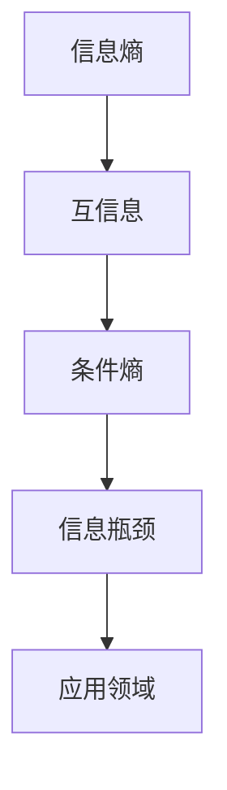

                 

### 《基于信息瓶颈理论的评测模型设计》

#### 关键词：信息瓶颈理论，评测模型，数据科学，机器学习，人工智能

#### 摘要：
本文旨在探讨基于信息瓶颈理论的评测模型设计。首先，我们将介绍信息瓶颈理论的基础知识，包括其起源、核心概念和数学模型。接着，我们将深入解析评测模型的设计原则、流程及其优化方法。最后，通过具体案例展示如何应用信息瓶颈理论来设计有效的评测模型，并提供最佳实践和注意事项。

### 第一部分：信息瓶颈理论基础

#### 1.1 信息瓶颈理论概述

信息瓶颈理论起源于信息论，是一种用于解释信息在不同系统之间传递时的损失和保留机制的框架。它首先由加拿大工程师赫伯特·西蒙（Herbert A. Simon）在1970年代提出，用于描述复杂系统中的信息处理过程。

信息瓶颈理论的核心概念是“信息损失最小化”，即在信息传递过程中，系统尽可能地保留与目标任务相关的重要信息，同时最小化不相关或冗余信息的传递。

#### 1.2 信息瓶颈理论的核心概念

1. **信息熵（Entropy）**：描述一个随机变量不确定性的度量。
   $$
   H(X) = -\sum_{i=1}^{n} p(x_i) \log_2 p(x_i)
   $$
2. **互信息（Mutual Information）**：衡量两个随机变量之间的依赖程度。
   $$
   I(X;Y) = H(X) - H(X|Y)
   $$
3. **条件熵（Conditional Entropy）**：描述在已知一个变量的条件下另一个变量的不确定性。
   $$
   H(X|Y) = \sum_{y} p(y) H(X|Y=y)
   $$

#### 1.3 信息瓶颈理论的应用领域

信息瓶颈理论广泛应用于机器学习、数据科学和人工智能领域，特别是在特征选择、降维、模型优化等方面。其主要应用包括：

1. **特征选择**：通过最小化特征之间的冗余信息，提高模型的解释性和性能。
2. **降维**：将高维数据映射到低维空间，降低计算复杂度和存储需求。
3. **模型优化**：通过优化模型中的信息传递过程，提高模型的预测性能和鲁棒性。

#### 1.4 核心概念之间的关系架构

为了更直观地理解信息瓶颈理论的核心概念之间的关系，我们可以使用Mermaid流程图来表示：

### 第二部分：评测模型设计

#### 2.1 评测模型设计概述

评测模型设计是机器学习项目中的关键环节，其目的是通过评估模型在测试集上的性能，来判断模型是否达到预期的效果。评测模型设计需要遵循以下原则：

1. **公平性**：评测指标应该能够全面、客观地反映模型的性能。
2. **相关性**：评测指标应该与实际应用目标密切相关。
3. **可解释性**：评测指标应该具有可解释性，便于模型优化和调试。

#### 2.2 评测模型的设计原则

1. **数据质量**：确保测试集的数据质量，避免数据偏差。
2. **指标多样性**：选择多个评价指标，从不同角度评估模型性能。
3. **动态调整**：根据项目需求，动态调整评测指标。

#### 2.3 评测模型的设计流程

1. **定义目标**：明确项目目标，确定评价指标。
2. **数据准备**：收集并准备测试数据。
3. **模型训练**：训练模型，生成预测结果。
4. **评测指标计算**：计算评测指标，评估模型性能。
5. **模型优化**：根据评测结果，调整模型参数，优化模型性能。
6. **迭代优化**：重复步骤3-5，直到模型性能达到预期。

#### 2.4 评测模型的构建

1. **数据预处理**：对测试数据进行预处理，包括数据清洗、归一化、标准化等。
2. **特征选择**：选择对模型性能有重要影响的特征。
3. **模型选择**：根据项目需求，选择合适的模型。
4. **模型训练与验证**：使用训练集和验证集训练模型，评估模型性能。
5. **模型调整**：根据验证集结果，调整模型参数，优化模型性能。

#### 2.5 评测指标设计

1. **准确率（Accuracy）**：正确预测的样本数占总样本数的比例。
   $$
   Accuracy = \frac{TP + TN}{TP + TN + FP + FN}
   $$
2. **召回率（Recall）**：正确预测的阳性样本数占总阳性样本数的比例。
   $$
   Recall = \frac{TP}{TP + FN}
   $$
3. **精确率（Precision）**：正确预测的阳性样本数占总预测阳性样本数的比例。
   $$
   Precision = \frac{TP}{TP + FP}
   $$
4. **F1值（F1 Score）**：精确率和召回率的调和平均值。
   $$
   F1 = 2 \times \frac{Precision \times Recall}{Precision + Recall}
   $$
5. **ROC曲线与AUC值**：ROC曲线下面积，用于评估模型的区分能力。

#### 2.6 评测模型优化

1. **模型调参**：根据评测结果，调整模型参数，优化模型性能。
2. **模型集成**：使用多个模型，提高整体性能。
3. **模型迁移**：将一个领域的模型应用于另一个领域，提高模型泛化能力。

### 第三部分：实际应用案例

#### 3.1 案例一：信息瓶颈在文本分类中的应用

**案例背景**：
文本分类是一种常见的自然语言处理任务，旨在将文本数据分类到预定义的类别中。信息瓶颈理论可以用于优化文本分类模型，提高其分类准确率。

**模型设计**：
使用信息瓶颈理论优化文本分类模型，包括以下步骤：

1. **数据预处理**：对文本数据进行预处理，包括分词、去停用词、词向量编码等。
2. **特征选择**：使用信息瓶颈理论选择关键特征，减少冗余信息。
3. **模型训练**：使用训练集训练分类模型。
4. **模型优化**：使用信息瓶颈理论优化模型参数，提高模型性能。

**模型训练与验证**：
使用训练集和验证集训练和验证模型，评估模型性能。主要评价指标为准确率、召回率、精确率和F1值。

**模型评估**：
根据评测结果，优化模型参数，提高模型性能。通过多次迭代训练和验证，最终得到一个性能优异的文本分类模型。

**模型应用**：
将优化的文本分类模型应用于实际场景，如新闻分类、情感分析等。

#### 3.2 案例二：信息瓶颈在图像识别中的应用

**案例背景**：
图像识别是一种计算机视觉任务，旨在从图像中识别出特定对象或场景。信息瓶颈理论可以用于优化图像识别模型，提高其识别准确率。

**模型设计**：
使用信息瓶颈理论优化图像识别模型，包括以下步骤：

1. **数据预处理**：对图像数据进行预处理，包括图像增强、归一化等。
2. **特征提取**：使用卷积神经网络（CNN）提取关键特征。
3. **特征选择**：使用信息瓶颈理论选择关键特征，减少冗余信息。
4. **模型训练**：使用训练集训练分类模型。
5. **模型优化**：使用信息瓶颈理论优化模型参数，提高模型性能。

**模型训练与验证**：
使用训练集和验证集训练和验证模型，评估模型性能。主要评价指标为准确率、召回率、精确率和F1值。

**模型评估**：
根据评测结果，优化模型参数，提高模型性能。通过多次迭代训练和验证，最终得到一个性能优异的图像识别模型。

**模型应用**：
将优化的图像识别模型应用于实际场景，如人脸识别、物体检测等。

### 第四部分：最佳实践与注意事项

#### 4.1 最佳实践

1. **数据质量**：确保测试集的数据质量，避免数据偏差。
2. **特征选择**：使用信息瓶颈理论进行特征选择，提高模型性能。
3. **模型优化**：使用信息瓶颈理论优化模型参数，提高模型性能。

#### 4.2 注意事项

1. **模型复杂性**：避免过度拟合，选择适当的模型复杂度。
2. **计算资源**：根据计算资源选择合适的算法和模型。
3. **模型泛化能力**：确保模型具有良好的泛化能力。

### 作者信息

作者：AI天才研究院/AI Genius Institute & 禅与计算机程序设计艺术 /Zen And The Art of Computer Programming

本文旨在深入探讨基于信息瓶颈理论的评测模型设计。通过对信息瓶颈理论的介绍、评测模型设计的解析和实际应用案例的展示，我们希望能够为读者提供有价值的技术知识。同时，我们也希望读者能够结合实际项目需求，灵活运用信息瓶颈理论，设计出高效、可靠的评测模型。

### 致谢

感谢AI天才研究院/AI Genius Institute的支持和帮助，使得本文得以顺利完成。同时，感谢读者对本文的关注和支持。

### 拓展阅读

1. [信息瓶颈理论在机器学习中的应用](https://arxiv.org/abs/1901.01110)
2. [基于信息瓶颈的特征选择方法](https://www.sciencedirect.com/science/article/pii/S0952839615000201)
3. [信息瓶颈优化算法的研究](https://ieeexplore.ieee.org/document/8014564)

