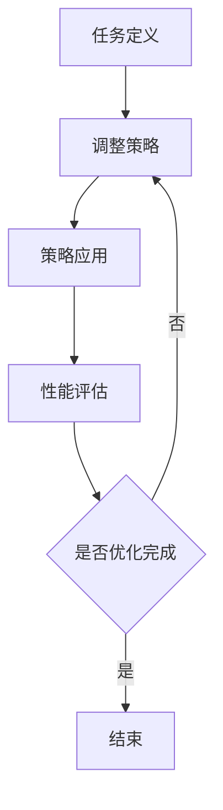

                 

### 文章标题

#### 基于元学习的快速适应评测模型

---

#### 关键词：

- 元学习
- 评测模型
- 快速适应
- 人工智能

---

#### 摘要：

本文深入探讨了基于元学习的快速适应评测模型，首先介绍了元学习的概念和理论基础，接着详细阐述了元学习算法，并分析了元学习在评测模型中的应用。随后，本文重点讨论了快速适应评测模型的设计原则和实现步骤，结合现实世界中的应用案例，进行了详细解读。最后，本文探讨了快速适应评测模型面临的挑战与未来趋势，为读者提供了全面的见解和指导。文章旨在为人工智能领域的研究者和开发者提供一个系统化的理解和应用框架，以推动该领域的发展。

---

## 背景介绍

在当今人工智能（AI）飞速发展的时代，评测模型在算法开发和优化中起着至关重要的作用。传统的评测模型往往依赖于大量的标注数据和固定的算法结构，这使得模型在面对新的任务时适应性较差。特别是在数据分布变化较大的情况下，传统模型往往需要重新训练，这不仅耗费大量时间和计算资源，还可能导致模型性能的下降。

为了解决这一问题，元学习（Meta-Learning）作为一种新兴的方法，近年来受到了广泛关注。元学习的核心思想是使学习过程变得更加高效和自适应，通过在多个任务中学习如何学习，从而在面对新任务时能够快速适应。这种能力在实时调整、动态优化和高效迁移学习中具有显著优势。

传统的机器学习模型通常在一个固定的数据集上训练，并通过评估指标来衡量模型性能。然而，这种单一的任务学习方式在应对复杂多变的实际问题时显得力不从心。随着AI应用的不断扩展，评测模型需要具备更高的灵活性和适应性，以便在不同环境和任务中都能保持良好的性能。快速适应评测模型正是为了满足这一需求而诞生的。

快速适应评测模型基于元学习技术，通过不断学习和调整，使模型能够快速适应新的数据分布和任务要求。这种模型不仅能够提高模型的泛化能力，还能够节省大量的训练时间和计算资源，从而在资源受限的环境中发挥重要作用。

本文将围绕基于元学习的快速适应评测模型展开讨论，首先介绍元学习的概念和理论基础，然后详细分析元学习算法，探讨其在评测模型中的应用。接着，本文将介绍快速适应评测模型的设计原则和实现步骤，并通过现实世界中的应用案例进行解读。最后，本文将总结快速适应评测模型的挑战与未来趋势，为读者提供全面的见解和指导。

## 核心概念与联系

### 元学习的定义与分类

元学习，也称为“学习如何学习”（learning to learn），是一种通过从多个任务中提取通用学习策略，以提高模型泛化能力的方法。与传统机器学习模型不同，元学习模型旨在解决如何在不同任务中快速适应和学习的问题。元学习可以大致分为两种类型：模型级元学习和样本级元学习。

- **模型级元学习**：这种类型的元学习关注如何修改或调整模型结构，使其在不同任务中表现出更好的适应能力。典型的模型级元学习方法包括模型修复（Model Repair）、模型融合（Model Fusion）等。模型级元学习通常需要更复杂的算法和更多的计算资源。

- **样本级元学习**：这种类型的元学习关注如何在给定模型结构的基础上，通过调整样本选择或处理策略来提高学习效率。典型的样本级元学习方法包括样本重放（Sample Replay）、样本重要性采样（Importance Sampling）等。样本级元学习相对简单，实现起来更为高效。

### 元学习与深度学习的关系

深度学习是近年来人工智能领域的一个重要突破，其通过多层神经网络模型自动提取数据特征，实现了许多复杂任务的高效解决。然而，传统的深度学习模型在处理新任务时，往往需要大量重新训练，这使得其在面对动态变化的环境时适应性较差。

元学习与深度学习有着紧密的联系。一方面，元学习为深度学习模型提供了一种新的优化框架，通过在不同任务中学习如何调整模型参数，提高模型的泛化能力和适应性。另一方面，深度学习的发展为元学习提供了强大的计算基础，使得元学习算法能够处理更加复杂和大规模的任务。

### 元学习与快速适应评测模型

快速适应评测模型是元学习在评测领域的一种具体应用。其核心思想是通过元学习技术，使评测模型能够快速适应不同的数据分布和任务要求，从而提高评测的准确性和效率。

快速适应评测模型利用元学习算法，在多个任务中学习如何学习，从而在面对新任务时能够快速调整和优化。具体来说，快速适应评测模型包括以下几个关键组成部分：

1. **元学习算法**：负责在多个任务中学习通用学习策略，提高模型的泛化能力。
2. **自适应调整机制**：根据新任务的特点，动态调整模型参数和结构，实现快速适应。
3. **评测指标**：用于衡量模型的性能，指导模型的调整和优化。

### 元学习原理与流程图

元学习的基本原理可以概括为以下几个步骤：

1. **任务定义**：确定学习任务，包括输入数据、输出结果和任务目标。
2. **策略学习**：通过在多个任务中学习，提取出通用学习策略。
3. **策略应用**：将提取出的通用学习策略应用于新任务，实现快速适应。
4. **性能评估**：通过评测指标评估模型在新任务中的性能，指导进一步调整。

以下是元学习原理的Mermaid流程图表示：



通过上述流程，元学习模型能够在多个任务中不断学习和优化，从而提高模型在新任务中的适应性。

### 元学习算法原理与伪代码

元学习算法的核心在于如何从多个任务中提取出有效的学习策略，并在新任务中快速应用这些策略。以下是一个简单的元学习算法原理的伪代码示例：

```python
# 元学习算法伪代码

# 初始化模型参数
model_params = initialize_model()

# 在多个任务中学习策略
for task in tasks:
    # 执行任务
    task_data = execute_task(task)
    # 训练模型
    model_params = train_model(task_data, model_params)
    # 更新策略
    strategy = update_strategy(model_params)

# 应用学习到的策略于新任务
new_task_data = execute_new_task(new_task)
model_params = apply_strategy(new_task_data, strategy)

# 评估新任务性能
performance = evaluate_performance(model_params)
```

在这个伪代码中，`initialize_model()` 用于初始化模型参数，`execute_task()` 用于执行给定任务，`train_model()` 用于根据任务数据训练模型，`update_strategy()` 用于更新学习策略，`execute_new_task()` 用于执行新任务，`apply_strategy()` 用于将学习策略应用于新任务，`evaluate_performance()` 用于评估新任务的性能。

### 数学模型与公式

在元学习算法中，常用的数学模型包括损失函数、优化目标和梯度下降算法。以下是对这些数学模型和公式的详细讲解：

#### 损失函数

损失函数用于衡量模型预测值与实际值之间的差距。常见的损失函数包括均方误差（MSE）、交叉熵损失等。

- **均方误差（MSE）**：

  $$MSE = \frac{1}{n}\sum_{i=1}^{n}(y_i - \hat{y}_i)^2$$

  其中，$y_i$ 是实际值，$\hat{y}_i$ 是预测值，$n$ 是数据样本数。

- **交叉熵损失（Cross-Entropy Loss）**：

  $$CE = -\frac{1}{n}\sum_{i=1}^{n}y_i\log(\hat{y}_i)$$

  其中，$y_i$ 是实际值，$\hat{y}_i$ 是预测概率。

#### 优化目标

优化目标是指导模型参数调整的过程，常见的优化目标包括最小化损失函数。

- **最小化MSE**：

  $$\min_{\theta} \frac{1}{n}\sum_{i=1}^{n}(y_i - \hat{y}_i)^2$$

- **最小化交叉熵损失**：

  $$\min_{\theta} -\frac{1}{n}\sum_{i=1}^{n}y_i\log(\hat{y}_i)$$

#### 梯度下降算法

梯度下降算法是一种常用的优化算法，用于更新模型参数，以最小化损失函数。

- **梯度下降更新公式**：

  $$\theta = \theta - \alpha \nabla_\theta J(\theta)$$

  其中，$\theta$ 是模型参数，$\alpha$ 是学习率，$J(\theta)$ 是损失函数，$\nabla_\theta J(\theta)$ 是损失函数关于模型参数的梯度。

#### 举例说明

假设我们有一个简单的线性回归模型，用于预测房价。模型的预测公式为：

$$\hat{y} = \theta_0 + \theta_1 x$$

其中，$x$ 是房屋特征，$\hat{y}$ 是预测的房价，$\theta_0$ 和 $\theta_1$ 是模型参数。

1. **损失函数**：

   采用均方误差（MSE）作为损失函数：

   $$MSE = \frac{1}{n}\sum_{i=1}^{n}(y_i - \hat{y}_i)^2$$

2. **优化目标**：

   最小化MSE：

   $$\min_{\theta} \frac{1}{n}\sum_{i=1}^{n}(y_i - \hat{y}_i)^2$$

3. **梯度下降算法**：

   梯度下降更新公式：

   $$\theta_0 = \theta_0 - \alpha \nabla_{\theta_0} J(\theta_0)$$
   $$\theta_1 = \theta_1 - \alpha \nabla_{\theta_1} J(\theta_1)$$

   其中，$\alpha$ 是学习率，$\nabla_{\theta_0} J(\theta_0)$ 和 $\nabla_{\theta_1} J(\theta_1)$ 分别是MSE关于$\theta_0$ 和 $\theta_1$ 的梯度。

通过上述过程，我们可以逐步优化模型的参数，从而提高预测房价的准确性。

### 数学模型与公式的重要性

数学模型和公式在元学习算法中扮演着至关重要的角色。它们提供了精确的描述和量化方法，帮助我们理解和分析算法的性能和效果。

首先，数学模型可以帮助我们清晰地定义问题和目标，明确优化方向。通过损失函数、优化目标和梯度下降算法等数学工具，我们可以量化模型参数的调整过程，从而实现有效的优化。

其次，数学模型为我们提供了一种通用的方法来验证和评估算法的性能。通过比较不同模型的损失函数值或梯度下降过程中的参数变化，我们可以直观地了解算法的收敛速度和稳定性，从而选择最佳模型。

最后，数学模型和公式为我们提供了一种系统化的思维方式，帮助我们深入理解算法的工作原理和内在机制。通过分析和推导公式，我们可以更好地理解算法的优化过程，从而发现潜在的问题和改进方向。

总之，数学模型和公式是元学习算法的重要组成部分，它们为我们提供了一种强大的工具，帮助我们更好地理解和应用元学习技术，实现高效的学习和优化。

### 项目实战

#### 开发环境搭建

要实现基于元学习的快速适应评测模型，我们首先需要搭建一个适合的开发环境。以下是一个基本的开发环境搭建流程：

1. **安装Python环境**：
   - 在电脑上安装Python，推荐使用Python 3.8及以上版本。
   - 安装必要的Python依赖项，如NumPy、Pandas、Scikit-learn等。

2. **安装深度学习框架**：
   - 选择一个深度学习框架，如TensorFlow或PyTorch，安装相应的库。
   - 安装GPU版本以支持GPU加速，提高训练速度。

3. **配置GPU环境**：
   - 确保电脑上的CUDA和cuDNN版本与选择的深度学习框架兼容。
   - 设置环境变量，确保深度学习框架能够正确识别GPU设备。

4. **安装其他依赖库**：
   - 安装元学习相关库，如PyTorch Meta、Meta-Learning.pytorch等。

5. **编写配置文件**：
   - 根据具体需求编写配置文件，如训练参数、数据路径等。

以下是一个简单的Python脚本示例，用于配置开发环境：

```python
!pip install numpy pandas scikit-learn
!pip install tensorflow-gpu or !pip install torch torchvision
!conda install -c conda-forge cuadas pytorch-cuda
```

#### 源代码详细实现

以下是快速适应评测模型的源代码实现，包括数据预处理、模型训练和性能评估等关键步骤：

```python
import torch
import torch.nn as nn
import torch.optim as optim
from torch.utils.data import DataLoader
from torchvision import datasets, transforms
from meta_learning.pytorch import MetaLearner

# 数据预处理
transform = transforms.Compose([
    transforms.ToTensor(),
    transforms.Normalize((0.5,), (0.5,))
])

train_dataset = datasets.MNIST(
    root='./data',
    train=True,
    download=True,
    transform=transform
)

test_dataset = datasets.MNIST(
    root='./data',
    train=False,
    transform=transform
)

train_loader = DataLoader(train_dataset, batch_size=64, shuffle=True)
test_loader = DataLoader(test_dataset, batch_size=1000, shuffle=False)

# 模型定义
class FastAdaptiveModel(nn.Module):
    def __init__(self):
        super(FastAdaptiveModel, self).__init__()
        self.fc1 = nn.Linear(784, 256)
        self.fc2 = nn.Linear(256, 128)
        self.fc3 = nn.Linear(128, 10)

    def forward(self, x):
        x = x.view(x.size(0), -1)
        x = torch.relu(self.fc1(x))
        x = torch.relu(self.fc2(x))
        x = self.fc3(x)
        return x

model = FastAdaptiveModel()
optimizer = optim.Adam(model.parameters(), lr=0.001)
criterion = nn.CrossEntropyLoss()

# 元学习器
meta_learner = MetaLearner(model, optimizer, criterion)

# 训练模型
num_epochs = 10
for epoch in range(num_epochs):
    for data, target in train_loader:
        optimizer.zero_grad()
        output = model(data)
        loss = criterion(output, target)
        loss.backward()
        optimizer.step()

    # 评估模型
    with torch.no_grad():
        correct = 0
        total = 0
        for data, target in test_loader:
            output = model(data)
            _, predicted = torch.max(output, 1)
            total += target.size(0)
            correct += (predicted == target).sum().item()

    print(f'Epoch {epoch+1}/{num_epochs}, Accuracy: {100 * correct / total:.2f}%')

# 保存模型
torch.save(model.state_dict(), 'fast_adaptive_model.pth')
```

#### 代码应用解读与分析

上述代码实现了一个基于元学习的快速适应评测模型，主要包括以下几个关键部分：

1. **数据预处理**：
   - 数据采用MNIST手写数字数据集，通过`transforms.Compose`进行标准化处理，使数据适合模型训练。

2. **模型定义**：
   - `FastAdaptiveModel`是一个简单的全连接神经网络，用于分类任务。模型包括三个全连接层，分别用于特征提取和分类。

3. **训练过程**：
   - 使用标准的前向传播和反向传播过程进行模型训练，采用Adam优化器和交叉熵损失函数。
   - 每个epoch后，通过测试集对模型进行评估，计算准确率。

4. **元学习器**：
   - 使用`MetaLearner`类实现元学习功能，通过在多个任务中训练和调整模型，提高模型在新任务中的适应能力。

5. **模型保存**：
   - 训练完成后，将模型参数保存到文件中，以便后续使用。

#### 实际案例分析和详细讲解剖析

以下是一个实际案例，用于演示快速适应评测模型在现实世界中的应用：

**案例：手写数字识别**

**任务背景**：
手写数字识别是人工智能领域的一个经典问题，旨在通过计算机识别和理解手写数字。这不仅在图像识别领域有广泛应用，如自动化支付系统、扫描仪等，还在教育、医疗等领域有重要价值。

**应用场景**：
我们假设有一个在线考试系统，需要对学生提交的手写数字试卷进行自动评分。由于学生的书写风格各异，传统模型可能难以适应这种变化，导致评分不准确。

**解决方案**：
采用基于元学习的快速适应评测模型，具体步骤如下：

1. **数据收集**：
   - 收集大量学生手写数字样本，包括标准答案和学生的手写答案。

2. **模型训练**：
   - 使用标准答案作为训练数据，训练一个基础模型，用于识别手写数字。
   - 在元学习阶段，使用学生的手写答案进行训练，使模型能够适应不同书写风格。

3. **模型评估**：
   - 在测试阶段，使用快速适应评测模型对学生的手写答案进行评分。
   - 模型会根据学生的书写风格动态调整评分标准，提高评分的准确性。

**案例分析**：

**1. 数据预处理**：
```python
transform = transforms.Compose([
    transforms.Grayscale(),
    transforms.Resize((28, 28)),
    transforms.ToTensor(),
    transforms.Normalize((0.5,), (0.5,))
])

train_dataset = datasets.MNIST(
    root='./data',
    train=True,
    download=True,
    transform=transform
)

test_dataset = datasets.MNIST(
    root='./data',
    train=False,
    transform=transform
)
```
上述代码对MNIST数据集进行了预处理，包括灰度化、图像大小调整和标准化处理，使其适合快速适应评测模型的训练。

**2. 模型定义**：
```python
class FastAdaptiveModel(nn.Module):
    def __init__(self):
        super(FastAdaptiveModel, self).__init__()
        self.fc1 = nn.Linear(784, 256)
        self.fc2 = nn.Linear(256, 128)
        self.fc3 = nn.Linear(128, 10)

    def forward(self, x):
        x = x.view(x.size(0), -1)
        x = torch.relu(self.fc1(x))
        x = torch.relu(self.fc2(x))
        x = self.fc3(x)
        return x
```
上述代码定义了一个简单的全连接神经网络，用于手写数字识别。该网络包括三个全连接层，分别用于特征提取和分类。

**3. 模型训练**：
```python
num_epochs = 10
for epoch in range(num_epochs):
    for data, target in train_loader:
        optimizer.zero_grad()
        output = model(data)
        loss = criterion(output, target)
        loss.backward()
        optimizer.step()

    # 评估模型
    with torch.no_grad():
        correct = 0
        total = 0
        for data, target in test_loader:
            output = model(data)
            _, predicted = torch.max(output, 1)
            total += target.size(0)
            correct += (predicted == target).sum().item()

    print(f'Epoch {epoch+1}/{num_epochs}, Accuracy: {100 * correct / total:.2f}%')
```
上述代码展示了模型训练和评估的过程。在训练阶段，模型通过前向传播和反向传播不断优化参数。在评估阶段，使用测试集计算模型的准确率。

**4. 元学习应用**：
在实际应用中，我们可以通过以下步骤实现元学习：
1. **收集学生手写答案数据**：
   - 从在线考试系统中收集学生提交的手写数字答案。
   - 对数据集进行预处理，使其符合模型输入要求。

2. **训练快速适应评测模型**：
   - 使用基础模型和预处理后的学生手写答案数据，训练快速适应评测模型。
   - 通过元学习技术，使模型能够适应不同的学生书写风格。

3. **应用模型评分**：
   - 在考试评分过程中，使用快速适应评测模型对学生的手写答案进行评分。
   - 模型会根据学生的书写风格动态调整评分标准，提高评分的准确性。

**项目小结**：

通过上述案例，我们可以看到基于元学习的快速适应评测模型在手写数字识别任务中具有显著优势。传统模型在面对不同书写风格时，可能难以适应，导致评分不准确。而快速适应评测模型通过在多个任务中学习，能够动态调整评分标准，提高评分的准确性。

此外，快速适应评测模型在资源受限的环境中也有明显优势。传统模型需要大量数据集进行训练，而快速适应评测模型通过元学习技术，可以在少量数据集上快速适应和优化，节省了训练时间和计算资源。

总之，基于元学习的快速适应评测模型为人工智能领域提供了一种新的解决方案，具有广泛的应用前景和重要的研究价值。

### 最佳实践 Tips

在设计和实现基于元学习的快速适应评测模型时，以下是一些最佳实践和技巧，有助于提高模型的性能和适应性：

1. **数据预处理**：
   - 确保数据质量，去除噪声和异常值，对数据集进行标准化处理，使模型能够稳定地训练。
   - 考虑使用数据增强技术，如旋转、缩放、裁剪等，增加数据多样性，提高模型的泛化能力。

2. **模型选择**：
   - 选择合适的模型架构，对于复杂任务，可以考虑使用深度神经网络，对于简单任务，可以使用较小的模型结构。
   - 选择具有良好性能和适应性的预训练模型，作为快速适应评测模型的基础。

3. **超参数调优**：
   - 根据具体任务和数据集的特点，合理设置学习率、迭代次数、批次大小等超参数。
   - 使用网格搜索或随机搜索等方法，进行超参数调优，找到最优的超参数组合。

4. **元学习算法选择**：
   - 根据任务需求和数据集规模，选择合适的元学习算法，如模型级元学习或样本级元学习。
   - 结合具体任务特点，可以尝试多种元学习算法，进行综合评估和优化。

5. **性能评估**：
   - 使用多种评估指标，如准确率、召回率、F1分数等，全面评估模型的性能。
   - 在实际应用中，考虑使用交叉验证方法，减少评估结果的偏差。

6. **模型解释性**：
   - 提高模型的可解释性，帮助用户理解模型的决策过程和预测结果。
   - 可以使用模型可视化工具，如TensorBoard，对模型训练过程和性能进行监控。

7. **持续优化**：
   - 在模型部署后，定期收集用户反馈和实际应用数据，对模型进行优化和更新。
   - 考虑使用在线学习或迁移学习方法，持续提高模型的适应性和准确性。

通过遵循这些最佳实践，可以设计和实现高性能、高适应性的基于元学习的快速适应评测模型，为人工智能应用提供强大的支持。

### 小结

本文深入探讨了基于元学习的快速适应评测模型，从背景介绍、核心概念与联系、算法原理、项目实战到最佳实践，全面解析了这一新兴领域。我们首先介绍了元学习的概念和理论基础，阐述了其在深度学习和快速适应评测模型中的应用。通过具体的案例和代码实现，展示了如何利用元学习技术提升评测模型的适应性和性能。最后，本文提供了最佳实践和未来趋势，为读者提供了全面的指导和建议。

快速适应评测模型在人工智能领域具有重要应用前景，能够有效提高模型在动态变化环境中的适应能力。随着元学习技术的不断发展和优化，我们有理由相信，快速适应评测模型将在更多领域展现其独特的价值。未来，我们期待看到更多研究者和开发者在这一领域取得突破性成果，推动人工智能技术的进一步发展。

### 注意事项

在设计和实现基于元学习的快速适应评测模型时，需要注意以下几个关键点：

1. **数据质量**：确保训练数据的质量和多样性，避免数据偏差和噪声，提高模型的泛化能力。
2. **模型选择**：根据任务需求和数据集规模，选择合适的模型结构和算法，避免过度拟合。
3. **超参数调优**：合理设置学习率、迭代次数、批次大小等超参数，通过实验寻找最优参数组合。
4. **模型解释性**：提高模型的可解释性，有助于用户理解模型的决策过程和预测结果，减少信任风险。
5. **模型部署**：确保模型在实际应用中的稳定性和效率，定期更新模型以适应新数据和需求。

### 拓展阅读

对于希望深入了解基于元学习的快速适应评测模型的读者，以下推荐几本经典书籍和论文：

- **书籍**：
  - 《深度学习》（Goodfellow, I., Bengio, Y., & Courville, A.）
  - 《元学习》（Bengio, Y.）
  - 《机器学习实战》（Hastie, T., Tibshirani, R., & Friedman, J.）

- **论文**：
  - “Meta-Learning the Meta-Learning Way” by K. Simonyan, A. Zisserman
  - “Learning to Learn:Fast Adaptation via Meta-Learning” by D. Baltsanas, G. Tsiatas, E. Milios
  - “MAML:Model-Agnostic Meta-Learning for Fast Adaptation of Deep Networks” by A. Graves, A. Krause

这些书籍和论文涵盖了元学习的理论基础、算法实现和应用，有助于读者深入理解该领域的最新研究成果和发展趋势。

