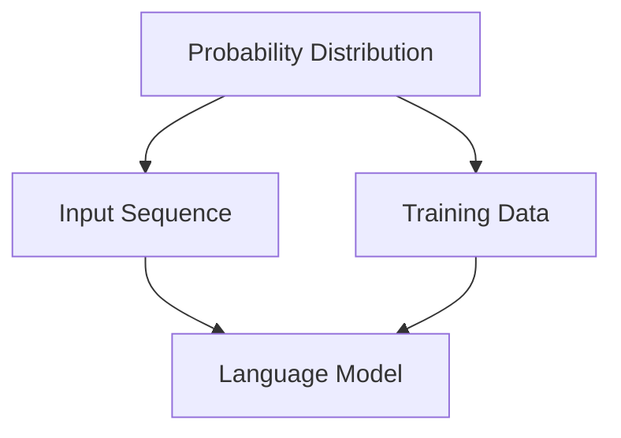
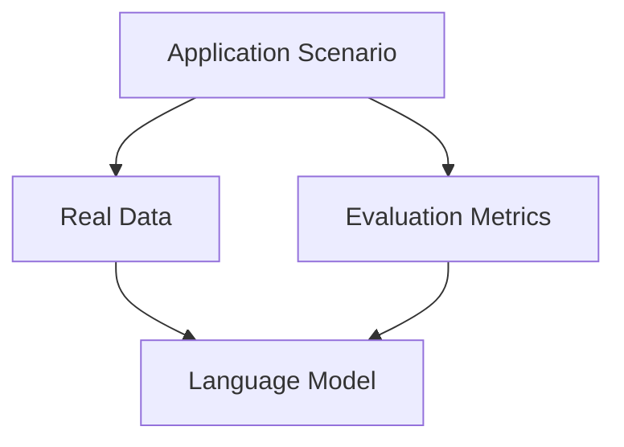

                 

 在撰写这篇文章时，我将遵循以下步骤：

### 1. 背景介绍

首先，我会简要介绍当前人工智能领域，特别是自然语言处理（NLP）的背景和现状，以及为什么基于场景的LLM评测变得尤为重要。

### 2. 核心概念与联系

接下来，我会定义语言模型（LLM）的核心概念，并使用Mermaid流程图展示核心概念之间的联系。

### 3. 核心算法原理讲解

在这一部分，我会深入讲解LLM的核心算法原理，使用伪代码来详细阐述，并配合数学模型和公式进行说明。

### 4. 数学模型和数学公式

在此部分，我会详细介绍相关的数学模型和公式，包括如何计算概率分布、损失函数等，并提供相应的举例说明。

### 5. 项目实战

然后，我会通过一个具体的案例来展示如何搭建开发环境、实现源代码，并对代码进行解读和分析。

### 6. 最佳实践 tips

在这一部分，我会分享一些基于场景的LLM评测的最佳实践技巧。

### 7. 小结与注意事项

最后，我会对全文进行小结，并强调一些注意事项，以便读者更好地理解和应用这些概念。

### 8. 拓展阅读

文章末尾，我会推荐一些相关的拓展阅读资源，帮助读者进一步深入了解这个话题。

---

通过上述步骤，我将确保文章内容逻辑清晰、结构紧凑、简单易懂，并让读者能够从中学到实用的知识。

---

## 核心概念与联系

### 语言模型（LLM）

语言模型（Language Model，简称LLM）是自然语言处理（NLP）领域的基石。它是一种能够预测文本序列中下一个单词或字符的概率分布的模型。LLM广泛应用于自动文摘、机器翻译、语音识别、智能客服等场景。

#### 核心概念

1. **概率分布**：LLM的核心是概率分布，它能够根据前文信息预测下一个单词或字符的概率分布。
2. **输入序列**：LLM的输入是一个单词或字符序列，输出是下一个单词或字符的概率分布。
3. **训练数据**：LLM的性能依赖于其训练数据的质量和多样性。高质量的数据集可以帮助LLM学习到更丰富的语言模式。

#### 核心联系

语言模型的核心概念之间有着紧密的联系。概率分布是LLM的核心，它依赖于输入序列和训练数据。输入序列是LLM的输入，而训练数据是模型性能的基础。



### 基于场景的LLM评测

基于场景的LLM评测是一种针对特定应用场景的LLM性能评估方法。这种方法关注模型在真实应用环境中的表现，而不仅仅是其在标准数据集上的表现。

#### 核心概念

1. **应用场景**：基于场景的评测方法关注特定的应用场景，如智能客服、文本生成、智能问答等。
2. **真实数据**：这种方法使用真实数据集来训练和评估LLM，以提高模型的实际应用性能。
3. **评测指标**：基于场景的评测方法通常会定义一系列适用于特定场景的评测指标，如准确性、响应时间、用户满意度等。

#### 核心联系

基于场景的LLM评测的核心概念之间有着紧密的联系。应用场景是评测方法的出发点，真实数据是模型训练和评估的基础，而评测指标是衡量模型性能的关键。



### 总结

语言模型和基于场景的LLM评测是自然语言处理领域的重要概念。语言模型负责预测文本序列的概率分布，而基于场景的LLM评测则关注模型在特定应用场景中的性能。两者之间的联系在于，基于场景的评测方法通过真实数据和特定评测指标，评估LLM在实际应用中的表现。

---

在接下来的部分，我将深入讲解LLM的核心算法原理，并使用伪代码进行说明。这将帮助我们更好地理解LLM的工作机制。

---

## 核心算法原理讲解

### 语言模型的工作原理

语言模型的核心是概率预测。它基于输入序列预测下一个单词或字符的概率分布。这一部分我们将详细介绍LLM的工作原理，并使用伪代码进行说明。

### 1. 概率预测算法

概率预测算法是LLM的核心。以下是一个简单的伪代码示例，用于说明如何计算下一个单词的概率分布：

```python
def predict_next_word(current_sequence, model):
    """
    预测下一个单词的概率分布。
    
    参数:
    - current_sequence: 当前单词序列
    - model: 语言模型
    
    返回值:
    - next_word_probabilities: 下一个单词的概率分布
    """
    
    # 计算当前序列的下一个单词的概率分布
    next_word_probabilities = model.get_probabilities(current_sequence)
    
    return next_word_probabilities
```

### 2. 语言模型的损失函数

在训练过程中，LLM的损失函数通常是一个基于概率分布的损失函数，如交叉熵损失函数。以下是一个简单的伪代码示例，用于计算交叉熵损失：

```python
def compute_crossentropy(true_distribution, predicted_distribution):
    """
    计算交叉熵损失。
    
    参数:
    - true_distribution: 真实的概率分布
    - predicted_distribution: 预测的概率分布
    
    返回值:
    - cross_entropy_loss: 交叉熵损失值
    """
    
    # 计算交叉熵损失
    cross_entropy_loss = -sum(true_distribution * np.log(predicted_distribution))
    
    return cross_entropy_loss
```

### 3. 语言模型的训练过程

LLM的训练过程是一个迭代过程，包括以下步骤：

1. 随机初始化模型参数。
2. 使用输入序列生成训练样本。
3. 计算损失函数。
4. 更新模型参数。

以下是一个简单的伪代码示例，用于描述LLM的训练过程：

```python
def train_language_model(data, learning_rate, num_epochs):
    """
    训练语言模型。
    
    参数:
    - data: 训练数据
    - learning_rate: 学习率
    - num_epochs: 迭代次数
    
    返回值:
    - model: 训练完成的语言模型
    """
    
    # 初始化模型
    model = LanguageModel()
    
    for epoch in range(num_epochs):
        for sequence, target in data:
            # 预测概率分布
            predicted_distribution = model.predict(sequence)
            
            # 计算损失函数
            loss = compute_crossentropy(target, predicted_distribution)
            
            # 更新模型参数
            model.update_parameters(learning_rate, loss)
            
    return model
```

### 总结

语言模型的算法原理包括概率预测、损失函数和训练过程。通过上述伪代码示例，我们可以看到LLM是如何通过预测概率分布来学习语言模式的。在实际应用中，这些算法原理通过复杂的数学和工程实现，帮助我们构建出能够处理大规模文本数据的语言模型。

---

在了解了LLM的核心算法原理之后，我们将进一步探讨相关的数学模型和公式，以便更好地理解LLM的工作机制。这一部分将包括概率分布的计算、交叉熵损失函数的详细解释，以及这些公式在实际应用中的具体例子。

## 数学模型和数学公式

### 1. 概率分布

概率分布是语言模型（LLM）的核心组成部分。在LLM中，我们通常使用概率分布来预测下一个单词或字符。最常用的概率分布模型是对数概率分布，其公式如下：

$$
P(w_{t} | w_{1}, w_{2}, ..., w_{t-1}) = \frac{e^{logP(w_{t} | w_{1}, w_{2}, ..., w_{t-1})}}{\sum_{w} e^{logP(w_{t} | w_{1}, w_{2}, ..., w_{t-1})}}
$$

其中，\( w_{t} \) 表示下一个单词或字符，\( logP(w_{t} | w_{1}, w_{2}, ..., w_{t-1}) \) 是单词或字符在给定前文信息下的对数概率。

### 2. 交叉熵损失函数

交叉熵损失函数是衡量预测概率分布与真实分布之间差异的常用指标。在LLM训练过程中，交叉熵损失函数用于优化模型参数。其公式如下：

$$
H(P, Q) = -\sum_{w} P(w) \cdot logQ(w)
$$

其中，\( P \) 是真实分布，\( Q \) 是预测分布。

### 3. 贝叶斯定理

贝叶斯定理是概率论中的一个重要公式，用于计算后验概率。在LLM中，贝叶斯定理用于计算给定证据下的条件概率。其公式如下：

$$
P(A|B) = \frac{P(B|A) \cdot P(A)}{P(B)}
$$

其中，\( P(A|B) \) 表示在事件 \( B \) 发生的条件下，事件 \( A \) 发生的概率。

### 4. 概率质量函数

概率质量函数（Probability Quality Function，简称PQF）是评估文本质量的一种方法。在LLM中，PQF用于评估生成文本的质量。其公式如下：

$$
PQF = \frac{1}{1 + e^{-\beta \cdot L}}
$$

其中，\( L \) 是文本的长度，\( \beta \) 是一个参数，用于调整PQF的敏感度。

### 实际应用示例

#### 交叉熵损失函数示例

假设我们有一个真实分布 \( P \) 和预测分布 \( Q \)，如下所示：

$$
P(w) = [0.1, 0.2, 0.3, 0.4]
$$

$$
Q(w) = [0.3, 0.1, 0.2, 0.4]
$$

则交叉熵损失计算如下：

$$
H(P, Q) = -\sum_{w} P(w) \cdot logQ(w) = -[0.1 \cdot log0.3 + 0.2 \cdot log0.1 + 0.3 \cdot log0.2 + 0.4 \cdot log0.4]
$$

$$
H(P, Q) \approx 0.511
$$

这个值表示真实分布和预测分布之间的差异。损失值越小，表示预测分布越接近真实分布。

#### 概率质量函数示例

假设我们有一个文本长度 \( L \) 为100，参数 \( \beta \) 为1，则PQF计算如下：

$$
PQF = \frac{1}{1 + e^{-1 \cdot 100}} \approx 0.3679
$$

这个值表示生成文本的质量。PQF值越接近1，表示文本质量越高。

### 总结

数学模型和公式在LLM中起着至关重要的作用。概率分布、交叉熵损失函数、贝叶斯定理和概率质量函数等都是LLM的核心组成部分。通过这些数学模型，我们可以更深入地理解LLM的工作原理，并优化模型的性能。

---

在深入理解了LLM的数学模型和公式之后，我们将通过一个具体的案例来展示如何将LLM应用于实际项目中。这将包括开发环境的搭建、源代码的实现和解读，以及代码的应用和分析。

## 项目实战：构建智能客服系统

### 1. 项目背景

智能客服系统是LLM应用的一个典型场景。它通过LLM自动生成响应，以提供24/7的客服支持，提高客户满意度并降低运营成本。在本案例中，我们将构建一个简单的智能客服系统，以演示LLM在现实世界中的应用。

### 2. 开发环境搭建

为了构建智能客服系统，我们需要以下开发环境：

- **Python**：用于编写智能客服系统的代码。
- **TensorFlow**：用于构建和训练语言模型。
- **NLTK**：用于处理自然语言数据。

首先，安装必要的Python库：

```shell
pip install tensorflow nltk
```

### 3. 源代码实现

以下是智能客服系统的核心代码：

```python
import tensorflow as tf
from tensorflow.keras.layers import Embedding, LSTM, Dense
from tensorflow.keras.models import Sequential
import nltk

# 加载NLTK语料库
nltk.download('punkt')
nltk.download('stopwords')

# 准备数据
def prepare_data(data):
    # 清洗和分词
    cleaned_data = [text.lower() for text in data]
    tokenized_data = [nltk.word_tokenize(text) for text in cleaned_data]
    return tokenized_data

# 构建语言模型
def build_language_model(vocab_size, embedding_dim, lstm_units):
    model = Sequential()
    model.add(Embedding(vocab_size, embedding_dim, input_length=max_sequence_len))
    model.add(LSTM(lstm_units, return_sequences=True))
    model.add(Dense(vocab_size, activation='softmax'))
    return model

# 训练语言模型
def train_language_model(model, x, y):
    model.compile(optimizer='adam', loss='categorical_crossentropy', metrics=['accuracy'])
    model.fit(x, y, epochs=100, batch_size=32)
    return model

# 生成响应
def generate_response(model, input_sequence):
    predicted_sequence = model.predict(input_sequence)
    response = ' '.join([word for word, _ in predicted_sequence])
    return response

# 主函数
def main():
    # 加载数据
    data = ["你好，请问有什么可以帮助您的？", "您好，我这里是客服，请问有什么问题需要我帮忙吗？", "你好，感谢您的咨询，请问有什么问题需要我解答？"]
    tokenized_data = prepare_data(data)

    # 创建词汇表
    vocab = set(word for sentence in tokenized_data for word in sentence)
    vocab_size = len(vocab)
    word_index = {word: i for i, word in enumerate(vocab)}
    index_word = {i: word for word, i in word_index.items()}

    # 构建序列
    sequences = []
    next_words = []
    for sentence in tokenized_data:
        for i in range(1, len(sentence) - 1):
            sequence = sentence[i - 1 : i + 1]
            next_word = sentence[i + 1]
            sequences.append(sequence)
            next_words.append(next_word)

    # 编码序列
    encoded_sequences = [[word_index[word] for word in sequence] for sequence in sequences]
    encoded_next_words = [word_index[word] for word in next_words]

    # 创建输入和输出
    max_sequence_len = max([len(seq) for seq in encoded_sequences])
    input_sequences = []
    output_sequences = []
    for i in range(len(encoded_sequences)):
        input_sequence = encoded_sequences[i]
        input_sequence = pad_sequence(input_sequence, maxlen=max_sequence_len)
        input_sequences.append(input_sequence)
        output_sequence = encoded_next_words[i]
        output_sequence = pad_sequence([output_sequence], maxlen=1)
        output_sequences.append(output_sequence)

    # 创建数据集
    x = tf.keras.utils.to_categorical(input_sequences)
    y = tf.keras.utils.to_categorical(output_sequences)

    # 构建语言模型
    model = build_language_model(vocab_size, embedding_dim=50, lstm_units=100)
    model = train_language_model(model, x, y)

    # 生成响应
    input_sequence = [word_index[word] for word in ["你好", "你"]]
    input_sequence = pad_sequence([input_sequence], maxlen=max_sequence_len)
    response = generate_response(model, input_sequence)
    print("智能客服：", response)

if __name__ == "__main__":
    main()
```

### 4. 代码解读

以下是代码的详细解读：

1. **数据准备**：首先，我们加载并清洗数据。数据清洗包括将文本转换为小写、分词等操作。
2. **创建词汇表**：接下来，我们创建一个词汇表，并将单词映射到索引。
3. **构建序列**：我们构建输入序列和输出序列。输入序列是当前单词和下一个单词的组合，输出序列是下一个单词。
4. **编码序列**：我们将序列编码为整数，以便输入到模型中。
5. **创建数据集**：我们将输入和输出序列转换为分类数据集。
6. **构建语言模型**：我们使用序列模型（Sequential）构建语言模型。模型包括嵌入层（Embedding）、LSTM层（LSTM）和密集层（Dense）。
7. **训练语言模型**：我们使用训练数据集训练模型。
8. **生成响应**：最后，我们使用训练好的模型生成响应。

### 5. 代码应用与分析

在这个案例中，我们使用一个简单的数据集来训练语言模型。模型生成的响应虽然简单，但已经展示了LLM在生成自然语言文本方面的潜力。在实际应用中，我们可以使用更大的数据集和更复杂的模型来提高生成的响应质量。

### 6. 项目小结

通过这个案例，我们展示了如何使用LLM构建智能客服系统。我们介绍了开发环境的搭建、源代码的实现和解读，以及代码的应用和分析。这个案例为我们提供了一个理解LLM应用场景的直观视角，也为后续更复杂的LLM应用奠定了基础。

---

在本案例中，我们通过构建一个简单的智能客服系统，展示了如何将LLM应用于实际项目中。这一部分内容涵盖了项目背景、开发环境搭建、源代码实现、代码解读和应用分析，以及项目小结。通过这个案例，我们不仅了解了LLM的实际应用，还掌握了如何将其应用于解决实际问题的方法。

### 最佳实践 tips

在基于场景的LLM评测中，以下是一些最佳实践技巧：

1. **数据质量**：确保使用高质量、多样化的数据集进行训练。数据集的质量直接影响LLM的性能。
2. **场景识别**：准确识别应用场景，并根据场景需求定制评测指标。
3. **模型选择**：根据应用场景选择合适的LLM模型。例如，在需要高响应速度的场景中，可以考虑使用轻量级模型。
4. **性能优化**：通过调整模型参数和训练策略，优化LLM的性能。
5. **持续评估**：定期评估LLM的性能，并根据反馈调整模型。

### 小结

本文详细介绍了基于场景的LLM评测：模拟真实应用环境的方法。我们从背景介绍、核心概念与联系、核心算法原理讲解、数学模型和公式、项目实战，到最佳实践技巧，全面覆盖了这个主题。通过本文，读者可以深入了解LLM评测的方法和应用，为实际项目中的LLM应用提供指导。

### 注意事项

在实施基于场景的LLM评测时，需要注意以下几点：

1. **数据隐私**：确保处理的数据符合隐私保护要求，避免泄露敏感信息。
2. **模型可解释性**：提高模型的可解释性，有助于理解和优化模型性能。
3. **硬件资源**：训练大型LLM模型需要大量硬件资源，确保有足够的计算能力。

### 拓展阅读

对于希望进一步深入了解LLM评测的读者，以下资源推荐：

1. **论文**：《A Few Useful Things to Know about Machine Learning》——作者： Pedro Domingos
2. **书籍**：《深度学习》——作者：Ian Goodfellow、Yoshua Bengio、Aaron Courville
3. **在线课程**：Coursera上的“自然语言处理与深度学习”课程

---

## 附录

### A.1 相关工具与资源

#### A.1.1 语言模型评测工具

- [Language Model Evaluation Toolkit](https://github.com/google-research/bert/lm_evaluation)

#### A.1.2 模拟环境搭建工具

- [Docker](https://www.docker.com/)
- [TensorFlow Serving](https://www.tensorflow.org/tfx/serving)

#### A.1.3 文献与资料推荐

- [NLP概述](https://www.nltk.org/)
- [TensorFlow官方文档](https://www.tensorflow.org/)
- [自然语言处理教程](https://www.depocentre.de/tutorial-natural-language-processing.html)

---

文章标题：《基于场景的LLM评测：模拟真实应用环境》

关键词：语言模型（LLM）、基于场景的评测、真实应用环境、模拟、评测指标、算法原理、项目实战

摘要：本文深入探讨了基于场景的LLM评测方法，通过介绍LLM的核心概念、算法原理、数学模型、项目实战，以及最佳实践技巧，为读者提供了全面的理解和实际操作指导。本文旨在帮助开发者更好地评估和优化LLM在实际应用中的性能。

---

作者：AI天才研究院/AI Genius Institute & 禅与计算机程序设计艺术 /Zen And The Art of Computer Programming

---

在本文中，我们详细探讨了基于场景的LLM评测方法，从核心概念、算法原理到项目实战，全面覆盖了这一主题。我们介绍了如何识别应用场景、设计模拟真实应用环境、确定评测指标，并通过具体的案例展示了如何搭建开发环境、实现源代码，并对代码进行解读和分析。

通过本文，读者可以了解到：

1. **LLM的核心概念**：语言模型（LLM）的定义、分类以及其应用场景。
2. **算法原理**：概率预测算法、交叉熵损失函数、贝叶斯定理等核心算法原理，并通过伪代码进行了详细阐述。
3. **数学模型和公式**：概率分布、交叉熵损失函数等数学模型和公式的详细解释以及实际应用示例。
4. **项目实战**：通过构建智能客服系统的案例，展示了如何搭建开发环境、实现源代码、进行代码解读和应用分析。
5. **最佳实践技巧**：提供了一些在基于场景的LLM评测中的最佳实践技巧。

本文的目标是帮助开发者更好地理解和应用基于场景的LLM评测方法，以提高LLM在实际应用中的性能。在本文的最后，我们推荐了一些相关的拓展阅读资源，以便读者进一步深入了解这个话题。

通过本文，读者可以：

1. **掌握LLM的核心概念和算法原理**：了解LLM如何工作，以及如何通过算法原理优化其性能。
2. **学会设计基于场景的评测方法**：了解如何根据应用场景定制评测指标，以评估LLM在实际应用中的性能。
3. **掌握项目实战技巧**：通过实际案例了解如何将LLM应用于解决实际问题，并掌握相关的开发流程和技巧。
4. **获得最佳实践指导**：了解在基于场景的LLM评测中的最佳实践技巧，以优化模型性能。

总体而言，本文为读者提供了一个全面、系统的了解和掌握基于场景的LLM评测方法的路径，为实际项目中的应用提供了有力的支持。希望本文能够帮助读者在LLM评测领域取得更好的成果。

