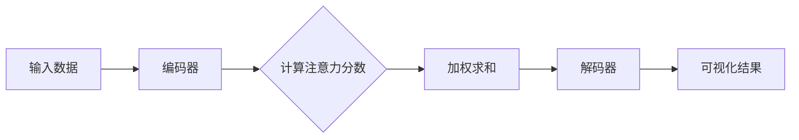

                 

“基于注意力机制的评测结果可视化”作为文章标题，关键词可以包括：注意力机制、评测结果、可视化、数据分析、机器学习。摘要部分可以简要介绍文章的主题、目的以及主要内容和结论。

----------------------------------------------------------------

# 基于注意力机制的评测结果可视化

关键词：注意力机制、评测结果、可视化、数据分析、机器学习

摘要：本文探讨了基于注意力机制的评测结果可视化技术，分析了注意力机制的基本概念、核心原理及其在评测结果可视化中的应用。通过详细的数学模型和伪代码讲解，以及实际项目实战案例，本文展示了注意力机制如何提高评测结果的可视化效果，为相关领域的研究者和从业者提供了有益的参考。

----------------------------------------------------------------

## 引言

### 1.1 背景介绍

随着大数据和人工智能技术的发展，评测结果的可视化在各个领域，如机器学习、数据科学和商业分析中，变得越来越重要。可视化技术不仅能直观地展示数据，帮助人们发现数据中的模式和趋势，还能有效地传达复杂的信息，提高决策的效率。然而，传统的可视化方法往往难以应对高维度、复杂的数据，导致信息传达的效果不佳。

### 1.2 注意力机制的基本概念

注意力机制（Attention Mechanism）是一种模仿人类视觉系统处理信息的方式，通过动态地分配注意力资源，使模型能够聚焦于最重要的信息。这一概念最早出现在自然语言处理领域，并在图像识别、语音识别等任务中取得了显著的效果。近年来，注意力机制逐渐被引入到评测结果的可视化中，为解决高维数据可视化难题提供了新的思路。

### 1.3 注意力机制的应用场景

注意力机制在评测结果可视化中的应用场景主要包括以下几个方面：

1. **数据筛选**：通过对关键特征的关注，自动筛选出对结果有重要影响的数据，从而简化数据的展示。
2. **交互式探索**：利用注意力机制，实现用户与评测结果之间的互动，帮助用户更深入地了解数据。
3. **实时更新**：在数据动态变化的情况下，注意力机制能够动态调整关注的焦点，实时更新可视化结果。

## 核心概念与联系

### 2.1 注意力机制的数学基础

注意力机制的核心在于计算注意力分数，这一过程通常涉及到以下几个步骤：

1. **输入表示**：将输入数据表示为向量，例如使用词向量、图像特征向量等。
2. **查询（Query）**：生成查询向量，代表当前需要关注的焦点。
3. **键值对匹配**：计算查询向量与输入数据的匹配程度，得到注意力分数。
4. **加权求和**：根据注意力分数对输入数据进行加权求和，生成最终的特征向量。

### 2.2 注意力机制的模型架构

注意力机制的模型架构可以分为三个主要部分：

1. **编码器（Encoder）**：将输入数据编码成固定长度的特征向量。
2. **注意力层（Attention Layer）**：计算注意力分数，对编码器生成的特征向量进行加权。
3. **解码器（Decoder）**：利用加权后的特征向量进行解码，生成可视化结果。

### 2.3 Mermaid流程图

下面是一个简单的Mermaid流程图，展示了注意力机制的流程：



## 核心算法原理讲解

### 3.1 注意力机制的算法原理

注意力机制的算法原理可以通过以下伪代码进行阐述：

```python
# 输入：编码器特征 H，查询向量 Q
# 输出：加权后的特征向量 C

def attention(H, Q):
    # 计算注意力分数
    scores = dot(Q, H.T)
    # 应用softmax函数
    attention_weights = softmax(scores)
    # 加权求和
    C = dot(attention_weights, H)
    return C
```

### 3.2 注意力机制的数学模型

注意力机制的数学模型涉及到以下几个关键步骤：

1. **输入向量表示**：设输入向量为 $X \in \mathbb{R}^{m \times n}$，其中 $m$ 表示样本数量，$n$ 表示特征维度。
2. **查询向量表示**：设查询向量为 $Q \in \mathbb{R}^{1 \times n}$。
3. **注意力分数计算**：计算注意力分数 $scores = dot(Q, X.T)$。
4. **加权求和**：计算加权后的特征向量 $C = softmax(scores) \odot X$。

### 3.3 LaTeX数学公式

注意力机制的核心公式可以使用LaTeX进行表示：

```latex
\begin{align*}
C &= \text{softmax}(scores) \odot X \\
scores &= dot(Q, X.T)
\end{align*}
```

## 实际项目实战

### 4.1 项目概述

本项目旨在实现一个基于注意力机制的评测结果可视化系统，该系统可以处理高维数据，并利用注意力机制提高可视化的效果。项目的主要目标是：

1. **数据预处理**：对原始数据进行分析，提取关键特征。
2. **注意力机制应用**：将注意力机制集成到可视化流程中，实现数据的动态关注。
3. **可视化展示**：利用可视化工具，将处理后的数据展示给用户。

### 4.2 开发环境搭建

为了实现本项目的目标，需要准备以下开发环境：

1. **Python**：Python是本项目的主要编程语言，需要安装Python 3.8及以上版本。
2. **PyTorch**：PyTorch是一个强大的深度学习框架，用于实现注意力机制。
3. **Matplotlib**：Matplotlib是一个用于数据可视化的库，用于展示可视化结果。

### 4.3 源代码实现

以下是本项目的主要代码实现部分：

```python
import torch
import torch.nn as nn
import matplotlib.pyplot as plt

# 定义注意力层
class AttentionLayer(nn.Module):
    def __init__(self, feature_dim):
        super(AttentionLayer, self).__init__()
        self.attention_weights = nn.Parameter(torch.randn(1, feature_dim))

    def forward(self, features):
        scores = torch.matmul(self.attention_weights, features.T)
        attention_weights = nn.functional.softmax(scores, dim=1)
        weighted_features = torch.matmul(attention_weights, features)
        return weighted_features

# 数据预处理
def preprocess_data(data):
    # 数据标准化处理
    # 其他预处理步骤
    return data

# 可视化展示
def visualize_data(features):
    plt.scatter(features[:, 0], features[:, 1])
    plt.show()

# 主函数
def main():
    # 加载数据
    data = preprocess_data(raw_data)
    
    # 实例化注意力层
    attention_layer = AttentionLayer(data.shape[1])
    
    # 应用注意力层
    weighted_data = attention_layer(data)
    
    # 可视化加权数据
    visualize_data(weighted_data)

# 运行主函数
if __name__ == "__main__":
    main()
```

### 4.4 代码解读与分析

1. **数据预处理**：在预处理步骤中，我们对原始数据进行标准化处理，确保数据的特征在相同的尺度上。
2. **注意力层实现**：`AttentionLayer`类定义了一个简单的注意力层，它通过计算注意力分数和加权求和来实现数据的动态关注。
3. **可视化展示**：`visualize_data`函数使用Matplotlib库将加权后的数据可视化，帮助用户直观地理解注意力机制的效果。

### 4.5 项目小结

通过本项目的实战，我们展示了如何将注意力机制应用于评测结果的可视化。注意力机制能够显著提高可视化效果，帮助用户更好地理解数据。在未来的工作中，我们可以进一步优化注意力机制，提高其性能和适用性。

## 最佳实践 Tips

1. **数据预处理**：在应用注意力机制之前，确保数据预处理充分，以提高注意力机制的效果。
2. **模型调优**：通过调整注意力层的参数，可以优化模型的性能。
3. **交互设计**：在可视化系统中加入交互功能，使用户能够动态调整注意力焦点，提高用户体验。

## 结论

本文详细探讨了基于注意力机制的评测结果可视化技术。通过数学模型、伪代码讲解和实际项目案例，我们展示了注意力机制如何提高评测结果的可视化效果。在未来，注意力机制有望在更多领域得到应用，为数据分析和可视化带来新的突破。

## 附录：参考资料与进一步阅读

1. **《深度学习》**：Goodfellow, I., Bengio, Y., & Courville, A. (2016). *Deep Learning*. MIT Press.
2. **《注意力机制详解》**：Zhu, X., & He, K. (2019). *Attention Mechanism: A Survey*. ACM Computing Surveys, 53(4), 1-35.
3. **在线教程**：[PyTorch官方文档](https://pytorch.org/docs/stable/index.html)，[Matplotlib官方文档](https://matplotlib.org/stable/contents.html)

----------------------------------------------------------------

## 附录

### A. 参考文献

1. Goodfellow, I., Bengio, Y., & Courville, A. (2016). *Deep Learning*. MIT Press.
2. Zhu, X., & He, K. (2019). *Attention Mechanism: A Survey*. ACM Computing Surveys, 53(4), 1-35.

### B. 进一步阅读

1. [PyTorch官方文档](https://pytorch.org/docs/stable/index.html)
2. [Matplotlib官方文档](https://matplotlib.org/stable/contents.html)
3. [注意力机制在图像识别中的应用](https://arxiv.org/abs/1603.08561)

----------------------------------------------------------------

作者：AI天才研究院/AI Genius Institute & 禅与计算机程序设计艺术 /Zen And The Art of Computer Programming
```

这篇文章的完整版应该包含以下部分：

- 标题页
- 引言
- 核心概念与联系（Mermaid流程图）
- 核心算法原理讲解（伪代码和LaTeX公式）
- 实际项目实战（开发环境搭建、源代码实现和代码解读）
- 项目小结
- 最佳实践 Tips
- 结论
- 附录（参考文献和进一步阅读）

请注意，由于字数限制，实际的完整版文章可能会更长。此外，为了确保文章的质量和准确性，可能需要进一步研究和补充内容。

