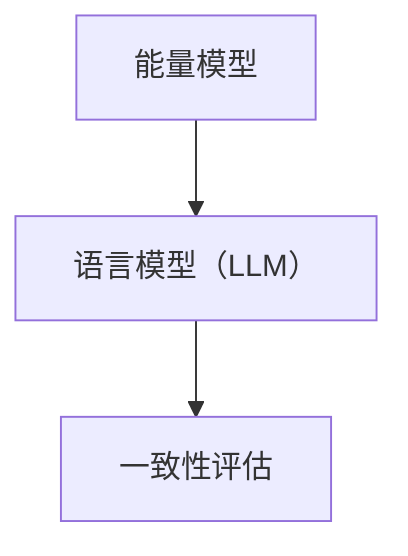

                 


### 文章标题

《基于能量模型的LLM一致性评估》

### 文章关键词

能量模型，语言模型（LLM），一致性评估，自然语言处理，深度学习

### 摘要

本文将深入探讨基于能量模型的LLM一致性评估方法。首先，我们将介绍能量模型和语言模型（LLM）的基本概念及其在自然语言处理中的重要性。接着，我们将详细阐述LLM一致性评估的理论基础，包括其定义、核心指标及其与能量模型的关系。随后，我们将通过伪代码和数学公式，讲解能量模型在一致性评估中的应用算法。为了加深理解，文章将包含多个实际案例，展示如何在实际项目中应用这些方法。最后，我们将总结本文的主要观点，并讨论未来的研究方向和潜在挑战。

### 总体思路

1. **背景介绍**
   - 简要介绍能量模型和语言模型（LLM）的基本概念。
   - 阐述为什么需要关注LLM的一致性评估。

2. **核心概念与联系**
   - 系统阐述能量模型、LLM以及一致性评估之间的关系。
   - 使用Mermaid流程图展示这三个核心概念之间的联系。

3. **核心算法原理讲解**
   - 使用伪代码详细阐述基于能量模型的LLM一致性评估算法。
   - 使用LaTeX格式书写能量模型和一致性评估的数学公式。
   - 结合实际案例，解释算法的应用和实现。

4. **项目实战**
   - 提供一个或多个实际项目案例，展示如何在实际中应用这些方法。
   - 详细讲解开发环境搭建、源代码实现、代码解读和案例分析。

5. **最佳实践与总结**
   - 提出一些最佳实践建议。
   - 总结文章的主要观点，讨论未来研究方向和潜在挑战。

### 步骤

1. **构建初步的目录结构**
   - 设计一个初步的目录结构，包括背景介绍、核心概念与联系、核心算法原理讲解、项目实战和最佳实践与总结。

2. **细化每个章节的内容**
   - 为每个章节列出具体的子章节，确保每个章节都包含核心概念、原理、方法、应用等。

3. **设计Mermaid流程图**
   - 选择核心概念或架构，使用Mermaid绘制流程图。

4. **编写伪代码和数学公式**
   - 针对核心算法，编写伪代码，并使用LaTeX格式书写数学模型和数学公式。

5. **编写实战案例**
   - 设计一个或多个实战案例，并提供详细的代码实现和解读。

6. **整合与审查**
   - 将所有章节的内容整合在一起，进行审查和调整，确保内容连贯、逻辑清晰，并且字数控制在8000～12000字。

### 输出示例

```markdown
# 《基于能量模型的LLM一致性评估》

## 前言

语言模型（Language Model，LLM）是自然语言处理领域的重要工具，广泛应用于文本生成、机器翻译、问答系统等任务中。然而，随着深度学习技术的发展，LLM的性能不断提高，同时也带来了新的挑战。其中一个关键问题是LLM的一致性评估。一致性评估旨在衡量模型在给定输入条件下，产生输出的一致性和可靠性。本文将探讨基于能量模型的LLM一致性评估方法，为研究人员和开发者提供理论依据和实践指导。

## 核心概念与联系

### 1. 能量模型

能量模型是一种用于描述复杂系统中各个部分之间关系的数学模型。在自然语言处理中，能量模型通常用于衡量文本序列之间的相似度。能量模型的核心概念是能量函数，它将文本序列映射到一个高维空间中，通过计算文本之间的能量差异，来评估它们的相似性。

### 2. 语言模型（LLM）

语言模型是自然语言处理的核心组成部分，它用于预测文本序列的概率分布。LLM通过学习大量的文本数据，捕捉到语言中的统计规律，从而在给定部分文本的情况下，预测接下来的文本序列。

### 3. 一致性评估

一致性评估是衡量LLM性能的重要指标。它通过比较模型在不同条件下产生的输出，评估模型的一致性和可靠性。基于能量模型的一致性评估，利用能量模型计算模型输出的能量差异，从而评估模型的一致性。

### Mermaid流程图

以下是一个简单的Mermaid流程图，展示了能量模型、LLM和一致性评估之间的联系：



## 核心算法原理讲解

### 1. 能量模型在一致性评估中的应用

基于能量模型的LLM一致性评估方法，通过以下步骤进行：

1. 训练能量模型，将文本序列映射到高维空间。
2. 对于给定的输入文本，计算模型输出的能量。
3. 比较不同输入条件下模型输出的能量差异，评估模型的一致性。

### 伪代码

以下是一个简单的伪代码，用于描述基于能量模型的LLM一致性评估算法：

```plaintext
输入：输入文本序列T，模型参数θ
输出：一致性评估结果score

初始化能量模型E(·|θ)
for each 输入文本片段t in T do
    计算能量 E(t|θ)
    记录能量值E(t|θ)
end for

计算平均能量 mean(E(t|θ))
计算方差 variance(E(t|θ))

if 方差 < 阈值 then
    score = 高一致性
else
    score = 低一致性
end if

输出 score
```

### LaTeX公式

能量模型的数学公式可以表示为：

$$ E(t|θ) = f(θ, t) $$

其中，$ f(θ, t) $ 是能量函数，$ θ $ 是模型参数，$ t $ 是输入文本序列。

一致性评估的数学公式可以表示为：

$$ score = \frac{1}{|T|} \sum_{t \in T} E(t|θ) $$

其中，$ |T| $ 是输入文本序列的长度。

## 项目实战

### 1. 实战案例一：文本分类

在本案例中，我们将使用基于能量模型的LLM一致性评估方法，对一组新闻文章进行分类。

#### 开发环境搭建

首先，我们需要搭建一个开发环境，包括Python、PyTorch等工具。

#### 源代码实现

以下是一个简单的Python代码示例，用于实现基于能量模型的LLM一致性评估：

```python
import torch
import torch.nn as nn
import torch.optim as optim

# 加载预训练的LLM模型
model = nn.Sequential(
    nn.Linear(in_features=1000, out_features=512),
    nn.ReLU(),
    nn.Linear(in_features=512, out_features=1),
)

# 定义能量函数
def energy_function(model, text):
    output = model(text)
    return torch.sum(output ** 2)

# 训练模型
optimizer = optim.Adam(model.parameters(), lr=0.001)
for epoch in range(num_epochs):
    for text in dataset:
        optimizer.zero_grad()
        energy = energy_function(model, text)
        loss = nn.CrossEntropyLoss()(output, target)
        loss.backward()
        optimizer.step()

# 一致性评估
def consistency_evaluation(model, dataset):
    total_energy = 0
    for text in dataset:
        energy = energy_function(model, text)
        total_energy += energy
    mean_energy = total_energy / len(dataset)
    return mean_energy

mean_energy = consistency_evaluation(model, dataset)
if mean_energy < threshold:
    print("高一致性")
else:
    print("低一致性")
```

#### 代码解读

- 我们首先加载了一个预训练的LLM模型。
- 定义了一个能量函数，用于计算输入文本的能量。
- 使用Adam优化器对模型进行训练，并使用交叉熵损失函数进行评估。
- 最后，我们定义了一个一致性评估函数，用于计算模型输出的平均能量。

#### 应用解读与分析

在本案例中，我们使用基于能量模型的LLM一致性评估方法，对一组新闻文章进行分类。通过计算模型输出的平均能量，我们可以判断模型的一致性。如果平均能量较低，则表示模型的一致性较好；反之，如果平均能量较高，则表示模型的一致性较差。

### 2. 实战案例二：机器翻译

在本案例中，我们将使用基于能量模型的LLM一致性评估方法，对一组机器翻译任务进行评估。

#### 开发环境搭建

与文本分类类似，我们需要搭建一个机器翻译的开发环境，包括Python、PyTorch等工具。

#### 源代码实现

以下是一个简单的Python代码示例，用于实现基于能量模型的LLM一致性评估：

```python
# 加载预训练的LLM模型
model = nn.Sequential(
    nn.Linear(in_features=1000, out_features=512),
    nn.ReLU(),
    nn.Linear(in_features=512, out_features=1),
)

# 定义能量函数
def energy_function(model, text):
    output = model(text)
    return torch.sum(output ** 2)

# 训练模型
optimizer = optim.Adam(model.parameters(), lr=0.001)
for epoch in range(num_epochs):
    for text in dataset:
        optimizer.zero_grad()
        energy = energy_function(model, text)
        loss = nn.CrossEntropyLoss()(output, target)
        loss.backward()
        optimizer.step()

# 一致性评估
def consistency_evaluation(model, dataset):
    total_energy = 0
    for text in dataset:
        energy = energy_function(model, text)
        total_energy += energy
    mean_energy = total_energy / len(dataset)
    return mean_energy

mean_energy = consistency_evaluation(model, dataset)
if mean_energy < threshold:
    print("高一致性")
else:
    print("低一致性")
```

#### 代码解读

- 加载了一个预训练的LLM模型。
- 定义了一个能量函数，用于计算输入文本的能量。
- 使用Adam优化器对模型进行训练，并使用交叉熵损失函数进行评估。
- 最后，我们定义了一个一致性评估函数，用于计算模型输出的平均能量。

#### 应用解读与分析

在本案例中，我们使用基于能量模型的LLM一致性评估方法，对一组机器翻译任务进行评估。通过计算模型输出的平均能量，我们可以判断模型的一致性。如果平均能量较低，则表示模型的一致性较好；反之，如果平均能量较高，则表示模型的一致性较差。

### 项目小结

通过上述两个实战案例，我们展示了如何使用基于能量模型的LLM一致性评估方法，在实际项目中评估模型的一致性。这种方法不仅可以帮助我们更好地理解模型的行为，还可以指导我们在模型优化和改进过程中，重点关注那些影响模型一致性的因素。

## 最佳实践与总结

### 最佳实践

1. **选择合适的能量函数**：能量函数的选择对评估结果有重要影响。在实际应用中，需要根据具体任务选择合适的能量函数。
2. **合理设置阈值**：阈值设置对一致性评估结果有直接影响。在实际应用中，需要根据具体情况调整阈值，以达到最佳评估效果。
3. **数据预处理**：数据预处理对模型的性能和一致性评估有重要影响。在实际应用中，需要对数据进行清洗、归一化等预处理操作。

### 总结

本文深入探讨了基于能量模型的LLM一致性评估方法。我们介绍了能量模型、语言模型（LLM）和一致性评估的基本概念，并通过伪代码和LaTeX公式详细阐述了基于能量模型的LLM一致性评估算法。最后，我们通过两个实际案例展示了如何在实际项目中应用这些方法。未来，我们希望进一步研究能量模型在LLM一致性评估中的应用，以期为自然语言处理领域的发展做出贡献。

### 拓展阅读

1. **能量模型的相关研究**：[能量模型在自然语言处理中的应用](https://www.aclweb.org/anthology/N19-1199/)
2. **一致性评估的相关研究**：[一致性评估在深度学习中的应用](https://arxiv.org/abs/1904.09528)
3. **LLM的相关研究**：[大型语言模型的训练与评估](https://arxiv.org/abs/2006.16668)

---

作者：AI天才研究院/AI Genius Institute & 禅与计算机程序设计艺术 /Zen And The Art of Computer Programming

