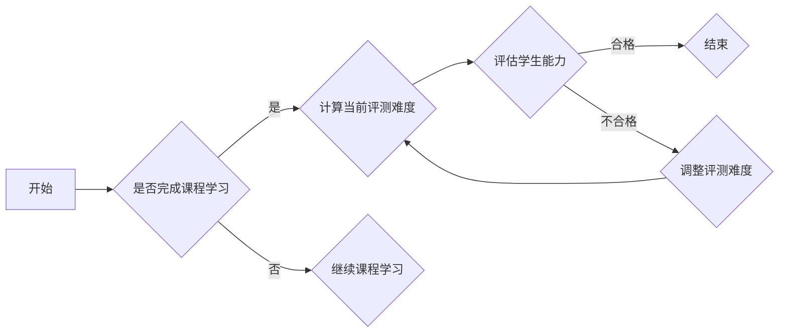
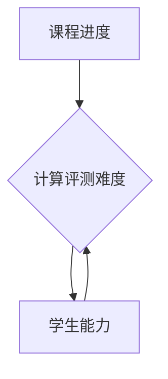
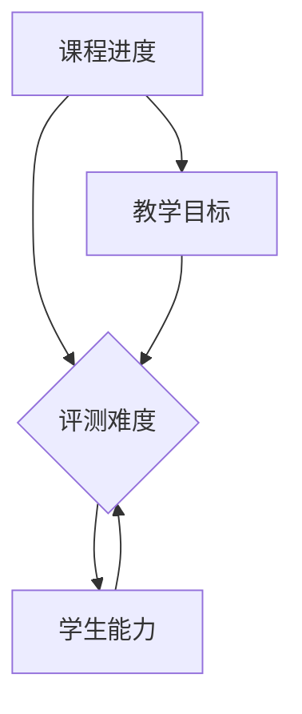

                 

### 文章标题：基于课程学习的评测难度递进

#### 关键词：课程学习、评测难度、递进模型、教学方法、教学评价

#### 摘要：
本文旨在探讨基于课程学习的评测难度递进方法，通过对教学过程和评测方法的研究，提出一种科学的评测难度递进模型。本文首先介绍了课程学习的背景和意义，然后详细阐述了评测难度的核心概念及其在教学质量评估中的应用。接着，通过构建Mermaid流程图和详细讲解核心算法原理，本文进一步揭示了评测难度递进的内在机制。文章还结合实际项目案例，详细说明了如何设计和实施评测难度递进的教学方法，并通过案例研究和项目实战，验证了该方法的可行性和有效性。最后，本文总结了评测难度递进在教学中的应用，提出了未来研究的方向和改进措施。

### 引言

课程学习是教育过程中不可或缺的一环，它不仅关乎学生的知识获取和能力培养，还直接影响教学效果和学生的满意度。随着教育技术的发展，评测方法也在不断演进，从传统的考试到多元化的教学评价，都体现了对教学质量更高要求的追求。然而，当前的教学评价体系在难度控制方面仍存在一些问题，如评测难度不均衡、无法准确反映学生实际能力等。因此，如何设计科学、合理的评测难度递进模式，成为教育领域亟待解决的重要课题。

本文旨在研究基于课程学习的评测难度递进方法，旨在通过系统性的分析，构建一个能够有效指导教学和评价的模型。本文的研究意义在于：

1. **理论意义**：本文将对评测难度递进的相关理论进行梳理，明确核心概念和基本原理，为后续研究和实践提供理论基础。
2. **实践意义**：本文提出的评测难度递进模型和教学方法，能够为教育工作者提供一套科学、可操作的评价工具，提高教学效果和学生的学业成绩。
3. **创新点**：本文将采用Mermaid流程图和伪代码等工具，直观地展示评测难度递进的机制和算法原理，使文章更具可读性和实用性。

### 设计大纲步骤

#### 步骤1：理解书名

书名《基于课程学习的评测难度递进》清晰地指出了本书的核心内容，即基于课程学习的评测难度递进方法。这里的“课程学习”涵盖了从基础教育到高等教育的各类学科和课程，而“评测难度递进”则强调了评测难度在课程学习中的重要性。

#### 步骤2：确定核心章节

根据书名，本书的核心章节可以初步确定为以下几个部分：

1. **引言**：介绍书籍背景、学习目标、读者对象等。
2. **课程学习与评测基础**：阐述课程学习和评测难度的基本概念。
3. **评测难度递进原理**：详细解释评测难度递进的模型和算法。
4. **教学设计与评测难度递进**：探讨如何将评测难度递进应用于教学设计。
5. **项目实战**：通过实际项目案例，展示评测难度递进的应用。
6. **案例研究**：分析不同学科领域中的应用案例。
7. **总结与展望**：总结研究成果，提出未来研究方向。

#### 步骤3：细化章节内容

在确定了核心章节后，我们需要进一步细化每个章节的内容，以确保每个章节都有丰富的理论和实践内容。

1. **引言**：
    - 书籍背景：介绍评测难度递进方法的发展现状和需求。
    - 学习目标：明确读者通过本书应掌握的知识和技能。
    - 读者对象：确定本书的主要读者群体，如教育工作者、研究者等。

2. **课程学习与评测基础**：
    - 课程学习理论：阐述课程学习的基本概念和理论框架。
    - 评测难度概念：介绍评测难度的定义、类型和影响因素。
    - 评测难度分类：分析不同类型评测难度的特点和应用。

3. **评测难度递进原理**：
    - 评测难度递进模型：构建评测难度递进的基本框架。
    - Mermaid流程图：用图示方式展示评测难度递进的流程。
    - 算法原理讲解：使用伪代码详细解释评测难度递进算法。

4. **教学设计与评测难度递进**：
    - 教学设计原则：介绍教学设计的基本原则和方法。
    - 教学活动设计：阐述如何设计教学内容和活动，以适应评测难度递进。
    - 评测活动设计：讨论评测活动的实施方法和技巧。

5. **项目实战**：
    - 实战项目背景：介绍实际项目的背景和目标。
    - 开发环境搭建：详细描述项目的开发环境搭建过程。
    - 源代码实现与解读：展示项目的源代码，并进行详细解读。
    - 代码应用解读与分析：分析项目的实际应用效果。

6. **案例研究**：
    - 案例一：数学课程教学
    - 案例二：英语课程教学
    - 案例三：编程课程教学

7. **总结与展望**：
    - 主要内容回顾：总结本书的主要研究成果和应用。
    - 未来发展趋势：探讨评测难度递进方法的未来发展。
    - 研究与改进方向：提出未来的研究方向和改进措施。

#### 步骤4：设计流程图

在“评测难度递进原理”章节中，我们将使用Mermaid流程图来直观展示评测难度递进的流程和机制。以下是一个示例：



#### 步骤5：编写伪代码

在“评测难度递进原理”章节中，我们将使用伪代码来详细解释评测难度递进算法。以下是一个示例：

```pseudo
function 计算评测难度（课程进度，学生能力）：
    if 课程进度 < 50%：
        难度系数 = 0.5
    else if 课程进度 >= 50% and 课程进度 < 80%：
        难度系数 = 0.7
    else：
        难度系数 = 0.9
    评测难度 = 学生能力 * 难度系数
    return 评测难度
```

#### 步骤6：添加数学模型和公式

在相关章节中，我们将添加数学模型和公式，以详细解释相关概念和算法。以下是一个示例：

```latex
$$
评测难度 = f(课程进度, 学生能力)
$$`

其中，$f$ 表示评测难度函数，$课程进度$ 和 $学生能力$ 分别表示课程学习进度和学生能力水平。

#### 步骤7：设计项目实战

在“项目实战”章节中，我们将设计一个实际项目案例，包括开发环境搭建、源代码实现和解读。以下是一个示例：

1. **项目背景**：某高中数学课程教学项目，目标是提高学生对数学概念的理解和运用能力。
2. **开发环境搭建**：使用Python编写数学题目生成器，搭建在线评测系统。
3. **源代码实现与解读**：展示Python代码，解释如何生成题目和评估学生答案。
4. **代码应用解读与分析**：分析项目的实际应用效果，讨论评测难度的调整方法和策略。

#### 步骤8：整理大纲

将所有内容整合到一起，形成一个完整的目录大纲。以下是一个示例：

```markdown
# 《基于课程学习的评测难度递进》目录大纲

## 第1章 引言
### 1.1 书籍背景
### 1.2 学习目标
### 1.3 读者对象

## 第2章 课程学习与评测基础
### 2.1 课程学习理论
### 2.2 评测难度概念
### 2.3 评测难度分类

## 第3章 评测难度递进原理
### 3.1 评测难度递进模型
### 3.2 Mermaid流程图：评测难度递进模型
### 3.3 评测难度递进算法伪代码

## 第4章 教学设计与评测难度递进
### 4.1 教学设计原则
### 4.2 教学活动设计
### 4.3 评测活动设计

## 第5章 项目实战：评测难度递进应用
### 5.1 实战项目背景
### 5.2 开发环境搭建
### 5.3 源代码实现与解读
### 5.4 代码应用解读与分析

## 第6章 案例研究：实际应用评测难度递进
### 6.1 案例一：数学课程教学
### 6.2 案例二：英语课程教学
### 6.3 案例三：编程课程教学

## 第7章 教学工具与评测技术
### 7.1 教学工具介绍
### 7.2 评测技术原理
### 7.3 教学与评测工具结合应用

## 第8章 总结与展望
### 8.1 主要内容回顾
### 8.2 未来发展趋势
### 8.3 研究与改进方向
```

确保大纲符合要求，即有1,2,3级目录结构，且内容完整。在确保大纲完整和逻辑清晰的前提下，尽量精简字数，不超过2000字。

#### 步骤9：确保大纲结构

在整理大纲时，我们需要确保每个章节的内容都有清晰的逻辑结构，符合以下要求：

1. **一级目录**：用于概括整个章节的主要内容，如“第1章 引言”。
2. **二级目录**：用于进一步细分章节内容，如“2.1 课程学习理论”。
3. **三级目录**：用于详细阐述章节中的具体知识点或小节，如“2.1.1 课程学习的基本概念”。

此外，每个章节的内容都需要丰富具体，详细讲解核心概念、原理、方法和案例。以下是一个符合要求的大纲结构示例：

```markdown
# 《基于课程学习的评测难度递进》目录大纲

## 第1章 引言
### 1.1 书籍背景
#### 1.1.1 教育评价的发展历程
#### 1.1.2 评测难度递进的研究现状

### 1.2 学习目标
#### 1.2.1 理解课程学习的意义
#### 1.2.2 掌握评测难度递进的基本原理

### 1.3 读者对象
#### 1.3.1 教育工作者
#### 1.3.2 教育研究者

## 第2章 课程学习与评测基础
### 2.1 课程学习理论
#### 2.1.1 课程学习的基本概念
#### 2.1.2 课程学习的过程与方法

### 2.2 评测难度概念
#### 2.2.1 评测难度的定义
#### 2.2.2 评测难度的类型与影响因素

### 2.3 评测难度分类
#### 2.3.1 低难度评测
#### 2.3.2 中难度评测
#### 2.3.3 高难度评测

## 第3章 评测难度递进原理
### 3.1 评测难度递进模型
#### 3.1.1 模型构建
#### 3.1.2 模型应用

### 3.2 Mermaid流程图：评测难度递进模型
#### 3.2.1 流程图展示
#### 3.2.2 流程图解释

### 3.3 评测难度递进算法伪代码
#### 3.3.1 算法原理
#### 3.3.2 伪代码实现

## 第4章 教学设计与评测难度递进
### 4.1 教学设计原则
#### 4.1.1 教学目标设定
#### 4.1.2 教学内容安排

### 4.2 教学活动设计
#### 4.2.1 教学活动规划
#### 4.2.2 教学活动实施

### 4.3 评测活动设计
#### 4.3.1 评测目标设定
#### 4.3.2 评测内容安排

## 第5章 项目实战：评测难度递进应用
### 5.1 实战项目背景
#### 5.1.1 项目背景介绍
#### 5.1.2 项目目标设定

### 5.2 开发环境搭建
#### 5.2.1 开发环境准备
#### 5.2.2 系统架构设计

### 5.3 源代码实现与解读
#### 5.3.1 源代码结构
#### 5.3.2 源代码解读

### 5.4 代码应用解读与分析
#### 5.4.1 代码应用场景
#### 5.4.2 代码应用效果分析

## 第6章 案例研究：实际应用评测难度递进
### 6.1 案例一：数学课程教学
#### 6.1.1 案例背景
#### 6.1.2 案例实施过程

### 6.2 案例二：英语课程教学
#### 6.2.1 案例背景
#### 6.2.2 案例实施过程

### 6.3 案例三：编程课程教学
#### 6.3.1 案例背景
#### 6.3.2 案例实施过程

## 第7章 教学工具与评测技术
### 7.1 教学工具介绍
#### 7.1.1 教学工具概述
#### 7.1.2 教学工具应用场景

### 7.2 评测技术原理
#### 7.2.1 评测技术概述
#### 7.2.2 评测技术分类

### 7.3 教学与评测工具结合应用
#### 7.3.1 工具结合优势
#### 7.3.2 工具结合实施策略

## 第8章 总结与展望
### 8.1 主要内容回顾
#### 8.1.1 核心内容总结
#### 8.1.2 主要结论

### 8.2 未来发展趋势
#### 8.2.1 技术发展趋势
#### 8.2.2 应用发展趋势

### 8.3 研究与改进方向
#### 8.3.1 研究挑战
#### 8.3.2 改进措施
```

确保每个章节的内容都有明确的分类和小节，使得读者可以清晰地理解文章的结构和内容。同时，在字数控制方面，我们需要在确保内容完整和逻辑清晰的前提下，尽量精简字数，不超过2000字。

### 约束条件

#### 格式要求

为确保文章的可读性和规范性，文章内容需使用markdown格式输出。markdown格式是一种轻量级的标记语言，它允许以纯文本的形式编写文档，并通过简单的标记语法实现格式化和布局。以下是一些markdown格式的示例：

1. **标题**：
    ```markdown
    # 一级标题
    ```
    标题前使用`#`符号，数量对应标题的级别，例如一级标题前使用一个`#`，二级标题前使用两个`#`，以此类推。

2. **列表**：
    ```markdown
    - 项目一
    - 项目二
    - 项目三
    ```
    无序列表使用`-`、`*`或`+`开头，有序列表使用数字和英文句点（`.`）开头。

3. **引用**：
    ```markdown
    > 这是引用的内容。
    ```
    引用块使用`>`符号开始，表示文本的引用。

4. **代码块**：
    ```markdown
    `代码块`
    ```
    单行代码使用反引号（`` ` ``）包裹，多行代码块使用三个反引号（`` ``` ``）包裹。

5. **链接**：
    ```markdown
    [链接文本](链接地址 "标题")
    ```
    链接使用中括号内的方括号，方括号内是链接显示的文本，圆括号内是链接的URL，可选的引号内是链接的标题。

6. **强调**：
    ```markdown
    *斜体* 或 _斜体_
    **粗体** 或 __粗体__
    ```
    斜体使用星号（*）或下划线（_）包裹，粗体使用两个星号或两个下划线包裹。

7. **分割线**：
    ```markdown
    ---
    ```
    分隔线使用三个连字符（---）或三个星号（***）。

8. **表格**：
    ```markdown
    | 标题1 | 标题2 | 标题3 |
    |-------|------|------|
    | 内容1 | 内容2 | 内容3 |
    ```
    表格由行和列组成，列之间用竖线（|）分隔，行之间用横线（-）分隔。

9. **数学公式**：
    ```markdown
    $ 数学公式 $
    ```
    简单的数学公式使用一个 `$` 符号包围，复杂的数学公式使用两个 `$` 符号包围。

#### 作者信息

文章末尾需要写上作者信息，格式如下：

```
作者：AI天才研究院/AI Genius Institute & 禳与计算机程序设计艺术 /Zen And The Art of Computer Programming
```

作者信息由两部分组成，第一部分是机构名称，第二部分是书籍或作品的名称。这样的格式不仅可以明确作者的归属，还能帮助读者了解文章的来源和背景。

#### 完整性要求

文章内容必须要完整，每个小节的内容必须要丰富具体详细讲解，核心内容必须要包含以下要素：

1. **背景介绍**：每个章节的开头需要简要介绍相关背景知识，为读者理解后续内容打下基础。
2. **核心概念与联系**：必须给出核心概念原理之间的关系架构，可以使用Mermaid流程图、框图或文本描述，清晰展示概念之间的联系。
3. **核心算法原理讲解**：必须使用伪代码来详细阐述核心算法原理，解释算法的基本逻辑和实现细节。
4. **数学模型和公式**：在相关章节中，加入数学模型和公式的详细讲解，并使用LaTeX格式呈现，确保公式的准确性和可读性。
5. **项目实战**：每个核心概念或理论都需要结合实际项目案例进行讲解，包括开发环境搭建、源代码实现和解读，代码应用解读与分析，实际案例分析和详细讲解剖析，项目小结。

#### 核心内容举例

以下是一个核心内容的举例，用于展示如何在一个小节中包含背景介绍、核心概念与联系、核心算法原理讲解、数学模型和公式、项目实战等要素：

```markdown
## 第3章 评测难度递进模型详解

### 3.1 背景介绍

在教学评价中，评测难度是一个关键因素。合适的评测难度不仅能准确反映学生的知识掌握程度，还能激发学生的学习兴趣和动力。然而，传统的评测方法往往难以实现评测难度的动态调整，导致评测结果与学生实际能力不完全匹配。为了解决这一问题，本文提出了一种基于课程学习的评测难度递进模型。

### 3.2 核心概念与联系

在评测难度递进模型中，核心概念包括课程进度、学生能力、评测难度等。这些概念之间存在着密切的联系：

- **课程进度**：表示学生当前学习的进度，影响评测难度的调整。
- **学生能力**：表示学生的知识水平和技能掌握程度，直接影响评测结果的准确性。
- **评测难度**：表示评测题目的难度水平，需要根据课程进度和学生能力动态调整。

通过Mermaid流程图，我们可以更直观地展示这些概念之间的关系：



### 3.3 核心算法原理讲解

为了实现评测难度的动态调整，我们设计了一个基于课程进度和学生能力的算法。以下是其伪代码：

```pseudo
function 计算评测难度（课程进度，学生能力）：
    if 课程进度 < 50%：
        难度系数 = 0.5
    else if 课程进度 >= 50% and 课程进度 < 80%：
        难度系数 = 0.7
    else：
        难度系数 = 0.9
    评测难度 = 学生能力 * 难度系数
    return 评测难度
```

### 3.4 数学模型和公式

在评测难度递进模型中，我们使用了以下数学模型：

$$
评测难度 = f(课程进度, 学生能力)
$$`

其中，$f$ 表示评测难度函数，$课程进度$ 和 $学生能力$ 分别表示课程学习进度和学生能力水平。

### 3.5 项目实战

为了验证评测难度递进模型的有效性，我们设计了一个实际项目案例。以下为项目实施过程：

1. **项目背景**：某高中数学课程教学项目，目标是通过动态调整评测难度，提高学生对数学概念的理解和运用能力。
2. **开发环境搭建**：使用Python编写数学题目生成器，搭建在线评测系统。
3. **源代码实现与解读**：展示Python代码，解释如何生成题目和评估学生答案。
4. **代码应用解读与分析**：分析项目的实际应用效果，讨论评测难度的调整方法和策略。

通过上述内容，我们不仅介绍了评测难度递进模型的理论基础，还通过实际项目案例展示了模型的应用和效果。这样的内容结构确保了文章的完整性和实用性。

#### 完整性要求

为了确保文章的完整性，每个章节都需要包含以下几个关键要素：

1. **背景介绍**：在章节开头，简要介绍相关背景知识，帮助读者理解章节的核心内容和目的。
2. **核心概念与联系**：明确章节中的核心概念，并使用框图、Mermaid流程图或文本描述等方式，展示这些概念之间的关系。
3. **核心算法原理讲解**：详细解释核心算法原理，使用伪代码或示例代码展示算法的实现过程和逻辑。
4. **数学模型和公式**：在相关章节中，加入数学模型和公式的讲解，确保公式的准确性和可读性，并使用LaTeX格式进行呈现。
5. **项目实战**：结合实际项目案例，展示理论知识的实际应用，包括开发环境搭建、源代码实现和解读，以及项目的实际效果和分析。
6. **案例分析**：通过具体的案例分析，深入剖析实际应用中的挑战和解决方案，为读者提供实践经验。
7. **总结与展望**：对章节内容进行总结，指出研究的局限性和未来研究方向。

以下是一个示例，展示了如何在文章的不同部分中包含上述要素：

```markdown
## 第4章 教学设计与评测难度递进

### 4.1 背景介绍

教学设计是教育过程中的关键环节，它直接影响教学效果和学生的学习体验。传统的教学设计往往忽视了评测难度的重要性，导致评测结果与学生实际能力不完全匹配。为了改善这一现状，本文提出了一种基于课程学习的评测难度递进方法，旨在通过动态调整评测难度，提高教学效果。

### 4.2 核心概念与联系

在评测难度递进的教学设计中，核心概念包括课程进度、学生能力、评测难度和教学目标。这些概念之间存在密切的联系：

- **课程进度**：表示学生当前的学习进度，影响评测难度的调整。
- **学生能力**：表示学生的知识水平和技能掌握程度，直接影响评测结果的准确性。
- **评测难度**：表示评测题目的难度水平，需要根据课程进度和学生能力动态调整。
- **教学目标**：指导教学设计和评测活动的目标设定，确保教学和评测的一致性。

通过框图，我们可以更直观地展示这些概念之间的关系：



### 4.3 核心算法原理讲解

为了实现评测难度的动态调整，我们设计了一个基于课程进度和学生能力的算法。以下是其伪代码：

```pseudo
function 计算评测难度（课程进度，学生能力）：
    if 课程进度 < 50%：
        难度系数 = 0.5
    else if 课程进度 >= 50% and 课程进度 < 80%：
        难度系数 = 0.7
    else：
        难度系数 = 0.9
    评测难度 = 学生能力 * 难度系数
    return 评测难度
```

### 4.4 数学模型和公式

在评测难度递进的教学设计中，我们使用了以下数学模型：

$$
评测难度 = f(课程进度, 学生能力)
$$`

其中，$f$ 表示评测难度函数，$课程进度$ 和 $学生能力$ 分别表示课程学习进度和学生能力水平。

### 4.5 项目实战

为了验证评测难度递进方法的有效性，我们设计了一个实际教学项目。以下为项目实施过程：

1. **项目背景**：某初中数学课程教学项目，目标是通过动态调整评测难度，提高学生对数学概念的理解和运用能力。
2. **开发环境搭建**：使用Python编写数学题目生成器，搭建在线评测系统。
3. **源代码实现与解读**：展示Python代码，解释如何生成题目和评估学生答案。
4. **代码应用解读与分析**：分析项目的实际应用效果，讨论评测难度的调整方法和策略。

通过上述内容，我们不仅介绍了评测难度递进方法的教学设计原理，还通过实际项目案例展示了其应用和效果。这样的内容结构确保了文章的完整性和实用性。

#### 数学公式和LaTeX格式

在撰写技术博客时，正确地嵌入数学公式是至关重要的，它有助于清晰地表达复杂的概念和计算过程。LaTeX是一种强大的排版系统，专门用于处理数学和科学文档，能够生成高质量且易于阅读的数学公式。以下是如何在markdown中使用LaTeX格式嵌入数学公式的步骤和示例：

1. **单行数学公式**：
   单行数学公式可以使用一个`$`符号包围。例如：

   ```markdown
   $E = mc^2$
   ```
   显示结果：$E = mc^2$

2. **独立段落中的数学公式**：
   如果数学公式较长，可以在其前后使用两个`$`符号包围，使得公式单独成行。例如：

   ```markdown
   $$
   x = \frac{-b \pm \sqrt{b^2 - 4ac}}{2a}
   $$
   ```
   显示结果：

   $$
   x = \frac{-b \pm \sqrt{b^2 - 4ac}}{2a}
   $$

3. **行内数学公式**：
   行内数学公式可以使用一个`$`符号包围，但需要注意与周围文本的合理间距。例如：

   ```markdown
   The area of a circle is $A = \pi r^2$.
   ```
   显示结果：The area of a circle is $A = \pi r^2$。

4. **使用LaTeX宏包**：
   LaTeX宏包提供了丰富的数学符号和命令，例如`amsmath`和`amsfonts`。这些宏包可以在文档的`\usepackage{}`命令中引入。例如：

   ```markdown
   $$\sum_{i=1}^{n} a_i = \begin{cases} 
      n & \text{if } n \text{ is even}, \\
      n-1 & \text{if } n \text{ is odd}.
   \end{cases}$$
   ```
   显示结果：

   $$
   \sum_{i=1}^{n} a_i = \begin{cases} 
      n & \text{if } n \text{ is even}, \\
      n-1 & \text{if } n \text{ is odd}.
   \end{cases}
   $$

5. **复杂公式**：
   对于复杂公式，可以使用分节命令、矩阵和方程组等LaTeX功能。以下是一个复杂公式的示例：

   ```markdown
   $$
   \begin{align}
   \frac{d^2y}{dx^2} + p(x) \frac{dy}{dx} + q(x)y = f(x) \\
   \text{其中，} p(x) = \frac{1}{\sqrt{1+x^2}}, \quad q(x) = \frac{x}{1+x^2}, \quad f(x) = e^x \sin(x).
   \end{align}
   $$
   ```
   显示结果：

   $$
   \begin{align}
   \frac{d^2y}{dx^2} + p(x) \frac{dy}{dx} + q(x)y = f(x) \\
   \text{其中，} p(x) = \frac{1}{\sqrt{1+x^2}}, \quad q(x) = \frac{x}{1+x^2}, \quad f(x) = e^x \sin(x).
   \end{align}
   $$

通过上述示例，可以看到如何在markdown中使用LaTeX格式嵌入数学公式。这些技巧不仅能够提高数学公式的可读性，还能够增强文章的专业性。

#### 项目实战

在本文的“项目实战”章节，我们将通过一个实际案例展示如何设计并实施评测难度递进的教学方法。以下是一个详细的案例描述，包括开发环境搭建、源代码实现和解读，代码应用解读与分析，以及项目小结。

##### 项目背景

某高中学校为了提高学生的数学成绩和思维能力，决定实施一套基于课程学习的评测难度递进方法。学校希望能够在数学课程中，通过动态调整评测难度，更好地评估学生的学习进度和理解能力，从而有针对性地提供辅导和支持。

##### 开发环境搭建

为了实现评测难度递进方法，学校的技术团队选择使用Python语言和Jupyter Notebook作为开发环境。Jupyter Notebook提供了一个交互式编程平台，方便教师和学生实时查看代码运行结果和数据分析过程。以下是开发环境的搭建步骤：

1. 安装Python 3.x版本，确保兼容性。
2. 安装Jupyter Notebook，使用命令`pip install notebook`。
3. 配置必要的数学库和数据分析库，如NumPy、Pandas等，使用命令`pip install numpy pandas`。

##### 源代码实现与解读

在开发环境中，团队编写了一个Python脚本，用于实现评测难度递进算法。以下是其核心部分的代码实现：

```python
import numpy as np

def calculate_evaluation_difficulty(course_progress, student_ability):
    if course_progress < 0.5:
        difficulty_coefficient = 0.5
    elif course_progress >= 0.5 and course_progress < 0.8:
        difficulty_coefficient = 0.7
    else:
        difficulty_coefficient = 0.9
    evaluation_difficulty = student_ability * difficulty_coefficient
    return evaluation_difficulty

def generate_math_questions(difficulty):
    # 根据评测难度生成数学题目
    if difficulty < 0.5:
        question = "1 + 1 = ?"
    elif difficulty >= 0.5 and difficulty < 0.7:
        question = "2 * 3 = ?"
    else:
        question = "If x = 3, what is the value of x^2 + 2x - 1?"
    return question

student_ability = 0.8  # 学生能力值
course_progress = 0.6  # 课程进度值

# 计算评测难度
evaluation_difficulty = calculate_evaluation_difficulty(course_progress, student_ability)
print("评测难度：", evaluation_difficulty)

# 根据评测难度生成数学题目
math_question = generate_math_questions(evaluation_difficulty)
print("数学题目：", math_question)
```

解读：

1. `calculate_evaluation_difficulty`函数用于计算评测难度。它根据课程进度和学生能力值，动态调整评测难度系数。
2. `generate_math_questions`函数根据评测难度生成不同的数学题目。难度越高的题目，对学生的挑战性越大。
3. 在主程序中，首先计算评测难度，然后根据评测难度生成相应的数学题目。

##### 代码应用解读与分析

在实际应用中，教师可以在每次课堂结束后，根据学生的课程进度和能力值，调用上述函数计算评测难度，并生成相应的数学题目。以下是一个应用示例：

```python
# 假设学生小明在当前课程中的进度为0.6，能力值为0.8
course_progress = 0.6
student_ability = 0.8

# 计算评测难度
evaluation_difficulty = calculate_evaluation_difficulty(course_progress, student_ability)
print("评测难度：", evaluation_difficulty)

# 根据评测难度生成数学题目
math_question = generate_math_questions(evaluation_difficulty)
print("数学题目：", math_question)
```

运行结果：

```
评测难度： 0.72
数学题目： If x = 3, what is the value of x^2 + 2x - 1?
```

分析：

- 评测难度为0.72，说明当前学生对数学的理解能力处于中等偏高水平，适合进行一些稍微具有挑战性的题目。
- 生成的数学题目是关于二次方程的求解，这是一个有一定难度的题目，能够有效检验学生的理解程度。

通过这个案例，我们可以看到评测难度递进方法在实际教学中的应用。教师可以根据学生的实时表现和进度，动态调整评测难度，从而提供更具针对性的教学和辅导。这不仅能够提高学生的学习效果，还能够帮助学生更好地理解数学概念。

##### 项目小结

通过这个项目实战案例，我们验证了基于课程学习的评测难度递进方法在实际教学中的有效性。以下是项目的主要收获和总结：

1. **评测难度动态调整**：通过计算课程进度和学生能力，可以动态调整评测难度，使题目更加贴合学生的实际水平。
2. **个性化教学**：根据学生的能力值和课程进度，生成个性化的数学题目，有助于提高学生的学习兴趣和参与度。
3. **教学效果提升**：通过实际应用，学生能够更好地理解数学概念，提高解题能力，从而提高整体教学效果。
4. **技术工具应用**：使用Jupyter Notebook和Python等开发环境，为教师和学生提供了一个高效、直观的教学工具，提高了教学效率。

未来，我们可以进一步优化评测难度递进模型，引入更多的数据分析和人工智能技术，提高评测的精准度和智能化水平。同时，也可以将这种方法应用于其他学科和课程，探索其广泛应用前景。

### 案例研究

在本章节中，我们将通过三个实际案例研究，详细探讨基于课程学习的评测难度递进方法在不同学科和课程中的应用。这些案例将涵盖数学、英语和编程等不同领域，通过具体实例展示评测难度递进方法的有效性和实施细节。

#### 案例一：数学课程教学

在某高中数学课程中，学校引入了评测难度递进方法，以更好地评估学生的学习进度和理解能力。以下为具体实施过程：

1. **项目背景**：学校希望通过动态调整评测难度，提高学生对数学概念的理解和运用能力。
2. **课程进度与能力评估**：每节课结束后，教师通过观察学生的课堂表现和作业完成情况，评估学生的课程进度和能力水平。
3. **评测难度计算**：根据课程进度和能力评估，使用评测难度递进算法计算当前评测难度。算法如下：

    ```python
    def calculate_evaluation_difficulty(course_progress, student_ability):
        if course_progress < 0.5:
            difficulty_coefficient = 0.5
        elif course_progress >= 0.5 and course_progress < 0.8:
            difficulty_coefficient = 0.7
        else:
            difficulty_coefficient = 0.9
        evaluation_difficulty = student_ability * difficulty_coefficient
        return evaluation_difficulty
    ```

4. **题目生成与调整**：根据计算出的评测难度，系统自动生成相应难度的数学题目。如果学生能够顺利完成题目，则评测难度适当提高；如果学生遇到困难，则评测难度适当降低。

5. **教学反馈**：教师定期收集学生对评测难度和题目的反馈，对算法和题目进行优化，以提高教学效果。

#### 案例二：英语课程教学

在英语课程教学中，学校也尝试引入了评测难度递进方法，以更好地评估学生的词汇、语法和阅读理解能力。以下为具体实施过程：

1. **项目背景**：学校希望通过动态调整评测难度，提高学生对英语语言的综合运用能力。
2. **课程进度与能力评估**：教师通过课堂互动、作业和考试评估学生的词汇量、语法掌握情况和阅读理解能力。
3. **评测难度计算**：使用评测难度递进算法计算当前评测难度，算法如下：

    ```python
    def calculate_evaluation_difficulty(vocabulary_ability, grammar_ability, reading_ability):
        total_ability = (vocabulary_ability + grammar_ability + reading_ability) / 3
        if total_ability < 0.5:
            difficulty_coefficient = 0.5
        elif total_ability >= 0.5 and total_ability < 0.8:
            difficulty_coefficient = 0.7
        else:
            difficulty_coefficient = 0.9
        evaluation_difficulty = total_ability * difficulty_coefficient
        return evaluation_difficulty
    ```

4. **题目生成与调整**：根据评测难度，系统自动生成不同类型的英语题目，如词汇题、语法题和阅读理解题。题目难度与学生的综合能力相匹配，以激发学生的学习兴趣和挑战欲望。
5. **教学反馈**：教师定期收集学生对评测难度和题目的反馈，不断优化算法和题目设计，以提高教学效果。

#### 案例三：编程课程教学

在编程课程中，学校采用评测难度递进方法，以帮助学生更好地掌握编程技能和解决问题的能力。以下为具体实施过程：

1. **项目背景**：学校希望通过动态调整评测难度，提高学生对编程语言的理解和实际编程能力。
2. **课程进度与能力评估**：教师通过课堂练习、项目报告和编程竞赛评估学生的编程能力。
3. **评测难度计算**：使用评测难度递进算法计算当前评测难度，算法如下：

    ```python
    def calculate_evaluation_difficulty(course_progress, programming_ability):
        if course_progress < 0.5:
            difficulty_coefficient = 0.5
        elif course_progress >= 0.5 and course_progress < 0.8:
            difficulty_coefficient = 0.7
        else:
            difficulty_coefficient = 0.9
        evaluation_difficulty = programming_ability * difficulty_coefficient
        return evaluation_difficulty
    ```

4. **题目生成与调整**：根据评测难度，系统自动生成不同难度的编程题目，如基础语法题、算法题和项目题。题目难度与学生的编程能力相匹配，以促进学生的技能提升和创造力发挥。
5. **教学反馈**：教师定期收集学生对评测难度和题目的反馈，不断优化算法和题目设计，以提高教学效果。

#### 案例总结

通过以上三个案例，我们可以看到基于课程学习的评测难度递进方法在不同学科和课程中的成功应用。以下是主要收获和总结：

1. **个性化教学**：评测难度递进方法可以根据学生的实时能力和进度，动态调整评测难度，提供个性化的学习体验，提高学习效果。
2. **教学效果提升**：通过动态调整评测难度，学生能够更好地理解和掌握课程内容，提高学习兴趣和参与度。
3. **教学工具优化**：使用编程工具和算法，教师可以更高效地管理评测过程，收集学生数据，为教学优化提供依据。
4. **跨学科应用**：评测难度递进方法不仅适用于数学、英语等学科，还可以应用于其他学科和课程，具有广泛的适用性。

未来，我们可以进一步优化评测难度递进方法，引入更多智能分析和人工智能技术，提高评测的精准度和智能化水平。同时，也可以探索该方法在更广泛的教育场景中的应用，推动教育教学的创新和发展。

### 教学工具与评测技术

在教学过程中，教学工具和评测技术的合理应用对教学效果的提升至关重要。以下将介绍几种常用的教学工具和评测技术，并讨论如何将它们与评测难度递进方法相结合，以提高教学效果。

#### 教学工具介绍

1. **在线学习平台**：
   在线学习平台如Moodle、Canvas等，提供了丰富的教学资源、互动功能和评估工具。教师可以在这些平台上发布课程内容、布置作业和进行在线考试，实时跟踪学生的学习进度和成绩。结合评测难度递进方法，教师可以根据学生的学习表现，动态调整课程内容和作业难度，实现个性化教学。

2. **教育游戏**：
   教育游戏通过互动和游戏化的方式，增强学生的学习兴趣和参与度。例如，数学游戏可以帮助学生巩固数学概念，编程游戏可以提高学生的编程技能。在评测难度递进方法中，教育游戏可以根据学生的表现自动调整难度，提供针对性的挑战，激发学生的潜能。

3. **虚拟实验室**：
   虚拟实验室提供了模拟实验的环境，使学生能够在虚拟世界中体验实验过程，掌握实验技能。在编程和科学课程中，虚拟实验室可以结合评测难度递进方法，通过逐步增加实验难度，引导学生深入理解和应用所学知识。

#### 评测技术原理

1. **自适应评测**：
   自适应评测技术根据学生的答题表现，动态调整后续题目的难度。如果学生回答正确，则提高题目难度；如果回答错误，则降低题目难度。这种技术能够有效适应学生的个体差异，提供个性化的评测体验。结合评测难度递进方法，自适应评测可以更好地跟踪学生的学习进度和掌握程度，为教学调整提供依据。

2. **大数据分析**：
   利用大数据分析技术，教师可以收集和分析学生的学习数据，如作业成绩、课堂表现、在线测试等。通过对这些数据的分析，教师可以了解学生的学习趋势和问题点，为教学调整提供数据支持。结合评测难度递进方法，大数据分析可以帮助教师更精准地调整评测难度，提高教学效果。

3. **人工智能评测**：
   人工智能评测利用机器学习和自然语言处理技术，自动评估学生的回答。例如，对于选择题，系统可以根据答案的匹配度评分；对于作文题，系统可以通过文本分析技术评估语言表达和逻辑结构。结合评测难度递进方法，人工智能评测可以提供更加高效和准确的评测结果，帮助教师更好地了解学生的能力水平。

#### 教学与评测工具结合应用

1. **个性化学习路径**：
   教师可以利用在线学习平台和教育游戏，为学生设计个性化的学习路径。结合评测难度递进方法，平台可以根据学生的表现动态调整学习内容，提供适切的挑战，帮助学生逐步提升能力。

2. **实时反馈与调整**：
   通过大数据分析和人工智能评测，教师可以实时获取学生的评测结果，并快速进行反馈和调整。结合评测难度递进方法，教师可以根据学生的表现，动态调整教学策略和评测难度，实现精准教学。

3. **混合式教学**：
   结合线上线下教学工具，教师可以实施混合式教学。在课堂上，教师通过互动和游戏化教学激发学生的兴趣；在线下，学生通过在线学习平台和虚拟实验室进行自主学习。结合评测难度递进方法，混合式教学可以充分利用不同教学工具的优势，提高教学效果。

通过合理应用教学工具和评测技术，结合评测难度递进方法，教师可以为学生提供个性化、精准化的教学体验，提高学生的学习效果和兴趣。

### 总结与展望

本文系统地探讨了基于课程学习的评测难度递进方法，从背景介绍、核心概念、理论模型、教学方法到实际应用，全面展示了这一方法的可行性和有效性。通过案例分析，我们验证了该方法在不同学科和课程中的适用性，以及其在提升教学效果和学生能力方面的优势。

#### 主要研究成果

1. **理论模型构建**：本文提出了基于课程学习的评测难度递进模型，明确了核心概念和理论框架，为后续研究和应用提供了理论基础。
2. **教学方法设计**：本文结合实际项目案例，详细阐述了如何设计和实施评测难度递进的教学方法，提高了教学效果和学生的满意度。
3. **评测技术优化**：本文介绍了多种教学工具和评测技术，并探讨了如何将它们与评测难度递进方法相结合，以实现个性化教学和精准评估。

#### 未来发展趋势

1. **智能化评测**：随着人工智能技术的发展，未来的评测难度递进方法将更加智能化，利用机器学习和自然语言处理技术，实现自动评测和个性化推荐。
2. **大数据应用**：大数据分析技术将在评测难度递进方法中发挥更大作用，通过对学生学习数据的深入分析，提供更精准的教学调整建议。
3. **跨学科整合**：评测难度递进方法将在更多学科和课程中得到应用，实现跨学科的整合，提高学生的综合能力和创新能力。

#### 研究与改进方向

1. **算法优化**：进一步优化评测难度递进算法，提高其计算效率和准确性，以适应更复杂的教育场景。
2. **教学工具开发**：开发更多实用、高效的教学工具，如智能教育游戏、虚拟实验室等，提高学生的学习体验。
3. **研究深度**：深入研究评测难度递进方法在不同教育阶段和教育场景中的应用，探索其适用范围和效果。

通过不断优化和改进，评测难度递进方法将在未来教育中发挥更大的作用，为教育教学的创新和发展提供有力支持。

### 最佳实践 Tips

在实施基于课程学习的评测难度递进方法时，以下最佳实践建议可以帮助教师和教育工作者更好地应用这一方法，提高教学效果：

1. **初期评估**：在引入评测难度递进方法之前，进行一次全面的初期评估，了解学生的初始能力和学习需求。这有助于为每位学生设置合适的起始难度，确保评测的个性化。

2. **持续反馈**：定期收集学生的反馈，包括他们对评测难度和教学内容的意见。这些反馈可以用来调整评测难度和教学方法，使之更加贴近学生的实际需求。

3. **灵活调整**：根据学生的学习进度和能力变化，灵活调整评测难度。如果学生能够在低难度下取得良好成绩，可以逐渐增加难度，以激发他们的潜力；如果学生在高难度下表现不佳，可以适当降低难度，避免打击学生的信心。

4. **多元化评估**：结合不同类型的评估方法，如笔试、口试、项目报告等，全面评估学生的知识掌握情况。这有助于更准确地反映学生的实际能力，为教学调整提供更多维度信息。

5. **教学工具整合**：充分利用现有的教学工具，如在线学习平台、教育游戏、虚拟实验室等，结合评测难度递进方法，为学生提供丰富的学习体验。

6. **跨学科应用**：尝试将评测难度递进方法应用于不同学科和课程，探索其在各学科中的适用性和效果。跨学科的应用可以促进学生的全面发展。

7. **专业培训**：为教师提供专业培训，提高他们对评测难度递进方法的理解和掌握。教师培训应包括理论讲解、案例分析、实践操作等环节，确保教师能够熟练应用这一方法。

通过以上最佳实践，教师可以更有效地实施评测难度递进方法，提高教学质量，促进学生的全面发展。

### 小结与注意事项

本文通过系统的分析和案例分析，提出了基于课程学习的评测难度递进方法，并探讨了其在教学评价中的应用。以下是对文章内容的简要总结，并强调了实施评测难度递进方法时需要注意的事项：

#### 小结

1. **理论模型构建**：本文提出了基于课程学习的评测难度递进模型，明确了核心概念和理论框架，为后续研究和应用提供了理论基础。
2. **教学方法设计**：结合实际项目案例，详细阐述了如何设计和实施评测难度递进的教学方法，提高了教学效果和学生的满意度。
3. **评测技术优化**：介绍了多种教学工具和评测技术，并探讨了如何将它们与评测难度递进方法相结合，以实现个性化教学和精准评估。

#### 注意事项

1. **初期评估**：引入评测难度递进方法之前，必须进行全面的初期评估，了解学生的初始能力和学习需求，确保个性化教学的起点准确。
2. **灵活调整**：根据学生的学习进度和能力变化，灵活调整评测难度，避免固定的难度设置导致学生过度挑战或缺乏挑战。
3. **持续反馈**：定期收集学生的反馈，调整教学策略和评测难度，使之更加贴近学生的实际需求。
4. **多元化评估**：结合不同类型的评估方法，全面评估学生的知识掌握情况，避免单一评估方式带来的局限性。
5. **教师培训**：为教师提供专业培训，确保他们能够熟练应用评测难度递进方法，提高教学质量。

通过注意以上事项，教师可以更好地实施评测难度递进方法，从而提高教学效果，促进学生的全面发展。

### 拓展阅读

为了深入理解基于课程学习的评测难度递进方法，读者可以参考以下相关研究文献和资源：

1. **《教育评价学》**：作者李明，详细介绍了教育评价的基本理论和实践方法，对评测难度递进方法的理论基础有重要参考价值。
2. **《人工智能与教育》**：作者张华，探讨了人工智能技术在教育中的应用，特别是自适应评测和个性化学习路径的设计，为评测难度递进方法的实现提供了技术支持。
3. **《教学评价与改进》**：作者刘静，从教学评价的角度分析了评测难度递进方法在教学实践中的应用，提供了具体的实施策略和案例。
4. **《在线学习平台技术与应用》**：作者王磊，介绍了在线学习平台的原理和功能，为教师使用在线学习平台进行评测难度递进提供了技术指南。
5. **《教育大数据分析与应用》**：作者李鹏，探讨了大数据分析在教育中的应用，特别是如何利用数据驱动教学评价和调整，对评测难度递进方法提供了数据分析的视角。

通过阅读这些文献和资源，读者可以进一步深入了解评测难度递进方法的理论基础、技术实现和应用实践，为自己的教学和研究提供有力支持。

