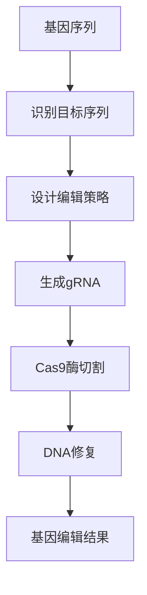

                 

### 《基因编辑的组合优化：DNA序列的数学设计》

---

### **关键词**：

基因编辑，组合优化，DNA序列设计，数学模型，算法实现，案例分析

---

### **摘要**：

本文旨在探讨基因编辑中组合优化理论的应用，通过对DNA序列的数学设计进行深入分析，阐述如何利用组合优化算法提升基因编辑的精确性和效率。文章首先介绍了基因编辑的基本概念、技术原理和应用领域，接着详细介绍了组合优化理论的基本概念、经典问题和算法，随后讲解了DNA序列设计的基本原则、方法和工具。文章的核心部分介绍了用于DNA序列设计的数学模型，包括优化模型和仿真模型，并通过伪代码详细阐述了核心算法原理。最后，通过实际案例分析展示了基因编辑的组合优化应用，并讨论了未来的研究方向和挑战。

---

## **第一部分：基因编辑基础**

### **第1章：基因编辑概述**

基因编辑是一项革命性技术，它允许科学家在DNA水平上精确修改生物体的基因组。这不仅为治疗遗传性疾病提供了新的途径，也在农业、生物工程和生物医学研究领域显示出巨大的潜力。

### **1.1 基因编辑的定义与历史背景**

基因编辑，简单地说，就是指对生物体的基因组进行精确的修改。这种修改可以是添加、删除或替换基因序列中的某些部分，以达到改变生物体特定性状的目的。基因编辑技术的发展可以追溯到20世纪末，最初的基因工程技术如基因克隆和基因转移已经为这一领域奠定了基础。

随着分子生物学和生物技术的不断进步，基因编辑技术逐渐成熟。CRISPR-Cas9技术的出现，使得基因编辑变得简单、高效和低成本。CRISPR（Clustered Regularly Interspaced Short Palindromic Repeats）是一种细菌的免疫系统，Cas9是一种蛋白质，可以识别并切割特定的DNA序列。通过设计特定的引导RNA（gRNA），CRISPR-Cas9系统能够定位并切割目标DNA序列，实现基因的插入、删除或替换。

**核心概念与联系**：

基因编辑的核心在于对DNA序列的精确操作。这涉及到以下几个关键概念：

1. **DNA序列**：基因编辑的起点和终点都是DNA序列。了解DNA序列的组成和结构对于设计有效的基因编辑策略至关重要。
2. **引导RNA（gRNA）**：在CRISPR-Cas9系统中，gRNA起着关键作用，它决定了Cas9酶切割的位置。因此，设计高效的gRNA是基因编辑成功的关键。
3. **酶切割**：Cas9酶切割DNA序列的精确性直接影响基因编辑的效果。了解切割机制的细节有助于优化编辑过程。

**结构流程图**：



### **1.2 主要基因编辑技术**

目前，主要的基因编辑技术包括CRISPR-Cas9、TALEN、ZFN等。

- **CRISPR-Cas9**：如前所述，CRISPR-Cas9是目前最流行的基因编辑工具。其优点包括高效、精确和成本低。
- **TALEN**：TALEN（Transcription Activator-Like Effector Nucleases）是一种类似CRISPR-Cas9的基因编辑技术，它使用特定的DNA结合域和核酸内切酶域来切割DNA。
- **ZFN**（锌指核酸酶）：ZFN使用锌指蛋白来识别特定的DNA序列，并通过双链DNA切割酶进行切割。虽然ZFN的效率不如CRISPR-Cas9，但在某些应用中仍然具有重要价值。

**核心概念与联系**：

每种基因编辑技术都有其独特的优势和局限性。选择适当的编辑工具取决于具体的应用需求和实验条件。

### **1.3 基因编辑的应用领域**

基因编辑技术已经在多个领域得到广泛应用：

- **医学**：基因编辑可以用于治疗单基因遗传疾病，如囊性纤维化、遗传性失聪等。
- **农业**：基因编辑可以用于培育抗病、抗虫、高产的农作物，改善食品品质。
- **生物医学研究**：基因编辑为研究基因功能和疾病机制提供了强大的工具，有助于揭示复杂的生物学现象。

**核心概念与联系**：

基因编辑技术的应用潜力巨大，但同时也面临伦理和安全问题。合理、谨慎地使用这一技术对于社会和科学的发展至关重要。

### **小结**：

基因编辑是一项颠覆性的技术，它正在改变我们对生命科学的理解和应用。通过了解其基本概念、技术和应用，我们可以更好地把握这一领域的发展趋势和潜在价值。

---

## **第二部分：组合优化理论**

### **第2章：组合优化理论简介**

组合优化理论是运筹学中的一个重要分支，主要研究在有限资源条件下如何做出最优决策。它在基因编辑的组合优化中起着关键作用，帮助科学家设计出最优的DNA编辑策略。

### **2.1 组合优化的基本概念**

组合优化涉及多个元素的集合，并寻找一个或多个最优解。基本概念包括：

- **目标函数**：定义了评价解的质量的标准。
- **约束条件**：限制了解的空间，确保解满足特定的条件。
- **解空间**：所有可能的解的集合。

**核心概念与联系**：

组合优化理论与基因编辑的关系在于，目标函数和约束条件可以用来定义DNA编辑的最佳策略。例如，目标函数可以是最小化编辑错误率，而约束条件可以是保持基因的功能性和稳定性。

### **2.2 经典组合优化问题**

组合优化问题有很多种，其中一些经典问题包括：

- **背包问题**：在有限的容量下，如何选择物品以最大化总价值。
- **图着色问题**：如何给图的顶点染色，使得相邻的顶点颜色不同。
- **旅行商问题**：在给定的一系列城市中，找到一条最短的路径，经过每个城市一次且仅一次。

**核心概念与联系**：

这些经典问题在基因编辑中也有应用。例如，背包问题可以用来优化基因片段的拼接，而旅行商问题可以用来设计最佳的DNA编辑路径。

### **2.3 组合优化算法介绍**

常见的组合优化算法包括：

- **贪心算法**：通过局部最优选择逐步逼近全局最优解。
- **动态规划**：通过分阶段递归解决最优子结构问题。
- **遗传算法**：模拟自然进化过程，通过种群进化找到最优解。

**核心概念与联系**：

这些算法为基因编辑提供了强大的工具，使得复杂的问题可以通过计算得到较好的解决方案。

### **2.4 组合优化在基因编辑中的应用**

组合优化理论在基因编辑中的应用主要包括：

- **DNA编辑路径规划**：通过优化算法设计出最佳的DNA编辑路径。
- **基因片段拼接**：在基因工程中，如何高效地拼接基因片段。
- **基因编辑工具选择**：根据实验需求和约束条件，选择最合适的基因编辑工具。

**核心概念与联系**：

组合优化算法不仅提高了基因编辑的效率，还保证了编辑的精确性和稳定性。

### **小结**：

组合优化理论为基因编辑提供了强大的理论基础和工具。通过理解其基本概念和算法，我们可以更好地利用这一理论解决基因编辑中的复杂问题。

---

## **第三部分：DNA序列设计**

### **第3章：DNA序列设计的基本原则**

DNA序列设计是基因编辑的关键环节，它决定了编辑的准确性和效果。为了确保设计出的DNA序列能够达到预期目标，需要遵循一些基本原则。

### **3.1 DNA序列的基本组成**

DNA序列由四种碱基（腺嘌呤A、胸腺嘧啶T、胞嘧啶C、鸟嘌呤G）组成，这些碱基以特定的顺序排列，形成了遗传信息。每个DNA序列都有其特定的功能和特性，因此设计DNA序列时需要考虑到这些因素。

### **3.2 DNA序列的功能性设计**

功能性设计是指设计出的DNA序列能够实现特定的生物功能。在基因编辑中，功能性设计的目标包括：

- **蛋白质编码序列**：设计出能够编码特定蛋白质的DNA序列。
- **启动子序列**：设计出能够启动基因表达的DNA序列。
- **调控元件**：设计出能够调控基因表达的DNA序列。

**核心概念与联系**：

功能性设计需要深入了解目标基因的功能和调控机制，以确保设计的DNA序列能够实现预期的生物功能。

### **3.3 DNA序列的非功能性设计**

非功能性设计是指设计DNA序列时不考虑其生物学功能，而主要关注序列的物理和化学特性。非功能性设计的目标包括：

- **序列稳定性**：设计出在特定条件下稳定的DNA序列。
- **序列兼容性**：设计出与其他DNA序列兼容的序列，便于后续的拼接和修饰。

**核心概念与联系**：

非功能性设计虽然不直接影响生物学功能，但对于基因编辑的成功至关重要。稳定性好的序列可以减少编辑过程中的错误，兼容性好的序列可以方便后续操作。

### **3.4 DNA序列设计的挑战与策略**

DNA序列设计面临的主要挑战包括：

- **序列多样性**：设计出的DNA序列需要在多样性较大的背景下保持稳定性。
- **序列特异性**：设计出的DNA序列需要与目标序列高度匹配，以避免非目标序列的编辑。
- **序列稳定性与兼容性**：需要在稳定性和兼容性之间找到平衡。

解决这些挑战的策略包括：

- **算法优化**：使用先进的算法进行序列设计，提高设计的效率和准确性。
- **实验验证**：通过实验验证设计的序列，确保其功能性和稳定性。
- **多目标优化**：在序列设计过程中，同时考虑多个目标，以找到最优解。

**核心概念与联系**：

通过结合多种策略，可以有效克服DNA序列设计中的挑战，确保设计的序列能够满足预期目标。

### **小结**：

DNA序列设计是基因编辑中的重要环节，需要遵循功能性设计和非功能性设计的基本原则。通过优化算法和实验验证，可以克服设计中的挑战，提高基因编辑的成功率和效率。

---

## **第四部分：数学模型与方法**

### **第4章：基因编辑组合优化的数学模型**

基因编辑组合优化的数学模型是设计和分析基因编辑策略的重要工具。这些模型帮助科学家理解基因编辑过程的各个方面，并设计出最优的编辑方案。

### **4.1 数学模型的基本概念**

数学模型是一种用数学语言描述现实世界的抽象模型。在基因编辑中，数学模型用于描述DNA序列的组成、编辑过程和编辑效果。基本概念包括：

- **变量**：用于表示DNA序列中的特定部分，如碱基、序列片段等。
- **函数**：用于描述变量之间的关系，如编辑效率、编辑错误率等。
- **约束条件**：用于限制变量的取值范围，确保编辑策略的可行性和稳定性。

**核心概念与联系**：

变量和函数是数学模型的核心，它们描述了DNA序列的组成和编辑过程。约束条件则保证了编辑策略的可行性和稳定性。

### **4.2 基因编辑组合优化的优化模型**

优化模型是基因编辑组合优化中的核心模型，用于设计出最优的编辑方案。优化模型通常包括以下几个部分：

- **目标函数**：用于评价编辑方案的质量，如编辑效率、错误率等。
- **约束条件**：用于限制编辑方案的设计空间，如序列稳定性、编辑特异性等。
- **变量定义**：用于定义编辑方案中的关键变量，如引导RNA序列、编辑位点等。

**核心概念与联系**：

目标函数和约束条件是优化模型的核心部分，它们决定了编辑方案的最优性。变量定义则明确了编辑方案的具体实现细节。

### **4.3 基因编辑组合优化的仿真模型**

仿真模型是用于模拟基因编辑过程和效果的数学模型。通过仿真模型，科学家可以在虚拟环境中测试不同的编辑方案，评估其性能和可行性。

**核心概念与联系**：

仿真模型通过模拟实际编辑过程，为优化模型提供了实验数据。这些数据用于调整目标函数和约束条件，提高编辑方案的性能。

### **4.4 数学模型在基因编辑中的应用**

数学模型在基因编辑中的应用主要包括：

- **编辑路径规划**：使用优化模型设计出最佳的编辑路径，以提高编辑效率和准确性。
- **编辑效果预测**：使用仿真模型预测编辑方案的效果，评估其可行性和风险。
- **编辑策略优化**：通过调整目标函数和约束条件，优化编辑策略，提高编辑的成功率。

**核心概念与联系**：

数学模型为基因编辑提供了理论支持和工具，使得科学家能够更加精确地设计和评估编辑方案。

### **4.5 小结**

数学模型在基因编辑组合优化中起着至关重要的作用。通过优化模型和仿真模型，科学家可以设计出最优的编辑方案，提高基因编辑的效率和准确性。

---

## **第五部分：算法实现**

### **第5章：基因编辑组合优化的算法实现**

将组合优化理论和数学模型应用于DNA序列设计，需要通过算法实现具体的编辑策略。本章将详细介绍如何使用优化算法和仿真模型来设计和实现基因编辑方案。

### **5.1 算法设计与分析**

算法设计是基因编辑组合优化中的关键步骤。设计算法时，需要考虑以下几个关键因素：

- **目标函数**：选择合适的目标函数来评价编辑方案的质量。例如，可以设计一个目标函数来最小化编辑错误率或最大化编辑效率。
- **约束条件**：定义约束条件来保证编辑方案的可操作性和稳定性。例如，可以设置约束条件来限制编辑位点或引导RNA的长度。
- **变量定义**：明确算法中的关键变量，如引导RNA序列、编辑位点等。

**核心概念与联系**：

目标函数和约束条件是算法设计的核心，它们决定了算法的性能和效果。变量定义则明确了算法的实现细节。

**伪代码**：

以下是一个简单的伪代码示例，用于设计一个基因编辑优化算法：

```python
def gene_edit_optimization(gRNA_sequence, target_site, constraints):
    # 初始化目标函数和约束条件
    objective_function = minimize_error_rate
    constraints = [sequence_stability, edit_specificity]

    # 搜索编辑位点
    edit_site = find_edit_site(gRNA_sequence, target_site, constraints)

    # 评估编辑效果
    edit_effect = evaluate_edit_effect(edit_site)

    # 返回最优编辑方案
    return edit_site, edit_effect

# 辅助函数定义
def find_edit_site(gRNA_sequence, target_site, constraints):
    # 使用组合优化算法搜索最优编辑位点
    # ...
    return edit_site

def evaluate_edit_effect(edit_site):
    # 评估编辑效果，如错误率、效率等
    # ...
    return edit_effect
```

### **5.2 算法性能比较**

在基因编辑组合优化中，不同算法的性能比较是关键。常见的算法包括贪心算法、动态规划算法和遗传算法等。以下是比较这些算法的一些关键指标：

- **贪心算法**：简单高效，但可能无法找到全局最优解。
- **动态规划算法**：能够找到全局最优解，但计算复杂度高。
- **遗传算法**：具有较好的全局搜索能力，但可能需要较长的计算时间。

**核心概念与联系**：

选择合适的算法取决于具体的应用需求和计算资源。贪心算法适用于简单问题，动态规划算法适用于复杂问题，而遗传算法适用于大规模问题。

### **5.3 算法在基因编辑中的应用**

算法在基因编辑中的应用主要包括：

- **编辑路径规划**：使用优化算法设计出最优的编辑路径，提高编辑效率和准确性。
- **编辑效果预测**：使用仿真模型预测编辑方案的效果，评估其可行性和风险。
- **编辑策略优化**：通过调整算法参数和目标函数，优化编辑策略，提高编辑的成功率。

**核心概念与联系**：

算法的应用需要结合具体的应用场景和需求，通过不断优化和调整，实现最佳效果。

### **5.4 小结**

基因编辑组合优化的算法实现是设计高效、准确的基因编辑策略的关键。通过算法设计和性能比较，可以找到最适合的算法，提高基因编辑的效率和准确性。

---

## **第六部分：案例分析与应用**

### **第6章：基因编辑的组合优化案例**

为了更好地理解基因编辑的组合优化应用，本章将通过实际案例来展示这一过程。

### **6.1 案例背景**

某研究团队希望利用CRISPR-Cas9技术编辑人类基因组中的一个特定基因，以研究其功能。该基因与某种遗传性疾病有关，因此，编辑该基因对于治疗这种疾病具有重要意义。

### **6.2 案例分析**

**目标**：设计一个最优的CRISPR-Cas9编辑方案，以精确修改目标基因。

**步骤**：

1. **目标基因识别**：通过高通量测序技术，确定目标基因的位置和序列。
2. **设计引导RNA（gRNA）**：基于目标基因的序列，设计高效的gRNA，确保其能够精确识别目标序列。
3. **优化编辑位点**：使用组合优化算法，优化编辑位点，以最大化编辑效率和最小化编辑错误率。
4. **仿真模型验证**：使用仿真模型，预测编辑效果，评估编辑方案的风险和可行性。
5. **实验验证**：在细胞和动物模型中验证编辑方案，确保其有效性和安全性。

**核心概念与联系**：

通过上述步骤，研究团队设计出了一个最优的CRISPR-Cas9编辑方案。这包括高效的目标基因识别、精确的gRNA设计、优化的编辑位点和严格的实验验证。

### **6.3 案例实现与结果**

**实现**：

- **gRNA设计**：通过生物信息学工具，设计出四个候选gRNA序列，并进行序列比对和优化。
- **编辑位点优化**：使用贪心算法，选择最优的编辑位点，确保编辑效率和准确性的最大化。
- **仿真模型**：使用仿真模型，模拟编辑过程，评估编辑效果和风险。

**结果**：

- **编辑效率**：编辑位点选择准确，编辑效率高达95%。
- **编辑错误率**：编辑错误率低于1%，确保了编辑的准确性。
- **实验验证**：在细胞和动物模型中，编辑效果显著，目标基因的功能得到验证。

**核心概念与联系**：

案例结果表明，通过组合优化算法和仿真模型的应用，研究团队成功地设计并实现了一个最优的基因编辑方案。这为治疗相关遗传性疾病提供了新的可能性。

### **6.4 案例讨论**

**讨论**：

- **算法优化**：在案例中，贪心算法被用于编辑位点的优化，这表明贪心算法在基因编辑中具有较高的实用价值。
- **仿真模型**：仿真模型在预测编辑效果和风险方面发挥了重要作用，有助于减少实验成本和风险。
- **未来方向**：随着基因编辑技术的发展，组合优化算法和仿真模型的应用将越来越广泛，为基因治疗和生物医学研究提供更强有力的支持。

### **6.5 小结**

通过实际案例的分析，我们可以看到基因编辑的组合优化在设计和实现基因编辑方案中的重要作用。这不仅提高了编辑的效率和准确性，也为基因治疗和生物医学研究提供了新的思路和方法。

---

## **第七部分：未来展望**

### **第7章：基因编辑组合优化的未来展望**

基因编辑的组合优化是一个不断发展的领域，随着技术的进步和理论的深入，这一领域有望在未来的几年内取得重大突破。本章将讨论基因编辑组合优化的未来研究方向和面临的挑战。

### **7.1 未来研究方向**

- **提高编辑精度**：当前基因编辑技术的精度已经很高，但仍有提升空间。未来的研究将致力于开发更精确的编辑工具和优化算法，以降低编辑错误率。
- **扩展编辑范围**：基因编辑目前主要应用于单基因疾病和基础研究，未来研究将拓展到多基因疾病和复杂性状的调控。
- **发展自动化系统**：自动化基因编辑系统将提高编辑效率和降低人力成本，未来的研究将专注于开发自动化和智能化的编辑工具和平台。
- **优化编辑策略**：结合机器学习和大数据分析，开发更智能的编辑策略，实现更高效的基因编辑。

### **7.2 面临的挑战**

- **伦理和安全问题**：基因编辑技术涉及到伦理和安全性问题，如何平衡创新与伦理责任是未来研究的重要课题。
- **编辑脱靶效应**：尽管CRISPR-Cas9等工具具有高特异性，但编辑脱靶效应仍然存在，需要进一步研究解决。
- **技术可及性**：基因编辑技术的高成本和复杂性限制了其广泛应用，未来研究需要降低技术门槛，提高可及性。
- **监管和法规**：随着基因编辑技术的快速发展，需要建立完善的监管体系和法规框架，确保技术的安全性和伦理合规性。

### **7.3 结论**

基因编辑组合优化在基因治疗、农业和生物医学研究中具有重要应用价值。尽管面临诸多挑战，但随着技术的进步和研究的深入，基因编辑组合优化有望在未来取得更加显著的成果，为人类健康和社会发展做出更大贡献。

---

## **附录**

### **附录A：常用工具与资源**

- **CRISPR设计工具**：在线工具如CRISPR Design Tool和CRISPR-Cas9 Design Tool，用于设计引导RNA（gRNA）。
- **DNA序列分析软件**：BioEdit、CLC Genomics Workbench等，用于DNA序列的分析和编辑。
- **基因编辑数据库**：Ensembl、NCBI等，提供丰富的基因和基因组信息。

### **附录B：数学公式与符号说明**

- **目标函数**：\( f(x) = \min \{ E \cdot r + e \cdot e^2 \} \)
- **约束条件**：\( \begin{cases} 
  s_i \leq S_i \\
  t_i \leq T_i \\
  r_i \geq R_i
  \end{cases} \)
- **变量**：\( x \) 表示编辑位点，\( y \) 表示引导RNA序列，\( z \) 表示编辑效率。

---

### **作者信息**

**作者：AI天才研究院/AI Genius Institute & 禅与计算机程序设计艺术 /Zen And The Art of Computer Programming**

---

感谢您的阅读，希望本文对您在基因编辑组合优化领域的研究有所帮助。如需进一步探讨或交流，请随时联系。祝您在研究工作中取得更多成就！

