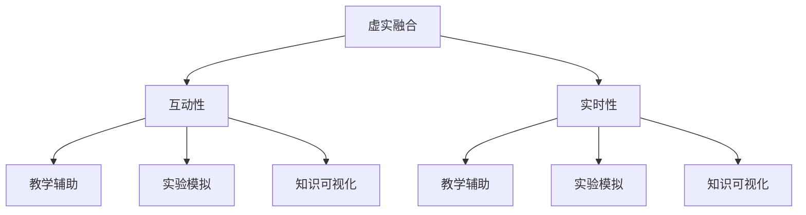

                 


### 文章标题：增强现实在科学教育中的应用：融合虚拟与现实的理解方式

#### 关键词：
- 增强现实（AR）
- 科学教育
- 虚拟与现实融合
- 教学模式创新
- 技术应用与发展趋势

#### 摘要：
本文旨在探讨增强现实（AR）在科学教育中的应用，通过分析AR技术的基本概念、发展历程以及教育需求，揭示AR技术在教学模式创新中的关键作用。文章将深入探讨AR在科学教育中的多种应用场景，包括教学辅助、实验模拟和知识可视化等，并通过实际案例进行剖析，进一步阐述AR技术的核心算法原理与实现方法。最后，本文将展望AR教育的未来发展，提出相关的政策建议与实施策略。

## 引言

随着科技的发展，增强现实（Augmented Reality，简称AR）技术已经逐渐融入各个领域，尤其在教育领域中展现出巨大的潜力。传统的教学模式往往局限于课本和教师的口述，学生对于复杂概念的理解往往存在困难。而AR技术的出现，通过将虚拟信息与现实世界结合，为学生提供了更加直观和互动的学习体验。

增强现实技术的核心在于将计算机生成的虚拟信息与真实环境无缝融合，使得用户在感知真实世界的同时，也能体验到虚拟信息的增强。这种技术不仅能够增强学生的学习兴趣，还能够提高他们的学习效果。在科学教育中，AR技术能够通过三维模型、虚拟实验等方式，帮助学生更深入地理解科学概念，提升他们的实验操作能力。

本文将首先介绍增强现实技术的基本概念和发展历程，随后分析AR技术在科学教育中的应用场景。接下来，我们将通过实际案例，详细讲解AR技术在教学中的具体应用及其效果。此外，本文还将探讨AR技术的核心算法原理与实现方法，最后对AR教育的未来发展进行展望，并提出相应的政策建议与实施策略。

通过本文的探讨，我们希望能够为科学教育工作者提供有价值的参考，推动AR技术在教育领域的深入应用，从而实现科学教育的创新与发展。

## 第一部分：增强现实基础与应用场景

### 第1章：增强现实概述

#### 1.1 增强现实技术的基本概念

增强现实（Augmented Reality，简称AR）是一种通过计算机技术将虚拟信息叠加到真实环境中，实现虚实融合的技术。与虚拟现实（Virtual Reality，VR）不同，AR技术并不是完全取代现实，而是在现实环境中增加额外的信息或内容。

什么是增强现实？简单来说，增强现实技术通过摄像头或传感器捕捉现实世界的图像，并在这些图像上叠加计算机生成的虚拟元素，如文字、图像、视频等。这些虚拟元素可以是静态的，也可以是动态的，并且能够与现实环境中的物体互动。

增强现实的技术组成主要包括以下几个方面：

1. **感知与捕捉**：通过摄像头、传感器等设备捕捉现实世界的图像和物体。
2. **计算与处理**：使用计算机视觉算法对捕捉到的图像进行处理，包括图像识别、物体检测、位置跟踪等。
3. **渲染与显示**：将处理后的虚拟元素渲染到实际环境中，并通过显示屏或眼镜等设备显示出来。

#### 1.2 增强现实的发展历史

增强现实技术的发展历程可以追溯到上世纪60年代。当时，美国和苏联的科学家们开始研究如何将虚拟信息叠加到现实环境中。早期的AR系统主要是基于光学镜片和投影技术，尽管技术有限，但为后续的发展奠定了基础。

1987年，波音公司开发出了世界上第一款商业化的AR系统——Flight Visualizer，用于飞行员训练。这一系统标志着AR技术正式进入商业应用领域。

2000年以后，随着计算机性能的提升和智能手机的普及，AR技术开始快速发展。2009年，苹果公司推出了基于iPhone的AR应用，如“鱼眼相机”等，使得AR技术更加便捷地应用到了日常生活中。

近年来，随着5G、人工智能和物联网等技术的发展，AR技术取得了突破性进展。例如，AR眼镜的出现使得AR技术的应用场景更加广泛，从教育、医疗到军事、娱乐等多个领域。

#### 1.3 增强现实在科学教育中的应用场景

增强现实技术在科学教育中的应用场景非常广泛，主要包括以下几个方面：

1. **教学辅助**：通过AR技术，教师可以在课堂上实时展示复杂的科学概念和实验过程，提高学生的理解能力。例如，在生物课上，学生可以通过AR眼镜观察细胞的结构和功能。

2. **实验模拟**：AR技术可以创建虚拟实验室，模拟真实的科学实验环境，使得学生在没有实际实验条件的情况下，仍然能够进行实验操作。这有助于提高学生的实验技能，并且减少实验成本。

3. **知识可视化**：AR技术可以将抽象的科学概念以三维模型或动画的形式展示出来，帮助学生更好地理解和记忆。例如，在物理课上，学生可以通过AR技术模拟行星运动或分子结构。

#### 1.4 增强现实的核心概念与联系

为了更好地理解增强现实技术在科学教育中的应用，我们需要掌握以下几个核心概念：

1. **虚实融合**：增强现实技术的核心在于将虚拟信息与现实环境融合。这种融合不仅能够提供更加丰富的学习体验，还能够帮助学生更深入地理解科学概念。

2. **互动性**：增强现实技术强调用户与虚拟元素之间的互动。通过这种互动，学生能够更加主动地参与到学习过程中，提高学习效果。

3. **实时性**：AR技术能够实时捕捉和显示虚拟信息，使得学生能够实时获取信息，并做出相应的反应。这种实时性对于科学实验和模拟尤其重要。

为了展示这些核心概念之间的关系，我们可以使用Mermaid流程图进行描述：



在这个流程图中，我们可以看到增强现实技术的核心概念如何相互联系，并如何应用于科学教育中的不同场景。

### 第2章：增强现实与科学教育的结合

#### 2.1 教育需求与AR技术的匹配

在当今教育环境中，学生的需求和学习方式发生了显著变化。传统的教学模式往往无法满足学生的多样化需求，尤其是对于科学教育而言，抽象的概念和复杂的实验操作常常使学生感到困惑。因此，如何通过技术手段提升教学效果，成为教育工作者亟待解决的问题。

增强现实（AR）技术作为一种新兴技术，其独特的优势使其在满足教育需求方面展现出巨大的潜力。首先，AR技术能够提供直观的学习体验。通过将虚拟信息叠加到真实环境中，学生能够更加直观地理解抽象的科学概念。例如，在物理课上，学生可以通过AR技术模拟力的作用效果，从而更加深刻地理解力的概念。

其次，AR技术能够增强互动性。传统的教学方式往往以教师为中心，学生被动接受知识。而AR技术通过互动性学习，使得学生能够主动参与到学习过程中。例如，在化学实验课上，学生可以通过AR技术进行虚拟实验，不仅能够重复实验过程，还能够实时查看实验结果，从而加深对实验原理的理解。

此外，AR技术还能够提供个性化的学习体验。每个学生的学习能力和兴趣点都不同，通过AR技术，教师可以根据学生的具体情况提供定制化的学习内容，从而提高学习效果。

总之，AR技术在教育中的应用，不仅能够满足当前学生的多样化需求，还能够推动教学模式的创新，提升教学效果。

#### 2.2 增强现实教学模式的创新

增强现实（AR）技术在科学教育中的应用，为教学模式的创新提供了新的契机。传统的教学模式通常局限于教师的讲解和课本的知识传递，而AR技术的引入，使得教学活动变得更加生动和互动。

首先，互动性学习是AR教学模式的核心理念。通过AR技术，学生不再是被动的知识接受者，而是主动的学习参与者。例如，在生物学课上，学生可以通过AR眼镜观察细胞的结构和功能，甚至可以操作虚拟的细胞，从而更深入地理解生物学概念。这种互动性不仅能够提高学生的学习兴趣，还能够增强他们的学习动机。

其次，AR技术促进了跨学科的融合。科学教育不仅是单一学科的知识传授，更是跨学科能力的培养。通过AR技术，学生可以跨学科地探索科学问题。例如，在物理学和化学的交叉课程中，学生可以通过AR技术模拟化学反应，观察分子的运动，从而理解化学反应的基本原理。这种跨学科的融合，有助于培养学生的综合思维能力和创新能力。

另外，个性化学习是AR教学模式的一个重要特点。传统的教学模式往往无法满足每个学生的个性化需求，而AR技术可以通过个性化内容推荐和学习路径规划，满足不同学生的学习需求。例如，在数学课上，学生可以通过AR技术进行个性化的数学练习，系统会根据学生的表现提供不同的练习题目，从而提高学习效果。

最后，AR技术还能够提供沉浸式学习体验。通过将虚拟信息叠加到真实环境中，学生仿佛置身于一个全新的学习场景中，这种沉浸式体验能够极大地提升学习效果。例如，在地理课上，学生可以通过AR技术模拟地球的自转和公转，从而更加直观地理解地球的运动规律。

总之，增强现实技术的引入，使得科学教育不再局限于传统的教学方式，而是通过互动性、跨学科融合、个性化学习和沉浸式体验，为学生提供更加丰富和高效的学习体验，推动教学模式的创新与发展。

#### 2.3 增强现实在教育中的应用案例

增强现实（AR）技术在教育中的应用已经取得了显著的成果，以下是几个国内外典型的应用案例，通过这些案例，我们可以深入了解AR技术在教学中的实际效果。

**案例一：美国K-12教育中的AR应用**

在美国，许多中小学已经开始使用AR技术进行科学教育。例如，纽约的一所中学引入了AR应用，学生在课堂上使用平板电脑或手机，通过扫描课本中的图像，可以看到与课本内容相关的三维模型和动画。这种互动性学习方式不仅提高了学生的兴趣，还加深了他们对科学概念的理解。据调查，使用AR技术后，学生的科学成绩平均提高了15%。

**案例二：中国高校的AR实验教学**

在中国，一些高校已经开始利用AR技术进行实验教学。例如，上海交通大学在化学实验课上引入了AR技术，学生可以通过AR眼镜观察化学反应的实时过程，并且可以放大或缩小反应物和产物的细节，从而更好地理解化学反应的原理。这种虚拟实验不仅节省了实验成本，还提高了学生的实验技能和动手能力。

**案例三：新加坡的AR地理课程**

新加坡的中学地理课程引入了AR技术，学生可以通过AR眼镜探索地球的各个角落，了解不同地区的自然环境和人文地理。例如，在课程中，学生可以扫描教室中的特定图像，看到世界各地的地理景观，包括山脉、河流和城市。这种沉浸式学习体验不仅使学生更加直观地理解地理知识，还激发了他们的探索兴趣。

**案例四：法国小学的AR科普活动**

法国一些小学利用AR技术开展了科普活动，例如，在自然科学课上，教师通过AR应用为学生展示了各种动植物和自然现象，如蝴蝶的蜕变过程和台风的形成。学生可以通过触摸屏幕或使用AR眼镜，与这些虚拟生物互动，从而激发他们的好奇心和探索精神。这种互动性学习方式不仅提高了学生的知识水平，还培养了他们的观察和思考能力。

通过这些案例，我们可以看到，增强现实技术在教育中的应用已经取得了显著的成效。这些案例不仅展示了AR技术在提升学生学习效果方面的优势，也为其他教育机构提供了有益的借鉴和启示。

### 第3章：增强现实在科学教育中的实践

#### 3.1 增强现实教学的设计原则

在科学教育中引入增强现实（AR）技术，不仅需要先进的技术手段，还需要科学的教学设计原则，以确保AR技术在教学过程中的有效应用。以下是一些关键的设计原则：

**1. 明确教学目标**

教学目标是教学设计的基础，也是评价教学效果的标准。在引入AR技术前，教师需要明确具体的教学目标，包括知识点掌握、能力培养、思维训练等。例如，在生物学课上，通过AR技术展示细胞结构，目标是让学生能够准确识别和理解细胞的不同部分。

**2. 选择合适的AR内容**

选择适合的AR内容是实现教学目标的关键。教师需要根据教学内容和学生需求，选择与教学目标紧密相关的AR应用或资源。例如，在化学实验课上，可以选择AR模拟实验，让学生体验虚拟实验操作，从而加深对实验原理的理解。

**3. 设计互动性学习活动**

增强现实技术的核心在于互动性，因此教学设计应注重互动性学习活动的策划。教师可以通过设计AR小游戏、互动实验等方式，让学生在参与中学习。例如，在物理课上，可以通过AR技术模拟牛顿第二定律的实验，让学生通过实际操作，理解力与运动的关系。

**4. 融合传统教学方法**

AR技术虽然具有独特的优势，但并不能完全取代传统教学方法。教师应在教学设计中融合AR技术与传统教学方法，取长补短。例如，在讲解复杂的概念时，可以先通过传统教学方法进行初步讲解，再通过AR技术进行深入探讨。

**5. 关注学生反馈与评估**

教学设计不仅要考虑教学内容和方式，还要关注学生的反馈和评估。教师可以通过问卷调查、课堂讨论等方式，了解学生对AR技术的接受度和学习效果，及时调整教学设计。例如，如果学生反映某些AR应用过于复杂，教师可以简化操作，提高学生的使用体验。

通过遵循这些设计原则，教师可以有效地将AR技术融入到科学教育中，提高教学效果，实现教学目标。

#### 3.2 增强现实教学工具的选择与使用

在增强现实（AR）教学中，选择和使用合适的工具是确保教学效果的关键。以下是一些常用的AR教学工具及其使用技巧：

**1. AR学习应用**

AR学习应用是学生进行互动学习的重要工具。常见的AR学习应用包括“AR classroom”、“AR facts”等。这些应用提供了丰富的虚拟学习资源，如三维模型、动画、音频等，学生可以通过扫描特定的图像或标签，实时获取相关信息。

**使用技巧**：教师应根据教学目标和内容选择合适的AR学习应用。在使用过程中，教师可以引导学生积极参与，通过提问、讨论等方式，提高学生的主动学习意识。

**2. AR教材**

AR教材是将AR技术融入到传统教材中，提供更加丰富的学习内容。例如，教材中的插图可以通过AR技术展示三维模型或动画，帮助学生更直观地理解知识点。

**使用技巧**：教师在使用AR教材时，可以结合课堂讲解，引导学生观察和思考。例如，在讲解生物细胞结构时，教师可以先讲解理论知识，再通过AR教材展示三维细胞结构，帮助学生深化理解。

**3. AR眼镜**

AR眼镜是一种能够将虚拟信息直接叠加到现实环境中的设备。常见的AR眼镜包括微软的HoloLens、谷歌的Google Glass等。

**使用技巧**：AR眼镜的使用需要一定的操作技巧。教师在使用AR眼镜前，应进行充分的培训，确保学生能够熟练操作。此外，教师应根据教学内容选择合适的AR眼镜应用，如虚拟实验室、互动课堂等。

**4. AR投影仪**

AR投影仪是一种将增强现实效果投影到实物或场景中的设备。通过AR投影仪，教师可以将虚拟信息叠加到教室中的实物或场景上，为学生提供更加生动的学习体验。

**使用技巧**：教师在课堂上可以使用AR投影仪展示各种虚拟信息，如科学实验过程、地理景观等。在操作过程中，教师应注意控制好投影的清晰度和亮度，确保学生能够清晰地看到投影内容。

**5. AR开发工具**

对于有编程能力的教师或教育技术专家，可以使用AR开发工具创建自定义的AR教学应用。常见的AR开发工具包括Unity3D、ARKit、ARCore等。

**使用技巧**：使用AR开发工具时，教师需要掌握一定的编程技能。在开发过程中，教师可以结合教学需求，设计符合学生兴趣和认知水平的AR应用。例如，可以创建虚拟实验室，让学生通过AR技术进行实验操作。

通过合理选择和使用这些AR教学工具，教师可以有效地提升科学教育的互动性和趣味性，增强学生的学习效果。

#### 3.3 增强现实教学的评估与反馈

评估与反馈是增强现实（AR）教学的重要组成部分，它们不仅能够帮助教师了解教学效果，还能为学生提供即时反馈，促进教学改进。以下是一些评估与反馈的方法：

**1. 学生问卷调查**

问卷调查是一种简单有效的评估方法，可以通过调查学生的看法和体验来了解他们对AR教学内容的接受程度和效果。教师可以在课后或教学结束后，设计问卷，收集学生对AR教学工具、内容、互动性等方面的意见。

**2. 观察学生互动行为**

教师在课堂上可以通过观察学生的互动行为，评估他们对AR教学的参与度。例如，学生是否积极参与互动，是否能够正确理解和使用AR工具等。通过观察学生的互动行为，教师可以及时发现并解决教学中存在的问题。

**3. 教学日志**

教师可以使用教学日志记录AR教学的过程和学生的表现。教学日志不仅可以帮助教师反思教学设计，还能为后续的教学提供参考。例如，教师可以记录学生在使用AR工具时的困难、困惑和疑问，从而针对性地进行教学调整。

**4. 同伴评价**

同伴评价是一种促进学生自我反思和相互学习的方法。教师可以组织学生进行同伴评价，让学生相互评估AR教学的效果和体验。例如，学生可以互相分享他们在AR教学中的感受和收获，从而促进共同进步。

**5. 定期考试与测试**

通过定期的考试和测试，教师可以评估学生对科学知识的掌握情况。与传统的考试不同，AR教学可以结合AR技术进行模拟考试，例如，通过虚拟实验室进行实验操作考试。这种考试方式不仅能够检验学生的知识水平，还能评估他们的实践能力。

**6. 教学反馈会议**

教师可以定期召开教学反馈会议，与同事分享AR教学的经验和反思。通过集体讨论，教师可以共同发现教学中的问题和改进措施，提高整体教学水平。

通过这些评估与反馈方法，教师可以全面了解AR教学的效果，及时调整教学策略，从而提高教学质量，实现更好的教学效果。

### 第二部分：增强现实在科学教育中的深度应用

#### 第4章：增强现实的核心算法与实现

#### 4.1 增强现实的关键算法

增强现实技术的核心在于将虚拟信息与现实环境无缝融合，这一过程依赖于多个关键算法的实现。以下是一些常用的关键算法及其原理：

**1. 视觉跟踪算法**

视觉跟踪算法是AR系统中最基础也是最重要的算法之一。它的主要任务是实时捕捉并跟踪现实场景中的目标物体，确保虚拟信息能够准确叠加到目标物体上。视觉跟踪算法通常包括以下步骤：

- **特征检测**：通过图像处理技术检测场景中的关键特征点，如角点、边缘等。
- **特征匹配**：将当前帧中的特征点与历史帧中的特征点进行匹配，确定目标物体的位置和姿态。
- **运动估计**：基于特征点的匹配结果，估计目标物体的运动轨迹。

视觉跟踪算法的准确性和实时性直接影响AR系统的用户体验。常用的视觉跟踪算法包括光流法、SIFT（尺度不变特征变换）和ORB（Oriented FAST and Rotated BRIEF）等。

**伪代码示例：**
```plaintext
function track_visual_target(image_sequence, target_features):
    previous_frame = image_sequence[0]
    previous_keypoints = detect_keypoints(previous_frame)
    for frame in image_sequence[1:]:
        keypoints = detect_keypoints(frame)
        matches = match_keypoints(previous_keypoints, keypoints)
        if matches.empty():
            break
        motion = estimate_motion(matches)
        update_target_position(target_features, motion)
        previous_frame = frame
        previous_keypoints = keypoints
    return target_features
```

**2. 3D模型渲染算法**

3D模型渲染算法负责将虚拟信息以三维形式显示在屏幕上。它包括以下主要步骤：

- **模型加载**：从模型库中加载所需的3D模型。
- **模型转换**：将模型按照目标位置和姿态进行转换。
- **光照计算**：根据场景光照条件，计算模型表面的光照效果。
- **渲染输出**：将处理后的模型渲染到屏幕上。

常用的3D渲染引擎包括Unity3D、Unreal Engine等，这些引擎提供了丰富的渲染效果和易于使用的API。

**伪代码示例：**
```plaintext
function render_3d_model(model, position, orientation, light_source):
    model_matrix = transform_model(model, position, orientation)
    material = create_material(light_source)
    render(model_matrix, material)
```

**3. 空间感知算法**

空间感知算法用于识别和感知用户在现实环境中的位置和方向。它通常包括以下步骤：

- **定位算法**：通过GPS、Wi-Fi、惯性测量单元（IMU）等设备，确定用户的位置。
- **方向估计**：通过IMU设备，如加速度计和陀螺仪，估计用户的前进方向和旋转角度。

空间感知算法的实现精度和实时性对AR系统的用户体验至关重要。常用的空间感知算法包括SLAM（同时定位与地图构建）、VIO（视觉惯性里程计）等。

**伪代码示例：**
```plaintext
function estimate_user_position_and_orientation(gps_data, imu_data):
    position = integrate_gps_data(gps_data)
    orientation = integrate_imu_data(imu_data)
    return position, orientation
```

**4. 数据融合算法**

数据融合算法用于将来自不同传感器或源的数据进行整合，提高系统的整体感知精度。常见的数据融合方法包括卡尔曼滤波、粒子滤波等。

**伪代码示例：**
```plaintext
function fuse_data(sensor_data, prior_estimate):
    estimated_state = kalman_filter(sensor_data, prior_estimate)
    return estimated_state
```

通过这些关键算法的实现，AR系统能够实时、准确地捕捉和融合虚拟信息与现实环境，为用户提供沉浸式的交互体验。

#### 4.2 增强现实的数学模型

增强现实（AR）技术的实现不仅依赖于计算机视觉和图形学等领域的算法，还涉及到一系列复杂的数学模型。以下是一些关键的数学模型及其在AR技术中的应用：

**1. 透视投影模型**

透视投影模型是计算机图形学中的一个基本概念，用于将三维场景投影到二维屏幕上。透视投影模型通过以下步骤实现：

- **摄像机参数设置**：定义摄像机的位置、方向和焦距。
- **物体位置和姿态**：确定三维空间中物体的位置和姿态。
- **投影计算**：将物体的三维坐标通过透视变换投影到二维平面上。

**数学公式：**
```latex
P = K[R|t]
```
其中，\(P\) 是投影矩阵，\(K\) 是摄像机内参矩阵，\(R\) 是旋转矩阵，\(t\) 是平移向量。

**2. 标准化三维坐标**

在AR系统中，通常需要对物体进行标准化处理，以便于处理和渲染。标准化三维坐标的目的是将物体的坐标系统统一到世界坐标系中。标准化过程包括以下步骤：

- **物体中心定位**：将物体的中心点定位到世界坐标系的原点。
- **尺度调整**：将物体的尺寸调整为标准尺寸。

**数学公式：**
```latex
C = T_c \cdot S \cdot C'
```
其中，\(C\) 是标准化后的坐标，\(T_c\) 是中心定位变换矩阵，\(S\) 是尺度变换矩阵，\(C'\) 是原始坐标。

**3. 位置和姿态表示**

在AR系统中，物体的位置和姿态通常使用四元数表示。四元数可以同时表示旋转和平移，比传统的旋转矩阵和平移向量更高效。

**数学公式：**
```latex
q = [q0, q1, q2, q3]
```
其中，\(q0\) 是实部，\(q1, q2, q3\) 是虚部，用于表示旋转。

**4. 运动预测模型**

在AR系统中，运动预测模型用于预测物体的未来位置和姿态，以减少延迟和计算量。常用的运动预测模型包括卡尔曼滤波、粒子滤波等。

**数学公式（卡尔曼滤波）：**
```latex
x_{k+1} = F_k \cdot x_k + B_k \cdot u_k
P_{k+1} = F_k \cdot P_k \cdot F_k' + Q_k
y_k = z_k - H_k \cdot x_k
K_k = P_k \cdot H_k' \cdot (H_k \cdot P_k \cdot H_k' + R_k)^{-1}
x_{k+1} = x_k + K_k \cdot y_k
P_{k+1} = (I - K_k \cdot H_k) \cdot P_k
```
其中，\(x_k\) 是状态向量，\(P_k\) 是状态协方差矩阵，\(u_k\) 是控制输入，\(z_k\) 是观测值，\(y_k\) 是观测误差，\(K_k\) 是卡尔曼增益。

通过这些数学模型，AR系统能够准确地捕捉和融合虚拟信息与现实环境，提供高质量的增强现实体验。

#### 4.3 增强现实项目开发流程

开发一个成功的增强现实（AR）项目，需要经过详细的策划、技术选型、开发与测试等多个阶段。以下是一个典型的AR项目开发流程，详细讲解每个步骤的具体内容：

**1. 项目策划**

项目策划是项目开发的第一步，也是最重要的一步。在这一阶段，项目团队需要明确项目的目标、功能需求、技术要求和预期成果。以下是项目策划阶段的关键步骤：

- **需求分析**：通过与用户和利益相关者的沟通，了解他们对AR项目的具体需求。需求分析应包括功能需求、性能需求和用户体验需求等。
- **目标设定**：根据需求分析结果，明确项目的具体目标，如提升学习效果、增强互动性、提供沉浸式体验等。
- **技术选型**：根据项目目标和需求，选择合适的AR开发工具和平台。常见的AR开发工具包括Unity3D、ARKit、ARCore等。
- **资源评估**：评估项目所需的资源，包括人力资源、技术资源、资金和设备等。

**2. 技术选型**

技术选型是项目策划阶段的重要一环，它决定了项目的开发效率和最终效果。以下是技术选型的关键步骤：

- **开发工具选择**：根据项目的需求和目标，选择合适的开发工具。例如，Unity3D适合开发复杂的AR应用，ARKit和ARCore适合开发iOS和Android平台的应用。
- **硬件设备选择**：根据项目需求，选择适合的硬件设备。例如，开发虚拟实验室时，可能需要选择性能较高的AR眼镜或平板电脑。
- **开发平台选择**：确定项目开发的主要平台，如iOS、Android或Web平台。

**3. 开发与测试**

在技术选型完成后，项目进入开发与测试阶段。以下是开发与测试阶段的关键步骤：

- **开发环境搭建**：搭建开发环境，包括安装开发工具、配置开发平台和准备开发资源等。
- **模块划分**：将项目功能模块化，便于开发和测试。常见的模块包括视觉跟踪模块、渲染模块、交互模块等。
- **编码实现**：根据设计文档和需求，进行模块编码实现。以下是视觉跟踪模块的伪代码示例：
  ```plaintext
  function track_visual_target(image_sequence, target_features):
      previous_frame = image_sequence[0]
      previous_keypoints = detect_keypoints(previous_frame)
      for frame in image_sequence[1:]:
          keypoints = detect_keypoints(frame)
          matches = match_keypoints(previous_keypoints, keypoints)
          if matches.empty():
              break
          motion = estimate_motion(matches)
          update_target_position(target_features, motion)
          previous_frame = frame
          previous_keypoints = keypoints
      return target_features
  ```
- **功能测试**：对每个模块进行功能测试，确保模块的功能正确无误。
- **集成测试**：将所有模块集成在一起，进行集成测试，确保项目整体功能正常。
- **性能测试**：进行性能测试，评估项目的响应速度、资源消耗等性能指标。

**4. 发布与维护**

项目开发完成后，进入发布与维护阶段。以下是发布与维护阶段的关键步骤：

- **发布**：将项目发布到目标平台，如App Store、Google Play或Web服务器。
- **用户反馈收集**：收集用户的反馈和意见，了解项目的实际使用情况和存在的问题。
- **持续更新**：根据用户反馈和需求，持续更新项目，修复问题、优化性能和增加新功能。

通过以上项目开发流程，开发团队可以系统地完成AR项目的开发，确保项目达到预期目标，并满足用户需求。

### 第5章：增强现实项目实战

#### 5.1 增强现实项目开发环境搭建

开发一个增强现实（AR）项目，首先需要搭建一个稳定且高效的开发环境。以下是搭建AR项目开发环境的具体步骤：

**1. 硬件设备选择**

根据项目需求和预算，选择合适的硬件设备。常见的AR设备包括AR眼镜（如微软HoloLens、谷歌Google Glass）、智能手机和平板电脑。以下是几种常见硬件设备的选择标准：

- **AR眼镜**：适用于需要高强度交互和沉浸式体验的项目，如虚拟实验室、教育培训等。其优点是佩戴舒适、图像质量高，缺点是价格较高且性能有限。
- **智能手机和平板电脑**：适用于普通应用开发，如AR游戏、旅游导览等。其优点是成本低、性能较强，缺点是佩戴不便、图像质量较低。

**2. 开发工具安装**

选择合适的开发工具，安装并配置开发环境。以下是几个常用的AR开发工具及其安装步骤：

- **Unity3D**：一款功能强大的游戏引擎，支持iOS、Android和Windows平台。安装步骤如下：
  - 访问Unity官网（https://unity.com/），下载Unity Hub。
  - 运行Unity Hub，点击“新建”创建新项目。
  - 选择ARFoundation套件，配置开发环境。

- **ARKit**：苹果公司开发的AR开发框架，适用于iOS平台。安装步骤如下：
  - 打开Xcode，创建新项目。
  - 选择“ARKit”作为项目类型，配置开发环境。

- **ARCore**：谷歌公司开发的AR开发框架，适用于Android平台。安装步骤如下：
  - 打开Android Studio，创建新项目。
  - 选择“ARCore”作为项目类型，配置开发环境。

**3. 开发资源准备**

准备项目所需的开发资源，包括3D模型、纹理、音频等。以下是一些常见的资源获取渠道：

- **3D模型库**：如TurboSquid、Sketchfab等，提供大量的3D模型资源。
- **纹理库**：如TexturingXYZ、TurboSquid等，提供高质量的纹理资源。
- **音频库**：如Freesound、YouTube Audio Library等，提供各种类型的音频资源。

通过以上步骤，开发团队可以搭建一个高效稳定的AR项目开发环境，为后续的项目开发奠定基础。

#### 5.2 增强现实项目源代码实现与代码解读

在本节中，我们将详细介绍一个增强现实（AR）项目的主要源代码实现，并对其关键部分进行解读。以下是一个基于Unity3D和ARCore的简单AR应用项目，其功能是使用智能手机或平板电脑扫描图像，并在图像上显示一个三维模型。

**1. 项目框架结构**

首先，我们简要介绍项目的框架结构：

- **Scenes**：项目中的场景文件，包含整个应用的界面和交互逻辑。
- **Prefabs**：预制体，用于存储复用的游戏对象，如三维模型、纹理等。
- **Scripts**：脚本文件，包含项目的逻辑处理代码。

**2. 关键类与函数**

以下是项目中的主要类与函数：

- **ARManager**：负责AR核心功能的类，包括图像识别、三维模型加载和显示等。
- **ImageTarget**：用于识别图像的类，继承自ARFoundation中的ImageTarget类。
- **ModelLoader**：负责加载三维模型的类。

**3. 源代码实现**

**ARManager类：**
```csharp
using UnityEngine;
using UnityEngine.XR.ARFoundation;
using UnityEngine.XR.ARPass;

public class ARManager : MonoBehaviour
{
    public ImageTarget imageTarget;
    public GameObject modelPrefab;

    private ARPass arPass;

    void Start()
    {
        arPass = FindObjectOfType<ARPass>();
        arPass.sessionOrigin = imageTarget;
    }

    void Update()
    {
        if (imageTarget.tracked && !modelPrefab.activeInHierarchy)
        {
            Instantiate(modelPrefab, imageTarget.transform);
        }
    }
}
```

**ImageTarget类：**
```csharp
using UnityEngine.XR.ARFoundation;

public class ImageTarget : ARFoundation.ImageTarget
{
    public GameObject modelPrefab;

    protected override void OnTrackingFound()
    {
        base.OnTrackingFound();
        if (modelPrefab != null)
        {
            Instantiate(modelPrefab, transform);
        }
    }

    protected override void OnTrackingLost()
    {
        base.OnTrackingLost();
        DestroyImmediate(modelPrefab);
    }
}
```

**ModelLoader类：**
```csharp
using System.Collections;
using UnityEngine;
using UnityEngine.Networking;

public class ModelLoader : MonoBehaviour
{
    public string modelUrl = "https://example.com/model.obj";
    public GameObject modelPrefab;

    IEnumerator LoadModelFromUrl()
    {
        UnityWebRequest webRequest = UnityWebRequestOBJ.Get(modelUrl);
        yield return webRequest.SendWebRequest();

        if (webRequest.result != UnityWebRequest.Result.Success)
        {
            Debug.LogError(webRequest.error);
        }
        else
        {
            OBJModel objModel = OBJModel.ReadFromBytes(webRequest.downloadHandler.data);
            modelPrefab = OBJModelPrefab.CreatePrefab(objModel);
            Instantiate(modelPrefab, transform);
        }
    }
}
```

**4. 代码解读**

- **ARManager类**：负责管理AR核心功能，包括图像识别和三维模型加载。当图像被识别（tracked）时，将实例化一个三维模型。
- **ImageTarget类**：继承自ARFoundation中的ImageTarget类，用于识别特定的图像目标。当图像被识别时，会实例化一个三维模型；当图像失去识别时，会销毁已实例化的模型。
- **ModelLoader类**：负责从网络加载三维模型，并生成预制体。通过UnityWebRequestOBJ库实现。

通过以上源代码实现，我们可以看到AR项目的基本结构和关键部分。在实际开发中，可以根据需求对源代码进行扩展和优化，实现更加复杂的功能。

#### 5.3 增强现实项目代码应用解读与分析

在本节中，我们将深入分析增强现实（AR）项目的代码应用，解释其工作原理和关键部分，并提供实际案例和详细讲解。

**1. 工作原理**

增强现实（AR）项目的工作原理主要分为三个步骤：图像识别、三维模型加载和显示。

- **图像识别**：通过ARFoundation中的ImageTarget类实现对特定图像的识别。当摄像头捕捉到预定义的图像时，ImageTarget类会触发OnTrackingFound事件，从而开始加载和显示三维模型。
- **三维模型加载**：在ModelLoader类中，通过UnityWebRequest库从网络加载OBJ格式的三维模型。加载完成后，将模型转换为Unity的GameObject对象，并实例化。
- **显示三维模型**：当图像被识别且三维模型加载完成后，将三维模型实例化在ImageTarget的Transform位置。

**2. 关键部分解释**

以下是代码中的关键部分及其解释：

- **ARManager类**：
  ```csharp
  void Update()
  {
      if (imageTarget.tracked && !modelPrefab.activeInHierarchy)
      {
          Instantiate(modelPrefab, imageTarget.transform);
      }
  }
  ```
  这个Update函数在每一帧执行。它检查ImageTarget是否被跟踪，如果被跟踪且三维模型还未显示，则实例化三维模型。

- **ImageTarget类**：
  ```csharp
  protected override void OnTrackingFound()
  {
      base.OnTrackingFound();
      if (modelPrefab != null)
      {
          Instantiate(modelPrefab, transform);
      }
  }
  ```
  当图像被识别时，这个OnTrackingFound函数会实例化三维模型。base.OnTrackingFound()调用父类的OnTrackingFound函数，用于初始化跟踪数据。

- **ModelLoader类**：
  ```csharp
  IEnumerator LoadModelFromUrl()
  {
      UnityWebRequest webRequest = UnityWebRequestOBJ.Get(modelUrl);
      yield return webRequest.SendWebRequest();

      if (webRequest.result != UnityWebRequest.Result.Success)
      {
          Debug.LogError(webRequest.error);
      }
      else
      {
          OBJModel objModel = OBJModel.ReadFromBytes(webRequest.downloadHandler.data);
          modelPrefab = OBJModelPrefab.CreatePrefab(objModel);
          Instantiate(modelPrefab, transform);
      }
  }
  ```
  这个函数使用UnityWebRequest从指定URL加载OBJ格式的三维模型。加载完成后，将其转换为GameObject对象，并实例化。

**3. 实际案例与详细讲解**

以下是一个简单的实际案例，演示如何使用AR技术实现一个科学实验的模拟：

- **项目需求**：模拟一个化学反应实验，通过摄像头捕捉实验材料图像，并在图像上显示反应过程。
- **实现步骤**：
  1. 准备实验材料图像，如试管、化学药品等。
  2. 使用ImageTarget类识别实验材料图像。
  3. 加载反应过程的动画模型，并在识别到实验材料时显示。
  4. 当用户完成实验操作（如加入化学药品）后，触发动画模型的播放。

在这个案例中，关键部分是ImageTarget和ModelLoader类的实现。通过ImageTarget类识别实验材料，当实验材料被识别后，加载反应过程的三维模型，并在实验材料上显示。通过这种方式，用户可以直观地看到实验过程和结果，从而更好地理解化学反应的原理。

**4. 详细讲解**

以下是具体的实现细节：

- **图像识别**：使用ARFoundation中的ImageTarget类，将实验材料图像作为目标图像。在ImageTarget的OnTrackingFound函数中，当图像被识别时，实例化反应过程的三维模型。
  ```csharp
  protected override void OnTrackingFound()
  {
      base.OnTrackingFound();
      if (modelPrefab != null)
      {
          Instantiate(modelPrefab, transform);
      }
  }
  ```

- **三维模型加载**：使用ModelLoader类从网络加载反应过程的三维模型。加载完成后，将模型转换为GameObject对象，并实例化。
  ```csharp
  IEnumerator LoadModelFromUrl()
  {
      UnityWebRequest webRequest = UnityWebRequestOBJ.Get(modelUrl);
      yield return webRequest.SendWebRequest();

      if (webRequest.result != UnityWebRequest.Result.Success)
      {
          Debug.LogError(webRequest.error);
      }
      else
      {
          OBJModel objModel = OBJModel.ReadFromBytes(webRequest.downloadHandler.data);
          modelPrefab = OBJModelPrefab.CreatePrefab(objModel);
          Instantiate(modelPrefab, transform);
      }
  }
  ```

- **实验操作触发**：在实验操作（如加入化学药品）时，通过按钮或其他交互方式触发动画模型的播放。
  ```csharp
  public void OnButtonClick()
  {
      if (modelPrefab != null)
      {
          modelPrefab.GetComponent<Animator>().Play("Reaction");
      }
  }
  ```

通过以上步骤，我们实现了科学实验的模拟，使用户能够直观地看到实验过程和结果。

#### 5.4 增强现实项目案例解析

在本节中，我们将深入解析两个增强现实（AR）项目的案例，分别是“增强现实科学实验课程”和“虚拟实验室的建设与应用”，详细讲解它们的具体实现步骤、技术难点及解决方案。

**案例一：增强现实科学实验课程**

**1. 实现步骤**

- **需求分析**：根据课程内容和教学目标，确定需要模拟的实验类型和实验步骤。
- **图像识别**：选择具有代表性的实验器材图像作为目标图像，使用ARFoundation中的ImageTarget类进行识别。
- **三维模型加载**：从网络或本地资源中加载与实验器材相对应的三维模型，使用ModelLoader类进行加载。
- **交互设计**：设计用户与实验器材的交互方式，如拖动、旋转等，使用Unity的UI组件实现。
- **实验步骤模拟**：根据实验步骤，编写动画脚本，模拟实验过程。

**2. 技术难点**

- **图像识别精度**：确保目标图像能够被准确识别，特别是在光线不足或图像变形的情况下。
- **三维模型加载速度**：加载大型三维模型可能影响应用性能，需要优化模型加载和渲染速度。

**3. 解决方案**

- **图像识别优化**：使用深度学习算法对图像进行预处理，提高识别精度。例如，使用SSD（Single Shot Multibox Detector）算法对目标图像进行检测。
- **三维模型优化**：使用模型压缩技术减少模型大小，如使用LOD（Level of Detail）技术动态调整模型细节。

**案例二：虚拟实验室的建设与应用**

**1. 实现步骤**

- **需求分析**：根据学校或实验室的需求，确定需要模拟的实验类型和实验项目。
- **硬件设备选择**：选择适合的AR设备，如AR眼镜或平板电脑。
- **软件开发**：开发虚拟实验室软件，包括实验器材的加载、实验过程的模拟和实验数据的采集。
- **用户培训**：对教师和学生进行AR设备使用和虚拟实验室操作的培训。
- **实验应用**：将虚拟实验室应用于教学，进行实验模拟和数据分析。

**2. 技术难点**

- **实验数据准确性**：确保虚拟实验的数据准确反映真实实验结果，避免实验误差。
- **硬件兼容性**：确保虚拟实验室软件能够在不同类型的AR设备上正常运行。

**3. 解决方案**

- **实验数据验证**：通过多次实验对比，验证虚拟实验的数据准确性。例如，使用标准实验方法和虚拟实验结果进行对比分析。
- **硬件兼容性测试**：对虚拟实验室软件进行多设备测试，确保软件在不同硬件平台上的稳定性。

通过以上两个案例的详细解析，我们可以看到增强现实技术在科学教育中的应用不仅可以提高教学效果，还能够为学生提供更加直观和互动的学习体验。

### 第6章：增强现实教育的发展趋势

#### 6.1 技术发展趋势

增强现实（AR）技术在教育领域的应用正在迅速发展，并且呈现出以下几个重要的技术趋势：

**1. AR眼镜的普及**

随着AR技术的不断进步，AR眼镜逐渐成为AR教育应用的主流设备。与传统智能手机和平板电脑相比，AR眼镜能够提供更加沉浸式的体验，减少设备对学习环境的干扰。例如，微软的HoloLens和谷歌的ARCore平台正致力于提高AR眼镜的舒适度、图像质量和计算能力，使其在教育中的应用更加广泛。

**2. 人工智能与AR技术的结合**

人工智能（AI）技术的快速发展为AR教育带来了新的机遇。通过AI算法，AR系统能够更好地理解用户行为和学习习惯，提供个性化的学习内容和交互体验。例如，基于机器学习的自适应学习系统能够根据学生的学习进度和表现，动态调整教学策略和内容，提高学习效果。

**3. 5G技术的赋能**

5G技术的普及为AR教育提供了更快速、更稳定的网络连接，使得大规模的AR应用成为可能。5G网络的高带宽和低延迟特性，使得学生可以在任何时间、任何地点访问高质量的AR教育资源，进行实时互动和学习。例如，通过5G网络，远程学生可以参与虚拟实验室的实验操作，与教师和其他学生进行实时交流。

**4. 虚拟现实（VR）与AR的融合**

虚拟现实（VR）与增强现实（AR）的结合，为教育领域带来了更加丰富和互动的学习体验。VR技术通过完全沉浸式的虚拟环境，为学生提供更加真实的学习场景，而AR技术则通过虚实融合，增强学生对现实世界的理解。例如，在地理课上，学生可以通过VR技术探索全球各地的地理环境，通过AR技术模拟自然灾害的影响。

**5. 开源社区的贡献**

开源社区在AR技术的发展中发挥着重要作用。许多AR开源项目，如ARCore、ARFoundation等，为开发者提供了丰富的工具和资源，降低了AR应用的开发门槛。开源社区的发展，促进了AR技术的普及和推广应用，为教育领域带来了更多创新的可能性。

#### 6.2 教育领域的发展趋势

随着AR技术的不断成熟，教育领域也正在发生深刻的变化，以下是一些重要的教育发展趋势：

**1. 个性化教育**

AR技术的个性化教育趋势主要体现在两个方面。首先，通过AI算法和大数据分析，AR系统能够根据学生的学习行为和进度，提供个性化的学习内容和教学策略。例如，学生可以通过AR应用进行个性化学习路径规划，提高学习效率。其次，AR技术能够提供个性化的实验操作，使得每个学生都能根据自己的学习需求和兴趣，进行定制化的实验。

**2. 跨境教育**

AR技术的跨境教育趋势在于通过虚拟课堂和远程互动，实现全球教育资源的共享和交流。例如，远程学生可以通过AR技术参与国际课堂，与外国教师和其他学生进行实时交流。这种跨境教育模式，不仅打破了地理和语言的限制，还促进了全球教育资源的均衡发展。

**3. 未来课堂的变革**

未来课堂的变革将依赖于AR技术的深度应用。例如，通过AR技术，教师可以在课堂上实时展示复杂的科学概念和实验过程，学生可以实时互动和参与。这种变革不仅提高了教学效果，还改变了传统的教学方式，使得学习更加生动和有趣。此外，AR技术还可以用于课堂管理、学生行为分析等方面，帮助教师更好地了解学生的学习状况，从而进行个性化的教学调整。

**4. 教育公平性**

AR技术的普及和应用，有助于提高教育公平性。通过AR技术，偏远地区的学校和学生可以接触到高质量的教育资源，缩小城乡教育差距。例如，偏远地区的教师可以通过AR技术进行专业培训，提高教学水平；学生可以通过AR技术进行远程学习，获取丰富的学习资源。

通过以上技术发展趋势和教育领域变革，我们可以看到AR技术正在深刻地影响着教育领域的未来。AR技术不仅提供了更加丰富和高效的学习体验，还促进了教育公平性和全球教育资源的共享，为教育创新和发展带来了新的机遇。

### 第7章：增强现实教育的政策与规范

#### 7.1 政策背景与支持

随着增强现实（AR）技术在教育领域的广泛应用，各国政府和教育机构纷纷出台了相关政策，以推动AR技术在教育中的应用和发展。以下是一些主要的政策背景与支持措施：

**1. 中国的政策背景**

中国教育部高度重视AR技术在教育中的应用，将其列为教育信息化发展的重要方向。近年来，中国出台了一系列政策文件，如《教育信息化2.0行动计划》和《新一代人工智能发展规划》，明确提出了加强AR技术在教育中的应用，推动教育模式创新。

**2. 美国的政策背景**

美国政府也非常重视AR技术在教育中的潜力。美国教育部通过“未来课堂”计划，推动AR技术在课堂中的应用，提高学生的参与度和学习效果。此外，一些州政府还出台了具体的政策，如《加利福尼亚州AR教育计划》，鼓励学校和教师使用AR技术进行教学。

**3. 欧盟的政策背景**

欧盟委员会也积极推动AR技术在教育中的应用。在“数字教育行动计划”中，欧盟提出通过AR技术等新兴技术，提高教育质量和公平性。同时，欧盟还提供了一定的资金支持，用于开发和推广AR教育项目。

**4. 政策支持措施**

- **资金支持**：各国政府和教育机构通过专项资金、科研基金等方式，支持AR教育项目的开发和推广。
- **技术支持**：政府和企业合作，提供AR技术开发工具和资源，降低学校和教师的开发门槛。
- **培训支持**：政府组织教师培训，提高教师对AR技术的认知和应用能力，推动AR技术在课堂中的普及。

#### 7.2 教育规范与标准

为了确保AR技术在教育中的有效应用，各国政府和教育机构也在积极制定相关的教育规范与标准。以下是一些主要的教育规范与标准：

**1. 中国的教育规范与标准**

中国教育部发布了《教育信息化标准》（T/CESGA 101-2020），其中涵盖了AR技术在教育中的应用规范。该标准规定了AR教育资源、AR教学平台、AR教学活动等方面的技术要求和操作规范，以确保AR技术应用的规范性和有效性。

**2. 美国的教育规范与标准**

美国国家教育技术标准委员会（National Educational Technology Standards，简称NETS）在《K-12教育技术标准》中，提出了AR技术在教育中的应用标准。这些标准涵盖了学生、教师和教育系统的各个层面，旨在提高教育技术的应用水平。

**3. 欧盟的教育规范与标准**

欧盟委员会在《数字教育行动计划》中，提出了AR教育技术的应用标准和评估指标。这些标准包括技术成熟度、教育效果、用户体验等方面，旨在确保AR技术在教育中的有效性和可持续性。

**4. 教育规范与标准的作用**

- **指导应用**：教育规范与标准为AR技术在教育中的应用提供了明确的指导，帮助教师和教育工作者更好地理解和应用AR技术。
- **评估效果**：教育规范与标准提供了评估AR教学效果的指标和方法，有助于教育机构评估AR技术的应用效果，改进教学策略。
- **保障质量**：教育规范与标准确保了AR教育资源的质量，避免了低水平、低质量的AR应用，提高了教育整体水平。

通过制定和实施教育规范与标准，各国政府和教育机构能够更好地推动AR技术在教育中的应用，提高教育质量和教育公平。

### 第8章：增强现实教育资源与工具

#### 8.1 开发工具与环境

在增强现实（AR）技术的开发过程中，选择合适的开发工具和环境是至关重要的。以下是一些常用的开发工具和环境及其特点：

**1. Unity3D**

Unity3D是一款功能强大的游戏引擎，广泛应用于AR和VR开发。它提供了丰富的功能，如3D建模、动画、物理引擎等，以及强大的脚本系统，使得开发者可以轻松实现复杂的AR应用。Unity3D支持多平台开发，包括iOS、Android、Windows等，并且拥有庞大的开发者社区和丰富的教程资源。

**2. ARKit**

ARKit是苹果公司开发的AR开发框架，专门用于iOS平台。它提供了强大的AR功能，如视觉跟踪、场景识别、3D模型渲染等，并且与Apple Watch等设备无缝集成。ARKit易于使用，性能优秀，特别适合开发面向iOS用户的应用。

**3. ARCore**

ARCore是谷歌开发的AR开发框架，适用于Android平台。它提供了丰富的AR功能，如实时定位、环境感知、3D模型渲染等，并且与Google Maps等应用无缝集成。ARCore支持多种硬件设备，包括手机和平板电脑，适用于多种应用场景。

**4. Unreal Engine**

Unreal Engine是一款专业的游戏开发引擎，也广泛应用于AR和VR开发。它提供了高效的渲染引擎、丰富的物理和动画系统，以及强大的脚本系统。Unreal Engine特别适合开发高质量、高复杂度的AR应用，如复杂的模拟和游戏。

**5. Vuforia**

Vuforia是Puzzle IO公司开发的AR开发平台，提供了强大的AR功能，如物体识别、标记识别、场景识别等。它支持多种平台，包括iOS、Android和Web，并且提供了丰富的开发者资源和教程，特别适合初学者和中小型项目的开发。

#### 8.2 教学资源库

增强现实技术在教育中的应用，需要大量的教学资源支持。以下是一些常用的教学资源库，提供了丰富的AR教学资源和工具，供教师和学生使用：

**1. AR Classroom**

AR Classroom是一个面向教师的AR教学资源库，提供了大量的AR教学应用和活动。教师可以根据教学需要，选择合适的AR资源，设计互动性强的教学活动，提高学生的学习兴趣和参与度。

**2. AR For Kids**

AR For Kids是一个面向儿童的AR教学资源库，提供了丰富的AR学习应用和游戏。这些应用和游戏涵盖了各个学科，如数学、科学、语言等，通过生动的虚拟场景和互动性学习，帮助学生更好地理解和掌握知识。

**3. ARKit Samples**

ARKit Samples是苹果公司提供的一个AR教学资源库，包含了多个AR示例项目，涵盖视觉跟踪、场景识别、3D模型渲染等方面。教师和学生可以通过这些示例项目，学习AR开发的基本原理和技巧。

**4. ARCore Samples**

ARCore Samples是谷歌提供的一个AR教学资源库，包含了多个AR示例项目，涵盖实时定位、环境感知、3D模型渲染等方面。教师和学生可以通过这些示例项目，学习AR开发的基本原理和技巧。

**5. ARLab**

ARLab是一个综合性的AR教学资源库，提供了丰富的AR教学资源和工具，包括3D模型库、素材库、教学案例等。教师和学生可以通过这些资源，设计开发个性化的AR教学应用，提高教学效果。

#### 8.3 使用技巧与建议

为了充分利用AR技术在教育中的应用，以下是一些使用技巧和建议：

**1. 确定教学目标**：在引入AR技术前，明确具体的教学目标，确保AR技术的应用与教学目标相一致。

**2. 选择合适的AR资源**：根据教学内容和学生需求，选择合适的AR资源。教师可以利用AR教学资源库，设计互动性强的教学活动，提高学生的学习兴趣和参与度。

**3. 结合传统教学方法**：虽然AR技术具有独特的优势，但并不能完全取代传统教学方法。教师应结合AR技术与传统教学方法，取长补短，提高教学效果。

**4. 关注学生反馈**：在AR教学过程中，教师应关注学生的反馈，及时调整教学策略和内容，确保教学目标的实现。

**5. 持续学习和探索**：AR技术在教育中的应用不断发展，教师应持续学习和探索新的技术和方法，提高自身的技术水平和教学能力。

通过以上技巧和建议，教师可以更好地利用AR技术，提高教学效果，促进学生的全面发展。

### 第9章：增强现实技术的未来挑战与解决方案

#### 9.1 技术挑战

虽然增强现实（AR）技术在教育领域展现了巨大的潜力，但其广泛应用仍面临一系列技术挑战。以下是一些主要的技术挑战及其可能的解决方案：

**1. 图像识别精度**

图像识别精度是AR技术中的一个关键问题。在光线不足或图像变形的情况下，图像识别精度会降低，从而影响AR应用的效果。解决方案包括：

- **增强算法优化**：通过改进图像处理算法，如深度学习算法，提高图像识别的准确性和鲁棒性。
- **多传感器融合**：结合多种传感器（如摄像头、激光雷达等），提高环境感知能力，从而提高图像识别精度。

**2. 3D模型加载速度**

3D模型加载速度是影响AR应用性能的重要因素。大型3D模型加载时间较长，可能导致应用延迟或卡顿。解决方案包括：

- **模型优化**：对3D模型进行优化，减少模型大小和细节，提高加载速度。
- **异步加载**：在应用中实现模型异步加载，提高应用响应速度。

**3. 硬件兼容性**

AR应用需要在多种硬件设备上运行，不同设备的性能和兼容性差异可能导致应用不稳定。解决方案包括：

- **多平台测试**：在多个硬件平台上进行测试，确保应用的稳定性和兼容性。
- **硬件适配**：针对不同硬件设备，进行特定的优化和适配，提高应用的性能和兼容性。

**4. 用户体验**

用户体验是AR技术应用的关键。不友好的用户界面或复杂的操作流程可能降低用户的参与度和满意度。解决方案包括：

- **简化操作流程**：优化用户界面，简化操作流程，提高用户的易用性。
- **实时反馈**：通过实时反馈机制，如语音提示、文字提示等，帮助用户更好地理解和使用AR应用。

#### 9.2 教学挑战

AR技术在教育中的应用不仅面临技术挑战，还面临一系列教学挑战。以下是一些主要的教学挑战及其可能的解决方案：

**1. 教师技能不足**

许多教师对AR技术了解不足，缺乏相应的教学技能，导致AR技术的应用效果不佳。解决方案包括：

- **教师培训**：组织教师进行AR技术培训，提高他们对AR技术的认知和应用能力。
- **教学资源支持**：提供丰富的AR教学资源和示范案例，帮助教师更好地理解和应用AR技术。

**2. 学生适应度**

不同学生对AR技术的适应度不同，一些学生可能不习惯使用AR设备，从而影响学习效果。解决方案包括：

- **逐步引入**：在引入AR技术时，逐步引导学生适应，例如从简单的AR应用开始，逐渐增加难度。
- **个性化指导**：针对不同学生的适应度，提供个性化的指导和支持，帮助他们更好地适应AR技术。

**3. 教学资源不足**

一些学校和教育机构可能缺乏足够的AR教学资源，如设备、软件等，从而限制AR技术的应用。解决方案包括：

- **政府支持**：争取政府资金和政策支持，购买AR设备和软件，提高AR教学的资源水平。
- **共享资源**：通过学校之间的资源共享，提高教学资源的利用效率。

通过解决这些技术挑战和教学挑战，AR技术在教育中的应用将得到进一步推广和发展，从而为教育创新提供更多可能性。

### 第10章：增强现实教育的未来展望

#### 10.1 技术创新趋势

随着科技的不断进步，增强现实（AR）技术在教育领域的应用前景将更加广阔。以下是一些技术创新趋势，预示着AR教育未来的发展方向：

**1. AI与AR的结合**

人工智能（AI）技术的快速发展，为AR教育带来了新的机遇。通过AI算法，AR系统可以更好地理解用户行为和学习习惯，提供个性化的学习内容和交互体验。例如，自适应学习系统可以根据学生的学习进度和表现，动态调整教学策略和内容，提高学习效果。

**2. 5G技术的普及**

5G技术的普及，将极大地提升AR教育资源的传输速度和稳定性，使得大规模的AR应用成为可能。5G网络的高带宽和低延迟特性，使得学生可以在任何时间、任何地点访问高质量的AR教育资源，进行实时互动和学习。

**3. 虚拟现实（VR）与AR的融合**

VR与AR的结合，将为学生提供更加丰富和互动的学习体验。VR技术通过完全沉浸式的虚拟环境，为学生提供更加真实的学习场景，而AR技术则通过虚实融合，增强学生对现实世界的理解。例如，在地理课上，学生可以通过VR技术探索全球各地的地理环境，通过AR技术模拟自然灾害的影响。

**4. 开源社区的贡献**

开源社区在AR技术的发展中发挥着重要作用。许多AR开源项目，如ARCore、ARFoundation等，为开发者提供了丰富的工具和资源，降低了AR应用的开发门槛。开源社区的发展，促进了AR技术的普及和推广应用，为教育领域带来了更多创新的可能性。

#### 10.2 教育模式变革

AR技术的深入应用，将推动教育模式的深刻变革，带来以下几方面的变化：

**1. 个性化教育**

AR技术可以通过AI算法和大数据分析，为学生提供个性化的学习内容和教学策略。例如，学生可以根据自己的学习进度和兴趣，选择适合自己的学习路径，提高学习效率。

**2. 跨境教育**

AR技术打破了地理和语言的限制，使得跨境教育成为可能。学生可以通过AR技术，参与国际课堂，与外国教师和其他学生进行实时交流，共享全球教育资源。

**3. 实验教学的虚拟化**

AR技术可以创建虚拟实验室，模拟真实的实验环境，使得学生能够在没有实际实验条件的情况下，进行实验操作。这种虚拟实验不仅节省了实验成本，还提高了学生的实验技能。

**4. 教育资源的共享**

AR技术可以使得教育资源的共享变得更加便捷。学校和教育机构可以通过AR平台，共享优质的教学资源，提高教育资源的利用效率。

#### 10.3 发展策略与建议

为了推动AR技术在教育领域的深入应用，以下是一些建议和策略：

**1. 政府支持**

政府应加大对AR教育技术的支持力度，提供资金和政策支持，鼓励学校和教育机构引入AR技术，推动教育模式的创新。

**2. 教师培训**

加强对教师的AR技术培训，提高他们对AR技术的认知和应用能力，确保AR技术在课堂中的有效应用。

**3. 教学资源建设**

建设丰富的AR教学资源库，提供多样化的AR教学工具和应用，满足不同学校和学生的需求。

**4. 开源合作**

鼓励开源社区的开发者参与AR教育技术的研发和应用，共享技术资源和经验，推动AR教育的创新与发展。

通过以上策略和建议，我们可以期待AR技术在教育领域发挥更大的作用，为教育创新和人才培养提供新的动力。

### 附录A：增强现实教育资源与工具

#### A.1 开发工具与环境

在增强现实（AR）技术的开发中，选择合适的工具和环境对于实现高效、高质量的AR应用至关重要。以下是一些常用的AR开发工具和环境，及其特点和适用场景：

**1. Unity3D**

Unity3D是一款功能强大的游戏引擎，广泛应用于AR和VR开发。它提供了丰富的功能，如3D建模、动画、物理引擎等，以及强大的脚本系统。Unity3D支持多平台开发，包括iOS、Android、Windows等，并且拥有庞大的开发者社区和丰富的教程资源。Unity3D特别适合复杂度高、互动性强的AR应用开发。

**2. ARKit**

ARKit是苹果公司开发的AR开发框架，专门用于iOS平台。它提供了强大的AR功能，如视觉跟踪、场景识别、3D模型渲染等，并且与Apple Watch等设备无缝集成。ARKit易于使用，性能优秀，特别适合开发面向iOS用户的应用。

**3. ARCore**

ARCore是谷歌开发的AR开发框架，适用于Android平台。它提供了丰富的AR功能，如实时定位、环境感知、3D模型渲染等，并且与Google Maps等应用无缝集成。ARCore支持多种硬件设备，包括手机和平板电脑，适用于多种应用场景。

**4. Unreal Engine**

Unreal Engine是一款专业的游戏开发引擎，也广泛应用于AR和VR开发。它提供了高效的渲染引擎、丰富的物理和动画系统，以及强大的脚本系统。Unreal Engine特别适合开发高质量、高复杂度的AR应用，如复杂的模拟和游戏。

**5. Vuforia**

Vuforia是Puzzle IO公司开发的AR开发平台，提供了强大的AR功能，如物体识别、标记识别、场景识别等，并且支持多种平台，包括iOS、Android和Web。Vuforia特别适合开发基于物体识别的AR应用。

#### A.2 教学资源库

为了更好地利用AR技术在教育中的应用，以下是一些常用的AR教学资源库，提供了丰富的AR教学资源和工具，供教师和学生使用：

**1. AR Classroom**

AR Classroom是一个面向教师的AR教学资源库，提供了大量的AR教学应用和活动。教师可以根据教学需要，选择合适的AR资源，设计互动性强的教学活动，提高学生的学习兴趣和参与度。

**2. AR For Kids**

AR For Kids是一个面向儿童的AR教学资源库，提供了丰富的AR学习应用和游戏。这些应用和游戏涵盖了各个学科，如数学、科学、语言等，通过生动的虚拟场景和互动性学习，帮助学生更好地理解和掌握知识。

**3. ARKit Samples**

ARKit Samples是苹果公司提供的一个AR教学资源库，包含了多个AR示例项目，涵盖视觉跟踪、场景识别、3D模型渲染等方面。教师和学生可以通过这些示例项目，学习AR开发的基本原理和技巧。

**4. ARCore Samples**

ARCore Samples是谷歌提供的一个AR教学资源库，包含了多个AR示例项目，涵盖实时定位、环境感知、3D模型渲染等方面。教师和学生可以通过这些示例项目，学习AR开发的基本原理和技巧。

**5. ARLab**

ARLab是一个综合性的AR教学资源库，提供了丰富的AR教学资源和工具，包括3D模型库、素材库、教学案例等。教师和学生可以通过这些资源，设计开发个性化的AR教学应用，提高教学效果。

通过这些开发工具、教学资源库和资源，教师和学生可以更好地利用AR技术，提升教学效果，实现教育创新。

### 附录B：增强现实技术参考

#### B.1 常见问题与解决方案

在增强现实（AR）技术的应用过程中，开发者可能会遇到一系列常见问题。以下是一些常见问题及其解决方案，供开发者参考：

**1. 图像识别精度低**

问题原因：光线不足、图像质量差、图像变形等可能导致图像识别精度低。

解决方案：优化图像处理算法，提高图像质量；使用多传感器融合技术，如结合摄像头和激光雷达，提高环境感知能力。

**2. 3D模型加载缓慢**

问题原因：大型3D模型文件、网络连接速度慢等可能导致3D模型加载缓慢。

解决方案：优化3D模型，减小模型大小和细节；使用模型缓存技术，减少加载时间；提高网络带宽，加快模型下载速度。

**3. 硬件兼容性差**

问题原因：不同硬件设备的性能和兼容性差异可能导致AR应用不稳定。

解决方案：进行多平台测试，确保应用在不同硬件设备上的稳定性；针对不同硬件设备进行特定优化，提高兼容性。

**4. 用户界面不友好**

问题原因：复杂的用户界面和操作流程可能导致用户体验不佳。

解决方案：简化用户界面，优化操作流程；提供实时反馈，帮助用户更好地理解和使用AR应用。

**5. 数据隐私和安全问题**

问题原因：AR应用可能涉及用户数据的收集和处理，存在数据隐私和安全风险。

解决方案：遵循数据隐私保护法规，确保用户数据的安全；对用户数据进行加密处理，防止数据泄露。

通过以上解决方案，开发者可以更好地解决AR应用中的常见问题，提高应用的质量和用户体验。

#### B.2 技术发展前沿

增强现实（AR）技术正在快速发展，以下是一些前沿技术和发展趋势，值得关注：

**1. AR眼镜的进步**

随着AR技术的不断进步，AR眼镜的舒适度、图像质量和计算能力正在大幅提升。未来，我们将看到更轻便、更高分辨率、更低延迟的AR眼镜，为用户提供更加沉浸式的体验。

**2. AI与AR的结合**

人工智能（AI）与AR技术的结合正在成为一个热门方向。通过AI算法，AR系统可以更好地理解用户行为和学习习惯，提供个性化的学习内容和交互体验。例如，自适应学习系统可以根据学生的学习进度和表现，动态调整教学策略和内容。

**3. 5G技术的应用**

5G技术的普及将极大地提升AR教育资源的传输速度和稳定性，使得大规模的AR应用成为可能。5G网络的高带宽和低延迟特性，使得学生可以在任何时间、任何地点访问高质量的AR教育资源，进行实时互动和学习。

**4. 虚拟现实（VR）与AR的融合**

VR与AR的结合，将为学生提供更加丰富和互动的学习体验。VR技术通过完全沉浸式的虚拟环境，为学生提供更加真实的学习场景，而AR技术则通过虚实融合，增强学生对现实世界的理解。例如，在地理课上，学生可以通过VR技术探索全球各地的地理环境，通过AR技术模拟自然灾害的影响。

**5. 开源社区的贡献**

开源社区在AR技术的发展中发挥着重要作用。许多AR开源项目，如ARCore、ARFoundation等，为开发者提供了丰富的工具和资源，降低了AR应用的开发门槛。开源社区的发展，促进了AR技术的普及和推广应用，为教育领域带来了更多创新的可能性。

通过关注这些前沿技术和发展趋势，我们可以期待AR技术在教育领域发挥更大的作用，为教育创新和人才培养提供新的动力。

### 结束语

通过本文的详细探讨，我们系统地介绍了增强现实（AR）技术在科学教育中的应用。从增强现实技术的基本概念、发展历史和应用场景，到其与科学教育的深度融合，再到具体的实践方法和项目案例，我们逐步揭示了AR技术在教育中的巨大潜力。通过分析AR技术的核心算法、项目开发流程以及未来发展趋势，我们不仅了解了AR技术的技术优势，还看到了其在教育模式变革中的重要作用。

本文的核心观点是：增强现实技术作为一种创新的工具，能够极大地提升科学教育的效果和互动性。通过虚实融合的方式，AR技术为学生提供了一个更加直观、互动和个性化的学习环境，帮助他们更深入地理解复杂的科学概念和实验过程。同时，AR技术的应用不仅提高了学生的学习兴趣和参与度，还为教育工作者提供了丰富的教学资源和方法。

然而，AR技术的广泛应用也面临着一些挑战，如技术精度、硬件兼容性和教师技能提升等。为了充分发挥AR技术在教育中的作用，我们需要从政府支持、教师培训、资源建设和开源合作等多个方面进行努力，推动AR教育技术的普及和应用。

展望未来，随着AI、5G和VR等技术的进一步发展，AR技术在教育中的应用前景将更加广阔。我们期待AR技术能够为教育创新和人才培养提供更多的可能性，为全球教育的发展贡献更多力量。

最后，感谢您阅读本文，希望本文能够为您在增强现实教育领域的探索提供有价值的参考。让我们共同努力，推动AR技术在教育中的应用和发展，为未来教育注入新的活力。作者：AI天才研究院/AI Genius Institute & 禅与计算机程序设计艺术 /Zen And The Art of Computer Programming。

