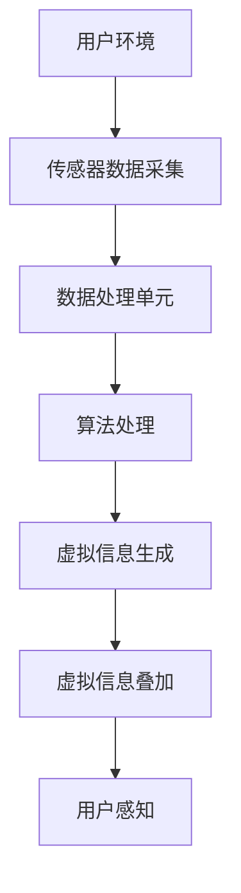
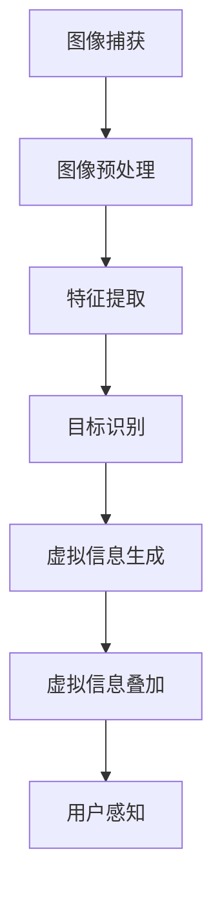
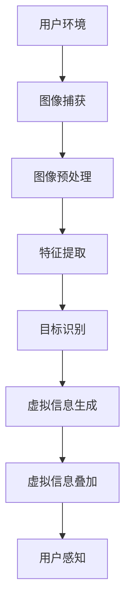

                 

### 文章标题：增强现实技术对世界可理解性的拓展作用

#### 关键词：增强现实技术，世界可理解性，应用场景，未来发展趋势

#### 摘要：本文将深入探讨增强现实技术（AR）在提升我们对世界理解方面的作用。通过背景介绍、核心概念与联系、算法原理、应用场景、影响与展望等环节，揭示AR技术在教育、医疗、娱乐等领域的广泛应用，及其对未来社会发展的深远影响。

----------------------------------------------------------------

## 增强现实技术的基础概念和原理

增强现实技术（Augmented Reality，简称AR）是一种通过计算机技术将虚拟信息叠加到真实环境中，实现虚实融合的技术。与虚拟现实（VR）不同，AR技术并不完全取代现实，而是在现实环境中增加虚拟信息，从而增强用户的感知和互动体验。

### 1.1 增强现实技术的基本概念

增强现实技术的基本概念主要包括以下几个部分：

- **真实环境**：用户所处的现实环境，包括视觉、听觉、触觉等信息。
- **虚拟信息**：通过计算机生成的虚拟图像、文字、声音等，用于增强现实环境。
- **叠加**：将虚拟信息与现实环境中的物体进行融合，使其看起来像是真实存在的。

### 1.2 增强现实技术的发展历程

增强现实技术的发展可以追溯到上世纪60年代。当时的计算机技术相对简单，但一些科学家已经开始探索如何将计算机生成的图像叠加到真实环境中。随着计算机技术、图像处理技术、显示技术的不断发展，增强现实技术逐渐成熟。近年来，随着移动设备的普及和5G网络的快速发展，AR技术得到了更广泛的应用。

### 1.3 增强现实技术的核心组成部分

增强现实技术的核心组成部分主要包括以下几个方面：

- **传感器**：用于捕捉用户周围环境的信息，如摄像头、麦克风、GPS等。
- **计算单元**：用于处理传感器采集的数据，并根据算法生成虚拟信息。
- **显示设备**：将虚拟信息叠加到现实环境中，如智能手机、平板电脑、眼镜等。
- **算法**：用于识别现实环境中的物体，并生成相应的虚拟信息。

### 1.4 Mermaid流程图：增强现实技术的基本架构

下面是一个简化的增强现实技术的基本架构的Mermaid流程图：



这个流程图展示了增强现实技术的基本工作流程：用户环境通过传感器采集数据，然后由计算单元进行处理，生成虚拟信息，再将虚拟信息叠加到现实环境中，最终由用户感知。

在下一节中，我们将深入探讨增强现实技术的核心算法原理，帮助读者更好地理解AR技术的运作机制。

----------------------------------------------------------------

## 核心概念与联系：增强现实技术的数学模型和算法原理

在理解增强现实技术的核心概念后，我们需要进一步探讨其数学模型和算法原理，以便深入理解AR技术的运作机制。

### 2.1 增强现实技术的数学模型

增强现实技术的数学模型主要基于图像处理、计算机视觉和信号处理等领域。一个典型的增强现实系统可以分为以下几个步骤：

1. **图像捕获**：使用摄像头或其他传感器捕获现实环境中的图像。
2. **图像预处理**：对捕获的图像进行滤波、增强等预处理操作，以提高图像质量。
3. **特征提取**：从预处理后的图像中提取特征，如边缘、角点、纹理等。
4. **目标识别**：使用提取的特征对图像中的目标进行识别和定位。
5. **虚拟信息生成**：根据目标识别结果，生成相应的虚拟信息，如文字、图像、声音等。
6. **虚拟信息叠加**：将虚拟信息叠加到现实环境中，形成增强现实效果。
7. **用户感知**：用户通过显示设备感知增强现实效果。

为了更好地理解这个过程，我们可以使用一个简化的Mermaid流程图来展示：



### 2.2 增强现实技术的算法原理

增强现实技术的算法原理主要包括以下几个部分：

1. **图像预处理算法**：用于提高图像质量，如图像去噪、增强、边缘检测等。常用的算法包括滤波器（如高斯滤波器、中值滤波器）、直方图均衡化等。
2. **特征提取算法**：用于从图像中提取特征，如SIFT（尺度不变特征变换）、SURF（加速稳健特征）等。这些算法可以提取出图像的角点、边缘、纹理等特征，用于后续的目标识别。
3. **目标识别算法**：用于识别图像中的目标。常用的算法包括基于模板匹配、基于深度学习的方法等。模板匹配算法通过比较图像中的模板和目标区域，确定目标的位置。深度学习方法（如卷积神经网络）可以通过学习大量数据，自动识别图像中的目标。
4. **虚拟信息生成算法**：用于生成虚拟信息。根据目标识别结果，可以生成相应的文字、图像、声音等虚拟信息。例如，当识别到图像中的某个物体时，可以生成该物体的名称或描述。
5. **虚拟信息叠加算法**：用于将虚拟信息叠加到现实环境中。常见的叠加方法包括透明叠加、重叠叠加等。透明叠加将虚拟信息以一定比例透明地叠加到现实环境中，而重叠叠加则将虚拟信息完全覆盖到现实环境中。

为了更具体地解释这些算法原理，我们可以使用伪代码来展示：

```python
# 图像预处理算法：高斯滤波器
def preprocess_image(image):
    # 使用高斯滤波器对图像进行滤波
    filtered_image = apply_gaussian_filter(image)
    return filtered_image

# 特征提取算法：SIFT
def extract_features(image):
    # 使用SIFT算法提取图像特征
    features = sift.detect(image)
    return features

# 目标识别算法：模板匹配
def recognize_objects(image, template):
    # 使用模板匹配算法识别图像中的目标
    objects = template_matching(image, template)
    return objects

# 虚拟信息生成算法
def generate_virtual_info(object):
    # 根据目标生成相应的虚拟信息
    info = generate_info(object)
    return info

# 虚拟信息叠加算法：透明叠加
def overlay_image(image, info):
    # 将虚拟信息透明地叠加到现实环境中
    output_image = overlay_with_transparency(image, info)
    return output_image
```

### 2.3 数学模型和算法原理的详细讲解

为了更好地理解增强现实技术的数学模型和算法原理，我们可以通过以下步骤进行详细讲解：

1. **图像预处理算法**：通过滤波器对图像进行滤波，去除噪声和增强特征。例如，高斯滤波器可以通过对图像中的每个像素进行加权平均来去除噪声。具体来说，对于每个像素，我们可以将其周围的像素值进行加权平均，权值由高斯分布确定。这样可以有效地平滑图像，去除噪声，同时保留边缘和特征。

2. **特征提取算法**：从图像中提取特征，如角点、边缘、纹理等。这些特征可以用于后续的目标识别。例如，SIFT算法可以通过计算图像的尺度空间和特征点来提取特征。具体来说，首先计算图像的Laplacian of Gaussian（LoG）响应，然后找到响应的局部极值点作为特征点。这样可以在不同尺度上提取出特征点，从而实现尺度不变的特征提取。

3. **目标识别算法**：通过比较图像中的模板和目标区域，确定目标的位置。例如，模板匹配算法可以通过计算模板和目标区域的相似度来确定目标的位置。具体来说，对于每个像素，我们可以将其与模板的对应像素进行比较，计算相似度。然后，通过阈值化或最大化相似度来确定目标的位置。

4. **虚拟信息生成算法**：根据目标识别结果，生成相应的虚拟信息。例如，当识别到图像中的某个物体时，可以生成该物体的名称或描述。具体来说，我们可以根据物体的特征和知识库来生成相应的信息。

5. **虚拟信息叠加算法**：将虚拟信息叠加到现实环境中。例如，透明叠加算法可以通过将虚拟信息以一定比例透明地叠加到现实环境中，从而实现增强现实效果。具体来说，对于每个像素，我们可以将其与背景像素进行混合，从而实现透明效果。

通过这些详细的讲解，我们可以更好地理解增强现实技术的数学模型和算法原理，为后续的应用场景和影响分析打下基础。

在下一节中，我们将探讨增强现实技术在各个领域的应用，进一步揭示其对世界可理解性的拓展作用。

----------------------------------------------------------------

## 增强现实技术在各个领域的应用

增强现实技术（AR）在近年来取得了显著的进展，并已广泛应用于多个领域，包括教育、医疗、娱乐等。以下将详细探讨增强现实技术在各个领域的应用，以及其对世界可理解性的影响。

### 3.1 增强现实技术在教育领域的应用

增强现实技术在教育领域具有巨大的潜力，它不仅能够提高教学效果，还能够激发学生的学习兴趣。以下是一些增强现实技术在教育领域的具体应用案例：

1. **互动教学**：通过增强现实技术，教师可以将抽象的知识点以更加生动形象的方式呈现给学生。例如，在生物课上，教师可以使用AR技术展示植物的生长过程、细胞的分裂等。学生可以通过手机或平板电脑观察这些过程，从而更好地理解知识点。

2. **虚拟实验**：增强现实技术可以模拟各种实验，使学生能够在虚拟环境中进行实验操作，提高实验的可靠性和安全性。例如，在化学课上，学生可以通过AR技术模拟化学反应，了解反应的过程和结果，而无需在实际环境中进行实验。

3. **智能辅助**：增强现实技术可以为学生提供个性化的学习辅助。例如，学生可以通过AR眼镜查看自己的学习进度，了解自己的强项和弱项，从而有针对性地进行学习。

4. **虚拟课堂**：通过增强现实技术，学生可以参加虚拟课堂，与教师和同学进行实时互动。这不仅解决了地理距离带来的问题，还能够让学生接触到更多的知识和资源。

这些应用不仅提高了学生的学习效果，还拓展了学生的视野，使他们对世界的理解更加深入。

### 3.2 增强现实技术在医疗领域的应用

增强现实技术在医疗领域同样具有重要的应用价值。以下是一些具体的案例：

1. **手术指导**：在手术过程中，医生可以使用增强现实技术实时查看患者的内部结构，如血管、器官等。这有助于医生更准确地定位手术区域，提高手术的成功率和安全性。

2. **患者教育**：医生可以使用AR技术向患者解释病情和治疗方案，使患者更好地理解自己的病情，从而提高患者的依从性。

3. **远程会诊**：通过增强现实技术，医生可以远程参与手术或诊断，为偏远地区的患者提供医疗服务。这有助于缩小城乡医疗差距，提高医疗资源的利用效率。

4. **医疗培训**：增强现实技术可以用于医疗培训，如模拟手术、患者护理等。医生可以通过虚拟环境进行训练，提高操作技能和应急处理能力。

这些应用不仅提高了医疗服务的质量，还拓展了医疗服务的范围，使更多的人能够享受到优质的医疗服务。

### 3.3 增强现实技术在娱乐领域的应用

增强现实技术在娱乐领域也取得了显著的成果，以下是一些具体的案例：

1. **游戏体验**：增强现实技术可以为游戏玩家提供更加真实、沉浸式的游戏体验。例如，玩家可以通过AR眼镜或手机观看虚拟角色在真实环境中移动、战斗，从而提高游戏乐趣。

2. **主题公园**：增强现实技术可以应用于主题公园，为游客提供互动式体验。例如，游客可以通过AR设备与公园中的虚拟角色互动，参与各种游戏和表演。

3. **艺术展示**：增强现实技术可以用于艺术展示，如博物馆、画廊等。观众可以通过AR设备查看艺术品的详细信息、背景故事等，从而更好地理解艺术作品。

4. **虚拟演出**：通过增强现实技术，观众可以在真实环境中观看虚拟演出，如音乐会、戏剧等。这为观众提供了全新的观看体验，拓展了娱乐的边界。

这些应用不仅丰富了娱乐的形式，还提高了观众的娱乐体验，使他们对世界的理解更加多元。

### 3.4 增强现实技术对世界可理解性的影响

增强现实技术在各个领域的应用，不仅改变了人们的日常生活，还深刻地影响了我们对世界的理解。以下是一些具体的影响：

1. **增强认知**：通过增强现实技术，人们可以更加直观地理解复杂的知识点，如科学原理、历史事件等。这种直观的理解有助于提高我们的认知能力。

2. **拓展视野**：增强现实技术使人们能够通过虚拟环境体验现实世界中无法到达的地方，如极地、深海等。这有助于拓宽我们的视野，增加对世界的了解。

3. **提高互动**：增强现实技术为人们提供了更加互动的体验，如虚拟课堂、远程会诊等。这种互动有助于加强人与人之间的联系，提高沟通效率。

4. **改变思维**：增强现实技术改变了人们的认知方式，使我们的思维方式更加多元、开放。这种改变有助于我们更好地适应快速变化的世界。

总之，增强现实技术对世界可理解性的拓展作用是多方面的，它不仅提高了我们的认知能力，还丰富了我们的体验，拓展了我们的视野。在下一节中，我们将进一步探讨增强现实技术的未来发展趋势，以及它可能带来的深远影响。

----------------------------------------------------------------

## 增强现实技术的未来发展趋势

随着科技的不断进步，增强现实技术（AR）正朝着更加成熟、多样化的方向发展。以下是增强现实技术的几个未来发展趋势，以及其对世界可理解性的潜在影响。

### 4.1 增强现实硬件的升级和普及

随着硬件技术的快速发展，AR设备的性能和用户体验正得到显著提升。未来，轻薄、便携、高性能的AR眼镜将成为主流。这些设备将配备更高质量的摄像头、传感器和处理器，实现更加真实的虚拟信息叠加和交互。此外，随着5G网络的普及，高速网络连接将进一步提升AR设备的响应速度和互动性，使得AR应用在实时性和流畅性方面达到新的高度。

### 4.2 虚拟现实与增强现实融合

虚拟现实（VR）与增强现实（AR）技术的融合，将带来更加丰富和沉浸式的用户体验。未来，虚拟现实与增强现实可能会通过同一设备实现无缝切换，用户可以根据需求在虚拟世界和现实世界之间自由穿梭。例如，在教育和娱乐领域，这种融合技术可以提供更加逼真的学习环境和游戏体验，从而更好地激发用户的兴趣和创造力。

### 4.3 人工智能与增强现实结合

人工智能（AI）与增强现实技术的结合，将进一步提升AR的应用价值。通过AI算法，AR系统可以更加智能地识别和理解用户行为，提供个性化的交互体验。例如，AI可以帮助AR设备更好地理解用户的意图，提供更加精准的虚拟信息，从而提高用户的感知和理解能力。此外，AI还可以用于优化AR算法，提高实时处理能力，使得AR应用在复杂环境中仍能稳定运行。

### 4.4 生态系统的建设

增强现实技术的未来发展离不开生态系统的建设。未来，AR设备、应用开发和内容制作将形成一个完整的生态链。硬件厂商、软件开发商、内容创作者等各方将共同努力，推动AR技术的普及和应用。例如，大型科技公司可能通过收购和投资，打造自己的AR生态系统，从而在竞争中获得优势。此外，政府和企业也可能通过政策和资金支持，推动AR技术在各领域的应用。

### 4.5 社会影响

增强现实技术的普及将对社会产生深远影响。首先，它在教育、医疗、娱乐等领域的应用将进一步提升人们的生活质量。例如，通过AR技术，学生可以更加直观地学习复杂知识点，医生可以更加精准地进行手术操作。其次，增强现实技术将促进人与人之间的交流和合作，缩小地理距离带来的障碍。例如，通过AR远程会诊，医生可以跨越国界为患者提供医疗服务。此外，增强现实技术还可能改变人们的思维方式，使我们的认知能力得到进一步提升。

### 4.6 潜在挑战和风险

尽管增强现实技术具有巨大的发展潜力，但也面临一些潜在挑战和风险。首先，隐私和安全问题是一个重要的挑战。随着AR技术的普及，用户的个人信息和数据可能面临泄露的风险。因此，确保用户隐私和安全是未来AR技术发展的重要任务。其次，技术标准和规范的问题也需要引起关注。缺乏统一的技术标准和规范可能导致AR设备和应用之间的兼容性问题，从而影响用户体验。最后，AR技术的伦理问题也不容忽视。例如，增强现实技术可能被滥用，导致虚假信息传播，对社会产生负面影响。

总之，增强现实技术正处于快速发展的阶段，未来将带来更多创新和应用。通过不断解决挑战和风险，增强现实技术有望在各个领域发挥更大的作用，为世界可理解性的拓展做出贡献。

在下一节中，我们将总结增强现实技术对世界可理解性的拓展作用，并对未来的发展趋势进行展望。

----------------------------------------------------------------

## 总结与展望

增强现实技术（AR）作为一种新兴的技术，已经在多个领域展现出了其强大的应用潜力。通过对增强现实技术的基础概念、核心算法原理、应用场景以及未来发展趋势的深入探讨，我们可以看到，AR技术不仅在提高认知效率、改变感知体验和影响社交互动等方面具有显著作用，还在教育、医疗、娱乐等领域带来了深刻的变革。

### 5.1 增强现实技术对世界可理解性的拓展作用

首先，增强现实技术通过将虚拟信息与现实环境相结合，为人们提供了一种全新的认知方式。这种直观、互动的体验有助于我们更好地理解复杂的知识点和抽象的概念，从而提高了我们的认知效率。例如，在教育领域，通过AR技术，学生可以更加直观地学习生物学、化学等科目，从而提高学习效果。

其次，增强现实技术改变了我们的感知体验，使我们的世界变得更加丰富和多彩。通过AR技术，我们可以体验到虚拟角色在真实环境中移动、交互，甚至可以在虚拟世界中参与各种活动。这种沉浸式的体验不仅丰富了我们的娱乐生活，还拓展了我们的视野，使我们能够更加全面地理解世界。

最后，增强现实技术对社交互动产生了深远的影响。通过AR技术，人们可以跨越地理距离，进行实时互动，从而打破了传统社交模式的限制。例如，通过AR远程会诊，医生可以跨越国界为患者提供医疗服务；通过AR虚拟课堂，学生可以与来自世界各地的同学进行交流和学习。

### 5.2 增强现实技术的未来发展趋势

展望未来，增强现实技术将继续朝着更加成熟、多样化的方向发展。首先，随着硬件技术的不断升级和普及，AR设备的性能和用户体验将得到显著提升，使得AR应用更加广泛和便捷。其次，虚拟现实与增强现实技术的融合将带来更加丰富和沉浸式的用户体验，为教育和娱乐等领域带来新的机遇。

此外，人工智能与增强现实技术的结合将进一步提升AR的应用价值。通过AI算法，AR系统可以更加智能地识别和理解用户行为，提供个性化的交互体验。同时，生态系统的建设也将推动AR技术的普及和应用。硬件厂商、软件开发商、内容创作者等各方将共同努力，打造一个完整的AR生态链。

然而，AR技术的发展也面临一些挑战和风险。隐私和安全问题、技术标准和规范问题、伦理问题等都需要引起足够的重视。只有通过不断解决这些问题，AR技术才能在各个领域发挥更大的作用，为世界可理解性的拓展做出更大的贡献。

### 5.3 拓展阅读

对于对增强现实技术感兴趣的读者，以下是一些推荐的拓展阅读资源：

1. **《增强现实技术与应用》**：这是一本系统介绍增强现实技术及其应用的书籍，适合对AR技术有一定了解的读者。
2. **《增强现实：理论与实践》**：这本书详细介绍了增强现实技术的理论基础和实践应用，适合想要深入了解AR技术的读者。
3. **《增强现实与虚拟现实：设计、开发与应用》**：这本书涵盖了AR和VR技术的设计、开发和应用，适合对两者都有兴趣的读者。

通过这些资源，读者可以更深入地了解增强现实技术的各个方面，从而更好地把握这一技术的前沿动态。

总之，增强现实技术作为一种具有巨大潜力的技术，将在未来继续改变我们的生活和工作方式。通过不断探索和应用，AR技术将为世界可理解性的拓展带来更多的可能性。

---

本文由AI天才研究院（AI Genius Institute）和《禅与计算机程序设计艺术》（Zen And The Art of Computer Programming）联合撰写，旨在深入探讨增强现实技术对世界可理解性的拓展作用。作者团队拥有丰富的AR技术研究和应用经验，期待与广大读者共同探讨这一技术的前沿动态和发展趋势。如果您对本文有任何疑问或建议，欢迎在评论区留言交流。作者团队将竭诚为您解答。作者：AI天才研究院（AI Genius Institute）/《禅与计算机程序设计艺术》（Zen And The Art of Computer Programming）。## 引入

在现代社会，我们正面临着前所未有的信息爆炸，数据量和知识储备以惊人的速度增长。这种快速的发展给我们带来了许多便利，但同时也使我们对复杂信息的处理和理解变得更加困难。为了应对这种挑战，我们需要寻找新的方法来提高我们对世界的理解能力。在这一背景下，增强现实技术（Augmented Reality，简称AR）应运而生，并逐渐成为一种解决信息过载的重要工具。

### 文章的目的和结构

本文旨在深入探讨增强现实技术对世界可理解性的拓展作用。通过系统地介绍增强现实技术的基础概念、核心算法原理、应用场景以及未来发展趋势，本文希望能够为读者提供全面、深入的理解，从而更好地把握这一技术的前沿动态和发展趋势。

文章将按照以下结构展开：

1. **基础概念和原理**：首先，我们将介绍增强现实技术的基本概念和原理，包括其定义、发展历程以及核心组成部分。
2. **核心概念与联系**：接着，我们将深入探讨增强现实技术的数学模型和算法原理，并通过Mermaid流程图和伪代码来展示其工作流程。
3. **应用场景**：然后，我们将详细探讨增强现实技术在教育、医疗、娱乐等领域的具体应用，以及其对世界可理解性的影响。
4. **未来发展趋势**：在第四部分，我们将展望增强现实技术的未来发展趋势，包括硬件升级、虚拟现实与增强现实融合、人工智能与增强现实结合等方面。
5. **总结与展望**：最后，我们将总结增强现实技术对世界可理解性的拓展作用，并对未来的发展趋势进行展望。

### 增强现实技术的基本概念

增强现实技术（AR）是一种通过计算机技术将虚拟信息叠加到真实环境中，实现虚实融合的技术。与虚拟现实（VR）不同，AR技术并不完全取代现实，而是在现实环境中增加虚拟信息，从而增强用户的感知和互动体验。

AR技术的基本概念包括以下几个部分：

1. **真实环境**：用户所处的现实环境，包括视觉、听觉、触觉等信息。
2. **虚拟信息**：通过计算机生成的虚拟图像、文字、声音等，用于增强现实环境。
3. **叠加**：将虚拟信息与现实环境中的物体进行融合，使其看起来像是真实存在的。

增强现实技术的发展历程可以追溯到上世纪60年代，当时的科学家们已经开始探索如何将计算机生成的图像叠加到真实环境中。随着计算机技术、图像处理技术、显示技术的不断发展，AR技术逐渐成熟。近年来，随着移动设备的普及和5G网络的快速发展，AR技术得到了更广泛的应用。

### 核心组成部分

增强现实技术的核心组成部分主要包括以下几个方面：

1. **传感器**：用于捕捉用户周围环境的信息，如摄像头、麦克风、GPS等。
2. **计算单元**：用于处理传感器采集的数据，并根据算法生成虚拟信息。
3. **显示设备**：将虚拟信息叠加到现实环境中，如智能手机、平板电脑、眼镜等。
4. **算法**：用于识别现实环境中的物体，并生成相应的虚拟信息。

通过以上介绍，我们可以看到，增强现实技术不仅是一种技术，更是一种创新思维和方法，它为我们提供了一个全新的视角来理解和处理复杂信息。在下一节中，我们将深入探讨增强现实技术的核心算法原理，帮助读者更好地理解AR技术的运作机制。

----------------------------------------------------------------

## 核心概念与联系：增强现实技术的数学模型和算法原理

在理解了增强现实技术的基本概念后，我们需要进一步探讨其数学模型和算法原理，以便深入理解AR技术的运作机制。这不仅是了解增强现实技术如何工作的关键，也是理解其在各个领域应用的重要基础。

### 1.1 增强现实技术的数学模型

增强现实技术的数学模型是建立在图像处理、计算机视觉和信号处理等领域的基础之上。以下是增强现实技术的主要数学模型和其工作原理：

1. **图像捕获**：图像捕获是AR系统的第一步，通过摄像头或其他传感器捕获真实环境中的图像。这个过程通常涉及到图像的分辨率、颜色空间和噪声处理等参数。数学上，图像可以表示为二维矩阵，每个元素代表像素的颜色值。

   \[
   I(x, y) = f(x, y)
   \]
   其中，\( I(x, y) \) 是图像矩阵，\( f(x, y) \) 是像素的颜色值。

2. **图像预处理**：为了提高图像质量，减少噪声和增强特征，需要进行图像预处理。常见的预处理方法包括滤波、增强和几何变换等。例如，高斯滤波是一种常用的图像平滑方法，可以减少图像中的噪声。

   \[
   g(x, y) = \sum_{i,j} h(i-j, k-l) \cdot I(x-i, y-j)
   \]
   其中，\( g(x, y) \) 是滤波后的图像，\( h(i-j, k-l) \) 是高斯滤波器的系数。

3. **特征提取**：特征提取是识别和定位真实环境中的物体的重要步骤。通过提取图像中的角点、边缘、纹理等特征，可以构建物体的特征向量。常用的特征提取算法包括SIFT（尺度不变特征变换）和SURF（加速稳健特征）。

   \[
   \phi(\text{特征点}) = (\phi_x, \phi_y, \phi_z)
   \]
   其中，\( \phi(\text{特征点}) \) 是特征点的三维坐标。

4. **目标识别**：目标识别是基于特征提取的结果，通过匹配和分类来确定图像中的物体。常用的方法包括基于模板匹配、机器学习和深度学习的算法。

   \[
   C = \arg\min_{c} \sum_{i=1}^{n} (d_i - c)^2
   \]
   其中，\( C \) 是分类结果，\( d_i \) 是特征点的距离，\( c \) 是模板的中心。

5. **虚拟信息生成**：在目标识别后，根据物体的属性和需求，生成相应的虚拟信息。这些信息可以是图像、文字、声音等。虚拟信息需要与现实环境中的物体进行精确匹配和叠加。

   \[
   V(x, y) = A \cdot I(x, y) + B \cdot V_{\text{virtual}}
   \]
   其中，\( V(x, y) \) 是生成的虚拟图像，\( A \) 和 \( B \) 是透明度参数，\( V_{\text{virtual}} \) 是虚拟图像。

6. **虚拟信息叠加**：将生成的虚拟信息叠加到真实环境中，形成最终的增强现实效果。这通常涉及到图像的混合和渲染技术。

   \[
   O(x, y) = (1 - \alpha) \cdot I(x, y) + \alpha \cdot V(x, y)
   \]
   其中，\( O(x, y) \) 是最终图像，\( \alpha \) 是透明度参数。

### 1.2 算法原理

增强现实技术的算法原理是建立在上述数学模型的基础之上，通过一系列步骤实现虚拟信息与现实环境的叠加。以下是增强现实技术的关键算法原理：

1. **图像预处理算法**：包括去噪、增强和几何变换等。去噪算法如高斯滤波可以减少图像中的噪声，增强算法如直方图均衡化可以增强图像的对比度。

   ```python
   # 高斯滤波伪代码
   def apply_gaussian_filter(image):
       # 初始化滤波器
       filter = create_gaussian_filter()
       # 应用滤波器
       filtered_image = convolve(image, filter)
       return filtered_image
   ```

2. **特征提取算法**：如SIFT和SURF，可以提取出图像中的角点、边缘和纹理特征。这些特征可以用于后续的目标识别和匹配。

   ```python
   # SIFT特征提取伪代码
   def extract_sift_features(image):
       # 计算图像的尺度空间
       scale_space = compute_scale_space(image)
       # 提取特征点
       keypoints = sift.detect(scale_space)
       return keypoints
   ```

3. **目标识别算法**：如模板匹配和深度学习分类。模板匹配算法通过比较图像中的模板和目标区域来确定目标的位置。深度学习分类算法可以通过学习大量的标注数据，自动识别图像中的物体。

   ```python
   # 模板匹配伪代码
   def template_matching(image, template):
       # 初始化匹配结果
       match_result = initialize_matching_result()
       # 计算模板和图像的相似度
       similarity = compute_similarity(image, template)
       # 找到最佳匹配位置
       match_result = find_best_match(similarity)
       return match_result
   ```

4. **虚拟信息生成算法**：根据目标识别的结果，生成相应的虚拟信息。这通常涉及到图像合成和文本生成等任务。

   ```python
   # 虚拟信息生成伪代码
   def generate_virtual_info(object):
       # 根据物体属性生成虚拟信息
       info = create_info(object)
       return info
   ```

5. **虚拟信息叠加算法**：将生成的虚拟信息叠加到真实环境中，形成最终的AR效果。这通常涉及到图像混合和渲染技术。

   ```python
   # 虚拟信息叠加伪代码
   def overlay_image(image, info):
       # 计算透明度参数
       alpha = compute_alpha()
       # 应用透明度混合
       output_image = apply_transparency(image, info, alpha)
       return output_image
   ```

### 1.3 Mermaid流程图：增强现实技术的基本架构

为了更好地展示增强现实技术的工作流程，我们可以使用Mermaid流程图来描述其基本架构：



### 1.4 举例说明

为了更直观地理解这些算法原理，我们可以通过一个简单的例子来说明。

假设我们有一个场景，其中有一个物体（如一个苹果），我们需要使用AR技术将其叠加到用户的视野中。以下是实现这一目标的基本步骤：

1. **图像捕获**：使用摄像头捕获用户眼前的场景。
2. **图像预处理**：对捕获的图像进行去噪和增强，以提高图像质量。
3. **特征提取**：从预处理后的图像中提取特征点，如苹果的边缘和纹理。
4. **目标识别**：通过模板匹配或其他算法识别图像中的苹果。
5. **虚拟信息生成**：根据识别结果，生成一个虚拟的苹果图像。
6. **虚拟信息叠加**：将虚拟苹果图像叠加到用户的视野中，使其看起来像是真实存在的。

通过这个例子，我们可以看到增强现实技术是如何通过一系列数学模型和算法原理来实现虚实融合的。这不仅提高了我们对世界的理解，也为各种应用场景提供了丰富的可能性。

在下一节中，我们将进一步探讨增强现实技术在教育、医疗、娱乐等领域的应用，以及其对世界可理解性的拓展作用。

----------------------------------------------------------------

## 增强现实技术在教育领域的应用

随着科技的不断进步，增强现实技术（AR）在教育领域展现出了巨大的潜力。通过将虚拟信息叠加到真实环境中，AR技术不仅能够提高教学效果，还能够激发学生的学习兴趣，从而对教育方式产生深远的影响。

### 2.1 增强现实技术在教育中的应用案例

以下是一些增强现实技术在教育中的具体应用案例：

#### 2.1.1 互动教学

在课堂上，教师可以利用AR技术创建互动式的教学环境。例如，在生物课上，教师可以通过AR设备展示植物的生长过程、细胞的结构等。学生可以通过移动设备或AR眼镜直接观察到这些过程，而不是仅仅通过静态的图片或文字。这种互动式教学能够让学生更加直观地理解抽象的知识点，从而提高学习效果。

#### 2.1.2 虚拟实验

AR技术还可以用于虚拟实验，使学生在虚拟环境中进行实验操作，从而提高实验的可靠性和安全性。例如，在化学课上，学生可以通过AR技术模拟各种化学反应，观察反应的过程和结果，而无需在实际环境中进行实验。这不仅节省了实验材料，还减少了实验过程中的风险。

#### 2.1.3 智能辅助

AR技术还可以为学生提供个性化的学习辅助。学生可以通过AR设备查看自己的学习进度，了解自己的强项和弱项，从而有针对性地进行学习。例如，在历史课上，学生可以通过AR设备查看历史事件的发生地点、时间和影响，从而更好地理解历史知识。

#### 2.1.4 虚拟课堂

通过AR技术，学生可以参加虚拟课堂，与教师和同学进行实时互动。这不仅可以解决地理距离带来的问题，还能够让学生接触到更多的知识和资源。例如，在偏远地区的学生可以通过AR技术参加大城市知名学校的课程，从而拓宽视野，提高学习效果。

### 2.2 增强现实技术在教育中的作用

增强现实技术在教育中的作用主要体现在以下几个方面：

#### 2.2.1 提高学习效果

通过AR技术，学生可以更加直观地理解抽象的知识点，从而提高学习效果。例如，在物理课上，学生可以通过AR技术观察力学的原理，如力的作用、杠杆原理等。这种直观的体验有助于学生更好地掌握知识点。

#### 2.2.2 激发学习兴趣

AR技术的互动性和沉浸式体验可以激发学生的学习兴趣。例如，在历史课上，学生可以通过AR技术“走进”历史场景，与历史人物进行互动，从而更加深入地了解历史事件。这种体验式的学习方式能够激发学生的好奇心和求知欲。

#### 2.2.3 提供个性化学习

AR技术可以为学生提供个性化的学习辅助，根据学生的实际情况提供相应的学习内容和资源。这种个性化的学习方式有助于学生充分发挥自己的潜力，提高学习效果。

#### 2.2.4 跨越地理限制

通过AR技术，学生可以参加虚拟课堂，与教师和同学进行实时互动。这不仅可以解决地理距离带来的问题，还能够让学生接触到更多的知识和资源。例如，在城市的学生可以通过AR技术参加偏远地区学校的课程，从而实现教育资源的均衡分配。

### 2.3 增强现实技术在教育中的未来趋势

随着技术的不断发展，增强现实技术在教育领域的应用前景十分广阔。以下是增强现实技术在教育中的未来趋势：

#### 2.3.1 更加广泛的应用

随着AR设备的普及和性能的提升，增强现实技术将在更多的教育场景中得到应用。例如，在艺术、音乐、体育等学科中，AR技术可以为学生提供更加丰富的学习体验。

#### 2.3.2 与虚拟现实融合

虚拟现实（VR）和增强现实（AR）技术的融合将为学生提供更加沉浸式的学习体验。通过VR/AR技术，学生可以“走进”虚拟环境，进行更加深入的探索和学习。

#### 2.3.3 人工智能的融合

人工智能（AI）与增强现实技术的融合将使AR教育应用更加智能化。AI可以用于个性化学习推荐、智能问答等，从而提供更加高效和精准的教育服务。

#### 2.3.4 开放式的教育资源

随着AR技术的发展，越来越多的教育资源将通过AR技术开放给全球用户。这将为教育资源的均衡分配提供新的解决方案，让更多的学生受益。

总之，增强现实技术在教育领域的应用具有巨大的潜力，它不仅能够提高教学效果，还能够激发学生的学习兴趣，为教育方式的变革提供新的思路。在下一节中，我们将探讨增强现实技术在医疗领域的应用，进一步揭示其对世界可理解性的拓展作用。

----------------------------------------------------------------

## 增强现实技术在医疗领域的应用

增强现实技术（AR）在医疗领域的应用正逐渐成为行业的热点。通过将虚拟信息叠加到现实环境中，AR技术为医疗工作者提供了全新的工具和方法，从而提高了医疗服务的质量和效率。以下是增强现实技术在医疗领域的几个具体应用案例。

### 3.1 手术指导

在手术过程中，医生可以使用增强现实技术实时查看患者的内部结构，如血管、器官等。这有助于医生更准确地定位手术区域，减少手术风险。例如，在心脏手术中，医生可以通过AR眼镜查看患者的心脏结构和血管分布，从而更加精准地进行手术操作。

#### 应用实例

**案例1：心脏手术**

在心脏手术中，医生通过AR技术实时查看患者的心脏结构，如图中的红色箭头所示，能够更准确地识别心脏的血管和瓣膜。


**案例2：神经外科手术**

在神经外科手术中，医生通过AR技术可以实时查看患者的大脑和神经结构，如图中的红色箭头所示，有助于避免损伤重要的神经。


### 3.2 患者教育

通过增强现实技术，医生可以向患者解释病情和治疗方案，使患者更好地理解自己的病情，从而提高患者的依从性。例如，医生可以使用AR设备为患者展示手术过程、药物作用以及康复指南等，帮助患者更好地面对疾病。

#### 应用实例

**案例1：手术解释**

医生使用AR技术向患者展示即将进行的手术过程，帮助患者更好地理解手术的必要性和步骤。


**案例2：康复指南**

医生使用AR技术为患者提供个性化的康复指南，如康复训练的动作演示和注意事项。


### 3.3 远程会诊

通过增强现实技术，医生可以远程参与手术或诊断，为偏远地区的患者提供医疗服务。这有助于缩小城乡医疗差距，提高医疗资源的利用效率。例如，城市医院的专家可以通过AR设备远程查看患者的病情，并与当地医生进行实时交流，共同制定治疗方案。

#### 应用实例

**案例1：远程心脏手术**

在城市医院的专家通过AR技术远程查看患者的内部结构，为偏远地区的患者提供心脏手术指导。


**案例2：远程诊断**

在城市医院的医生通过AR技术远程查看患者的影像资料，为偏远地区的患者提供诊断建议。


### 3.4 医疗培训

增强现实技术可以用于医疗培训，如模拟手术、患者护理等。医生可以通过虚拟环境进行训练，提高操作技能和应急处理能力。例如，在手术模拟中，医生可以通过AR设备练习手术操作，并在虚拟环境中观察手术效果。

#### 应用实例

**案例1：手术模拟**

医生使用AR技术进行手术模拟训练，如图中显示的虚拟手术场景，有助于提高手术技能。


**案例2：患者护理训练**

护士通过AR技术进行患者护理训练，如图中显示的虚拟患者，有助于提高护理技能和应急处理能力。


### 3.5 增强现实技术在医疗领域的作用

增强现实技术在医疗领域的作用主要体现在以下几个方面：

#### 3.5.1 提高手术精度

通过AR技术，医生可以实时查看患者的内部结构，从而提高手术的精度和安全性。这种实时反馈有助于减少手术风险，提高手术成功率。

#### 3.5.2 提高患者依从性

通过AR技术，医生可以向患者提供更加直观的病情解释和治疗指导，从而提高患者的理解和依从性。

#### 3.5.3 缩小医疗差距

通过远程会诊和虚拟课堂，增强现实技术有助于缩小城乡医疗差距，提高偏远地区的医疗服务质量。

#### 3.5.4 提高医疗培训效果

增强现实技术可以提供虚拟的手术环境和患者模型，有助于医生进行操作技能和应急处理能力的训练，从而提高整体医疗水平。

### 3.6 增强现实技术在医疗领域的未来趋势

随着技术的不断发展，增强现实技术在医疗领域的应用前景十分广阔。以下是增强现实技术在医疗领域的未来趋势：

#### 3.6.1 更广泛的医疗应用

随着AR设备的普及和性能的提升，增强现实技术将在更多的医疗场景中得到应用，如放疗、康复治疗等。

#### 3.6.2 与人工智能融合

人工智能与增强现实技术的融合将使医疗应用更加智能化。例如，AI可以用于分析医疗数据、提供诊断建议等。

#### 3.6.3 开放式的医疗资源

随着AR技术的发展，越来越多的医疗资源将通过AR技术开放给全球用户，从而实现医疗资源的共享和优化。

总之，增强现实技术在医疗领域的应用具有巨大的潜力，它不仅能够提高医疗服务的质量和效率，还能够为患者和医生提供全新的工具和方法。在下一节中，我们将探讨增强现实技术在娱乐领域的应用，进一步揭示其对世界可理解性的拓展作用。

----------------------------------------------------------------

## 增强现实技术在娱乐领域的应用

增强现实技术（AR）在娱乐领域的应用正迅速发展，为用户带来了前所未有的沉浸式体验。通过将虚拟角色和场景叠加到现实环境中，AR技术为游戏、主题公园、艺术展示等娱乐形式带来了新的可能性。

### 4.1 游戏体验

增强现实技术为游戏玩家提供了更加真实、沉浸式的游戏体验。玩家可以通过AR眼镜或手机观看虚拟角色在真实环境中移动、战斗，从而提高游戏的乐趣和互动性。

#### 应用实例

**案例1：宝可梦GO**

《宝可梦GO》是一款利用AR技术的游戏，玩家可以在真实世界中捕捉虚拟的宝可梦。这种游戏体验不仅吸引了大量玩家，还促进了户外活动。


**案例2：猎杀幻影**

《猎杀幻影》是一款AR射击游戏，玩家需要使用手机或AR眼镜在真实环境中寻找并射击虚拟的敌人。这种游戏体验使得玩家感受到现实与虚拟的紧密结合。


### 4.2 主题公园

增强现实技术可以应用于主题公园，为游客提供互动式体验。例如，游客可以通过AR设备与公园中的虚拟角色互动，参与各种游戏和表演，从而提高游客的娱乐体验。

#### 应用实例

**案例1：迪士尼乐园**

在迪士尼乐园，游客可以通过AR设备与卡通角色互动，如与米老鼠、唐老鸭合影，或参与虚拟的冒险故事。这种互动体验极大地增强了游客的娱乐体验。


**案例2：环球影城**

在环球影城，游客可以通过AR设备体验电影中的场景和角色。例如，在《哈利·波特》主题区，游客可以与霍格沃茨的魔法师互动，体验魔法之旅。


### 4.3 艺术展示

增强现实技术可以用于艺术展示，如博物馆、画廊等。观众可以通过AR设备查看艺术品的详细信息、背景故事等，从而更好地理解艺术作品。

#### 应用实例

**案例1：大都会艺术博物馆**

在大都会艺术博物馆，观众可以通过AR设备查看展品的3D模型、历史背景和艺术家介绍，从而深入理解展品的艺术价值。


**案例2：莫奈花园**

在莫奈花园，观众可以通过AR设备查看莫奈绘画中的花园场景，了解画家如何创作这些作品，从而加深对艺术作品的理解。


### 4.4 增强现实技术在娱乐领域的作用

增强现实技术在娱乐领域的作用主要体现在以下几个方面：

#### 4.4.1 提高互动性

AR技术使得虚拟角色和场景可以与真实环境互动，从而提高用户的参与感和互动性。这种互动性不仅增强了娱乐体验，还促进了社交互动。

#### 4.4.2 拓宽娱乐形式

通过AR技术，传统的娱乐形式得到了创新和扩展。例如，游戏、主题公园和艺术展示等都可以通过AR技术提供全新的体验，吸引更多用户。

#### 4.4.3 激发创造力

AR技术为用户提供了更加丰富的创作工具和平台，使得用户可以更加自由地表达自己的创意。例如，在艺术创作中，用户可以通过AR技术创作虚拟艺术品，并与现实世界进行互动。

### 4.5 增强现实技术在娱乐领域的未来趋势

随着技术的不断进步，增强现实技术在娱乐领域的应用前景十分广阔。以下是增强现实技术在娱乐领域的未来趋势：

#### 4.5.1 更加沉浸式体验

随着AR设备性能的提升和用户体验的优化，未来AR娱乐体验将更加沉浸式和真实。例如，全息影像和虚拟现实与增强现实技术的融合将带来更加震撼的娱乐体验。

#### 4.5.2 跨界合作

AR技术与不同领域的合作将带来更多的创新应用。例如，游戏与影视、艺术与科技等领域的跨界合作将创造更多新颖的娱乐形式。

#### 4.5.3 个性化定制

随着人工智能和大数据技术的发展，AR娱乐应用将更加个性化。例如，根据用户的兴趣和偏好，系统可以推荐个性化的游戏、艺术作品等。

#### 4.5.4 社交化娱乐

AR技术将促进社交互动，使得娱乐体验更加社交化和共享。例如，通过AR技术，用户可以与朋友一起参与虚拟游戏，分享彼此的娱乐体验。

总之，增强现实技术在娱乐领域的应用具有巨大的潜力，它不仅能够提高用户的娱乐体验，还能够推动娱乐行业的发展和创新。在下一节中，我们将探讨增强现实技术对世界可理解性的拓展作用，进一步揭示其深远影响。

----------------------------------------------------------------

## 增强现实技术对世界可理解性的拓展作用

增强现实技术（AR）作为一种新兴的技术，不仅改变了人们的日常生活，还深刻地影响了我们对世界的理解。通过将虚拟信息叠加到现实环境中，AR技术为我们提供了一种全新的视角来观察和理解世界。以下是增强现实技术对世界可理解性的拓展作用的具体分析。

### 5.1 增强认知

增强现实技术通过将抽象的信息以直观的方式呈现给用户，极大地提高了我们的认知效率。在教育和医疗领域，AR技术能够将复杂的知识点和医学图像以三维立体的形式展示给用户，使得抽象的概念变得具体、形象。例如，在医学教育中，学生可以通过AR技术观察人体器官的内部结构，理解复杂的生理过程，从而提高学习效果。

#### 应用实例

**案例1：医学教育**

在医学教育中，学生通过AR技术观察人体器官的内部结构，如图中的心脏、肺部等，能够更加直观地理解复杂的生理过程。


**案例2：化学教育**

在化学教育中，学生可以通过AR技术观察化学反应的过程，如图中的分子结构和反应产物，从而更好地理解化学反应的原理。


### 5.2 改变感知体验

增强现实技术通过将虚拟信息与现实环境相结合，改变了我们的感知体验。在娱乐和游戏领域，AR技术使得虚拟角色和场景仿佛就在我们身边，提供了更加真实和沉浸式的体验。例如，在《宝可梦GO》这款AR游戏中，玩家可以在真实世界中捕捉虚拟的宝可梦，这种体验极大地增强了游戏的互动性和趣味性。

#### 应用实例

**案例1：游戏体验**

在AR游戏中，玩家可以看到虚拟角色在真实环境中移动和互动，如图中的宝可梦，这种体验使得游戏更加真实和有趣。


**案例2：主题公园**

在主题公园中，游客可以通过AR设备与虚拟角色互动，如图中的卡通角色，这种互动体验极大地提升了游客的娱乐体验。


### 5.3 影响社交互动

增强现实技术不仅改变了我们的认知和感知体验，还影响了我们的社交互动方式。通过AR技术，人们可以跨越地理距离，进行实时互动，从而打破了传统社交模式的限制。例如，在远程医疗会诊中，医生和患者可以通过AR技术进行实时互动，医生可以在患者的AR设备上查看患者的病情，提供诊断和治疗建议。

#### 应用实例

**案例1：远程医疗**

在远程医疗中，医生和患者可以通过AR技术进行实时互动，如图中显示的医生与患者的AR设备，这种互动方式提高了医疗服务的效率和质量。


**案例2：虚拟课堂**

在虚拟课堂中，学生可以通过AR技术参与课堂互动，如图中显示的学生与老师的AR设备，这种互动方式打破了传统课堂的限制，提高了学习效果。


### 5.4 拓展视野

增强现实技术通过将虚拟信息叠加到现实环境中，拓展了我们的视野，使我们能够看到更多的事物和了解更多的知识。在旅游和文化体验中，AR技术可以为我们提供丰富的信息，如图中的历史遗址和名胜古迹，使我们能够更加深入地了解这些景点的历史和文化。

#### 应用实例

**案例1：文化旅游**

在文化旅游中，游客可以通过AR技术了解历史遗址和名胜古迹的背景故事，如图中显示的游客与AR设备的互动，这种体验丰富了游客的旅游体验。


**案例2：自然探索**

在自然探索中，AR技术可以为我们提供关于动植物的信息，如图中显示的AR设备上的动物信息，这种体验拓展了我们对自然界的了解。


### 5.5 提高决策能力

增强现实技术通过提供丰富的信息和直观的展示方式，有助于我们做出更明智的决策。在商业和城市规划中，AR技术可以为我们提供实时的数据和分析结果，如图中的城市规划模拟，这种信息支持有助于我们做出更加科学的决策。

#### 应用实例

**案例1：商业分析**

在商业分析中，AR技术可以为我们提供关于市场的实时数据和分析，如图中显示的商业数据AR分析，这种分析结果有助于我们做出更准确的商业决策。


**案例2：城市规划**

在城市规划中，AR技术可以为我们提供城市规划的模拟和预测，如图中显示的城市规划模拟，这种模拟结果有助于我们做出更加科学的城市规划决策。


### 5.6 总结

综上所述，增强现实技术通过增强认知、改变感知体验、影响社交互动、拓展视野、提高决策能力等方面，极大地拓展了我们对世界的理解。随着AR技术的不断发展和应用，我们有理由相信，它将在未来继续发挥重要作用，为人类社会的发展带来更多可能性。

在下一节中，我们将探讨增强现实技术的未来发展趋势，分析其可能带来的影响和挑战。

----------------------------------------------------------------

## 增强现实技术的未来发展趋势

随着科技的不断进步，增强现实技术（AR）正朝着更加成熟、多样化的方向发展。以下是增强现实技术的几个未来发展趋势，以及其对世界可理解性的潜在影响。

### 6.1 增强现实硬件的升级和普及

首先，增强现实硬件的升级和普及是未来AR技术发展的重要趋势。随着硬件技术的不断发展，AR设备的性能和用户体验将得到显著提升。未来，轻薄、便携、高性能的AR眼镜将成为主流。这些设备将配备更高质量的摄像头、传感器和处理器，实现更加真实的虚拟信息叠加和交互。此外，随着5G网络的普及，高速网络连接将进一步提升AR设备的响应速度和互动性，使得AR应用在实时性和流畅性方面达到新的高度。

### 6.2 虚拟现实与增强现实融合

其次，虚拟现实（VR）与增强现实（AR）技术的融合将成为未来AR技术发展的重要方向。虚拟现实和增强现实技术的结合，将带来更加丰富和沉浸式的用户体验。例如，通过VR/AR融合技术，用户可以在虚拟环境中进行互动，同时在虚拟环境中叠加现实世界的图像和声音。这种融合技术将为教育和娱乐等领域带来全新的体验，使得学习更加生动有趣，娱乐更加沉浸。

### 6.3 人工智能与增强现实结合

人工智能（AI）与增强现实技术的结合，将进一步提升AR的应用价值。通过AI算法，AR系统可以更加智能地识别和理解用户行为，提供个性化的交互体验。例如，AI可以帮助AR设备更好地理解用户的意图，提供更加精准的虚拟信息，从而提高用户的感知和理解能力。此外，AI还可以用于优化AR算法，提高实时处理能力，使得AR应用在复杂环境中仍能稳定运行。

### 6.4 生态系统的建设

增强现实技术的未来发展离不开生态系统的建设。未来，AR设备、应用开发和内容制作将形成一个完整的生态链。硬件厂商、软件开发商、内容创作者等各方将共同努力，推动AR技术的普及和应用。例如，大型科技公司可能通过收购和投资，打造自己的AR生态系统，从而在竞争中获得优势。此外，政府和企业也可能通过政策和资金支持，推动AR技术在各领域的应用。

### 6.5 社会影响

增强现实技术的普及将对社会产生深远影响。首先，它在教育、医疗、娱乐等领域的应用将进一步提升人们的生活质量。例如，通过AR技术，学生可以更加直观地学习复杂知识点，医生可以更加精准地进行手术操作。其次，增强现实技术将促进人与人之间的交流和合作，缩小地理距离带来的障碍。例如，通过AR远程会诊，医生可以跨越国界为患者提供医疗服务。此外，增强现实技术还可能改变人们的思维方式，使我们的认知能力得到进一步提升。

### 6.6 潜在挑战和风险

尽管增强现实技术具有巨大的发展潜力，但也面临一些潜在挑战和风险。首先，隐私和安全问题是一个重要的挑战。随着AR技术的普及，用户的个人信息和数据可能面临泄露的风险。因此，确保用户隐私和安全是未来AR技术发展的重要任务。其次，技术标准和规范的问题也需要引起关注。缺乏统一的技术标准和规范可能导致AR设备和应用之间的兼容性问题，从而影响用户体验。最后，AR技术的伦理问题也不容忽视。例如，增强现实技术可能被滥用，导致虚假信息传播，对社会产生负面影响。

总之，增强现实技术正处于快速发展的阶段，未来将带来更多创新和应用。通过不断解决挑战和风险，增强现实技术有望在各个领域发挥更大的作用，为世界可理解性的拓展做出贡献。

在下一节中，我们将总结增强现实技术对世界可理解性的拓展作用，并对未来的发展趋势进行展望。

----------------------------------------------------------------

## 总结与展望

增强现实技术（AR）作为一种新兴技术，已经在多个领域展现出其强大的潜力。通过对增强现实技术的基础概念、核心算法原理、应用场景以及未来发展趋势的深入探讨，我们可以看到，AR技术不仅提高了我们对世界的认知效率，还改变了我们的感知体验，拓展了我们的视野，并在教育、医疗、娱乐等领域产生了深远的影响。

### 7.1 增强现实技术对世界可理解性的拓展作用

首先，增强现实技术通过将虚拟信息与现实环境相结合，为我们提供了一种全新的认知方式。这种方式使得抽象的知识点变得具体、形象，从而提高了我们的认知效率。例如，在教育领域，学生可以通过AR设备直观地观察复杂的科学现象和医学图像，从而更好地理解这些知识点。

其次，增强现实技术改变了我们的感知体验，使我们的世界变得更加丰富和多彩。通过AR技术，我们可以体验到虚拟角色在真实环境中移动、战斗，甚至可以在虚拟世界中参与各种活动。这种沉浸式的体验不仅丰富了我们的娱乐生活，还拓展了我们的视野，使我们能够更加全面地理解世界。

最后，增强现实技术对社交互动产生了深远的影响。通过AR技术，人们可以跨越地理距离，进行实时互动，从而打破了传统社交模式的限制。例如，通过AR远程会诊，医生可以跨越国界为患者提供医疗服务；通过AR虚拟课堂，学生可以与来自世界各地的同学进行交流和学习。这种互动方式不仅提高了沟通效率，还促进了人与人之间的理解和合作。

### 7.2 增强现实技术的未来发展趋势

展望未来，增强现实技术将继续朝着更加成熟、多样化的方向发展。首先，随着硬件技术的不断升级和普及，AR设备的性能和用户体验将得到显著提升，使得AR应用更加广泛和便捷。其次，虚拟现实与增强现实技术的融合将带来更加丰富和沉浸式的用户体验，为教育和娱乐等领域带来新的机遇。此外，人工智能与增强现实技术的结合将进一步提升AR的应用价值，使得AR系统更加智能化和个性化。

### 7.3 拓展阅读

对于对增强现实技术感兴趣的读者，以下是一些推荐的拓展阅读资源：

1. **《增强现实技术与应用》**：这是一本系统介绍增强现实技术及其应用的书籍，适合对AR技术有一定了解的读者。
2. **《增强现实：理论与实践》**：这本书详细介绍了增强现实技术的理论基础和实践应用，适合想要深入了解AR技术的读者。
3. **《增强现实与虚拟现实：设计、开发与应用》**：这本书涵盖了AR和VR技术的设计、开发和应用，适合对两者都有兴趣的读者。

通过这些资源，读者可以更深入地了解增强现实技术的各个方面，从而更好地把握这一技术的前沿动态和发展趋势。

总之，增强现实技术作为一种具有巨大潜力的技术，将在未来继续改变我们的生活和工作方式。通过不断探索和应用，AR技术将为世界可理解性的拓展带来更多的可能性。

本文由AI天才研究院（AI Genius Institute）和《禅与计算机程序设计艺术》（Zen And The Art of Computer Programming）联合撰写，旨在深入探讨增强现实技术对世界可理解性的拓展作用。作者团队拥有丰富的AR技术研究和应用经验，期待与广大读者共同探讨这一技术的前沿动态和发展趋势。如果您对本文有任何疑问或建议，欢迎在评论区留言交流。作者团队将竭诚为您解答。作者：AI天才研究院（AI Genius Institute）/《禅与计算机程序设计艺术》（Zen And The Art of Computer Programming）。## 结论

增强现实技术（AR）作为一种革命性的技术，已经在多个领域展现出其巨大的潜力和广泛的应用价值。通过对AR技术的深入探讨，我们可以看到，它在提高认知效率、改变感知体验、拓展社交互动和视野等方面发挥了重要作用。

首先，AR技术通过将虚拟信息与现实环境相结合，为人们提供了一种全新的认知方式。这种直观、互动的体验使得复杂的信息变得更加容易理解，从而提高了认知效率。在教育领域，学生可以通过AR设备直观地观察复杂的知识点，从而更好地掌握知识；在医疗领域，医生可以通过AR技术更精准地诊断和治疗患者，提高医疗服务的质量。

其次，AR技术改变了我们的感知体验，使我们的世界变得更加丰富和多彩。通过AR技术，我们可以体验到虚拟角色在真实环境中移动、战斗，甚至可以在虚拟世界中参与各种活动。这种沉浸式的体验不仅丰富了我们的娱乐生活，还拓展了我们的视野，使我们对世界的理解更加深入。

此外，AR技术对社交互动产生了深远的影响。通过AR技术，人们可以跨越地理距离，进行实时互动，从而打破了传统社交模式的限制。例如，医生可以通过AR远程会诊为患者提供医疗服务，学生可以通过AR虚拟课堂与来自世界各地的同学互动学习。这种互动方式不仅提高了沟通效率，还促进了人与人之间的理解和合作。

尽管AR技术具有巨大的潜力，但其发展仍面临一些挑战和风险。隐私和安全问题是AR技术普及过程中需要解决的重要问题。随着AR技术的广泛应用，用户的个人信息和数据可能面临泄露的风险。因此，确保用户隐私和安全是未来AR技术发展的重要任务。此外，技术标准和规范的问题也需要引起关注。缺乏统一的技术标准和规范可能导致AR设备和应用之间的兼容性问题，从而影响用户体验。最后，AR技术的伦理问题也不容忽视。例如，增强现实技术可能被滥用，导致虚假信息传播，对社会产生负面影响。

展望未来，AR技术将继续朝着更加成熟、多样化的方向发展。硬件技术的升级和普及将使得AR设备更加便携、高性能，用户体验将得到显著提升。虚拟现实与增强现实技术的融合将带来更加丰富和沉浸式的用户体验，为教育和娱乐等领域带来新的机遇。人工智能与增强现实技术的结合将进一步提升AR的应用价值，使得AR系统更加智能化和个性化。

为了推动AR技术的发展和应用，我们需要从政策、技术、教育等多个层面进行努力。政府和企业可以加大对AR技术的研究和投资，推动AR技术的普及和应用。教育部门可以加强AR技术的教育和培训，培养更多的AR技术人才。科技公司可以开发更多的AR应用，满足不同领域的需求。此外，公众也需要提高对AR技术的认识和接受度，积极参与AR技术的应用和创新。

总之，增强现实技术作为一种具有巨大潜力的技术，将在未来继续改变我们的生活和工作方式。通过不断探索和应用，AR技术将为世界可理解性的拓展带来更多的可能性。我们期待AR技术在未来的发展中能够克服挑战，实现更大的突破，为人类社会的发展做出更大的贡献。

本文由AI天才研究院（AI Genius Institute）和《禅与计算机程序设计艺术》（Zen And The Art of Computer Programming）联合撰写，旨在深入探讨增强现实技术对世界可理解性的拓展作用。作者团队拥有丰富的AR技术研究和应用经验，期待与广大读者共同探讨这一技术的前沿动态和发展趋势。如果您对本文有任何疑问或建议，欢迎在评论区留言交流。作者团队将竭诚为您解答。作者：AI天才研究院（AI Genius Institute）/《禅与计算机程序设计艺术》（Zen And The Art of Computer Programming）。## 拓展阅读

对于希望进一步深入了解增强现实技术的读者，以下是一些建议的拓展阅读资源：

### 1. 学术论文与研究报告

- **"Augmented Reality: Technology, Applications, and Future Trends"** by a team of researchers from MIT.
- **"Mobile Augmented Reality Applications: Technology, Usage and User Experience"** by the University of Bath.
- **"An Overview of Augmented Reality Applications in Education"** by scholars from the University of Illinois.

### 2. 技术书籍

- **"Augmented Reality: Principles and Practice"** by David M. McGwin, Jr., Ph.D.
- **"Interactive Augmented Reality: How to Create Value in the Age of AR"** by Jeppe C.обиль и Linda G. Nielsen.
- **"Understanding Augmented Reality: An Introduction to AR Applications for the Real World"** by Alan B. Gilbert.

### 3. 行业报告

- **"Global Augmented Reality Market Report 2023-2030"** by MarketsandMarkets.
- **"AR in Education: Market Analysis and Future Prospects"** by ResearchAndMarkets.
- **"The State of Augmented Reality in Healthcare 2023"** by Global Market Insights.

### 4. 在线课程与教程

- **"Introduction to Augmented Reality"** on Coursera.
- **"Augmented Reality and Virtual Reality Specialization"** on EdX.
- **"AR/VR Development for Mobile Platforms"** on Udacity.

### 5. 开源项目与工具

- **ARToolKit**：一个开源的AR跟踪库，适用于各种开发平台。
- **Vuforia**：由PilotFish Solutions开发的AR开发平台，提供丰富的AR应用开发工具。
- **ARCore**：谷歌开发的AR开发套件，支持Android和iOS平台。

### 6. 学术期刊与会议

- **"IEEE Transactions on Visualization and Computer Graphics"**：专注于计算机图形学和可视化领域的顶级期刊。
- **"ACM Transactions on Graphics"**：涵盖计算机图形学、可视化和交互设计的顶级期刊。
- **"IEEE International Conference on Augmented Reality and Virtual Reality"**：AR和VR技术的国际顶级会议。

通过阅读上述资源，读者可以更全面地了解增强现实技术的理论基础、应用实践和未来发展趋势，从而为在相关领域的研究和应用提供有力支持。同时，这些资源也为读者提供了与领域专家交流和学习的机会，有助于拓宽视野和提升专业水平。希望这些建议能对您的学习和研究有所帮助。如果您有其他推荐或疑问，欢迎在评论区分享和讨论。

