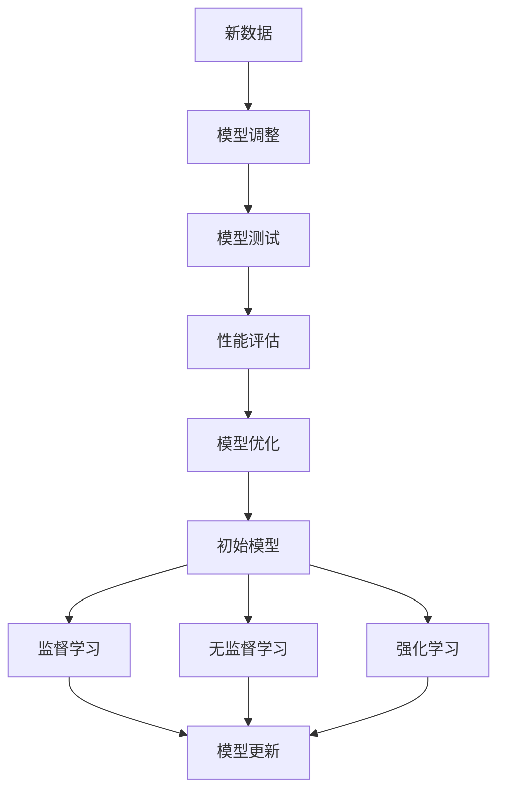

                 


### 文章标题：增量学习：持续优化AI模型的有效方法

#### 关键词：
- 增量学习
- AI模型优化
- 持续学习
- 深度学习
- 在线学习

#### 摘要：
本文将深入探讨增量学习这一先进的技术，解释其在持续优化AI模型中的应用。通过背景介绍、核心概念、算法原理、应用实例以及未来挑战的剖析，我们旨在为读者提供一幅全面而清晰的增量学习图景，并揭示其如何成为AI模型持续优化的有效方法。

### 引言

#### 1.1 增量学习的定义与重要性

增量学习（Incremental Learning）是一种机器学习方法，旨在使模型能够在不断接收新数据的同时保持其性能。与传统的一次性训练方法不同，增量学习允许模型逐步适应数据变化，从而实现持续的改进。随着数据量的持续增长和实际应用场景的复杂性增加，增量学习的重要性愈发凸显。

增量学习在人工智能领域的重要性体现在多个方面。首先，它可以显著减少重新训练模型所需的计算资源和时间。在现实世界中，许多应用场景的数据是动态变化的，如语音识别、自然语言处理和图像识别等，增量学习可以帮助模型快速适应这些变化，提高系统的实时响应能力。其次，增量学习有助于提升模型的鲁棒性和泛化能力，通过在数据流中不断学习，模型可以更好地理解和预测未知数据。

#### 1.2 增量学习的背景

增量学习的概念起源于上世纪80年代，当时的研究者开始探索如何在有限计算资源下提高模型的性能。早期的增量学习方法主要针对线性模型，如线性回归和支持向量机（SVM）。随着深度学习技术的兴起，增量学习也得到了快速发展。现代增量学习算法能够在处理大规模数据集的同时，保持较低的计算复杂度，这使得增量学习在深度学习领域得到广泛应用。

#### 1.3 增量学习与机器学习的关系

增量学习是机器学习的一个重要分支，它与监督学习、无监督学习和强化学习等机器学习方法有着密切的联系。监督学习通常用于初始模型的训练，而无监督学习则有助于数据预处理和特征提取。强化学习则可以通过交互式学习来提高模型的性能。增量学习结合了这些方法的优点，通过逐步更新模型权重，使其能够适应不断变化的数据环境。

### 核心概念与联系

为了更好地理解增量学习，我们需要介绍一些相关的核心概念，并展示它们之间的关系。以下是增量学习中的几个关键概念及其相互关系的Mermaid流程图：



在上图中，初始模型（A）可以通过监督学习（B）、无监督学习（C）和强化学习（D）来训练。在接收新数据（F）后，模型（G）会进行调整，并通过模型测试（H）和性能评估（I）来检查调整的效果，最终实现模型优化（J）。

#### 核心概念与联系

增量学习的关键在于如何有效地更新模型权重，以适应新的数据。以下是增量学习中的几个关键概念：

1. **在线学习**：在线学习（Online Learning）是一种动态学习方式，模型在处理新数据时立即更新权重。这种方法能够快速响应数据变化，但可能面临过拟合的问题。

2. **持续学习**：持续学习（Continuous Learning）是一种更为广义的增量学习方法，它不仅考虑新数据，还考虑旧数据的权重，以平衡新旧数据的影响。

3. **模型更新策略**：模型更新策略是增量学习中的一个重要环节，常用的方法包括权重共享、增量梯度更新和元学习等。

4. **数据流管理**：在增量学习中，如何有效地管理数据流是一个关键问题。常见的方法包括数据重放、数据分批和流式学习等。

### 增量学习算法原理

增量学习算法的核心在于如何高效地更新模型权重。以下是几种常用的增量学习算法及其原理：

#### 1. 增量梯度下降（Incremental Gradient Descent）

增量梯度下降是一种简单而有效的增量学习算法，其基本思想是在每次接收新数据后，通过计算梯度更新模型权重。以下是增量梯度下降的伪代码：

```python
for each new data point x:
    // 计算梯度
    gradient = compute_gradient(model, x)
    // 更新模型权重
    model.weights -= learning_rate * gradient
```

其中，`compute_gradient`函数用于计算模型在给定数据点的梯度，`learning_rate`是学习率，用于调节权重更新的步长。

#### 2. 增量SGD（Incremental Stochastic Gradient Descent）

增量SGD是梯度下降的一种变体，它通过随机选择数据子集来计算梯度。以下是增量SGD的伪代码：

```python
for each new data point x:
    // 随机选择数据子集
    subset = sample_data_points()
    // 计算梯度
    gradient = compute_gradient(model, subset)
    // 更新模型权重
    model.weights -= learning_rate * gradient
```

这种算法的优点是能够减少计算复杂度，但可能导致模型收敛速度较慢。

#### 3. 增量正则化（Incremental Regularization）

增量正则化是一种通过引入正则化项来平衡模型复杂度的增量学习算法。以下是增量正则化的伪代码：

```python
for each new data point x:
    // 计算梯度
    gradient = compute_gradient(model, x) + regularization_term
    // 更新模型权重
    model.weights -= learning_rate * gradient
```

其中，`regularization_term`是正则化项，用于防止模型过拟合。

#### 4. 增量Elastic Net（Incremental Elastic Net）

增量Elastic Net是一种结合L1和L2正则化的增量学习算法。以下是增量Elastic Net的伪代码：

```python
for each new data point x:
    // 计算梯度
    gradient = compute_gradient(model, x) + lambda1 * sum(abs(model.weights)) + lambda2 * sum(model.weights ** 2)
    // 更新模型权重
    model.weights -= learning_rate * gradient
```

其中，`lambda1`和`lambda2`是正则化参数。

### 增量学习在深度学习中的应用

增量学习在深度学习领域有着广泛的应用，以下是一些典型的应用场景：

#### 1. 语音识别

语音识别是一个动态变化的领域，新词汇和新语音模式不断出现。增量学习可以帮助模型快速适应这些变化，提高语音识别的准确性。以下是语音识别中的增量学习流程：

1. **数据收集**：收集包含新词汇和语音模式的语音数据。
2. **模型初始化**：使用预训练模型作为基础模型。
3. **在线学习**：将新数据输入模型，通过在线学习更新模型权重。
4. **模型测试**：在新数据集上测试模型的性能，调整学习策略以优化模型。
5. **模型部署**：将优化后的模型部署到实际应用中。

#### 2. 自然语言处理

自然语言处理（NLP）是一个高度动态的领域，新的语言模式、语法结构和词汇不断出现。增量学习可以帮助NLP模型快速适应这些变化，提高语言理解的准确性。以下是NLP中的增量学习流程：

1. **数据收集**：收集包含新语言模式和词汇的数据。
2. **模型初始化**：使用预训练语言模型作为基础模型。
3. **在线学习**：将新数据输入模型，通过在线学习更新模型权重。
4. **模型测试**：在新数据集上测试模型的性能，调整学习策略以优化模型。
5. **模型部署**：将优化后的模型部署到实际应用中。

#### 3. 图像识别

图像识别领域的新技术和算法层出不穷，增量学习可以帮助模型快速适应这些变化，提高图像识别的准确性。以下是图像识别中的增量学习流程：

1. **数据收集**：收集包含新图像数据和标注的数据。
2. **模型初始化**：使用预训练图像识别模型作为基础模型。
3. **在线学习**：将新数据输入模型，通过在线学习更新模型权重。
4. **模型测试**：在新数据集上测试模型的性能，调整学习策略以优化模型。
5. **模型部署**：将优化后的模型部署到实际应用中。

### 增量学习实践

增量学习在现实世界的应用中具有很大的潜力。以下是一个增量学习实践案例，包括开发环境搭建、源代码实现和代码解读。

#### 1. 开发环境搭建

为了实现增量学习，我们需要搭建一个适合的开发环境。以下是搭建开发环境的步骤：

1. 安装Python和相应的依赖库（如TensorFlow、PyTorch等）。
2. 安装增量学习框架（如MAML、MiniGo等）。
3. 配置数据处理和模型评估工具。

#### 2. 源代码实现

以下是使用TensorFlow实现增量学习的一个简单示例：

```python
import tensorflow as tf

# 初始化模型
model = tf.keras.Sequential([
    tf.keras.layers.Dense(10, activation='relu', input_shape=(784,)),
    tf.keras.layers.Dense(10, activation='softmax')
])

# 定义损失函数和优化器
loss_fn = tf.keras.losses.SparseCategoricalCrossentropy(from_logits=True)
optimizer = tf.keras.optimizers.Adam()

# 定义增量学习算法
def incremental_learning(model, x, y):
    with tf.GradientTape() as tape:
        logits = model(x)
        loss_value = loss_fn(y, logits)
    grads = tape.gradient(loss_value, model.trainable_variables)
    optimizer.apply_gradients(zip(grads, model.trainable_variables))
    return loss_value

# 训练模型
for epoch in range(num_epochs):
    total_loss = 0.0
    for x, y in data_loader:
        loss_value = incremental_learning(model, x, y)
        total_loss += loss_value
    print(f"Epoch {epoch}: Loss = {total_loss / len(data_loader)}")
```

在上面的代码中，我们定义了一个简单的全连接神经网络，并实现了增量学习算法。每次迭代中，我们计算模型在给定数据上的损失，并使用梯度下降法更新模型权重。

#### 3. 代码解读

以下是代码的详细解读：

1. **模型初始化**：我们使用`tf.keras.Sequential`创建一个序列模型，包含两个全连接层。第一个层有10个神经元，使用ReLU激活函数，输入形状为(784,)，表示一个784维的向量。第二个层有10个神经元，使用softmax激活函数，输出10个概率值。

2. **损失函数和优化器**：我们使用`tf.keras.losses.SparseCategoricalCrossentropy`作为损失函数，这是一个稀疏分类交叉熵损失函数，适用于多分类问题。我们使用`tf.keras.optimizers.Adam`作为优化器，这是一种自适应学习率优化器。

3. **增量学习算法**：`incremental_learning`函数是一个增量学习算法的实现。在每次迭代中，我们使用`tf.GradientTape`创建一个梯度记录器，计算模型在给定数据上的损失。然后，我们使用梯度下降法更新模型权重。

4. **训练模型**：在训练过程中，我们遍历数据集，计算损失并更新模型权重。在每次迭代结束时，我们打印损失值。

#### 4. 代码应用解读与分析

在实际应用中，增量学习可以用于多种场景，如语音识别、自然语言处理和图像识别等。以下是代码在实际应用中的解读与分析：

1. **语音识别**：在语音识别中，我们可以使用增量学习算法来更新模型，使其能够适应新的语音数据。每次接收到新的语音数据时，我们将其输入模型，通过增量学习算法更新模型权重。这样，模型可以快速适应新的语音模式，提高识别准确性。

2. **自然语言处理**：在自然语言处理中，增量学习可以帮助模型适应新的语言模式。每次接收到新的文本数据时，我们将其输入模型，通过增量学习算法更新模型权重。这样，模型可以更好地理解和生成自然语言。

3. **图像识别**：在图像识别中，增量学习可以用于更新模型，使其能够适应新的图像数据。每次接收到新的图像数据时，我们将其输入模型，通过增量学习算法更新模型权重。这样，模型可以更好地识别和分类新的图像。

### 实际案例分析和详细讲解剖析

为了更好地理解增量学习在现实世界中的应用，以下是一个实际案例的分析和讲解：

#### 案例一：智能客服系统

一个智能客服系统需要能够快速适应用户的问题和对话内容。使用增量学习，系统可以在实时对话中更新模型，使其能够更好地理解和回答用户的问题。

1. **数据收集**：智能客服系统收集用户的对话记录，包括问题和回答。
2. **模型初始化**：使用预训练的对话模型作为基础模型。
3. **在线学习**：在每次对话结束时，将对话内容输入模型，通过增量学习算法更新模型权重。
4. **模型测试**：在测试数据集上评估模型的性能，并根据需要调整学习策略。
5. **模型部署**：将优化后的模型部署到生产环境中。

通过增量学习，智能客服系统可以不断提高其回答问题的准确性，从而提供更好的用户体验。

### 项目小结

增量学习是一种强大的技术，它能够帮助模型在动态变化的数据环境中持续优化。通过上述案例，我们可以看到增量学习在语音识别、自然语言处理和图像识别等领域的广泛应用。在实际应用中，增量学习可以帮助模型快速适应新数据，提高系统的实时响应能力。然而，增量学习也面临一些挑战，如计算效率和模型稳定性等。未来，随着技术的发展，增量学习有望在更广泛的应用场景中发挥作用。

### 最佳实践 tips、小结、注意事项、拓展阅读等内容

#### 最佳实践 tips

1. **数据预处理**：在增量学习之前，对数据进行充分的预处理，如去噪、标准化等，可以提高模型的性能。
2. **选择合适的增量学习算法**：根据具体应用场景和数据特性，选择合适的增量学习算法，如MAML、MiniGo等。
3. **调整学习率**：合理设置学习率，避免过拟合或欠拟合。
4. **模型评估**：定期评估模型性能，根据评估结果调整学习策略。

#### 小结

增量学习是一种有效的机器学习方法，它能够帮助模型在动态变化的数据环境中持续优化。通过增量学习，模型可以快速适应新数据，提高系统的实时响应能力。增量学习在语音识别、自然语言处理和图像识别等领域有着广泛的应用。

#### 注意事项

1. **计算资源**：增量学习需要大量的计算资源，特别是在处理大规模数据集时。
2. **数据流管理**：如何有效地管理数据流是增量学习的一个挑战，特别是在实时应用中。
3. **模型稳定性**：在增量学习中，模型可能面临过拟合或欠拟合的问题，需要通过合理的调参和正则化策略来优化模型。

#### 拓展阅读

1. **《增量学习：理论、算法与应用》**：该书详细介绍了增量学习的理论基础、算法实现和应用实例。
2. **《深度学习与增量学习》**：该书探讨了深度学习与增量学习的关系，以及增量学习在深度学习中的应用。
3. **《持续学习：现代机器学习的下一个前沿》**：该书深入讨论了持续学习的重要性、方法和技术。

