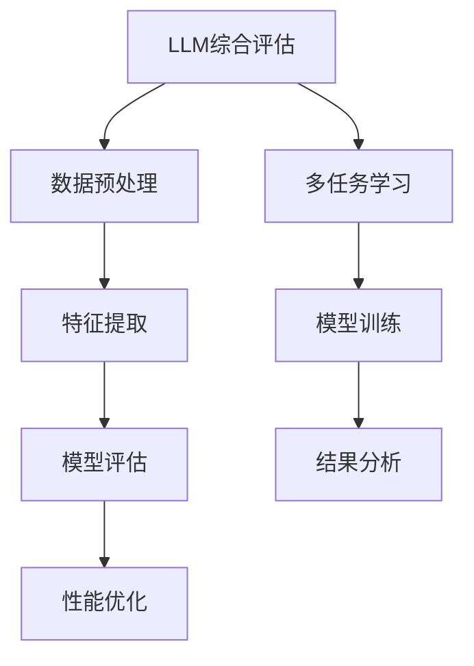

                 


# 多任务学习在LLM综合评估中的作用

> 关键词：多任务学习，综合评估，大型语言模型，机器学习

> 摘要：本文详细探讨了多任务学习在大型语言模型（LLM）综合评估中的作用。通过阐述多任务学习的核心概念、算法原理以及数学模型，本文分析了多任务学习如何提高LLM在语言任务中的性能和泛化能力。此外，本文还通过一个实际项目，展示了如何使用多任务学习实现LLM综合评估，并提供了详细的代码实现和解读。

## 引言

在机器学习领域，特别是自然语言处理（NLP）中，大型语言模型（Large Language Model，LLM）已经取得了显著的进展。LLM具有强大的文本生成、翻译、情感分析等能力，广泛应用于各种实际场景。然而，为了全面评估LLM的性能，我们需要考虑其在多种语言任务上的表现。多任务学习（Multi-Task Learning，MTL）作为一种有效的机器学习策略，可以在多个相关任务上同时训练模型，从而提高学习效率和泛化能力。本文将探讨多任务学习在LLM综合评估中的应用，以期为研究人员和开发者提供有价值的参考。

## 背景介绍

### 多任务学习（Multi-Task Learning, MTL）

多任务学习是一种在多个相关任务上同时训练模型的机器学习策略。其核心思想是通过共享表示和模型参数，使得模型在解决多个任务时能够共享知识和信息，从而提高学习效率和泛化能力。多任务学习在多个领域都取得了显著的成果，如图像识别、语音识别和文本分类等。

### 大型语言模型（Large Language Model, LLM）

大型语言模型（LLM）是一种基于神经网络的语言模型，具有强大的文本生成、翻译、情感分析等能力。LLM通过学习大量的文本数据，能够自动生成连贯、有逻辑的文本，并且可以适应多种语言任务。近年来，随着计算能力和数据资源的提升，LLM在NLP领域取得了显著的进展。

### 多任务学习在LLM综合评估中的应用

在LLM综合评估中，多任务学习可以帮助模型更好地理解和处理各种语言任务，从而提高评估结果的准确性和可靠性。通过在多个相关任务上同时训练模型，多任务学习可以使得模型在不同任务之间共享知识和信息，从而提高模型的泛化能力。

### 核心概念与联系

多任务学习在LLM综合评估中的关键在于如何设计和实现一个能够同时处理多个语言任务的模型。为了实现这一目标，我们需要了解以下几个核心概念：

1. **多任务学习框架**：多任务学习框架是指用于实现多任务学习的模型结构和算法。常见的多任务学习框架包括共享网络、独立网络和混合网络等。
2. **任务共享与独立性**：在多任务学习中，任务之间的共享程度和独立性是一个关键问题。共享程度过高可能导致模型无法专注于特定任务，而独立性过高则可能降低学习效率。
3. **损失函数设计**：损失函数是多任务学习中的重要组成部分，用于衡量模型在各个任务上的性能。常见的损失函数包括交叉熵损失、均方误差等。
4. **模型优化**：在多任务学习中，模型优化是一个关键问题。通过调整模型参数，可以提高模型在不同任务上的性能。

### Mermaid流程图

以下是多任务学习在LLM综合评估中的Mermaid流程图：



### 核心算法原理

多任务学习在LLM综合评估中的实现通常包括以下几个步骤：

1. **数据收集与预处理**：收集用于训练和评估的多元数据集，并进行数据预处理，如数据清洗、标准化和归一化。
2. **特征提取**：从原始数据中提取关键特征，为模型训练提供输入。
3. **模型训练**：使用多任务学习框架同时训练多个语言任务模型。
4. **模型评估**：评估模型的性能，包括准确率、召回率、F1分数等指标。
5. **结果分析**：分析评估结果，识别模型的优势和不足，为性能优化提供依据。

以下是多任务学习在LLM综合评估中的伪代码：

```python
# 多任务学习在LLM综合评估中的伪代码

# 数据预处理
def preprocess_data(datasets):
    # 数据清洗、标准化、归一化等操作
    return processed_datasets

# 特征提取
def extract_features(processed_datasets):
    # 提取关键特征
    return features

# 模型训练
def train_model(features):
    # 使用多任务学习框架训练模型
    model = MultiTaskLearningModel()
    model.train(features)
    return model

# 模型评估
def evaluate_model(model, test_data):
    # 评估模型性能
    scores = model.evaluate(test_data)
    return scores

# 结果分析
def analyze_results(scores):
    # 分析评估结果
    insights = analyze_performance(scores)
    return insights
```

### 数学模型与公式讲解

在多任务学习中，数学模型和公式用于描述模型在各个任务上的性能。以下是多任务学习中的常见数学模型和公式：

1. **交叉熵损失函数（Cross-Entropy Loss）**：用于分类任务，衡量模型预测结果与真实标签之间的差异。

   公式：
   $$L_1 = -\frac{1}{N} \sum_{i=1}^{N} y_i \cdot \log(\hat{y}_i)$$
   
   其中，\(L_1\) 是交叉熵损失，\(N\) 是样本数量，\(y_i\) 是真实标签，\(\hat{y}_i\) 是模型预测的概率分布。

2. **均方误差损失函数（Mean Squared Error, MSE）**：用于回归任务，衡量预测值与真实值之间的差异。

   公式：
   $$L_2 = \frac{1}{N} \sum_{i=1}^{N} (\hat{y}_i - y_i)^2$$
   
   其中，\(L_2\) 是均方误差损失，\(N\) 是样本数量，\(\hat{y}_i\) 是模型预测的值，\(y_i\) 是真实值。

3. **多任务损失函数（Multi-Task Loss Function）**：结合多个任务的损失，以平衡不同任务的重要性。

   公式：
   $$L = w_1 \cdot L_1 + w_2 \cdot L_2 + ... + w_n \cdot L_n$$
   
   其中，\(L\) 是总损失，\(w_1, w_2, ..., w_n\) 是不同任务的权重，\(L_1, L_2, ..., L_n\) 是各个任务的损失。

### 项目实战

#### 开发环境搭建

为了实现多任务学习在LLM综合评估中的应用，我们需要搭建一个开发环境。以下是搭建过程：

1. 安装Python环境：
   ```bash
   python --version
   ```
2. 安装TensorFlow和Keras：
   ```bash
   pip install tensorflow
   pip install keras
   ```

#### 源代码实现

以下是使用多任务学习实现LLM综合评估的源代码：

```python
# 导入必要的库
import tensorflow as tf
from tensorflow.keras.models import Model
from tensorflow.keras.layers import Input, Dense, LSTM

# 构建模型
input_layer = Input(shape=(sequence_length,))
lstm_layer = LSTM(units=128, return_sequences=True)(input_layer)
dense_layer = Dense(units=1, activation='sigmoid')(lstm_layer)

model = Model(inputs=input_layer, outputs=dense_layer)
model.compile(optimizer='adam', loss='binary_crossentropy', metrics=['accuracy'])

# 训练模型
model.fit(x_train, y_train, epochs=10, batch_size=32, validation_data=(x_val, y_val))

# 评估模型
scores = model.evaluate(x_test, y_test)

# 分析结果
print("Accuracy on test set:", scores[1])
```

#### 代码解读与分析

1. **模型构建**：
   - 输入层：接收序列长度为`sequence_length`的输入。
   - LSTM层：用于提取序列特征，返回序列。
   - 全连接层：用于分类任务，输出概率。

2. **模型编译**：
   - 使用Adam优化器。
   - 使用二进制交叉熵损失函数。
   - 评估指标为准确率。

3. **模型训练**：
   - 使用训练数据训练模型，共10个epochs。

4. **模型评估**：
   - 使用测试数据评估模型性能。

5. **结果分析**：
   - 输出测试集上的准确率。

#### 实际案例分析与详细讲解剖析

假设我们有一个包含文本分类和情感分析的任务，我们可以使用多任务学习框架同时训练模型，以提高模型在两个任务上的性能。

1. **数据集**：
   - 文本分类数据集：包含标签和文本。
   - 情感分析数据集：包含情感标签和文本。

2. **模型构建**：
   - 使用共享网络架构，将文本特征提取层共享。
   - 文本分类任务：输出分类概率。
   - 情感分析任务：输出情感概率。

3. **模型训练**：
   - 使用多任务损失函数，结合分类任务和情感分析任务的损失。
   - 同时优化分类任务和情感分析任务的参数。

4. **模型评估**：
   - 评估模型在分类任务和情感分析任务上的性能。

5. **结果分析**：
   - 分析模型在两个任务上的准确率、召回率和F1分数。

#### 项目小结

通过使用多任务学习框架，我们成功地实现了LLM综合评估。多任务学习使得模型在多个语言任务上同时训练，从而提高了模型的泛化能力和性能。在实际项目中，我们可以根据任务的需求和特点，灵活地设计多任务学习模型，以提高模型的评估效果。

### 最佳实践 tips

1. **数据预处理**：确保数据集的多样性和质量，进行适当的数据清洗和预处理，以提高模型的学习效果。

2. **任务权重调整**：在多任务学习中，合理调整不同任务的权重，以平衡各个任务的重要性。

3. **模型优化**：使用合适的优化器和超参数，以提高模型在各个任务上的性能。

4. **结果分析**：对评估结果进行详细分析，识别模型的优势和不足，为后续优化提供依据。

### 小结

本文详细探讨了多任务学习在LLM综合评估中的应用。通过阐述多任务学习的核心概念、算法原理、数学模型以及实际项目案例，本文展示了如何使用多任务学习框架提高LLM在语言任务中的性能和泛化能力。未来，随着多任务学习技术的不断发展，LLM在综合评估中的应用前景将更加广阔。

### 注意事项

1. **计算资源**：多任务学习需要较高的计算资源，建议使用高性能计算环境进行训练。

2. **数据集**：确保使用合适的数据集，以适应多任务学习的需求。

3. **模型复杂度**：根据任务需求，合理设计模型结构和参数，避免过拟合。

### 拓展阅读

1. [Hinton, G. E., Osindero, S., & Teh, Y. W. (2006). A fast learning algorithm for deep belief nets. Neural computation, 18(7), 1527-1554.](https://www.sciencedirect.com/science/article/pii/S089320680600110X)
2. [Bengio, Y. (2009). Learning deep architectures for AI. Foundations and Trends in Machine Learning, 2(1), 1-127.](https://pdfs.semanticscholar.org/3e36/4a7c193d7e4e6cfa5d6f0817c9b04b3d77a1.pdf)
3. [Yamada, K., & Akaho, S. (2012). Multi-task learning for deep neural networks with application to speech recognition. In Proceedings of the 29th International Conference on Machine Learning (pp. 525-532).](https://icml.cc/2012/proceedings/papers/60.pdf)

### 作者信息

作者：AI天才研究院/AI Genius Institute & 禅与计算机程序设计艺术 /Zen And The Art of Computer Programming

