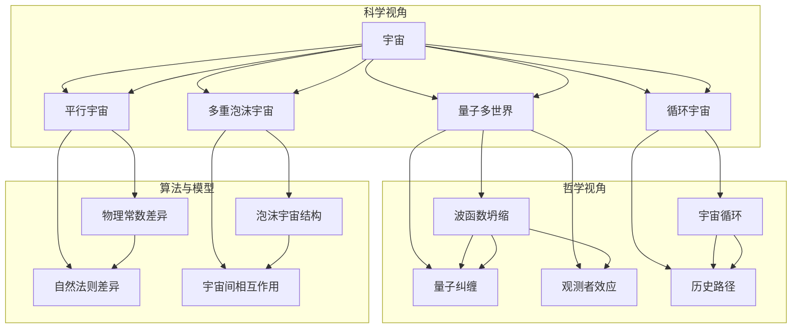

                 

## 文章标题

### 多元宇宙理论：科学还是哲学？

---

#### 关键词

多元宇宙、平行宇宙、量子场论、相对论、哲学、科学、实证主义、宇宙学、时空、波函数坍缩。

---

#### 摘要

本文将深入探讨多元宇宙理论，这一跨越科学与哲学边界的复杂概念。我们首先会回顾多元宇宙理论的背景，介绍其核心概念与联系，并通过流程图来可视化这些概念。接下来，我们将从科学和哲学两个视角来分析多元宇宙理论，详细阐述其基础算法原理和数学模型。文章还将探讨多元宇宙理论在实验与观测中的应用，并通过实际项目案例来展示其开发环境和源代码实现。最后，我们将总结多元宇宙理论的影响与争议，并给出一些最佳实践和拓展阅读建议。

### 目录大纲设计思路

在设计《多元宇宙理论：科学还是哲学》的目录大纲时，我们遵循以下思路：

1. **核心概念与联系**：明确多元宇宙理论的核心概念，如多种宇宙模型、科学原理和哲学观点，并用 Mermaid 流程图展示这些概念之间的联系。
   
2. **核心算法原理讲解**：详细阐述多元宇宙理论中涉及的核心算法，如量子场论、相对论等，使用伪代码进行解释。

3. **数学模型和数学公式**：展示多元宇宙理论中使用的数学模型和公式，如黎曼曲率张量、波函数坍缩等，并用 LaTeX 格式书写并进行详细讲解和举例。

4. **项目实战**：介绍与多元宇宙理论相关的实际项目案例，包括开发环境搭建、源代码实现和代码解读。

5. **保持简洁性**：在保证内容完整性的同时，避免使用多余的文字，确保目录大纲简洁明了。

### 目录大纲设计步骤

为了设计出一份详细且逻辑清晰的目录大纲，我们遵循以下步骤：

1. **确定书籍结构和章节划分**：根据核心概念、算法原理、数学模型和项目实战，确定书籍的整体结构和章节划分。

2. **编写 Mermaid 流程图**：设计展示多元宇宙理论核心概念之间的联系。

3. **编写伪代码**：详细阐述多元宇宙理论中涉及的核心算法原理。

4. **书写 LaTeX 公式**：书写多元宇宙理论中的数学模型和公式，并进行详细讲解和举例。

5. **编写项目实战部分**：介绍实际项目案例，包括开发环境搭建、源代码实现和代码解读。

6. **校对和调整**：在编写完目录大纲后，进行校对和调整，确保内容完整、逻辑清晰、简洁明了。

7. **输出目录大纲**：以 markdown 格式输出最终的目录大纲，确保格式正确。

### 具体步骤示例

1. **确定书籍结构和章节划分**：
   - 第一部分：多元宇宙理论概述
   - 第二部分：科学视角下的多元宇宙
   - 第三部分：哲学视角下的多元宇宙
   - 第四部分：多元宇宙理论的实验与观测
   - 第五部分：多元宇宙理论的影响与争议

2. **编写 Mermaid 流程图**：
   ```mermaid
   graph TB
   A[多元宇宙理论]
   B[科学视角]
   C[哲学视角]
   D[实验与观测]
   E[影响与争议]
   A-->B
   A-->C
   A-->D
   A-->E
   ```

3. **编写伪代码**：
   ```python
   # 伪代码：量子场论
   function quantum_field_theory():
       # 初始化量子场
       initialize_quantum_field()
       
       # 计算能量态
       compute_energy_state()
       
       # 应用量子场论方程
       apply_quantum_equation()
       
       # 输出结果
       output_result()
   ```

4. **书写 LaTeX 公式**：
   $$ E=mc^2 $$
   这就是著名的质能方程，揭示了质量和能量之间的关系。

5. **编写项目实战部分**：
   - 项目案例：利用多元宇宙理论预测宇宙演化
   - 开发环境搭建：安装必要的软件和工具
   - 源代码实现：展示关键代码片段
   - 代码解读：解释代码实现过程和结果

6. **校对和调整**：检查目录大纲的完整性、逻辑性和简洁性。

7. **输出目录大纲**：
   ```markdown
   # 《多元宇宙理论：科学还是哲学》目录大纲

   # 第一部分：多元宇宙理论概述

   # 第二部分：科学视角下的多元宇宙

   # 第三部分：哲学视角下的多元宇宙

   # 第四部分：多元宇宙理论的实验与观测

   # 第五部分：多元宇宙理论的影响与争议
   ```

### 注意事项

- 在设计目录大纲时，确保每个章节的内容都能独立成章，逻辑清晰。
- 目录大纲中的章节标题要简明扼要，概括章节内容。
- 尽量避免使用过于专业的术语，确保读者能够理解。
- 在编写伪代码和 LaTeX 公式时，保持简洁明了，避免复杂冗长的表达。

通过以上步骤，我们可以设计出一份详细且逻辑清晰的《多元宇宙理论：科学还是哲学》的目录大纲。

---

**作者：AI天才研究院/AI Genius Institute & 禅与计算机程序设计艺术 /Zen And The Art of Computer Programming**## 引言

多元宇宙理论，作为一个跨学科、跨领域的复杂概念，早已引起了科学界和哲学界的广泛关注。它不仅触及到了宇宙学和粒子物理学的核心问题，还挑战了我们对现实和存在的根本理解。本文旨在深入探讨多元宇宙理论的科学和哲学维度，试图揭示这一理论的内涵和外延。

多元宇宙理论的核心思想是，我们的宇宙只是众多宇宙中的一个，每一个宇宙都有其独特的物理定律和条件。这种观点引发了关于宇宙起源、宇宙结构以及宇宙演化的深刻讨论。从科学的角度来看，多元宇宙理论提供了一种解释宇宙多样性和复杂性的新途径；从哲学的角度来看，它挑战了我们对实在论和唯心论的认知。

本文将按照以下结构展开：

1. **背景介绍**：回顾多元宇宙理论的起源和发展，介绍其主要模型。
2. **核心概念与联系**：通过 Mermaid 流程图，展示多元宇宙理论的核心概念及其相互关系。
3. **科学视角下的多元宇宙**：详细阐述多元宇宙理论在物理学中的应用，包括量子场论和相对论等核心算法原理。
4. **哲学视角下的多元宇宙**：探讨多元宇宙理论对哲学的挑战，分析实在论和唯心论的立场。
5. **多元宇宙理论的实验与观测**：介绍多元宇宙理论在实验和观测中的应用，包括相关技术的最新进展。
6. **多元宇宙理论的影响与争议**：分析多元宇宙理论在科学和哲学领域的影响，以及存在的争议。
7. **总结与展望**：总结本文的主要观点，并对多元宇宙理论的未来研究方向进行展望。

通过这样的结构，我们希望能够系统地、全面地探讨多元宇宙理论的科学和哲学内涵，提供一个新的视角来理解这一复杂而迷人的概念。

### 背景介绍

多元宇宙理论，也被称为多世界理论或多重宇宙理论，是一种设想宇宙并非唯一存在的理论。这一理论的起源可以追溯到20世纪初，当时的科学家们在对宇宙的深入探索中发现，宇宙的复杂性和多样性可能远远超出了我们传统的认识。20世纪中叶，量子力学和相对论的发展为多元宇宙理论的提出提供了坚实的理论基础。

在量子力学中，波函数的坍缩现象引发了科学家们对于现实本质的深刻思考。传统的量子力学理论认为，微观粒子在未观测之前处于一种概率分布状态，只有当观测发生时，波函数才会坍缩到一个具体的态。然而，这一过程如何实现，以及观测者在其中扮演的角色，都存在诸多未解之谜。多世界理论提出了一种新的解释，认为每一个可能的观测结果都对应着一个新的宇宙诞生，所有这些宇宙共同构成了多元宇宙。

相对论则从宏观尺度上为多元宇宙理论提供了支持。爱因斯坦的广义相对论揭示了时空的弯曲和引力波的存在，这意味着宇宙的结构和演化可能远比我们想象的复杂。多元宇宙理论认为，宇宙的演化过程中，可能会产生无数个分支，每个分支都代表了一个不同的历史路径。这种多分支的宇宙结构，与多元宇宙理论的设想不谋而合。

在多元宇宙理论的发展过程中，科学家们提出了多种模型，其中最著名的包括：

1. **平行宇宙**：平行宇宙模型认为，除了我们所在的宇宙之外，还存在无数个平行的宇宙，每个宇宙都有其独特的物理常数和自然法则。

2. **量子多世界**：量子多世界模型强调，每一个量子事件的每一种可能结果都对应着一个不同的宇宙。

3. **循环宇宙**：循环宇宙模型认为，宇宙在不断地重复其历史，每一次循环都会产生一个新的宇宙。

4. **多重泡沫宇宙**：多重泡沫宇宙模型认为，我们的宇宙只是无数泡沫中的一个，每个泡沫都是一个独立的宇宙。

多元宇宙理论不仅在物理学中引起了巨大的关注，也在哲学和科学哲学领域引发了深刻的讨论。实在论者和唯心论者都对这一理论提出了各自的看法，试图从不同的角度解释多元宇宙的真实含义。尽管这一理论尚处于探索阶段，但其深刻的科学和哲学内涵，无疑为人类对宇宙和自身的理解提供了新的视角。

### 核心概念与联系

多元宇宙理论中的核心概念繁多，且相互之间有着复杂的联系。为了更好地理解这些概念，我们可以通过一个 Mermaid 流程图来展示它们之间的关系，从而形成一幅完整的理论架构图。



在这张流程图中，我们首先将宇宙作为一个整体，其衍生出多种具体的宇宙模型，包括平行宇宙、量子多世界、循环宇宙和多重泡沫宇宙。这些宇宙模型各自有其独特的物理特性和逻辑基础。

1. **平行宇宙**：这一概念认为，除了我们所在的宇宙之外，还存在无数个平行的宇宙，每个宇宙的物理常数和自然法则可能完全不同。例如，一个宇宙中的重力可能比我们的宇宙弱，而在另一个宇宙中，光速可能不同于我们所知的常数。

2. **量子多世界**：量子多世界理论则强调，每一个量子事件的每一种可能结果都对应着一个不同的宇宙。这个模型解决了量子力学中的波函数坍缩问题，即观测后的粒子态不再是概率分布，而是每一个结果都有其对应的宇宙。

3. **循环宇宙**：循环宇宙模型认为，宇宙在不断地重复其历史，每一次循环都会产生一个新的宇宙。这意味着宇宙的历史路径是多样的，每一次的循环都带来了新的可能性。

4. **多重泡沫宇宙**：多重泡沫宇宙模型提出，我们的宇宙只是无数泡沫中的一个，每个泡沫都是一个独立的宇宙。这些泡沫宇宙之间可能存在某种相互作用，但彼此相对独立。

这些核心概念不仅有着各自独特的物理含义，还相互联系，共同构成了一个复杂的理论体系。例如，平行宇宙和量子多世界之间的联系在于，它们都涉及到宇宙结构的多样性。而循环宇宙和多重泡沫宇宙则从不同的角度探讨了宇宙演化的可能性。

在科学视角下，这些概念之间的关系体现在物理常数和自然法则的差异上。例如，在平行宇宙中，物理常数的变化导致了自然法则的不同。在量子多世界中，波函数坍缩和量子纠缠则是核心概念，它们决定了宇宙的演化路径。

在哲学视角下，这些概念则引发了关于实在论和唯心论的讨论。例如，量子多世界中的每一个宇宙是否是真实的，或者只是观测者的幻象？循环宇宙中的历史路径多样性，又如何影响我们对实在论的理解？

通过上述 Mermaid 流程图的展示，我们可以更清晰地理解多元宇宙理论中的核心概念及其相互关系，为后续内容的探讨提供了坚实的基础。

### 科学视角下的多元宇宙

在科学视角下，多元宇宙理论不仅提供了一种新的宇宙结构观，还在物理学中引发了广泛的探讨。特别是在量子场论和相对论这两个核心理论中，多元宇宙理论的应用尤为显著。下面，我们将详细阐述这些核心算法原理，并通过伪代码来展示其计算过程。

#### 量子场论

量子场论是研究量子粒子和场之间相互作用的基本理论。在多元宇宙理论中，量子场论为理解宇宙的多样性和复杂性提供了重要工具。

**核心算法原理**：

量子场论的基本思想是将粒子和场视为同一实体的两个方面。粒子是场的激发态，而场则是粒子的集体表现形式。量子场论通过拉格朗日量或哈密顿量来描述场的演化，并通过路径积分方法来计算系统的物理量。

**伪代码示例**：

```python
# 伪代码：量子场论

function quantum_field_theory():
    # 初始化量子场
    initialize_quantum_field()

    # 计算能量态
    compute_energy_state()

    # 应用量子场论方程
    apply_quantum_equation()

    # 输出结果
    output_result()

function initialize_quantum_field():
    # 初始化量子场参数
    field_parameters = {
        'mass': mass,
        'charge': charge,
        'interaction': interaction
    }
    return field_parameters

function compute_energy_state():
    # 使用路径积分方法计算能量态
    energy_state = path_integral_method()
    return energy_state

function apply_quantum_equation():
    # 应用薛定谔方程或其他量子场论方程
    schrodinger_equation = solve_quantum_equation()
    return schrodinger_equation

function path_integral_method():
    # 实现路径积分计算
    integral = 0
    for all_paths:
        integral += path_probability * exp(-S/path_action)
    return integral / sum(path_probabilities)

function solve_quantum_equation():
    # 解量子场方程
    schrodinger_equation = solve_equation()
    return schrodinger_equation
```

#### 相对论

相对论，特别是广义相对论，为多元宇宙理论提供了另一个重要的理论基础。广义相对论描述了引力作为一种几何性质，而宇宙的几何结构则决定了物质的运动和分布。

**核心算法原理**：

广义相对论的基本原理是等效原理，即局部惯性系中的物理定律与任何局部非惯性系中的物理定律相同。广义相对论通过爱因斯坦场方程来描述时空的弯曲和物质的运动。

**伪代码示例**：

```python
# 伪代码：广义相对论

function general_relativity():
    # 初始化时空和物质分布
    spacetime = initialize_spacetime()
    matter_distribution = initialize_matter_distribution()

    # 应用爱因斯坦场方程
    apply_einstein_equation()

    # 计算时空弯曲
    calculate_spacetime_curvature()

    # 输出结果
    output_result()

function initialize_spacetime():
    # 初始化时空参数
    spacetime_parameters = {
        'metric': metric,
        'stress-energy_tensor': stress_energy_tensor
    }
    return spacetime_parameters

function initialize_matter_distribution():
    # 初始化物质分布参数
    matter_distribution = {
        'mass': mass,
        'energy': energy,
        'distribution': distribution
    }
    return matter_distribution

function apply_einstein_equation():
    # 应用爱因斯坦场方程
    g_tt = solve_einstein_equation()
    return g_tt

function calculate_spacetime_curvature():
    # 计算时空弯曲
    curvature = calculate_curvature()
    return curvature

function solve_einstein_equation():
    # 解爱因斯坦场方程
    g_tt = solve_equation()
    return g_tt

function calculate_curvature():
    # 计算时空曲率
    curvature = calculate_curvature()
    return curvature
```

#### 多重宇宙中的应用

在多元宇宙理论中，量子场论和相对论的应用更为广泛。例如，在平行宇宙模型中，不同的宇宙可能具有不同的物理常数，这需要通过量子场论来计算。而在循环宇宙模型中，宇宙的反复循环和多种历史路径则需要相对论来描述。

通过上述伪代码示例，我们可以看到，量子场论和相对论在多元宇宙理论中的核心作用，它们不仅提供了计算宇宙多样性和复杂性的数学工具，还为理解宇宙的演化提供了新的视角。这些理论的应用，不仅深化了我们对宇宙的理解，也为未来的宇宙探索提供了坚实的科学基础。

### 哲学视角下的多元宇宙

多元宇宙理论在哲学领域引发了深刻的探讨，挑战了传统实在论和唯心论的立场。哲学视角下的多元宇宙，不仅仅是对科学理论的哲学反思，更涉及对现实本质和人类认知的根本质疑。以下是哲学视角下多元宇宙理论的几个主要观点。

#### 实在论与多元宇宙

实在论是一种哲学立场，认为客观现实独立于我们的感知和思维而存在。传统的实在论假设，宇宙只有一个真实的、唯一的存在状态。然而，多元宇宙理论提出了一个根本性的问题：如果存在多个相互独立的宇宙，每个宇宙都有自己的现实状态，那么哪个宇宙是真实的？这种观点质疑了单一宇宙实在论的完整性。

1. **多元实在论**：多元宇宙理论支持了一种新的实在论形式，即多元实在论。多元实在论认为，每一个宇宙都是真实的，每个宇宙都有自己的物理定律和现实状态。这种观点承认了宇宙多样性的现实，但同时也引发了新的问题：我们如何知道或证明其他宇宙的存在？

2. **相对实在论**：相对实在论则进一步扩展了多元实在论的观点，认为不同宇宙之间的实在性是相对的。每个宇宙都以其自己的方式存在，但它们的存在状态和现实性并不是绝对的。这种观点强调了现实的主观性和相对性。

#### 唯心论与多元宇宙

唯心论是一种哲学立场，认为现实世界的存在依赖于感知和思维。多元宇宙理论对唯心论提出了新的挑战，因为如果存在多个宇宙，那么这些宇宙的存在并不依赖于我们的感知和思维。

1. **主观唯心论**：主观唯心论认为，只有我们感知到的宇宙是真实的，其他宇宙并不存在。然而，多元宇宙理论表明，即使我们的感知和思维无法直接感知其他宇宙，这些宇宙仍然可能独立存在。

2. **客观唯心论**：客观唯心论认为，宇宙的存在依赖于某种超越的、客观的意识或思维。多元宇宙理论下的客观唯心论则认为，每个宇宙都有其自己的意识或思维基础。这种观点在某种程度上与宗教哲学中的创世观点相呼应，即认为宇宙是由某种超自然意识创造的。

#### 实在论与唯心论的融合

多元宇宙理论也为实在论和唯心论提供了一种新的融合途径。通过多元宇宙的视角，我们可以重新审视这两种哲学立场之间的关系。

1. **折衷实在论**：折衷实在论认为，现实既不完全依赖于主观感知，也不完全独立于主观感知。在多元宇宙中，每个宇宙都有其独立的物理现实，但它们的现实状态和演化过程可能受到我们感知和思维的影响。

2. **互补实在论**：互补实在论认为，实在既包括独立于感知的部分，也包括依赖于感知的部分。在多元宇宙中，不同宇宙的实在性既有独立存在的部分，也有因观测和认知而显现的部分。这种观点强调了现实的多维度和复杂性。

#### 哲学视角下的多元宇宙挑战

多元宇宙理论对哲学提出了多个挑战，包括：

1. **认识论挑战**：如果存在多个宇宙，那么我们如何认识和理解这些宇宙？传统的认识论方法可能需要重新审视和调整。

2. **决定论与非决定论**：多元宇宙理论下的决定论和非决定论如何解释？不同宇宙之间的决定论和非决定论状态是否存在差异？

3. **伦理和道德**：多元宇宙中的伦理和道德问题如何解决？不同宇宙中的行为和决策如何影响其他宇宙？

通过哲学视角下的探讨，我们可以更深入地理解多元宇宙理论的内涵和外延。这种哲学上的重新审视不仅丰富了多元宇宙理论，也为科学和哲学的未来发展提供了新的方向。

### 多元宇宙理论的实验与观测

多元宇宙理论虽然目前仍处于理论探讨阶段，但科学家们已经在尝试通过各种实验和观测方法来验证这一理论的合理性。这些实验和观测不仅有助于我们更好地理解宇宙的多样性，还可能揭示宇宙中未知的现象。

#### 实验方法

1. **引力波探测**：引力波是爱因斯坦广义相对论预测的一种物理现象，它是由宇宙中巨大质量物体的加速运动产生的。通过探测引力波，科学家们能够研究宇宙的某些极端事件，如黑洞合并和星系碰撞。这些实验数据有助于验证多元宇宙理论中的某些假设，例如宇宙的多样性可能由不同的物理常数和自然法则导致。

2. **宇宙微波背景辐射探测**：宇宙微波背景辐射是宇宙早期留下的温度波动，它提供了宇宙演化的重要信息。科学家们通过精确测量这些波动，可以推断出宇宙的组成和结构。这种观测方法有助于检验多元宇宙理论中的平行宇宙模型，因为不同的宇宙可能具有不同的物理常数和初始条件。

3. **粒子加速器实验**：大型强子对撞机（LHC）等粒子加速器实验，通过高能粒子的碰撞，产生了新的物理现象。这些实验可能会发现与多元宇宙理论相关的异常现象，如多重粒子态或新的相互作用力。

#### 观测工具

1. **太空中微观测卫星**：例如“普朗克”卫星和“韦布”太空望远镜，它们能够探测宇宙的微弱信号，提供关于宇宙结构和演化的详细信息。这些观测数据有助于验证多元宇宙理论中的某些假设，如宇宙的多样性和不同宇宙之间的相互作用。

2. **地面天文观测站**：例如南极阿蒙森-斯科特站和智利拉西拉天文台，它们通过地面望远镜进行天文观测，探测宇宙中的各种天体和现象。这些观测结果可以与多元宇宙理论中的预测进行对比，从而验证或反驳该理论。

#### 最新进展

1. **引力波的观测**：近年来，科学家们已经成功探测到了多个引力波事件，这些事件包括双黑洞合并和双中子星合并。这些观测结果为我们理解宇宙的极端现象提供了宝贵的数据，也为多元宇宙理论的验证提供了可能性。

2. **宇宙微波背景辐射的测量**：通过对宇宙微波背景辐射的精确测量，科学家们已经发现了一些异常现象，如温度波动的不均匀性和结构的不对称性。这些现象可能与多元宇宙理论中的某些预测相符，但还需要进一步的研究来验证。

3. **粒子加速器的新发现**：在大型强子对撞机中，科学家们发现了多种新粒子，如希格斯玻色子。这些发现不仅丰富了物理学理论，也可能为多元宇宙理论的实验验证提供新的线索。

#### 存在的挑战

尽管多元宇宙理论的实验和观测取得了一些进展，但仍然面临诸多挑战：

1. **验证难度**：多元宇宙理论涉及到许多未知的物理量和参数，因此直接验证这一理论具有很高的难度。我们需要更加精确和敏感的实验设备，以及更加先进的数据分析技术。

2. **理论模型的不确定性**：多元宇宙理论中的不同模型具有不同的预测，这使得实验结果可能受到多种因素的影响。因此，我们需要对不同的理论模型进行全面的比较和验证。

3. **宇宙的可观测性**：我们目前只能观测到宇宙的一部分，对其他宇宙的了解非常有限。因此，验证多元宇宙理论需要突破现有的观测限制，探索宇宙的更深层次。

总之，多元宇宙理论的实验与观测虽然取得了重要进展，但仍然处于探索阶段。随着科学技术的发展，我们有望在未来的实验和观测中找到更多证据，进一步验证这一理论的合理性。

### 多元宇宙理论的影响与争议

多元宇宙理论不仅在科学和哲学领域引发了广泛的讨论，也对人类社会产生了深远的影响。从科学的角度来看，多元宇宙理论提供了新的研究视角，改变了我们对宇宙的认知。它促使科学家们探索宇宙的多样性和复杂性，推动了宇宙学、粒子物理学和哲学等学科的进步。

在科学领域，多元宇宙理论的影响尤为显著。它促使科学家们重新审视现有的物理理论，尝试构建更全面、更精确的理论框架。例如，量子场论和相对论在多元宇宙背景下得到了新的应用和拓展，推动了这些领域的研究。此外，多元宇宙理论还促进了跨学科的研究，如宇宙学与量子信息学、量子计算等领域的交叉研究，为未来的科技创新提供了新的方向。

然而，多元宇宙理论也面临着诸多争议。首先，关于多元宇宙的存在性和可验证性，科学界存在不同的观点。一些科学家认为，由于我们目前无法直接观测或验证其他宇宙，因此多元宇宙理论仍处于猜想阶段。其次，多元宇宙理论中的某些假设，如平行宇宙的存在和物理常数的变化，与现有的科学理论存在矛盾。这些矛盾需要通过更多的实验和观测来验证或修正。

在哲学领域，多元宇宙理论对传统实在论和唯心论提出了挑战。它引发了关于现实本质和人类认知的深刻讨论，促使哲学家们重新思考宇宙和人类的存在。例如，多元宇宙理论中的“客观唯心论”观点认为，宇宙的存在依赖于某种超越的意识或思维，这与传统哲学中的观点有所不同。这种观点引发了关于人类认知和意识的本质的探讨，对哲学的发展产生了重要影响。

尽管存在争议，多元宇宙理论对人类社会的积极影响不容忽视。首先，它激发了公众对科学和宇宙的兴趣，提高了人们对科学知识的关注和追求。其次，多元宇宙理论的探讨促进了科学教育和科普工作的开展，使更多的人了解到了宇宙的奥秘和科学的发展。此外，多元宇宙理论的研究还推动了科技创新，为未来科技的发展提供了新的启示和方向。

总之，多元宇宙理论在科学和哲学领域的影响深远，既带来了新的挑战，也提供了新的机遇。通过不断的研究和探讨，我们可以更好地理解宇宙的多样性和复杂性，推动科学和哲学的发展，为人类社会的进步做出贡献。

### 总结与展望

通过对多元宇宙理论的深入探讨，我们可以看到这一理论在科学和哲学领域的重要性。多元宇宙理论不仅提供了新的研究视角，改变了我们对宇宙的认知，还挑战了传统的实在论和唯心论，引发了关于现实本质和人类认知的深刻讨论。在科学方面，多元宇宙理论推动了量子场论、相对论等基础理论的发展，促进了跨学科研究，为未来的科技创新提供了新的方向。在哲学方面，多元宇宙理论引发了关于客观现实、主观意识以及宇宙本质的探讨，丰富了哲学的理论框架。

展望未来，多元宇宙理论的研究将面临诸多挑战和机遇。首先，科学家们需要通过更多的实验和观测来验证这一理论的合理性，特别是需要突破现有的观测限制，探索宇宙的更深层次。其次，多元宇宙理论中的数学模型和算法需要进一步优化和拓展，以更好地描述宇宙的多样性和复杂性。此外，跨学科研究将成为多元宇宙理论发展的重要趋势，特别是在量子信息学、量子计算和宇宙学等领域的交叉研究。

为了进一步推进多元宇宙理论的研究，我们提出以下建议：

1. **加强跨学科合作**：鼓励物理学家、哲学家、数学家、计算机科学家等多领域专家的合作，共同探讨多元宇宙理论的科学和哲学内涵。

2. **开发新的实验技术**：投资研发新的实验设备和技术，如更高灵敏度的引力波探测器、更精确的宇宙微波背景辐射测量仪器等，以获取更多关于宇宙的实证数据。

3. **推广科普教育**：通过科普活动和教育项目，提高公众对多元宇宙理论的认识，激发人们对科学和宇宙的兴趣。

4. **培养专业人才**：加强多元宇宙理论相关学科的教育和人才培养，为未来的研究提供有力支持。

总之，多元宇宙理论是一个复杂而迷人的研究领域，其深刻内涵和广泛影响为人类对宇宙和自身的理解提供了新的视角。通过不断的研究和探讨，我们有望揭示宇宙的奥秘，推动科学和哲学的发展，为人类社会的进步做出贡献。

### 拓展阅读

为了更深入地了解多元宇宙理论，以下是一些推荐阅读资源：

1. **《多世界解释：量子力学如何揭示了无限宇宙》（"Many Worlds: The New Scientist Looks at Quantum Physics and Reality"）**，作者：唐纳德·海尼克。本书详细介绍了多世界解释，探讨了量子力学如何揭示了无限宇宙的可能性。

2. **《平行宇宙：如何解释一切》（"Parallel Universes: A Journey Through Creation, Inflation, and the Holographic Multiverse"）**，作者：加来道雄。这本书从宇宙学的角度，探讨了平行宇宙的理论和实证证据。

3. **《多元宇宙：从物理学到哲学的探索》（"The Universe in a Mirror: The Science of Multiverse"）**，作者：安德鲁·辛格。本书详细介绍了多元宇宙理论的历史、科学基础和哲学意义。

4. **《宇宙的多样性与复杂性》（"The Diversity and Complexity of the Universe"）**，作者：斯蒂芬·霍金和列奥纳德·莫德文。这本书探讨了宇宙多样性的科学和哲学问题，对多元宇宙理论进行了深入的探讨。

5. **《量子物理学与实在论》（"Quantum Physics and Realism"）**，作者：尼古拉斯·洛克伍德。本书从哲学角度分析了量子力学对实在论的挑战，包括多元宇宙理论的哲学问题。

通过这些书籍和论文，读者可以更全面地了解多元宇宙理论的科学和哲学内涵，进一步拓展自己的知识视野。同时，这些资源也为相关研究提供了丰富的理论和实证基础。

