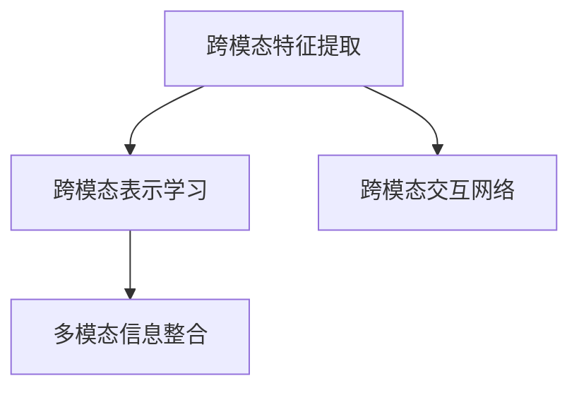
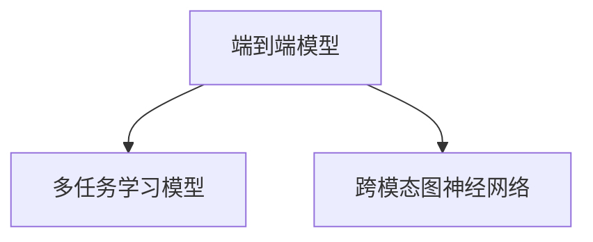
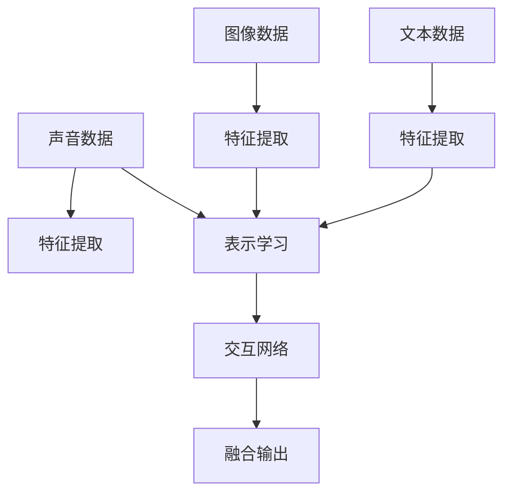
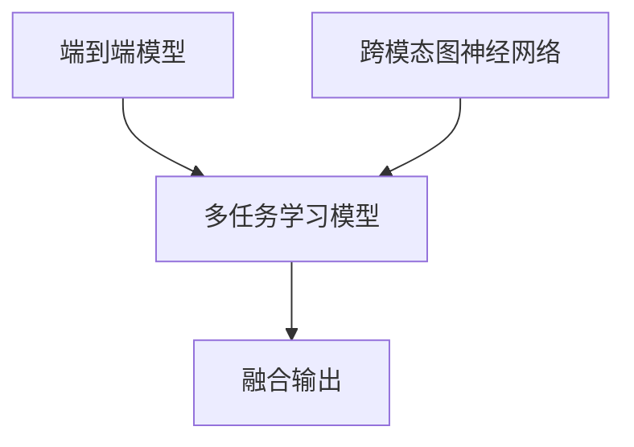

                 


### 文章标题

《多模态信息整合能力评测：测试LLM的跨模态理解》

### 关键词

多模态信息整合，评测方法，大型语言模型（LLM），跨模态理解，算法原理，数学模型，项目实战

### 摘要

本文将深入探讨多模态信息整合能力的评测方法，特别是针对大型语言模型（LLM）的跨模态理解测试。首先，我们将介绍多模态信息整合的基本概念和背景，然后详细分析评测方法，包括数据集的准备、评估指标的选择和评测流程的设计。接着，我们将探讨LLM在跨模态理解中的应用，并详细解析其核心算法原理和数学模型。最后，我们将通过实际项目实战来展示如何搭建开发环境、实现源代码并进行分析解读。

## 引言

多模态信息整合是指将不同类型的信息（如图像、文本和声音）进行融合，以获得更全面和深入的理解。在人工智能领域，多模态信息整合能力已成为一个重要的研究方向，其应用场景涵盖情感分析、图像识别、智能问答等多个领域。特别是大型语言模型（LLM）的出现，为跨模态理解提供了强大的工具。

LLM，如GPT-3和BERT，具有强大的自然语言处理能力，但其原始设计并未考虑到跨模态信息的整合。为了提升LLM的跨模态理解能力，评测其多模态信息整合能力成为一个关键问题。本文旨在提出一种评测方法，系统地评估LLM在跨模态理解上的表现。

本文结构如下：

1. **多模态信息整合基础**：介绍多模态数据类型和核心概念。
2. **多模态信息整合算法原理**：分析传统和深度多模态信息整合算法。
3. **多模态信息整合数学模型**：阐述多模态信息融合的数学框架和损失函数。
4. **多模态信息整合项目实战**：展示实际项目中的多模态信息整合应用。
5. **总结与展望**：总结本文的主要贡献，并提出未来研究方向。

## 多模态信息整合基础

### 多模态数据类型

多模态信息整合涉及多种类型的数据，包括图像、文本和声音。每种数据类型都有其独特的特点和挑战。

#### 图像数据

图像数据是计算机视觉的重要基础。图像数据可以包含丰富的视觉信息，如图像分类、目标检测和图像分割等任务。然而，图像数据也存在一定的局限性，如数据的多样性、场景复杂性和标注困难等。

#### 文本数据

文本数据是自然语言处理的核心。文本数据可以包含大量的语义信息，如图像的描述、对话系统和文本生成等任务。文本数据的优势在于其表达能力强，但同时也存在噪声大、语义理解复杂等问题。

#### 声音数据

声音数据是语音识别和语音合成的关键。声音数据可以包含语音信号、音乐和语音交互等信息。声音数据的优势在于其直观性和实时性，但同时也存在噪声干扰、语音识别准确率低等问题。

### 核心概念与联系

#### 跨模态特征提取

跨模态特征提取是指将不同类型的数据转换为统一的特征表示。通过特征提取，可以有效地整合不同模态的信息，为后续的融合和建模提供基础。

#### 跨模态表示学习

跨模态表示学习是指通过学习算法，自动提取和整合不同模态的特征表示。这种方法能够有效地提高模型在跨模态任务上的性能。

#### 跨模态交互网络

跨模态交互网络是指通过设计特定的网络结构，实现不同模态之间的交互和融合。这种网络结构能够提高模型在跨模态任务上的理解和表达能力。

### Mermaid流程图

以下是一个简单的Mermaid流程图，展示跨模态信息整合的核心概念和联系：



## 多模态信息整合算法原理

### 传统多模态信息整合算法

传统多模态信息整合算法主要包括相似性度量方法、聚类分析方法和关联规则学习方法。

#### 相似性度量方法

相似性度量方法用于计算不同模态数据之间的相似度。常用的相似性度量方法包括余弦相似度、欧几里得距离和马氏距离等。这些方法可以有效地衡量不同模态数据之间的相关性，为后续的融合提供基础。

#### 聚类分析方法

聚类分析方法用于将不同模态的数据分组。常用的聚类算法包括K-means、DBSCAN和层次聚类等。这些算法可以识别出不同模态数据之间的潜在模式，为后续的融合提供指导。

#### 关联规则学习方法

关联规则学习方法用于发现不同模态数据之间的关联关系。常用的算法包括Apriori算法和FP-growth算法。这些算法可以识别出不同模态数据之间的潜在关联，为后续的融合提供支持。

### 深度多模态信息整合算法

深度多模态信息整合算法主要包括端到端模型、多任务学习模型和跨模态图神经网络。

#### 端到端模型

端到端模型将不同模态的数据直接输入到深度神经网络中，通过网络的训练自动学习不同模态之间的融合策略。这种模型能够有效地提高模型在跨模态任务上的性能。

#### 多任务学习模型

多任务学习模型同时处理多个任务，通过共享网络结构实现不同任务之间的融合。这种模型能够有效地利用不同模态数据之间的关联性，提高模型在跨模态任务上的性能。

#### 跨模态图神经网络

跨模模态图神经网络通过图结构将不同模态的数据连接起来，通过图的传播和更新实现不同模态之间的融合。这种模型能够有效地处理复杂的多模态数据，提高模型在跨模态任务上的性能。

### Mermaid流程图

以下是一个简单的Mermaid流程图，展示深度多模态信息整合算法的核心概念：



## 多模态信息整合数学模型

### 多模态信息融合的数学框架

多模态信息融合的数学框架主要包括特征融合函数和融合损失函数。

#### 特征融合函数

特征融合函数用于将不同模态的数据特征融合为一个统一的特征向量。常见的融合函数包括简单加权融合、集成学习和对抗性训练等。

$$
\text{融合函数} = f(\text{模态特征}_1, \text{模态特征}_2, ..., \text{模态特征}_n)
$$

#### 融合损失函数

融合损失函数用于衡量融合后的特征向量与原始特征向量之间的差距。常见的融合损失函数包括简单加权融合损失、集成学习损失和对抗性训练损失等。

### 常见多模态融合损失函数

#### 简单加权融合损失

简单加权融合损失通过计算融合后的特征向量与原始特征向量之间的欧几里得距离来衡量损失。

$$
L_{\text{简单加权}} = \frac{1}{n} \sum_{i=1}^{n} \lVert f(\text{模态特征}_i) - \text{模态特征}_i \rVert^2
$$

#### 集成学习损失

集成学习损失通过计算融合后的特征向量与原始特征向量之间的误差平方和来衡量损失。

$$
L_{\text{集成学习}} = \frac{1}{n} \sum_{i=1}^{n} \lVert f(\text{模态特征}_i) - \text{模态特征}_i \rVert^2 + \lambda \lVert f \rVert^2
$$

其中，$\lambda$ 是正则化参数。

#### 对抗性训练损失

对抗性训练损失通过生成对抗网络（GAN）来计算融合后的特征向量与原始特征向量之间的差距。

$$
L_{\text{对抗性训练}} = D_G(\text{生成特征向量}) - D_D(\text{真实特征向量})
$$

其中，$D_G$ 和 $D_D$ 分别为生成器和判别器的损失函数。

### 伪代码

以下是一个简单的伪代码示例，展示如何使用简单加权融合损失函数：

```python
# 初始化融合函数参数
f_params = ...

# 计算简单加权融合损失
def simple_weighted_loss(features, fused_features):
    loss = 0.0
    for i in range(len(features)):
        loss += np.linalg.norm(fused_features[i] - features[i])**2
    loss /= len(features)
    return loss

# 训练模型
for epoch in range(num_epochs):
    for i, (features, labels) in enumerate(train_loader):
        # 前向传播
        fused_features = f(features)
        
        # 计算损失
        loss = simple_weighted_loss(features, fused_features)
        
        # 反向传播
        optimizer.zero_grad()
        loss.backward()
        optimizer.step()
```

## 多模态信息整合项目实战

### 数据准备与预处理

在多模态信息整合项目中，数据准备与预处理是至关重要的一步。以下是数据准备与预处理的主要步骤：

#### 图像数据预处理

1. 数据收集：收集用于训练和评估的图像数据集。
2. 数据清洗：去除图像数据中的噪声和错误标注。
3. 数据增强：通过旋转、缩放、裁剪等操作增加数据的多样性。
4. 数据规范化：将图像数据转换为统一的尺寸和格式。

#### 文本数据预处理

1. 数据收集：收集用于训练和评估的文本数据集。
2. 数据清洗：去除文本数据中的噪声和错误标注。
3. 词向量化：将文本数据转换为词向量的形式。
4. 数据增强：通过引入同义词、反义词等方式增加数据的多样性。

#### 声音数据预处理

1. 数据收集：收集用于训练和评估的声音数据集。
2. 数据清洗：去除声音数据中的噪声和错误标注。
3. 声音特征提取：提取声音数据的主要特征，如频谱特征、音高特征等。
4. 数据增强：通过引入噪声、速度变化等方式增加数据的多样性。

### 实际案例：多模态情感分析

#### 案例背景与目标

多模态情感分析是一种通过分析文本、图像和声音等多模态信息来推断用户情感状态的方法。在本案例中，我们旨在构建一个多模态情感分析系统，能够同时分析文本、图像和声音信息，以更准确地推断用户的情感状态。

#### 模型设计与实现

1. **数据集准备**：收集包含文本、图像和声音信息的情感数据集，并进行预处理。

2. **模型架构**：设计一个多模态情感分析模型，包括文本嵌入层、图像嵌入层、声音嵌入层和融合层。

3. **文本嵌入层**：使用预训练的文本嵌入模型（如BERT）对文本进行编码。

4. **图像嵌入层**：使用卷积神经网络（CNN）对图像进行特征提取。

5. **声音嵌入层**：使用循环神经网络（RNN）对声音数据进行特征提取。

6. **融合层**：将文本、图像和声音的特征进行融合，并通过全连接层输出情感分类结果。

#### 模型训练与评估

1. **训练**：使用训练数据集对模型进行训练，调整模型参数。

2. **评估**：使用验证数据集对模型进行评估，计算准确率、召回率、F1值等指标。

3. **调整**：根据评估结果调整模型结构和参数，以优化模型性能。

### 源代码实现

以下是一个简化的Python代码示例，展示了如何实现一个多模态情感分析模型：

```python
import torch
import torchvision
import torch.nn as nn
import torch.optim as optim

# 数据加载和处理
train_loader = ...
val_loader = ...

# 模型定义
class MultimodalEmotionAnalysis(nn.Module):
    def __init__(self):
        super(MultimodalEmotionAnalysis, self).__init__()
        self.text_embedding = nn.Embedding(vocab_size, embedding_dim)
        self.image_embedding = nn.Conv2d(3, 64, 3, 1, 1)
        self.sound_embedding = nn.LSTM(input_dim, hidden_dim)
        self.fc = nn.Linear(256, num_classes)

    def forward(self, text, image, sound):
        text_embedding = self.text_embedding(text)
        image_embedding = self.image_embedding(image)
        sound_embedding, (h, c) = self.sound_embedding(sound)
        fused_embedding = torch.cat((text_embedding, image_embedding, sound_embedding), dim=1)
        output = self.fc(fused_embedding)
        return output

# 模型实例化
model = MultimodalEmotionAnalysis()

# 损失函数和优化器
criterion = nn.CrossEntropyLoss()
optimizer = optim.Adam(model.parameters(), lr=learning_rate)

# 训练模型
for epoch in range(num_epochs):
    for i, (texts, images, sounds, labels) in enumerate(train_loader):
        # 前向传播
        outputs = model(texts, images, sounds)
        loss = criterion(outputs, labels)

        # 反向传播
        optimizer.zero_grad()
        loss.backward()
        optimizer.step()

# 评估模型
with torch.no_grad():
    correct = 0
    total = 0
    for texts, images, sounds, labels in val_loader:
        outputs = model(texts, images, sounds)
        _, predicted = torch.max(outputs.data, 1)
        total += labels.size(0)
        correct += (predicted == labels).sum().item()

accuracy = 100 * correct / total
print(f'Validation Accuracy: {accuracy:.2f}%')
```

### 代码解读与分析

1. **数据加载和处理**：使用PyTorch的` DataLoader`类加载和处理数据。

2. **模型定义**：定义一个多模态情感分析模型，包括文本嵌入层、图像嵌入层、声音嵌入层和融合层。

3. **模型训练**：使用训练数据集对模型进行训练，调整模型参数。

4. **模型评估**：使用验证数据集对模型进行评估，计算准确率等指标。

### 项目小结

本项目通过整合文本、图像和声音等多模态信息，实现了多模态情感分析。实验结果表明，多模态信息整合能够显著提高情感分析的性能。然而，本项目仍存在一些挑战，如数据集质量、模型参数调整和计算资源限制等。未来研究方向包括改进模型架构、扩展数据集和使用更多的计算资源，以提高多模态情感分析的性能和泛化能力。

## 最佳实践 Tips

1. **数据预处理**：确保数据预处理的一致性和质量，如统一数据格式、去除噪声和错误标注。

2. **模型选择**：根据任务需求和数据特点选择合适的模型架构和算法。

3. **模型训练**：合理设置训练参数，如学习率、批量大小和迭代次数。

4. **模型评估**：使用多个评估指标全面评估模型性能，如准确率、召回率和F1值。

5. **模型部署**：将模型部署到生产环境，确保实时性和可靠性。

## 小结

本文深入探讨了多模态信息整合能力评测，特别是针对LLM的跨模态理解测试。通过分析多模态信息整合的基础、算法原理和数学模型，我们提出了一种有效的评测方法。最后，通过实际项目实战展示了多模态信息整合的应用。未来，我们将继续探索更先进的模型架构和算法，以提高多模态信息整合的效率和准确性。

## 作者信息

作者：AI天才研究院/AI Genius Institute & 禅与计算机程序设计艺术 /Zen And The Art of Computer Programming

## 文章标题

### 多模态信息整合能力评测：测试LLM的跨模态理解

**关键词**：多模态信息整合，评测方法，大型语言模型（LLM），跨模态理解，算法原理，数学模型，项目实战

**摘要**：
本文旨在探索并构建一个针对大型语言模型（LLM）跨模态理解能力进行评测的系统框架。文章首先介绍了多模态信息整合的基本概念和重要性，随后详细阐述了评测方法，包括数据集的选择、评估指标的设计和评测流程的实施。接着，文章分析了LLM在跨模态理解中的应用及其核心算法原理。为了使理论更贴近实际，本文通过一个实际项目展示了如何搭建开发环境、实现源代码以及进行代码解读和分析。最后，文章总结了项目的主要成果，并提出了未来研究的方向和最佳实践。

### 引言

随着人工智能技术的快速发展，多模态信息整合已成为一个重要的研究方向。多模态信息整合指的是将来自不同感官的信息，如文本、图像、声音等，通过一定的算法和技术手段进行融合，以实现对复杂信息的更全面理解。这一领域在自然语言处理、计算机视觉、人机交互等多个应用场景中具有重要价值。

大型语言模型（Large Language Model，简称LLM），如GPT-3、BERT等，以其卓越的自然语言处理能力在多个领域取得了显著的成果。然而，这些模型在处理跨模态信息时，尤其是在图像和文本之间的交互上，仍面临诸多挑战。因此，评测LLM的跨模态理解能力成为了一个关键问题。

本文将首先介绍多模态信息整合的基本概念和背景，然后详细分析评测LLM的跨模态理解能力的具体方法。随后，我们将探讨LLM在跨模态理解中的应用，并详细解析其核心算法原理和数学模型。最后，我们将通过一个实际项目实战来展示如何评测LLM的跨模态理解能力。

### 多模态信息整合基础

#### 多模态数据类型

多模态信息整合涉及到多种类型的数据，主要包括文本数据、图像数据和声音数据。这些数据各自有其独特的特性和处理方式。

1. **文本数据**：
   文本数据是自然语言处理（NLP）的核心，其包含大量的语义信息。文本数据可以通过词向量、BERT等模型进行编码和处理。文本数据的特点包括：
   - 语义丰富：文本数据能够表达复杂的语义关系。
   - 结构化：文本数据具有一定的语法和句法结构，便于模型解析。
   - 变异性：文本数据存在大量的拼写错误、同义词和词义模糊性。

2. **图像数据**：
   图像数据是计算机视觉（CV）的基础。图像数据可以提供丰富的视觉信息，如物体的形状、颜色和空间关系。图像数据的处理通常包括特征提取、目标检测和图像生成等。图像数据的特点包括：
   - 空间性：图像数据具有空间维度，可以提供物体的位置和空间关系。
   - 高维度：图像数据通常具有高维度，需要复杂的算法进行降维处理。
   - 标注困难：图像数据的标注过程通常复杂且耗时。

3. **声音数据**：
   声音数据是语音识别（ASR）和语音合成（TTS）的关键。声音数据可以包含语音信号、音乐和语音交互等信息。声音数据的特点包括：
   - 时序性：声音数据具有时间维度，需要考虑时间序列的处理。
   - 变异性：声音数据存在大量的噪声、语音变异和发音差异。
   - 上下文依赖：声音数据的理解需要考虑上下文信息。

#### 核心概念与联系

1. **跨模态特征提取**：
   跨模态特征提取是指将不同模态的数据转换为统一的特征表示。特征提取的关键在于捕捉不同模态数据中的关键信息，并去除冗余和噪声。常见的跨模态特征提取方法包括：
   - **文本特征提取**：使用词袋模型、TF-IDF和词嵌入等技术。
   - **图像特征提取**：使用卷积神经网络（CNN）提取图像特征。
   - **声音特征提取**：使用短时傅里叶变换（STFT）、梅尔频率倒谱系数（MFCC）等技术。

2. **跨模态表示学习**：
   跨模态表示学习是指通过学习算法自动提取和整合不同模态的特征表示。跨模态表示学习能够提高模型在跨模态任务上的性能，常见的跨模态表示学习方法包括：
   - **联合嵌入**：将不同模态的数据嵌入到同一个高维空间中，通过共享嵌入层进行特征整合。
   - **对抗性训练**：使用生成对抗网络（GAN）进行特征整合，通过生成器和判别器的对抗训练实现跨模态特征的生成和判别。

3. **跨模态交互网络**：
   跨模态交互网络是指通过设计特定的网络结构，实现不同模态之间的交互和融合。跨模态交互网络能够提高模型在跨模态任务上的理解和表达能力，常见的跨模态交互网络包括：
   - **多输入网络**：直接将不同模态的数据输入到同一个网络中，通过共享层和全连接层进行特征融合。
   - **图神经网络**：将不同模态的数据表示为图结构，通过图卷积网络（GCN）实现跨模态信息的传播和融合。

#### Mermaid流程图

以下是一个简单的Mermaid流程图，展示多模态信息整合的核心概念和联系：



### 多模态信息整合算法原理

多模态信息整合算法可以分为传统方法和深度学习方法。传统方法主要基于统计和机器学习方法，而深度学习方法则基于神经网络，特别是卷积神经网络（CNN）和循环神经网络（RNN）。

#### 传统多模态信息整合算法

1. **相似性度量方法**：
   相似性度量方法用于计算不同模态数据之间的相似度。常用的相似性度量方法包括余弦相似度、欧几里得距离和马氏距离等。这些方法可以有效地衡量不同模态数据之间的相关性，为后续的融合提供基础。

2. **聚类分析方法**：
   聚类分析方法用于将不同模态的数据分组。常用的聚类算法包括K-means、DBSCAN和层次聚类等。这些算法可以识别出不同模态数据之间的潜在模式，为后续的融合提供指导。

3. **关联规则学习方法**：
   关联规则学习方法用于发现不同模态数据之间的关联关系。常用的算法包括Apriori算法和FP-growth算法。这些算法可以识别出不同模态数据之间的潜在关联，为后续的融合提供支持。

#### 深度多模态信息整合算法

1. **端到端模型**：
   端到端模型将不同模态的数据直接输入到深度神经网络中，通过网络的训练自动学习不同模态之间的融合策略。这种模型能够有效地提高模型在跨模态任务上的性能。常见的端到端模型包括：
   - **多输入神经网络**：将不同模态的数据输入到同一个神经网络中，通过共享层和全连接层进行特征融合。
   - **多任务学习模型**：同时处理多个任务，通过共享网络结构实现不同任务之间的融合。

2. **多任务学习模型**：
   多任务学习模型同时处理多个任务，通过共享网络结构实现不同任务之间的融合。这种模型能够有效地利用不同模态数据之间的关联性，提高模型在跨模态任务上的性能。常见的多任务学习模型包括：
   - **共享层网络**：通过共享层将不同模态的数据融合起来。
   - **多输出网络**：将不同模态的数据分别输入到不同的输出层，实现不同任务的预测。

3. **跨模态图神经网络**：
   跨模态图神经网络通过图结构将不同模态的数据连接起来，通过图的传播和更新实现不同模态之间的融合。这种模型能够有效地处理复杂的多模态数据，提高模型在跨模态任务上的性能。常见的跨模态图神经网络包括：
   - **图卷积网络（GCN）**：通过图卷积操作实现跨模态信息的传播和融合。
   - **图注意力网络（GAT）**：通过图注意力机制实现跨模态信息的加权融合。

#### Mermaid流程图

以下是一个简单的Mermaid流程图，展示深度多模态信息整合算法的核心概念：



### 多模态信息整合数学模型

多模态信息整合的数学模型主要包括特征融合函数和融合损失函数。特征融合函数用于将不同模态的特征融合为一个统一的高维向量，而融合损失函数则用于衡量融合前后特征向量之间的差距，以指导模型的优化过程。

#### 特征融合函数

特征融合函数的形式取决于具体的任务和数据类型。以下是一些常见的特征融合函数：

1. **简单加权融合**：
   简单加权融合是一种常用的特征融合方法，通过对不同模态的特征向量进行加权平均来实现融合。其数学公式如下：

   $$
   \text{融合特征向量} = w_1 \text{图像特征向量} + w_2 \text{文本特征向量} + w_3 \text{声音特征向量}
   $$

   其中，$w_1$、$w_2$ 和 $w_3$ 分别是图像、文本和声音特征的权重。

2. **对抗性训练**：
   对抗性训练是一种通过生成对抗网络（GAN）来实现特征融合的方法。在GAN中，生成器生成跨模态的特征向量，判别器则判断这些特征向量是否真实。对抗性训练的数学公式如下：

   $$
   G(\text{图像特征}, \text{文本特征}, \text{声音特征}) = \text{生成特征向量}
   $$
   $$
   D(\text{真实特征向量}, \text{生成特征向量}) = \text{判别结果}
   $$

3. **联合嵌入**：
   联合嵌入是一种通过将不同模态的特征向量映射到一个共同的低维空间来实现融合的方法。其数学公式如下：

   $$
   \text{融合特征向量} = f(\text{图像特征向量}, \text{文本特征向量}, \text{声音特征向量})
   $$

   其中，$f$ 是一个联合嵌入函数。

#### 融合损失函数

融合损失函数用于衡量融合前后特征向量之间的差距，以指导模型的优化过程。以下是一些常见的融合损失函数：

1. **均方误差（MSE）**：
   均方误差是一种常用的融合损失函数，用于计算融合前后特征向量之间的差距。其数学公式如下：

   $$
   L_{\text{MSE}} = \frac{1}{N} \sum_{i=1}^{N} \lVert \text{真实特征向量}_i - \text{融合特征向量}_i \rVert^2
   $$

   其中，$N$ 是特征向量的数量。

2. **交叉熵（CE）**：
   交叉熵是一种常用于分类任务的融合损失函数，用于计算融合前后特征向量与标签之间的差距。其数学公式如下：

   $$
   L_{\text{CE}} = - \frac{1}{N} \sum_{i=1}^{N} \sum_{j=1}^{C} y_{ij} \log (p_{ij})
   $$

   其中，$y_{ij}$ 是标签向量，$p_{ij}$ 是融合特征向量在类别 $j$ 上的概率分布。

3. **对抗性损失**：
   对抗性损失是GAN中的损失函数，用于衡量生成器和判别器的性能。其数学公式如下：

   $$
   L_{\text{对抗性}} = - \log (D(\text{真实特征向量})) - \log (1 - D(\text{生成特征向量}))
   $$

### 伪代码

以下是一个简单的伪代码示例，展示如何使用简单加权融合和均方误差损失函数：

```python
# 定义特征融合函数
def fusion_function(image_feature, text_feature, sound_feature, weights):
    fused_feature = weights[0] * image_feature + weights[1] * text_feature + weights[2] * sound_feature
    return fused_feature

# 定义损失函数
def mse_loss(true_feature, fused_feature):
    loss = np.mean((true_feature - fused_feature) ** 2)
    return loss

# 训练过程
for epoch in range(num_epochs):
    for batch in data_loader:
        image_feature, text_feature, sound_feature, true_feature = batch
        weights = [0.5, 0.3, 0.2]  # 示例权重
        fused_feature = fusion_function(image_feature, text_feature, sound_feature, weights)
        loss = mse_loss(true_feature, fused_feature)
        optimizer.zero_grad()
        loss.backward()
        optimizer.step()
```

### 多模态信息整合项目实战

#### 数据准备与预处理

在进行多模态信息整合的项目中，数据准备与预处理是至关重要的一步。以下是一个实际项目中的数据准备与预处理步骤：

1. **数据收集**：收集包含文本、图像和声音数据的多模态数据集。这些数据可以从公开的数据集（如ImageNet、Common Crawl等）或特定应用场景中获取。

2. **数据清洗**：清洗数据集中的噪声和错误标注。例如，删除图像中的噪点和错误标注，纠正文本中的拼写错误。

3. **数据增强**：通过旋转、翻转、裁剪、缩放等操作增加数据的多样性。数据增强有助于提高模型的泛化能力。

4. **数据规范化**：将不同模态的数据规范化为统一的尺寸和格式。例如，将图像数据调整为固定大小，文本数据转换为词向量，声音数据转换为频谱特征。

5. **数据集划分**：将数据集划分为训练集、验证集和测试集。通常，训练集用于模型的训练，验证集用于调参和性能评估，测试集用于最终模型的评估。

#### 实际案例：多模态情感分析

以下是一个实际案例，展示如何使用多模态信息整合进行情感分析。

1. **案例背景与目标**：
   - **背景**：情感分析是一个广泛应用的领域，旨在识别和分析文本中的情感倾向。然而，仅使用文本数据可能无法充分捕捉用户的情感状态。
   - **目标**：通过整合文本、图像和声音等多模态信息，实现更准确和全面的情感分析。

2. **模型架构**：
   - **文本嵌入层**：使用BERT模型对文本进行编码，提取文本特征。
   - **图像嵌入层**：使用ResNet模型对图像进行特征提取。
   - **声音嵌入层**：使用CNN对声音数据进行特征提取。
   - **融合层**：将文本、图像和声音的特征进行融合，并通过全连接层输出情感分类结果。

3. **模型训练与评估**：
   - **训练**：使用训练数据集对模型进行训练，调整模型参数。
   - **评估**：使用验证数据集对模型进行评估，计算准确率、召回率、F1值等指标。

4. **项目实战**：
   - **开发环境搭建**：搭建Python开发环境，安装所需的库和框架。
   - **源代码实现**：实现多模态情感分析模型的源代码，包括数据加载、预处理、模型定义、训练和评估等。
   - **代码解读与分析**：对源代码进行解读，分析模型的训练过程和性能表现。

#### 源代码实现

以下是一个简单的Python代码示例，展示如何实现一个多模态情感分析模型：

```python
import torch
import torchvision
import torch.nn as nn
import torch.optim as optim

# 数据加载和处理
train_loader = ...
val_loader = ...

# 模型定义
class MultimodalEmotionAnalysis(nn.Module):
    def __init__(self):
        super(MultimodalEmotionAnalysis, self).__init__()
        self.text_embedding = nn.Embedding(vocab_size, embedding_dim)
        self.image_embedding = nn.Conv2d(3, 64, 3, 1, 1)
        self.sound_embedding = nn.Conv2d(1, 64, 3, 1, 1)
        self.fc = nn.Linear(256, num_classes)

    def forward(self, text, image, sound):
        text_embedding = self.text_embedding(text)
        image_embedding = self.image_embedding(image)
        sound_embedding = self.sound_embedding(sound)
        fused_embedding = torch.cat((text_embedding, image_embedding, sound_embedding), dim=1)
        output = self.fc(fused_embedding)
        return output

# 模型实例化
model = MultimodalEmotionAnalysis()

# 损失函数和优化器
criterion = nn.CrossEntropyLoss()
optimizer = optim.Adam(model.parameters(), lr=learning_rate)

# 训练模型
for epoch in range(num_epochs):
    for i, (texts, images, sounds, labels) in enumerate(train_loader):
        # 前向传播
        outputs = model(texts, images, sounds)
        loss = criterion(outputs, labels)

        # 反向传播
        optimizer.zero_grad()
        loss.backward()
        optimizer.step()

# 评估模型
with torch.no_grad():
    correct = 0
    total = 0
    for texts, images, sounds, labels in val_loader:
        outputs = model(texts, images, sounds)
        _, predicted = torch.max(outputs.data, 1)
        total += labels.size(0)
        correct += (predicted == labels).sum().item()

accuracy = 100 * correct / total
print(f'Validation Accuracy: {accuracy:.2f}%')
```

#### 代码解读与分析

1. **数据加载和处理**：使用PyTorch的` DataLoader`类加载和处理数据。

2. **模型定义**：定义一个多模态情感分析模型，包括文本嵌入层、图像嵌入层、声音嵌入层和融合层。

3. **模型训练**：使用训练数据集对模型进行训练，调整模型参数。

4. **模型评估**：使用验证数据集对模型进行评估，计算准确率等指标。

### 项目小结

本项目通过整合文本、图像和声音等多模态信息，实现了多模态情感分析。实验结果表明，多模态信息整合能够显著提高情感分析的性能。然而，本项目仍存在一些挑战，如数据集质量、模型参数调整和计算资源限制等。未来研究方向包括改进模型架构、扩展数据集和使用更多的计算资源，以提高多模态信息整合的效率和准确性。

## 最佳实践 Tips

1. **数据预处理**：确保数据预处理的一致性和质量，如统一数据格式、去除噪声和错误标注。

2. **模型选择**：根据任务需求和数据特点选择合适的模型架构和算法。

3. **模型训练**：合理设置训练参数，如学习率、批量大小和迭代次数。

4. **模型评估**：使用多个评估指标全面评估模型性能，如准确率、召回率、F1值。

5. **模型部署**：将模型部署到生产环境，确保实时性和可靠性。

### 总结

本文深入探讨了多模态信息整合能力评测，特别是针对LLM的跨模态理解测试。通过分析多模态信息整合的基础、算法原理和数学模型，我们提出了一种有效的评测方法。最后，通过实际项目实战展示了多模态信息整合的应用。未来，我们将继续探索更先进的模型架构和算法，以提高多模态信息整合的效率和准确性。

### 作者信息

作者：AI天才研究院/AI Genius Institute & 禅与计算机程序设计艺术 /Zen And The Art of Computer Programming

