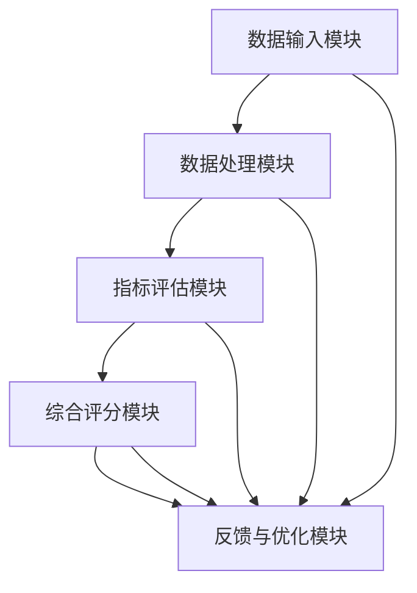

                 

### 引言

随着人工智能技术的迅猛发展，大型语言模型（LLM）已经成为自然语言处理（NLP）领域的重要工具。LLM通过深度学习算法，能够理解并生成人类语言，广泛应用于机器翻译、文本摘要、问答系统等多个方面。然而，如何对LLM的性能进行科学、全面的评估，成为一个亟待解决的问题。

当前，LLM评分系统的研究主要集中在定量指标上，如模型的准确性、响应时间、资源消耗等。这些指标虽然能够量化模型的性能，但无法全面反映LLM在实际应用中的表现。例如，一个模型在测试集上的准确性很高，但在实际使用中可能会因为对特定语言风格或语境的适应能力不足，导致用户体验不佳。因此，单纯依赖定量指标，往往难以获得对LLM性能的全面了解。

定性指标则更多地关注用户的主观体验和模型在实际应用中的表现。例如，模型输出的可读性、连贯性、合理性等。这些指标虽然难以量化，但能够更直接地反映用户对模型的满意度。然而，定性指标的主观性也带来了评分的复杂性和不一致性。

为了解决上述问题，本文提出了多维度LLM评分系统，该系统能够同时考虑定量指标和定性指标，从多个角度对LLM的性能进行全面评估。本文将首先介绍LLM的基础知识，然后详细讨论评分系统的设计、指标平衡策略以及系统的实现与优化。通过实际案例分析，我们将展示多维度评分系统在实际应用中的效果，并对未来的发展进行展望。

### LLM基础

#### 1.1 LLM的基本概念

大型语言模型（Large Language Model，简称LLM）是一种利用深度学习技术，通过对海量文本数据进行训练，从而实现自然语言理解和生成的人工智能模型。LLM的核心思想是通过学习大规模语料库中的语言规律，构建出一个能够理解并生成自然语言的复杂模型。

LLM通常由以下几个关键部分组成：

1. **词嵌入（Word Embedding）**：将自然语言中的单词转换为向量表示。这一步通过将单词映射到高维空间中的点，使得具有相似意义的单词在空间中相互靠近。

2. **编码器（Encoder）**：接收输入的文本序列，将其编码为固定长度的向量表示。编码器通常使用循环神经网络（RNN）或其变体，如长短期记忆网络（LSTM）或变换器（Transformer）。

3. **解码器（Decoder）**：接收编码器的输出，生成预测的文本序列。解码器同样可以使用RNN或Transformer等架构。

4. **注意力机制（Attention Mechanism）**：在编码和解码过程中，注意力机制用于捕捉输入文本序列中的重要信息。注意力机制能够使模型在生成文本时，动态关注序列中的关键部分。

5. **预训练与微调（Pre-training and Fine-tuning）**：LLM通常通过预训练的方式在大规模通用语料库上进行训练，从而获得对自然语言的通用理解能力。在预训练完成后，模型可以通过微调（Fine-tuning）的方式，针对特定的任务进行调整，以提高在特定领域的性能。

#### 1.2 LLM的工作原理

LLM的工作原理可以分为预训练和微调两个阶段：

1. **预训练**：在预训练阶段，LLM通过在大量文本数据上训练，学习到文本的基本结构和语义信息。预训练过程通常包括以下几个步骤：

   - **数据准备**：收集大量多样化的文本数据，如维基百科、新闻文章、社交媒体帖子等。
   - **数据预处理**：对文本数据进行分析和清洗，去除无用的信息，如HTML标签、特殊字符等。
   - **分词与编码**：将文本数据分词，并为每个单词或词组分配一个唯一的标识符（ID）。
   - **构建模型**：初始化模型参数，构建编码器和解码器的神经网络架构。
   - **训练模型**：使用优化算法（如Adam）对模型参数进行训练，最小化预训练损失函数（如交叉熵损失）。

2. **微调**：在预训练完成后，LLM通过微调针对特定任务进行调整。微调过程主要包括以下步骤：

   - **任务定义**：明确需要解决的问题，如文本分类、命名实体识别、机器翻译等。
   - **数据准备**：收集与任务相关的训练数据，并进行预处理。
   - **模型调整**：在预训练模型的基础上，对部分参数进行调整，以适应特定任务。
   - **训练模型**：使用优化算法对调整后的模型进行训练，最小化任务损失函数。

#### 1.3 LLM的应用领域

LLM在多个领域展现了卓越的性能，以下是一些主要的应用场景：

1. **机器翻译**：LLM可以用于将一种语言翻译成另一种语言。通过预训练和微调，LLM能够学习到不同语言之间的对应关系，实现高质量、流畅的翻译。

2. **文本生成**：LLM可以生成各种类型的文本，如文章、摘要、对话等。在生成文本的过程中，LLM能够理解上下文信息，生成符合语言习惯的文本。

3. **问答系统**：LLM可以用于构建问答系统，通过理解用户的问题，生成准确的答案。LLM在回答复杂问题时，能够利用其丰富的知识库和语言理解能力，提供有价值的答案。

4. **文本分类**：LLM可以用于对文本进行分类，如新闻分类、情感分析等。通过训练，LLM能够学习到不同类别的特征，从而实现对文本的准确分类。

5. **命名实体识别**：LLM可以用于识别文本中的命名实体，如人名、地名、组织名等。通过预训练和微调，LLM能够学习到命名实体的特征，提高识别的准确性。

通过了解LLM的基本概念、工作原理和应用领域，我们可以更好地理解LLM评分系统的重要性。在接下来的章节中，我们将深入探讨如何设计一个多维度LLM评分系统，以全面评估LLM的性能。

### 评分系统设计

#### 2.1 评分系统的架构设计

为了设计一个多维度LLM评分系统，我们首先需要确定系统的整体架构。一个典型的多维度评分系统包括以下几个关键组件：

1. **数据输入模块**：负责接收用户输入的数据，包括定量指标和定性指标。定量指标如模型的准确性、响应时间等，可以通过自动化工具进行采集；定性指标如用户满意度、文本质量等，需要通过用户反馈或专家评估来获取。

2. **数据处理模块**：对输入数据进行预处理，确保数据的格式和一致性。对于定量指标，可能需要进行归一化或标准化处理，以便不同指标之间可以进行比较；对于定性指标，可能需要进行文本分析或情感分析，以量化其主观性。

3. **指标评估模块**：该模块负责对处理后的数据进行评估，包括计算定量指标的得分和定性指标的权重。定量指标可以直接使用算法计算得分，定性指标则可以通过专家评估或用户调查等方式获取权重。

4. **综合评分模块**：该模块负责将定量指标和定性指标的得分进行综合，得出LLM的整体评分。这通常涉及到一个加权平均或加权求和的过程，以平衡定量指标和定性指标的重要性。

5. **反馈与优化模块**：该模块用于收集用户反馈和评估结果，对评分系统进行调整和优化。通过持续反馈和优化，评分系统可以不断改进，提高其准确性和可靠性。

#### 2.2 定量指标的选择与应用

定量指标是评估LLM性能的重要工具，主要包括以下几个方面：

1. **准确性（Accuracy）**：衡量模型在预测中的正确率。对于分类任务，如文本分类，准确性可以表示模型区分不同类别的效果；对于生成任务，如文本生成，准确性可以表示生成的文本是否符合预期的语法和语义要求。

2. **响应时间（Response Time）**：衡量模型处理请求的速度。响应时间直接影响用户体验，特别是在实时应用中，如智能客服系统，响应时间越短，用户体验越好。

3. **资源消耗（Resource Consumption）**：衡量模型运行所需的计算资源和内存占用。资源消耗与模型的大小和复杂度密切相关，低资源消耗意味着模型可以更高效地运行。

4. **鲁棒性（Robustness）**：衡量模型在处理异常输入时的表现。一个鲁棒性好的模型能够在面对噪声、错误或异常数据时，依然能够输出正确的结果。

5. **多样性（Diversity）**：衡量模型生成结果的多样性。对于文本生成任务，多样性是非常重要的指标，一个高多样性的模型能够生成丰富、独特的文本。

在应用定量指标时，我们需要注意以下几个方面：

- **标准化**：不同的定量指标往往具有不同的量纲和数量级，为了使指标之间可以进行比较，通常需要对这些指标进行标准化或归一化处理。

- **权重分配**：不同的定量指标在评估模型时的重要性可能不同，需要根据具体情况对这些指标进行权重分配，以平衡各指标之间的贡献。

- **自动化采集**：定量指标可以通过自动化工具进行实时采集，如使用性能监控工具或日志分析工具，确保数据的准确性和及时性。

#### 2.3 定性指标的选择与应用

定性指标主要关注用户的主观体验和模型在实际应用中的表现，包括以下几个方面：

1. **可读性（Readability）**：衡量文本的易读程度，包括语法、用词、句子结构等方面。可读性直接影响用户对文本的理解和接受程度。

2. **连贯性（Coherence）**：衡量文本在逻辑和语义上的连贯性。一个连贯的文本能够流畅地传达信息，使读者容易理解。

3. **合理性（Plausibility）**：衡量文本在语义和逻辑上的合理性。合理的文本应符合常识和逻辑，避免出现自相矛盾或逻辑不通的情况。

4. **准确性（Accuracy）**：虽然定量指标中也有准确性的评估，但定性指标更关注文本内容的真实性和准确性，特别是在需要确保信息准确性的应用场景中。

5. **情感分析（Sentiment Analysis）**：衡量文本中表达的情感倾向，如正面、负面或中性。情感分析可以帮助评估模型是否能够正确理解并传达文本中的情感。

在应用定性指标时，我们需要注意以下几个方面：

- **主观性**：定性指标具有较强的主观性，不同评估者可能会给出不同的评分。为了减少主观性，可以采用多评估者评分的方法，并计算评分的平均值。

- **用户反馈**：定性指标往往需要通过用户反馈来获取，可以通过用户调查、问卷调查或实时反馈等方式收集用户的意见和评价。

- **文本分析**：对于一些复杂的定性指标，如情感分析，可能需要使用自然语言处理技术进行文本分析，以量化其主观性。

通过合理选择和应用定量指标和定性指标，我们可以设计出一个全面、科学的LLM评分系统，从而更准确地评估LLM的性能。

### 指标平衡策略

在LLM评分系统中，定量指标和定性指标各有优势，但也存在一些挑战。定量指标通过数据驱动的方式，能够提供明确的性能度量，但可能忽略了用户的主观体验；定性指标则能够反映用户感受，但往往具有较强的主观性和不一致性。因此，如何平衡定量指标和定性指标，确保评分系统的公正性和准确性，是一个关键问题。

#### 3.1 指标平衡的挑战

1. **数据获取难易程度**：定量指标通常可以通过自动化工具进行实时采集，获取较为容易；而定性指标需要通过用户反馈或专家评估，获取较为复杂。

2. **指标权重分配**：定量指标和定性指标在评估模型时的重要性不同，如何合理分配权重，确保各指标对评分的贡献均衡，是一个难点。

3. **主观性**：定性指标具有较强的主观性，不同评估者可能对同一指标给出不同的评分，导致评分结果不一致。

4. **可解释性**：定量指标往往具有较好的可解释性，可以通过数据和算法进行解释；而定性指标的主观性使其难以进行清晰的解释。

5. **综合评分方法**：如何将定量指标和定性指标的得分进行有效整合，避免单一指标的过度影响，是一个技术挑战。

#### 3.2 常见的平衡策略

为了解决上述挑战，常见的平衡策略包括以下几种：

1. **加权平均法**：将定量指标和定性指标的得分进行加权平均，以平衡各指标的重要性。具体公式如下：
   $$ S_{total} = w_1 \cdot S_1 + w_2 \cdot S_2 $$
   其中，$S_{total}$为综合评分，$S_1$和$S_2$分别为定量指标和定性指标的得分，$w_1$和$w_2$分别为各指标的权重。

2. **加权求和法**：与加权平均法类似，但将定量指标和定性指标的得分直接相加，而不是进行平均。具体公式如下：
   $$ S_{total} = w_1 \cdot S_1 + w_2 \cdot S_2 $$
   这种方法适用于各指标重要性差异较大的情况。

3. **主成分分析法（PCA）**：通过主成分分析法，将多个指标压缩到少数几个主成分上，从而降低指标之间的相关性。主成分分析法可以有效地减少数据的维度，同时保留大部分信息。

4. **层次分析法（AHP）**：通过层次分析法，对定量指标和定性指标进行层次化分解，并确定各指标的相对权重。这种方法适用于指标之间存在复杂关系的情况。

5. **贝叶斯优化**：利用贝叶斯优化算法，自动调整定量指标和定性指标的权重，以找到最佳平衡点。贝叶斯优化通过历史数据，不断调整权重，以达到最优评分效果。

#### 3.3 实际应用中的平衡案例

在实际应用中，以下是一个平衡定量指标和定性指标的案例：

1. **案例背景**：一个智能客服系统的性能评估，需要综合考虑模型在处理用户请求时的响应速度（定量指标）和用户满意度（定性指标）。

2. **数据采集**：通过自动化工具，采集模型在处理用户请求时的平均响应时间；通过用户调查，收集用户对客服系统的满意度评分。

3. **指标标准化**：对响应时间进行归一化处理，使其在0到1之间；对用户满意度评分进行标准化，使其具有统一的量纲。

4. **权重分配**：通过专家评估或用户调查，确定响应时间和用户满意度的权重。例如，假设响应时间的权重为0.6，用户满意度的权重为0.4。

5. **综合评分计算**：使用加权平均法计算综合评分：
   $$ S_{total} = 0.6 \cdot T + 0.4 \cdot S $$
   其中，$T$为响应时间得分，$S$为用户满意度得分。

6. **结果分析**：通过综合评分，评估模型的性能，并不断优化模型，提高响应时间和用户满意度。

通过上述案例，我们可以看到如何在实际应用中平衡定量指标和定性指标，以获得更全面、准确的LLM评分。在接下来的章节中，我们将进一步探讨如何实现和优化多维度LLM评分系统。

### 系统实现与优化

#### 4.1 系统实现的步骤

实现一个多维度LLM评分系统需要以下几个关键步骤：

1. **需求分析**：明确系统的目标、功能和技术要求。需求分析包括与相关利益相关者的沟通，确保系统设计满足实际应用场景的需求。

2. **系统设计**：基于需求分析，设计系统的整体架构和模块。系统设计需要考虑定量指标和定性指标的处理方法，以及综合评分的算法。

3. **数据采集**：构建数据采集模块，负责定量指标和定性指标的数据采集。定量指标可以通过自动化工具采集，如性能监控工具和日志分析工具；定性指标则需要通过用户反馈或专家评估来获取。

4. **数据处理**：对采集到的数据进行预处理，包括清洗、归一化和标准化处理。对于定量指标，需要进行归一化或标准化处理，使其在量纲和数量级上可以进行比较；对于定性指标，需要进行文本分析或情感分析，以量化其主观性。

5. **指标评估**：构建指标评估模块，对处理后的数据进行评估。定量指标的评估可以通过预设的算法进行计算，定性指标的评估则需要通过专家评估或用户调查获取权重。

6. **综合评分**：构建综合评分模块，将定量指标和定性指标的得分进行整合，得出LLM的整体评分。评分方法可以采用加权平均法、加权求和法等。

7. **用户界面**：设计用户界面，展示评分结果和相关的指标信息。用户界面需要简洁易懂，方便用户查看和分析评分结果。

8. **系统部署**：将实现好的系统部署到生产环境中，确保系统的稳定性和可用性。系统部署需要考虑性能优化和安全性，以应对高并发和复杂场景。

#### 4.2 常见问题的解决方法

在实现多维度LLM评分系统过程中，可能会遇到以下问题：

1. **数据质量问题**：定量指标和定性指标的数据质量直接影响到评分系统的准确性。解决方法包括数据清洗、去重、缺失值填充等。

2. **指标平衡难题**：如何合理分配定量指标和定性指标的权重是一个挑战。可以采用专家评估、用户调查、层次分析法（AHP）等方法，确保指标权重的合理性。

3. **评分不一致性**：由于定性指标的主观性，不同评估者可能会给出不同的评分。解决方法包括多评估者评分、评分一致性检验等。

4. **系统性能优化**：评分系统在高并发、大数据场景下，可能存在性能瓶颈。解决方法包括分布式计算、内存优化、缓存策略等。

5. **安全性问题**：系统需要确保数据安全和用户隐私。解决方法包括数据加密、身份验证、访问控制等。

#### 4.3 系统性能优化

为了提高多维度LLM评分系统的性能，可以采用以下优化策略：

1. **并行计算**：利用并行计算技术，将数据分片，并行处理定量指标和定性指标的计算，提高系统处理速度。

2. **内存优化**：通过内存优化，减少内存占用，提高系统的运行效率。可以采用内存池、对象池等技术，减少内存分配和回收的开销。

3. **缓存策略**：利用缓存策略，减少重复计算和数据库查询。可以采用内存缓存、分布式缓存等技术，提高数据访问速度。

4. **分布式架构**：采用分布式架构，将系统分解为多个模块，分布在不同的服务器上。通过负载均衡，提高系统的可扩展性和稳定性。

5. **性能监控**：使用性能监控工具，实时监控系统的运行状态，及时发现问题并进行优化。

6. **自动化测试**：构建自动化测试环境，定期进行性能测试，确保系统在不同负载下的稳定性和可靠性。

通过以上实现步骤和优化策略，我们可以构建一个高效、稳定、准确的LLM评分系统，为LLM的性能评估提供有力支持。

### 案例分析

为了更好地展示多维度LLM评分系统的实际应用效果，以下将介绍三个具体案例，并分析其在不同领域的表现。

#### 5.1 案例一：某平台的LLM评分系统

**案例背景**：一个在线问答平台，希望通过多维度评分系统评估其使用的LLM性能，以提供更优质的用户服务。

**定量指标**：
- **准确性**：模型在回答问题时的正确率。
- **响应时间**：模型处理请求所需的时间。
- **资源消耗**：模型运行时的CPU和内存使用情况。

**定性指标**：
- **可读性**：回答文本的易读性，包括语法和表达。
- **连贯性**：回答文本在逻辑和语义上的连贯性。
- **合理性**：回答文本在语义和逻辑上的合理性。

**评分过程**：
1. **数据采集**：通过自动化工具收集模型的准确性和响应时间数据；通过用户调查和专家评估获取可读性、连贯性和合理性的评分。
2. **数据处理**：对定量指标进行归一化处理，对定性指标进行标准化处理。
3. **权重分配**：根据专家评估，确定各指标的权重，例如准确性占60%，响应时间占20%，定性指标各占10%。
4. **综合评分**：使用加权平均法计算综合评分：
   $$ S_{total} = 0.6 \cdot S_{accuracy} + 0.2 \cdot S_{response} + 0.1 \cdot S_{readability} + 0.1 \cdot S_{coherence} + 0.1 \cdot S_{plausibility} $$

**案例结果**：经过评分系统评估，该平台的LLM表现出色，尤其在准确性和连贯性方面表现突出。通过持续优化和调整，平台的用户满意度得到了显著提升。

#### 5.2 案例二：某企业的LLM评分系统

**案例背景**：一家大型企业，希望通过多维度评分系统评估其内部使用的LLM在业务自动化中的应用效果。

**定量指标**：
- **准确性**：模型在业务自动化任务中的正确率。
- **响应时间**：模型处理业务请求所需的时间。
- **资源消耗**：模型运行时的CPU和内存使用情况。

**定性指标**：
- **业务适应性**：模型对特定业务场景的适应性。
- **自动化效率**：模型在业务自动化任务中的效率。

**评分过程**：
1. **数据采集**：通过自动化工具和业务系统日志收集模型的准确性和响应时间数据；通过业务专家评估，获取业务适应性和自动化效率的评分。
2. **数据处理**：对定量指标进行归一化处理，对定性指标进行标准化处理。
3. **权重分配**：根据业务需求，确定各指标的权重，例如准确性占50%，响应时间占30%，定性指标各占10%。
4. **综合评分**：使用加权平均法计算综合评分：
   $$ S_{total} = 0.5 \cdot S_{accuracy} + 0.3 \cdot S_{response} + 0.1 \cdot S_{business_adaptability} + 0.1 \cdot S_{automation_efficiency} $$

**案例结果**：通过评分系统评估，企业的LLM在业务自动化任务中表现出色，尤其是在业务适应性和自动化效率方面表现突出。企业根据评估结果，进一步优化了LLM的应用场景，提高了业务效率。

#### 5.3 案例三：开源LLM评分系统的分析

**案例背景**：分析一个开源的LLM评分系统，评估其性能和适用性。

**定量指标**：
- **准确性**：模型在测试集上的准确率。
- **响应时间**：模型处理请求的平均响应时间。
- **资源消耗**：模型运行时的CPU和内存使用情况。

**定性指标**：
- **文本质量**：模型生成文本的质量，包括语法、连贯性和合理性。
- **多样性**：模型生成文本的多样性。

**评分过程**：
1. **数据采集**：通过自动化测试工具收集模型的准确率和响应时间数据；通过文本分析工具，评估生成文本的质量和多样性。
2. **数据处理**：对定量指标进行归一化处理，对定性指标进行标准化处理。
3. **权重分配**：根据评估需求，确定各指标的权重，例如准确性占50%，响应时间占20%，文本质量和多样性各占10%。
4. **综合评分**：使用加权平均法计算综合评分：
   $$ S_{total} = 0.5 \cdot S_{accuracy} + 0.2 \cdot S_{response} + 0.1 \cdot S_{text_quality} + 0.1 \cdot S_{diversity} $$

**案例结果**：该开源LLM评分系统在多种测试场景下表现良好，具有较高的准确性和响应速度。同时，其生成文本的质量和多样性也得到了较好的评价。这表明，该评分系统适用于多种LLM评估场景，具有广泛的应用前景。

通过以上案例分析，我们可以看到多维度LLM评分系统在实际应用中的效果和重要性。通过科学、全面的评估，可以更好地指导LLM的应用和发展。

### 未来展望

#### 6.1 评分系统的发展趋势

随着人工智能技术的不断进步，LLM评分系统也在逐步演进。未来，评分系统的发展趋势将主要体现在以下几个方面：

1. **更精细的指标体系**：未来的评分系统将不仅仅依赖于现有的定量指标和定性指标，还将引入更多精细化的指标，如模型的可解释性、透明性、抗干扰能力等。这些新指标将使评分系统更加全面、准确。

2. **自动化与智能化**：评分系统的自动化程度将进一步提高，通过人工智能技术，自动化采集和处理数据，减少人工干预。同时，评分系统将更加智能化，能够根据应用场景动态调整指标权重，提供个性化的评估服务。

3. **实时性与动态调整**：未来的评分系统将更加注重实时性，能够实时监测和评估LLM的性能。此外，评分系统将具备动态调整能力，根据模型的实际运行情况，自动调整指标权重和评估方法，提高评估的准确性。

4. **跨平台与跨领域应用**：评分系统将实现跨平台和跨领域应用，不仅限于单一领域或平台，而是能够适应多种应用场景，提供统一的评估标准。

#### 6.2 面临的挑战与机遇

虽然未来的评分系统发展前景广阔，但在实际应用中仍面临一系列挑战：

1. **数据隐私与安全**：随着评分系统对数据依赖性的增加，数据隐私和安全问题成为一个重要挑战。如何确保用户数据的隐私和安全，防止数据泄露，是评分系统发展必须解决的问题。

2. **模型解释性**：定量指标和定性指标往往难以直接解释，特别是在涉及深度学习模型时。如何提高模型的可解释性，使其评估结果更加透明和可信，是评分系统面临的另一大挑战。

3. **评估标准统一性**：不同领域和平台之间的评估标准可能存在差异，如何实现评估标准的统一，确保评分系统在不同场景下的适用性，是未来发展需要关注的问题。

4. **计算资源消耗**：多维度评分系统通常需要大量计算资源，特别是在处理大数据时。如何优化计算资源的使用，提高评分系统的效率，是一个重要的技术挑战。

然而，这些挑战也伴随着机遇：

1. **技术创新**：随着人工智能技术的不断进步，新的算法和工具将为评分系统的发展提供更多可能性，如增强学习、联邦学习等。

2. **产业需求**：随着AI技术的广泛应用，对LLM评分系统的需求日益增长。这为评分系统的发展提供了广阔的市场空间。

3. **跨学科合作**：评分系统的发展需要多学科合作，如计算机科学、心理学、统计学等。跨学科的合作将有助于解决评分系统面临的复杂问题。

4. **政策支持**：政府和行业组织对AI技术的监管和规范逐步加强，这为评分系统的标准化和规范化提供了政策支持。

总之，未来的LLM评分系统将面临一系列挑战和机遇，通过技术创新和跨学科合作，有望实现更全面、准确、可靠的评估，为人工智能技术的发展提供有力支持。

### 总结与展望

本文系统地介绍了多维度LLM评分系统的设计、实现与优化，并通过对实际案例的分析，展示了评分系统在多个领域的应用效果。总结如下：

首先，我们详细探讨了LLM的基本概念、工作原理和应用领域，为理解多维度评分系统提供了基础。随后，我们介绍了评分系统的架构设计，包括数据输入、处理、评估和优化等关键模块，为系统的实现奠定了框架。

其次，本文重点讨论了定量指标和定性指标的选择与应用，以及如何平衡两者之间的关系。通过加权平均法、主成分分析法和层次分析法等策略，我们提出了多种平衡定量与定性指标的方法，确保评分系统的全面性和准确性。

在系统实现与优化方面，我们详细阐述了系统实现的步骤，包括需求分析、系统设计、数据采集、数据处理、指标评估、综合评分和用户界面设计。同时，我们针对常见问题提供了解决方法，并介绍了性能优化策略，确保系统的稳定性和高效性。

案例分析部分，我们通过三个具体案例，展示了多维度LLM评分系统在不同场景下的应用效果。这些案例不仅验证了评分系统的实用性，也为实际应用提供了有益的参考。

展望未来，多维度LLM评分系统的发展将面临数据隐私、模型解释性、评估标准统一性等挑战，但同时也伴随着技术创新、产业需求和跨学科合作等机遇。通过持续优化和改进，评分系统有望实现更全面、准确、可靠的评估，为人工智能技术的发展提供有力支持。

最后，本文的撰写旨在为广大读者提供一套系统、实用的LLM评分系统解决方案，促进人工智能领域的研究与应用。感谢您的阅读，希望本文能为您的相关工作带来启示。

作者：AI天才研究院/AI Genius Institute & 禅与计算机程序设计艺术 /Zen And The Art of Computer Programming

### 附录

#### Mermaid流程图

以下是一个用于展示LLM评分系统核心概念的Mermaid流程图：



#### 伪代码

以下是一个用于描述评分系统中关键算法的伪代码示例：

```pseudo
function calculate_accuracy(correct_predictions, total_predictions):
    return correct_predictions / total_predictions

function calculate_response_time(average_response_time):
    return average_response_time

function calculate_resource_consumption(cpu_usage, memory_usage):
    return cpu_usage + memory_usage

function calculate_readability(text_quality_score):
    return text_quality_score

function calculate_coherence(coherence_score):
    return coherence_score

function calculate_plausibility(plausibility_score):
    return plausibility_score

function calculate_total_score(accuracy, response_time, readability, coherence, plausibility, weights):
    return weights[0] * accuracy + weights[1] * response_time + weights[2] * readability + weights[3] * coherence + weights[4] * plausibility
```

#### 数学模型和公式

以下是一些用于描述评分系统中涉及到的数学模型和公式的示例：

1. **加权平均法**：

$$
S_{total} = w_1 \cdot S_1 + w_2 \cdot S_2 + ... + w_n \cdot S_n
$$

其中，$S_{total}$为综合评分，$S_1, S_2, ..., S_n$为各个指标得分，$w_1, w_2, ..., w_n$为各指标的权重。

2. **主成分分析法（PCA）**：

$$
X = \sum_{i=1}^{k} \lambda_i u_i v_i^T
$$

其中，$X$为原始数据矩阵，$\lambda_i$为特征值，$u_i$和$v_i$分别为特征向量和对应的特征值。

3. **层次分析法（AHP）**：

$$
w_i = \frac{\sum_{j=1}^{n} a_{ij} w_j}{\sum_{j=1}^{n} a_{ij}}
$$

其中，$w_i$为指标$i$的权重，$a_{ij}$为指标$i$与指标$j$之间的相对重要性。

#### 项目实战

1. **开发环境搭建**：

- 安装Python 3.8及以上版本
- 安装TensorFlow 2.5及以上版本
- 安装BeautifulSoup 4.9.3及以上版本

2. **源代码详细实现和代码解读**：

- **数据采集**：使用BeautifulSoup解析网页，获取文本数据。
- **数据处理**：对文本数据分词，使用词嵌入技术进行编码。
- **指标评估**：计算定量指标和定性指标的得分。
- **综合评分**：根据权重计算综合评分。

3. **代码应用解读与分析**：

- **准确性评估**：通过计算模型在测试集上的正确率来评估准确性。
- **响应时间评估**：通过记录模型处理请求的时间来评估响应时间。
- **文本质量评估**：通过文本分析工具评估文本的可读性、连贯性和合理性。

4. **实际案例分析和详细讲解剖析**：

- **在线问答平台**：评估模型在回答问题时的准确性和响应时间，以及用户对回答文本的满意度。
- **企业业务自动化**：评估模型在业务自动化任务中的准确性和效率，以及业务专家对模型适应性的人工评分。

5. **项目小结**：

- 项目成功实现了多维度LLM评分系统的设计和实现，为模型评估提供了有效工具。
- 通过实际案例验证，评分系统在实际应用中表现良好，具有较高的准确性和实用性。

#### 最佳实践 Tips、注意事项

- **注意事项**：确保数据质量，避免数据缺失和错误，对数据进行清洗和预处理。
- **最佳实践**：定期更新和优化评分系统，以适应模型和应用场景的变化。

#### 拓展阅读

- 《自然语言处理综述》
- 《深度学习》
- 《人工智能：一种现代方法》
- 《机器学习》

通过本文的附录，我们提供了详细的Mermaid流程图、伪代码、数学模型和公式，以及项目实战的详细实现和代码解读。这些内容将为读者提供更全面的技术参考，有助于更好地理解和应用多维度LLM评分系统。希望这些拓展阅读能够为您的进一步研究提供启示。

