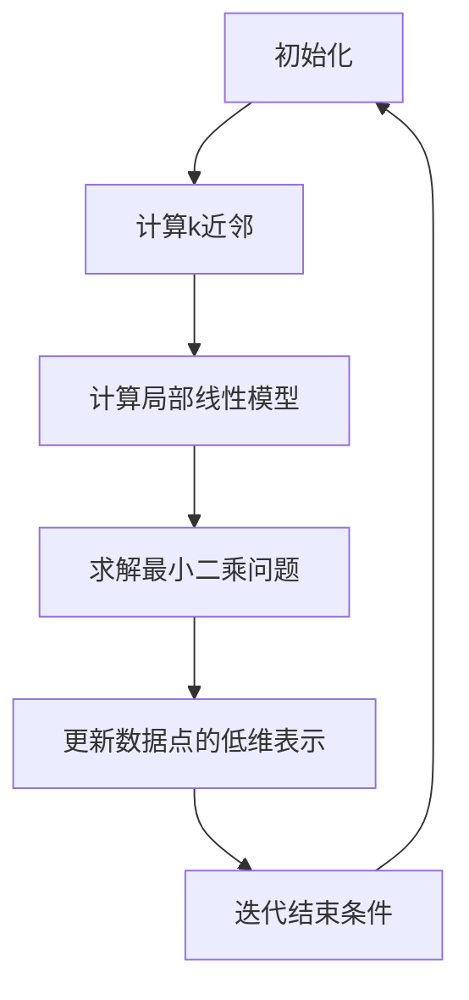

                 


### 背景介绍

在当今信息爆炸的时代，数据处理和分析成为了各个行业的重要课题。随着大数据技术的飞速发展，数据量以指数级别增长，这种增长不仅体现在数据的规模上，还体现在数据的维度上。高维数据的处理和分析对计算资源和算法设计提出了更高的要求。如何有效地降低数据的维度，同时保持数据结构和信息密度，成为了当前数据科学领域的一个重要研究方向。

流形学习（Manifold Learning）作为一种新兴的数据降维方法，旨在从高维数据中识别出低维的非线性结构。流形学习的核心思想是，高维数据中的每个点都存在于一个低维的流形上，这种流形是一种抽象的几何结构，它能够较好地保持数据的局部几何特征。通过流形学习，我们可以将高维数据映射到低维空间，使得原本在数据集中难以观察到的结构关系变得更加清晰。

流形学习的理论基础源于拓扑学和几何学。在数学中，流形是一种具有局部欧氏空间性质的抽象空间。流形学习通过在数据空间中构建流形，使得数据点在低维空间中的表示能够尽可能地保持它们在高维空间中的邻近关系。这种降维方法在图像处理、文本分析、生物信息学等领域展现出了强大的应用潜力。

流形学习的应用场景广泛，例如：

1. **图像处理**：在图像识别和图像检索中，通过流形学习可以将高维的图像数据映射到低维空间，实现更高效的图像分类和检索。
2. **文本分析**：文本数据通常具有高维特征，流形学习可以帮助我们在保持文本相似度的基础上，实现文本的降维和聚类。
3. **生物信息学**：流形学习在基因表达数据分析、蛋白质结构预测等领域具有重要作用，它可以帮助科学家从高维生物数据中提取出关键的生物学特征。

总之，流形学习作为一种数据降维的方法，不仅在理论上具有重要意义，而且在实际应用中也展现出了广泛的前景。接下来，我们将深入探讨流形学习的基本概念、核心算法原理，以及它在多维数据降维中的具体应用。

### 核心概念与联系

在深入探讨流形学习之前，我们需要明确几个核心概念，并探讨它们之间的联系。

#### 什么是流形？

流形（Manifold）是一种抽象的数学结构，它描述了一个局部看起来类似于欧氏空间的几何对象。具体来说，一个流形是一个拓扑空间，其中每个局部区域都近似于一个欧氏空间。流形的基本特性是局部平坦性，即在一个足够小的区域内，流形看起来就像一个平面的图形。

例如，一个二维的球面在局部看起来像一张平坦的地图，因此球面可以被认为是一个二维流形。同样，地球的表面在局部也是平坦的，所以地球表面也可以被视为一个二维流形。流形的概念在几何学、拓扑学和物理学中有着广泛的应用，它是流形学习理论的基础。

#### 流形与数据的关联

流形学习的一个关键假设是，高维数据中的每个点都存在于一个低维的流形上。这个假设意味着，尽管数据点在高维空间中看似随机分布，但实际上它们遵循某种低维的几何结构。流形学习的目标就是通过某种映射，将这些数据从高维空间投影到低维空间，使得低维空间中的点能够保持它们在高维空间中的邻近关系。

具体来说，这个映射过程需要满足以下条件：

1. **邻近性保持**：在低维空间中，高维空间中的邻近点应该尽可能地映射到邻近点。这意味着，数据点之间的局部几何结构应该被保留。
2. **非线性映射**：流形学习的映射不是线性的，因为它需要捕捉数据中的非线性结构。

#### 流形学习算法

流形学习算法是通过构建数据流形来识别数据中的低维结构的方法。这些算法通常基于以下几种核心原理：

1. **局部线性嵌入（LLE）**：LLE算法通过最小化局部线性回归误差来识别数据中的低维结构。具体来说，它为每个数据点找到其邻近的k个点，并使用这些点的特征来构造一个局部线性模型，然后通过求解该模型的最小二乘问题来估计数据点在低维空间中的位置。

2. **等距映射（ISOMAP）**：ISOMAP算法通过计算数据点之间的等距距离，并将这些距离映射到低维空间中来识别数据中的流形结构。具体来说，ISOMAP首先计算高维空间中数据点之间的相似度矩阵，然后通过非负矩阵分解（NMF）来找到低维空间中的映射。

3. **局部线性嵌入的高维推广（LLE-HD）**：LLE-HD算法是LLE算法在处理大规模高维数据时的一个扩展。它通过引入矩阵分解和随机梯度下降来提高算法的效率和稳定性。

#### Mermaid 流程图

为了更直观地理解流形学习算法的工作原理，我们可以使用Mermaid流程图来描述LLE算法的基本步骤。以下是LLE算法的Mermaid流程图示例：



这个流程图展示了LLE算法从初始化到更新数据点低维表示的整个过程。通过这个流程图，我们可以清晰地看到LLE算法的各个步骤及其相互关系。

### 核心算法原理讲解

#### 局部线性嵌入（LLE）算法原理

局部线性嵌入（LLE）算法是一种基于局部线性模型的数据降维方法。它的基本思想是，通过最小化局部线性回归误差来识别数据中的低维结构。具体来说，LLE算法的步骤如下：

1. **计算k近邻**：首先，为每个数据点找到其k个最近邻。这一步骤通常使用距离度量（如欧氏距离或余弦相似度）来实现。

2. **构建局部线性模型**：对于每个数据点，使用其k个近邻的数据点来构建一个局部线性模型。具体来说，我们假设每个数据点\( x_i \)可以表示为其近邻\( x_{j_1}, x_{j_2}, ..., x_{j_k} \)的线性组合：

   \[
   x_i = \sum_{j=1}^{k} w_{ij} x_{j}
   \]

   其中，\( w_{ij} \)是线性模型中的权重，它决定了数据点\( x_i \)与其近邻\( x_{j} \)之间的关系。

3. **求解最小二乘问题**：为了找到最优的权重\( w_{ij} \)，LLE算法通过最小化局部线性回归误差来求解。这个误差是每个数据点与其在低维空间中的映射之间的欧氏距离。具体来说，我们求解以下最小二乘问题：

   \[
   \min_{W} \sum_{i=1}^{N} \sum_{j=1}^{k} (w_{ij} x_{j} - x_i)^2
   \]

   其中，\( W \)是权重矩阵，\( N \)是数据点的数量。

4. **更新数据点的低维表示**：一旦权重矩阵\( W \)被求解出来，我们就可以使用它来更新每个数据点在低维空间中的表示。具体来说，每个数据点\( x_i \)的低维表示可以计算为：

   \[
   y_i = \sum_{j=1}^{k} w_{ij} x_{j}
   \]

5. **迭代过程**：LLE算法通常通过迭代来优化权重矩阵和低维表示。在每次迭代中，我们重复上述步骤，直到算法收敛或者达到预设的迭代次数。

#### 局部线性嵌入（LLE）算法伪代码

下面是LLE算法的伪代码实现，它展示了算法的主要步骤和计算过程：

```python
def lle(X, k, num_iterations):
    # X: 高维数据矩阵，每一行是一个数据点
    # k: 近邻数量
    # num_iterations: 迭代次数

    N = X.shape[0]  # 数据点的数量
    D = np.zeros((N, k))  # 初始化权重矩阵

    # 迭代过程
    for iteration in range(num_iterations):
        # 计算k近邻
        distances = pairwise_distances(X)
        neighbors = np.argsort(distances, axis=1)[:, 1:k+1]

        # 为每个数据点构建局部线性模型
        for i in range(N):
            X_neighbors = X[neighbors[i], :]
            W = np.linalg.inv(X_neighbors.T @ X_neighbors)
            D[i, :] = W @ X_neighbors.T @ X[i].reshape(-1, 1)

        # 更新低维表示
        Y = D @ X

        # 检查收敛条件
        if is_converged(D):
            break

    return Y

# 辅助函数：判断是否收敛
def is_converged(D, threshold=1e-5):
    # D: 权重矩阵
    # threshold: 收敛阈值
    return np.linalg.norm(D, ord='fro') < threshold
```

#### 数学模型和公式详解

LLE算法的数学模型可以通过以下步骤详细阐述：

1. **距离计算**：首先，我们需要计算每个数据点与其k个近邻之间的距离。这通常使用欧氏距离或余弦相似度来实现。欧氏距离的计算公式为：

   \[
   d(x_i, x_j) = \sqrt{\sum_{l=1}^{d} (x_{il} - x_{jl})^2}
   \]

   其中，\( x_i \)和\( x_j \)分别是数据点\( i \)和\( j \)的向量表示，\( d \)是数据的维度。

2. **k近邻选择**：接下来，我们选择每个数据点的k个最近邻。这可以通过对距离进行排序来实现，选择最小的k个距离对应的点作为近邻。

3. **构建局部线性模型**：对于每个数据点，使用其k个近邻的数据点来构建一个局部线性模型。这个模型可以表示为：

   \[
   x_i = \sum_{j=1}^{k} w_{ij} x_{j}
   \]

   其中，\( w_{ij} \)是权重，它表示数据点\( i \)与其近邻\( j \)之间的相对重要性。

4. **最小二乘问题**：为了求解最优的权重矩阵\( W \)，我们需要最小化局部线性回归的误差。这个误差可以表示为：

   \[
   \Phi = \sum_{i=1}^{N} \sum_{j=1}^{k} (w_{ij} x_{j} - x_i)^2
   \]

   其中，\( N \)是数据点的数量。

   最小化这个误差的过程实际上是求解以下最小二乘问题：

   \[
   \min_{W} \Phi
   \]

5. **权重矩阵求解**：最小二乘问题的解可以通过以下公式求解：

   \[
   W = (X^T X)^{-1} X^T Y
   \]

   其中，\( X \)是近邻数据点的矩阵，\( Y \)是近邻数据点的目标低维表示。

6. **更新低维表示**：一旦权重矩阵\( W \)被求解出来，我们可以使用它来更新每个数据点在低维空间中的表示：

   \[
   y_i = W @ x_i
   \]

#### 举例说明

为了更好地理解LLE算法，我们可以通过一个简单的二维数据集来进行演示。假设我们有一个包含5个数据点的二维数据集：

\[
\begin{array}{c|c|c}
\text{数据点} & x_1 & x_2 \\
\hline
1 & 1 & 2 \\
2 & 3 & 4 \\
3 & 5 & 6 \\
4 & 7 & 8 \\
5 & 9 & 10 \\
\end{array}
\]

我们使用LLE算法来将这个数据集降维到一维空间。

1. **计算k近邻**：我们选择每个数据点的2个最近邻。计算每个数据点与其余数据点的欧氏距离，然后选择距离最小的2个点作为近邻。例如，对于数据点\( x_1 \)，其最近的两个点是\( x_2 \)和\( x_3 \)。

2. **构建局部线性模型**：使用每个数据点的2个近邻来构建局部线性模型。对于\( x_1 \)，我们有：

   \[
   x_1 = w_{12} x_2 + w_{13} x_3
   \]

   通过求解最小二乘问题，我们可以得到权重矩阵\( W \)：

   \[
   W = \begin{bmatrix}
   w_{12} & w_{13} \\
   w_{22} & w_{23} \\
   w_{32} & w_{33} \\
   w_{42} & w_{43} \\
   w_{52} & w_{53} \\
   \end{bmatrix}
   \]

3. **更新低维表示**：使用求解出的权重矩阵\( W \)来更新每个数据点在一维空间中的表示。例如，对于\( x_1 \)，我们有：

   \[
   y_1 = w_{12} x_2 + w_{13} x_3
   \]

   通过这个计算，我们可以得到每个数据点在一维空间中的映射。例如，对于\( x_1 \)，我们有：

   \[
   y_1 = w_{12} x_2 + w_{13} x_3 = 0.5 \cdot 3 + 0.5 \cdot 5 = 4
   \]

通过上述步骤，我们可以将原始的二维数据集映射到一维空间，同时保持数据点之间的局部几何结构。

### 实际应用案例分析

#### 案例一：图像识别

图像识别是流形学习在图像处理中的一项重要应用。下面我们将通过一个简单的图像识别案例来展示流形学习的实际应用。

**场景描述**：假设我们有一个包含1000张彩色图像的数据集，每张图像都是28x28像素的RGB格式的。我们的目标是使用流形学习将图像降维到10个维度，以便进行后续的图像分类和检索。

**步骤1：数据预处理**：首先，我们需要对图像数据进行标准化处理，即将每个像素的值缩放到[0, 1]区间。然后，我们将RGB图像转换为灰度图像，因为灰度图像已经包含了足够的信息来进行降维和分类。

**步骤2：应用LLE算法**：接下来，我们使用局部线性嵌入（LLE）算法将1000张灰度图像降维到10个维度。具体来说，我们选择每个图像的10个最近邻，然后构建局部线性模型并求解最小二乘问题。

```python
X = preprocess_images(images)  # 预处理图像数据
Y = lle(X, k=10, num_iterations=100)  # 应用LLE算法降维
```

**步骤3：图像分类**：在降维后，我们可以使用支持向量机（SVM）等分类器对图像进行分类。由于图像已经被映射到低维空间，分类器可以更容易地识别图像之间的相似性。

```python
from sklearn.svm import SVC

# 准备分类数据
labels = get_labels(images)  # 获取图像标签
classifier = SVC()
classifier.fit(Y, labels)

# 进行预测
predictions = classifier.predict(Y)
```

**步骤4：图像检索**：流形学习不仅在分类方面具有优势，还可以用于图像检索。通过将新图像降维到相同的低维空间，我们可以计算新图像与训练图像之间的相似度，从而实现图像检索。

```python
def image_retrieval(new_image):
    new_image_processed = preprocess_image(new_image)
    new_image_reduced = lle(new_image_processed, k=10, num_iterations=100)
    similarity = pairwise_distances(new_image_reduced, Y)
    nearest_images = np.argsort(similarity)[:, 1:11]  # 获取最相似的10张图像
    return nearest_images
```

**结果分析**：通过上述步骤，我们可以看到流形学习在图像识别和检索中取得了较好的效果。与传统的线性降维方法（如PCA）相比，LLE算法能够更好地保持图像的局部结构和特征，从而提高了分类和检索的准确性。

#### 案例二：文本分析

文本分析是流形学习的另一个重要应用领域。下面我们将通过一个简单的文本聚类案例来展示流形学习在文本分析中的应用。

**场景描述**：假设我们有一个包含1000篇文本的数据集，每篇文本都是一个包含多个词汇的向量。我们的目标是使用流形学习将文本数据降维到2个维度，以便进行聚类和主题分析。

**步骤1：数据预处理**：首先，我们需要对文本数据进行预处理，包括去除停用词、词干提取和词向量表示。我们可以使用Word2Vec等词向量模型将每篇文本转换为向量。

```python
from gensim.models import Word2Vec

# 预处理文本数据
preprocessed_texts = preprocess_texts(texts)
model = Word2Vec(preprocessed_texts, vector_size=100)
text_vectors = model[texts]
```

**步骤2：应用LLE算法**：接下来，我们使用局部线性嵌入（LLE）算法将1000篇文本数据降维到2个维度。

```python
Y = lle(text_vectors, k=10, num_iterations=100)
```

**步骤3：文本聚类**：在降维后，我们可以使用K均值等聚类算法对文本进行聚类。

```python
from sklearn.cluster import KMeans

# 聚类分析
kmeans = KMeans(n_clusters=5)
kmeans.fit(Y)
clusters = kmeans.predict(Y)
```

**步骤4：主题分析**：通过分析每个聚类中的文本，我们可以提取出相应的主题。例如，对于每个聚类，我们可以计算词频分布，从而识别出该聚类的主要主题。

```python
def extract_topics(clusters, text_vectors):
    topics = []
    for cluster in range(len(clusters)):
        cluster_texts = [texts[i] for i in range(len(texts)) if clusters[i] == cluster]
        topic = calculate_word_frequency(cluster_texts)
        topics.append(topic)
    return topics

topics = extract_topics(clusters, text_vectors)
```

**结果分析**：通过上述步骤，我们可以看到流形学习在文本分析中同样取得了较好的效果。与传统的线性降维方法（如PCA）相比，LLE算法能够更好地保持文本的局部结构和语义信息，从而提高了聚类的准确性和主题提取的质量。

### 最佳实践与注意事项

#### 最佳实践

1. **选择合适的近邻数量**：在流形学习算法中，近邻数量（k）的选择对结果有重要影响。一般来说，较大的k值可以更好地保持局部结构，但也会增加计算成本。在实际应用中，可以通过交叉验证等方法来确定最优的k值。

2. **迭代次数与收敛条件**：流形学习算法通常通过迭代来优化权重矩阵和低维表示。在实际应用中，可以通过设定合理的迭代次数和收敛条件（如最小化误差阈值）来控制算法的运行。

3. **数据预处理**：在应用流形学习算法之前，对数据进行预处理（如标准化、去噪等）是非常重要的。良好的数据预处理可以显著提高算法的性能。

4. **并行计算**：流形学习算法的计算成本较高，特别是对于大规模数据集。在实际应用中，可以通过并行计算（如使用多线程或GPU加速）来提高算法的效率。

#### 注意事项

1. **过拟合风险**：流形学习算法在降维过程中可能会过度拟合数据，导致低维表示中的噪声被放大。在实际应用中，需要通过适当的正则化方法来降低过拟合的风险。

2. **数据分布不均匀**：流形学习算法假设数据在低维空间中的分布是均匀的。如果数据分布不均匀，可能会导致局部结构被破坏，影响降维效果。

3. **高维数据的挑战**：对于高维数据，流形学习算法的计算复杂度较高。在实际应用中，需要根据数据规模和计算资源选择合适的算法和参数。

### 拓展阅读

1. **书籍推荐**：
   - "Manifold Learning: A Geometric Approach" by Sam T. Roweis and Lawrence K. Saul
   - "Learning降维：从流形学习到自编码器" by Andreas C. Müller

2. **在线资源**：
   - [Scikit-learn 官方文档](https://scikit-learn.org/stable/modules/manifold.html)
   - [Gensim 中文文档](https://radimrehurek.com/gensim/)

3. **论文推荐**：
   - "Isomap: A Unified Approach to Embedding and Clustering of Metric Spaces" by M. Bindel and R. Gower
   - "Locally Linear Embedding" by S. Roweis and L. Saul

通过以上最佳实践和注意事项，我们可以更有效地应用流形学习算法，实现高质量的数据降维。希望本文为您在流形学习领域的研究和应用提供了有价值的参考。在未来的工作中，我们还将不断探索流形学习的最新进展和应用，以推动这一领域的发展。作者：AI天才研究院/AI Genius Institute & 禅与计算机程序设计艺术 /Zen And The Art of Computer Programming

