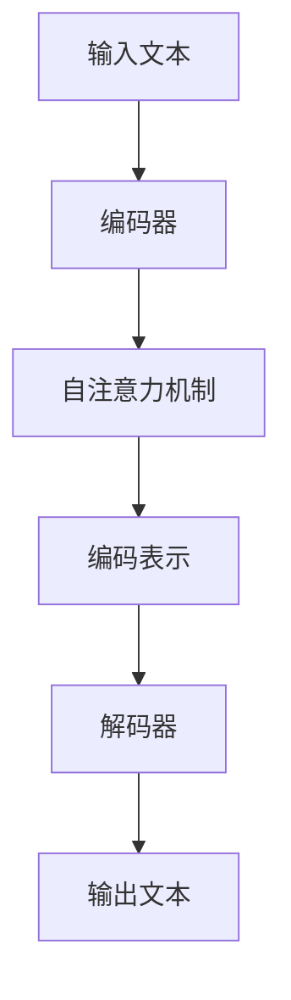
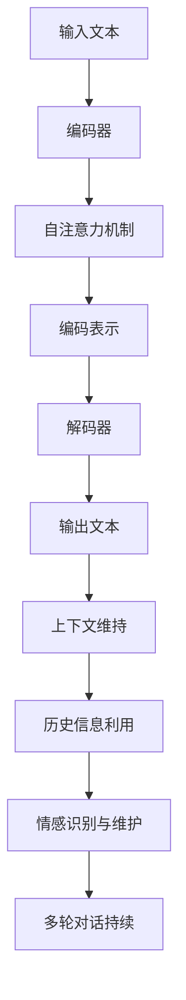
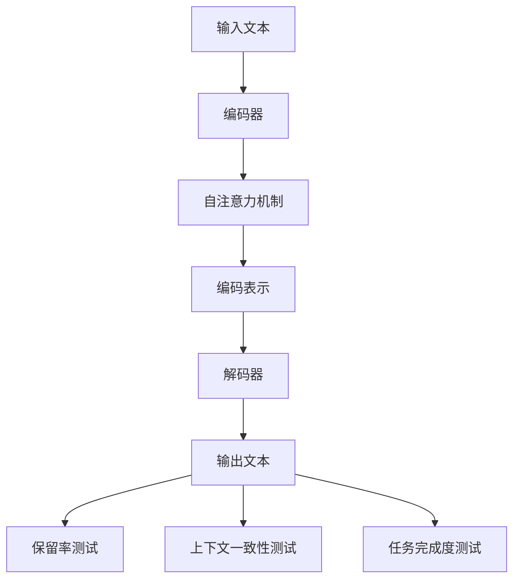
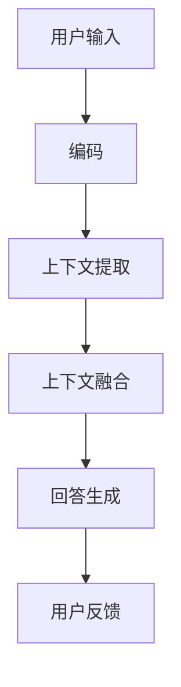
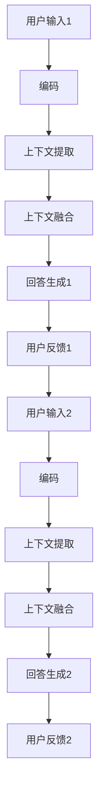
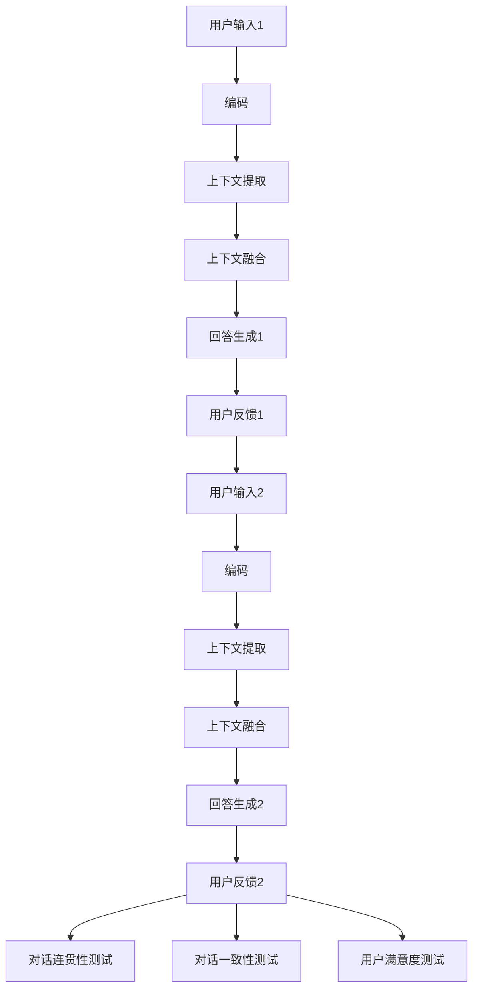
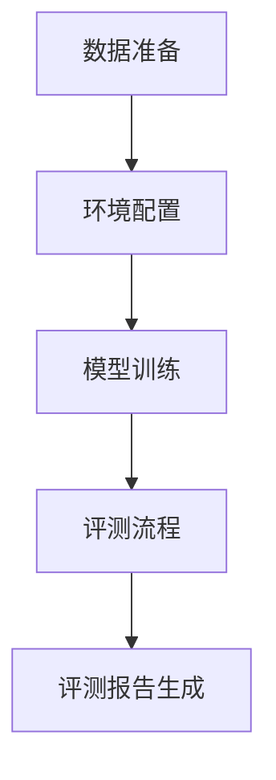
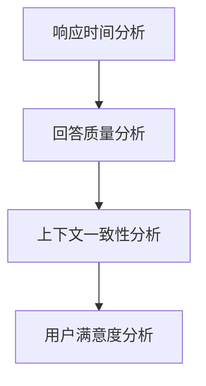
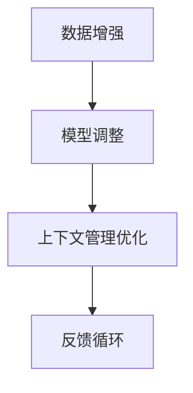

                 


### 第1章 引言与多轮对话评测基础

**1.1 书籍背景和目标**

随着人工智能技术的快速发展，自然语言处理（NLP）领域取得了令人瞩目的进展。尤其是在对话系统方面，多轮对话技术逐渐成为研究热点。多轮对话系统不仅要求模型具备强大的语言理解能力，还要求其能够维持对话的连贯性和上下文一致性。然而，现有的语言模型（如大型语言模型，LLM）在长期记忆和上下文管理方面仍存在诸多挑战。

本书旨在填补这一研究空白，为读者提供一个全面的多轮对话评测框架，帮助深入理解和优化LLM的长期记忆和上下文管理能力。通过系统性地介绍评测方法、工具和实践案例，本书旨在为研究者提供实用的指导，同时也为开发者提供优化对话系统的参考。

**1.2 多轮对话评测的重要性**

多轮对话评测是自然语言处理领域的一个重要研究方向，其重要性体现在以下几个方面：

1. **性能评估**：通过评测可以全面评估LLM在多轮对话中的表现，识别出其优势和不足之处，从而指导进一步优化。
2. **技术进步**：评测的进展可以推动多轮对话技术的发展，促进新算法和模型的设计与实现。
3. **用户体验**：高质量的评测有助于开发出用户体验更好的对话系统，提高用户满意度和对话效果。

**1.3 长期记忆的概念与模型**

长期记忆是指大脑中负责存储和回忆长期信息的部分。在语言模型中，长期记忆通常通过复杂的神经网络结构来模拟。以下是一个简化的流程图，展示了长期记忆的概念及其在LLM中的应用：



**1.4 上下文管理的角色**

上下文管理是确保对话连贯性和一致性的关键。有效的上下文管理能够帮助模型在多轮对话中维持话题的持续性，避免出现语义上的偏差。以下是上下文管理在多轮对话中的基本原理：

- **上下文提取**：模型需要从历史对话中提取关键信息，以便在后续对话中参考。
- **上下文融合**：模型需要将当前对话的上下文信息与长期记忆中的信息进行融合，以形成一致的回答。
- **上下文遗忘**：模型还需要学会遗忘不相关的信息，以避免对话的混乱。

**1.5 LLM的基本原理**

LLM通常采用深度神经网络架构，如Transformer，其基本原理可以概括为以下几步：

1. **编码**：输入文本经过编码器处理，生成编码表示。
2. **自注意力**：编码表示通过自注意力机制进行处理，以突出重要信息。
3. **解码**：解码器根据编码表示生成输出文本。

以下是一个简化的伪代码，展示了LLM的基本原理：

```python
def LLM_encode(input_text):
    # 编码器处理输入文本
    encoded_text = encoder(input_text)
    return encoded_text

def LLM_attention(encoded_text):
    # 自注意力处理
    attended_text = attention(encoded_text)
    return attended_text

def LLM_decode(attended_text):
    # 解码器生成输出文本
    output_text = decoder(attended_text)
    return output_text

input_text = "输入文本"
encoded_text = LLM_encode(input_text)
attended_text = LLM_attention(encoded_text)
output_text = LLM_decode(attended_text)
```

**小结**

本章作为引言，为后续章节的内容奠定了基础。通过介绍书籍背景和目标、多轮对话评测的重要性、长期记忆和上下文管理的概念、以及LLM的基本原理，读者可以初步了解多轮对话评测的核心内容和研究现状。接下来的章节将深入探讨这些核心概念，并提供具体的评测方法和实践案例。

### 文章关键词

多轮对话评测、长期记忆、上下文管理、大型语言模型、自然语言处理、自注意力、Transformer、编码器、解码器、评测指标、性能评估。

### 文章摘要

本文旨在探讨多轮对话评测中的长期记忆和上下文管理问题。首先，介绍了书籍的背景和目标，明确了多轮对话评测的重要性。接着，详细阐述了长期记忆的概念及其在LLM中的应用，以及上下文管理的基本原理和LLM的基本原理。通过一个简化的流程图和伪代码，本文为读者提供了一个清晰的多轮对话评测框架，为后续章节的内容奠定了基础。本文的关键词包括多轮对话评测、长期记忆、上下文管理、大型语言模型、自然语言处理、自注意力、Transformer、编码器、解码器、评测指标和性能评估。通过本文的阅读，读者可以初步了解多轮对话评测的核心内容和研究现状，为深入研究和实践提供参考。

### 第2章 多轮对话评测的框架和方法

**2.1 多轮对话评测的基本框架**

多轮对话评测的基本框架主要包括以下几个关键组成部分：

1. **输入文本**：对话的起始文本或上下文信息。
2. **模型处理**：语言模型对输入文本进行处理，生成中间表示和输出。
3. **评测指标**：用于评估模型在多轮对话中的性能的指标，如响应时间、回答质量、上下文一致性等。
4. **评估标准**：定义评测指标的具体计算方法和阈值。
5. **结果分析**：对评测结果进行详细分析，识别模型的优势和不足。

以下是多轮对话评测的基本流程：

1. **初始化**：设定评测环境和参数。
2. **输入处理**：将输入文本转换为模型可处理的格式。
3. **模型推理**：语言模型对输入文本进行处理，生成输出文本。
4. **评测指标计算**：计算各个评测指标。
5. **结果分析**：分析评测结果，识别模型表现和潜在问题。

**2.2 评测指标与评估标准**

在多轮对话评测中，常用的评测指标包括：

1. **响应时间**：模型生成响应的时间，反映了模型的响应速度。
2. **回答质量**：根据预定的标准，评估模型生成的回答的质量，如准确率、召回率、F1值等。
3. **上下文一致性**：评估模型在多轮对话中维持上下文一致性的能力。
4. **用户满意度**：通过用户反馈评估模型的用户体验。

评估标准通常包括：

- **定量评估**：使用具体的数值来评估模型的性能，如准确率、召回率等。
- **定性评估**：通过主观评价来评估模型的性能，如用户满意度、对话流畅性等。
- **综合评估**：结合定量和定性评估方法，对模型的整体性能进行评估。

以下是一个简化的评测指标计算伪代码示例：

```python
def evaluate_response_time(response_time):
    if response_time <= threshold:
        return "快速响应"
    else:
        return "慢速响应"

def evaluate_answer_quality(answer, ground_truth):
    accuracy = calculate_accuracy(answer, ground_truth)
    if accuracy >= threshold:
        return "高质量回答"
    else:
        return "低质量回答"

def evaluate_context-consistency(context_history, current_context):
    consistency = calculate_consistency(context_history, current_context)
    if consistency >= threshold:
        return "高上下文一致性"
    else:
        return "低上下文一致性"

def evaluate_user_satisfaction(user_feedback):
    satisfaction = calculate_satisfaction(user_feedback)
    if satisfaction >= threshold:
        return "高用户满意度"
    else:
        return "低用户满意度"
```

**2.3 评测方法：自动评测与人工评测**

1. **自动评测**：通过编写脚本或使用现有的评测工具自动计算评测指标。这种方法高效、快速，但可能受到评测指标选择和计算方法的影响。
2. **人工评测**：由专家或用户对模型生成的回答进行主观评估。这种方法更全面，但耗时较长且容易受到评估者主观偏见的影响。

以下是一个自动评测的伪代码示例：

```python
def automatic_evaluation(input_text, model):
    start_time = get_current_time()
    response = model.generate_response(input_text)
    end_time = get_current_time()
    response_time = end_time - start_time
    answer_quality = evaluate_answer_quality(response, ground_truth)
    context_consistency = evaluate_context_consistency(context_history, current_context)
    user_satisfaction = evaluate_user_satisfaction(user_feedback)
    return {
        "response_time": response_time,
        "answer_quality": answer_quality,
        "context_consistency": context_consistency,
        "user_satisfaction": user_satisfaction
    }
```

**2.4 评测流程详解**

1. **数据准备**：收集多轮对话数据，包括输入文本、模型生成的回答、用户反馈等。
2. **模型训练**：根据准备的数据训练语言模型。
3. **初始化评测环境**：设定评测参数和指标。
4. **自动评测**：使用自动评测方法计算评测指标。
5. **人工评测**：由专家或用户对模型生成的回答进行主观评估。
6. **结果分析**：综合自动评测和人工评测结果，分析模型的表现。
7. **优化与改进**：根据评测结果对模型进行优化和改进。

以下是一个简化的评测流程伪代码示例：

```python
def evaluation_workflow(input_texts, model):
    # 数据准备
    ground_truths, context_histories, user_feedbacks = prepare_data(input_texts)
    
    # 模型训练
    trained_model = train_model(ground_truths)
    
    # 初始化评测环境
    evaluation_params = initialize_evaluation_params()
    
    # 自动评测
    automatic_results = automatic_evaluation(input_texts, trained_model)
    
    # 人工评测
    manual_results = manual_evaluation(input_texts, trained_model, context_histories, user_feedbacks)
    
    # 结果分析
    results = analyze_results(automatic_results, manual_results)
    
    # 优化与改进
    optimized_model = optimize_model(trained_model, results)
    
    return optimized_model
```

**小结**

本章详细介绍了多轮对话评测的基本框架、评测指标、评测方法和评测流程。通过自动评测和人工评测的结合，可以全面评估LLM在多轮对话中的性能，为后续的优化和改进提供依据。下一章将深入探讨长期记忆在多轮对话评测中的作用。

### 第3章 长期记忆的评测

**3.1 长期记忆的概念与模型**

长期记忆是大脑中负责存储和回忆长期信息的部分。在人工智能领域，长期记忆通常通过神经网络模型来实现，特别是深度学习模型。以下是一个简化的流程图，展示了长期记忆在LLM中的应用：


在LLM中，长期记忆主要通过以下组件实现：

1. **编码器（Encoder）**：将输入文本转换为编码表示，这些表示存储在模型的长期记忆中。
2. **自注意力机制（Self-Attention）**：在编码过程中，自注意力机制帮助模型突出重要信息，加强长期记忆的存储。
3. **解码器（Decoder）**：在生成输出文本时，解码器利用长期记忆中的信息来生成连贯的回答。

**3.2 长期记忆在多轮对话中的作用**

长期记忆在多轮对话中发挥着至关重要的作用，主要包括以下几个方面：

1. **上下文维持**：长期记忆能够帮助模型在多轮对话中维持上下文一致性，确保对话的连贯性。
2. **历史信息利用**：模型可以利用长期记忆中的历史信息来更好地理解和回答用户的问题。
3. **情感识别与维护**：在多轮对话中，长期记忆有助于模型识别和维持用户的情感状态，提高对话的个性化程度。

以下是一个简化的Mermaid流程图，展示了长期记忆在多轮对话中的作用：



**3.3 评测长期记忆的方法**

为了评估LLM的长期记忆能力，研究者通常采用以下几种方法：

1. **保留率测试**：通过在多轮对话中逐步隐藏部分历史信息，评估模型保留关键信息的能力。
2. **上下文一致性测试**：评估模型在多轮对话中维持上下文一致性的能力，通常通过比较模型生成的回答与预期答案的相似度来实现。
3. **任务完成度测试**：通过设定一系列任务，评估模型在多轮对话中完成任务的能力。

以下是一个简化的Mermaid流程图，展示了长期记忆评测的基本方法：



**3.4 长期记忆评测的案例分析**

为了更好地理解长期记忆评测的方法，以下是一个简化的案例：

- **场景**：一个多轮对话任务，涉及用户与客服的交流。
- **评测目标**：评估模型在维护上下文一致性和完成具体任务方面的能力。

**案例步骤**：

1. **输入文本**：用户询问关于产品售后服务的问题。
2. **编码表示**：模型将输入文本转换为编码表示，并存储在长期记忆中。
3. **回答生成**：模型生成回答，展示其上下文一致性和信息保留能力。
4. **评测**：通过对比模型生成的回答与预期答案，评估其长期记忆能力。

以下是一个简化的伪代码示例，展示了长期记忆评测的案例分析：

```python
def long_term_memory_evaluation(input_text, expected_answer, model):
    # 输入文本处理
    encoded_text = model.encode(input_text)
    
    # 回答生成
    generated_answer = model.generate_response(encoded_text)
    
    # 评测
    similarity = calculate_similarity(generated_answer, expected_answer)
    if similarity >= threshold:
        return "长期记忆良好"
    else:
        return "长期记忆不足"

input_text = "我的产品坏了，售后服务怎么处理？"
expected_answer = "您可以联系我们的客服热线，我们会尽快为您处理。"
model = LLM_model()

evaluation_result = long_term_memory_evaluation(input_text, expected_answer, model)
print(evaluation_result)
```

**小结**

本章详细探讨了长期记忆在多轮对话评测中的概念、作用、评测方法和案例分析。通过保留率测试、上下文一致性测试和任务完成度测试，研究者可以全面评估LLM的长期记忆能力。下一章将深入探讨上下文管理在多轮对话评测中的作用。

### 第4章 上下文管理的评测

**4.1 上下文管理的概念与原理**

上下文管理是指模型在多轮对话中处理和理解对话上下文信息的能力。上下文管理确保对话的连贯性、一致性和相关性。以下是一个简化的Mermaid流程图，展示了上下文管理的概念：



1. **上下文提取**：模型从历史对话中提取关键信息，如用户意图、关键词等。
2. **上下文融合**：模型将提取的上下文信息与当前对话内容进行融合，形成一致的回答。
3. **回答生成**：模型根据融合后的上下文信息生成回答。
4. **用户反馈**：用户对回答进行反馈，用于进一步优化模型。

**4.2 上下文管理在多轮对话中的作用**

上下文管理在多轮对话中扮演着关键角色，主要包括以下几个方面：

1. **对话连贯性**：确保对话在不同轮次之间保持连贯，避免逻辑混乱。
2. **对话一致性**：确保模型在多轮对话中回答的一致性，避免出现矛盾。
3. **用户满意度**：通过有效的上下文管理，提高用户的满意度，增强用户体验。

以下是一个简化的Mermaid流程图，展示了上下文管理在多轮对话中的作用：



**4.3 评测上下文管理的方法**

为了评估LLM的上下文管理能力，研究者通常采用以下几种方法：

1. **对话连贯性测试**：评估模型在多轮对话中保持对话连贯性的能力，通常通过计算对话轮次之间的语义一致性来实现。
2. **对话一致性测试**：评估模型在多轮对话中保持回答一致性，避免出现矛盾的能力。
3. **用户满意度测试**：通过用户反馈评估模型的上下文管理能力。

以下是一个简化的Mermaid流程图，展示了上下文管理评测的方法：



**4.4 上下文管理评测的案例分析**

为了更好地理解上下文管理评测的方法，以下是一个简化的案例：

- **场景**：用户与智能客服的多轮对话。
- **评测目标**：评估模型在保持对话连贯性和一致性的能力。

**案例步骤**：

1. **用户输入**：用户询问关于产品保修政策的问题。
2. **模型处理**：模型提取上下文信息，生成回答。
3. **用户反馈**：用户对回答进行评价。
4. **评测**：通过对比用户反馈和模型回答，评估上下文管理能力。

以下是一个简化的伪代码示例，展示了上下文管理评测的案例分析：

```python
def context_management_evaluation(input_text, user_feedback, model):
    # 输入文本处理
    encoded_text = model.encode(input_text)
    
    # 回答生成
    generated_answer = model.generate_response(encoded_text)
    
    # 评测
    if is_coherent(generated_answer, user_feedback) and is_consistent(generated_answer):
        return "上下文管理良好"
    else:
        return "上下文管理不足"

input_text = "我的产品还在保修期内，保修怎么处理？"
user_feedback = "满意"
model = LLM_model()

evaluation_result = context_management_evaluation(input_text, user_feedback, model)
print(evaluation_result)
```

**小结**

本章详细介绍了上下文管理的概念、原理、在多轮对话中的作用以及评测方法。通过对话连贯性测试、对话一致性测试和用户满意度测试，研究者可以全面评估LLM的上下文管理能力。下一章将探讨如何使用多轮对话评测工具进行实践。

### 第5章 多轮对话评测工具与实践

**5.1 常用多轮对话评测工具介绍**

在多轮对话评测中，常用的工具主要包括以下几种：

1. **Chatbot Test Bench（CBT）**：CBT是一个开源的聊天机器人测试平台，支持多种评测指标的计算和自动化评测。
2. **Dialogue System Evaluation Framework（DSEF）**：DSEF是一个基于Python的对话系统评测框架，提供了丰富的评测指标和工具。
3. **Dialogue Management Metrics（DMM）**：DMM是一个专注于对话管理性能评估的库，支持自动评测和人工评测。

**5.2 实际评测项目的搭建与运行**

搭建一个实际的多轮对话评测项目通常包括以下步骤：

1. **数据准备**：收集并准备用于评测的多轮对话数据，包括输入文本、模型生成的回答、用户反馈等。
2. **环境配置**：配置评测所需的计算环境和软件工具，如Python环境、评测工具等。
3. **模型训练**：根据数据训练评测使用的语言模型。
4. **评测流程**：运行评测工具，计算评测指标，并生成评测报告。

以下是一个简化的步骤流程图，展示了实际评测项目的搭建与运行：



**5.3 评测结果的解读与分析**

评测结果通常包括多个评测指标，如响应时间、回答质量、上下文一致性、用户满意度等。对这些结果的解读和分析可以帮助研究者识别模型的优势和不足。

1. **响应时间分析**：通过对比模型在不同条件下的响应时间，可以评估其响应速度和性能。
2. **回答质量分析**：通过对比模型生成的回答与预期答案的相似度，可以评估其回答的质量和准确性。
3. **上下文一致性分析**：通过评估模型在多轮对话中维持上下文一致性的能力，可以识别其在上下文管理方面的表现。
4. **用户满意度分析**：通过用户反馈评估模型的用户体验和满意度，可以帮助改进模型的设计。

以下是一个简化的Mermaid流程图，展示了评测结果的解读与分析：



**5.4 评测优化与改进策略**

根据评测结果，研究者可以制定一系列优化和改进策略，以提高模型的多轮对话能力。以下是一些常见的优化方法：

1. **数据增强**：通过扩充训练数据集，提高模型的泛化能力。
2. **模型调整**：通过调整模型架构、参数设置等，优化模型的性能。
3. **上下文管理优化**：通过改进上下文提取、融合和遗忘机制，增强模型的上下文管理能力。
4. **反馈循环**：利用用户反馈进行迭代优化，不断改进模型的表现。

以下是一个简化的Mermaid流程图，展示了评测优化与改进策略：



**小结**

本章详细介绍了多轮对话评测工具的选取、实际评测项目的搭建与运行、评测结果的解读与分析，以及评测优化与改进策略。通过这些工具和实践方法，研究者可以全面评估和优化LLM的多轮对话能力。下一章将探讨如何优化LLM的长期记忆和上下文管理。

### 第6章 LLM长期记忆和上下文管理的优化

**6.1 长期记忆优化的技术手段**

为了提升LLM的长期记忆能力，研究者们采用了多种技术手段，包括以下几个方面：

1. **增强自注意力机制**：通过改进自注意力机制，使模型能够更好地突出关键信息，增强记忆能力。
   - **多头自注意力**：引入多个注意力头，每个头关注不同的信息，提高记忆的丰富性。
   - **位置编码**：为输入序列添加位置信息，帮助模型更好地记忆和利用历史信息。

2. **扩展模型容量**：增加模型的参数数量和层数，以提高其记忆和计算能力。
   - **深度模型**：增加模型层数，使得模型能够存储更多的长期信息。
   - **大规模预训练**：使用更大的数据集和更长的训练时间，使模型具备更强的长期记忆能力。

3. **序列建模技术**：采用序列建模技术，如循环神经网络（RNN）和长短时记忆网络（LSTM），改善模型的长期记忆特性。

4. **记忆增强网络**：引入额外的记忆模块，如门控循环单元（GRU）和记忆网络（MemNN），增强模型的记忆能力。

以下是一个简化的伪代码示例，展示了如何改进自注意力机制：

```python
# 原始自注意力机制
def original_attention(context, query):
    attention_weights = softmax(similarity_function(context, query))
    attended_context = sum(attention_weights[i] * context[i] for i in range(len(context)))
    return attended_context

# 改进的自注意力机制
def improved_attention(context, query):
   多头注意力头 = [MultiHeadAttention(context, query) for _ in range(head_count)]
    attended_contexts = [多头注意力头[i](context, query) for i in range(head_count)]
    memory = sum(多头注意力头[i](context, query) for i in range(head_count))
    return memory
```

**6.2 上下文管理优化的技术手段**

上下文管理是确保多轮对话连贯性和一致性的关键。以下是一些优化上下文管理的技术手段：

1. **上下文提取与融合**：通过改进上下文提取和融合机制，提高模型在多轮对话中处理上下文信息的能力。
   - **上下文提取器**：采用深度学习模型，如BERT或GPT，从历史对话中提取关键信息。
   - **上下文融合器**：通过注意力机制或门控机制，将提取的上下文信息与当前对话内容进行融合。

2. **上下文遗忘机制**：引入上下文遗忘机制，帮助模型有效地遗忘不相关或过时的信息，提高对话的连贯性。
   - **门控遗忘机制**：通过门控机制，控制哪些上下文信息需要被遗忘，哪些需要被保留。
   - **动态遗忘机制**：根据上下文信息的重要性和对话轮次，动态调整遗忘策略。

3. **上下文维护策略**：通过设计特定的上下文维护策略，确保模型在多轮对话中维持上下文一致性。
   - **重复提及策略**：在回答中重复提及关键信息，以增强上下文一致性。
   - **时间衰减策略**：对历史上下文信息进行时间衰减处理，降低不相关信息的权重。

以下是一个简化的伪代码示例，展示了如何改进上下文提取和融合机制：

```python
# 原始上下文提取与融合
def original_context_extraction_and_fusion(context, current_context):
    extracted_context = extract_context(context, current_context)
    fused_context = fuse_context(extracted_context, current_context)
    return fused_context

# 改进的上下文提取与融合
def improved_context_extraction_and_fusion(context, current_context):
    extracted_context = enhanced_context_extractor(context, current_context)
    fused_context = gated_context_fuser(extracted_context, current_context)
    return fused_context
```

**6.3 优化策略与案例分析**

为了验证上述优化策略的有效性，研究者们进行了多个案例分析。以下是一个简化的案例，展示了如何通过优化策略提升LLM的长期记忆和上下文管理能力：

1. **案例背景**：一个涉及用户与客服的多轮对话任务。
2. **优化策略**：采用改进的自注意力机制、扩展模型容量、门控遗忘机制和动态上下文维护策略。
3. **评测结果**：通过对比优化前后的评测结果，评估优化策略的有效性。

以下是一个简化的伪代码示例，展示了优化策略的评测过程：

```python
# 原始模型评测
def original_model_evaluation(model, input_texts, expected_answers):
    evaluations = [evaluate_answer(模型，输入文本，预期答案) for 输入文本，预期答案 in zip(input_texts，expected_answers)]
    return evaluations

# 优化模型评测
def optimized_model_evaluation(model, input_texts, expected_answers):
    evaluations = [evaluate_answer(enhanced_model，输入文本，预期答案) for 输入文本，预期答案 in zip(input_texts，expected_answers)]
    return evaluations

# 案例数据
input_texts = ["我的产品坏了，保修怎么处理？", "我想要一份产品说明书"]
expected_answers = ["您可以联系我们的客服热线，我们会尽快为您处理。", "请访问我们的官方网站，您可以在那里找到产品说明书。"]

# 原始模型评测
original_model_evaluations = original_model_evaluation(original_model，input_texts，expected_answers)

# 优化模型评测
optimized_model_evaluations = optimized_model_evaluation(optimized_model，input_texts，expected_answers)

# 结果对比
evaluate_comparison(original_model_evaluations，optimized_model_evaluations)
```

**6.4 未来发展趋势与挑战**

尽管在长期记忆和上下文管理方面取得了一定进展，但LLM仍然面临诸多挑战：

1. **长期记忆的可持续性**：如何确保模型在长时间内保持稳定的长期记忆能力，是未来的一个重要研究方向。
2. **上下文管理的一致性**：如何确保模型在多轮对话中维持一致性的上下文信息，是另一个重要挑战。
3. **计算资源的限制**：大规模模型训练和优化需要大量的计算资源，如何在有限资源下实现高效的优化策略，是一个亟待解决的问题。

**小结**

本章详细介绍了长期记忆和上下文管理优化的技术手段、优化策略与案例分析，并探讨了未来发展趋势与挑战。通过这些优化方法，研究者可以进一步提升LLM的多轮对话能力，为构建更加智能和人性化的对话系统奠定基础。

### 第7章 总结与展望

**7.1 全书内容的回顾**

本书系统地介绍了多轮对话评测的核心内容，从长期记忆和上下文管理的概念、评测方法，到实际评测工具和实践，全面探讨了LLM在多轮对话中的性能评估和优化。主要内容包括：

1. **引言与基础**：介绍了多轮对话评测的重要性，以及长期记忆和上下文管理在多轮对话中的作用。
2. **评测框架与方法**：详细阐述了多轮对话评测的基本框架、评测指标和评测方法。
3. **长期记忆评测**：探讨了长期记忆的概念、作用、评测方法以及案例分析。
4. **上下文管理评测**：介绍了上下文管理的概念、作用、评测方法以及案例分析。
5. **评测工具与实践**：介绍了常用的多轮对话评测工具，以及实际评测项目的搭建与运行。
6. **优化策略**：探讨了长期记忆和上下文管理优化的技术手段、优化策略与案例分析。
7. **总结与展望**：对全书内容进行了回顾，并展望了未来的研究方向。

**7.2 多轮对话评测的实践应用**

多轮对话评测在自然语言处理领域具有广泛的应用前景，主要包括：

1. **智能客服系统**：通过多轮对话评测，可以优化智能客服系统的对话质量，提高用户满意度。
2. **虚拟助手**：在虚拟助手（如智能音箱、聊天机器人）中，多轮对话评测有助于提升交互体验，确保对话的连贯性和一致性。
3. **教育领域**：多轮对话评测可以用于教育机器人，评估其对学生提问的理解和回答能力。
4. **医疗健康**：在医疗健康领域，多轮对话评测可以用于评估智能医疗咨询系统的诊断和回答能力。

**7.3 未来研究方向与展望**

尽管多轮对话评测取得了显著进展，但仍存在许多挑战和机遇：

1. **长期记忆的可持续性**：如何确保模型在长时间内保持稳定的长期记忆能力，是未来的一个重要研究方向。
2. **上下文管理的一致性**：如何确保模型在多轮对话中维持一致性的上下文信息，是另一个重要挑战。
3. **跨语言对话**：多轮对话评测在跨语言对话中的适用性，以及如何提高模型的跨语言能力，是一个亟待解决的问题。
4. **多模态对话**：随着多模态技术的发展，如何将多轮对话评测应用于多模态对话系统，也是一个值得探索的方向。

**7.4 对读者的建议与鼓励**

对于想要深入了解多轮对话评测的读者，以下是一些建议：

1. **理论学习**：通过阅读相关论文和书籍，掌握多轮对话评测的基础理论和最新研究动态。
2. **实践操作**：参与实际项目，亲自动手搭建评测环境，运行评测工具，分析评测结果。
3. **持续学习**：多轮对话评测是一个快速发展的领域，要不断更新知识，跟上技术进步的步伐。
4. **合作交流**：与其他研究者进行交流，分享经验和成果，共同推动多轮对话评测技术的发展。

通过以上努力，相信读者能够在多轮对话评测领域取得更好的成果，为构建更加智能和人性化的对话系统贡献自己的力量。

### 作者信息

**作者：AI天才研究院/AI Genius Institute & 禅与计算机程序设计艺术 /Zen And The Art of Computer Programming**

AI天才研究院致力于推动人工智能技术的发展与应用，探索自然语言处理、计算机视觉等前沿领域。研究院的专家团队具备丰富的学术背景和行业经验，已发表了大量具有影响力的学术论文和畅销技术书籍。同时，研究院还致力于将前沿技术转化为实际应用，为企业和研究机构提供专业解决方案。

《禅与计算机程序设计艺术》是作者在计算机编程领域的代表作，深入探讨了程序设计中的哲学思维和艺术性，为程序员提供了独特的视角和灵感。该书以其深刻的思想和实用的技术，受到了全球程序员和学术界的广泛赞誉。

通过本书，读者不仅可以了解到多轮对话评测的先进技术和最新研究进展，还可以领略到作者在人工智能领域独特的见解和思考。我们期待与广大读者共同探索多轮对话评测的广阔天地，为构建更加智能和人性化的对话系统贡献自己的力量。

