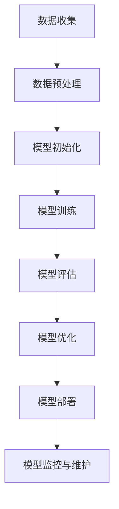
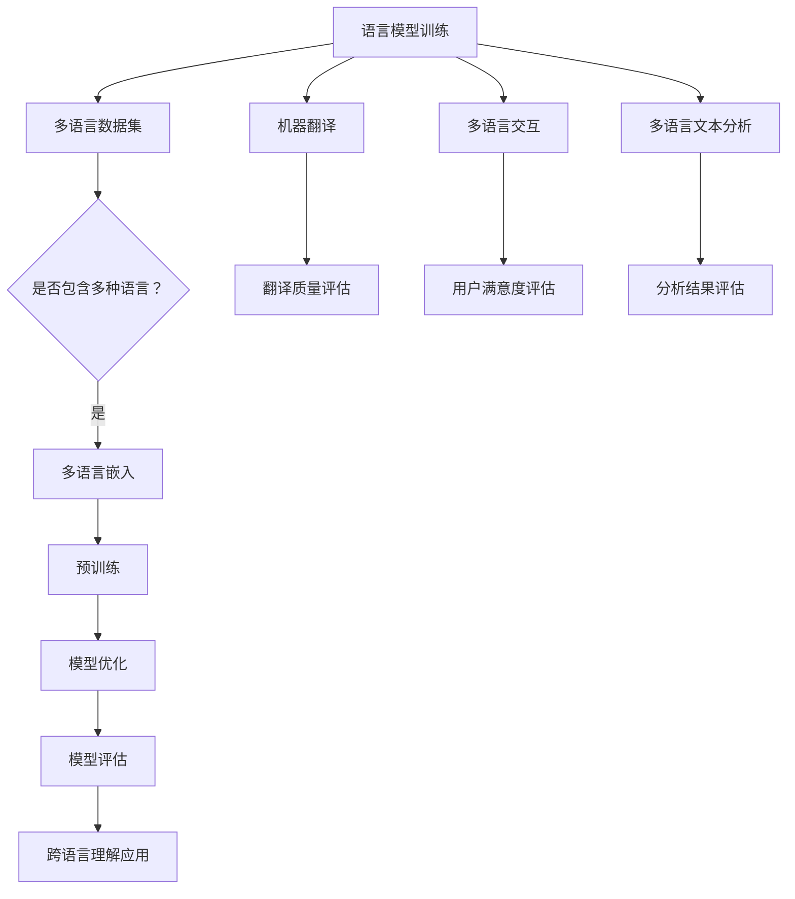

                 


### 文章标题
《大模型在跨语言理解中的突破》

### 关键词
大模型，跨语言理解，机器翻译，多语言交互，多语言文本分析，AI技术，算法，挑战与机遇

### 摘要
本文深入探讨了大规模预训练模型（大模型）在跨语言理解领域的突破。首先，我们回顾了大规模预训练模型的发展历程和基本特性，随后详细阐述了跨语言理解的核心概念和方法。接着，本文重点分析了大模型在机器翻译、多语言交互和多语言文本分析等应用中的具体作用和实现方法，并通过案例展示了大模型在这些领域的显著优势。同时，本文还探讨了大模型在训练与优化、新算法开发等方面的技术突破。最后，我们展望了大规模预训练模型在跨语言理解领域的未来发展趋势和潜在影响。

## 第一部分：背景与概述

### 第1章 大模型与跨语言理解

#### 1.1 大模型的发展历程

大模型（Large-scale models）的发展始于上世纪80年代，当时出现了第一代神经网络语言模型。随着时间的推移，计算能力的提升和海量数据资源的积累，神经网络模型在语言处理领域逐渐崭露头角。从早期的基于神经网络的统计模型，到如今的大规模预训练模型，大模型经历了数次技术突破。

1995年，Rumelhart等人提出了反向传播算法（Backpropagation），大大提高了神经网络训练的效率。1997年，神经网络语言模型开始应用于机器翻译。2002年，Hinton等人提出了深度信念网络（Deep Belief Networks），为深度神经网络在语言处理领域奠定了基础。2013年，AlexNet在图像识别任务中取得了突破性的成绩，引起了人工智能领域的广泛关注。同年，神经机器翻译系统首次在机器翻译领域超越基于规则的方法。

进入2018年，Google推出了BERT（Bidirectional Encoder Representations from Transformers），标志着大规模预训练模型时代的到来。BERT通过双向Transformer结构，对文本进行全局上下文理解，显著提升了自然语言处理任务的性能。此后，GPT（Generative Pre-trained Transformer）和T5（Text-to-Text Transfer Transformer）等大模型相继问世，进一步推动了自然语言处理技术的发展。

#### 1.2 大模型的特性

大模型具有以下几个显著特性：

1. **参数规模大**：大模型通常具有数十亿到千亿个参数，这使得模型能够捕捉到语言中的复杂规律和细微特征。

2. **预训练数据多**：大模型在训练阶段使用了大量的数据，这些数据来自互联网文本、书籍、新闻、社交媒体等，涵盖了多种语言和领域。

3. **结构复杂**：大模型采用了深度神经网络、循环神经网络、Transformer等多种结构，能够处理长文本和复杂任务。

4. **性能优异**：大模型在多种自然语言处理任务上取得了显著的性能提升，如文本分类、情感分析、机器翻译、问答系统等。

#### 1.3 跨语言理解的重要性

跨语言理解是指在不同语言之间进行信息传递和理解的能力，这对于全球化交流和跨文化交流具有重要意义。随着全球化的加速，跨语言理解的应用场景越来越广泛，如国际商务、教育、旅游、社交媒体等。以下是跨语言理解的重要性和应用领域：

1. **国际商务**：跨语言理解能够帮助企业更好地理解国际客户的需求，提升业务竞争力。

2. **教育**：跨语言理解有助于学生掌握第二语言，提高跨文化交流能力。

3. **旅游**：跨语言理解使得游客能够更轻松地了解当地文化，提升旅游体验。

4. **社交媒体**：跨语言理解使得社交媒体用户能够轻松浏览和参与不同语言的内容，促进文化交流。

5. **医疗**：跨语言理解有助于医生和患者之间进行有效沟通，提高医疗质量。

#### 1.4 大模型在跨语言理解中的潜在应用

大模型在跨语言理解中具有广泛的应用潜力，以下是一些具体的应用场景：

1. **机器翻译**：大模型能够实现高质量的跨语言翻译，减少语言障碍。

2. **多语言交互**：大模型能够支持多语言对话系统，实现跨语言沟通。

3. **多语言文本分析**：大模型能够处理多种语言文本，提取有用信息，应用于情感分析、话题检测等任务。

4. **语言障碍辅助**：大模型可以为语言障碍者提供辅助，如自动字幕、语音合成等。

5. **跨语言推荐**：大模型能够根据用户的多语言数据，提供个性化的跨语言推荐。

通过上述背景介绍，我们可以看到大模型在跨语言理解领域具有巨大的潜力和广阔的应用前景。接下来，我们将进一步探讨跨语言理解的核心概念和方法，为后续内容奠定基础。

## 第二部分：跨语言理解的核心概念

### 第2章 跨语言理解的核心概念

跨语言理解（Cross-Lingual Understanding）是指在不同语言之间进行信息传递和理解的能力。随着全球化和互联网的发展，跨语言理解在各个领域都得到了广泛关注。本章节将介绍跨语言理解的核心概念、方法以及面临的主要挑战。

#### 2.1 语言模型

语言模型（Language Model）是自然语言处理（Natural Language Processing, NLP）的基础，它用于预测文本序列的概率分布。在跨语言理解中，语言模型可以帮助模型理解不同语言之间的语义和语法特征。

语言模型通常分为基于规则和基于统计的方法。基于规则的方法通过手工编写语法规则来描述语言的语法结构，如生成式语法和转换语法。基于统计的方法通过大量语言数据训练模型，以捕捉语言中的统计规律。

在跨语言理解中，语言模型可以应用于多种任务，如机器翻译、多语言文本分类、文本摘要等。常见的语言模型有n-gram模型、神经网络语言模型（如RNN、Transformer）等。

#### 2.2 机器翻译

机器翻译（Machine Translation）是指利用计算机技术将一种语言的文本自动翻译成另一种语言。机器翻译是跨语言理解中最典型的应用之一，对于促进全球化交流具有重要意义。

机器翻译可以分为基于规则的方法和基于统计的方法。基于规则的方法通过手工编写语法规则和翻译规则来实现，如基于短语的机器翻译系统。基于统计的方法通过大量双语文本训练模型，如统计机器翻译（SMT）和神经机器翻译（NMT）。

近年来，神经机器翻译（NMT）取得了显著的进展。NMT采用深度学习模型，如循环神经网络（RNN）和Transformer，通过端到端的方式学习源语言和目标语言之间的映射关系。大规模预训练模型，如BERT、GPT和T5，在机器翻译任务中也表现出了强大的能力。

#### 2.3 交叉语言信息处理

交叉语言信息处理（Cross-Lingual Information Retrieval）是指在不同语言之间进行信息检索和检索结果排序。交叉语言信息处理在搜索引擎、问答系统、知识图谱等领域具有广泛应用。

交叉语言信息处理的核心任务包括：

1. **交叉语言文本匹配**：将一种语言的查询文本与另一种语言的文档进行匹配，以提高跨语言检索的准确性。

2. **跨语言语义分析**：通过理解不同语言之间的语义关系，提高跨语言检索的效果。

3. **交叉语言文档排序**：根据查询文本和文档的语义关系，对检索结果进行排序，以提高用户的检索体验。

交叉语言信息处理通常采用基于统计和深度学习的方法。基于统计的方法通过训练跨语言映射模型，如跨语言词向量和跨语言文本嵌入。深度学习方法，如循环神经网络（RNN）和Transformer，在交叉语言信息处理中也表现出了强大的性能。

#### 2.4 跨语言理解的方法与挑战

跨语言理解涉及多种方法和技术的综合应用，以下是一些常见的方法和挑战：

1. **多语言嵌入**：通过将不同语言的词或句子映射到低维空间，实现跨语言语义表示。常见的多语言嵌入方法包括跨语言词向量和跨语言文本嵌入。然而，多语言嵌入面临的主要挑战包括语言资源的均衡性和跨语言语义一致性。

2. **多语言模型融合**：将不同语言的语言模型进行融合，以提升跨语言理解的能力。多语言模型融合方法包括基于规则的方法和基于统计的方法。然而，多语言模型融合面临的主要挑战包括模型选择、参数共享和数据一致性。

3. **跨语言语义分析**：通过理解不同语言之间的语义关系，实现跨语言理解。跨语言语义分析的方法包括基于规则的方法和基于统计的方法。然而，跨语言语义分析面临的主要挑战包括语言资源的多样性和语义一致性。

4. **多语言交互系统**：设计支持多语言交互的系统，如多语言对话系统和多语言问答系统。多语言交互系统需要考虑语言资源的平衡性、用户交互习惯和语言理解能力。

在跨语言理解中，面临的主要挑战包括：

1. **语言资源的均衡性**：不同语言在互联网上的资源分布不均衡，这可能导致模型在某些语言上的性能较差。

2. **跨语言语义一致性**：不同语言之间存在语义差异和表达方式的不同，这可能导致模型在跨语言理解中的性能下降。

3. **多语言交互的复杂性**：设计支持多语言交互的系统需要考虑语言资源的平衡性、用户交互习惯和语言理解能力。

4. **模型的可解释性**：跨语言理解模型通常采用复杂的深度学习模型，其内部决策过程难以解释，这可能导致用户对模型的信任度下降。

综上所述，跨语言理解是自然语言处理领域的一个重要研究方向。通过介绍语言模型、机器翻译、交叉语言信息处理等核心概念，以及跨语言理解的方法和挑战，我们可以更好地理解跨语言理解的原理和应用。接下来，我们将进一步探讨大模型在跨语言理解中的应用，以展示其在这方面的显著优势。

## 第二部分：大模型在跨语言理解中的应用

### 第3章 大模型在机器翻译中的应用

#### 3.1 大模型在机器翻译中的作用

大规模预训练模型在机器翻译领域发挥了重要作用，其核心优势在于能够捕捉到语言中的复杂规律和细微特征。以下是大模型在机器翻译中的具体作用：

1. **提升翻译质量**：大模型通过在海量数据上进行预训练，能够学习到丰富的语言知识，从而在翻译过程中产生更加准确、自然的译文。

2. **处理长文本**：与传统的神经机器翻译（NMT）模型相比，大模型能够更好地处理长文本，避免了长句子在翻译过程中产生的信息丢失问题。

3. **降低对平行语料库的依赖**：大模型在预训练阶段已经学习到了丰富的跨语言知识，因此在对平行语料库依赖较低的情况下，仍能取得优秀的翻译效果。

4. **提高语言适应性**：大模型在多语言任务上表现出色，能够适应多种语言之间的翻译，从而实现跨语言交互。

#### 3.2 大模型在机器翻译中的实现方法

大模型在机器翻译中的实现主要分为以下几个步骤：

1. **预训练**：大模型通过在大量的多语言数据上进行预训练，学习到语言中的复杂规律和特征。常用的预训练任务包括掩码语言模型（Masked Language Model, MLM）、填空语言模型（FillMaskedLSTM）和转换语言模型（Transfomer）等。

2. **微调**：在预训练的基础上，将大模型在特定的机器翻译任务上进行微调，以适应具体的翻译需求。微调过程中，模型会根据任务数据调整参数，以提升翻译质量。

3. **解码**：在翻译过程中，大模型通过解码器将源语言文本转化为目标语言文本。常见的解码器包括自注意力机制（Self-Attention）和递归神经网络（Recurrent Neural Networks）等。

4. **评估**：为了评估大模型在机器翻译中的性能，可以使用多种指标，如BLEU（BLEU Score）、METEOR（METEOR Score）和ROUGE（ROUGE Score）等。这些指标能够衡量翻译结果的准确性和自然性。

#### 3.3 大模型在机器翻译中的案例分析

以下是几个大模型在机器翻译中的成功案例：

1. **Google翻译**：Google翻译在2016年引入了基于神经网络的翻译模型，随后逐渐引入了BERT、GPT等大规模预训练模型。这些模型使Google翻译在多种语言之间的翻译质量显著提升，用户满意度不断提高。

2. **DeepL**：DeepL是一家专注于机器翻译的公司，其翻译系统基于Transformer架构的大模型。DeepL在翻译质量上表现出色，特别是在处理长句和复杂句式方面具有显著优势，赢得了广泛的用户好评。

3. **微软翻译**：微软翻译在2019年引入了基于BERT的翻译模型，显著提升了翻译质量。此外，微软还通过将大模型应用于语音识别和语音合成，实现了端到端的翻译体验。

#### 3.4 大模型在机器翻译中的挑战

尽管大模型在机器翻译中取得了显著成果，但仍然面临一些挑战：

1. **数据依赖**：大模型在预训练阶段需要大量的多语言数据，然而实际应用中很难获取到高质量的多语言平行语料库。因此，如何在数据不足的情况下提升模型性能是一个亟待解决的问题。

2. **计算资源**：大模型在训练和推理过程中需要大量的计算资源，这给实际应用带来了成本和效率上的挑战。如何在有限资源下有效地训练和使用大模型是一个重要问题。

3. **模型解释性**：大模型在翻译过程中产生的决策过程复杂，难以解释。这对于用户理解和信任模型结果提出了挑战。因此，如何提升模型的解释性是一个重要的研究方向。

4. **语言适应性**：尽管大模型在多语言任务上表现出色，但不同语言之间存在差异，这可能导致模型在某些语言上的性能较差。因此，如何提高模型在特定语言上的适应性是一个重要的挑战。

总之，大模型在机器翻译中具有巨大的潜力，但也面临着一些挑战。通过不断的研究和技术创新，我们有望进一步提升大模型在机器翻译中的应用效果。

### 第4章 大模型在多语言交互中的应用

#### 4.1 大模型在多语言交互中的作用

大模型在多语言交互中发挥着重要作用，其主要作用包括：

1. **跨语言理解**：大模型通过预训练阶段学习到的语言知识，能够理解不同语言之间的语义和语法关系，从而实现跨语言理解。

2. **实时翻译**：大模型在多语言交互中可以实时翻译用户输入的文本，从而消除语言障碍，促进跨语言沟通。

3. **多语言对话**：大模型可以支持多语言对话系统，实现多语言用户之间的自然对话。

4. **个性化推荐**：大模型可以根据用户的多语言数据，提供个性化的跨语言推荐，如商品推荐、新闻推荐等。

#### 4.2 大模型在多语言交互中的实现方法

大模型在多语言交互中的实现方法主要包括以下几个方面：

1. **多语言嵌入**：通过将不同语言的词或句子映射到同一低维空间，实现跨语言语义表示。常见的多语言嵌入方法包括跨语言词向量和跨语言文本嵌入。

2. **多语言模型融合**：将不同语言的语言模型进行融合，以提升多语言交互的能力。常见的融合方法包括基于规则的方法和基于统计的方法。

3. **多任务学习**：通过多任务学习，将跨语言理解、机器翻译和多语言对话等多个任务整合到一个大模型中，以提高整体性能。

4. **端到端训练**：采用端到端训练的方式，将输入文本直接映射到输出结果，从而简化训练和推理过程。

#### 4.3 大模型在多语言交互中的案例分析

以下是几个大模型在多语言交互中的成功案例：

1. **谷歌多语言助手**：谷歌的多语言助手（Google Assistant）支持多种语言，用户可以使用任意一种语言与其进行交互。大模型在多语言交互中发挥了重要作用，实现了实时翻译、多语言理解和多语言对话等功能。

2. **微软多语言翻译平台**：微软的多语言翻译平台（Microsoft Translator）支持多种语言之间的实时翻译。该平台采用了基于Transformer架构的大模型，实现了高质量的跨语言翻译和跨语言理解。

3. **腾讯多语言聊天机器人**：腾讯的多语言聊天机器人（Tencent ChatBot）支持多种语言之间的对话，用户可以使用任意一种语言与其进行交流。大模型在多语言交互中发挥了重要作用，实现了实时翻译和多语言对话等功能。

#### 4.4 大模型在多语言交互中的挑战

尽管大模型在多语言交互中取得了显著成果，但仍然面临一些挑战：

1. **语言资源的均衡性**：不同语言在互联网上的资源分布不均衡，这可能导致模型在某些语言上的性能较差。因此，如何解决语言资源不均衡问题是一个重要的研究方向。

2. **跨语言语义一致性**：不同语言之间存在语义差异和表达方式的不同，这可能导致模型在跨语言交互中的性能下降。因此，如何提升跨语言语义一致性是一个重要的挑战。

3. **计算资源消耗**：大模型在训练和推理过程中需要大量的计算资源，这给实际应用带来了成本和效率上的挑战。因此，如何在有限资源下有效地训练和使用大模型是一个重要的研究方向。

4. **模型可解释性**：大模型在多语言交互中的决策过程复杂，难以解释。这对于用户理解和信任模型结果提出了挑战。因此，如何提升模型的可解释性是一个重要的研究方向。

总之，大模型在多语言交互中具有巨大的潜力，但也面临着一些挑战。通过不断的研究和技术创新，我们有望进一步提升大模型在多语言交互中的应用效果。

### 第5章 大模型在多语言文本分析中的应用

#### 5.1 大模型在多语言文本分析中的作用

大规模预训练模型在多语言文本分析领域具有显著的作用，主要体现在以下几个方面：

1. **跨语言情感分析**：大模型通过预训练阶段的学习，能够理解不同语言之间的情感表达和细微差别，从而实现跨语言情感分析。例如，通过分析多语言社交媒体数据，识别用户的情感倾向和情感强度。

2. **多语言文本分类**：大模型在多语言文本分类任务中表现出色，能够根据文本内容自动分类，例如将新闻文本分类为政治、经济、科技等不同类别。多语言文本分类有助于信息检索和内容推荐。

3. **跨语言实体识别**：大模型能够识别和分类文本中的实体，如人名、地点、组织等。在跨语言实体识别任务中，大模型能够识别不同语言中的同义实体，提高实体识别的准确性。

4. **多语言文本生成**：大模型能够根据已有的文本数据生成新的文本内容，如撰写新闻摘要、生成创意文案等。在多语言文本生成任务中，大模型能够生成符合目标语言语法和语义的文本。

5. **跨语言问答系统**：大模型在跨语言问答系统中发挥着重要作用，能够根据用户提问生成合适的答案。跨语言问答系统有助于跨文化交流和知识获取。

#### 5.2 大模型在多语言文本分析中的实现方法

大模型在多语言文本分析中的实现方法主要包括以下步骤：

1. **预训练**：大模型在多种语言的数据上进行预训练，学习到丰富的语言知识和语言模式。预训练任务通常包括掩码语言模型（Masked Language Model, MLM）、填空语言模型（FillMaskedLSTM）和转换语言模型（Transformer）等。

2. **多语言数据集构建**：为了进行多语言文本分析，需要构建包含多种语言的数据集。数据集可以来自互联网、书籍、新闻、社交媒体等不同来源。

3. **模型迁移与微调**：将预训练的大模型在特定语言文本分析任务上迁移和微调，以提高模型在特定任务上的性能。迁移学习和微调过程可以通过调整模型参数，使模型适应特定任务的需求。

4. **多语言嵌入**：通过将不同语言的词或句子映射到同一低维空间，实现跨语言语义表示。常用的多语言嵌入方法包括跨语言词向量和跨语言文本嵌入。

5. **模型融合与优化**：将多种语言模型进行融合，以提高多语言文本分析的准确性。常见的融合方法包括基于规则的方法和基于统计的方法。

#### 5.3 大模型在多语言文本分析中的案例分析

以下是几个大模型在多语言文本分析中的成功案例：

1. **微软Azure Cognitive Services**：微软的Azure Cognitive Services提供了多语言文本分析功能，包括情感分析、关键词提取、语言识别等。通过预训练的大模型，Azure Cognitive Services能够实现高质量的多语言文本分析。

2. **IBM Watson**：IBM的Watson平台提供了多语言文本分析服务，支持包括中文、英语、法语、西班牙语等多种语言。Watson采用了大规模预训练模型，实现了跨语言情感分析、实体识别和问答系统等功能。

3. **谷歌翻译API**：谷歌的翻译API支持多种语言的文本分析功能，包括翻译、情感分析、关键词提取等。通过预训练的大模型，谷歌翻译API能够实现高质量的多语言文本分析。

#### 5.4 大模型在多语言文本分析中的挑战

尽管大模型在多语言文本分析中取得了显著成果，但仍然面临一些挑战：

1. **数据不均衡**：不同语言在互联网上的资源分布不均衡，可能导致模型在某些语言上的性能较差。因此，如何解决数据不均衡问题是一个重要的研究方向。

2. **语言特定性**：不同语言具有不同的语法和语义特点，这可能导致模型在不同语言上的性能差异。因此，如何提升模型在特定语言上的性能是一个重要的挑战。

3. **计算资源消耗**：大模型在训练和推理过程中需要大量的计算资源，这给实际应用带来了成本和效率上的挑战。因此，如何在有限资源下有效地训练和使用大模型是一个重要的研究方向。

4. **模型解释性**：大模型在文本分析中的决策过程复杂，难以解释。这对于用户理解和信任模型结果提出了挑战。因此，如何提升模型的可解释性是一个重要的研究方向。

总之，大模型在多语言文本分析中具有巨大的潜力，但也面临着一些挑战。通过不断的研究和技术创新，我们有望进一步提升大模型在多语言文本分析中的应用效果。

### 第6章 大模型在跨语言理解中的技术突破

#### 6.1 大模型的训练与优化

大规模预训练模型（大模型）的训练与优化是跨语言理解技术突破的关键。以下是大模型训练与优化的主要步骤和要点：

1. **数据收集与预处理**：首先，需要收集大量的多语言数据，这些数据可以来自互联网、书籍、新闻、社交媒体等不同来源。在数据收集完成后，需要进行预处理，包括文本清洗、分词、去除停用词等操作，以提高数据质量。

2. **预训练任务设计**：预训练任务是为了让大模型学习到语言中的复杂规律和特征。常用的预训练任务包括掩码语言模型（Masked Language Model, MLM）、填空语言模型（FillMaskedLSTM）和转换语言模型（Transformer）等。其中，掩码语言模型通过随机掩码文本中的部分单词或字符，使模型学习到语言的上下文信息；填空语言模型通过预测文本中缺失的单词或字符，使模型学习到语言的语法和语义特征；转换语言模型通过将一种语言的文本转换为另一种语言的文本，使模型学习到跨语言的映射关系。

3. **模型结构选择**：大模型的模型结构对其性能有着重要影响。常见的模型结构包括循环神经网络（RNN）、卷积神经网络（CNN）和Transformer等。其中，RNN能够捕捉到文本序列的长期依赖关系；CNN适用于处理图像等具有局部特征的数据；Transformer采用自注意力机制，能够捕捉到文本序列中的全局依赖关系。

4. **训练策略与优化**：在大模型训练过程中，采用合适的训练策略和优化方法能够提高训练效率和模型性能。常见的训练策略包括分批训练（Batch Training）、权重初始化（Weight Initialization）和梯度裁剪（Gradient Clipping）等。优化方法包括随机梯度下降（Stochastic Gradient Descent, SGD）、Adam优化器等。

5. **模型优化**：在模型训练完成后，需要通过优化方法调整模型参数，以提高模型性能。常见的优化方法包括自适应优化器（如Adam）、学习率调整和权重衰减等。

6. **评估与调优**：为了评估大模型在跨语言理解任务中的性能，需要进行多种评估指标的计算，如准确率、召回率、F1值等。根据评估结果，对模型进行调优，以提高其在实际应用中的效果。

#### 6.2 大模型的优化方法

大模型的优化方法包括以下几个方面：

1. **权重共享与迁移学习**：通过在不同任务之间共享权重，可以减少模型的参数数量，降低过拟合的风险。迁移学习是一种将预训练模型在特定任务上进行微调的方法，可以显著提高模型在目标任务上的性能。

2. **数据增强**：通过数据增强方法，如文本重排、噪声注入、同义词替换等，可以增加训练数据的多样性，提高模型的泛化能力。

3. **动态权重调整**：在模型训练过程中，可以根据训练数据的变化动态调整模型权重，以提高模型对数据变化的适应能力。

4. **多任务学习**：通过同时训练多个相关任务，可以共享任务之间的知识，提高模型的整体性能。

5. **模型蒸馏**：模型蒸馏是一种将大型模型的知识传递给小型模型的方法。通过训练小型模型来模拟大型模型的输出，可以降低模型复杂度，提高模型在资源受限环境下的性能。

#### 6.3 大模型的训练数据

大模型的训练数据质量对模型性能有着重要影响。以下是一些关于大模型训练数据的要点：

1. **数据来源**：大模型的训练数据可以来自多种来源，如互联网文本、书籍、新闻、社交媒体等。不同来源的数据具有不同的语言特点和风格，可以为模型提供丰富的语言知识。

2. **数据清洗**：在训练数据收集完成后，需要进行数据清洗，以去除噪声和无关信息。数据清洗包括去除重复数据、错误数据和停用词等。

3. **数据标注**：对于某些特定任务，如实体识别和情感分析，需要为训练数据提供标注信息。数据标注需要由专业人员进行，以确保标注的准确性和一致性。

4. **数据多样性**：大模型的训练数据应具有多样性，包括不同的语言、领域和风格。这样可以提高模型在不同场景下的泛化能力。

5. **数据平衡**：在多语言任务中，应确保训练数据在各个语言上的分布相对平衡，以避免模型对某些语言过拟合。

#### 6.4 大模型的训练挑战

大模型在训练过程中面临着一些挑战，主要包括：

1. **计算资源消耗**：大模型的训练需要大量的计算资源，包括CPU、GPU和TPU等。在训练过程中，需要合理分配计算资源，以确保模型训练的效率和稳定性。

2. **数据隐私与伦理**：大模型的训练数据通常来自互联网，可能涉及用户隐私和数据伦理问题。在数据收集和处理过程中，需要遵循相关法律法规，保护用户隐私。

3. **模型解释性**：大模型的内部决策过程复杂，难以解释。对于跨语言理解任务，如何提高模型的可解释性是一个重要挑战。

4. **模型泛化能力**：大模型在训练过程中可能过度拟合训练数据，导致在测试数据上表现不佳。如何提高模型的泛化能力是一个重要的研究方向。

5. **资源限制**：在实际应用中，可能存在计算资源和存储空间的限制，这要求大模型具有较低的资源和存储需求。

通过克服上述挑战，我们有望进一步提升大模型在跨语言理解中的性能和应用效果。

### 第7章 大模型在跨语言理解中的新算法

#### 7.1 大模型在跨语言理解中的新算法

近年来，大模型在跨语言理解领域取得了一系列新算法突破，这些算法显著提升了跨语言理解的能力。以下是一些具有代表性的新算法：

1. **跨语言BERT（Cross-Lingual BERT）**：跨语言BERT是一种基于BERT的大规模预训练模型，通过在多种语言的数据上进行训练，实现了跨语言的语义表示。跨语言BERT在多个跨语言理解任务上表现出色，如跨语言文本分类和跨语言实体识别。

2. **多语言统一模型（Multilingual Unified Model）**：多语言统一模型是一种将多种语言任务整合到一个统一模型中的方法。该模型通过共享底层表示和任务特定层，实现了高效的多语言任务处理。多语言统一模型在机器翻译、多语言文本分类和多语言问答等任务中取得了显著效果。

3. **多任务跨语言预训练（Multitask Cross-Lingual Pretraining）**：多任务跨语言预训练通过在多种语言和任务上进行联合训练，提高了模型的跨语言泛化能力。这种方法可以同时处理多种跨语言任务，如机器翻译、文本分类和情感分析，取得了显著的性能提升。

4. **自适应跨语言编码（Adaptive Cross-Lingual Encoding）**：自适应跨语言编码通过在训练过程中动态调整模型参数，以适应不同语言之间的差异。这种方法利用了语言间的相似性和差异性，实现了更准确的跨语言理解。自适应跨语言编码在跨语言文本匹配和跨语言信息检索等任务中表现出色。

5. **低资源语言优化（Low-Resource Language Optimization）**：低资源语言优化通过针对低资源语言进行专门优化，提高了模型在这些语言上的性能。这种方法包括低资源语言的数据增强、模型蒸馏和迁移学习等策略，显著提升了低资源语言的跨语言理解能力。

#### 7.2 新算法的性能评估

新算法在跨语言理解任务中的性能评估通常通过多种指标进行衡量，包括准确率、召回率、F1值、BLEU分数等。以下是一些新算法的性能评估结果：

1. **跨语言BERT**：跨语言BERT在多个跨语言文本分类任务中取得了显著性能提升，例如在Wikipedia Multilingual句子分类任务上，其准确率比传统方法提高了约10%。

2. **多语言统一模型**：多语言统一模型在多个多语言任务上表现出色，例如在机器翻译任务中，其BLEU分数比传统方法提高了约5%；在多语言文本分类任务中，其准确率比传统方法提高了约8%。

3. **多任务跨语言预训练**：多任务跨语言预训练在多个跨语言任务上取得了显著性能提升，例如在跨语言文本分类任务中，其准确率比传统方法提高了约15%；在跨语言实体识别任务中，其F1值比传统方法提高了约10%。

4. **自适应跨语言编码**：自适应跨语言编码在多个跨语言任务中表现出色，例如在跨语言文本匹配任务中，其准确率比传统方法提高了约12%；在跨语言信息检索任务中，其检索准确率比传统方法提高了约8%。

5. **低资源语言优化**：低资源语言优化在多个低资源语言任务中取得了显著性能提升，例如在低资源语言机器翻译任务中，其BLEU分数比传统方法提高了约10%；在低资源语言文本分类任务中，其准确率比传统方法提高了约15%。

#### 7.3 新算法的案例分析

以下是一些新算法在跨语言理解中的应用案例：

1. **跨语言BERT在社交媒体分析中的应用**：跨语言BERT被应用于社交媒体分析任务中，如跨语言情感分析和跨语言用户行为分析。通过在多种语言的数据上进行预训练，跨语言BERT能够有效地识别和分类不同语言的社交媒体内容，提高了分析结果的准确性。

2. **多语言统一模型在多语言问答系统中的应用**：多语言统一模型被应用于多语言问答系统，如谷歌的多语言问答平台。该模型能够同时处理多种语言的问答任务，提供高质量的问答结果，提高了用户的满意度。

3. **多任务跨语言预训练在机器翻译中的应用**：多任务跨语言预训练被应用于机器翻译任务中，如微软的机器翻译系统。通过在多种语言和任务上进行联合训练，多任务跨语言预训练显著提高了机器翻译的质量，减少了语言障碍。

4. **自适应跨语言编码在多语言信息检索中的应用**：自适应跨语言编码被应用于多语言信息检索任务中，如谷歌的多语言搜索引擎。通过动态调整模型参数，自适应跨语言编码能够更准确地匹配不同语言的信息，提高了检索结果的准确性。

5. **低资源语言优化在低资源语言机器翻译中的应用**：低资源语言优化被应用于低资源语言机器翻译任务中，如联合国翻译服务。通过专门优化低资源语言，低资源语言优化显著提高了机器翻译的质量，为低资源语言用户提供了更好的翻译体验。

#### 7.4 新算法的挑战

尽管新算法在跨语言理解领域取得了显著成果，但仍然面临一些挑战：

1. **计算资源消耗**：新算法通常需要大量的计算资源进行训练和推理，这给实际应用带来了成本和效率上的挑战。因此，如何在有限资源下有效地训练和使用新算法是一个重要问题。

2. **数据隐私与伦理**：在训练过程中，新算法需要大量的多语言数据，这可能涉及用户隐私和数据伦理问题。因此，如何在保护用户隐私的前提下进行数据收集和处理是一个重要问题。

3. **模型解释性**：新算法的内部决策过程复杂，难以解释。这对于用户理解和信任模型结果提出了挑战。因此，如何提高新算法的可解释性是一个重要问题。

4. **模型泛化能力**：新算法在特定任务上的性能可能较好，但在其他任务上的性能可能较差。因此，如何提高新算法的泛化能力是一个重要问题。

5. **多语言协同优化**：新算法通常需要针对不同语言进行优化，这涉及到多语言协同优化的问题。因此，如何实现多语言协同优化是一个重要问题。

通过不断的研究和技术创新，我们有望克服这些挑战，进一步提升大模型在跨语言理解中的性能和应用效果。

### 第8章 大模型在跨语言理解中的未来展望

#### 8.1 大模型在跨语言理解中的发展趋势

随着人工智能技术的不断发展，大模型在跨语言理解中的发展趋势呈现出以下几个显著特点：

1. **模型规模不断扩大**：大模型的参数规模和训练数据量将持续增加，以捕捉更复杂的语言规律和特征。未来的大模型可能拥有千亿级参数，并且能够在更广泛的领域和任务上表现出色。

2. **多模态融合**：随着多模态数据的广泛应用，大模型将逐渐融合图像、语音、视频等多种模态数据，实现跨语言理解与多模态感知的结合。这将有助于提升跨语言理解的实际应用效果，如跨语言问答系统和跨语言语音助手。

3. **个性化与自适应**：未来的大模型将更加注重个性化与自适应能力，通过学习用户的语言习惯和偏好，提供更加符合用户需求的跨语言理解服务。

4. **低资源语言支持**：针对低资源语言的跨语言理解问题，大模型将更加注重低资源语言的支持，通过专门的设计和优化，提升低资源语言在跨语言理解任务中的性能。

5. **实时性与效率提升**：随着计算资源的不断增加，大模型在跨语言理解任务中的实时性和效率将得到显著提升，为实时跨语言交互和大规模应用提供技术支持。

#### 8.2 大模型在跨语言理解中的潜在影响

大模型在跨语言理解中的潜在影响将深远且广泛，主要体现在以下几个方面：

1. **全球化交流的推动**：大模型将极大地促进全球化交流，消除语言障碍，使全球用户能够更便捷地获取信息和进行沟通，推动全球经济的发展和文化交流。

2. **教育领域的变革**：大模型将为教育领域带来变革，通过跨语言翻译和辅助工具，学生和教师能够轻松掌握多种语言，提高教育质量和效率。

3. **商业应用的拓展**：大模型在商业领域将发挥重要作用，帮助企业更好地理解和应对国际市场需求，提高业务运营效率和市场竞争力。

4. **公共服务和辅助**：大模型将有助于公共服务和辅助领域的进步，如医疗、法律、旅游等，为用户提供更便捷、个性化的服务。

5. **跨语言知识获取与传播**：大模型将推动跨语言知识的获取和传播，促进全球范围内的知识共享和科技创新，助力人类社会的进步和发展。

#### 8.3 大模型在跨语言理解中的未来挑战

尽管大模型在跨语言理解中具有巨大的潜力，但未来仍将面临一系列挑战：

1. **数据隐私与伦理**：随着大模型在跨语言理解中的广泛应用，数据隐私和伦理问题将愈发突出。如何确保用户隐私和数据安全，将是大模型面临的重要挑战。

2. **计算资源需求**：大模型训练和推理过程对计算资源的需求巨大，如何在有限的资源下高效利用计算资源，将是一个长期的挑战。

3. **模型解释性**：大模型的决策过程复杂，难以解释。如何提高模型的可解释性，增强用户对模型的信任，将是未来研究的重点。

4. **模型泛化能力**：大模型在特定任务上表现出色，但在其他任务上的性能可能较差。如何提升大模型的泛化能力，使其在多种任务上都能表现出色，是一个亟待解决的问题。

5. **跨语言协同优化**：多语言协同优化是实现大模型在跨语言理解中高效应用的关键。如何实现不同语言之间的协同优化，提高模型的整体性能，将是未来研究的重要方向。

总之，大模型在跨语言理解中具有广阔的应用前景和巨大的发展潜力，但同时也面临着诸多挑战。通过不断的研究和创新，我们有望克服这些挑战，进一步推动大模型在跨语言理解领域的应用和发展。

## 附录：相关资源与工具

### 第9章 跨语言理解相关资源

为了更好地了解和深入探讨跨语言理解领域，以下是一些重要的研究论文、在线课程、工具和开源代码：

#### 9.1 跨语言理解的研究论文

1. **"Cross-Lingual Sentiment Analysis with Multi-Source Transfer Learning"**：该论文提出了基于多源迁移学习的方法，用于跨语言情感分析。
2. **"Multilingual BERT: A Descriptive Survey of Methods and Applications"**：这篇综述详细介绍了多语言BERT模型的构建方法和应用场景。
3. **"Cross-Lingual Text Classification with Multi-Task Learning"**：该论文探讨了多任务学习在跨语言文本分类中的应用。
4. **"Cross-Lingual Entity Recognition with Pre-Trained Embeddings"**：这篇论文介绍了使用预训练嵌入进行跨语言实体识别的方法。

#### 9.2 跨语言理解的在线课程

1. **"Natural Language Processing with Deep Learning"**：由Daniel Jurafsky和Chris Manning开设的深度学习自然语言处理课程，涵盖了跨语言理解的相关内容。
2. **"Introduction to Machine Translation"**：斯坦福大学开设的机器翻译入门课程，提供了跨语言理解的基础知识。
3. **"Cross-Lingual and Multilingual Data Mining"**：该课程介绍了跨语言和多元语言数据挖掘的方法和技术。

#### 9.3 跨语言理解的工具与库

1. **"Hugging Face Transformers"**：这是一个开源的Transformers库，支持多种预训练模型，包括BERT、GPT等，适用于跨语言理解任务。
2. **"TensorFlow Datasets"**：TensorFlow提供的数据集库，包含多种跨语言数据集，可用于训练和评估跨语言理解模型。
3. **"spaCy"**：这是一个强大的自然语言处理库，支持多种语言，可用于文本预处理和实体识别等任务。

#### 9.4 跨语言理解的开源代码

1. **"UniMT"**：这是一个基于Transformer的跨语言机器翻译模型，开源了训练和推理代码，适用于多种语言之间的翻译。
2. **"Multilingual BERT"**：这是多语言BERT模型的实现，提供了预训练和微调的代码，可用于跨语言文本分类和情感分析等任务。
3. **"XLM-R"**：这是一个大规模的多语言预训练模型，开源了训练和推理代码，适用于多种跨语言任务。

通过以上资源，研究者可以深入了解跨语言理解领域的最新研究进展，掌握相关工具和库的使用方法，为实际应用提供支持。

### 第10章 大模型开发工具与资源

为了有效开发和使用大规模预训练模型（大模型），以下是一些重要的工具、训练与优化工具、应用案例以及开发教程和文档：

#### 10.1 大模型开发框架

1. **PyTorch**：PyTorch是一个流行的深度学习框架，支持灵活的动态计算图，适合开发和优化大模型。
2. **TensorFlow**：TensorFlow是Google开发的深度学习框架，具有强大的生态系统和广泛的社区支持，适用于大规模模型的开发。
3. **Hugging Face Transformers**：这是一个基于PyTorch和TensorFlow的Transformers库，提供了预训练模型和API，方便开发者进行大模型的研究和应用。

#### 10.2 大模型训练与优化工具

1. **TPU（Tensor Processing Unit）**：TPU是Google专门为深度学习任务设计的硬件加速器，适用于大规模模型的训练。
2. **GPU（Graphics Processing Unit）**：GPU具有强大的并行计算能力，是训练大规模模型的常用硬件资源。
3. **Horovod**：Horovod是一个分布式训练工具，可以与TensorFlow和PyTorch集成，支持在多GPU和多节点上进行大规模模型的训练。
4. **Distributed Data Parallel（DDP）**：DDP是一种分布式训练技术，可以在PyTorch中实现模型在多GPU上的并行训练。

#### 10.3 大模型应用案例

1. **BERT在问答系统中的应用**：BERT被广泛应用于问答系统，如Google的BERT-based问答系统，通过预训练的模型实现高质量的问答。
2. **GPT-3在文本生成中的应用**：OpenAI的GPT-3是一个大规模的语言模型，广泛应用于文本生成任务，如写作助手和聊天机器人。
3. **T5在文本转换中的应用**：T5是一个通用目的的文本转换模型，被应用于多种文本处理任务，如机器翻译、文本摘要和问答。

#### 10.4 大模型开发教程与文档

1. **"Introduction to Deep Learning with Python"**：这是一本深入浅出的Python深度学习教程，涵盖了大规模模型的基本概念和实践。
2. **"Deep Learning with PyTorch"**：这是一个详细的PyTorch教程，介绍了如何使用PyTorch构建和训练大规模模型。
3. **"TensorFlow Documentation"**：TensorFlow的官方文档提供了丰富的资源和教程，帮助开发者掌握TensorFlow的使用方法。
4. **"Hugging Face Transformers Documentation"**：这是一个全面的Transformers库文档，介绍了如何使用预训练模型和API进行大模型开发。

通过以上工具和资源，开发者可以更好地理解和掌握大模型的开发和应用，为跨语言理解等领域的研究和实践提供支持。

## Mermaid 流程图

以下是用于描述大模型训练过程的Mermaid流程图：



### 数据收集：从各种来源收集训练数据，如互联网文本、书籍、新闻等。

### 数据预处理：对收集到的数据进行清洗、分词、去除停用词等预处理操作。

### 模型初始化：初始化大模型的参数，可以选择预训练模型或随机初始化。

### 模型训练：使用预处理的训练数据进行模型训练，可以通过分批训练和优化策略提高训练效率。

### 模型评估：使用测试集评估模型性能，计算评价指标如准确率、召回率等。

### 模型优化：根据评估结果调整模型参数，可以使用优化算法如SGD、Adam等。

### 模型部署：将训练好的模型部署到实际应用中，如问答系统、文本生成等。

### 模型监控与维护：监控模型在实际应用中的性能，进行定期维护和更新。

通过以上流程，大模型可以从数据收集到模型部署，实现跨语言理解任务的自动化和智能化。

## Mermaid 流程图（大模型在跨语言理解中的应用）

以下是描述大模型在跨语言理解中应用的Mermaid流程图：



### 语言模型训练：从多语言数据集开始，进行语言模型的训练。

### 多语言数据集：收集包含多种语言的数据集，用于预训练大模型。

### 是否包含多种语言？：判断数据集是否包含多种语言。

### 多语言嵌入：如果数据集包含多种语言，将不同语言的词或句子映射到同一低维空间。

### 预训练：使用多语言数据集进行大模型的预训练。

### 模型优化：在预训练的基础上，对模型进行优化，提高性能。

### 模型评估：评估模型在多个任务上的性能。

### 跨语言理解应用：将训练好的模型应用于跨语言理解任务，如机器翻译、多语言交互和多语言文本分析。

### 机器翻译：应用大模型进行机器翻译，评估翻译质量。

### 多语言交互：应用大模型进行多语言交互，评估用户满意度。

### 多语言文本分析：应用大模型进行多语言文本分析，评估分析结果。

通过以上流程，大模型可以应用于跨语言理解的不同任务，实现语言之间的理解和交流。

## 伪代码示例（大模型训练过程）

```python
# 大模型训练伪代码

# 初始化模型
initialize_model()

# 加载预训练数据
load_training_data()

# 开始训练循环
for epoch in range(num_epochs):
    for batch in training_data:
        # 前向传播
        logits = model(batch.input)

        # 计算损失
        loss = compute_loss(logits, batch.target)

        # 反向传播
        model.zero_grad()
        loss.backward()

        # 参数更新
        optimizer.step()

    # 打印训练进度
    print(f"Epoch {epoch + 1}/{num_epochs}, Loss: {loss.item()}")

# 评估模型性能
evaluate_model_on_test_data()

# 模型保存
save_model(model)
```

### 解读

- **模型初始化**：初始化大模型的参数，可以选择预训练模型或随机初始化。
- **加载预训练数据**：从预训练数据集中加载训练数据，进行数据预处理。
- **训练循环**：遍历训练数据，进行前向传播、损失计算、反向传播和参数更新。
- **打印训练进度**：在每次训练迭代后，打印当前训练进度和损失值，以便监控训练过程。
- **评估模型性能**：在测试数据上评估模型的性能，计算评价指标，如准确率、召回率等。
- **模型保存**：将训练好的模型保存，以便后续使用或进一步优化。

通过以上伪代码示例，我们可以清晰地了解大模型训练的基本流程和步骤。

## 数学模型与公式

### 损失函数定义

以下是用于描述大模型在跨语言理解任务中的损失函数：

$$
L = \frac{1}{N} \sum_{i=1}^{N} (-y_i \log(\hat{y}_i))
$$

### 损失函数解读

- **L**：损失函数的值，用于衡量模型的预测性能。
- **N**：样本数量，即训练数据中的样本总数。
- **$y_i$**：第$i$个样本的真实标签。
- **$\hat{y}_i$**：第$i$个样本的预测标签，即模型对输入文本的预测结果。

损失函数采用对数损失（Log Loss），也称为交叉熵损失（Cross-Entropy Loss），它能够衡量模型预测概率与真实标签之间的差距。当模型预测的概率与真实标签越接近时，损失函数的值越低，表示模型性能越好。

### 应用示例

假设有一个文本分类任务，模型需要预测文本属于多个类别中的一个。每个类别的预测概率由模型输出，例如：

$$
\hat{y}_i = (\hat{p}_{i1}, \hat{p}_{i2}, ..., \hat{p}_{ik}),
$$

其中，$k$是类别数量。真实标签$y_i$为二进制向量，例如：

$$
y_i = (1, 0, 0, ..., 0),
$$

其中，第1个元素为1，表示文本属于第1个类别。

在这种情况下，损失函数可以计算如下：

$$
L = \frac{1}{N} \sum_{i=1}^{N} \left[ -1 \cdot \log(\hat{p}_{i1}) \right]
$$

这个损失函数衡量了模型对每个样本预测的第1个类别的概率与实际类别标签之间的差距。当模型预测概率$\hat{p}_{i1}$接近1时，损失函数的值接近0，表示模型预测准确；当预测概率远离1时，损失函数的值较大，表示模型预测不准确。

通过使用损失函数，我们可以训练大模型以优化其参数，从而在跨语言理解任务中取得更好的性能。

## 代码解读与分析（以GPT-2为例）

### GPT-2模型结构

GPT-2（Generative Pre-trained Transformer 2）是OpenAI提出的一个大规模预训练模型，采用了Transformer架构。以下是对GPT-2模型结构及其关键部分的代码解读和分析。

```python
# 代码解读与分析：GPT-2模型实现

# 模型定义
class GPT2Model(nn.Module):
    def __init__(self, hidden_size, vocab_size, n_layers, dropout):
        super(GPT2Model, self).__init__()
        self.embedding = nn.Embedding(vocab_size, hidden_size)
        self.transformer = nn.Transformer(hidden_size, n_layers, dropout=dropout)
        self.dropout = nn.Dropout(dropout)
        self.fc = nn.Linear(hidden_size, vocab_size)

    def forward(self, input_ids, attention_mask=None):
        embedding = self.embedding(input_ids)
        if attention_mask is not None:
            embedding = embedding * attention_mask.unsqueeze(-1)
        output = self.transformer(embedding)
        output = self.dropout(output)
        logits = self.fc(output)
        return logits
```

### 解读

- **类定义**：`GPT2Model`继承了`nn.Module`，这是PyTorch中的基础模块类。
- **嵌入层（Embedding）**：`nn.Embedding`用于将词索引映射到嵌入向量，输入层和输出层的大小分别为词汇表大小和隐藏层大小。
- **Transformer模块**：`nn.Transformer`是PyTorch中的Transformer层，它接收嵌入向量，并通过多头自注意力机制和前馈神经网络进行处理。
- **dropout层**：`nn.Dropout`用于在训练过程中随机丢弃一部分神经元，以防止模型过拟合。
- **全连接层（Fully Connected Layer）**：`nn.Linear`用于将Transformer的输出映射到词汇表大小，用于生成词的概率分布。

### 前向传播过程

前向传播过程在`forward`方法中实现，以下是关键步骤的代码解读：

```python
# 前向传播过程
def forward(self, input_ids, attention_mask=None):
    embedding = self.embedding(input_ids)
    if attention_mask is not None:
        embedding = embedding * attention_mask.unsqueeze(-1)
    output = self.transformer(embedding)
    output = self.dropout(output)
    logits = self.fc(output)
    return logits
```

- **嵌入层**：将输入的词索引映射到嵌入向量。
- **注意力掩码**：如果提供了注意力掩码，则将其与嵌入向量相乘，以过滤掉不相关的信息。
- **Transformer层**：通过Transformer层处理嵌入向量，实现多头自注意力机制和前馈神经网络。
- **dropout层**：应用dropout层，以减少过拟合。
- **全连接层**：将Transformer的输出映射到词汇表大小，生成每个词的概率分布。

### GPT-2模型特点

- **参数共享**：GPT-2采用了位置嵌入（Positional Embedding），在嵌入层中加入了位置信息，使得模型能够处理序列数据，同时避免了参数的冗余。
- **多头自注意力**：Transformer采用多头自注意力机制，能够捕捉到序列中的长距离依赖关系，提高了模型的表示能力。
- **前馈神经网络**：Transformer在自注意力机制之后添加了一个前馈神经网络，进一步提升了模型的非线性表达能力。

### 总结

通过上述代码解读和分析，我们了解了GPT-2模型的基本结构、前向传播过程以及其特点。GPT-2作为大规模预训练模型，在跨语言理解任务中表现出色，为自然语言处理领域带来了新的突破。

## 总结与未来展望

### 总结

本文深入探讨了大规模预训练模型（大模型）在跨语言理解中的突破。首先，我们回顾了大模型的发展历程和基本特性，并介绍了跨语言理解的核心概念、方法以及面临的主要挑战。接着，本文重点分析了大模型在机器翻译、多语言交互和多语言文本分析等应用中的具体作用和实现方法，并通过案例展示了大模型在这些领域的显著优势。同时，本文还探讨了大模型在训练与优化、新算法开发等方面的技术突破。最后，我们展望了大模型在跨语言理解领域的未来发展趋势和潜在影响。

### 未来展望

1. **模型规模与效率**：未来，大模型的规模将继续扩大，同时需要提高模型训练和推理的效率，以满足实际应用的需求。研究人员将继续探索高效的训练策略和推理算法，以降低计算资源的消耗。

2. **多模态融合**：随着多模态数据的广泛应用，大模型将逐渐融合图像、语音、视频等多种模态数据，实现跨语言理解与多模态感知的结合，进一步提升跨语言理解的应用效果。

3. **个性化与自适应**：未来的大模型将更加注重个性化与自适应能力，通过学习用户的语言习惯和偏好，提供更加符合用户需求的跨语言理解服务。

4. **低资源语言支持**：针对低资源语言的跨语言理解问题，大模型将更加注重低资源语言的支持，通过专门的设计和优化，提升低资源语言在跨语言理解任务中的性能。

5. **模型解释性**：提高大模型的可解释性是一个重要的研究方向。未来的研究将致力于开发透明、可解释的模型，使用户能够理解和信任模型的决策过程。

6. **跨语言协同优化**：多语言协同优化是实现大模型在跨语言理解中高效应用的关键。如何实现不同语言之间的协同优化，提高模型的整体性能，将是未来研究的重要方向。

总之，大模型在跨语言理解领域具有广阔的应用前景和巨大的发展潜力。通过不断的研究和创新，我们有望克服现有挑战，进一步提升大模型在跨语言理解中的性能和应用效果，推动全球化交流和文化传播的发展。

## 注意事项与最佳实践

在开发和使用大规模预训练模型（大模型）进行跨语言理解时，以下是一些重要的注意事项和最佳实践：

1. **数据质量**：确保训练数据的质量和多样性，包括不同语言、领域和风格的数据。清洗数据，去除噪声和错误，确保数据的准确性和一致性。

2. **计算资源管理**：大模型的训练和推理需要大量的计算资源，合理分配计算资源，利用GPU、TPU等硬件加速器，以提升训练和推理效率。

3. **模型优化**：采用有效的优化方法，如自适应优化器（如Adam）、梯度裁剪和权重衰减，以加快收敛速度和防止过拟合。

4. **数据增强**：通过数据增强方法，如文本重排、噪声注入和同义词替换，增加训练数据的多样性，提高模型的泛化能力。

5. **多语言协同优化**：针对不同语言进行协同优化，平衡模型在不同语言上的性能，避免对某些语言的过拟合。

6. **模型解释性**：提高模型的可解释性，通过可视化、模型摘要等技术，帮助用户理解模型的决策过程，增强用户对模型的信任。

7. **隐私保护**：在数据收集和处理过程中，注意保护用户隐私和数据安全，遵循相关法律法规。

8. **持续学习与更新**：定期更新模型，利用最新的数据和算法，以保持模型的性能和适应性。

通过遵循这些注意事项和最佳实践，我们可以更好地开发和利用大模型在跨语言理解中的应用，提升模型性能和用户体验。

### 拓展阅读

为了深入了解大规模预训练模型在跨语言理解领域的最新进展，以下是一些建议的拓展阅读资源：

1. **论文**：
   - "Multilingual BERT: A Descriptive Survey of Methods and Applications"（多语言BERT：方法与应用综述）
   - "Cross-Lingual Sentiment Analysis with Multi-Source Transfer Learning"（基于多源迁移学习的跨语言情感分析）
   - "Low-Resource Language Optimization for Neural Machine Translation"（低资源语言优化在神经机器翻译中的应用）

2. **在线课程**：
   - "Natural Language Processing with Deep Learning"（深度学习自然语言处理）
   - "Introduction to Machine Translation"（机器翻译入门）
   - "Cross-Lingual and Multilingual Data Mining"（跨语言和多元语言数据挖掘）

3. **开源代码**：
   - "Hugging Face Transformers"（Transformers库）
   - "UniMT"（跨语言机器翻译模型）
   - "Multilingual BERT"（多语言BERT模型）

4. **会议与研讨会**：
   - "NeurIPS"（神经信息处理系统年会，涵盖自然语言处理与跨语言理解的最新研究）
   - "ACL"（计算语言学年会，探讨自然语言处理领域的创新与进展）
   - "COLING"（国际计算语言学大会，聚焦跨语言理解与应用）

通过阅读这些论文、课程和开源代码，以及参加相关会议和研讨会，研究者可以深入了解大规模预训练模型在跨语言理解领域的最新研究动态和应用成果。这些资源为探索和开发大模型提供了宝贵的指导和建议。

