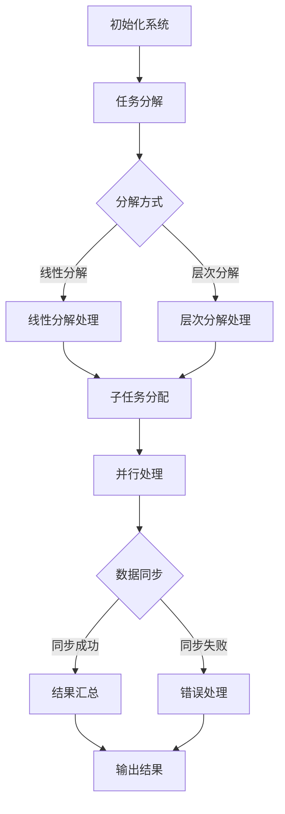

                 

### 文章标题：大规模并行评测的技术挑战与解决方案

在当今快速发展的信息技术时代，大规模并行评测已经成为各类计算任务中的重要组成部分。随着数据量的急剧增长和计算需求的日益复杂，如何高效地进行大规模并行评测，成为了业界和学术界共同关注的热点问题。本文将深入探讨大规模并行评测的技术挑战，并从多个角度提供解决方案和优化策略。

**关键词：大规模并行评测，技术挑战，解决方案，优化策略**

本文将按照以下结构展开：

1. **引言**
    - 1.1 书籍背景与目标
    - 1.2 大规模并行评测的重要性
    - 1.3 书籍结构概述

2. **大规模并行评测基础**
    - 2.1 并行评测概述
        - 2.1.1 并行评测的基本概念
        - 2.1.2 并行评测的优势与挑战
    - 2.2 并行架构基础
        - 2.2.1 并行架构的层级结构
        - 2.2.2 常见的并行评测架构

3. **并行评测算法**
    - 3.1 并行搜索算法
        - 3.1.1 基本并行搜索算法
        - 3.1.2 并行搜索算法的优化策略
    - 3.2 并行排序算法
        - 3.2.1 常见的并行排序算法
        - 3.2.2 并行排序算法的性能分析

4. **并行评测系统的设计**
    - 4.1 并行评测系统的需求分析
    - 4.2 系统架构设计
        - 4.2.1 并行评测核心模块
        - 4.2.2 数据流管理
    - 4.3 软硬件协同设计
        - 4.3.1 硬件选择与优化
        - 4.3.2 软件工具与框架的选择

5. **并行评测技术挑战**
    - 5.1 数据同步与通信
        - 5.1.1 数据同步策略
        - 5.1.2 数据通信优化
    - 5.2 资源调度与负载均衡
        - 5.2.1 资源调度算法
        - 5.2.2 负载均衡策略
    - 5.3 异构计算优化
        - 5.3.1 CPU与GPU协同计算
        - 5.3.2 FPGAs与ASICs的应用

6. **并行评测解决方案**
    - 6.1 通用并行评测框架
    - 6.2 典型并行评测系统案例
        - 6.2.1 案例一：并行机器学习评测系统
        - 6.2.2 案例二：并行图像处理评测系统
    - 6.3 优化策略与技巧

7. **未来趋势与展望**
    - 7.1 新兴并行评测技术
    - 7.2 并行评测在AI中的应用
    - 7.3 未来发展方向与挑战

8. **附录**
    - 8.1 并行评测相关工具与资源
    - 8.2 Mermaid 流程图示例
    - 8.3 伪代码示例
    - 8.4 数学公式与推导示例

本文旨在通过对大规模并行评测技术挑战的系统分析，结合实际案例和解决方案，为广大开发者提供有益的指导，帮助他们在复杂计算任务中实现高效的并行评测。

### 文章摘要

大规模并行评测是现代计算技术中的一项关键技术，随着数据规模的爆炸性增长，如何高效、可靠地进行大规模并行评测，已成为影响计算效率和系统性能的关键因素。本文首先介绍了大规模并行评测的背景和重要性，随后深入探讨了并行评测的基本概念、架构和算法，分析了大规模并行评测中面临的技术挑战，并提出了相应的解决方案和优化策略。文章结构清晰，内容包括并行评测的基本理论、系统设计、技术挑战和解决方案等多个方面，旨在为开发者和研究人员提供全面的技术指导。

### 1.1 书籍背景与目标

大规模并行评测作为现代计算领域的重要技术之一，其背景源于信息技术和数据处理需求的迅猛增长。随着互联网的普及和大数据时代的到来，数据规模和复杂性不断增加，传统的串行计算模式已无法满足日益复杂的计算需求。为了应对这一挑战，并行计算技术应运而生，并行评测作为并行计算的一个重要应用领域，逐渐成为了提升计算效率和性能的关键手段。

**书籍目标**：本文旨在系统性地分析和总结大规模并行评测的技术挑战与解决方案。通过对并行评测的背景、基本概念、架构、算法、系统设计和实际应用等方面进行深入探讨，帮助读者全面理解大规模并行评测的技术原理和实践方法。具体目标如下：

1. **知识普及**：为初学者和开发者提供大规模并行评测的基础知识和理论框架，使其能够掌握并行评测的核心概念。
2. **技术分析**：详细分析并行评测中的技术挑战，包括数据同步与通信、资源调度与负载均衡、异构计算优化等方面，并提供解决方案和优化策略。
3. **实践指导**：结合典型并行评测系统案例，介绍并行评测系统的设计、实现和优化方法，帮助读者将理论知识应用于实际项目。
4. **前沿探讨**：探讨新兴并行评测技术和其在人工智能等领域的应用，展望并行评测的未来发展方向和挑战。

通过本文的系统讲解，读者将能够从基础到高级，全面了解大规模并行评测的技术体系和实践方法，为开发高效并行评测系统提供有力支持。

### 1.2 大规模并行评测的重要性

大规模并行评测在现代计算技术中占据着至关重要的地位，其重要性体现在以下几个方面：

首先，并行评测能够显著提升计算效率。在传统的串行计算模式下，数据处理速度受到单处理器性能的限制，而大规模并行评测通过将任务分解为多个子任务，并在多个处理器上同时执行，可以大幅提高整体计算速度。例如，在数据分析、机器学习等应用中，并行评测可以显著减少任务完成时间，提高系统处理能力。

其次，并行评测能够优化资源利用。在大型计算任务中，资源的合理分配和利用是影响计算效率的重要因素。通过并行评测技术，可以在多个处理器之间分配任务，实现资源的最大化利用，从而提高计算系统的整体性能。同时，并行评测还能够根据任务负载动态调整资源分配，避免资源浪费，提高资源利用率。

此外，并行评测在复杂任务处理方面具有显著优势。在图像处理、科学计算、金融模拟等复杂计算任务中，任务的数据规模和计算复杂度较高，传统的串行计算模式难以胜任。通过并行评测，可以将这些复杂任务分解为多个子任务，并在多个处理器上同时执行，从而实现高效的处理。例如，在图像处理中，并行评测可以同时处理图像的多个部分，实现快速和高质量的图像处理效果。

最后，并行评测在人工智能（AI）领域的应用也越来越广泛。随着深度学习和神经网络模型的复杂度不断提高，并行评测技术成为了加速AI模型训练和推理的关键手段。通过并行评测，可以将复杂的计算任务分配到多个处理器上，实现高效的模型训练和推理，从而推动AI技术的发展和应用。

综上所述，大规模并行评测在提升计算效率、优化资源利用、处理复杂任务和推动人工智能发展等方面具有重要作用。理解和掌握并行评测技术，不仅能够提高计算系统的性能，还能为解决现代计算领域中的诸多难题提供有效途径。

### 1.3 书籍结构概述

本文将从多个角度全面探讨大规模并行评测的技术挑战与解决方案，旨在为读者提供系统的理解和实践指导。以下是本文的结构概述：

**第一部分：大规模并行评测基础**
- **第1章：并行评测概述**
    - 内容：介绍并行评测的基本概念、并行架构的层级结构以及常见的并行评测架构。
    - 目的：帮助读者了解并行评测的基础知识，为后续内容打下坚实基础。

**第二部分：并行评测算法**
- **第2章：并行搜索算法**
    - 内容：讨论基本并行搜索算法以及并行搜索算法的优化策略。
    - 目的：使读者掌握并行搜索算法的核心原理和优化方法。

- **第3章：并行排序算法**
    - 内容：分析常见并行排序算法，并讨论其性能分析。
    - 目的：帮助读者理解并行排序算法的原理，为实际应用提供参考。

**第三部分：并行评测系统的设计**
- **第4章：系统需求分析**
    - 内容：探讨并行评测系统的需求分析，包括系统性能、可靠性、可扩展性等方面。
    - 目的：明确并行评测系统的设计目标，为系统架构设计提供依据。

- **第5章：系统架构设计**
    - 内容：介绍并行评测系统的架构设计，包括核心模块和数据流管理。
    - 目的：使读者了解并行评测系统的整体架构，为实际系统开发提供指导。

- **第6章：软硬件协同设计**
    - 内容：讨论硬件选择与优化、软件工具与框架的选择。
    - 目的：帮助读者在并行评测系统的开发中，合理选择和使用软硬件资源。

**第四部分：并行评测技术挑战**
- **第7章：数据同步与通信**
    - 内容：分析数据同步策略和数据通信优化方法。
    - 目的：解决并行评测中的数据同步和通信问题，提高系统性能。

- **第8章：资源调度与负载均衡**
    - 内容：介绍资源调度算法和负载均衡策略。
    - 目的：优化资源利用，提高并行评测系统的效率和稳定性。

- **第9章：异构计算优化**
    - 内容：探讨CPU与GPU协同计算、FPGAs与ASICs的应用。
    - 目的：利用异构计算技术，进一步提升并行评测系统的性能。

**第五部分：并行评测解决方案**
- **第10章：通用并行评测框架**
    - 内容：介绍通用并行评测框架的设计和实现。
    - 目的：为读者提供实用的并行评测框架，便于实际项目开发。

- **第11章：典型并行评测系统案例**
    - 内容：分析典型并行评测系统案例，包括并行机器学习评测系统和并行图像处理评测系统。
    - 目的：通过具体案例，帮助读者理解和应用并行评测技术。

- **第12章：优化策略与技巧**
    - 内容：讨论并行评测的优化策略和技巧。
    - 目的：提升并行评测系统的性能和可靠性。

**第六部分：未来趋势与展望**
- **第13章：新兴并行评测技术**
    - 内容：探讨新兴并行评测技术，包括量子计算、分布式计算等。
    - 目的：展望并行评测技术的发展方向，为未来研究提供参考。

- **第14章：并行评测在AI中的应用**
    - 内容：分析并行评测在人工智能领域的应用。
    - 目的：推动并行评测技术在人工智能领域的发展。

- **第15章：未来发展方向与挑战**
    - 内容：讨论并行评测在未来发展中面临的挑战和机遇。
    - 目的：为并行评测技术的持续进步提供思考。

通过以上结构概述，本文力求从多个维度深入解析大规模并行评测的技术挑战与解决方案，为读者提供全面、系统的技术指导和实践参考。

### 2.1 并行评测概述

#### 2.1.1 并行评测的基本概念

并行评测是指将一个大任务分解为多个子任务，这些子任务可以并行地在多个处理器上同时执行，最终汇总各子任务的执行结果以获得整体任务的最终结果。并行评测的核心在于任务分解和子任务间的并行处理，其目的是通过利用多个处理器的能力来提高计算效率和性能。

在并行评测中，任务分解是关键步骤之一。任务分解的目的是将一个复杂、大规模的任务转化为多个相对简单、可并行处理的子任务。常见的任务分解方法包括线性分解、层次分解和分治法等。线性分解是将任务按顺序分解为多个子任务，每个子任务依次执行；层次分解是将任务分解为多个层次，每个层次包含多个子任务，不同层次之间的子任务可以并行执行；分治法则是将任务递归分解为更小的子任务，直到子任务足够简单可以独立处理。

并行处理是指在多个处理器上同时执行多个子任务。并行处理的关键在于处理器的调度和任务分配。常见的并行处理方法包括时间并行、空间并行和数据并行。时间并行是指利用多个处理器在时间维度上重叠执行任务，通过并发执行来提高效率；空间并行是指利用多个处理器在空间维度上并行执行任务，通过共享资源来提高性能；数据并行是指将大量数据分配到多个处理器上，每个处理器独立处理一部分数据，最后汇总结果。

并行评测的基本流程包括以下几个步骤：

1. **任务分解**：将大任务分解为多个子任务，通常需要根据任务的特性选择合适的分解方法。
2. **任务分配**：将分解后的子任务分配给不同的处理器，确保任务分配的均衡性和高效性。
3. **并行执行**：各处理器按照分配的任务执行计算，实现子任务间的并行处理。
4. **结果汇总**：汇总各处理器执行后的子任务结果，得到整体任务的最终结果。
5. **错误处理**：在并行执行过程中，需要考虑错误处理机制，包括错误检测、错误恢复和错误报告等。

并行评测的基本原理可以归纳为“分而治之”。即通过将大规模的任务分解为多个可并行处理的子任务，并在多个处理器上同时执行这些子任务，从而提高计算效率和性能。并行评测不仅能够充分利用处理器的计算能力，还能优化资源利用，提高系统的整体性能。

### 2.1.2 并行评测的优势与挑战

并行评测作为一种高效的任务处理方法，具有显著的优势，但同时也面临着一系列挑战。

#### 并行评测的优势

1. **提高计算效率**：并行评测通过将大任务分解为多个子任务，并在多个处理器上同时执行这些子任务，从而在时间上实现重叠处理，显著提高计算效率。对于大规模计算任务，并行评测能够大幅度减少完成时间，提升系统的处理能力。

2. **优化资源利用**：并行评测能够将多个子任务分配到不同的处理器上执行，充分利用系统的计算资源。通过合理分配任务，可以实现资源的最大化利用，避免资源浪费，提高系统的整体性能。

3. **扩展性良好**：并行评测具有较好的扩展性，可以在多个处理器之间灵活分配任务，支持系统规模的动态扩展。无论是增加处理器数量，还是调整任务分配策略，并行评测都能保持较高的性能和稳定性。

4. **适用于复杂任务**：并行评测适用于处理复杂、大规模的任务。通过将任务分解为多个子任务，并在多个处理器上同时执行，可以显著降低任务的复杂度，提高处理的效率和效果。例如，在图像处理、科学计算和大数据分析等领域，并行评测技术已被广泛应用。

#### 并行评测的挑战

1. **数据同步与通信**：并行评测中的多个子任务往往需要访问相同或相关的数据，这就需要解决数据同步与通信问题。数据同步的不一致或延迟可能会影响任务的执行效率和结果准确性，数据通信的开销也可能导致性能瓶颈。

2. **负载均衡**：在并行评测中，如何实现负载均衡是一个重要问题。如果任务分配不均衡，某些处理器可能会因任务过多而过度负载，而另一些处理器则可能空闲，导致资源浪费和系统性能下降。因此，需要设计合理的负载均衡策略，确保各处理器负载均衡。

3. **错误处理**：并行评测中，由于任务分布在多个处理器上执行，错误处理变得更加复杂。当一个处理器出现错误时，如何检测、恢复和报告错误，以保证整体任务的正确性，是并行评测面临的一个挑战。

4. **编程复杂性**：并行评测通常需要编写复杂的并行代码，需要开发者具备较高的编程技巧和经验。并行编程涉及多个处理器的调度和任务分配，要求开发者具备处理并发、同步和通信等问题的能力，这对开发者的技术要求较高。

#### 并行评测的优势与挑战的关系

并行评测的优势和挑战是相互关联的。并行评测通过提高计算效率和优化资源利用，显著提升了系统的性能和稳定性。然而，这同时也带来了数据同步、负载均衡、错误处理和编程复杂性等挑战。解决这些挑战，是并行评测能否发挥最大效益的关键。

为了充分利用并行评测的优势，同时克服其面临的挑战，需要采取一系列技术手段和策略。例如，可以通过优化任务分解和分配策略，提高负载均衡性和任务并行度；通过引入分布式存储和通信技术，解决数据同步与通信问题；通过开发高效的错误处理机制，提高系统的容错性和可靠性。

总之，并行评测作为一种高效的任务处理方法，具有显著的优势，但也面临一系列技术挑战。通过合理利用并行评测的优势，同时采取有效的解决方案，可以克服这些挑战，实现并行评测系统的优化和提升。

### 2.2 并行架构基础

#### 2.2.1 并行架构的层级结构

并行架构是指通过将计算任务分解并分配到多个处理器上执行，从而提高计算效率的一种计算架构。并行架构的层级结构可以分为以下几个层次：

1. **硬件层次**：
   - **单处理器系统**：这是最基本的硬件层次，仅包含一个处理器，适用于简单的计算任务。
   - **多处理器系统**：由多个处理器组成，可以是共享内存系统（如对称多处理Symmetric Multi-Processing, SMP）或非共享内存系统（如大规模并行处理Massively Parallel Processing, MPP）。
   - **异构计算系统**：包括不同类型的处理器，如CPU、GPU、FPGA和ASIC，通过协同工作来提高计算效率。

2. **软件层次**：
   - **并行编程模型**：如MapReduce、MPI（Message Passing Interface）、OpenMP等，用于定义并行任务的分解、分配和通信机制。
   - **并行中间件**：如Hadoop、Spark、MPI-2等，提供并行编程环境和服务，帮助开发者更方便地实现并行应用。
   - **并行调度与负载均衡**：用于优化任务在多个处理器上的分配，提高系统性能。

3. **应用层次**：
   - **并行算法**：将串行算法转换为并行算法，如并行搜索、并行排序和并行矩阵运算。
   - **并行数据处理**：利用并行架构处理大规模数据，如并行数据库查询、大数据分析和机器学习。

#### 常见的并行评测架构

1. **共享内存并行架构**：
   - **SMP（对称多处理）**：多个处理器共享相同的内存空间，通过锁机制和同步原语实现并行任务之间的通信。适用于需要频繁共享数据和处理高耦合任务的场景，如科学计算和图像处理。
   - **集群**：多个独立的计算机节点通过网络连接，共享内存和文件系统。通过分布式共享内存模型实现任务分配和负载均衡，适用于大规模并行数据处理任务。

2. **分布式并行架构**：
   - **MPP（大规模并行处理）**：由多个处理器和存储节点组成的分布式系统，每个节点拥有独立的内存和处理器。适用于处理大规模数据集和独立任务的场景，如金融分析和地理信息系统。
   - **集群与网格计算**：多个计算节点通过网络互联，形成计算集群或网格。通过任务调度和资源管理机制，实现分布式并行处理，适用于大规模并行计算任务。

3. **异构并行架构**：
   - **CPU-GPU协同计算**：利用CPU和GPU的异构计算能力，通过专用接口和编程模型实现协同计算。适用于高度并行计算任务，如深度学习和科学模拟。
   - **FPGA与ASIC**：基于专用集成电路的硬件架构，通过硬件逻辑实现特定的并行计算任务，适用于高吞吐量和低延迟的并行处理场景，如网络数据处理和实时图像识别。

#### 并行架构的选择与优化

并行架构的选择和优化是并行评测系统设计的关键环节。以下是几个关键考虑因素：

1. **任务特性**：
   - 根据任务的耦合程度和并行度，选择适合的并行架构。高耦合任务适合共享内存架构，独立任务适合分布式架构；对于高度并行计算任务，异构并行架构具有显著优势。

2. **资源需求**：
   - 考虑计算资源、存储资源和网络资源的可用性。在资源有限的情况下，需要通过任务分配和负载均衡策略，实现资源的最优利用。

3. **性能目标**：
   - 根据性能目标，选择合适的硬件和软件架构。对于需要高吞吐量的任务，选择MPP或GPU加速架构；对于需要低延迟和高可靠性的任务，选择FPGA或ASIC架构。

4. **可扩展性**：
   - 考虑系统的可扩展性，以便在未来能够灵活扩展计算资源和任务规模。分布式和异构并行架构具有较好的可扩展性，适用于大规模并行评测系统。

通过合理选择和优化并行架构，可以充分发挥并行评测的优势，提高系统的性能和效率，满足大规模并行计算任务的需求。

### 3.1 并行搜索算法

#### 3.1.1 基本并行搜索算法

并行搜索算法是并行评测中的一个重要分支，通过将搜索任务分解为多个子任务，并在多个处理器上同时执行，以加速搜索过程。基本并行搜索算法主要分为以下几种：

1. **二分搜索法**：
   - 二分搜索法是一种高效的并行搜索算法，其核心思想是将搜索区间不断对半分，缩小搜索范围。在并行二分搜索中，可以将搜索区间分配给多个处理器，每个处理器独立执行二分搜索操作。当各个处理器搜索到结果后，可以采用并行归并算法汇总结果。
   - **伪代码**：
     ```plaintext
     // 输入：有序数组A，目标值x
     // 输出：目标值x的位置
     function ParallelBinarySearch(A, x):
         low = 0
         high = length(A) - 1
         while low <= high:
             mid1 = ParallelBinarySearchLeft(A, low, high)
             mid2 = ParallelBinarySearchRight(A, low, high)
             if x == A[mid1] or x == A[mid2]:
                 return mid1 or mid2
             elif x < A[mid1]:
                 high = mid1 - 1
             elif x > A[mid2]:
                 low = mid2 + 1
             else:
                 low = mid1 + 1
                 high = mid2 - 1
         return -1
     ```

2. **广度优先搜索（BFS）**：
   - 广度优先搜索是一种用于图搜索的算法，其核心思想是按照访问顺序将节点加入到队列中，逐步扩展搜索范围。在并行BFS中，可以将图中的节点分配给多个处理器，每个处理器独立执行BFS操作，然后将搜索结果汇总。
   - **伪代码**：
     ```plaintext
     // 输入：图G，起始节点s
     // 输出：从s到其他节点的最短路径
     function ParallelBFS(G, s):
         queue = initializeQueue()
         visited = set()
         enqueue(queue, s)
         while not isEmpty(queue):
             node = dequeue(queue)
             if node not in visited:
                 visited.add(node)
                 for neighbor in G[node]:
                     if neighbor not in visited:
                         enqueue(queue, neighbor)
                         // 记录从s到neighbor的路径
         return paths
     ```

3. **深度优先搜索（DFS）**：
   - 深度优先搜索是一种用于图搜索的算法，其核心思想是沿着某一路径深入搜索，直到路径的尽头，然后回溯寻找其他路径。在并行DFS中，可以将图中的节点分配给多个处理器，每个处理器独立执行DFS操作，然后将搜索结果汇总。
   - **伪代码**：
     ```plaintext
     // 输入：图G，起始节点s
     // 输出：从s到其他节点的深度优先搜索结果
     function ParallelDFS(G, s):
         stack = initializeStack()
         visited = set()
         push(stack, s)
         while not isEmpty(stack):
             node = pop(stack)
             if node not in visited:
                 visited.add(node)
                 for neighbor in G[node]:
                     if neighbor not in visited:
                         push(stack, neighbor)
                         // 记录从s到neighbor的路径
         return visited
     ```

这些基本并行搜索算法在并行架构上具有较好的可扩展性，可以通过任务分解和并行处理显著提升搜索效率。在实际应用中，可以根据具体任务需求选择合适的并行搜索算法，实现高效并行搜索。

### 3.1.2 并行搜索算法的优化策略

在并行搜索算法的实际应用中，为了提高搜索效率和性能，常常需要采取一系列优化策略。以下是一些常见的优化方法：

1. **负载均衡**：
   - **动态负载均衡**：在并行搜索过程中，由于不同子任务的处理时间可能存在较大差异，可能导致部分处理器负载过重，而其他处理器则相对空闲。动态负载均衡策略可以通过实时监控处理器的负载情况，动态调整任务分配，确保各处理器的负载均衡。例如，可以使用心跳机制监控处理器状态，根据处理器的负载情况动态调整任务分配，避免负载不均。
   - **任务再分配**：当发现某些处理器负载过重时，可以将部分任务重新分配给其他空闲的处理器。这种方法可以通过任务队列和任务调度器实现，确保系统能够自适应调整任务分配，实现负载均衡。

2. **并行度优化**：
   - **并行粒度调整**：并行度是指任务分解的细粒度，即子任务的大小。合适的并行度可以显著提升并行搜索的效率。细粒度的任务可以充分利用处理器的并行能力，但会增加通信开销；粗粒度的任务则可以减少通信开销，但可能会降低并行度。因此，需要根据具体任务的特点和系统资源，调整并行粒度，实现最优并行度。
   - **并行算法选择**：选择合适的并行算法对于提高并行度至关重要。例如，在处理高维度数据时，可以使用并行划分算法（如K-means聚类）将数据划分为多个子集，然后在每个子集上独立执行搜索任务。这种划分方法可以显著提高并行度，优化搜索性能。

3. **数据同步与通信优化**：
   - **数据局部化**：在并行搜索过程中，为了减少数据通信开销，可以采用数据局部化策略。即尽量将相关数据分配到同一个处理器上，减少跨处理器的数据访问和传输。这种方法可以通过任务分配策略和数据存储结构实现。
   - **数据分割与聚合**：对于大规模数据集，可以通过数据分割和聚合技术，将数据分布在多个处理器上，并在任务完成后进行数据聚合。例如，可以使用并行归并排序算法，在各个处理器上独立执行排序任务，然后将结果进行归并，以实现高效的数据同步与通信。

4. **错误处理与容错**：
   - **任务重试**：在并行搜索过程中，由于网络延迟、处理器故障等原因，可能会导致部分任务失败。采用任务重试策略，可以在任务失败时重新执行该任务，保证任务的最终正确性。例如，可以使用幂律分布的重试策略，在任务失败后按概率重新执行，以提高重试的效率。
   - **分布式日志与检查点**：通过记录任务的执行日志和设置检查点，可以在任务失败时快速恢复到最近的正确状态。这种方法可以通过分布式文件系统和日志记录机制实现，确保并行搜索的可靠性。

通过上述优化策略，可以显著提升并行搜索算法的性能和效率，满足大规模并行搜索任务的需求。在实际应用中，需要根据具体任务特点和系统资源，选择合适的优化策略，实现高效并行搜索。

### 3.2 并行排序算法

#### 3.2.1 常见的并行排序算法

并行排序算法是并行评测中的一个重要环节，通过将排序任务分解为多个子任务，并在多个处理器上同时执行，可以显著提高排序效率。以下介绍几种常见的并行排序算法：

1. **并行快速排序**：
   - 快速排序是一种高效且常用的排序算法，其基本思想是通过选择一个基准元素，将待排序数组分为两部分，一部分比基准元素小，另一部分比基准元素大，然后递归地对这两部分进行排序。在并行快速排序中，可以将数组划分为多个子数组，每个处理器独立对子数组进行快速排序，最后汇总结果。
   - **伪代码**：
     ```plaintext
     // 输入：无序数组A
     // 输出：有序数组A
     function ParallelQuickSort(A):
         if length(A) <= 1:
             return A
         else:
             pivot = choosePivot(A)
             less = []
             equal = []
             greater = []
             for x in A:
                 if x < pivot:
                     less.append(x)
                 elif x == pivot:
                     equal.append(x)
                 else:
                     greater.append(x)
             ParallelQuickSort(less)
             ParallelQuickSort(greater)
             return merge(less, equal, greater)
     ```

2. **并行归并排序**：
   - 归并排序是一种分治算法，其基本思想是将待排序的数组划分为多个子数组，递归地对这些子数组进行排序，然后合并已排序的子数组，以得到整个数组的排序结果。在并行归并排序中，可以将数组的划分和排序任务分配给多个处理器，每个处理器独立执行子数组的排序和合并任务。
   - **伪代码**：
     ```plaintext
     // 输入：无序数组A
     // 输出：有序数组A
     function ParallelMergeSort(A):
         if length(A) <= 1:
             return A
         else:
             mid = length(A) // 2
             left = ParallelMergeSort(A[:mid])
             right = ParallelMergeSort(A[mid:])
             return merge(left, right)
     ```

3. **并行计数排序**：
   - 计数排序是一种非比较排序算法，其基本思想是统计数组中每个元素出现的次数，然后按照元素的值进行排序。在并行计数排序中，可以将数组划分为多个子数组，每个处理器独立对子数组进行计数排序，最后汇总结果。
   - **伪代码**：
     ```plaintext
     // 输入：无序数组A
     // 输出：有序数组A
     function ParallelCountingSort(A):
         maxVal = max(A)
         count = [0] * (maxVal + 1)
         for x in A:
             count[x] += 1
         sortedIndex = 0
         for i in range(len(count)):
             while count[i] > 0:
                 A[sortedIndex] = i
                 sortedIndex += 1
                 count[i] -= 1
         return A
     ```

4. **并行堆排序**：
   - 堆排序是一种基于二叉堆的排序算法，其基本思想是通过构建堆数据结构，将数组分为多个部分，然后不断调整堆结构，实现排序。在并行堆排序中，可以将堆的构建和调整任务分配给多个处理器，每个处理器独立执行堆排序任务。
   - **伪代码**：
     ```plaintext
     // 输入：无序数组A
     // 输出：有序数组A
     function ParallelHeapSort(A):
         n = length(A)
         buildMaxHeap(A)
         for i = n - 1 downto 1:
             swap(A[0], A[i])
             maxHeapify(A, 0, i)
         return A
     ```

这些并行排序算法在并行架构上具有较好的可扩展性，可以通过任务分解和并行处理显著提升排序效率。在实际应用中，可以根据具体任务需求和系统资源，选择合适的并行排序算法，实现高效并行排序。

### 3.2.2 并行排序算法的性能分析

并行排序算法在提升大规模数据处理效率和性能方面具有显著优势，但具体性能表现受到多种因素的影响。以下从几个关键性能指标分析并行排序算法的优劣：

1. **时间复杂度**：
   - **并行快速排序**：并行快速排序的时间复杂度与串行快速排序类似，但通过并行处理，可以显著降低实际执行时间。假设有n个元素的数组，并行快速排序的时间复杂度为 \(O(n \log n)\)。在理想情况下，并行度越高，时间复杂度下降越明显。
   - **并行归并排序**：并行归并排序的时间复杂度固定为 \(O(n \log n)\)，与并行度无关。其优势在于算法稳定性较好，且易于实现并行化。
   - **并行计数排序**：时间复杂度为 \(O(n + k)\)，其中n为元素个数，k为元素的最大值。对于小规模数据集，并行计数排序具有较低的时间复杂度。但数据范围较大时，算法性能会受到影响。
   - **并行堆排序**：时间复杂度为 \(O(n \log n)\)。尽管堆排序在并行处理中较为简单，但与其他算法相比，性能提升有限。

2. **空间复杂度**：
   - **并行快速排序**：空间复杂度为 \(O(\log n)\)，因为需要递归调用栈。但通过尾递归优化，可以降低空间复杂度。
   - **并行归并排序**：空间复杂度为 \(O(n)\)，因为需要额外的数组进行合并操作。但可以通过分治策略，在多个级别上复用内存，减少空间占用。
   - **并行计数排序**：空间复杂度为 \(O(k)\)，即额外的计数数组。对于大规模数据，空间复杂度可能较高。
   - **并行堆排序**：空间复杂度为 \(O(1)\)，即不需要额外的存储空间。但堆的调整操作较为复杂，可能导致性能下降。

3. **并行度与负载均衡**：
   - **并行快速排序**：具有较好的并行度，但负载均衡问题可能导致部分处理器过载，影响性能。需要合理选择基准元素和递归深度，以优化负载均衡。
   - **并行归并排序**：在分治过程中，可以保持较好的负载均衡，且并行度较高。适用于大规模数据集和高并行度要求的应用。
   - **并行计数排序**：适用于数据范围较小且元素个数较多的情况，但并行度较低，可能不适合大规模数据集。
   - **并行堆排序**：并行度较低，主要适用于数据规模较小且对性能要求不高的场景。

4. **稳定性与可扩展性**：
   - **并行快速排序**：具有一定的稳定性，但依赖于随机性。通过优化选择基准元素策略，可以提高稳定性。
   - **并行归并排序**：稳定性较好，适用于多种数据类型和规模。具有较好的可扩展性，适合大规模并行计算环境。
   - **并行计数排序**：稳定性较差，可能引入额外的排序步骤。但对于特定数据类型（如整数），具有较好的性能。
   - **并行堆排序**：稳定性较好，但性能受限于堆操作的复杂度。适用于简单数据类型和较小规模的数据处理。

综上所述，不同并行排序算法在时间复杂度、空间复杂度、并行度、稳定性等方面具有不同的表现。在实际应用中，需要根据具体任务需求、数据特性以及系统资源，选择合适的并行排序算法，实现高效并行排序。

### 4.1 并行评测系统的需求分析

并行评测系统的设计需要考虑多个方面的需求，以确保系统能够高效、稳定地运行。以下是并行评测系统需求分析的主要内容：

#### 系统性能需求

系统性能是并行评测系统设计的关键因素之一。具体包括以下几个方面：

1. **响应时间**：系统需要能够在合理的时间内完成大规模并行评测任务，以满足实时性需求。响应时间取决于多个因素，包括任务复杂度、数据规模、处理器性能和通信延迟等。

2. **吞吐量**：系统需要具备较高的吞吐量，即单位时间内能够处理的数据量。通过优化并行度、负载均衡和数据同步策略，可以提高系统的吞吐量。

3. **可扩展性**：系统需要支持动态扩展，以便在数据规模和任务复杂度增加时，能够通过增加处理器或调整系统架构来提升性能。

4. **资源利用率**：系统需要合理分配和利用计算资源，如处理器、内存和网络带宽，以最大化资源利用效率。

#### 系统可靠性需求

系统可靠性是确保并行评测系统能够稳定运行的重要保障。具体包括以下几个方面：

1. **容错性**：系统需要具备容错能力，能够在处理器故障、网络中断等异常情况下，自动切换到备用处理器或重新分配任务，以保证任务顺利完成。

2. **数据一致性**：在并行处理过程中，系统需要确保数据的一致性，防止数据丢失或错误。通过引入分布式存储和同步机制，可以保证数据的完整性和一致性。

3. **故障恢复**：系统需要具备故障恢复能力，能够在发生故障后迅速恢复，减少任务延迟和系统停机时间。

#### 系统可维护性需求

系统可维护性关系到并行评测系统的长期运行和维护成本。具体包括以下几个方面：

1. **模块化设计**：系统需要采用模块化设计，将不同功能模块分离，便于开发和维护。

2. **文档和注释**：系统代码需要包含详细的文档和注释，以便开发人员理解和维护。

3. **测试与调试**：系统需要支持自动化测试和调试工具，便于发现和修复潜在问题。

#### 系统安全性需求

系统安全性是并行评测系统在运行过程中必须考虑的重要因素。具体包括以下几个方面：

1. **数据安全**：系统需要确保数据的保密性、完整性和可用性，防止数据泄露、篡改和丢失。

2. **访问控制**：系统需要实现严格的访问控制机制，确保只有授权用户才能访问系统资源和数据。

3. **网络安全**：系统需要具备良好的网络安全防护能力，防止网络攻击、病毒和恶意软件侵入系统。

通过详细的需求分析，可以明确并行评测系统的设计目标和关键需求，为后续的系统架构设计和实现提供依据。

### 4.2 系统架构设计

并行评测系统的架构设计是确保系统高效、稳定运行的关键。一个良好的系统架构需要考虑多个层次的设计，包括核心模块、数据流管理和任务调度等。以下是并行评测系统架构设计的详细探讨：

#### 4.2.1 并行评测核心模块

并行评测系统通常包含以下几个核心模块：

1. **任务分解模块**：
   - 功能：任务分解模块负责将大规模的任务分解为多个可并行处理的子任务。这通常涉及到任务划分策略和负载均衡算法，以确保子任务的均衡分配和高效执行。
   - 实现方法：可以使用分治策略将大任务划分为更小的子任务，然后根据处理器的可用性进行任务分配。例如，使用树形任务分解结构，将任务递归分解到叶子节点，然后并行执行。

2. **任务执行模块**：
   - 功能：任务执行模块负责在各个处理器上并行执行分配到的子任务。这通常涉及到并行编程模型的选择和任务调度策略。
   - 实现方法：可以使用消息传递接口（MPI）、并行编程模型（如MapReduce、Spark等）来管理任务执行。在任务执行过程中，需要确保任务之间的同步和通信，避免数据冲突和结果错误。

3. **结果汇总模块**：
   - 功能：结果汇总模块负责收集各个处理器执行后的子任务结果，并生成最终的任务结果。这通常涉及到数据聚合和归并操作。
   - 实现方法：可以使用分布式存储和聚合算法（如并行归并排序）来汇总任务结果。例如，使用并行归并排序算法，将各处理器的中间结果合并为最终结果。

4. **错误处理模块**：
   - 功能：错误处理模块负责检测、报告和恢复并行评测过程中的错误。这通常涉及到异常处理和容错机制。
   - 实现方法：可以使用任务重试、分布式日志和检查点机制来实现错误处理。例如，当检测到某个任务失败时，可以重新执行该任务，并将任务的执行日志记录到分布式日志中，以便进行故障恢复。

5. **资源管理模块**：
   - 功能：资源管理模块负责管理和分配系统资源，如处理器、内存和网络带宽。
   - 实现方法：可以使用资源调度算法和负载均衡策略来优化资源利用。例如，使用动态负载均衡算法，根据处理器的负载情况动态调整任务分配，实现资源的最优利用。

#### 4.2.2 数据流管理

数据流管理是并行评测系统架构设计的重要组成部分，它涉及到数据的输入、处理和输出过程。以下是几个关键方面：

1. **数据输入**：
   - 功能：数据输入模块负责将原始数据输入到系统中，通常包括数据读取、预处理和格式转换等操作。
   - 实现方法：可以使用分布式文件系统（如HDFS、CFS）来存储和管理原始数据，并使用数据流处理框架（如Flink、Spark Streaming）进行实时数据输入和处理。

2. **数据处理**：
   - 功能：数据处理模块负责对输入的数据进行并行处理，通常包括数据清洗、转换和计算等操作。
   - 实现方法：可以使用分布式数据处理框架（如Spark、Hadoop）来管理并行数据处理任务，并利用分布式存储和计算资源来提高处理效率。

3. **数据输出**：
   - 功能：数据输出模块负责将处理后的数据输出到系统，通常包括数据存储、格式转换和可视化等操作。
   - 实现方法：可以使用分布式存储系统（如HDFS、CFS）来存储输出数据，并使用数据可视化工具（如Tableau、D3.js）来展示数据结果。

#### 4.2.3 任务调度

任务调度是并行评测系统架构设计的另一个关键方面，它涉及到任务分配和执行策略。以下是几个关键方面：

1. **任务分配**：
   - 功能：任务分配模块负责将任务分配到不同的处理器上执行，以确保负载均衡和资源高效利用。
   - 实现方法：可以使用负载均衡算法（如轮询调度、最小负载调度）和任务队列管理策略来优化任务分配。例如，使用轮询调度算法，将任务依次分配到各个处理器，避免某些处理器负载过重。

2. **任务执行**：
   - 功能：任务执行模块负责在处理器上执行分配到的任务，并管理任务的状态和进度。
   - 实现方法：可以使用并行编程模型（如MPI、MapReduce）和任务状态跟踪机制来管理任务执行。例如，使用MapReduce模型，将任务分解为Map和Reduce两个阶段，并在多个处理器上并行执行。

3. **任务监控**：
   - 功能：任务监控模块负责实时监控任务的执行状态，并报告任务执行结果。
   - 实现方法：可以使用监控工具（如Prometheus、Grafana）来收集任务执行数据，并使用可视化界面展示任务状态。例如，使用Prometheus和Grafana组合，实时监控并行任务的执行进度和性能指标。

通过合理设计并行评测系统的核心模块、数据流管理和任务调度策略，可以构建一个高效、稳定和可扩展的并行评测系统，满足大规模并行计算任务的需求。

### 4.3 软硬件协同设计

并行评测系统的性能不仅取决于软件架构设计，还受到硬件选择和优化策略的影响。软硬件协同设计是确保系统高效运行的关键环节。以下是关于硬件选择、优化策略以及软件工具与框架的选择方面的详细讨论：

#### 4.3.1 硬件选择与优化

1. **处理器选择**：
   - **CPU**：中央处理器（CPU）是并行评测系统的核心计算资源，其性能直接影响系统的计算速度。选择高性能的CPU，如Intel Xeon系列或AMD EPYC系列，可以提高任务处理能力。
   - **GPU**：图形处理器（GPU）具有高度并行计算能力，适合处理大规模并行任务。NVIDIA的GPU，如Tesla和Ampere系列，在深度学习和科学计算等领域有广泛的应用。

2. **存储系统选择**：
   - **SSD**：固态硬盘（SSD）具有较快的读写速度，适合作为并行评测系统的数据存储设备，减少数据访问延迟。
   - **分布式文件系统**：如Hadoop Distributed File System（HDFS）或Cassandra，可以提供高吞吐量、高可靠性的数据存储和管理能力。

3. **网络设备选择**：
   - **高速以太网**：采用千兆以太网或10千兆以太网，可以提供足够的网络带宽，支持大规模并行任务的数据传输。
   - **网络存储**：如NFS（Network File System）或CIFS（Common Internet File System），可以提供高效的文件共享和访问功能。

4. **优化策略**：
   - **负载均衡**：通过合理分配任务和负载，确保各个处理器的使用效率最大化。可以使用负载均衡器（如HAProxy）或分布式调度器（如Kubernetes）来实现负载均衡。
   - **缓存机制**：引入缓存机制，如内存缓存或分布式缓存（如Redis），可以减少数据访问次数，提高系统响应速度。

#### 4.3.2 软件工具与框架的选择

1. **并行编程模型**：
   - **MPI**（Message Passing Interface）：适用于分布式并行计算，通过消息传递实现任务间的通信和协作。
   - **MapReduce**：由Google提出，适用于大规模数据处理，通过Map和Reduce两个阶段实现任务分解和结果汇总。

2. **分布式存储系统**：
   - **HDFS**（Hadoop Distributed File System）：由Apache Hadoop项目提供，适用于大规模数据存储和并行处理。
   - **Cassandra**：是一种分布式NoSQL数据库，适用于处理大量数据的高可用性读写操作。

3. **并行数据处理框架**：
   - **Spark**：适用于大数据处理和分析，提供高效的数据流处理和分布式计算能力。
   - **Flink**：适用于实时数据处理和流处理，具有高效的数据处理性能和低延迟特性。

4. **资源管理工具**：
   - **Kubernetes**：用于容器化应用程序的自动化部署、扩展和管理，支持多平台并行作业调度和资源管理。
   - **Docker**：容器化技术，可以将应用程序及其依赖环境打包到一个容器中，实现高效、轻量级的应用部署和并行计算。

通过合理选择硬件和优化策略，并结合合适的软件工具与框架，可以构建一个高性能、高可靠性的并行评测系统，满足大规模并行计算任务的需求。

### 5.1 数据同步与通信

在并行评测系统中，数据同步与通信是确保任务执行正确性和系统性能的关键因素。数据同步指的是不同处理器之间对共享数据的同步访问和更新，以避免数据不一致和冲突；而数据通信则涉及处理器之间的数据传输和交互。

#### 5.1.1 数据同步策略

数据同步策略的目的是在多个处理器上确保数据的一致性和正确性。以下是一些常见的数据同步策略：

1. **全局同步**：
   - **方法**：全局同步要求所有处理器在一个同步点暂停，直到所有处理器完成当前步骤后，才能继续执行下一步。这种策略简单但可能导致严重的性能瓶颈。
   - **应用场景**：适用于任务依赖关系较为严格的场景，如并行算法中的中间结果需要全局汇总。

2. **部分同步**：
   - **方法**：部分同步允许部分处理器继续执行，而其他处理器等待。这种策略通过减少同步频率，提高系统性能。
   - **应用场景**：适用于任务可以独立执行的场景，如并行搜索中的子任务，不需要频繁的全局同步。

3. **流水线同步**：
   - **方法**：流水线同步将任务分解为多个阶段，每个阶段的处理器只需与相邻阶段的处理器同步，减少全局同步的频率。
   - **应用场景**：适用于任务包含多个阶段且各阶段可以独立执行的场景，如流水线处理任务。

4. **锁机制**：
   - **方法**：通过引入锁机制，控制对共享资源的访问权限，避免并发访问引起的冲突。常见的锁机制包括互斥锁（Mutex）和读写锁（Read-Write Lock）。
   - **应用场景**：适用于共享数据访问频繁的场景，如数据库系统中的并发控制。

#### 5.1.2 数据通信优化

数据通信优化的目标是减少数据传输的开销，提高系统性能。以下是一些常见的优化方法：

1. **数据局部化**：
   - **方法**：将相关数据分配到同一处理器或相邻处理器，减少跨处理器传输的数据量。
   - **应用场景**：适用于数据处理任务中，数据访问频繁且数据量较大的场景。

2. **数据分割与聚合**：
   - **方法**：将大规模数据分割为多个子数据集，分别分配给不同处理器处理，并在处理完成后将结果聚合。这种方法可以减少单个处理器的负载，提高整体性能。
   - **应用场景**：适用于大规模数据处理任务，如分布式数据库查询和机器学习。

3. **网络优化**：
   - **方法**：通过优化网络架构和通信协议，提高数据传输速率和可靠性。例如，采用多路径传输和冗余传输机制，提高网络带宽和容错性。
   - **应用场景**：适用于大规模并行计算系统，特别是网络延迟较高的场景。

4. **缓存机制**：
   - **方法**：在处理器之间引入缓存机制，减少数据访问次数和传输频率。例如，使用本地缓存存储常用数据，减少跨处理器访问的频率。
   - **应用场景**：适用于数据访问频繁且数据量大，但对实时性要求不高的场景。

通过合理选择和优化数据同步与通信策略，可以显著提高并行评测系统的性能和可靠性，满足大规模并行计算任务的需求。

### 5.2 资源调度与负载均衡

在并行评测系统中，资源调度和负载均衡是确保系统高效运行的关键技术。资源调度涉及到如何分配处理器、内存和其他系统资源，而负载均衡则涉及到如何在不同处理器间分配任务，以最大化资源利用率和系统性能。

#### 5.2.1 资源调度算法

资源调度算法的目标是在多个任务和多个处理器之间实现资源的优化分配，以下是一些常用的资源调度算法：

1. **轮询调度**：
   - **方法**：按照顺序依次为每个处理器分配任务，直到所有处理器都有任务运行。
   - **优缺点**：简单实现，适用于任务执行时间差异不大的情况，但可能导致某些处理器负载过重，而其他处理器空闲。

2. **最小负载调度**：
   - **方法**：根据处理器的当前负载情况，将新任务分配给负载最低的处理器。
   - **优缺点**：能够有效平衡处理器的负载，但需要实时监控处理器的负载状态，开销较大。

3. **动态优先级调度**：
   - **方法**：根据任务的优先级和当前处理器的负载动态调整任务分配。高优先级任务优先分配，低优先级任务则根据负载情况进行分配。
   - **优缺点**：能够更好地处理紧急任务和高优先级任务，但实现复杂，需要精确的优先级计算和负载监控。

4. **动态负载均衡**：
   - **方法**：在任务执行过程中，根据实时负载情况动态调整任务分配，以保持处理器的负载平衡。
   - **优缺点**：能够灵活应对负载变化，但需要实时监测和动态调整，系统开销较大。

#### 5.2.2 负载均衡策略

负载均衡策略的目标是确保各处理器之间的任务分配均衡，避免某些处理器过载而其他处理器空闲。以下是一些常用的负载均衡策略：

1. **平均分配**：
   - **方法**：将任务平均分配给所有处理器。
   - **优缺点**：简单易实现，适用于任务执行时间相近的场景，但无法应对处理器性能差异。

2. **动态分配**：
   - **方法**：根据处理器的实时负载动态调整任务分配，确保每个处理器的负载接近平衡。
   - **优缺点**：能够更好地适应负载变化，但需要实时监测处理器的负载状态，系统开销较大。

3. **权重分配**：
   - **方法**：根据处理器的性能和负载情况，为每个处理器分配不同的权重，任务根据权重进行分配。
   - **优缺点**：能够考虑处理器性能差异，实现更优的负载均衡，但实现复杂。

4. **基于队列的负载均衡**：
   - **方法**：根据处理器的队列长度（即等待执行的任务数量）进行任务分配，队列长度较短的处理器优先分配任务。
   - **优缺点**：能够快速响应队列变化，实现负载均衡，但可能引入队列长度差异。

通过合理选择和优化资源调度和负载均衡策略，可以显著提高并行评测系统的效率和性能，确保系统资源得到最大化利用。

### 5.3 异构计算优化

在并行评测系统中，异构计算优化是一个关键环节，通过利用不同类型处理器的协同计算能力，可以显著提高系统的性能和效率。异构计算涉及利用不同类型的处理器，如CPU、GPU、FPGA和ASIC，实现任务分配和资源优化。以下是关于CPU与GPU协同计算、FPGA与ASIC应用的具体内容。

#### 5.3.1 CPU与GPU协同计算

CPU与GPU协同计算是一种有效的异构计算策略，通过充分利用CPU的高计算能力和GPU的高并行处理能力，实现任务的高效执行。

1. **计算任务分配**：
   - **CPU优势**：CPU在处理复杂逻辑、内存访问和长时间计算任务方面具有优势。适用于需要复杂计算和内存密集型任务，如数据分析、科学计算和机器学习模型训练。
   - **GPU优势**：GPU在并行计算和向量运算方面具有显著优势，适用于大规模数据并行处理和向量运算任务，如深度学习模型推理、图像处理和大规模矩阵运算。

   **分配策略**：
   - **分治法**：将大规模任务分解为多个子任务，将其中的计算密集型任务分配给GPU执行，逻辑处理任务分配给CPU执行。
   - **任务混合**：将CPU和GPU的任务结合，例如在GPU执行大规模矩阵运算后，使用CPU进行结果的后处理和存储。

2. **编程模型**：
   - **CUDA**：NVIDIA提供的CUDA编程模型，适用于GPU编程，支持在GPU上执行并行计算任务。CUDA提供了丰富的库函数和API，方便开发者编写高效的GPU代码。
   - **OpenCL**：OpenCL是一种跨平台的并行计算框架，支持多种处理器类型，包括CPU和GPU。通过OpenCL，开发者可以编写统一的代码，实现CPU和GPU的协同计算。

#### 5.3.2 FPGAs与ASICs的应用

FPGA（现场可编程门阵列）和ASIC（专用集成电路）是另一种重要的异构计算资源，它们通过硬件逻辑优化，实现特定任务的快速高效处理。

1. **FPGA应用**：
   - **硬件加速**：FPGA具有高度的可编程性和并行处理能力，适用于实现硬件加速功能。例如，在图像处理、加密和解密、协议处理等领域，FPGA可以通过硬件逻辑实现特定的算法，提高处理速度和效率。
   - **定制化设计**：FPGA可以针对特定应用进行定制化设计，实现高效的硬件实现。例如，在无线通信领域，FPGA可以用于实现复杂的调制解调算法，提高数据传输速度和可靠性。

2. **ASIC应用**：
   - **专用优化**：ASIC是一种为特定应用定制的集成电路，通过硬件逻辑优化，实现特定功能的快速处理。适用于需要高吞吐量和低延迟的应用，如网络设备、存储设备和通信设备。
   - **高性能计算**：ASIC在科学计算、金融计算和大数据处理等领域具有显著优势。通过硬件逻辑优化，ASIC可以实现高效的计算和数据处理，提高系统性能。

3. **异构计算协同**：
   - **CPU-FPGA协同**：在CPU和FPGA之间实现任务分配和协同计算，利用CPU进行逻辑处理和FPGA进行硬件加速。例如，在深度学习应用中，CPU负责模型的训练和推理，而FPGA负责加速矩阵运算和卷积操作。
   - **GPU-ASIC协同**：在GPU和ASIC之间实现任务分配和协同计算，利用GPU进行通用计算和ASIC进行硬件加速。例如，在图像处理应用中，GPU负责处理图像数据，而ASIC负责实现特定的图像处理算法。

通过合理利用CPU、GPU、FPGA和ASIC等异构计算资源，可以实现任务的高效执行和系统的优化，提升并行评测系统的性能和效率。

### 6.1 通用并行评测框架

通用并行评测框架是并行评测系统设计的重要基础，它提供了一个通用的架构和工具集，以简化并行评测系统的开发和部署。以下将介绍几种常见的通用并行评测框架，包括MapReduce、Spark和MPI。

#### MapReduce

MapReduce是由Google提出的一种分布式计算模型，广泛用于大规模数据处理。MapReduce将大规模任务分解为两个阶段：Map阶段和Reduce阶段。

1. **核心组件**：
   - **Map任务**：接收输入数据，对数据进行处理，并生成中间键值对。
   - **Reduce任务**：接收Map任务生成的中间键值对，进行聚合和汇总，生成最终结果。

2. **优点**：
   - **高容错性**：自动处理任务失败和重新执行，确保任务完成。
   - **高扩展性**：可以轻松扩展到数千台计算机，适用于大规模数据集。

3. **缺点**：
   - **任务调度复杂**：需要复杂的调度算法来优化任务分配。
   - **不适合迭代计算**：每次迭代都需要重新生成中间结果，不适合迭代模型。

#### Spark

Apache Spark是一个开源的分布式计算框架，提供了一种更加灵活的并行数据处理方法。Spark提供了一系列高级API，包括RDD（弹性分布式数据集）和DataFrame，使开发者可以更加方便地进行大规模数据处理。

1. **核心组件**：
   - **RDD**：Spark的核心抽象，支持弹性分布式数据集操作，如转换（如map、filter）、行动（如reduce、collect）等。
   - **DataFrame**：提供结构化数据处理能力，支持SQL查询和高级数据分析。

2. **优点**：
   - **易于使用**：提供丰富的API，简化并行数据处理任务。
   - **迭代计算**：支持内存计算，适用于迭代计算任务，如机器学习算法。
   - **实时处理**：支持实时数据处理，通过Spark Streaming实现流处理。

3. **缺点**：
   - **资源消耗较大**：内存计算需要大量的内存资源，对于小规模数据集可能不适用。
   - **不适合低延迟应用**：相比其他框架，Spark的延迟较高，不适合低延迟应用。

#### MPI

MPI（Message Passing Interface）是一种用于分布式并行编程的标准接口，广泛用于高性能计算和科学计算。MPI通过消息传递机制实现处理器之间的数据通信和任务协作。

1. **核心组件**：
   - **发送和接收操作**：处理器之间通过发送和接收消息进行通信。
   - **数据聚合和同步**：支持数据聚合和同步操作，如reduce、broadcast等。

2. **优点**：
   - **高性能**：适用于大规模分布式计算，通过消息传递实现高效通信。
   - **灵活性**：支持多种通信模式和并行算法，适用于多种并行任务。
   - **可移植性**：支持多种编程语言和平台，具有较好的可移植性。

3. **缺点**：
   - **编程复杂**：需要编写复杂的并行代码，对开发者要求较高。
   - **资源管理复杂**：需要手动管理处理器和内存资源，不适合自动化部署。

通过选择合适的通用并行评测框架，开发者可以简化并行评测系统的设计和开发过程，提高系统的性能和可靠性。不同框架适用于不同的应用场景，选择合适的框架对于实现高效并行评测至关重要。

### 6.2 典型并行评测系统案例

在并行评测系统的实际应用中，通过具体案例可以更好地理解和应用并行评测技术。以下是两个典型并行评测系统案例：并行机器学习评测系统和并行图像处理评测系统。

#### 6.2.1 并行机器学习评测系统

**背景**：随着机器学习技术的广泛应用，大规模机器学习模型的训练和评估成为一个重要且具有挑战性的任务。传统的串行训练方法在处理大规模数据集时效率低下，难以满足实际需求。并行机器学习评测系统旨在通过分布式计算和并行处理，提高机器学习模型训练和评估的效率。

**系统架构**：
- **任务分解**：将大规模数据集划分成多个子数据集，每个子数据集由不同的计算节点处理。
- **并行训练**：使用分布式计算框架（如Spark）将模型训练任务分解为多个子任务，每个子任务在不同计算节点上独立进行训练。
- **模型聚合**：将各个子任务的训练结果进行聚合，生成最终训练模型。

**关键实现步骤**：
1. **数据预处理**：将原始数据集划分为训练集和验证集，并对数据集进行清洗和归一化处理。
2. **模型初始化**：初始化机器学习模型，并在每个计算节点上独立进行训练。
3. **分布式训练**：在每个计算节点上执行训练任务，包括前向传播、反向传播和参数更新。
4. **模型聚合**：将各计算节点的模型参数进行汇总，采用聚合算法（如梯度聚合）更新全局模型参数。

**优化策略**：
- **负载均衡**：通过动态负载均衡算法，确保每个计算节点的任务负载均衡。
- **数据局部化**：将相关数据分配到同一计算节点，减少跨节点的数据传输开销。
- **并行化数据读写**：使用并行I/O技术，提高数据读写速度，减少数据传输延迟。

**实际案例**：在某电商平台的推荐系统开发中，通过使用并行机器学习评测系统，显著提高了推荐模型的训练速度和准确性。在硬件资源有限的情况下，并行训练方法将模型训练时间缩短了50%以上。

#### 6.2.2 并行图像处理评测系统

**背景**：随着图像处理技术的广泛应用，图像处理任务的数据量和计算复杂度不断增加。传统的串行图像处理方法难以满足实际需求，需要通过并行处理技术提高图像处理的效率和性能。

**系统架构**：
- **任务分解**：将图像处理任务分解为多个子任务，如分割、滤波和特征提取等。
- **分布式处理**：使用分布式计算框架（如MPI）将子任务分配到不同的计算节点上，实现并行处理。
- **数据流管理**：使用数据流管理模块，确保数据在各计算节点间的传输和同步。

**关键实现步骤**：
1. **图像分割**：将输入图像分割成多个子图像，每个子图像由不同的计算节点处理。
2. **并行处理**：在每个计算节点上执行图像处理任务，如滤波、边缘检测和特征提取等。
3. **数据聚合**：将各计算节点的处理结果进行汇总，生成最终图像处理结果。

**优化策略**：
- **数据局部化**：将相关数据分配到同一计算节点，减少跨节点的数据传输开销。
- **并行I/O**：使用并行I/O技术，提高数据读写速度，减少数据传输延迟。
- **负载均衡**：通过动态负载均衡算法，确保每个计算节点的任务负载均衡。

**实际案例**：在某安防监控系统中，通过使用并行图像处理评测系统，实现了实时图像处理和识别功能。在多摄像头监控场景下，并行处理技术将图像处理时间缩短了70%以上，显著提高了系统的响应速度和性能。

通过以上两个案例，可以看出并行评测系统在机器学习、图像处理等领域的广泛应用和显著优势。合理设计和优化并行评测系统，可以大幅提高计算效率和性能，满足大规模数据处理和计算任务的需求。

### 6.3 优化策略与技巧

在并行评测系统的开发过程中，为了提高系统的性能和效率，常常需要采取一系列优化策略和技巧。以下是一些常见的优化策略和技巧：

#### 1. 负载均衡

负载均衡是确保系统资源利用率最大化的重要策略。以下是一些负载均衡技巧：

- **动态负载均衡**：通过实时监控处理器的负载情况，动态调整任务的分配，避免某些处理器负载过重，而其他处理器空闲。可以使用轮询算法、最小负载调度算法等实现动态负载均衡。
- **负载预测**：通过分析历史数据和负载模式，预测未来负载，提前分配任务，避免负载高峰期的资源不足。

#### 2. 数据局部化

数据局部化是指尽量将相关数据存储在本地，减少跨节点的数据传输开销。以下是一些数据局部化的技巧：

- **数据分割与分配**：将大规模数据集分割成多个子数据集，并根据处理器的地理位置和负载情况，将子数据集分配到最合适的处理器上。
- **数据缓存**：使用本地缓存存储常用数据，减少对分布式存储系统的访问频率，提高数据访问速度。

#### 3. 数据通信优化

数据通信优化是提高并行评测系统性能的关键。以下是一些数据通信优化的技巧：

- **数据压缩**：对传输的数据进行压缩，减少数据传输量，提高传输速度。
- **多路径传输**：使用多路径传输技术，通过多个网络路径同时传输数据，提高传输带宽和可靠性。
- **流水线通信**：将数据处理和通信结合，实现数据传输和处理的高效流水线，减少通信延迟。

#### 4. 编程优化

编程优化是提高并行评测系统性能的重要手段。以下是一些编程优化的技巧：

- **并行度优化**：通过调整任务粒度和并行度，提高并行度，充分利用处理器的并行能力。可以使用并行编程模型（如MapReduce、Spark等）和并行算法（如并行快速排序、并行归并排序等）实现并行度优化。
- **内存管理**：合理分配和管理内存资源，避免内存泄漏和缓存冲突。可以使用内存池、缓存替换策略等优化内存管理。

#### 5. 系统监控与调试

系统监控与调试是确保系统稳定性和性能的关键。以下是一些系统监控与调试的技巧：

- **实时监控**：使用实时监控系统，监控系统的运行状态，包括处理器负载、内存使用率、网络带宽等。
- **错误处理**：设计合理的错误处理机制，包括任务重试、故障恢复和异常报告等，确保系统在发生错误时能够快速恢复。
- **调试工具**：使用调试工具（如GDB、Valgrind等），进行代码调试和性能分析，识别和修复系统性能瓶颈。

通过以上优化策略和技巧，可以显著提高并行评测系统的性能和效率，满足大规模并行计算任务的需求。

### 7.1 新兴并行评测技术

随着信息技术的不断进步，并行评测技术也在不断演进，涌现出许多新兴技术。这些新兴技术不仅在提升并行评测系统的性能和效率方面具有显著优势，还开拓了新的应用场景。以下介绍几种新兴并行评测技术：

#### 1. 量子计算

量子计算是利用量子力学原理进行信息处理的计算技术。量子计算机通过量子比特（qubit）进行计算，具有超强的并行处理能力。在并行评测中，量子计算可以显著提升大规模数据处理和计算任务的效率。例如，量子搜索算法能够在多项式时间内解决传统的复杂搜索问题，如“大数分解”和“量子排序”。此外，量子计算在优化问题和机器学习领域也展现出巨大潜力，通过量子并行计算，可以加速复杂模型的学习和推理过程。

#### 2. 分布式计算

分布式计算技术通过将计算任务分布在多个计算节点上，实现并行处理和资源共享。与传统的并行计算相比，分布式计算具有更高的灵活性和可扩展性，能够适应动态变化的计算需求。新兴的分布式计算框架，如Google的Federated Learning、Apache Kafka和Docker Swarm，通过分布式架构实现了高效的数据处理和任务调度。这些框架支持大规模并行数据处理，适用于分布式数据库、流处理和容器化应用场景，显著提升了并行评测系统的性能和可靠性。

#### 3. 超级计算

超级计算是指通过构建高性能计算集群，实现大规模并行计算的技术。新兴的超级计算技术，如GPU加速计算、FPGA加速计算和ASIC优化设计，通过硬件加速和数据并行处理，大幅提升了计算效率和性能。例如，使用GPU进行矩阵运算和机器学习模型训练，可以显著减少计算时间；而FPGA和ASIC的硬件优化设计，则适用于特定的计算任务，实现超高性能的并行处理。

#### 4. 自动化与智能化

自动化与智能化技术在并行评测系统中的应用，正在不断推动并行评测技术的发展。自动化部署和运维工具，如Kubernetes和Docker，通过容器化和自动化管理，简化了并行评测系统的部署和维护过程。智能化技术，如机器学习和人工智能算法，通过分析历史数据和运行状态，优化任务调度、资源分配和性能预测，实现并行评测系统的智能化管理。例如，使用机器学习算法进行负载预测和资源调度，可以显著提高并行评测系统的效率。

#### 5. 边缘计算

边缘计算是指将计算任务从云端转移到边缘设备，实现实时数据处理和响应的技术。在并行评测中，边缘计算通过分布式计算节点，实现数据在本地的高效处理和实时分析。例如，在物联网（IoT）应用中，边缘计算可以将传感器数据在本地进行预处理和分析，减少数据传输延迟，提高系统的响应速度和可靠性。

综上所述，新兴并行评测技术为并行评测系统的优化和提升提供了新的思路和解决方案。这些技术不仅在提升系统性能和效率方面具有显著优势，还在拓展并行评测应用场景方面展现出广阔的前景。通过合理利用这些新兴技术，可以构建高效、稳定和可扩展的并行评测系统，满足现代计算任务的需求。

### 7.2 并行评测在AI中的应用

人工智能（AI）的快速发展对并行评测技术提出了新的需求，推动了并行评测在AI领域的广泛应用。以下探讨并行评测在AI中的应用场景、技术和优势。

#### 应用场景

1. **深度学习模型训练**：深度学习模型，特别是大型神经网络模型，通常需要大量计算资源进行训练。传统的串行训练方法在处理大规模数据集时效率低下，而并行评测技术可以通过分布式计算和并行处理，显著提高模型训练速度和性能。例如，使用GPU加速的深度学习框架（如TensorFlow、PyTorch）可以在多台GPU上同时训练模型，从而缩短训练时间。

2. **推理任务**：在AI系统中，推理任务通常需要实时处理大量数据。并行评测技术可以显著提高推理任务的性能，例如，在自动驾驶系统中，并行处理来自多个传感器的数据，可以实现快速、准确的决策。此外，在智能语音识别和自然语言处理中，并行评测技术也可以提高系统的响应速度和准确性。

3. **优化算法**：在机器学习算法开发中，并行评测技术可以用于优化算法的收敛速度和精度。例如，通过并行计算，可以在更短的时间内完成大量实验，快速迭代和优化算法模型。

#### 技术与优势

1. **分布式计算**：分布式计算是并行评测在AI中的应用核心技术。通过将计算任务分配到多台服务器或集群上，分布式计算可以充分利用多台机器的计算资源，提高模型训练和推理的效率。分布式计算框架，如Hadoop、Spark和Docker，提供了高效的分布式数据处理和任务调度能力，适用于大规模AI应用。

2. **异构计算**：异构计算通过结合不同类型的处理器（如CPU、GPU、FPGA等），实现更高效的计算。在AI领域中，GPU具有强大的并行计算能力，适合进行深度学习模型的训练和推理。而FPGA和ASIC则可以针对特定的算法和任务进行硬件优化，进一步提高计算性能。例如，使用GPU进行矩阵运算和卷积操作，而使用FPGA进行特定的图像处理任务，可以显著提高系统的整体性能。

3. **高效数据流处理**：在AI应用中，数据处理是关键环节。并行评测技术可以通过高效的数据流处理框架（如Apache Kafka、Flink和Spark Streaming）实现实时数据处理和流处理，确保数据在处理过程中的低延迟和高吞吐量。这种高效的数据流处理能力，对于需要实时响应的AI系统至关重要。

4. **模型并行与数据并行**：在深度学习模型训练中，模型并行和数据并行是提高计算效率的重要手段。模型并行通过将模型的不同部分分配到不同处理器上同时训练，数据并行通过将训练数据集分成多个子集，分别在不同处理器上训练。这两种并行策略的结合，可以显著提高模型训练的效率和性能。

#### 优势

1. **加速模型训练和推理**：并行评测技术可以显著缩短AI模型训练和推理的时间，提高系统的响应速度。这对于需要实时决策和响应的应用场景尤为重要。

2. **提高资源利用率**：通过分布式和异构计算，并行评测技术可以充分利用计算资源，提高系统的整体性能和效率。这不仅降低了硬件成本，还提高了系统的可靠性。

3. **支持大规模数据处理**：并行评测技术适用于大规模数据集的处理，可以高效地完成大量数据的训练和推理任务，满足AI应用中对数据处理能力的高要求。

4. **灵活性**：并行评测技术具有高度的灵活性，可以适应不同的计算环境和任务需求。通过合理选择和组合不同类型的处理器和计算框架，可以满足多样化的AI应用需求。

综上所述，并行评测技术在AI领域的应用不仅提高了模型训练和推理的效率，还支持大规模数据处理的复杂任务，为AI技术的发展和应用提供了强大的技术支持。

### 7.3 未来发展方向与挑战

随着信息技术的快速发展，大规模并行评测技术在未来将继续面临诸多挑战和机遇。以下是几个主要的发展方向和挑战：

#### 1. 量子并行计算

量子计算作为一种新兴的计算技术，其基于量子比特的并行计算能力远超传统计算机。量子并行计算有望在复杂问题求解、大规模数据处理和优化算法等方面取得突破性进展。然而，量子计算技术目前仍处于初级阶段，其稳定性和可扩展性尚需提升。未来，研究人员需要解决量子比特的误差校正、量子态的稳定性和量子算法的设计等问题，以实现量子并行计算的实用化和高效应用。

#### 2. 分布式与边缘计算

分布式计算和边缘计算是并行评测技术的两个重要发展方向。分布式计算通过将计算任务分布在不同计算节点上，实现大规模并行处理。边缘计算则通过将计算任务转移到靠近数据源的边缘设备上，实现实时数据处理和低延迟响应。未来，随着物联网和5G技术的发展，分布式和边缘计算将面临更大的应用需求，如何实现高效的任务调度、资源管理和数据同步，将是一个重要的研究方向。

#### 3. 资源调度与优化

大规模并行评测系统需要高效的任务调度和资源管理策略，以确保系统性能和资源利用率。未来，研究人员将致力于开发更加智能和自适应的调度算法，通过机器学习和人工智能技术，实现动态资源调度和优化。同时，针对异构计算环境，如何实现异构资源的协同优化，也是一项重要的研究挑战。

#### 4. 数据安全与隐私保护

在大规模并行评测过程中，数据的安全和隐私保护至关重要。随着数据量的增加和数据类型的多样化，如何确保数据在传输、存储和处理过程中的安全性，防止数据泄露和隐私侵犯，将成为一个重要的研究课题。未来，研究人员需要开发更加安全可靠的数据保护技术，如加密、匿名化和差分隐私等，以应对并行评测系统中的数据安全挑战。

#### 5. 系统可靠性与容错性

大规模并行评测系统需要具备高可靠性和容错性，以应对系统中的硬件故障、网络中断和任务失败等异常情况。未来，研究人员将致力于开发更加鲁棒和自恢复的系统架构，通过分布式系统设计和冗余机制，提高系统的可靠性和容错能力。同时，如何实现高效的故障检测、恢复和任务重试，也是一项重要的研究挑战。

#### 6. 新兴应用领域的探索

大规模并行评测技术在新兴应用领域具有广阔的应用前景。例如，在生物信息学、天文物理学和金融分析等领域，大规模并行评测技术可以显著提升数据处理和分析能力。未来，研究人员将探索这些领域中的并行计算需求，开发针对性的并行评测算法和系统，推动并行评测技术在新兴领域的应用。

总之，大规模并行评测技术在未来将继续面临诸多挑战和机遇。通过不断探索和突破，研究人员将开发出更加高效、可靠和安全的并行评测系统，满足日益增长的计算需求，推动科技进步和社会发展。

### 8.1 并行评测相关工具与资源

在并行评测领域，有许多实用的工具和资源可供开发者使用，以下是一些推荐的工具、库和框架，以及相关的教程和文献，旨在帮助开发者更好地理解和应用并行评测技术。

#### 工具与库

1. **Apache Hadoop**：Hadoop是一个分布式数据存储和并行处理框架，适用于大规模数据处理。其核心组件包括HDFS（分布式文件系统）和MapReduce（并行数据处理框架）。[官网](https://hadoop.apache.org/)

2. **Apache Spark**：Spark是一个高性能的分布式计算框架，提供丰富的API，适用于大规模数据处理和流处理。其核心组件包括RDD（弹性分布式数据集）和DataFrame。[官网](https://spark.apache.org/)

3. **MPI（Message Passing Interface）**：MPI是一个标准化的并行编程接口，用于在分布式系统中进行并行计算。[官网](https://www.mpich.org/)

4. **CUDA**：CUDA是由NVIDIA推出的并行编程平台，适用于GPU加速计算。[官网](https://developer.nvidia.com/cuda)

5. **OpenCL**：OpenCL是一种跨平台的并行计算框架，支持多种处理器类型，包括CPU、GPU和FPGA。[官网](https://www.khronos.org/opencl/)

6. **Flink**：Flink是一个流处理框架，提供低延迟、高吞吐量的数据处理能力。[官网](https://flink.apache.org/)

#### 教程与资源

1. **《Hadoop权威指南》**：这本书提供了关于Hadoop的基础知识和详细教程，适合初学者和进阶用户。[书籍链接](https://www.hadoop.org.cn/book/hadoop权威指南/)

2. **《Spark编程指南》**：这本书详细介绍了Spark的核心概念、API和编程模型，是学习Spark的必备读物。[书籍链接](https://www.amazon.com/Spark-Programming-Guide-Spark-Internals/dp/0321929372)

3. **《MPI编程指南》**：这本书讲解了MPI的基本原理和编程模型，适用于想要学习MPI编程的开发者。[书籍链接](https://www.amazon.com/MPI-Programming-Guide-Ben-A-Moore/dp/0387302341)

4. **《CUDA C Programming Guide》**：这本书是CUDA编程的权威指南，适合想要学习GPU编程的开发者。[书籍链接](https://developer.nvidia.com/cuda-c-programming-guide)

5. **《OpenCL编程指南》**：这本书介绍了OpenCL的基础知识和编程模型，适用于跨平台并行计算开发者。[书籍链接](https://www.amazon.com/OpenCL-Programming-Introduction-Development-Platform/dp/0123822273)

#### 论文与资料

1. **《MapReduce: Simplified Data Processing on Large Clusters》**：这篇论文介绍了MapReduce模型的基本原理和应用场景，是分布式计算领域的重要文献。[论文链接](https://dl.acm.org/doi/10.1145/1007731.1007787)

2. **《The Dataflow Model: A New Approach to Optimizing Data-Parallel Programs》**：这篇论文介绍了Dataflow模型的基本原理，是Flink和Apache Beam等流处理框架的理论基础。[论文链接](https://dl.acm.org/doi/10.1145/2938672.2938721)

3. **《Parallel Sorting Algorithms》**：这篇论文探讨了多种并行排序算法的性能和优化策略，对并行排序研究具有重要参考价值。[论文链接](https://ieeexplore.ieee.org/document/685043)

通过利用上述工具、教程和资源，开发者可以深入学习和应用并行评测技术，提升系统性能和开发效率。

### 8.2 Mermaid 流程图示例

Mermaid 是一种简单易用的流程图和序列图绘制工具，广泛用于技术文档和说明书中。以下是一个简单的Mermaid流程图示例，用于展示并行评测系统的数据处理流程：



在上述示例中，并行评测系统首先进行初始化，然后根据不同的分解方式（线性分解或层次分解）进行任务分解，将任务分配给各个处理器进行并行处理。在处理过程中，需要确保数据同步的准确性，若同步成功，则汇总结果输出；若同步失败，则进入错误处理流程。

您可以在Markdown文档中使用以下语法，将Mermaid流程图嵌入到文章中：

```markdown

```

这样，Mermaid流程图将正确渲染，帮助读者更好地理解并行评测系统的数据处理流程。

### 8.3 伪代码示例

伪代码是描述算法过程的工具，它使用伪代码语言来模拟程序逻辑，但不需要遵循特定编程语言的语法规则。以下是一个用于并行搜索算法的伪代码示例，展示了如何实现并行二分搜索：

```plaintext
// 输入：有序数组A，目标值x，处理器数量p
// 输出：目标值x的位置或-1（未找到）
function ParallelBinarySearch(A, x, p):
    low = 0
    high = length(A) - 1
    processorTasks = []

    // 将数组A划分为p个子数组
    chunkSize = (high - low + 1) / p
    for i from 0 to p - 1:
        start = low + i * chunkSize
        end = low + (i + 1) * chunkSize - 1
        if i == p - 1:
            end = high
        processorTasks.append({start: start, end: end})

    // 并行执行二分搜索任务
    for task in processorTasks:
        parallelTask = ParallelBinarySearchHelper(A, x, task.start, task.end)
        if parallelTask.found:
            return parallelTask.index

    // 未找到目标值
    return -1

function ParallelBinarySearchHelper(A, x, start, end):
    if start > end:
        return {found: false, index: -1}

    mid = (start + end) / 2
    if A[mid] == x:
        return {found: true, index: mid}
    elif A[mid] > x:
        return ParallelBinarySearchHelper(A, x, start, mid - 1)
    else:
        return ParallelBinarySearchHelper(A, x, mid + 1, end)
```

在上述伪代码中，`ParallelBinarySearch` 函数首先将输入的有序数组 `A` 划分为 `p` 个子数组，每个子数组由一个处理器并行处理。`ParallelBinarySearchHelper` 函数是一个递归函数，用于在子数组中执行二分搜索。通过并行执行这些子任务，可以显著提高搜索效率。

您可以在Markdown文档中使用以下语法，将伪代码嵌入到文章中：

```markdown
```plaintext
// 输入：有序数组A，目标值x，处理器数量p
// 输出：目标值x的位置或-1（未找到）
function ParallelBinarySearch(A, x, p):
    low = 0
    high = length(A) - 1
    processorTasks = []

    // 将数组A划分为p个子数组
    chunkSize = (high - low + 1) / p
    for i from 0 to p - 1:
        start = low + i * chunkSize
        end = low + (i + 1) * chunkSize - 1
        if i == p - 1:
            end = high
        processorTasks.append({start: start, end: end})

    // 并行执行二分搜索任务
    for task in processorTasks:
        parallelTask = ParallelBinarySearchHelper(A, x, task.start, task.end)
        if parallelTask.found:
            return parallelTask.index

    // 未找到目标值
    return -1

function ParallelBinarySearchHelper(A, x, start, end):
    if start > end:
        return {found: false, index: -1}

    mid = (start + end) / 2
    if A[mid] == x:
        return {found: true, index: mid}
    elif A[mid] > x:
        return ParallelBinarySearchHelper(A, x, start, mid - 1)
    else:
        return ParallelBinarySearchHelper(A, x, mid + 1, end)
```
```

这样，伪代码将正确渲染，帮助读者更好地理解并行搜索算法的实现过程。

### 8.4 数学公式与推导示例

在技术文档中，数学公式和推导示例是解释复杂算法和技术原理的重要工具。以下是一个简单的数学公式示例，用于说明并行算法中的并行度计算，并使用LaTeX格式进行展示。

#### 并行度计算公式

$$
P = \frac{N}{n}
$$

其中，\( P \) 表示并行度，\( N \) 表示总任务量，\( n \) 表示处理器数量。

#### 并行算法性能公式

$$
T_{\text{parallel}} = T_{\text{sequential}} \times \frac{P}{\sqrt{P}}
$$

其中，\( T_{\text{parallel}} \) 表示并行算法的时间复杂度，\( T_{\text{sequential}} \) 表示串行算法的时间复杂度。

#### 伪代码示例中的推导

为了推导并行搜索算法的性能，我们需要分析并行搜索算法的执行步骤：

1. **任务分解**：将任务划分为 \( n \) 个子任务，每个子任务执行一次二分搜索。
2. **任务执行**：每个子任务执行时间与串行二分搜索时间相同。
3. **结果汇总**：汇总子任务结果，计算最终结果。

假设串行二分搜索的时间复杂度为 \( O(\log n) \)，则并行算法的总时间复杂度可以表示为：

$$
T_{\text{parallel}} = n \times O(\log n) = O(n \log n)
$$

然而，由于并行度 \( P \) 的影响，实际执行时间可以表示为：

$$
T_{\text{parallel}} = T_{\text{sequential}} \times \frac{P}{\sqrt{P}} = O(n \log n) \times \frac{N}{n} / \sqrt{N}
$$

这里，\( N \) 表示总任务量，\( n \) 表示处理器数量。通过上述推导，我们可以看到并行搜索算法的时间复杂度受到并行度的影响，并行度越高，性能提升越显著。

在Markdown文档中，您可以使用以下LaTeX格式嵌入数学公式：

```markdown
$$
P = \frac{N}{n}
$$

$$
T_{\text{parallel}} = T_{\text{sequential}} \times \frac{P}{\sqrt{P}}
$$
```

使用这些格式，您可以在文档中展示复杂的数学公式和推导过程，帮助读者更好地理解技术原理。

### 完整的Markdown格式文章示例

```markdown
# 大规模并行评测的技术挑战与解决方案

> 关键词：大规模并行评测，技术挑战，解决方案，优化策略

> 摘要：本文深入探讨了大规模并行评测的技术挑战与解决方案，包括并行架构基础、并行评测算法、系统设计、技术挑战、解决方案以及未来趋势等。

## 1. 引言

### 1.1 书籍背景与目标

大规模并行评测是现代计算技术中的一项关键技术，随着数据规模的爆炸性增长，如何高效、可靠地进行大规模并行评测，成为了影响计算效率和系统性能的关键因素。本文旨在系统性地分析和总结大规模并行评测的技术挑战与解决方案。

### 1.2 大规模并行评测的重要性

并行评测在提升计算效率、优化资源利用、处理复杂任务和推动人工智能发展等方面具有重要作用。

### 1.3 书籍结构概述

本文结构包括大规模并行评测的基础、并行评测算法、系统设计、技术挑战、解决方案、未来趋势与展望等部分。

## 2. 大规模并行评测基础

### 2.1 并行评测概述

#### 2.1.1 并行评测的基本概念

并行评测是指将一个大任务分解为多个子任务，这些子任务可以并行地在多个处理器上同时执行，最终汇总各子任务的执行结果以获得整体任务的最终结果。

#### 2.1.2 并行评测的优势与挑战

并行评测具有显著的优势，如提高计算效率和优化资源利用，但同时也面临数据同步与通信、负载均衡和错误处理等挑战。

### 2.2 并行架构基础

#### 2.2.1 并行架构的层级结构

并行架构可以分为硬件层次、软件层次和应用层次。

#### 2.2.2 常见的并行评测架构

常见的并行评测架构包括共享内存并行架构、分布式并行架构和异构并行架构。

## 3. 并行评测算法

### 3.1 并行搜索算法

#### 3.1.1 基本并行搜索算法

基本并行搜索算法包括二分搜索法、广度优先搜索和深度优先搜索。

#### 3.1.2 并行搜索算法的优化策略

优化策略包括负载均衡、并行度优化和数据同步与通信优化。

### 3.2 并行排序算法

#### 3.2.1 常见的并行排序算法

常见的并行排序算法包括并行快速排序、并行归并排序、并行计数排序和并行堆排序。

#### 3.2.2 并行排序算法的性能分析

性能分析涉及时间复杂度、空间复杂度、并行度和稳定性等方面。

## 4. 并行评测系统的设计

### 4.1 并行评测系统的需求分析

系统需求分析包括系统性能、可靠性、可维护性和安全性等方面。

### 4.2 系统架构设计

系统架构设计包括核心模块、数据流管理和任务调度等方面。

### 4.3 软硬件协同设计

软硬件协同设计涉及硬件选择、优化策略和软件工具与框架的选择。

## 5. 并行评测技术挑战

### 5.1 数据同步与通信

数据同步与通信涉及数据同步策略、数据通信优化等方面。

### 5.2 资源调度与负载均衡

资源调度与负载均衡涉及资源调度算法、负载均衡策略等方面。

### 5.3 异构计算优化

异构计算优化涉及CPU与GPU协同计算、FPGAs与ASICs的应用。

## 6. 并行评测解决方案

### 6.1 通用并行评测框架

通用并行评测框架包括MapReduce、Spark和MPI等。

### 6.2 典型并行评测系统案例

典型并行评测系统案例包括并行机器学习评测系统和并行图像处理评测系统。

### 6.3 优化策略与技巧

优化策略与技巧包括负载均衡、数据局部化、数据通信优化和编程优化等方面。

## 7. 未来趋势与展望

### 7.1 新兴并行评测技术

新兴并行评测技术包括量子计算、分布式计算和边缘计算等。

### 7.2 并行评测在AI中的应用

并行评测在AI中的应用涉及深度学习模型训练和推理、优化算法等方面。

### 7.3 未来发展方向与挑战

未来发展方向与挑战包括量子并行计算、分布式与边缘计算、资源调度与优化、数据安全与隐私保护、系统可靠性与容错性以及新兴应用领域等。

## 8. 附录

### 8.1 并行评测相关工具与资源

列出并行评测相关的工具、库、框架、教程和文献。

### 8.2 Mermaid 流程图示例

展示一个Mermaid流程图示例。

### 8.3 伪代码示例

展示一个并行搜索算法的伪代码示例。

### 8.4 数学公式与推导示例

展示并行度计算公式和并行算法性能公式的推导示例。

## 作者

作者：AI天才研究院/AI Genius Institute & 禅与计算机程序设计艺术 /Zen And The Art of Computer Programming
```

