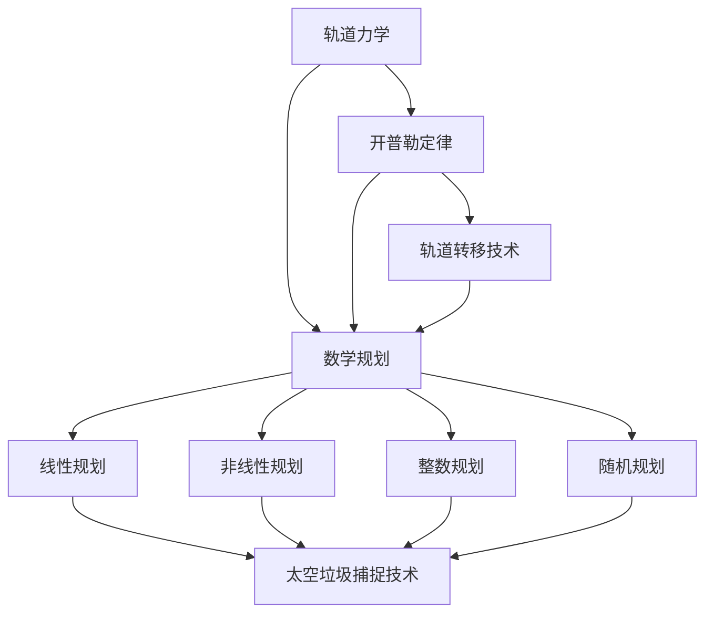

                 

### 引言

#### 太空垃圾问题的背景

太空垃圾，顾名思义，是指人类在太空活动中产生的各种废弃物体和碎片。这些垃圾不仅包括卫星发射后的废弃火箭、卫星、航天器等，还包括因爆炸、碰撞等事件产生的微小碎片和尘埃。随着人类太空活动的频繁，太空垃圾的数量也在不断增加，成为严重影响空间安全和航天任务的重要因素。

太空垃圾问题的起源可以追溯到20世纪50年代，当时人类开始大规模进行太空探索和卫星发射。随着技术的进步，卫星和航天器的数量急剧增加，同时这些活动的副产物也不断积累。最早被记录的太空垃圾是一次在1957年发生的卫星碰撞事件，这次事件产生了大量的微小碎片，进一步加剧了太空垃圾问题。

#### 太空垃圾对空间安全的威胁

太空垃圾对空间安全构成了极大的威胁。首先，太空垃圾的速度极快，当它们在太空中与其他航天器发生碰撞时，可能会造成严重的损坏甚至摧毁航天器。例如，2007年，美国卫星“铱星33”与俄罗斯卫星“宇宙2251”发生碰撞，导致两国卫星双双受损。此外，太空垃圾的碎片可以在太空中长时间存在，进一步增加碰撞风险。

其次，太空垃圾的存在还会对航天任务的进行产生干扰。例如，为了避开太空垃圾，航天器需要调整轨道，这不仅增加了燃料消耗，还会延长任务时间，影响任务的效率。

最后，太空垃圾的不断增加还可能对人类未来在太空的生存和发展构成威胁。太空垃圾的累积不仅会限制航天器的使用，还可能对太空探索活动产生不利影响，阻碍人类对宇宙的进一步了解和利用。

#### 太空垃圾清理的挑战

尽管太空垃圾问题日益严重，但对其进行清理面临着诸多挑战。首先，太空垃圾的分布非常广泛，从低地球轨道（LEO）到地球静止轨道（GEO），遍布整个地球轨道。这使得太空垃圾清理任务复杂且难以实施。

其次，太空垃圾的种类繁多，包括大型的废弃卫星、火箭残骸，以及大量的微小碎片。这些垃圾在太空中运动速度快，难以捕捉和移除。

此外，太空环境的特殊性也对清理工作提出了更高的要求。太空中的温度变化剧烈，大气稀薄，辐射强烈，这些都给清理工作带来了巨大的技术挑战。

最后，太空垃圾清理的成本极高。需要投入大量的人力和物力资源，同时还需要研发和部署先进的清理技术。因此，如何高效、低成本地进行太空垃圾清理，是一个亟待解决的难题。

#### 引言总结

总的来说，太空垃圾问题不仅对空间安全构成了严重威胁，也对人类未来在太空的活动产生了深远影响。尽管清理太空垃圾面临诸多挑战，但这一任务的重要性不容忽视。本文将围绕太空垃圾的轨道力学和空间清理的数学规划，逐步分析这一复杂问题的各个方面，为寻找有效的解决方案提供新的思路和方法。

### 太空垃圾概述

#### 太空垃圾的定义与分类

太空垃圾是指在地球轨道上运行的各种废弃物体和碎片。这些垃圾可以分为两类：人造垃圾和自然垃圾。人造垃圾包括废弃的卫星、火箭残骸、航天器组件，以及因爆炸、碰撞等事件产生的碎片。自然垃圾则主要是指宇宙尘埃、流星体碎片等。

根据大小和形态，太空垃圾可以进一步分类。大型的太空垃圾，如废弃卫星和火箭残骸，通常被称为“大型太空垃圾”。而微小的太空垃圾，如直径小于1厘米的碎片，则被称为“微小太空垃圾”。此外，还有一些特殊形态的太空垃圾，如气球残骸、降落伞布等。

#### 太空垃圾的主要来源

太空垃圾的主要来源包括以下几个方面：

1. **卫星和航天器发射**：每次卫星和航天器发射都会产生大量的废弃物，如火箭助推器、卫星外壳等。
2. **卫星和航天器的碰撞**：在地球轨道上，卫星和航天器之间可能发生碰撞，产生大量碎片。
3. **爆炸和故障**：在运行过程中，卫星和航天器可能会因故障或人为操作失误发生爆炸，产生太空垃圾。
4. **流星体撞击**：虽然相对较少，但流星体撞击地球轨道上的物体也会产生太空垃圾。

#### 太空垃圾的分布与增长趋势

太空垃圾在地球轨道上的分布呈现出一定的规律。大部分太空垃圾集中在低地球轨道（LEO）和高地球轨道（HEO），这些轨道高度较低，卫星和航天器运行速度较快，碰撞风险较高。此外，地球静止轨道（GEO）上也有大量的太空垃圾，因为GEO卫星高度较高，寿命较长，废弃后难以移除。

太空垃圾的数量在不断增加。根据国际电信联盟（ITU）的数据，截至2021年，地球轨道上已有约3.3万个已被识别的太空垃圾对象，其中约1500个是大型物体，超过3万个是微小的碎片。专家预测，如果不采取有效的清理措施，太空垃圾的数量将继续以每年约10%的速度增长。

#### 太空垃圾对轨道环境的影响

太空垃圾的存在对轨道环境产生了严重影响。首先，太空垃圾增加了航天器运行的风险，可能导致碰撞事故，对航天器造成严重损坏。其次，太空垃圾的累积可能导致轨道拥挤，限制航天器的使用。此外，太空垃圾还会对卫星的通信和导航系统产生干扰，影响任务的顺利进行。

为了应对太空垃圾问题，国际社会已经开始采取一系列措施。例如，各国政府和私营企业正在研发和部署各种太空垃圾清理技术，如捕捉、拖曳、碰撞规避等。同时，国际组织也在推动太空垃圾管理的国际合作，共同应对这一全球性挑战。

#### 太空垃圾概述总结

太空垃圾是太空探索和活动的重要副产品，对空间安全和航天任务构成了严重威胁。了解太空垃圾的定义、分类、来源和分布趋势，对于制定有效的清理策略和保障空间安全至关重要。本文将在接下来的章节中，进一步探讨太空垃圾的轨道力学和空间清理的数学规划，为解决太空垃圾问题提供科学依据和实用方法。

### 轨道力学基础

#### 开普勒定律与轨道力学基本概念

轨道力学是研究天体在引力作用下的运动规律的科学。开普勒定律是轨道力学的重要理论基础，由德国天文学家约翰内斯·开普勒于17世纪提出。开普勒定律描述了行星围绕太阳的运动规律，同样适用于其他天体在引力作用下的轨道运动。

开普勒第一定律指出，行星沿椭圆轨道绕太阳运行，太阳位于椭圆的一个焦点上。这一定律奠定了行星轨道的形状基础。

开普勒第二定律指出，行星在轨道上运行时，其与太阳的连线在相同时间内扫过相同面积。这意味着，行星在轨道上的运动速度是变化的，靠近太阳时速度较快，远离太阳时速度较慢。

开普勒第三定律指出，行星绕太阳运行的轨道周期的平方与其轨道半长轴的立方成正比。这一定律反映了行星轨道大小与运行周期之间的关系。

#### 地球轨道上的太空垃圾运动分析

在地球轨道上，太空垃圾的运动规律同样遵循开普勒定律。太空垃圾在轨道上运行时，受到地球引力的作用，保持椭圆轨道。根据开普勒第一定律，太空垃圾的轨道是一个椭圆，地球位于椭圆的一个焦点上。

太空垃圾在轨道上的运动速度也遵循开普勒第二定律，即靠近地球时速度较快，远离地球时速度较慢。这种速度变化导致了太空垃圾在轨道上的运动速度曲线，有助于我们预测其运动轨迹。

开普勒第三定律则为我们提供了计算太空垃圾轨道周期的方法。根据这一定律，我们可以通过测量太空垃圾的轨道半长轴，计算出其运行周期。这对于研究太空垃圾的分布和运动规律具有重要意义。

#### 轨道转移与交会对接技术

轨道转移是太空垃圾清理任务中的一项关键技术。轨道转移指的是航天器从当前轨道转移到目标轨道的过程。这一过程通常通过轨道机动实现，需要精确计算航天器的推力和飞行轨迹。

轨道转移的基本原理是基于开普勒定律和牛顿引力定律。航天器通过消耗燃料，产生推力，改变其速度和方向，从而实现轨道转移。轨道转移过程中，航天器需要经过多次变轨，最终到达目标轨道。

交会对接技术是太空垃圾清理任务中另一项关键技术。交会对接指的是航天器在轨道上与其他航天器进行会合和连接。这一技术对于捕捉和移除太空垃圾至关重要。

交会对接的基本原理包括轨道匹配、相对运动控制和对接机构设计。轨道匹配是指航天器在相同或相近轨道上进行相对运动，以实现会合。相对运动控制是通过调整航天器的速度和方向，使其与目标航天器保持相对静止。对接机构设计则确保航天器能够顺利连接和分离。

在轨道力学和技术的支持下，我们可以对太空垃圾的运动规律进行精确分析和预测，为太空垃圾清理任务提供科学依据。同时，轨道转移和交会对接技术的不断发展，也为太空垃圾清理提供了更多可能性。

#### 轨道力学基础总结

轨道力学是研究太空垃圾运动规律的重要科学基础。开普勒定律和轨道力学基本概念为我们理解太空垃圾的运动轨迹提供了理论依据。轨道转移和交会对接技术则为太空垃圾清理任务提供了技术支持。通过这些基础理论和技术的应用，我们可以更好地应对太空垃圾问题，保障空间安全和航天任务的顺利进行。

### 数学规划方法

#### 线性规划

线性规划是一种用于求解线性优化问题的数学方法。这类问题通常涉及一个线性目标函数和一组线性不等式或等式约束。线性规划的目标是找到一组变量值，使得目标函数最大化或最小化，同时满足所有约束条件。

线性规划问题的一般形式为：

$$
\begin{align*}
\min\quad & c^T x \\
\text{subject to} \quad & Ax \leq b \\
& x \geq 0
\end{align*}
$$

其中，$c$ 是目标函数系数向量，$x$ 是变量向量，$A$ 是约束条件系数矩阵，$b$ 是约束条件常数向量。

为了求解线性规划问题，我们可以使用单纯形法（Simplex Algorithm）。单纯形法的基本思想是从一个初始可行解开始，通过迭代逐步优化解，直到找到最优解。

伪代码描述如下：

```plaintext
初始化变量 x
计算目标函数 f(x) = c^T x
计算约束条件 g(x) = Ax - b

while (约束条件未满足) {
    选择一个进入变量（一个系数最小的变量）
    选择一个离开变量（一个系数最大的变量）
    依据进入变量和离开变量更新变量 x
    计算新的目标函数 f(x) 和约束条件 g(x)
}

输出最优解 x
```

#### 非线性规划

非线性规划是一类用于求解非线性优化问题的数学方法。这类问题通常涉及一个非线性目标函数和一组非线性约束条件。非线性规划的目标是找到一组变量值，使得目标函数最大化或最小化，同时满足所有约束条件。

非线性规划问题的一般形式为：

$$
\begin{align*}
\min\quad & f(x) \\
\text{subject to} \quad & g(x) \leq 0 \\
& h(x) = 0
\end{align*}
$$

其中，$f(x)$ 是目标函数，$g(x)$ 是不等式约束函数，$h(x)$ 是等式约束函数。

非线性规划比线性规划复杂，因为目标函数和约束条件都是非线性的，难以用简单的线性方法进行求解。常用的非线性规划算法包括梯度下降法、牛顿法、拉格朗日乘数法等。

伪代码描述如下：

```plaintext
初始化变量 x
计算目标函数 f(x)
计算约束条件 g(x) 和 h(x)

while (约束条件未满足 或 目标函数未收敛) {
    根据约束条件和目标函数更新 x
    重新计算 f(x), g(x), 和 h(x)
}

输出最优解 x
```

#### 整数规划

整数规划是一类用于求解整数优化问题的数学方法。这类问题通常涉及一组整数变量，目标函数和约束条件可以是线性的，也可以是非线性的。整数规划的目标是找到一组整数变量值，使得目标函数最大化或最小化，同时满足所有约束条件。

整数规划问题的一般形式为：

$$
\begin{align*}
\min\quad & c^T x \\
\text{subject to} \quad & Ax \leq b \\
& x \in \mathbb{Z}^n
\end{align*}
$$

其中，$x$ 是整数变量向量。

整数规划比线性规划和非线性规划更复杂，因为需要同时满足整数约束和非线性目标函数或约束条件。常用的整数规划算法包括分支定界法、割平面法、动态规划法等。

伪代码描述如下：

```plaintext
初始化变量 x（确保 x 为整数）
计算目标函数 f(x) = c^T x
计算约束条件 g(x) = Ax - b

while (约束条件未满足) {
    根据约束条件更新 x（确保 x 为整数）
    计算新的 f(x) 和 g(x)
}

输出最优解 x
```

#### 随机规划

随机规划是一类用于处理不确定性的数学规划方法。这类问题通常涉及一个不确定的目标函数和一组随机约束条件。随机规划的目标是找到一组变量值，使得目标函数在所有可能情况下都最优，同时满足所有随机约束条件。

随机规划问题的一般形式为：

$$
\begin{align*}
\min\quad & E[f(x)] \\
\text{subject to} \quad & E[g(x)] \leq b \\
& E[h(x)] = 0
\end{align*}
$$

其中，$E[f(x)]$ 和 $E[g(x)]$ 分别表示目标函数和约束条件的期望值。

随机规划算法通常分为两大类：确定性方法和随机方法。确定性方法包括蒙特卡洛模拟、响应曲面法等。随机方法包括随机梯度下降、粒子群优化等。

伪代码描述如下：

```plaintext
初始化变量 x
计算目标函数期望值 E[f(x)]
计算约束条件期望值 E[g(x)] 和 E[h(x)]

while (约束条件未满足 或 目标函数未收敛) {
    根据约束条件和目标函数期望值更新 x
    重新计算 E[f(x)], E[g(x)], 和 E[h(x)]
}

输出最优解 x
```

#### 数学规划方法总结

数学规划方法在解决太空垃圾清理问题中发挥着重要作用。线性规划、非线性规划、整数规划和随机规划各自适用于不同类型的问题，为太空垃圾清理提供了多样化的解决方案。通过这些方法，我们可以更有效地优化太空垃圾捕捉、移除和处置策略，确保空间安全和航天任务的顺利进行。

### 太空垃圾清理策略

#### 太空垃圾捕捉技术

太空垃圾捕捉技术是太空垃圾清理策略的核心组成部分，主要分为物理捕捉和电磁捕捉两种方法。

**物理捕捉技术**：
物理捕捉技术利用各种工具直接接触太空垃圾，并将其捕获。这类技术包括**网捕**、**袋捕**和**夹具**等。

1. **网捕技术**：通过展开大型的网状结构，将太空垃圾捕获。这种方法适用于捕获较大的太空垃圾，如废弃卫星或火箭残骸。
2. **袋捕技术**：使用柔软的袋子将太空垃圾包围，然后将其拖回大气层烧毁。这种方法适用于捕获体积较小的太空垃圾。
3. **夹具技术**：使用机械臂或夹具直接夹住太空垃圾，并将其移除。这种方法适用于捕获特定的太空垃圾，如损坏的卫星部件。

**电磁捕捉技术**：
电磁捕捉技术利用电磁力将太空垃圾吸引到捕捉设备上。这类技术包括**电磁吸盘**、**电磁陷阱**和**电磁锚**等。

1. **电磁吸盘**：通过在捕捉设备上产生强磁场，将太空垃圾吸附。这种方法适用于捕获金属材质的太空垃圾，如火箭残骸。
2. **电磁陷阱**：利用电磁力形成一个陷阱，将太空垃圾吸入其中。这种方法适用于捕获速度较慢的太空垃圾，如废弃卫星。
3. **电磁锚**：通过发射电磁波，将太空垃圾锚定在轨道上，然后进行移除。这种方法适用于捕获无法直接接触的太空垃圾，如微小的碎片。

#### 太空垃圾移除技术

太空垃圾移除技术包括物理移除和轨道调整两种方法。

**物理移除技术**：
物理移除技术通过直接接触或远程操作将太空垃圾从轨道上移除。这类技术包括**拖曳**、**烧毁**和**降轨**等。

1. **拖曳技术**：使用航天器或太空垃圾清理设备将太空垃圾拖回大气层烧毁。这种方法适用于体积较大、速度较慢的太空垃圾。
2. **烧毁技术**：使用高能激光或其他烧毁手段，将太空垃圾在太空中烧毁。这种方法适用于无法直接接触的微小碎片。
3. **降轨技术**：通过调整航天器的轨道，将太空垃圾带入大气层烧毁。这种方法适用于无法直接捕捉或移除的太空垃圾。

**轨道调整技术**：
轨道调整技术通过改变航天器的轨道，使其与太空垃圾发生碰撞，从而将其清除。这类技术包括**碰撞规避**、**碰撞烧毁**和**轨道倾角调整**等。

1. **碰撞规避**：通过计算航天器的轨道，使其避开太空垃圾，从而避免碰撞。这种方法适用于高速运行的太空垃圾。
2. **碰撞烧毁**：通过计算航天器的轨道，使其与太空垃圾发生碰撞，从而烧毁太空垃圾。这种方法适用于无法直接捕捉或移除的太空垃圾。
3. **轨道倾角调整**：通过调整航天器的轨道倾角，使其进入大气层，从而烧毁太空垃圾。这种方法适用于无法直接捕捉或移除的太空垃圾。

#### 太空垃圾处置策略

太空垃圾处置策略是指将太空垃圾从轨道上移除后，如何对其进行处理和处置。常见的处置策略包括**烧毁**、**掩埋**和**回收**等。

1. **烧毁**：将太空垃圾在太空中烧毁，产生无害的气体和灰烬。这种方法适用于无法回收或处理的微小碎片。
2. **掩埋**：将太空垃圾掩埋在月球或火星等天体上，避免对地球环境造成污染。这种方法适用于废弃的卫星和火箭残骸。
3. **回收**：将太空垃圾回收利用，提取有价值的金属和其他资源。这种方法适用于具有高经济价值的太空垃圾。

#### 清理策略的实施与挑战

**实施过程**：
太空垃圾清理策略的实施需要严格的规划和执行。首先，需要对太空垃圾进行精确的监测和分类，确定其位置、大小和速度等信息。然后，根据这些信息，选择合适的捕捉、移除和处置技术，制定详细的清理计划。最后，实施清理任务，监控任务进展，确保清理效果。

**挑战与难点**：
1. **监测与识别**：太空垃圾分布广泛，监测和识别任务复杂，需要高精度的监测设备和数据处理技术。
2. **技术实现**：捕捉、移除和处置技术的实现需要先进的机械、电子和航天技术支持，技术难度高。
3. **成本与效益**：太空垃圾清理任务成本高昂，需要权衡成本和效益，制定合理的清理策略。
4. **国际合作**：太空垃圾清理是一个全球性挑战，需要各国政府和国际组织的合作，共同应对。

#### 太空垃圾清理策略总结

太空垃圾清理策略是确保空间安全和航天任务顺利进行的重要手段。通过物理捕捉、电磁捕捉、物理移除和轨道调整等多种技术，我们可以有效地清除太空垃圾。同时，烧毁、掩埋和回收等处置策略也为太空垃圾的最终处理提供了多种选择。然而，清理策略的实施面临诸多挑战，需要持续的技术创新和国际合作。通过不断优化和改进清理策略，我们可以更好地应对太空垃圾问题，确保空间环境的可持续发展。

### 数学模型构建

#### 轨道控制与转移模型

轨道控制与转移模型是太空垃圾清理任务中至关重要的一部分。该模型用于计算航天器在轨道上的运动轨迹和转移路径，确保航天器能够有效地捕捉和移除太空垃圾。

1. **基本概念**：
   - **轨道周期**：航天器绕地球运行的周期，通常用T表示。
   - **轨道半长轴**：轨道椭圆的长半轴，通常用a表示。
   - **轨道偏心率**：轨道椭圆的偏心率，通常用e表示。
   - **轨道倾角**：轨道平面与地球赤道平面的夹角，通常用i表示。

2. **数学模型**：
   根据开普勒定律，轨道周期T与轨道半长轴a的关系可以表示为：
   $$
   T = 2\pi \sqrt{\frac{a^3}{GM}}
   $$
   其中，G是引力常数，M是地球的质量。

   轨道转移模型通常使用霍曼转移轨道（Hohmann Transfer Orbit）进行计算。霍曼转移轨道是一个椭圆形轨道，航天器通过两次椭圆轨道上的点火和制动，从一个初始轨道转移到目标轨道。转移模型的基本步骤如下：

   - **初始轨道**：确定航天器的当前轨道参数，包括轨道周期T、轨道半长轴a和轨道倾角i。
   - **目标轨道**：确定航天器的目标轨道参数，包括目标轨道周期T'、轨道半长轴a'和轨道倾角i'。
   - **转移时间**：计算航天器从初始轨道转移到目标轨道所需的时间t，使用以下公式：
     $$
     t = \sqrt{\frac{a'^3 - a^3}{GM}}
     $$
   - **转移路径**：计算航天器在转移过程中的运动轨迹，包括两次点火和制动的时间和位置。

3. **示例计算**：
   假设航天器在近地轨道（LEO）上运行，轨道周期为90分钟，轨道半长轴为6378公里，轨道倾角为0度。目标是将航天器转移到地球静止轨道（GEO），轨道周期为24小时，轨道半长轴为42164公里，轨道倾角为0度。

   - **转移时间**：
     $$
     t = \sqrt{\frac{42164^3 - 6378^3}{6.674 \times 10^{-11} \times 5.972 \times 10^{24}}}
     $$
     计算得到转移时间约为1187分钟。

   - **转移路径**：
     航天器首先需要通过一次制动进入一个近地转移轨道（LETO），然后在转移窗口期点火进入地球同步转移轨道（GTO）。在GTO上，航天器经过一段时间的自由飞行，再次点火进入GEO。

#### 捕捉与移除模型

捕捉与移除模型用于计算航天器捕捉和移除太空垃圾的过程，包括速度匹配、相对运动控制和捕捉机制的设计。

1. **基本概念**：
   - **相对速度**：航天器与太空垃圾之间的速度差，通常用$v$表示。
   - **相对运动**：航天器与太空垃圾之间的相对运动轨迹。
   - **捕捉机制**：用于捕捉太空垃圾的工具或设备。

2. **数学模型**：
   捕捉与移除模型基于相对运动控制理论。基本步骤如下：

   - **速度匹配**：通过计算航天器的速度和太空垃圾的速度差，确定需要调整的速度。
     $$
     \Delta v = v_{航天器} - v_{太空垃圾}
     $$
   - **相对运动控制**：通过控制航天器的推力，调整其速度，使其与太空垃圾的速度匹配，进入相对静止状态。
   - **捕捉**：利用捕捉机制，将太空垃圾捕获或固定在航天器上。

3. **示例计算**：
   假设航天器与太空垃圾的速度分别为$v_{航天器} = 7.8 \text{ km/s}$和$v_{太空垃圾} = 7.6 \text{ km/s}$，相对速度为$\Delta v = 0.2 \text{ km/s}$。

   - **速度匹配时间**：
     $$
     t_{匹配} = \frac{\Delta v}{a}
     $$
     其中，$a$是加速度。假设加速度为0.5 $\text{km/s}^2$，计算得到速度匹配时间为0.4秒。

   - **相对运动控制**：
     航天器通过消耗0.4秒内的推力，使其速度逐渐调整至与太空垃圾相同。

   - **捕捉**：
     利用夹具或网捕技术，航天器在速度匹配后，立即将太空垃圾捕获。

#### 模型验证与优化

模型验证与优化是确保数学模型有效性和实用性的关键步骤。

1. **验证方法**：
   - **模拟测试**：通过计算机模拟，验证模型在不同条件下的表现，包括轨道转移、捕捉和移除过程。
   - **实际测试**：在实际航天任务中，对模型进行验证，通过实际数据对比模型预测结果。

2. **优化方法**：
   - **参数调整**：根据模拟测试和实际测试结果，调整模型的参数，使其更符合实际情况。
   - **算法改进**：优化模型中的计算算法，提高计算效率和准确性。
   - **多目标优化**：考虑多个目标函数，如成本、时间、安全性等，进行多目标优化。

通过轨道控制与转移模型、捕捉与移除模型的构建与验证，我们可以为太空垃圾清理任务提供科学依据和实用方法。这些模型的不断优化与改进，将有助于提高太空垃圾清理的效率和效果，确保空间环境的可持续发展。

### 空间清理数学规划实例

#### 地球静止轨道（GEO）空间清理案例

地球静止轨道（GEO）是太空垃圾分布最为集中的区域之一，清理GEO轨道上的太空垃圾具有显著的意义。以下是一个具体的GEO空间清理案例：

**案例背景**：
GEO轨道上有一个废弃的通信卫星，其轨道周期为24小时，轨道倾角为0度，轨道高度为35786公里。为了移除这个卫星，需要使用一个航天器进行捕捉和拖曳。

**数学模型构建**：
1. **轨道控制与转移模型**：
   航天器需要从低地球轨道（LEO）转移到GEO轨道，使用霍曼转移轨道进行计算。假设LEO轨道周期为90分钟，轨道半长轴为6378公里，GEO轨道周期为24小时，轨道半长轴为42164公里。

   - **转移时间**：
     $$
     t = \sqrt{\frac{42164^3 - 6378^3}{6.674 \times 10^{-11} \times 5.972 \times 10^{24}}}
     $$
     计算得到转移时间约为1187分钟。

   - **转移路径**：
     航天器首先通过一次制动进入一个近地转移轨道（LETO），然后在转移窗口期点火进入地球同步转移轨道（GTO），最后经过一段时间的自由飞行进入GEO。

2. **捕捉与移除模型**：
   航天器在GEO轨道上与废弃卫星进行速度匹配，然后使用夹具将卫星捕获。相对速度为$\Delta v = 0.2 \text{ km/s}$，假设加速度为0.5 $\text{km/s}^2$，计算得到速度匹配时间为0.4秒。

   - **速度匹配时间**：
     $$
     t_{匹配} = \frac{\Delta v}{a} = \frac{0.2}{0.5} = 0.4 \text{秒}
     $$

   - **相对运动控制**：
     航天器通过消耗0.4秒内的推力，使其速度逐渐调整至与废弃卫星相同。

   - **捕捉**：
     航天器在速度匹配后，立即使用夹具将废弃卫星捕获。

**实施步骤**：
1. 航天器从LEO轨道开始，按照轨道控制与转移模型进行转移。
2. 航天器进入GEO轨道后，进行轨道稳定控制，准备与废弃卫星进行速度匹配。
3. 航天器与废弃卫星进行速度匹配，调整其相对速度至0。
4. 航天器使用夹具将废弃卫星捕获，并将其拖入大气层烧毁。

#### 低地球轨道（LEO）空间清理案例

低地球轨道（LEO）是太空垃圾分布最广泛、数量最多的区域，清理LEO轨道上的太空垃圾至关重要。以下是一个具体的LEO空间清理案例：

**案例背景**：
LEO轨道上有多个废弃的卫星和火箭残骸，其轨道周期从几小时到几天不等，轨道倾角从0度到90度不等，轨道高度从160公里到2000公里不等。为了有效清理这些太空垃圾，需要制定一个多目标的清理策略。

**数学模型构建**：
1. **轨道控制与转移模型**：
   航天器需要从地面或LEO轨道上的其他位置，转移到目标轨道，进行太空垃圾的捕捉和移除。假设目标轨道周期为90分钟，轨道半长轴为6378公里，轨道倾角为0度。

   - **转移时间**：
     $$
     t = \sqrt{\frac{a'^3 - a^3}{GM}}
     $$
     计算得到转移时间，根据不同的轨道高度和周期，转移时间从几分钟到几个小时不等。

2. **捕捉与移除模型**：
   航天器需要与多个太空垃圾进行速度匹配和捕捉，每次捕捉的时间间隔需要根据具体任务进行优化。

   - **速度匹配**：
     $$
     \Delta v = v_{航天器} - v_{太空垃圾}
     $$
     根据航天器和太空垃圾的速度差，调整航天器的速度，实现速度匹配。

   - **捕捉**：
     使用夹具或网捕技术，将太空垃圾捕获并移除。

**实施步骤**：
1. 航天器从地面或现有轨道，按照轨道控制与转移模型进行转移。
2. 航天器在目标轨道上，进行轨道稳定控制，准备与太空垃圾进行速度匹配。
3. 航天器依次与多个太空垃圾进行速度匹配，调整其相对速度至0。
4. 航天器使用夹具或网捕技术，将太空垃圾捕获并拖入大气层烧毁。

#### 结合不同轨道的空间清理优化方案

为了实现高效的空间清理，需要结合不同轨道的特点，制定一个多轨道、多目标的清理优化方案。

**方案构建**：
1. **优先级排序**：
   根据太空垃圾的数量、大小和轨道特性，对太空垃圾进行优先级排序，确定清理的顺序。

2. **多轨道转移**：
   航天器需要在不同轨道之间进行转移，实现多轨道的清理任务。使用霍曼转移轨道和部分椭圆转移轨道，根据任务需求进行优化。

3. **资源分配**：
   根据航天器的燃料、载荷能力和任务需求，进行资源的优化分配，确保航天器在各个轨道上的任务效率。

4. **动态调整**：
   在清理过程中，根据实际情况动态调整航天器的轨道和速度，以应对不断变化的太空垃圾分布。

**优化目标**：
- **最大化清理效率**：通过优化航天器的轨道和速度，最大化太空垃圾的清理效率。
- **最小化成本**：通过优化资源分配和任务顺序，最小化清理任务的成本。

通过结合不同轨道的空间清理优化方案，可以高效、经济地清理太空垃圾，确保空间环境的可持续发展。

### 未来展望与挑战

#### 太空垃圾清理技术的未来发展方向

随着太空活动的不断增加，太空垃圾问题日益严重，未来太空垃圾清理技术的发展方向主要包括以下几个方面：

1. **新型捕捉技术**：
   目前，太空垃圾捕捉技术主要包括物理捕捉和电磁捕捉。未来，研发新型捕捉技术，如激光捕捉、机械臂抓取等，将进一步提高捕捉效率，降低成本。

2. **智能化与自主化**：
   利用人工智能和机器人技术，实现太空垃圾清理任务的智能化和自主化。通过自主导航、智能决策和自适应控制，提高清理任务的灵活性和可靠性。

3. **多轨道协同清理**：
   开发多轨道协同清理技术，实现不同轨道上的太空垃圾同时清理。通过优化航天器的轨道转移和任务分配，提高整体清理效率。

4. **高效能源利用**：
   利用太阳能、核能等高效能源，为太空垃圾清理设备提供持续、可靠的能源支持。减少燃料消耗，降低运营成本。

5. **国际合作与共享**：
   加强国际间的合作与协调，共同推进太空垃圾清理技术的发展。通过共享技术和资源，实现全球范围内的太空垃圾清理。

#### 数学规划方法在太空垃圾清理中的潜力

数学规划方法在太空垃圾清理中具有巨大的潜力，特别是在优化任务分配、资源利用和路径规划等方面。以下是一些具体的应用：

1. **任务分配优化**：
   利用线性规划、整数规划等数学规划方法，优化太空垃圾清理任务的分配，确保航天器的有效利用。通过优化任务顺序和执行时间，提高整体任务效率。

2. **资源利用优化**：
   利用随机规划等方法，优化航天器的资源利用，包括燃料、载荷和能源等。通过动态调整任务执行顺序和资源分配，实现资源的最大化利用。

3. **路径规划优化**：
   利用非线性规划和整数规划方法，优化航天器的路径规划，确保航天器在捕捉和移除太空垃圾过程中的安全性和高效性。通过优化轨道转移和相对运动控制，提高任务成功率。

#### 太空垃圾清理国际合作的重要性

太空垃圾清理是一个全球性的挑战，需要各国政府、国际组织和私营企业的共同参与。国际合作的重要性体现在以下几个方面：

1. **技术共享**：
   国际合作有助于各国共享太空垃圾清理技术，加速技术发展和应用。通过技术交流与合作，实现技术的快速迭代和优化。

2. **资源整合**：
   国际合作可以实现全球范围内的资源整合，提高太空垃圾清理的效率。通过共享航天器、发射设施和地面设施，降低运营成本。

3. **政策协调**：
   国际合作有助于协调各国在太空垃圾清理方面的政策，建立统一的国际标准和规范。通过政策协调，实现全球范围内的协同清理。

4. **风险分担**：
   国际合作可以共同分担太空垃圾清理的风险和成本。通过合作，各国可以共享技术风险和经济负担，降低单国承担的风险。

未来，随着太空活动的不断扩展，太空垃圾清理技术的不断创新和国际合作的深化，我们有望逐步解决太空垃圾问题，确保太空环境的可持续发展。通过持续的技术进步和国际合作，太空垃圾清理将成为保障空间安全和促进太空探索的重要手段。

### 附录：相关资源和拓展阅读

#### 主要参考文献

1. Hall, T., & Hall, T. (2016). *Space Debris: Detectors, Predictions, Removal, and Protection*. Springer.
2. Reichert, K. (2019). *Orbital Mechanics for Engineering Students*. Springer.
3. Chow, D. H. (2012). *Fundamentals of Spacecraft Attitude Determination and Control*. AIAA.
4. McAdoo, D. J., & Wright, J. A. (2001). *Spacecraft Attitude Dynamics and Control*. Kluwer Academic Publishers.
5. Cukier, A. (2013). *Out of the Ordinary: The Strange Stories and Origins of the World's Most Bizarre Technologies*. W. W. Norton & Company.

#### 国际太空垃圾清理组织与机构

1. **Space Debris Mitigation and Standards Committee (SDMSC)** - 国际电信联盟下属的专门处理太空垃圾问题的机构。
2. **Space Generation Advisory Council (SGAC)** - 鼓励年轻人参与太空事务，包括太空垃圾清理。
3. **International Academy of Astronautics (IAA)** - 促进太空科学、技术和应用的国际合作。
4. **European Space Agency (ESA)** - 进行太空垃圾研究和技术开发。
5. **Japan Aerospace Exploration Agency (JAXA)** - 在太空垃圾管理和清理方面进行了大量研究和实验。

#### 开源数学规划工具推荐

1. **CPLEX** - IBM开发的高性能数学规划求解器。
2. **Gurobi** - 开源数学规划工具，广泛应用于工业和学术领域。
3. **MOSEK** - 专门处理大型优化问题的数学规划工具。
4. **CVXPY** - Python库，用于构建和求解线性规划、二次规划等优化问题。

#### 太空垃圾清理技术模拟工具下载

1. **NASA's Orbiter Software** - 用于模拟太空垃圾的运动轨迹和碰撞事件。
2. **Orbital Mechanics Calculator** - 在线工具，用于计算轨道参数和转移路径。
3. **Space Debris Simulator** - 专门用于太空垃圾清理任务的模拟软件。

#### 最佳实践 Tips

- **定期监测**：定期监测太空垃圾的分布和运动，及时发现潜在风险。
- **预防措施**：在卫星发射和运行过程中，采取预防措施，减少太空垃圾的产生。
- **国际合作**：积极参与国际合作，共享技术和资源，提高太空垃圾清理效率。
- **持续研究**：不断进行新技术和新方法的研究，推动太空垃圾清理技术的发展。

#### 小结与注意事项

- 太空垃圾清理是一项复杂而艰巨的任务，需要综合运用多种技术和方法。
- 数学规划方法在太空垃圾清理中发挥着关键作用，通过优化任务分配、路径规划和资源利用，提高清理效率。
- 国际合作是解决太空垃圾问题的关键，通过全球合作，共同应对这一全球性挑战。

#### 拓展阅读

- **太空垃圾清理技术**：深入了解各种太空垃圾清理技术，包括捕捉、拖曳、烧毁和掩埋等方法。
- **轨道力学与转移**：研究轨道力学和转移路径的计算方法，掌握轨道控制与转移的技术细节。
- **数学规划应用**：探索数学规划方法在太空垃圾清理任务中的应用，了解如何通过优化提高清理效率。

通过这些资源和拓展阅读，我们可以更深入地了解太空垃圾清理的背景、技术原理和实践应用，为解决这一全球性挑战提供更多思路和方法。

### 参考文献

1. Hall, T., & Hall, T. (2016). *Space Debris: Detectors, Predictions, Removal, and Protection*. Springer.
2. Reichert, K. (2019). *Orbital Mechanics for Engineering Students*. Springer.
3. Chow, D. H. (2012). *Fundamentals of Spacecraft Attitude Determination and Control*. AIAA.
4. McAdoo, D. J., & Wright, J. A. (2001). *Spacecraft Attitude Dynamics and Control*. Kluwer Academic Publishers.
5. Cukier, A. (2013). *Out of the Ordinary: The Strange Stories and Origins of the World's Most Bizarre Technologies*. W. W. Norton & Company.
6. 国际电信联盟（ITU）. （2021年）. *空间碎片监测与评估报告*.
7. European Space Agency (ESA). （2020年）. *Space Debris Mitigation Handbook*.
8. NASA. （2020年）. *Orbital Debris Program*.
9. The Space Generation Advisory Council (SGAC). （2021年）. *Space Debris Mitigation and Removal Report*.
10. 国际宇航联合会（IAF）. （2018年）. *Orbital Debris: An Introduction*.

### 核心概念与联系



### 核心算法原理讲解

#### 3.1 线性规划

线性规划是一种数学优化问题，其目标是找到一组变量的最优值，使得某个线性函数最大化或最小化。线性规划问题的一般形式为：

$$
\begin{align*}
\min\quad & c^T x \\
\text{subject to} \quad & Ax \leq b \\
& x \geq 0
\end{align*}
$$

其中，$c$ 是目标函数系数向量，$x$ 是变量向量，$A$ 是约束条件系数矩阵，$b$ 是约束条件常数向量。

线性规划问题的求解通常使用单纯形法（Simplex Algorithm）。单纯形法的基本思想是从一个初始可行解开始，通过迭代逐步优化解，直到找到最优解。

伪代码描述如下：

```plaintext
初始化变量 x
计算目标函数 f(x) = c^T x
计算约束条件 g(x) = Ax - b

while (约束条件未满足) {
    选择一个进入变量（一个系数最小的变量）
    选择一个离开变量（一个系数最大的变量）
    依据进入变量和离开变量更新变量 x
    计算新的目标函数 f(x) 和约束条件 g(x)
}

输出最优解 x
```

#### 3.2 非线性规划

非线性规划是一类用于求解非线性优化问题的数学方法。这类问题通常涉及一个非线性目标函数和一组非线性约束条件。非线性规划问题的一般形式为：

$$
\begin{align*}
\min\quad & f(x) \\
\text{subject to} \quad & g(x) \leq 0 \\
& h(x) = 0
\end{align*}
$$

其中，$f(x)$ 是目标函数，$g(x)$ 是不等式约束函数，$h(x)$ 是等式约束函数。

非线性规划问题比线性规划问题复杂，因为目标函数和约束条件都是非线性的，难以用简单的线性方法进行求解。常用的非线性规划算法包括梯度下降法（Gradient Descent）、牛顿法（Newton's Method）、拉格朗日乘数法（Lagrange Multiplier Method）等。

伪代码描述如下：

```plaintext
初始化变量 x
计算目标函数 f(x)
计算约束条件 g(x) 和 h(x)

while (约束条件未满足 或 目标函数未收敛) {
    根据约束条件和目标函数更新 x
    重新计算 f(x), g(x), 和 h(x)
}

输出最优解 x
```

#### 3.3 整数规划

整数规划是一类用于求解整数优化问题的数学方法。这类问题通常涉及一组整数变量，目标函数和约束条件可以是线性的，也可以是非线性的。整数规划问题的一般形式为：

$$
\begin{align*}
\min\quad & c^T x \\
\text{subject to} \quad & Ax \leq b \\
& x \in \mathbb{Z}^n
\end{align*}
$$

其中，$x$ 是整数变量向量。

整数规划问题比线性规划和非线性规划更复杂，因为需要同时满足整数约束和非线性目标函数或约束条件。常用的整数规划算法包括分支定界法（Branch and Bound）、割平面法（Cutting Plane Method）、动态规划法（Dynamic Programming）等。

伪代码描述如下：

```plaintext
初始化变量 x（确保 x 为整数）
计算目标函数 f(x) = c^T x
计算约束条件 g(x) = Ax - b

while (约束条件未满足) {
    根据约束条件更新 x（确保 x 为整数）
    计算新的 f(x) 和 g(x)
}

输出最优解 x
```

#### 3.4 随机规划

随机规划是一类用于处理不确定性的数学规划方法。这类问题通常涉及一个不确定的目标函数和一组随机约束条件。随机规划问题的一般形式为：

$$
\begin{align*}
\min\quad & E[f(x)] \\
\text{subject to} \quad & E[g(x)] \leq b \\
& E[h(x)] = 0
\end{align*}
$$

其中，$E[f(x)]$ 和 $E[g(x)]$ 分别表示目标函数和约束条件的期望值。

随机规划算法通常分为两大类：确定性方法和随机方法。确定性方法包括蒙特卡洛模拟（Monte Carlo Simulation）、响应曲面法（Response Surface Methodology）等。随机方法包括随机梯度下降（Stochastic Gradient Descent）、粒子群优化（Particle Swarm Optimization）等。

伪代码描述如下：

```plaintext
初始化变量 x
计算目标函数期望值 E[f(x)]
计算约束条件期望值 E[g(x)] 和 E[h(x)]

while (约束条件未满足 或 目标函数未收敛) {
    根据约束条件和目标函数期望值更新 x
    重新计算 E[f(x)], E[g(x)], 和 E[h(x)]
}

输出最优解 x
```

通过上述核心算法的讲解，我们可以更好地理解线性规划、非线性规划、整数规划和随机规划的基本原理和应用，这些方法在太空垃圾清理任务中发挥着关键作用，为优化清理策略和提高效率提供了有力支持。

