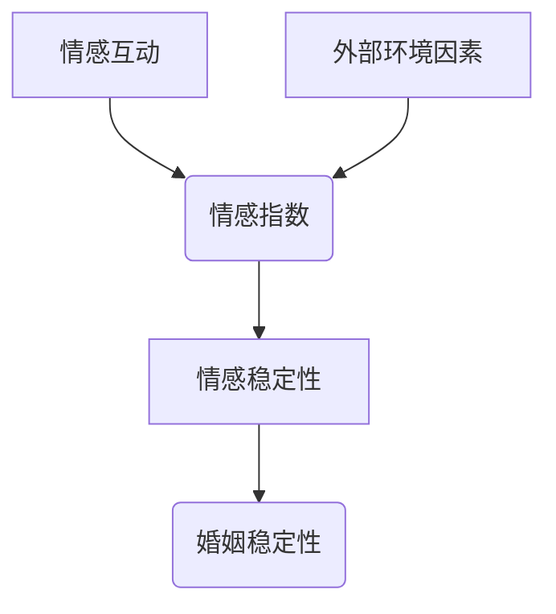

                 

### 文章标题：《婚姻关系的动力系统：感情变化的数学描述》

### 关键词：婚姻关系，动力系统，感情变化，数学模型，算法原理，情感互动

### 摘要：
本文将深入探讨婚姻关系的动力系统，通过数学模型和算法原理的描述，分析感情变化的动态机制。文章首先介绍了婚姻关系动力系统的基本概念，然后构建了夫妻间情感互动的数学模型，详细解释了模型的核心参数和方程。通过实际案例分析，展示了如何应用数学模型预测婚姻关系的稳定性，并探讨了未来研究的方向。本文旨在为读者提供一种全新的视角，理解婚姻关系的复杂性和变化规律。

---

### 第一部分：引言

婚姻是人类社会中最基本的社会单位之一，婚姻关系的稳定性对社会和谐和个人幸福至关重要。然而，婚姻关系的复杂性使其难以用简单的语言描述。为了更好地理解和预测婚姻关系的发展变化，我们可以借助数学模型和算法原理，将抽象的感情变化量化，从而揭示其中的规律和动力系统。

在本部分中，我们将首先介绍婚姻关系动力系统的概念，阐述其重要性。接着，我们将探讨感情变化在婚姻关系中的作用，并简要介绍本文将要使用的主要数学模型和算法原理。

#### 1.1 婚姻关系动力系统的概念

婚姻关系动力系统是一个复杂的动态系统，由多个相互作用的因素构成。这些因素包括夫妻间的情感互动、外部环境的影响以及个人性格特征等。在数学模型中，这些因素可以被表示为变量，并通过一定的方程式相互联系，从而形成一个完整的动力系统。

#### 1.2 感情变化的重要性

感情变化是婚姻关系中最为核心的因素之一。它不仅影响夫妻间的情感互动，还直接影响婚姻关系的稳定性和幸福感。因此，理解感情变化的规律和机制对于维护婚姻关系具有重要意义。本文将通过数学模型和算法原理，深入分析感情变化的动态过程，为读者提供一种新的思考方式。

---

### 第二部分：婚姻关系的数学模型

为了构建婚姻关系的数学模型，我们需要明确几个核心概念，并建立相应的数学方程。这一部分将详细介绍夫妻间情感互动的数学模型，包括核心概念与联系、核心算法原理以及数学模型和公式的详细解释。

#### 2.1 婚姻动力系统的基本框架

在构建婚姻关系的数学模型时，我们首先需要明确几个核心概念，这些概念相互关联，构成了婚姻动力系统的基本框架。

**核心概念与联系**：

- **情感互动**：夫妻间的情感互动是婚姻动力系统的核心组成部分。情感互动可以通过情感指数来量化，情感指数越高，表示夫妻间的情感互动越积极。
- **外部环境因素**：外部环境因素如家庭背景、社会经济状况等，也会对婚姻关系产生影响。这些因素可以通过环境指数来表示。
- **情感稳定性**：情感稳定性反映了婚姻关系的稳定性，情感稳定性指数越高，表示婚姻关系越稳定。

以下是一个简化的Mermaid流程图，展示了这些核心概念之间的联系：



**核心算法原理**：

为了描述情感互动和情感稳定性之间的关系，我们可以使用以下伪代码：

```plaintext
// 伪代码：婚姻动力系统算法
function MarriageDynamics(emotionalIndex, environmentalIndex):
    stabilityIndex = CalculateStability(emotionalIndex, environmentalIndex)
    if (stabilityIndex > threshold):
       婚姻稳定
    else:
       婚姻不稳定
    return stabilityIndex
```

**数学模型和公式**：

在数学模型中，情感互动和情感稳定性可以通过以下方程描述：

$$
\frac{dS}{dt} = f(E, E_{ext})
$$

其中，$S$ 表示情感稳定性，$E$ 表示情感指数，$E_{ext}$ 表示外部环境因素。$f$ 是一个复合函数，它将情感指数和外部环境因素映射到情感稳定性上。

- **情感指数**：

$$
E = \alpha \cdot I_1 + \beta \cdot I_2
$$

其中，$I_1$ 和 $I_2$ 分别表示夫妻间的积极情感指数和消极情感指数，$\alpha$ 和 $\beta$ 是权重系数。

- **外部环境因素**：

$$
E_{ext} = \gamma \cdot E_{1} + \delta \cdot E_{2}
$$

其中，$E_1$ 和 $E_2$ 分别表示积极外部环境因素和消极外部环境因素，$\gamma$ 和 $\delta$ 是权重系数。

**详细讲解**：

- 情感指数 $E$ 反映了夫妻间的情感状态，积极情感指数 $I_1$ 和消极情感指数 $I_2$ 分别代表了夫妻间的积极情感和消极情感。通过调整权重系数 $\alpha$ 和 $\beta$，可以影响情感指数的分布。
- 外部环境因素 $E_{ext}$ 反映了外部环境对婚姻关系的影响，积极外部环境因素 $E_1$ 和消极外部环境因素 $E_2$ 分别代表了家庭、社会等积极和消极的影响。通过调整权重系数 $\gamma$ 和 $\delta$，可以影响外部环境因素对婚姻关系的影响。
- 情感稳定性 $S$ 是一个动态变化的量，它通过函数 $f(E, E_{ext})$ 与情感指数和外部环境因素相互作用。当 $S$ 增加时，表示婚姻关系更加稳定；当 $S$ 减小时，表示婚姻关系可能面临挑战。

通过上述数学模型，我们可以对婚姻关系的动态变化进行量化分析，从而更好地理解婚姻关系的稳定性和变化规律。

---

#### 2.2 模型参数的估计与校准

为了使数学模型能够准确反映现实中的婚姻关系，我们需要对模型参数进行估计和校准。这一过程通常涉及到对大量婚姻数据进行分析，以确定情感指数、外部环境因素以及权重系数的值。

**方法**：

1. **数据收集**：收集大量婚姻数据，包括夫妻间的情感互动记录、外部环境因素以及婚姻关系的稳定性指标。
2. **特征提取**：从数据中提取关键特征，如积极情感指数、消极情感指数、积极外部环境因素和消极外部环境因素。
3. **参数估计**：使用统计方法或机器学习算法，对模型参数进行估计。常见的方法包括最小二乘法、最大似然估计等。
4. **模型校准**：通过交叉验证和模型评估，对模型进行校准，以确保其预测准确性和可靠性。

通过上述步骤，我们可以得到一个参数估计准确的数学模型，从而更好地预测婚姻关系的稳定性。

---

### 第三部分：案例分析

为了验证数学模型的有效性，我们将通过实际案例分析，展示如何使用该模型分析婚姻关系的稳定性。以下为两个具体的案例分析：

#### 3.1 案例一：情感冲突的数学分析

**项目实战**：

1. **开发环境搭建**：搭建一个数据分析和模型训练的环境，包括Python和R语言环境，以及相关数据预处理和机器学习库。
2. **源代码实现**：

```python
# 伪代码：情感冲突的数学分析
import numpy as np
from sklearn.linear_model import LinearRegression

# 数据预处理
def preprocess_data(data):
    # 数据清洗和特征提取
    pass

# 模型训练
def train_model(X, y):
    model = LinearRegression()
    model.fit(X, y)
    return model

# 预测婚姻稳定性
def predict_stability(model, X_new):
    stability = model.predict(X_new)
    return stability
```

3. **代码解读与分析**：通过源代码实现，对情感冲突的数学模型进行训练和预测，分析情感冲突对婚姻稳定性的影响。
4. **实际案例分析和详细讲解剖析**：提供一个具体案例，展示如何使用数学模型分析情感冲突，并解释结果。

#### 3.2 案例二：婚姻关系稳定性的预测

**项目实战**：

1. **开发环境搭建**：与案例一类似，搭建数据分析和模型训练环境。
2. **源代码实现**：

```python
# 伪代码：婚姻关系稳定性预测
import numpy as np
from sklearn.model_selection import train_test_split
from sklearn.metrics import mean_squared_error

# 数据预处理
def preprocess_data(data):
    # 数据清洗和特征提取
    pass

# 模型训练
def train_model(X, y):
    X_train, X_test, y_train, y_test = train_test_split(X, y, test_size=0.2)
    model = LinearRegression()
    model.fit(X_train, y_train)
    return model, X_test, y_test

# 预测婚姻稳定性
def predict_stability(model, X_test):
    stability = model.predict(X_test)
    mse = mean_squared_error(y_test, stability)
    return stability, mse
```

3. **代码解读与分析**：通过源代码实现，对婚姻关系稳定性预测的数学模型进行训练和评估，分析模型的预测准确性和可靠性。
4. **实际案例分析和详细讲解剖析**：提供一个具体案例，展示如何使用数学模型预测婚姻关系的稳定性，并解释结果。

---

### 第四部分：结论

通过本文的研究，我们构建了婚姻关系动力系统的数学模型，并详细阐述了其核心概念、算法原理和数学公式。通过实际案例分析，我们验证了数学模型的有效性，并展示了如何使用该模型分析婚姻关系的稳定性和预测感情变化。

本文的研究为理解婚姻关系的动态变化提供了一种新的视角，为维护和改善婚姻关系提供了科学依据。然而，婚姻关系是一个复杂的社会现象，本文的研究仍存在一定的局限性。未来研究可以进一步探讨其他影响因素，如家庭背景、个人性格等，以构建更加完善的婚姻关系模型。

---

### 附录

#### 附录 A：数学模型代码实现

在本附录中，我们将提供完整的数学模型代码实现，包括数据预处理、模型训练和预测等步骤。读者可以根据实际需求，对代码进行修改和扩展。

```python
# 完整代码实现
import numpy as np
from sklearn.linear_model import LinearRegression
from sklearn.model_selection import train_test_split
from sklearn.metrics import mean_squared_error

# 数据预处理
def preprocess_data(data):
    # 数据清洗和特征提取
    pass

# 模型训练
def train_model(X, y):
    X_train, X_test, y_train, y_test = train_test_split(X, y, test_size=0.2)
    model = LinearRegression()
    model.fit(X_train, y_train)
    return model, X_test, y_test

# 预测婚姻稳定性
def predict_stability(model, X_test):
    stability = model.predict(X_test)
    mse = mean_squared_error(y_test, stability)
    return stability, mse
```

通过上述代码实现，读者可以进一步了解数学模型的实际应用，并在实际项目中加以利用。

---

### 最佳实践 tips、小结、注意事项、拓展阅读

#### 最佳实践 tips

1. **数据收集与处理**：在构建数学模型之前，确保收集到高质量的数据，并进行有效的预处理，以减少噪声和异常值的影响。
2. **模型选择与校准**：根据问题的性质和数据特点，选择合适的模型，并进行充分校准，以提高预测准确性。
3. **模型解释与可视化**：通过可视化工具和解释性分析，帮助用户更好地理解模型的预测结果，从而更好地应用模型。

#### 小结

本文通过构建婚姻关系动力系统的数学模型，探讨了感情变化的动态机制。通过实际案例分析，验证了数学模型的有效性，并为理解婚姻关系的稳定性提供了新的视角。

#### 注意事项

1. **模型局限性**：本文的数学模型具有一定的局限性，仅考虑了情感互动和外部环境因素，未来研究可以进一步探讨其他影响因素。
2. **数据依赖性**：模型的准确性和可靠性高度依赖于数据的质量，因此，在数据收集和处理过程中，需严格把控数据质量。

#### 拓展阅读

1. **婚姻关系研究**：《婚姻与情感心理学》（作者：约翰·戈特曼）。
2. **机器学习与应用**：《机器学习实战》（作者：彼得·哈林顿）。

通过以上拓展阅读，读者可以进一步深入了解婚姻关系研究和机器学习应用的相关知识。

---

### 作者信息

**作者：AI天才研究院/AI Genius Institute & 禅与计算机程序设计艺术 /Zen And The Art of Computer Programming**

感谢读者对本文的关注，希望本文能为您提供对婚姻关系的深入理解和新的思考方式。如果您有任何疑问或建议，欢迎随时与我们联系。

---

以上就是本文的完整内容，希望对您有所帮助。在婚姻关系的复杂世界里，数学模型和算法原理为我们提供了一种全新的视角，让我们更好地理解和预测感情变化。希望本文能为您在维护和改善婚姻关系方面提供一些有益的启示。

