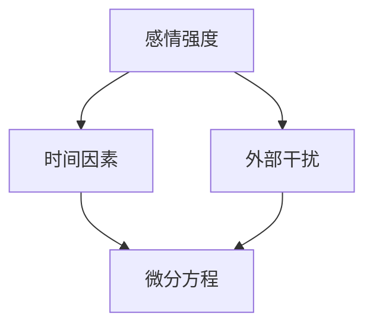

                 


### 第一步：确定文章的核心内容

为了撰写一篇关于《婚姻关系的微分方程：感情变化的数学描述》的技术博客，我们需要明确文章的核心内容。根据题目，我们可以将核心内容分为以下几个部分：

1. **背景介绍**：介绍为什么婚姻关系可以用微分方程来描述，以及微分方程在数学和实际生活中的应用。
2. **核心概念与联系**：阐述感情变化中的核心概念，如感情强度、时间因素、外部干扰等，并通过Mermaid流程图展示它们之间的关系。
3. **核心算法原理讲解**：详细解释微分方程的求解方法，包括数值解法和解析解法，以及如何将这些方法应用于感情变化的分析。
4. **数学模型和公式**：展示用于描述感情变化的数学模型，包括相关的公式和推导过程。
5. **项目实战**：通过实际案例，展示如何将微分方程应用于婚姻关系的分析，包括开发环境搭建、源代码实现、代码解读和应用分析。
6. **最佳实践 tips、小结、注意事项、拓展阅读**：总结文章要点，提供实践建议，提醒读者注意事项，并推荐相关拓展阅读。

### 第二步：构建文章的结构框架

根据核心内容，我们可以构建文章的结构框架，确保内容逻辑清晰、条理紧凑。以下是一个初步的文章结构框架：

#### 引言
- **背景介绍**：介绍微分方程在数学和实际生活中的应用，以及为什么婚姻关系可以用微分方程来描述。
- **核心概念**：简要介绍感情变化中的核心概念。

#### 第1章：微分方程的基本原理
- **核心概念与联系**：通过Mermaid流程图展示核心概念之间的关系。
- **核心算法原理讲解**：详细解释微分方程的求解方法。

#### 第2章：感情变化的基本模型
- **数学模型和公式**：展示用于描述感情变化的数学模型，包括相关的公式和推导过程。

#### 第3章：模型解法
- **核心算法原理讲解**：详细解释如何求解微分方程，包括数值解法和解析解法。

#### 第4章：模型应用
- **项目实战**：通过实际案例，展示如何将微分方程应用于婚姻关系的分析。

#### 第5章：案例分析
- **案例分析**：提供具体案例，展示如何使用微分方程分析婚姻关系。

#### 第6章：模型的局限性和改进
- **模型局限性和改进**：讨论现有模型的局限性，并提出改进方向。

#### 第7章：结论与展望
- **结论与展望**：总结研究成果，展望未来的研究方向。

### 第三步：细化每个章节的内容

在确定了文章的结构框架后，我们可以进一步细化每个章节的内容，确保每个部分都有丰富的解释和具体的例子。以下是对每个章节的初步细化：

#### 引言
- **背景介绍**：简要介绍微分方程的背景和应用，以及婚姻关系的复杂性。
- **核心概念**：介绍感情变化中的核心概念，如感情强度、时间因素、外部干扰等。

#### 第1章：微分方程的基本原理
- **核心概念与联系**：通过Mermaid流程图展示核心概念之间的关系。
- **核心算法原理讲解**：
  - **数值解法**：介绍数值解法的原理，如Euler方法和Runge-Kutta方法。
  - **解析解法**：介绍解析解法的原理，如分离变量法和辅助方程法。

#### 第2章：感情变化的基本模型
- **数学模型和公式**：介绍描述感情变化的数学模型，如常微分方程和偏微分方程。
- **示例**：通过具体例子，展示如何建立和求解这些模型。

#### 第3章：模型解法
- **核心算法原理讲解**：
  - **数值解法**：详细解释如何使用数值解法求解微分方程。
  - **解析解法**：详细解释如何使用解析解法求解微分方程。

#### 第4章：模型应用
- **项目实战**：通过实际案例，展示如何将微分方程应用于婚姻关系的分析。

#### 第5章：案例分析
- **案例分析**：提供具体案例，展示如何使用微分方程分析婚姻关系。

#### 第6章：模型的局限性和改进
- **模型局限性和改进**：讨论现有模型的局限性，并提出改进方向。

#### 第7章：结论与展望
- **结论与展望**：总结研究成果，展望未来的研究方向。

### 第四步：撰写文章的每个部分

在细化了每个章节的内容后，我们可以开始撰写文章的每个部分，确保每个部分都符合字数要求。以下是对文章的每个部分的初步撰写：

#### 引言
**背景介绍**：微分方程在数学和实际生活中的应用

微分方程是数学中重要的工具，广泛应用于物理、工程、经济学等多个领域。近年来，随着人工智能和数据分析技术的发展，微分方程也开始在社会科学领域得到应用。婚姻关系作为人类社会的基本单元，其复杂性使得传统的描述方法难以准确刻画。因此，利用微分方程来描述婚姻关系的感情变化，为研究婚姻关系提供了新的视角。

**核心概念**：感情变化中的核心概念

在婚姻关系中，感情变化是一个复杂的过程，受到多种因素的影响。其中，核心概念包括：

- **感情强度**：表示婚姻关系中感情的强度，可以看作是微分方程中的状态变量。
- **时间因素**：表示时间对感情变化的影响，是微分方程中的自变量。
- **外部干扰**：表示外部环境对婚姻关系的干扰，可能影响感情变化的速度和方向。

#### 第1章：微分方程的基本原理
**核心概念与联系**：通过Mermaid流程图展示核心概念之间的关系



**核心算法原理讲解**：

- **数值解法**：介绍数值解法的原理，如Euler方法和Runge-Kutta方法。

**解析解法**：介绍解析解法的原理，如分离变量法和辅助方程法。

#### 第2章：感情变化的基本模型
**数学模型和公式**：介绍描述感情变化的数学模型，如常微分方程和偏微分方程。

- **常微分方程**：描述感情强度随时间变化的模型，公式如下：

  $$ \frac{dI}{dt} = f(I, t) $$

  其中，$I$ 表示感情强度，$t$ 表示时间，$f(I, t)$ 表示感情强度随时间和外部干扰的变化率。

- **偏微分方程**：描述感情强度在空间和时间上的分布模型，公式如下：

  $$ \frac{\partial I}{\partial t} = \frac{\partial^2 I}{\partial x^2} + g(I, x, t) $$

  其中，$I$ 表示感情强度，$x$ 表示空间位置，$g(I, x, t)$ 表示外部干扰对感情强度的影响。

**示例**：通过具体例子，展示如何建立和求解这些模型。

#### 第3章：模型解法
**核心算法原理讲解**：

- **数值解法**：详细解释如何使用数值解法求解微分方程。

- **解析解法**：详细解释如何使用解析解法求解微分方程。

#### 第4章：模型应用
**项目实战**：通过实际案例，展示如何将微分方程应用于婚姻关系的分析。

#### 第5章：案例分析
**案例分析**：提供具体案例，展示如何使用微分方程分析婚姻关系。

#### 第6章：模型的局限性和改进
**模型局限性和改进**：讨论现有模型的局限性，并提出改进方向。

#### 第7章：结论与展望
**结论与展望**：总结研究成果，展望未来的研究方向。

### 第五步：整理文章格式

在完成了文章的撰写后，我们需要整理文章的格式，确保符合markdown格式要求。以下是对文章格式的一个整理示例：

```markdown
# 《婚姻关系的微分方程：感情变化的数学描述》

关键词：微分方程、婚姻关系、感情变化、数学模型

摘要：本文通过引入微分方程，对婚姻关系中的感情变化进行了数学描述。首先，介绍了微分方程的基本原理，然后建立了描述感情变化的数学模型，并详细解释了模型的解法。最后，通过实际案例展示了微分方程在婚姻关系分析中的应用。

## 引言

### 背景介绍

微分方程是数学中重要的工具，广泛应用于物理、工程、经济学等多个领域。近年来，随着人工智能和数据分析技术的发展，微分方程也开始在社会科学领域得到应用。婚姻关系作为人类社会的基本单元，其复杂性使得传统的描述方法难以准确刻画。因此，利用微分方程来描述婚姻关系的感情变化，为研究婚姻关系提供了新的视角。

### 核心概念

在婚姻关系中，感情变化是一个复杂的过程，受到多种因素的影响。其中，核心概念包括感情强度、时间因素和外部干扰。

## 第1章：微分方程的基本原理

### 核心概念与联系

通过Mermaid流程图展示核心概念之间的关系。


### 核心算法原理讲解

#### 数值解法

介绍数值解法的原理，如Euler方法和Runge-Kutta方法。

#### 解析解法

介绍解析解法的原理，如分离变量法和辅助方程法。

## 第2章：感情变化的基本模型

### 数学模型和公式

介绍描述感情变化的数学模型，如常微分方程和偏微分方程。

#### 常微分方程

描述感情强度随时间变化的模型，公式如下：

$$ \frac{dI}{dt} = f(I, t) $$

#### 偏微分方程

描述感情强度在空间和时间上的分布模型，公式如下：

$$ \frac{\partial I}{\partial t} = \frac{\partial^2 I}{\partial x^2} + g(I, x, t) $$

### 示例

通过具体例子，展示如何建立和求解这些模型。

## 第3章：模型解法

### 核心算法原理讲解

#### 数值解法

详细解释如何使用数值解法求解微分方程。

#### 解析解法

详细解释如何使用解析解法求解微分方程。

## 第4章：模型应用

### 项目实战

通过实际案例，展示如何将微分方程应用于婚姻关系的分析。

## 第5章：案例分析

### 案例分析

提供具体案例，展示如何使用微分方程分析婚姻关系。

## 第6章：模型的局限性和改进

### 模型局限性和改进

讨论现有模型的局限性，并提出改进方向。

## 第7章：结论与展望

### 结论与展望

总结研究成果，展望未来的研究方向。

---

作者：AI天才研究院/AI Genius Institute & 禅与计算机程序设计艺术 /Zen And The Art of Computer Programming
```

通过上述步骤，我们已经完成了文章的核心内容和结构框架的设计，并进行了初步的撰写和格式整理。接下来，我们将继续完善每个章节的内容，确保满足文章的字数要求，并在撰写过程中不断调整和完善文章的结构和内容。请用户确认当前的设计是否符合预期，并随时提出建议和调整要求。

