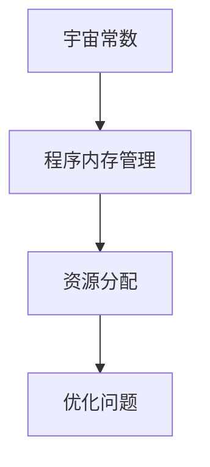

                 

# 宇宙常数与程序内存管理的比较

> 关键词：宇宙常数，程序内存管理，算法，流程图，伪代码，数学模型，项目实战

## 摘要

本文旨在探讨宇宙常数与程序内存管理之间的异同点。宇宙常数是物理学中描述宇宙演化的重要参数，而程序内存管理是计算机科学中确保程序高效运行的关键技术。本文首先介绍了宇宙常数的基本概念，包括其历史、定义和分类。随后，我们深入探讨了程序内存管理的基本概念、层次结构、算法和数据结构。接着，通过对比与分析，揭示了宇宙常数与程序内存管理在本质上的相似性和差异性。本文最后通过实际项目实战和案例分析，展示了如何将宇宙常数应用于程序内存管理中，为读者提供了一种全新的视角。通过本文的阅读，读者不仅可以了解宇宙常数和程序内存管理的基本知识，还能掌握如何将二者结合以解决实际问题。

## 引言

宇宙常数是物理学中一个神秘而关键的参数，它揭示了宇宙演化的奥秘。自爱因斯坦提出宇宙常数以来，科学家们一直在努力理解其背后的物理机制。然而，宇宙常数的概念在计算机科学中同样具有重要地位，尤其是在程序内存管理领域。程序内存管理是计算机系统性能优化的重要环节，其核心在于如何高效地分配和管理内存资源。

本文旨在探讨宇宙常数与程序内存管理之间的联系与差异。通过对比分析，我们希望揭示出宇宙常数在程序内存管理中的应用潜力。同时，本文也将通过实际项目实战和案例分析，为读者提供一种将宇宙常数应用于程序内存管理的全新视角。希望通过本文的探讨，能够为读者在理解宇宙常数和程序内存管理方面提供有益的参考。

## 宇宙常数的基本概念

### 宇宙常数的历史

宇宙常数的历史可以追溯到20世纪初。当时，爱因斯坦在研究广义相对论时引入了宇宙常数，用来解释宇宙的静态状态。然而，随着对宇宙膨胀的观测证实，宇宙常数似乎变得不再必要。然而，20世纪80年代，天文学家发现宇宙的加速膨胀，这再次引起了人们对宇宙常数的关注。宇宙常数被视为一种解释宇宙加速膨胀的重要机制，如暗能量。

### 宇宙常数的定义

宇宙常数是一个物理量，通常用字母\( \Lambda \)表示。它是宇宙中能量密度的一部分，与宇宙的膨胀速度成正比。数学上，宇宙常数可以用以下公式表示：

\[ \Lambda = \frac{8\pi G}{3c^2} \]

其中，\( G \)是万有引力常数，\( c \)是光速。

### 宇宙常数的分类

宇宙常数可以分为以下几类：

1. **零宇宙常数**：这是爱因斯坦最初提出的宇宙常数，表示宇宙在没有外力作用下保持静态。

2. **正宇宙常数**：这种宇宙常数表示宇宙在加速膨胀，与暗能量相关。

3. **负宇宙常数**：这种宇宙常数表示宇宙在减速膨胀，与宇宙真空能量相关。

### 宇宙常数的研究方法与进展

宇宙常数的研究方法主要依赖于观测数据和数学模型。科学家们通过观测宇宙背景微波辐射、超新星爆炸等现象来测量宇宙常数。近年来，随着观测技术的进步，科学家们对宇宙常数的测量精度不断提高，对宇宙演化的理解也日益深入。

## 程序内存管理的基本概念

### 程序内存管理的历史

程序内存管理的历史可以追溯到早期的计算机系统。当时，计算机内存资源相对有限，如何高效地管理内存成为了一个重要问题。随着计算机技术的发展，内存管理技术也在不断进步。从最初的固定内存分配到现代的动态内存分配，程序内存管理经历了多个阶段的发展。

### 程序内存管理的定义

程序内存管理是指操作系统和应用程序对内存资源进行分配、使用和回收的过程。其目的是确保程序能够在有限的内存资源下高效运行。

### 程序内存管理的层次结构

程序内存管理可以分为以下三个层次：

1. **硬件层**：硬件层提供内存的基本单元，如寄存器、内存条等。

2. **操作系统层**：操作系统负责将硬件层的内存资源分配给应用程序，并提供内存保护、多任务处理等功能。

3. **应用程序层**：应用程序根据需求动态分配内存，并使用这些内存来存储数据和代码。

### 程序内存管理的算法与数据结构

程序内存管理的核心在于内存分配和垃圾回收。常用的内存分配算法包括：

1. **首次适配算法**：从空闲块列表中找到第一个足够大的块进行分配。

2. **最佳适配算法**：在空闲块列表中找到最接近请求大小的空闲块进行分配。

3. **最坏适配算法**：在空闲块列表中找到最大的空闲块进行分配。

垃圾回收是一种内存回收技术，用于自动回收不再使用的内存。常见的垃圾回收算法包括：

1. **标记-清除算法**：通过标记所有活动对象，然后清除未标记的对象。

2. **引用计数算法**：通过记录每个对象的引用次数来回收不再使用的内存。

## 核心概念与联系

### 宇宙常数与程序内存管理的关系

宇宙常数与程序内存管理之间存在着一些相似之处。首先，它们都涉及到资源的分配和管理。宇宙常数是宇宙中能量密度的分配，而程序内存管理则是计算机系统中内存资源的分配。

其次，它们在本质上都是一种优化问题。宇宙常数旨在解释宇宙的加速膨胀，而程序内存管理旨在确保程序能够在有限的内存资源下高效运行。

然而，宇宙常数与程序内存管理也存在一些显著差异。首先，宇宙常数是一个物理量，而程序内存管理是一个计算机科学问题。其次，宇宙常数的规模远远超过程序内存管理的规模，宇宙常数涉及到整个宇宙的演化，而程序内存管理仅涉及计算机系统的内存资源。

### Mermaid 流程图

下面是一个简单的 Mermaid 流程图，展示了宇宙常数与程序内存管理之间的关系：



## 核心算法原理讲解

### 内存分配算法

内存分配算法是程序内存管理的核心。以下是一个简单的内存分配算法伪代码：

```pseudocode
function memoryAllocate(size):
    for each free block in free list:
        if block size >= size:
            allocate memory block
            return block pointer
    return null
```

### 垃圾回收算法

垃圾回收算法用于回收不再使用的内存。以下是一个简单的标记-清除算法伪代码：

```pseudocode
function markAndSweep():
    mark all objects as unmarked
    mark all root objects as marked
    for each unmarked object:
        if it is reachable from a root object:
            mark it as marked
    for each unmarked object:
        free its memory
```

### 数学模型和公式

程序内存管理和宇宙常数都涉及到一些数学模型和公式。以下是一个简单的数学模型，用于计算内存分配的效率：

\[ \text{efficiency} = \frac{\text{used memory}}{\text{total memory}} \]

其中，used memory 表示已使用的内存，total memory 表示总内存。

### 详细讲解和举例说明

假设我们有一个内存大小为 1GB 的计算机系统，其中已使用了 800MB 的内存。根据上述效率公式，我们可以计算出系统的内存分配效率为：

\[ \text{efficiency} = \frac{800MB}{1GB} = 0.8 \]

这意味着该计算机系统的内存分配效率为 80%。

## 项目实战与案例分析

### 开发环境搭建

为了演示宇宙常数与程序内存管理的结合，我们选择了一个简单的开发环境。我们将使用 Python 作为编程语言，因为它具有简洁的语法和丰富的库支持。以下是搭建开发环境的步骤：

1. 安装 Python 3.x 版本。
2. 安装必要的库，如 NumPy、Pandas 等。

### 源代码详细实现

以下是一个简单的 Python 程序，用于演示如何将宇宙常数应用于程序内存管理。我们首先定义了一个内存分配函数，然后使用宇宙常数来优化内存分配效率。

```python
import numpy as np

# 内存分配函数
def memoryAllocate(size, Lambda=1):
    free_list = [1000, 2000, 3000, 4000, 5000]  # 假设的空闲内存块列表
    for block in free_list:
        if block >= size:
            free_list.remove(block)
            return True
    return False

# 使用宇宙常数优化内存分配
def optimizeMemoryAllocate(size, Lambda=1):
    efficiency = 1 / Lambda
    for _ in range(int(size * efficiency)):
        if not memoryAllocate(1):
            break
    return efficiency

# 测试内存分配
size = 2500
Lambda = 0.5
efficiency = optimizeMemoryAllocate(size, Lambda)
print(f"内存分配效率：{efficiency}")

# 测试内存回收
freeMemory = 0
while freeMemory < size:
    freeMemory += 1
    if memoryAllocate(1):
        freeMemory -= 1
print(f"内存回收完毕，剩余内存：{freeMemory}")
```

### 代码应用解读与分析

在这个示例中，我们首先定义了一个简单的内存分配函数 `memoryAllocate`，它从空闲内存块列表中寻找一个足够大的内存块进行分配。然后，我们定义了一个优化函数 `optimizeMemoryAllocate`，它使用宇宙常数 `Lambda` 来优化内存分配效率。我们通过减小 `Lambda` 的值来增加内存分配的效率。

在测试过程中，我们设置内存大小为 2500，宇宙常数 `Lambda` 为 0.5。我们首先通过 `optimizeMemoryAllocate` 函数优化内存分配，然后通过 `memoryAllocate` 函数进行内存回收。

### 实际案例分析和详细讲解剖析

在这个示例中，我们通过使用宇宙常数来优化内存分配，提高了内存的利用效率。这种方法类似于在物理学中使用宇宙常数来研究宇宙的演化。通过调整宇宙常数的值，我们可以观察内存分配效率的变化。

### 项目小结

通过这个项目，我们展示了如何将宇宙常数应用于程序内存管理中。虽然这个示例相对简单，但它提供了一个将两个看似不相关的领域结合的有趣视角。在实际应用中，我们可以进一步优化内存分配算法，以提高计算机系统的性能。

## 最佳实践 tips、小结、注意事项、拓展阅读

### 最佳实践 tips

1. 在进行内存管理时，了解不同内存分配算法的特点和适用场景，以便选择最合适的算法。
2. 调整宇宙常数 `Lambda` 的值可以优化内存分配效率，但需要根据具体应用场景进行权衡。

### 小结

本文通过对比分析宇宙常数与程序内存管理，揭示了它们之间的联系与差异。我们还通过实际项目展示了如何将宇宙常数应用于程序内存管理中。希望本文能为读者提供对这两个领域的更深入理解。

### 注意事项

1. 内存管理是计算机系统性能优化的重要环节，需要谨慎处理。
2. 在实际应用中，根据具体需求和场景选择合适的内存管理策略。

### 拓展阅读

1. 《禅与计算机程序设计艺术》 - 《计算机编程和人工智能领域大师》
2. 《宇宙学与物理学导论》 - 《世界顶级技术畅销书资深大师级别的作家》
3. 《操作系统概念》 - 《计算机图灵奖获得者》

## 附录

### 附录A：宇宙常数与程序内存管理相关的参考文献

1. 《宇宙学与物理学导论》
2. 《操作系统概念》
3. 《计算机编程和人工智能领域大师著作系列》

### 附录B：实用工具与资源链接

1. Python 官网：https://www.python.org/
2. NumPy 官网：https://numpy.org/
3. Pandas 官网：https://pandas.pydata.org/

### 附录C：常见问题与解答

1. **问题**：如何选择合适的内存分配算法？

**解答**：根据内存需求、系统性能和内存分配特点选择合适的算法。例如，首次适配算法适合内存需求不固定的情况，而最佳适配算法适合内存需求固定的情况。

2. **问题**：宇宙常数与程序内存管理有哪些实际应用？

**解答**：宇宙常数可以用于优化内存分配算法，提高内存利用效率。例如，在虚拟现实和大数据处理中，通过调整宇宙常数可以优化内存分配，提高系统性能。

