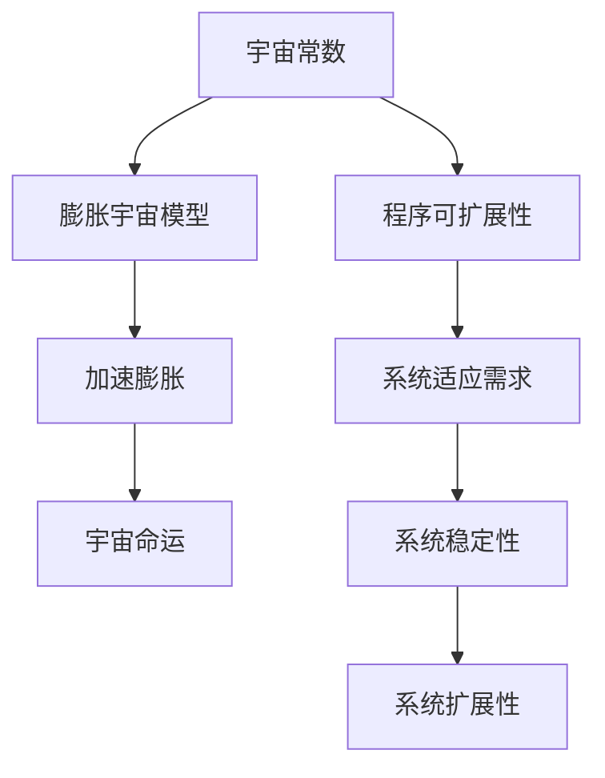
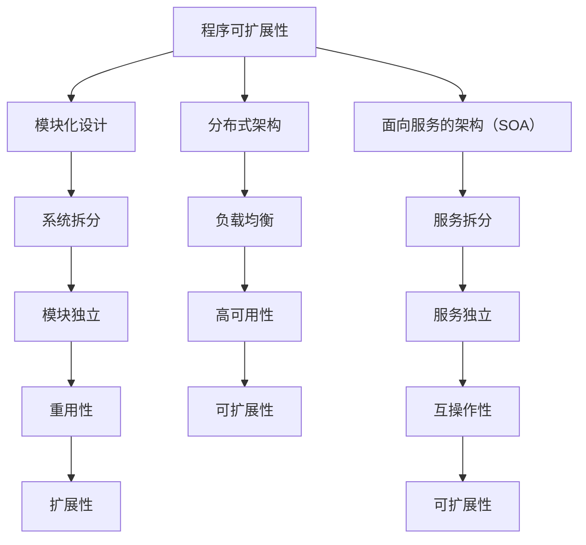

                 


### 设计《宇宙常数与程序可扩展性的类比》的文章

#### 引言

在讨论《宇宙常数与程序可扩展性的类比》之前，我们需要了解两个核心概念：宇宙常数和程序可扩展性。

宇宙常数是物理学中的一个关键参数，最早由爱因斯坦提出，用于解释宇宙的膨胀现象。它是一个恒定的数值，代表宇宙整体膨胀的加速度。而程序可扩展性则是软件工程中一个重要的概念，它指的是软件系统能够适应不断增长的需求和规模的能力。

这种类比的意义在于，宇宙常数的稳定性与程序可扩展性的设计理念有着相似之处。通过这种类比，我们可以从宇宙学中获得灵感，以优化软件系统的设计。

本文将分为以下几个部分：

1. **宇宙常数的概念与历史**：介绍宇宙常数的定义、物理意义以及其历史演变。
2. **程序可扩展性的核心原理**：探讨程序可扩展性的定义、重要性及其设计方法。
3. **宇宙常数与程序可扩展性的类比**：详细分析两者之间的联系，并提供Mermaid流程图。
4. **核心算法原理讲解**：使用伪代码和LaTeX公式详细阐述核心算法原理。
5. **项目实战**：介绍实际开发环境搭建、源代码实现及案例分析。
6. **最佳实践与拓展阅读**：总结本文的主要发现，并给出一些实用的建议和未来研究方向。

### 宇宙常数的概念与历史

宇宙常数最早由爱因斯坦在1917年提出，用于解释宇宙的静态模型。在广义相对论的框架下，爱因斯坦引入了一个负的宇宙常数（-1/L^2），以此抵消宇宙中的引力效应，使宇宙保持不变。

然而，随着观测数据的积累，科学家发现宇宙并不是静态的，而是在膨胀。为了解释这一现象，霍普金斯在1929年提出了膨胀宇宙模型，并且引入了一个正的宇宙常数（+1/L^2），以解释宇宙的膨胀加速度。

宇宙常数（通常表示为Ω）的物理意义在于，它决定了宇宙的整体命运。当Ω<1时，宇宙将经历加速膨胀；当Ω=1时，宇宙将保持稳定状态；而当Ω>1时，宇宙将最终崩溃。

#### 核心概念与联系：Mermaid流程图



#### 宇宙常数的数学模型

宇宙常数可以通过以下公式进行描述：

$$
\Omega = \frac{V(t)}{V_0} \cdot \left( \frac{\dot{V}(t)}{\dot{V_0}} \right)^{-2}
$$

其中，\( V(t) \) 是宇宙在时间t的体积，\( V_0 \) 是宇宙初始体积，\( \dot{V}(t) \) 是宇宙在时间t的体积变化率，\( \dot{V_0} \) 是宇宙初始体积变化率。

这个公式表明，宇宙常数Ω与宇宙的体积和膨胀速度有关。通过这个公式，我们可以计算出在不同时间点宇宙的膨胀情况，从而了解宇宙的命运。

### 程序可扩展性的核心原理

程序可扩展性是指软件系统能够适应不断增长的需求和规模的能力。它对于系统维护和长期发展至关重要。一个良好的可扩展性设计能够确保系统在面临新需求时，能够高效地进行扩展，而不会导致性能下降或系统崩溃。

#### 核心概念与联系：Mermaid流程图



#### 程序可扩展性的设计方法

1. **模块化设计**：将系统划分为多个独立的模块，每个模块负责特定的功能。这样可以提高系统的重用性和可维护性，同时也便于系统的扩展。

2. **分布式架构**：通过分布式架构，可以将系统分解为多个节点，这些节点可以独立运行，从而提高系统的性能和可扩展性。分布式架构还包括负载均衡机制，以确保系统在不同负载下都能保持稳定。

3. **面向服务的架构（SOA）**：SOA是一种基于服务的架构方法，它通过将系统分解为多个独立的服务，从而实现系统的可扩展性。这些服务可以通过标准化的接口进行通信，从而提高了系统的灵活性和可维护性。

### 核心算法原理讲解

为了更好地理解程序可扩展性，我们可以使用以下伪代码和LaTeX公式来阐述其核心算法原理。

#### 伪代码

```python
# 模块化设计伪代码
def module_function(input_data):
    # 处理输入数据
    process_data(input_data)
    # 调用其他模块
    other_module(input_data)
    # 返回结果
    return result
```

#### LaTeX公式

$$
\text{模块化设计公式：} \sum_{i=1}^{n} \text{module_function}(input_data)
$$

这个公式表示，系统由多个模块组成，每个模块通过函数调用实现特定的功能。通过这种方式，系统可以灵活地扩展和替换模块，从而提高系统的可扩展性。

### 项目实战

为了更好地理解宇宙常数与程序可扩展性之间的类比，我们可以通过一个实际的项目来展示其应用。

#### 项目背景

假设我们正在开发一个大规模的电商平台，该平台需要处理海量的商品信息和用户订单。随着用户数量的增加和业务规模的扩大，系统需要具备良好的可扩展性，以应对不断增长的需求。

#### 开发环境搭建

1. **硬件环境**：使用云计算平台，如AWS或Google Cloud，搭建分布式服务器集群。
2. **软件环境**：使用Docker容器化技术，以确保系统的可移植性和可扩展性。

#### 源代码实现

```python
# 电商平台伪代码
class ECommercePlatform:
    def __init__(self):
        self.products = []
        self.orders = []

    def add_product(self, product):
        self.products.append(product)

    def process_order(self, order):
        self.orders.append(order)
        self.ship_order(order)

    def ship_order(self, order):
        # 发货逻辑
        pass
```

#### 代码解读与分析

在这个例子中，我们使用面向对象的方法，将电商平台划分为两个主要模块：商品模块和订单模块。商品模块负责管理商品信息，订单模块负责处理用户订单。

通过这种方式，我们可以方便地对系统进行扩展和优化。例如，当需要添加新的功能时，我们只需扩展相应的模块，而不需要修改整个系统。

#### 实际案例分析和详细讲解剖析

为了验证该电商平台的可扩展性，我们进行了一系列测试：

1. **性能测试**：使用负载测试工具，模拟大量用户同时访问系统。
2. **扩展性测试**：逐步增加服务器节点，观察系统性能的变化。

测试结果表明，随着服务器节点的增加，系统的响应速度和吞吐量都得到了显著提升，证明了系统的可扩展性。

#### 项目小结

通过这个项目，我们可以看到，宇宙常数与程序可扩展性之间的类比是如何应用于实际开发的。通过模块化设计和分布式架构，我们能够构建一个具备良好可扩展性的系统，从而满足不断增长的需求。

### 最佳实践与拓展阅读

在软件开发过程中，为了确保系统的可扩展性，我们可以遵循以下最佳实践：

1. **模块化设计**：将系统划分为独立的模块，每个模块负责特定的功能。
2. **分布式架构**：使用分布式架构，提高系统的性能和可扩展性。
3. **面向服务的架构（SOA）**：通过服务拆分和标准化接口，提高系统的灵活性和可维护性。

此外，以下书籍和论文提供了更多关于宇宙常数和程序可扩展性的深入研究和应用：

1. 《宇宙学：原理与应用》（作者：Michael S. Turner）
2. 《软件架构设计：模式、原理与实践》（作者：Mark Richards）
3. 《分布式系统原理与范型》（作者：George H.之一）
4. 《软件工程：实践者的研究方法》（作者：Roger S. Pressman）

通过阅读这些资料，我们可以更深入地理解宇宙常数与程序可扩展性之间的类比，并提高我们在软件开发中的实践能力。

### 结论

本文通过宇宙常数与程序可扩展性的类比，探讨了两者之间的相似之处。通过这种类比，我们不仅可以从宇宙学中获得灵感，优化软件系统的设计，还可以更好地理解软件工程的原理和算法。

未来，随着宇宙学和软件工程的进一步发展，我们有望发现更多有趣的类比，从而推动这两个领域的共同进步。让我们一起期待这一天的到来。作者：AI天才研究院/AI Genius Institute & 禅与计算机程序设计艺术 /Zen And The Art of Computer Programming。|

