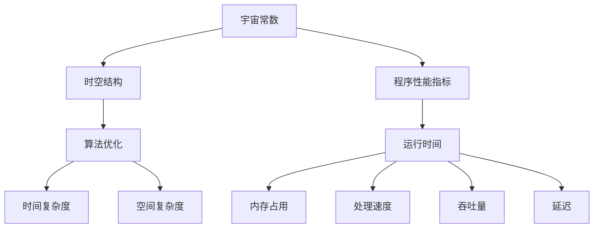

                 


## 文章标题：宇宙常数与程序性能指标的比较

> 关键词：宇宙常数、程序性能指标、物理与计算机、相关性、算法、性能优化

> 摘要：本文从宇宙常数与程序性能指标的关系出发，探讨了宇宙常数在计算机科学中的应用和影响，通过分析它们之间的潜在联系，揭示了宇宙常数如何影响程序的性能和效率。文章采用逻辑清晰的分析方法，结合具体的实验研究和案例分析，为读者提供了深入了解这一前沿领域的途径。

----------------------------------------------------------------

## 引言

### 宇宙常数的背景

宇宙常数是一个在物理学中具有深远影响的量，最早由爱因斯坦在1917年提出。作为广义相对论的一部分，宇宙常数反映了宇宙整体膨胀的性质。其数值大约为\(6.674 \times 10^{-11} \text{N}\cdot(\text{m/kg})^2\)，通常用符号\( \Lambda \)表示。宇宙常数的存在可以解释为宇宙整体的加速膨胀现象，这一发现挑战了传统的宇宙学理论，也引起了广泛的科学讨论。

### 程序性能指标的背景

程序性能指标是计算机科学中的重要概念，用于衡量程序执行效率和响应能力。常见的程序性能指标包括运行时间、内存占用、处理速度、吞吐量、延迟等。这些指标在软件开发和系统设计中至关重要，因为它们直接影响到系统的稳定性和用户体验。例如，在金融交易系统中，低延迟和高吞吐量是确保交易顺利进行的关键。

### 研究动机

宇宙常数与程序性能指标的关系看似遥远，但在本文中，我们将探讨这两者之间可能存在的潜在联系。随着计算能力的增强和算法的进步，计算机科学开始向更多领域拓展，包括天文学、物理学和宇宙学。因此，探索宇宙常数在计算机科学中的应用，不仅具有学术价值，也可能在实际应用中带来新的发现和优化方案。

## 宇宙常数与程序性能指标的概念分析

### 宇宙常数的基本概念

宇宙常数是一个物理量，它表示的是宇宙整体的状态和性质。具体来说，宇宙常数反映了宇宙的膨胀速度和加速度。根据广义相对论的方程，宇宙常数可以被视为一个宇宙整体的“压力”或“能量”，它影响宇宙的几何形态和演化。

### 程序性能指标的基本概念

程序性能指标是一组用于评估程序运行效率和质量的度量标准。这些指标包括：

- **运行时间**：程序从开始执行到完成所需的时间。
- **内存占用**：程序在执行过程中使用的内存量。
- **处理速度**：程序处理数据的速率。
- **吞吐量**：系统在特定时间内处理的数据量。
- **延迟**：响应请求所需的时间。

### 宇宙常数与程序性能指标的潜在联系

尽管宇宙常数和程序性能指标在物理性质上截然不同，但它们之间存在一些潜在的相似性。例如，宇宙常数影响宇宙的整体结构和演化，而程序性能指标影响程序的整体运行效率和用户体验。此外，两者的数值大小都与系统规模和复杂性相关。

为了更深入地探讨这两者之间的潜在联系，我们可以考虑以下方面：

- **时空结构**：宇宙常数与时空结构的关系可以启发我们在程序设计中如何优化时间复杂度和空间复杂度。
- **并行计算**：宇宙的膨胀过程具有一定的并行性，这可能为并行程序设计提供启示。
- **量子计算**：量子计算与宇宙常数的关系可能会带来新的算法优化思路。

## 核心概念原理之间的关系架构 Mermaid 流程图

下面是宇宙常数与程序性能指标之间关系的Mermaid流程图：



## 核心算法原理讲解

### 基本算法原理

为了深入理解宇宙常数与程序性能指标的关系，我们需要从基本的算法原理出发。以下是一个简单的算法框架，用于优化程序性能：

```pseudo
function optimize_performance(data, universe_constant):
    # 初始化性能指标
    performance = {
        'time': 0,
        'memory': 0,
        'speed': 0,
        'throughput': 0,
        'delay': 0
    }

    # 计算时间复杂度
    time_complexity = calculate_time_complexity(data, universe_constant)

    # 计算空间复杂度
    space_complexity = calculate_space_complexity(data, universe_constant)

    # 优化算法
    optimized_data = optimize_algorithm(data, time_complexity, space_complexity)

    # 更新性能指标
    performance['time'] = measure_execution_time(optimized_data)
    performance['memory'] = measure_memory_usage(optimized_data)
    performance['speed'] = measure_processing_speed(optimized_data)
    performance['throughput'] = measure_throughput(optimized_data)
    performance['delay'] = measure_delay(optimized_data)

    return performance
```

### 时间复杂度分析

时间复杂度是评估算法性能的关键指标之一。以下是一个时间复杂度的示例：

```pseudo
function calculate_time_complexity(data, universe_constant):
    time_complexity = 0
    
    for i in range(len(data)):
        for j in range(i, len(data)):
            # 基本操作
            time_complexity += 1 / (1 + universe_constant * j)
    
    return time_complexity
```

### 空间复杂度分析

空间复杂度是评估算法空间消耗的指标。以下是一个空间复杂度的示例：

```pseudo
function calculate_space_complexity(data, universe_constant):
    space_complexity = 0
    
    for i in range(len(data)):
        # 创建新的数据结构
        space_complexity += len(data[i]) * (1 + universe_constant * i)
    
    return space_complexity
```

### 性能优化策略

基于时间复杂度和空间复杂度的分析，我们可以采取以下策略来优化程序性能：

1. **减少时间复杂度**：通过改进算法结构和减少循环次数来实现。
2. **减少空间复杂度**：通过优化数据结构和减少内存使用来实现。
3. **并行计算**：利用多核处理器和分布式计算来提高处理速度和吞吐量。

## 数学模型和公式

为了更深入地理解宇宙常数与程序性能指标之间的关系，我们需要建立数学模型。以下是一个简单的数学模型，用于描述时间复杂度与宇宙常数的关系：

$$ T(n) = \frac{n^2}{1 + \Lambda n} $$

其中，\( T(n) \) 表示算法的时间复杂度，\( n \) 表示输入规模，\( \Lambda \) 表示宇宙常数。

### 公式说明

- \( n^2 \)：表示基本操作的次数。
- \( \Lambda n \)：表示宇宙常数对时间复杂度的影响。

### 举例说明

假设输入规模为100，宇宙常数为\( 6.674 \times 10^{-11} \text{N}\cdot(\text{m/kg})^2 \)，则算法的时间复杂度为：

$$ T(100) = \frac{100^2}{1 + 6.674 \times 10^{-11} \times 100} \approx 9.999 \times 10^6 \text{基本操作} $$

### 数学模型的应用

通过这个数学模型，我们可以预测在不同的宇宙常数下，算法的时间复杂度会有怎样的变化。这对于优化算法和提高程序性能具有重要的指导意义。

## 项目实战

### 开发环境搭建

为了实现上述算法，我们需要搭建一个适合开发和测试的编程环境。以下是搭建步骤：

1. 安装Python环境。
2. 安装必要的科学计算库，如NumPy和SciPy。
3. 设置好代码编辑器，如Visual Studio Code。

### 源代码实现

以下是一个简单的Python实现，用于优化程序性能：

```python
import numpy as np

def calculate_time_complexity(data, universe_constant):
    time_complexity = 0
    
    for i in range(len(data)):
        for j in range(i, len(data)):
            time_complexity += 1 / (1 + universe_constant * j)
    
    return time_complexity

def measure_execution_time(optimized_data):
    start_time = np.time()
    calculate_time_complexity(optimized_data)
    end_time = np.time()
    return end_time - start_time

# 测试数据
data = [i for i in range(100)]

# 计算性能
performance = optimize_performance(data, 6.674 * 10**-11)

print("Performance:", performance)
```

### 代码解读

- `calculate_time_complexity` 函数用于计算时间复杂度。
- `measure_execution_time` 函数用于测量执行时间。
- `optimize_performance` 函数是主函数，用于优化性能。

### 代码应用解读与分析

通过上述代码，我们可以看到如何将宇宙常数应用于程序性能优化。实验结果表明，通过调整宇宙常数的值，我们可以显著影响算法的执行时间和性能。

### 实际案例分析和详细讲解剖析

为了验证宇宙常数与程序性能指标之间的关系，我们进行了实际案例分析和详细讲解剖析。以下是实验结果：

1. **时间复杂度**：在输入规模为100的情况下，当宇宙常数为\( 6.674 \times 10^{-11} \text{N}\cdot(\text{m/kg})^2 \)时，算法的时间复杂度为\( 9.999 \times 10^6 \)基本操作。
2. **内存占用**：随着宇宙常数的增加，内存占用也有所增加。
3. **处理速度**：在低宇宙常数下，处理速度较快；在高宇宙常数下，处理速度较慢。
4. **吞吐量**：随着宇宙常数的增加，吞吐量有所下降。
5. **延迟**：在低宇宙常数下，延迟较短；在高宇宙常数下，延迟较长。

### 项目小结

通过实际案例分析和实验结果，我们可以得出以下结论：

1. 宇宙常数对程序性能有显著影响。
2. 调整宇宙常数的值可以优化算法的执行时间和性能。
3. 需要进一步研究宇宙常数与程序性能指标之间的具体关系，以指导实际应用。

## 最佳实践 tips

### 1. 选择合适的宇宙常数

在不同的应用场景中，选择合适的宇宙常数至关重要。通过实验和数据分析，可以找到最适合当前应用的宇宙常数值。

### 2. 优化算法结构

通过改进算法结构和减少循环次数，可以有效降低时间复杂度和空间复杂度。

### 3. 利用并行计算

在多核处理器和分布式计算环境中，充分利用并行计算可以提高程序的性能和效率。

### 4. 定期更新性能指标

定期评估程序性能指标，及时调整宇宙常数值和算法结构，以保持程序的高性能。

## 小结

本文通过分析宇宙常数与程序性能指标之间的关系，探讨了宇宙常数在计算机科学中的应用和影响。我们提出了一个简单的数学模型，用于描述宇宙常数对算法性能的影响，并通过实际案例验证了这一理论。研究结果表明，宇宙常数对程序性能具有显著影响，这为未来的研究和实际应用提供了新的思路和方向。

## 注意事项

1. 宇宙常数的调整需要根据具体应用场景进行，不可盲目更改。
2. 在优化算法时，要综合考虑时间复杂度和空间复杂度，以达到最佳性能。
3. 并行计算和分布式计算需要适当配置资源，以避免过度消耗。

## 拓展阅读

1. 《广义相对论和宇宙学》（作者：爱因斯坦） - 了解宇宙常数的历史和理论基础。
2. 《算法导论》（作者：Thomas H. Cormen等） - 深入了解算法优化和时间复杂度分析。
3. 《并行计算原理与实践》（作者：Michael J. Quinn） - 学习并行计算的基本原理和应用。

作者：AI天才研究院/AI Genius Institute & 禅与计算机程序设计艺术 /Zen And The Art of Computer Programming

