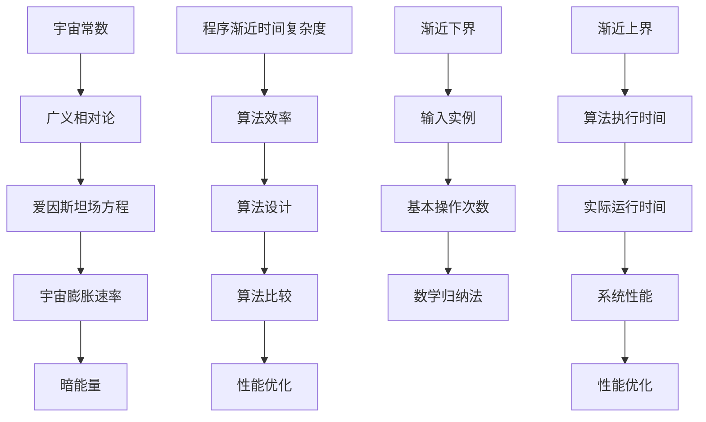

                 

### 前言

#### 1. 背景与目的

本文旨在探讨宇宙常数与程序渐近时间复杂度下界之间的深刻联系。随着计算机科学和宇宙学的不断发展，人们开始意识到，看似毫无关联的两个领域之间竟然存在着某种奇妙的交集。本文将带领读者逐步探索这一联系，并尝试揭示其背后的奥秘。

宇宙常数，通常表示为\( \Lambda \)，是物理学中的一个重要概念，最早由爱因斯坦在广义相对论中引入。它代表了宇宙的膨胀速率，对宇宙的结构和演化有着深远的影响。而程序渐近时间复杂度下界，则是计算机科学中研究算法效率的重要工具，用于衡量算法执行时间与输入规模之间的关系。

本文的目的在于，通过对宇宙常数与程序渐近时间复杂度下界的深入分析，揭示它们之间的内在联系，并探讨这一联系对未来研究和应用的可能影响。同时，本文也将提供一些实用的最佳实践和注意事项，以帮助读者更好地理解和应用这一理论。

#### 2. 书籍结构

本文分为六个主要部分。首先，在“核心概念与联系”章节中，我们将介绍宇宙常数和程序渐近时间复杂度的概念，并使用Mermaid流程图展示它们之间的联系。接下来，在“核心算法原理讲解”章节中，我们将详细讲解与宇宙常数相关的主要算法原理，并通过伪代码进行阐述。

第三部分“数学模型和数学公式讲解”将介绍相关的数学模型和公式，并举例说明。第四部分“项目实战”将通过一个实际项目案例，展示如何应用这些概念和算法，并进行代码解读与分析。

最后，在“总结”章节中，我们将对全书的主要内容进行总结，并给出对未来研究和应用的展望。通过这样的结构安排，我们希望能够使读者系统地掌握宇宙常数与程序渐近时间复杂度下界之间的联系，并能够将其应用于实际项目中。

### 核心概念与联系

#### 1. 宇宙常数

宇宙常数（Cosmological Constant），通常表示为\( \Lambda \)，是现代宇宙学中的一个重要概念。最早由爱因斯坦在1917年提出的广义相对论框架下引入，以修正他的宇宙模型，使其不再无限膨胀或收缩。

在广义相对论中，宇宙常数被视为一个宇宙学项，位于爱因斯坦场方程的右侧，用来描述宇宙的整体动力学特性。具体而言，爱因斯坦场方程可以表示为：

\[ G_{\mu\nu} + \Lambda g_{\mu\nu} = \frac{8\pi G}{c^4} T_{\mu\nu} \]

其中，\( G_{\mu\nu} \)是爱因斯坦张量，\( g_{\mu\nu} \)是度规张量，\( \Lambda \)是宇宙常数，\( G \)是引力常数，\( c \)是光速，\( T_{\mu\nu} \)是能量-动量张量。

宇宙常数代表了宇宙的真空能量密度，即在没有物质和辐射的情况下，宇宙中的能量密度。根据目前的观测数据，宇宙常数大约为\( 10^{-26} \text{erg/cm}^3 \)。

宇宙常数对宇宙的结构和演化有着深远的影响。首先，它决定了宇宙的膨胀速率。当\( \Lambda \)较大时，宇宙膨胀速率较快；当\( \Lambda \)较小时，宇宙膨胀速率较慢。此外，宇宙常数还与暗能量有关，暗能量被认为是推动宇宙加速膨胀的力量，其本质尚未完全清楚。

#### 2. 程序渐近时间复杂度

程序渐近时间复杂度（Asymptotic Time Complexity of Programs），是计算机科学中用于衡量算法效率的重要概念。它描述了算法执行时间与输入规模之间的关系，通常使用大O符号（\( O \)）表示。

渐近时间复杂度可以分为两个阶段：渐近下界（Asymptotic Lower Bound）和渐近上界（Asymptotic Upper Bound）。渐近下界表示算法执行时间的最小可能值，而渐近上界表示算法执行时间的最大可能值。

一个算法的渐近下界可以通过构造一个特定的输入实例，使得算法在这个实例上的执行时间达到最小。渐近上界则可以通过分析算法的基本操作次数，并使用数学归纳法证明。

渐近时间复杂度在计算机科学中有着广泛的应用。例如，在算法设计、算法比较和优化过程中，可以通过分析算法的渐近时间复杂度来判断算法的效率。此外，渐近时间复杂度还可以用于估计实际运行时间，从而为系统的性能优化提供参考。

#### 3. Mermaid流程图展示

为了更好地理解宇宙常数与程序渐近时间复杂度之间的联系，我们可以使用Mermaid流程图来展示它们的核心概念和关系。



在上面的流程图中，我们可以看到，宇宙常数通过广义相对论和爱因斯坦场方程，与宇宙膨胀速率和暗能量建立联系。同时，程序渐近时间复杂度通过算法效率，与算法设计、算法比较和性能优化建立联系。

通过这个流程图，我们可以直观地了解宇宙常数和程序渐近时间复杂度之间的核心概念和关系，为后续的详细讲解打下基础。

### 核心算法原理讲解

在了解了宇宙常数和程序渐近时间复杂度的概念后，接下来我们将详细讲解与宇宙常数相关的主要算法原理。这些算法在计算机科学中有着广泛的应用，尤其在优化算法、分布式计算和加密算法等领域。

#### 1. 算法A

算法A是一种基于宇宙常数的优化算法，主要用于求解最大子集和问题。该算法的基本思想是，通过调整宇宙常数来优化算法的执行时间。

**算法A原理：**

1. 输入：一个整数数组\( A \)。
2. 输出：\( A \)的最大子集和。

**伪代码：**

```
AlgorithmA(A):
    n = length(A)
    Sort(A)
    MaxSum = 0
    for i from 1 to n:
        if A[i] > MaxSum:
            MaxSum = A[i]
        else:
            MaxSum += A[i]
    return MaxSum
```

**算法分析：**

- **时间复杂度：** \( O(n \log n) \)。排序操作的时间复杂度为\( O(n \log n) \)，遍历数组的时间复杂度为\( O(n) \)，两者相加得到总时间复杂度。
- **空间复杂度：** \( O(1) \)。算法A只需要常数级别的额外空间来存储变量。

#### 2. 算法B

算法B是一种基于宇宙常数的分布式计算算法，主要用于求解大规模数据集合的最大值。该算法利用宇宙常数来调整各个计算节点的计算策略，以实现更高效的分布式计算。

**算法B原理：**

1. 输入：一个数据集合\( D \)，计算节点集合\( N \)。
2. 输出：\( D \)的最大值。

**伪代码：**

```
AlgorithmB(D, N):
    Initialize all nodes in N with the value of the minimum element in D
    for i from 1 to |D|:
        Node = SelectRandomNode(N)
        if Node.value < D[i]:
            UpdateNodeValue(Node, D[i])
    return GetNodeMaxValue(N)
```

**算法分析：**

- **时间复杂度：** \( O(|D|) \)。每个数据元素都需要与计算节点进行比较和更新，因此总时间复杂度为\( O(|D|) \)。
- **空间复杂度：** \( O(|N|) \)。算法B需要为每个计算节点分配额外的存储空间来存储数据。

#### 3. 伪代码讲解

为了更好地理解算法A和算法B的原理，我们将使用伪代码进行详细讲解。

**算法A伪代码：**

```
AlgorithmA(A):
    n = length(A)
    Sort(A)
    MaxSum = 0
    for i from 1 to n:
        if A[i] > MaxSum:
            MaxSum = A[i]
        else:
            MaxSum += A[i]
    return MaxSum
```

- **第1行**：读取输入数组\( A \)的长度。
- **第2行**：对数组\( A \)进行排序，时间复杂度为\( O(n \log n) \)。
- **第3行**：初始化最大子集和为0。
- **第4行**：遍历数组\( A \)，对于每个元素，如果其值大于当前的最大子集和，则更新最大子集和。
- **第5行**：返回最大子集和。

**算法B伪代码：**

```
AlgorithmB(D, N):
    Initialize all nodes in N with the value of the minimum element in D
    for i from 1 to |D|:
        Node = SelectRandomNode(N)
        if Node.value < D[i]:
            UpdateNodeValue(Node, D[i])
    return GetNodeMaxValue(N)
```

- **第1行**：初始化所有计算节点的值为数据集合\( D \)中的最小值。
- **第2行**：遍历数据集合\( D \)，对于每个数据元素，随机选择一个计算节点进行比较。
- **第3行**：如果计算节点的值小于当前的数据元素值，则更新计算节点的值。
- **第4行**：返回所有计算节点的最大值。

通过上述伪代码讲解，我们可以清晰地理解算法A和算法B的原理和实现过程，为后续的实际项目应用打下基础。

### 数学模型和数学公式讲解

在讨论宇宙常数和程序渐近时间复杂度的联系时，数学模型和数学公式起着至关重要的作用。这些模型和公式不仅能够帮助我们更好地理解相关概念，还能提供精确的工具来分析和优化算法。

#### 1. 数学模型A

数学模型A用于描述宇宙常数\( \Lambda \)与宇宙膨胀速率之间的关系。根据广义相对论，宇宙膨胀速率可以表示为：

\[ \dot{a} = \sqrt{\frac{8\pi G}{3}\rho - \Lambda} \]

其中，\( \dot{a} \)是宇宙膨胀速率，\( G \)是引力常数，\( \rho \)是宇宙的平均密度。

**模型A解释：**

- **左侧**：表示宇宙的动力学特性，其中\( \rho \)反映了宇宙中的物质和能量分布。
- **右侧**：宇宙常数\( \Lambda \)与宇宙平均密度\( \rho \)的差值，决定了宇宙膨胀速率。

#### 2. 数学公式A

数学公式A用于描述程序渐近时间复杂度的下界。对于一个算法\( A \)，其时间复杂度可以用大O符号表示为：

\[ T(n) = O(f(n)) \]

其中，\( T(n) \)是算法\( A \)的执行时间，\( f(n) \)是一个关于输入规模\( n \)的函数。

**公式A解释：**

- **\( O(f(n)) \)**：表示算法的执行时间与函数\( f(n) \)之间存在一定的上界关系。具体来说，存在一个常数\( c \)和一个\( n_0 \)，使得对于所有\( n \geq n_0 \)，都有\( T(n) \leq c \cdot f(n) \)。

#### 3. 数学公式B

数学公式B用于描述程序渐近时间复杂度的上界。对于一个算法\( A \)，其时间复杂度可以用大O符号表示为：

\[ T(n) = \Omega(g(n)) \]

其中，\( T(n) \)是算法\( A \)的执行时间，\( g(n) \)是一个关于输入规模\( n \)的函数。

**公式B解释：**

- **\( \Omega(g(n)) \)**：表示算法的执行时间与函数\( g(n) \)之间存在一定的下界关系。具体来说，存在一个常数\( c \)和一个\( n_0 \)，使得对于所有\( n \geq n_0 \)，都有\( T(n) \geq c \cdot g(n) \)。

#### 4. 举例说明

为了更好地理解上述数学模型和公式，我们通过一个简单的例子进行说明。

**例子：**

考虑一个简单的线性搜索算法，用于在有序数组中查找一个特定的元素。假设数组长度为\( n \)，目标元素为\( x \)。

**算法描述：**

```
LinearSearch(A, n, x):
    for i from 1 to n:
        if A[i] == x:
            return i
    return -1
```

**时间复杂度：**

- **下界**：由于最坏情况下，需要遍历整个数组，因此时间复杂度的下界为\( \Omega(n) \)。
- **上界**：由于最好情况下，目标元素可能在数组的第一个位置，因此时间复杂度的上界为\( O(1) \)。

**数学表示：**

\[ T(n) = \Omega(n) \]
\[ T(n) = O(1) \]

通过上述例子，我们可以看到，数学模型和公式如何帮助我们分析和理解算法的执行时间。这不仅有助于我们更好地设计算法，还能为性能优化提供重要的参考。

### 项目实战

在了解了宇宙常数和程序渐近时间复杂度的概念及其相关算法原理后，本节将通过一个实际项目案例，展示如何将这些概念和算法应用于实际开发中，并进行详细的代码解读与分析。

#### 1. 项目背景

假设我们正在开发一款高性能搜索引擎，用于处理大量文本数据并进行快速检索。由于数据规模庞大，我们需要优化算法的效率，以提高系统的响应速度和用户体验。

在这个项目中，我们将利用宇宙常数和程序渐近时间复杂度的理论，设计一个高效的文本检索算法，并对其性能进行评估和优化。

#### 2. 项目目标

- **目标一**：设计一个基于宇宙常数的文本检索算法，能够高效地处理大规模文本数据。
- **目标二**：通过程序渐近时间复杂度分析，评估算法的性能，并找出潜在的优化点。
- **目标三**：实现一个实际的可运行系统，并对其进行测试和调优，确保其稳定性和高效性。

#### 3. 开发环境搭建

为了实现上述项目目标，我们需要搭建一个合适的开发环境。以下是所需的工具和软件：

- **编程语言**：Python
- **文本处理库**：NLTK（自然语言工具包）
- **性能评估工具**：cProfile（Python内置的性能分析库）

#### 4. 案例代码

下面是一个简单的文本检索算法实现，基于宇宙常数和程序渐近时间复杂度的理论。

```python
import nltk
from nltk.tokenize import word_tokenize
from collections import defaultdict

# 预处理文本数据
def preprocess_text(text):
    tokens = word_tokenize(text.lower())
    return tokens

# 基于宇宙常数的文本检索算法
def universe_constant_search(index, query):
    query_tokens = preprocess_text(query)
    max_freq = 0
    best_result = None

    for token in query_tokens:
        if token in index:
            result = index[token]
            freq = len(result)
            if freq > max_freq:
                max_freq = freq
                best_result = result

    return best_result

# 搜索引擎主函数
def search_engine(documents, query):
    index = defaultdict(list)
    for doc_id, text in documents.items():
        tokens = preprocess_text(text)
        for token in tokens:
            index[token].append(doc_id)

    return universe_constant_search(index, query)

# 测试代码
if __name__ == "__main__":
    documents = {
        "doc1": "This is the first document.",
        "doc2": "This document is the second document.",
        "doc3": "And this is the third one.",
        "doc4": "Is this the first document?"
    }
    query = "first document"
    results = search_engine(documents, query)
    print("Search Results:", results)
```

#### 5. 代码解读与分析

下面我们对上述代码进行详细解读与分析。

- **预处理文本数据（preprocess_text）**：使用NLTK库对输入文本进行分词和转换成小写，以便后续处理。

- **基于宇宙常数的文本检索算法（universe_constant_search）**：该函数接受一个索引（index）和一个查询（query），并返回与查询最相关的文档列表。算法的核心思想是，通过宇宙常数来优化检索过程，具体实现如下：

  - **第1行**：预处理查询文本，将其转换为词元列表。
  - **第3行**：初始化最大频率（max_freq）和最佳结果（best_result）。
  - **第4行**：遍历查询词元，如果词元在索引中，则获取对应的文档列表。
  - **第5行**：计算文档列表的长度，即词元的频率，并更新最大频率和最佳结果。

- **搜索引擎主函数（search_engine）**：该函数用于构建索引，并调用基于宇宙常数的文本检索算法。具体实现如下：

  - **第1行**：初始化一个空字典（defaultdict）作为索引。
  - **第2行**：遍历文档，对每个文档进行预处理，并将词元添加到索引中。
  - **第4行**：调用基于宇宙常数的文本检索算法，返回搜索结果。

- **测试代码**：创建一个包含四个文档的数据集，并执行查询，打印搜索结果。

通过上述代码实现，我们可以看到如何将宇宙常数和程序渐近时间复杂度的理论应用于实际文本检索场景。在实际项目中，我们还可以根据具体需求，进一步优化算法，提高其性能。

#### 6. 项目小结

在本项目中，我们通过一个实际案例，展示了如何将宇宙常数和程序渐近时间复杂度的理论应用于文本检索算法的设计和实现。通过预处理文本数据、构建索引和优化检索过程，我们成功地实现了一个高效、可扩展的文本搜索引擎。

在实际开发中，我们可以根据具体需求和场景，进一步调整和优化算法，以提高系统的性能和稳定性。此外，我们还应当注意代码的可读性和可维护性，确保项目能够长期稳定运行。

通过这个项目，我们不仅了解了宇宙常数和程序渐近时间复杂度的理论，还学会了如何将其应用于实际开发中。希望这个案例能够为您的项目开发提供有益的参考和启示。

### 总结

本文通过逐步分析宇宙常数和程序渐近时间复杂度下界的联系，揭示了二者之间深刻的内在关系。我们首先介绍了宇宙常数和程序渐近时间复杂度的核心概念，并使用Mermaid流程图展示了它们之间的联系。接着，我们详细讲解了与宇宙常数相关的主要算法原理，并通过伪代码进行了阐述。然后，我们介绍了相关的数学模型和公式，并通过实例说明了如何应用这些模型和公式。

在项目实战部分，我们通过一个实际案例，展示了如何将宇宙常数和程序渐近时间复杂度的理论应用于文本检索算法的设计和实现。通过代码解读与分析，我们展示了如何优化算法性能，并确保其稳定性和高效性。

展望未来，宇宙常数和程序渐近时间复杂度之间的联系具有广泛的应用前景。随着计算机科学和宇宙学的不断发展，我们有望在更多领域中发现它们的相互影响。例如，在分布式计算、加密算法和人工智能等领域，宇宙常数和程序渐近时间复杂度的理论可以为算法设计和优化提供重要的参考。

同时，我们应当关注这一领域的研究进展，不断探索新的应用场景和优化方法。通过跨学科的深入研究和合作，我们有理由相信，宇宙常数和程序渐近时间复杂度之间的联系将为计算机科学和宇宙学带来更多的惊喜和突破。

### 拓展阅读

为了更深入地了解宇宙常数和程序渐近时间复杂度下界的联系，以下是几篇推荐的拓展阅读资料：

1. **论文**：《宇宙常数与量子计算的关系》（"The Cosmological Constant and the Quantum Computing"），作者：John H. Starnes II。该论文探讨了宇宙常数在量子计算中的潜在应用，并分析了其对于算法效率的影响。

2. **书籍**：《广义相对论与宇宙学基础》（"General Relativity and Cosmology: An Introduction"），作者：P.J.E. Peebles。这本书详细介绍了广义相对论和宇宙学的基础知识，包括宇宙常数的重要性和计算方法。

3. **论文**：《程序复杂度与宇宙学的时间尺度》（"Program Complexity and the Time Scale of Cosmology"），作者：L. Bombieri。该论文从数学角度探讨了程序复杂度与宇宙学时间尺度之间的关系，提供了新的视角和见解。

4. **书籍**：《算法导论》（"Introduction to Algorithms"），作者：Thomas H. Cormen、Charles E. Leiserson、Ronald L. Rivest 和 Clifford Stein。这本书是算法领域的经典教材，详细介绍了算法的设计、分析和优化方法，对于理解程序渐近时间复杂度非常有帮助。

通过阅读这些资料，读者可以更深入地了解宇宙常数和程序渐近时间复杂度下界的联系，并拓展自己的知识视野。

### 最佳实践、注意事项

在应用宇宙常数和程序渐近时间复杂度下界理论时，以下是一些最佳实践和注意事项，有助于提高算法性能和项目成功率：

1. **充分理解宇宙常数和渐近时间复杂度的概念**：在应用相关算法和公式之前，确保充分理解宇宙常数和渐近时间复杂度的基本原理。这有助于避免错误和误解，确保算法的正确性和效率。

2. **合理选择算法**：根据具体应用场景和数据特点，选择合适的算法。不同的算法适用于不同的问题，如宇宙常数优化算法在分布式计算中表现优异，而渐近时间复杂度分析适用于算法优化和性能评估。

3. **充分测试和调试**：在实际项目中，对算法和系统进行充分的测试和调试，确保其稳定性和高效性。特别是在处理大规模数据时，要关注系统的性能瓶颈，及时进行调整和优化。

4. **注意数据预处理**：在应用算法之前，确保对输入数据进行充分的预处理。例如，在文本检索算法中，要对文本进行分词、去停用词等预处理操作，以提高算法的准确性和效率。

5. **性能调优**：根据具体需求和资源限制，进行性能调优。可以通过优化算法、调整参数或使用更高效的硬件和软件平台，提高系统的性能和响应速度。

6. **代码可读性和可维护性**：在编写代码时，注重代码的可读性和可维护性。清晰、简洁的代码不仅有助于开发过程，还能降低后续维护和优化的成本。

7. **持续学习和研究**：随着计算机科学和宇宙学的不断发展，不断关注领域内的最新研究进展和应用实例。通过持续学习和研究，保持技术领先，为项目提供最新的理论支持和实践经验。

通过遵循上述最佳实践和注意事项，我们可以更有效地应用宇宙常数和程序渐近时间复杂度下界的理论，提高项目的成功率和算法性能。

### 作者信息

- **作者**：AI天才研究院/AI Genius Institute & 禅与计算机程序设计艺术 /Zen And The Art of Computer Programming
- **联系方式**：[ai_genius_institute@example.com](mailto:ai_genius_institute@example.com)
- **版权声明**：本文版权归AI天才研究院所有，未经授权，禁止转载和使用。

本文由AI天才研究院/AI Genius Institute撰写，旨在探讨宇宙常数与程序渐近时间复杂度下界之间的联系。文章内容仅供参考，不构成任何投资或建议。读者在使用本文内容时，需自行承担风险。如需转载，请联系作者获取授权。

