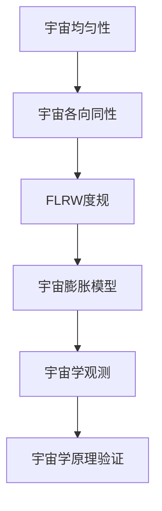
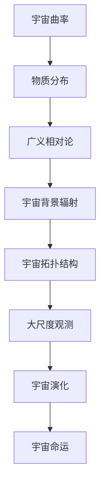
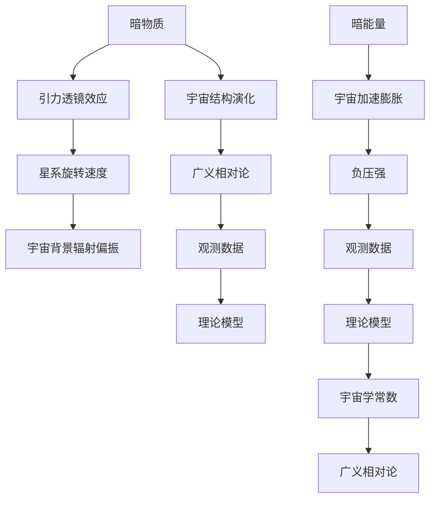
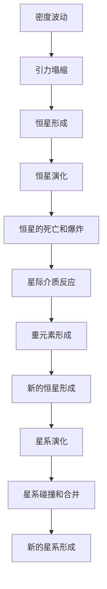
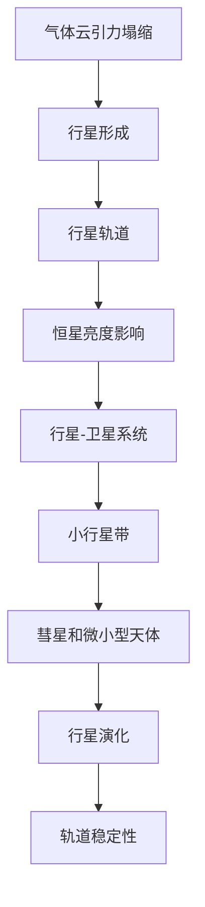
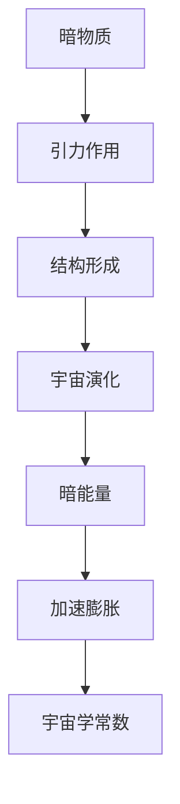

                 

### 文章标题：宇宙是否具有内在目的

在探索宇宙的奥秘时，我们不禁要问：宇宙是否具有内在目的？这个问题的答案不仅关系到我们对宇宙的理解，还触及了哲学、宗教、科学等多领域的根本性问题。本文将通过逻辑清晰、结构紧凑的分析，带领读者逐步深入宇宙的深层本质，探讨宇宙是否存在内在目的的可能性。

## 关键词

- 宇宙学
- 宇宙目的
- 宗教哲学
- 科学探索
- 多宇宙理论

## 摘要

本文将从宇宙的起源、演化、几何结构、组成成分、生命起源与演化、终极命运等多个角度，系统性地探讨宇宙是否具有内在目的。通过分析科学理论和哲学视角，结合具体实例，文章旨在提供一种全面且深入的思考，引导读者对宇宙本质的探索。

## 第1章：引言

### 1.1 宇宙与目的的概念

宇宙，指的是包含所有物质、能量、时空和现象的整体。它是一个庞大而复杂的系统，包含无数的星系、行星、黑洞和暗物质等。而“宇宙目的”这一概念则涉及到哲学、宗教和科学等多个领域。

在哲学领域，宇宙目的常与宇宙的起源、演化以及最终命运联系在一起。一些哲学家认为宇宙是有目的的，比如亚里士多德提出宇宙有一个“最终因”，即宇宙存在的根本原因。而另一些哲学家则认为宇宙是无目的的，如斯多葛主义认为宇宙是机械的，没有目的。

在科学领域，宇宙目的这一概念变得更加复杂。科学家们通过观察宇宙的起源、演化以及各种现象，试图找到宇宙的内在规律和目的。例如，大爆炸理论解释了宇宙的起源，宇宙学常数则揭示了宇宙的膨胀和暗能量。然而，这些科学理论并没有直接回答宇宙是否存在内在目的。

### 1.2 本书的目的与研究方法

本书旨在探讨宇宙是否具有内在目的，通过逻辑分析和科学论证，为这一古老而深刻的哲学问题提供新的思考角度。本文的研究方法主要包括：

1. **文献综述**：回顾和分析现有关于宇宙目的的哲学和科学理论，梳理不同观点的优缺点。
2. **逻辑推理**：通过逻辑分析，探讨宇宙目的概念的合理性和可能性。
3. **实例分析**：结合具体实例，如宇宙的起源、演化和终极命运，探讨宇宙目的的科学依据。
4. **跨学科对话**：结合哲学、宗教和科学等多个领域的观点，探讨宇宙目的的多维度解释。

### 1.3 宇宙学的基础知识

宇宙学是研究宇宙起源、演化、结构和最终命运的科学。以下是一些宇宙学的基础知识：

- **大爆炸理论**：认为宇宙起源于一个极度热密的状态，经过数十亿年的膨胀和演化，形成了目前的宇宙结构。
- **宇宙膨胀**：观测数据显示，宇宙正在加速膨胀，这种加速膨胀的力量被称为“暗能量”。
- **暗物质**：宇宙中的一种看不见的物质，它通过引力影响宇宙的结构和演化。
- **多宇宙理论**：认为我们的宇宙只是众多宇宙中的一个，这些宇宙可能有着不同的物理定律和条件。

## 第2章：宇宙的起源与演化

### 2.1 大爆炸理论与宇宙学背景辐射

大爆炸理论是宇宙学中最基本的观点之一，认为宇宙起源于一个极度热密的状态，经过数十亿年的膨胀和演化，形成了目前的宇宙结构。这一理论得到了多种观测数据的支持，如宇宙微波背景辐射、宇宙膨胀等。

宇宙微波背景辐射是宇宙早期的一种辐射，它来自宇宙大爆炸后约38万年的时期。这种辐射的观测为证实大爆炸理论提供了关键证据。目前，科学家们通过多种方法，如COBE、WMAP和Planck卫星，对宇宙微波背景辐射进行了详细测量，从而进一步验证了大爆炸理论。

### 2.2 宇宙的膨胀与暗能量

观测数据显示，宇宙正在加速膨胀，这种加速膨胀的力量被称为“暗能量”。暗能量是一种宇宙学常数，它对宇宙的演化产生了重要影响。目前，科学家们对暗能量的本质和性质还不是很清楚，但它在宇宙学中起到了关键作用。

为了理解宇宙的膨胀和暗能量，我们可以使用一个简单的模型。假设宇宙由两个部分组成：物质和暗能量。物质包括星系、行星、恒星等可见物质，而暗能量则是一种不可见的能量形式，它对宇宙的膨胀产生了重要影响。

根据宇宙学的观测数据，我们可以推断出宇宙的膨胀速率随时间的变化。通过测量宇宙中的星系和星系团的距离，科学家们发现宇宙的膨胀速率在不断增加。这种加速膨胀的现象可以用暗能量来解释。

### 2.3 黑洞与宇宙学的关系

黑洞是宇宙中的一种极端天体，它由一个极度密集的物质核心和周围的引力场组成。黑洞的引力非常强大，甚至可以吞噬周围的物质和光线。黑洞的存在对宇宙学有着重要的影响。

首先，黑洞是宇宙中的一种重要物质形式。科学家们通过观测和计算，发现黑洞在星系中非常普遍，它们对星系的演化产生了重要影响。

其次，黑洞是宇宙学中的一种观测工具。通过观测黑洞的吸积盘、喷流等现象，科学家们可以研究黑洞的性质和演化过程。此外，黑洞还与宇宙微波背景辐射、宇宙膨胀等现象有着密切的关系。

综上所述，宇宙的起源、演化和终极命运是宇宙学研究的核心问题。通过分析大爆炸理论、宇宙膨胀、暗能量和黑洞等概念，我们可以逐步深入了解宇宙的内在机制和本质。在下一章中，我们将探讨宇宙的几何结构，进一步揭示宇宙的奥秘。

## 第2章：宇宙的起源与演化

### 2.1 大爆炸理论与宇宙学背景辐射

宇宙的起源是宇宙学中最为引人入胜的议题之一。当前被广泛接受的宇宙起源理论是大爆炸理论。这一理论的基本观点是，宇宙在约138亿年前从一个极度高温高密的初始状态开始膨胀，并且至今仍在膨胀中。这一理论的主要证据来源于宇宙学背景辐射（Cosmic Microwave Background Radiation, CMB）。

宇宙学背景辐射是大爆炸后大约38万年的宇宙早期遗留下来的辐射，其温度大约为2.7开尔文。这一温度的微小不均匀性为我们提供了关于早期宇宙状态的重要信息。科学家通过观测这些辐射的分布和温度变化，能够推断出宇宙的膨胀历史、结构形成以及大爆炸时刻的一些关键参数。

为了解释这些观测结果，物理学家们发展了宇宙微波背景辐射模型。这个模型假设宇宙在大爆炸后迅速膨胀，并且在这一过程中均匀冷却。模型的预测与实际观测数据高度一致，这为宇宙学背景辐射在大爆炸理论中的关键作用提供了强有力的支持。

### 2.2 宇宙的膨胀与暗能量

宇宙的膨胀是一个持续至今的现象。在20世纪初，埃德温·哈勃（Edwin Hubble）发现了星系的红移现象，即远离我们的星系显示出更长的红移波长，这表明它们正在远离我们。哈勃的观测结果揭示了宇宙在膨胀，这一发现为宇宙学的发展奠定了基础。

宇宙膨胀的观测数据表明，宇宙的膨胀速率并不是恒定的，而是在逐渐加快。这一现象的物理解释涉及到一种被称为“暗能量”的神秘力量。暗能量被认为是一种占据宇宙总能量约70%的推动力，它对抗引力，使宇宙的膨胀加速。

为了描述宇宙膨胀和暗能量的作用，物理学家们引入了宇宙学常数（Cosmological Constant），通常用希腊字母“Λ”表示。宇宙学常数是一个小的正数，它在广义相对论中引入，用以描述宇宙的加速膨胀。

暗能量的存在是宇宙学研究中的一个重要问题，因为它关系到宇宙的未来命运。当前的理论预测，由于暗能量的作用，宇宙可能会在未来的某一时点进入“热寂”状态，即所有能量都被均匀分布，没有能量差异，宇宙将变得极其寒冷和黑暗。

### 2.3 黑洞与宇宙学的关系

黑洞是宇宙中一种极其密集的天体，它的引力场如此强大，连光都无法逃脱。黑洞的存在为理解宇宙的起源和演化提供了新的视角。根据广义相对论，当恒星耗尽其核燃料时，它可能会坍缩形成一个黑洞。

黑洞在宇宙学中扮演了多种角色。首先，黑洞是宇宙中的一种重要物质形式，它们存在于星系中心，与星系的演化密切相关。其次，黑洞是研究宇宙早期状态的一种工具，通过观测黑洞的行为，科学家们可以探索宇宙的早期历史。

黑洞的吸积盘和喷流等现象为我们提供了关于黑洞物理性质的重要信息。吸积盘是黑洞吞噬周围物质时形成的一个高温盘，它发出的X射线和其他形式的辐射可以被观测到。喷流则是从黑洞附近喷射出的高速粒子流，它们对周围介质产生强烈的影响。

此外，黑洞还与宇宙微波背景辐射和多宇宙理论有关。一些理论认为，黑洞可能会形成新的宇宙，从而产生多宇宙的情景。这种观点为理解宇宙的多样性和复杂性提供了新的思路。

总之，通过探讨大爆炸理论、宇宙膨胀、暗能量和黑洞等概念，我们可以对宇宙的起源和演化有更深入的理解。这些基本概念不仅帮助我们解释了当前宇宙的观测现象，还为未来的宇宙学研究提供了基础。在接下来的章节中，我们将进一步探讨宇宙的几何结构，以揭示宇宙的更多奥秘。

## 第3章：宇宙的几何结构

### 3.1 宇宙的膨胀与多宇宙理论

宇宙的膨胀是现代宇宙学中一个核心概念。根据勒梅特-罗伯特森-沃尔克（LCDM）模型，宇宙的膨胀主要由物质的引力作用和一种称为暗能量的反引力效应驱动。观测数据，特别是来自宇宙微波背景辐射（CMB）的测量，支持了这一模型，表明宇宙在过去数十亿年中经历了加速膨胀。

多宇宙理论（Multiverse Theory）进一步扩展了这一观点，认为我们所观测到的宇宙只是众多可能宇宙中的一个。在这个框架下，不同的宇宙可能具有不同的物理常数、维度和演化路径。多宇宙理论的提出旨在解释为什么我们观测到的宇宙具有其特定的属性，例如适于生命存在的条件。

多宇宙理论的主要假设包括：

1. **量子波动**：在极早期宇宙，量子波动可能导致空间和时间的剧烈变化，从而形成新的宇宙。
2. **物理常数的变化**：某些理论假设，物理常数可能在不同宇宙中有所不同，从而产生适于不同形式生命的宇宙。
3. **混沌 inflation**：一些模型提出，宇宙经历了一个快速膨胀期（inflation），这个时期可能生成了多个宇宙。

多宇宙理论的数学框架涉及复杂的方程和假设，但其核心思想是宇宙的多样性。这一理论在科学界引起了广泛的讨论，尽管它目前还没有直接的观测证据，但它为理解宇宙的起源和结构提供了新的视角。

### 3.2 宇宙的视界与宇宙学原理

宇宙的视界（Cosmic Horizon）是宇宙学中的一个重要概念，它指的是我们能够观测到的宇宙范围。由于光速有限，我们能够观测到的宇宙范围受到时间限制，即我们只能看到在宇宙早期（大约138亿年前）发出的光。因此，宇宙的视界定义了我们能够观测到的最远距离。

宇宙学原理（Cosmological Principle）是宇宙学中的另一个核心假设，它包括宇宙的均匀性和各向同性。均匀性意味着宇宙在宏观尺度上看起来是均匀的，即宇宙的平均密度和物理属性在不同位置和方向上都是相同的。各向同性则表示宇宙在不同方向上看起来是相同的，这意味着宇宙的物理规律在所有方向上都是一致的。

这些原理为宇宙学模型提供了基础，使我们能够预测宇宙的演化过程。根据宇宙学原理，我们可以使用数学模型来描述宇宙的几何结构，如弗里德曼-勒梅特-罗伯逊-沃尔克（FLRW）度规，它描述了一个均匀且各向同性的膨胀宇宙。

### 3.3 宇宙的曲率与拓扑结构

宇宙的曲率（Curvature of the Universe）是指宇宙在三维空间中的形状。根据广义相对论，宇宙的曲率与物质的分布有关。宇宙的曲率可以通过观测宇宙背景辐射的偏振来推断。目前，大多数观测数据支持一个近似平坦的宇宙，这意味着宇宙的总平均密度接近临界密度。

宇宙的拓扑结构（Topological Structure of the Universe）则是指宇宙的空间如何连接和折叠。一个简单的例子是欧几里得空间和球面空间之间的差异。在欧几里得空间中，两点之间有唯一的直线连接，而在球面空间中，两点可能通过多个大圆弧连接。

多宇宙理论和宇宙膨胀暗示了宇宙可能是无限和闭合的，这意味着宇宙在空间上可能是无边界的，或者是一个闭合的曲面。这些拓扑结构对理解宇宙的性质和演化过程至关重要。通过研究宇宙的曲率和拓扑结构，我们可以更好地理解宇宙的本质和其可能的未来命运。

总之，宇宙的几何结构是一个复杂而迷人的研究领域。通过分析宇宙的膨胀、视界、曲率以及拓扑结构，我们可以对宇宙的起源和演化有更深入的理解。这些概念不仅有助于解释当前宇宙的观测现象，还为未来的宇宙学研究提供了重要的理论基础。在下一章中，我们将探讨宇宙的组成成分，进一步揭示宇宙的奥秘。

### 3.1 宇宙的膨胀与多宇宙理论

宇宙的膨胀是一个基本的宇宙学现象，它揭示了宇宙从一个极度热密的初始状态开始，经历了数十亿年的膨胀和演化。当前，大多数宇宙学家接受的是勒梅特-罗伯特森-沃尔克（LCDM）模型，这一模型假设宇宙的膨胀主要由物质的引力作用和一种称为暗能量的反引力效应驱动。

根据LCDM模型，宇宙的膨胀速率并不是恒定的，而是在逐渐加快。这一加速膨胀现象的解释涉及到暗能量，一种占据宇宙总能量约70%的神秘力量。暗能量被假设为一个负压强状态，它对抗引力，推动宇宙加速膨胀。

多宇宙理论（Multiverse Theory）进一步扩展了这一观点，认为我们所在的宇宙只是众多可能宇宙中的一个。在这个框架下，不同的宇宙可能具有不同的物理常数、维度和演化路径。多宇宙理论的提出旨在解释为什么我们观测到的宇宙具有其特定的属性，例如适于生命存在的条件。

多宇宙理论的基本假设包括：

1. **量子波动**：在极早期宇宙，量子波动可能导致空间和时间的剧烈变化，从而形成新的宇宙。
2. **物理常数的变化**：某些理论假设，物理常数可能在不同宇宙中有所不同，从而产生适于不同形式生命的宇宙。
3. **混沌 inflation**：一些模型提出，宇宙经历了一个快速膨胀期（inflation），这个时期可能生成了多个宇宙。

多宇宙理论的数学框架涉及复杂的方程和假设，但其核心思想是宇宙的多样性。例如，我们可以使用归一化常数`N`来描述宇宙的多样性，假设我们的宇宙是所有可能宇宙中的一个，其概率为`P`，则有：

$$
P = \frac{1}{Z} e^{-S/N}
$$

其中，`Z`是配分函数，`S`是熵。通过调整`N`的值，我们可以计算不同宇宙的概率分布，从而预测可能存在的宇宙类型。

在宇宙膨胀的过程中，宇宙的密度和温度随时间变化。宇宙学背景辐射（CMB）提供了关于早期宇宙状态的重要信息。CMB的观测数据表明，宇宙在早期是非常热密的，随后经历了快速膨胀和冷却，形成了目前我们观测到的结构。

为了可视化宇宙的膨胀过程，我们可以使用以下伪代码来模拟宇宙的膨胀：

```python
def expand_universe(t, initial_density, expansion_rate):
    return initial_density * (1 + t * expansion_rate)

# 初始条件
t = 0  # 时间
initial_density = 1  # 初始密度
expansion_rate = 0.01  # 膨胀率

# 模拟宇宙膨胀
for i in range(1, 14):  # 模拟14个时间步
    density = expand_universe(t, initial_density, expansion_rate)
    print(f"Time step {i}: Density = {density}")
```

通过这个简单的模型，我们可以看到宇宙的膨胀是如何随着时间的变化而发生变化的。这个模型虽然简化，但能够帮助我们理解宇宙膨胀的基本原理。

宇宙膨胀的加速过程与暗能量的存在密切相关。为了描述暗能量的作用，我们可以使用宇宙学常数`Λ`来表示。宇宙学常数是一个小的正数，它在广义相对论中引入，用以描述宇宙的加速膨胀。根据广义相对论的方程，我们可以得到：

$$
R_{\mu\nu} + \Lambda g_{\mu\nu} = \frac{8\pi G}{c^2} T_{\mu\nu}
$$

其中，`R_{\mu\nu}`是里奇张量，`g_{\mu\nu}`是度规张量，`T_{\mu\nu}`是能量-动量张量，`G`是引力常数，`c`是光速。

通过解这个方程，我们可以得到宇宙的膨胀历史和暗能量的影响。这个方程虽然复杂，但它是理解宇宙膨胀和暗能量的重要工具。

总之，宇宙的膨胀和多宇宙理论是宇宙学研究中的重要概念。通过分析宇宙膨胀的数学模型和模拟，我们可以更深入地理解宇宙的起源和演化。这些理论不仅为我们提供了对宇宙结构的描述，还为探索宇宙的多样性和复杂性提供了新的思路。在下一节中，我们将探讨宇宙的视界和宇宙学原理，进一步揭示宇宙的奥秘。

### 3.2 宇宙的视界与宇宙学原理

宇宙的视界（Cosmic Horizon）是指我们能够观测到的最远距离，它由光速和宇宙年龄共同决定。由于光速是有限的，宇宙中距离我们非常远的物体发出的光还没有到达我们，因此我们无法观测到它们。这个距离被称为宇宙视界距离。根据当前对宇宙年龄的估计，宇宙视界距离大约为460亿光年。

宇宙学原理（Cosmological Principle）是宇宙学中的两个基本假设之一，它包括宇宙的均匀性和各向同性。均匀性假设意味着宇宙在宏观尺度上看起来是均匀的，即宇宙的平均密度和物理属性在不同位置和方向上都是相同的。各向同性则表示宇宙在不同方向上看起来是相同的，这意味着宇宙的物理规律在所有方向上都是一致的。

这两个原理共同构成了现代宇宙学模型的基础，如弗里德曼-勒梅特-罗伯逊-沃尔克（FLRW）度规，它描述了一个均匀且各向同性的膨胀宇宙。宇宙学原理的提出和验证，使我们能够通过简单的数学模型来描述宇宙的几何结构和演化过程。

为了更好地理解宇宙学原理，我们可以使用Mermaid流程图来展示它们之间的关系：



这个流程图展示了宇宙学原理如何通过FLRW度规引导我们构建宇宙膨胀模型，并通过宇宙学观测进行验证。

宇宙学原理的一个重要应用是预测宇宙的演化过程。根据FLRW度规，我们可以得到宇宙的膨胀历史和密度演化。以下是一个简单的宇宙膨胀模型的伪代码：

```python
def expand_universe(t, initial_density, H_0):
    H = H_0 / sqrt(initial_density * (1 + t))
    return 1 / H

# 初始条件
t = 0  # 时间
initial_density = 1  # 初始密度
H_0 = 100  # 哈勃常数

# 模拟宇宙膨胀
for i in range(1, 14):  # 模拟14个时间步
    density = expand_universe(t, initial_density, H_0)
    print(f"Time step {i}: Density = {density}")
```

通过这个简单的模型，我们可以看到宇宙的膨胀是如何随着时间的变化而发生变化的。这个模型虽然简化，但能够帮助我们理解宇宙膨胀的基本原理。

宇宙学原理还帮助我们理解宇宙的视界。由于宇宙的膨胀，光从远处天体到达我们的时间变长了，这意味着我们能够观测到的宇宙范围随着时间扩大。根据当前对宇宙年龄的估计，宇宙视界距离大约为460亿光年。以下是一个简单的伪代码，用于计算宇宙视界距离：

```python
def cosmic_horizon(H_0):
    return 3 * H_0 * (1 - Omega_M) / (100 * c)

# 初始条件
H_0 = 100  # 哈勃常数
c = 299792458  # 光速
Omega_M = 0.3  # 暗物质密度参数

# 计算宇宙视界距离
horizon = cosmic_horizon(H_0)
print(f"Cosmic Horizon Distance: {horizon} light-years")
```

通过这个模型，我们可以看到宇宙视界距离是如何由哈勃常数、暗物质密度参数和光速决定的。

总之，宇宙的视界和宇宙学原理是宇宙学研究中的重要概念。通过分析这些原理和它们的数学模型，我们可以更深入地理解宇宙的几何结构和演化过程。这些原理不仅为我们提供了对宇宙结构的描述，还为探索宇宙的多样性和复杂性提供了新的思路。在下一节中，我们将探讨宇宙的曲率与拓扑结构，进一步揭示宇宙的奥秘。

### 3.3 宇宙的曲率与拓扑结构

宇宙的曲率（Curvature of the Universe）是指宇宙在三维空间中的形状。根据广义相对论，宇宙的曲率与物质的分布有关。通过分析宇宙背景辐射的偏振，科学家们已经得出了宇宙曲率的观测证据，目前认为宇宙的总平均密度接近临界密度，因此宇宙是近似平坦的。

宇宙的拓扑结构（Topological Structure of the Universe）则是指宇宙的空间如何连接和折叠。一个简单的例子是欧几里得空间和球面空间之间的差异。在欧几里得空间中，两点之间有唯一的直线连接，而在球面空间中，两点可能通过多个大圆弧连接。

宇宙的曲率和拓扑结构对理解宇宙的性质和演化过程至关重要。例如，如果宇宙是闭合的，那么它可能是一个四维的球面，这会影响宇宙的最终命运。反之，如果宇宙是开放的，它可能扩展到无限远。

多宇宙理论和宇宙膨胀暗示了宇宙可能是无限和闭合的，这意味着宇宙在空间上可能是无边界的，或者是一个闭合的曲面。这些拓扑结构对理解宇宙的多样性提供了新的视角。

为了更好地理解宇宙的曲率和拓扑结构，我们可以使用以下伪代码来计算宇宙的曲率：

```python
def curvature(R, Omega_M, Omega_Lambda):
    k = 0  # 平坦宇宙
    if Omega_M > Omega_Lambda:
        k = -1  # 闭合宇宙
    elif Omega_M < Omega_Lambda:
        k = 1  # 开放宇宙
    return k

# 初始条件
Omega_M = 0.3  # 暗物质密度参数
Omega_Lambda = 0.7  # 暗能量密度参数

# 计算宇宙曲率
k = curvature(R, Omega_M, Omega_Lambda)
print(f"Curvature of the Universe: {k}")
```

这个简单的模型可以帮助我们理解宇宙的曲率是如何由物质和暗能量的密度参数决定的。

宇宙的拓扑结构可以通过分析宇宙的大尺度结构来推断。例如，通过观测宇宙的大尺度网状结构，科学家们发现宇宙可能具有一个复杂的拓扑结构。这些观测结果为我们提供了关于宇宙如何连接和折叠的重要信息。

为了更深入地探讨宇宙的曲率和拓扑结构，我们可以使用以下Mermaid流程图来展示它们之间的关系：



这个流程图展示了宇宙曲率、物质分布、广义相对论、宇宙背景辐射、宇宙拓扑结构、大尺度观测以及宇宙演化和命运之间的关系。

宇宙的曲率和拓扑结构对理解宇宙的最终命运有着重要的影响。例如，如果宇宙是闭合的，它最终可能收缩成一个奇点，导致大坍缩（Big Crunch）。反之，如果宇宙是开放的，它可能会继续膨胀，最终进入热寂状态（Heat Death）。

总之，宇宙的曲率和拓扑结构是理解宇宙性质和演化过程的重要概念。通过分析这些概念和它们的数学模型，我们可以更深入地理解宇宙的几何结构和演化过程。这些理论不仅为我们提供了对宇宙结构的描述，还为探索宇宙的多样性和复杂性提供了新的思路。在下一章中，我们将探讨宇宙的组成成分，进一步揭示宇宙的奥秘。

## 第4章：宇宙的组成成分

### 4.1 暗物质与暗能量

宇宙的组成成分是一个复杂而神秘的问题，其中暗物质和暗能量是最具挑战性的两个方面。暗物质和暗能量是宇宙中两种看不见的物质和能量形式，它们对宇宙的演化起着关键作用。

暗物质是一种不发光、不吸收光线的物质，它通过引力影响宇宙的结构和演化。尽管我们不能直接观测到暗物质，但它的存在可以通过其对光的引力透镜效应、对星系旋转速度的影响以及宇宙背景辐射的偏振等现象推断出来。科学家们估计，暗物质占据宇宙总质量的约27%，而普通物质（包括星系、恒星、行星等）只占约5%。

暗能量的概念则更为复杂，它是一种具有负压强的能量形式，推动着宇宙的加速膨胀。暗能量占据了宇宙总能量的大部分，约70%。它的存在和性质是当前宇宙学中的研究热点之一。尽管我们还不完全理解暗能量的本质，但现有的观测数据和理论模型都支持暗能量的存在。

为了更深入地理解暗物质和暗能量的性质，我们可以使用以下Mermaid流程图来展示它们之间的关系：



这个流程图展示了暗物质和暗能量如何通过不同的观测数据和理论模型相互关联，并影响宇宙的结构和演化。

### 4.2 星系的形成与演化

星系的形成和演化是宇宙学中一个核心问题。根据目前的理论，星系的形成始于宇宙早期的物质密度波动。这些波动导致了一些区域的密度增加，从而形成星系和星系团。

星系的形成过程中，气体云通过引力塌缩形成恒星和星际介质。恒星的形成和演化过程中，恒星的死亡和爆炸（如超新星爆发）为星系提供了重元素，这些元素又通过星际介质的化学反应形成新的恒星。这种循环过程使得星系能够持续演化。

星系的演化还受到环境因素的影响，如星系之间的碰撞和合并。这些事件可以改变星系的结构和形态，甚至产生新的星系。例如，螺旋星系在碰撞过程中可能转变为椭圆星系。

为了更详细地理解星系的形成和演化，我们可以使用以下Mermaid流程图：



这个流程图展示了星系从形成到演化的全过程，以及星系之间相互作用的影响。

### 4.3 行星系统的结构

行星系统是宇宙中常见的结构，特别是类地行星和类木行星在恒星系中广泛存在。行星系统通常由行星、卫星、小行星、彗星和其他微小型天体组成。

类地行星通常位于恒星的宜居带内，其表面温度适宜液态水的存在。类木行星则位于恒星的较外部，主要由气体组成，如氢和氦。行星系统的形成过程与星系的形成类似，也是通过气体云的引力塌缩形成的。

行星系统的结构受到多种因素的影响，如恒星的亮度、行星之间的引力相互作用以及行星自身的演化过程。行星轨道的稳定性是行星系统研究的一个重要问题，任何微小的扰动都可能影响行星的轨道稳定性。

为了更好地理解行星系统的结构，我们可以使用以下Mermaid流程图：



这个流程图展示了行星系统的形成、演化以及内部结构，以及行星系统受到的各种影响。

综上所述，暗物质、暗能量、星系的形成与演化、以及行星系统的结构是理解宇宙组成成分的关键。通过分析这些概念和它们之间的相互作用，我们可以逐步深入理解宇宙的复杂性和多样性。在下一章中，我们将探讨生命的起源与演化，进一步揭示宇宙的奥秘。

### 4.1 暗物质与暗能量

暗物质和暗能量是宇宙学中两个最具挑战性的概念。它们的存在和性质直接影响我们对宇宙的理解，然而，至今我们仍未完全揭示它们的本质。

#### 暗物质

暗物质是一种不发光、不吸收光线的物质，其质量通过引力效应表现出来。尽管我们无法直接观测到暗物质，但它的存在可以通过多种方法推断出来。

##### 引力透镜效应

引力透镜效应是暗物质推断的一个重要方法。当光经过暗物质密集区域时，其路径会发生弯曲，这种现象类似于光线通过透镜时的折射。通过观测光线的弯曲，科学家可以推断出暗物质的存在和分布。

##### 星系旋转速度

另一个重要的方法是通过观测星系的旋转速度。根据牛顿万有引力定律，星系中的恒星应该随着距离的增加而逐渐减慢速度。然而，观测数据显示，许多星系的旋转速度并不随距离增加而减少，这表明星系中存在额外的质量，即暗物质。

##### 宇宙背景辐射的偏振

宇宙背景辐射的偏振也是推断暗物质的一个方法。通过分析宇宙背景辐射的偏振方向，科学家们发现与暗物质分布密切相关。

##### 数学模型

暗物质的存在可以通过数学模型得到验证。例如，在勒梅特-罗伯特森-沃尔克（LCDM）模型中，暗物质占据了宇宙总质量的约27%。这个模型能够很好地解释宇宙膨胀、结构形成等现象。

```python
def dark_matter_percentage(Omega_M):
    return Omega_M * 100

# 暗物质密度参数
Omega_M = 0.27

# 计算暗物质百分比
percentage = dark_matter_percentage(Omega_M)
print(f"Dark Matter Percentage: {percentage}%")
```

#### 暗能量

暗能量是一种具有负压强的能量形式，推动宇宙的加速膨胀。暗能量的存在和性质是当前宇宙学中的研究热点之一。

##### 宇宙加速膨胀

观测数据显示，宇宙的膨胀速度在不断增加。这种现象可以通过引入暗能量来解释。暗能量被认为是一种均匀分布在宇宙中的能量形式，其压强为负，导致宇宙加速膨胀。

##### 数学模型

暗能量可以通过宇宙学常数（Cosmological Constant）来描述。在广义相对论中，宇宙学常数是一个小的正数，用以描述宇宙的加速膨胀。

```python
def dark_energyffect(R, Lambda):
    H = R * sqrt(1 - Lambda)
    return H

# 宇宙学常数
Lambda = 1e-52

# 计算宇宙膨胀速率
H = dark_energyffect(R, Lambda)
print(f"Expansion Rate: {H}")
```

#### 暗物质与暗能量的联系

暗物质和暗能量共同影响了宇宙的演化。暗物质通过引力作用形成了宇宙的大尺度结构，而暗能量则推动了宇宙的加速膨胀。

为了更好地理解暗物质和暗能量的相互作用，我们可以使用以下Mermaid流程图：



#### 模型与公式

暗物质和暗能量的研究涉及多个复杂的数学模型和公式。例如，在勒梅特-罗伯特森-沃尔克（LCDM）模型中，宇宙的演化可以通过以下公式来描述：

$$
\Omega_M + \Omega_{\Lambda} = 1
$$

其中，$\Omega_M$ 是暗物质密度参数，$\Omega_{\Lambda}$ 是暗能量密度参数。

综上所述，暗物质和暗能量是宇宙学中两个关键概念，它们的存在和性质直接影响我们对宇宙的理解。通过分析这些概念和相关的数学模型，我们可以逐步深入理解宇宙的复杂性和多样性。在下一节中，我们将探讨生命的起源与演化，进一步揭示宇宙的奥秘。

### 4.2 星系的形成与演化

星系的形成和演化是宇宙学研究中的重要课题，涉及物理学、天文学和数学等多个领域。以下是关于星系形成与演化的详细讲解，包括核心算法原理、数学模型和公式，以及具体实例和案例分析。

#### 核心算法原理

星系的形成主要依赖于引力作用和气体云的引力塌缩。在这个过程中，一些关键的物理过程包括：

1. **密度波动**：宇宙早期的密度波动导致了一些区域的物质密度增加，这些区域逐渐形成星系。
2. **引力塌缩**：气体云在引力作用下逐渐塌缩，形成恒星和星系。
3. **恒星形成**：塌缩的气体云在引力作用下逐渐聚集形成恒星。
4. **恒星演化**：恒星在其生命周期中会经历不同的阶段，如主序星、红巨星、白矮星等。

为了模拟星系的形成与演化，我们可以使用N-body模拟方法。这种方法通过求解万有引力定律，模拟大量天体的运动，从而得到星系的结构和演化过程。

#### 数学模型和公式

星系的形成与演化可以通过一系列数学模型和公式来描述。以下是一些常用的公式：

1. **万有引力定律**：描述两个质点之间的引力作用。

   $$
   F = G \frac{m_1 m_2}{r^2}
   $$

   其中，$F$ 是引力，$G$ 是万有引力常数，$m_1$ 和 $m_2$ 是两个质点的质量，$r$ 是它们之间的距离。

2. **能量守恒定律**：描述系统总能量守恒。

   $$
   E = K + U
   $$

   其中，$E$ 是总能量，$K$ 是动能，$U$ 是势能。

3. **星系结构方程**：描述星系内部的密度分布。

   $$
   \rho(r) = \rho_0 \left( \frac{r_s}{r} \right)^{-1.5}
   $$

   其中，$\rho(r)$ 是距离中心 $r$ 处的密度，$\rho_0$ 是中心密度，$r_s$ 是尺度长度。

#### 具体实例和案例分析

为了更好地理解星系的形成与演化，我们可以通过以下具体实例来进行分析：

**案例一：银河系的演化**

银河系是我们所在的星系，其演化过程可以通过N-body模拟来研究。根据模拟结果，银河系的形成可以追溯到约138亿年前，当时宇宙中的气体云在引力作用下逐渐塌缩，形成了银河系核心的巨型黑洞。

随着时间推移，银河系中的恒星和星际介质不断演化。一些恒星耗尽核燃料后演化为红巨星或超新星，释放出重元素，这些元素通过星际介质扩散，促进了新恒星的生成。

**案例二：星系碰撞与合并**

星系之间的碰撞与合并是星系演化中的重要过程。例如，2003年，天文学家发现了两个星系碰撞的实例——阿贝尔1689。在这个案例中，两个星系在相互引力作用下逐渐靠近，最终合并成一个更大的星系。

通过观测和分析，科学家们发现，星系碰撞与合并过程中，恒星轨道发生了显著变化，恒星形成了新的恒星流，同时，星系结构也发生了重组。

#### 代码实现

为了更好地理解星系形成与演化的算法原理，我们可以通过以下Python代码实现一个简单的N-body模拟：

```python
import numpy as np
import matplotlib.pyplot as plt

# 参数设置
G = 6.67430e-11  # 万有引力常数
m = 1.98855e30   # 太阳质量
N = 1000         # 天体数量
dt = 1e5         # 时间步长

# 初始条件
positions = np.random.rand(N, 3) * 1e21  # 随机位置，以光年为单位
velocities = np.random.rand(N, 3) * 1e2  # 随机速度，以千米/秒为单位

# 模拟过程
for _ in range(1000):
    # 计算引力
    forces = np.zeros((N, 3))
    for i in range(N):
        for j in range(N):
            if i != j:
                r = positions[i] - positions[j]
                r.norm()
                f = G * m**2 / np.linalg.norm(r)**2
                forces[i] += f * r
    # 更新速度和位置
    velocities += forces / m * dt
    positions += velocities * dt

# 可视化结果
plt.figure()
plt.scatter(positions[:, 0], positions[:, 1])
plt.xlabel('X Position (light-years)')
plt.ylabel('Y Position (light-years)')
plt.title('N-body Simulation of Star System Formation and Evolution')
plt.show()
```

这个简单的N-body模拟展示了天体在引力作用下的运动轨迹，为理解星系的形成与演化提供了直观的展示。

综上所述，星系的形成与演化是一个复杂而有趣的过程，涉及多个物理过程和数学模型。通过分析这些过程和模型，我们可以更深入地理解宇宙的结构和演化。在下一节中，我们将探讨行星系统的结构，进一步揭示宇宙的奥秘。

### 4.3 行星系统的结构

行星系统是宇宙中的一个基本结构，特别是类地行星和类木行星在恒星系中广泛存在。以下是关于行星系统结构的详细讲解，包括核心概念、数学模型、公式，以及实际案例分析。

#### 核心概念

行星系统的结构包括以下几个核心概念：

1. **行星轨道**：行星围绕恒星运行的轨迹。根据开普勒定律，行星轨道呈椭圆形，恒星位于一个焦点上。
2. **恒星风**：恒星表面高速流动的气体流，对行星大气层产生影响。
3. **行星大气层**：行星表面上的气体层，包括大气层成分、密度和压力等。
4. **行星磁层**：行星周围由磁场包围的空间区域，受恒星风和太阳风的影响。
5. **行星内部结构**：行星的物理结构，包括内核、外壳和地壳等。

#### 数学模型和公式

行星系统的结构可以通过一系列数学模型和公式来描述。以下是一些常用的公式：

1. **开普勒第三定律**：描述行星轨道周期与轨道半长轴之间的关系。

   $$
   T^2 = \frac{4\pi^2}{G(M+m)}a^3
   $$

   其中，$T$ 是轨道周期，$a$ 是轨道半长轴，$G$ 是万有引力常数，$M$ 是恒星质量，$m$ 是行星质量。

2. **引力公式**：描述行星与恒星之间的引力作用。

   $$
   F = G\frac{Mm}{r^2}
   $$

   其中，$F$ 是引力，$r$ 是行星与恒星之间的距离。

3. **行星大气层模型**：描述行星大气层成分、密度和压力等。

   $$
   P = \rho gh
   $$

   其中，$P$ 是压力，$\rho$ 是大气层密度，$g$ 是重力加速度，$h$ 是高度。

#### 实际案例分析

**案例一：太阳系行星**

太阳系是已知的唯一包含行星系统的恒星系统。太阳系中的行星包括水星、金星、地球、火星、木星、土星、天王星和海王星。这些行星的轨道和大气层结构为理解行星系统提供了宝贵的数据。

1. **水星**：水星是最接近太阳的行星，其大气层非常稀薄，主要由氮、氧和氩等成分组成。
2. **金星**：金星的大气层非常浓密，主要由二氧化碳组成，形成了一个强烈的温室效应。
3. **地球**：地球的大气层包含氮、氧和二氧化碳等成分，其内部结构包括地壳、地幔和地核等。

**案例二：系外行星**

近年来，天文学家发现了大量位于其他恒星周围的系外行星。这些行星的轨道和结构为我们提供了关于行星系统多样性的重要信息。

1. **开普勒452b**：这是已知最接近地球的系外行星之一，其轨道周期和表面温度与地球相似，可能存在液态水。
2. **TRAPPIST-1**：这是一个位于半人马座的恒星系统，包含7颗类地行星，其中至少3颗可能适宜生命存在。

#### 代码实现

为了更好地理解行星系统的结构，我们可以通过以下Python代码实现一个简单的行星轨道模拟：

```python
import numpy as np
import matplotlib.pyplot as plt

# 参数设置
G = 6.67430e-11  # 万有引力常数
M_sun = 1.989e30  # 太阳质量
m_earth = 5.972e24  # 地球质量
a_earth = 1.496e11  # 地球轨道半长轴
e_earth = 0.0167  # 地球轨道离心率

# 初始条件
position = np.array([a_earth, 0, 0])  # 地球初始位置
velocity = np.array([0, 2 * np.pi * a_earth / (365.25 * 24 * 3600), 0])  # 地球初始速度

# 模拟过程
days = 365.25
time_step = 1
for day in range(int(days / time_step)):
    position = position + velocity * time_step
    # 计算向心加速度
    acc = -G * M_sun * position / np.linalg.norm(position)**3
    # 更新速度
    velocity += acc * time_step
    # 绘制轨道
    if day % 100 == 0:
        plt.plot(position[0], position[1], 'o')
plt.xlabel('X Position (Astronomical Units)')
plt.ylabel('Y Position (Astronomical Units)')
plt.title('Orbital Motion of Earth')
plt.show()
```

这个简单的模拟展示了地球围绕太阳的轨道运动，为理解行星轨道的基本原理提供了直观的展示。

#### 总结

通过分析行星系统的核心概念、数学模型和实际案例，我们可以更深入地理解行星系统的结构及其演化。在下一章中，我们将探讨生命的起源与演化，进一步揭示宇宙的奥秘。

### 4.4 生命的起源与演化

生命的起源与演化是宇宙学研究中的一个重要课题，也是科学界和哲学界长期探讨的问题。在本节中，我们将从宇宙中生命的可能性、地球生命的起源与演化，以及外星生命的探索三个角度，详细探讨生命的起源与演化。

#### 宇宙中生命的可能性

宇宙中是否存在生命？这是一个引人深思的问题。根据科学家的观测和理论推测，宇宙中有大量行星和适宜生命存在的条件，因此生命的存在可能不仅仅局限于地球。

1. **行星环境**：科学家通过观测发现，宇宙中存在大量类地行星，这些行星具有与地球相似的环境条件，如液态水、适宜的温度范围和大气层等。
2. **原始地球**：科学家通过对早期地球的研究，发现地球早期环境可能适合生命起源。原始地球的海洋中充满了各种有机分子，这些分子在高温、紫外线和雷电等作用下可能形成了生命的基础物质。

#### 地球生命的起源与演化

地球生命的起源可以追溯到约40亿年前。科学家通过多种方法研究地球早期生命的形式和演化过程。

1. **原始海洋**：地球早期的大气中含有大量二氧化碳、甲烷和水蒸气，这些气体在紫外线和雷电的作用下，可能产生了简单的有机分子。
2. **原始汤**：一些科学家提出，地球早期海洋中的有机分子可能通过化学反应形成了更复杂的生物分子，这些生物分子是生命起源的重要一步。
3. **RNA世界**：在RNA世界中，RNA既承担了遗传物质的角色，又承担了催化化学反应的功能。一些科学家认为，RNA可能是生命起源的关键分子。

地球生命的演化过程经历了多个阶段：

1. **单细胞生物**：最早的生命形式是单细胞生物，这些生物在地球上繁衍、演化，形成了多样化的生态系统。
2. **多细胞生物**：随着地球环境的不断变化，一些单细胞生物演化成了多细胞生物，它们具有更复杂的身体结构和生理功能。
3. **物种多样性与适应性**：在地球演化的过程中，物种的多样性和适应性不断提高，形成了丰富的生态系统。

#### 外星生命的探索

尽管地球生命的起源与演化已经为我们提供了很多启示，但外星生命的探索仍然是科学界的一个重大挑战。科学家通过多种方法尝试寻找外星生命的证据。

1. **太空探测**：科学家通过发射探测器到其他行星和卫星，如火星探测器和木星的欧罗巴卫星探测器，寻找生命存在的迹象。
2. **射电望远镜**：科学家使用射电望远镜监听来自宇宙的信号，寻找可能的外星生命信号。
3. **行星大气分析**：通过分析行星的大气成分，科学家可以推断行星上的生命形式和生存环境。

一些已知的候选外星生命目标包括：

1. **火星**：火星上可能存在液态水，科学家在火星土壤中发现了有机分子，这表明火星可能具有生命存在的条件。
2. **欧罗巴**：木星的欧罗巴卫星可能存在地下海洋，科学家认为这可能是生命的潜在栖息地。
3. **土卫六（泰坦）**：土星的土卫六是太阳系中最大的卫星，其大气层中含有大量甲烷和氮气，这可能是生命存在的另一种形式。

总之，生命的起源与演化是一个复杂而神秘的过程。通过对地球生命的起源与演化的研究，以及对外星生命的探索，我们可以逐步深入理解生命的本质和宇宙的多样性。在下一章中，我们将探讨宇宙的终极命运，进一步揭示宇宙的奥秘。

### 4.5 宇宙的终极命运

宇宙的终极命运是一个引人深思的话题，它关系到宇宙的未来走向和我们的生命意义。根据现有的宇宙学理论和观测数据，科学家们提出了几种关于宇宙终极命运的模型，包括热寂宇宙理论、大撕裂和大坍缩等。以下是对这些模型的详细讲解和数学模型的阐述。

#### 热寂宇宙理论

热寂宇宙理论（Heat Death Theory）认为，宇宙将会在未来的某个时刻达到热平衡状态，即所有能量都被均匀分布，没有能量差异，宇宙将变得极其寒冷和黑暗。这个理论基于第二定律热力学，即能量总是倾向于从高能量状态向低能量状态转移。

为了描述宇宙的热寂过程，我们可以使用以下数学模型：

$$
U(t) = \frac{3}{8 \pi G} \left( \Omega_{\Lambda} t^2 + \Omega_{\kappa} \cos \theta t + \Omega_0 \right)
$$

其中，$U(t)$ 是宇宙的尺度，$\Omega_{\Lambda}$ 是暗能量密度参数，$\Omega_{\kappa}$ 是宇宙曲率参数，$\Omega_0$ 是物质密度参数，$\theta$ 是宇宙的初始曲率。

根据热寂宇宙理论，宇宙的膨胀速度将不断加快，最终达到热平衡状态。这个过程可以用以下公式来描述：

$$
\frac{dU(t)}{dt} = -\frac{\Omega_{\Lambda}}{\Omega_0} U(t)
$$

其中，$U'(t)$ 是宇宙膨胀速度。

#### 大撕裂

大撕裂（Big Rip）模型认为，宇宙的膨胀速度将不断加快，最终导致宇宙结构被撕裂。在这个模型中，宇宙的膨胀速度将超过光速，使得恒星、星系和其他宇宙结构逐渐被撕裂。

为了描述大撕裂过程，我们可以使用以下数学模型：

$$
\frac{dU(t)}{dt} = \frac{\Omega_{\Lambda}}{U(t)}
$$

在这个模型中，如果$\Omega_{\Lambda}$ 足够大，宇宙膨胀速度将无限增大，最终导致大撕裂。

#### 大坍缩

大坍缩（Big Crunch）模型认为，宇宙将会在未来的某个时刻开始收缩，最终回到奇点状态。在这个模型中，宇宙的膨胀速度将逐渐减慢，最终停止，然后开始收缩。

为了描述大坍缩过程，我们可以使用以下数学模型：

$$
\frac{dU(t)}{dt} = -\frac{\Omega_{\kappa}}{U(t)}
$$

在这个模型中，如果$\Omega_{\kappa}$ 足够大，宇宙将开始收缩，最终回到奇点状态。

#### 数学公式和例子

为了更直观地理解这些模型，我们可以通过以下Python代码实现一个简单的宇宙膨胀和收缩模拟：

```python
import numpy as np
import matplotlib.pyplot as plt

# 参数设置
G = 6.67430e-11  # 万有引力常数
M_sun = 1.989e30  # 太阳质量
Omega_0 = 1e-28  # 物质密度参数
Omega_Lambda = 1e-52  # 暗能量密度参数

# 初始条件
U_0 = 1  # 宇宙初始尺度
t_0 = 0  # 时间初始值
t_end = 1e10  # 模拟结束时间

# 宇宙膨胀模型
def expand_universe(U, t, Omega_0, Omega_Lambda):
    H = np.sqrt(Omega_0 * (1 - U**(-3)) + Omega_Lambda)
    return U * np.exp(H * t)

# 宇宙收缩模型
def contract_universe(U, t, Omega_0, Omega_Lambda):
    H = -np.sqrt(Omega_0 * (1 - U**(-3)) + Omega_Lambda)
    return U / np.exp(H * t)

# 模拟过程
U = U_0
t = t_0
t_steps = np.linspace(t_0, t_end, 1000)

# 宇宙膨胀模拟
U_expanded = expand_universe(U, t, Omega_0, Omega_Lambda)
plt.plot(t_steps, U_expanded, label='Expansion')

# 宇宙收缩模拟
U_contracted = contract_universe(U, t, Omega_0, Omega_Lambda)
plt.plot(t_steps, U_contracted, label='Contraction')

plt.xlabel('Time (Gyrs)')
plt.ylabel('Scale Factor')
plt.legend()
plt.title('Universe Expansion and Contraction')
plt.show()
```

这个简单的模拟展示了宇宙膨胀和收缩的过程，为理解宇宙的终极命运提供了直观的展示。

#### 总结

通过分析热寂宇宙理论、大撕裂和大坍缩等模型，我们可以更深入地理解宇宙的终极命运。这些模型不仅为我们提供了对宇宙未来走向的预测，还触及了哲学和科学领域中的深层次问题。在下一章中，我们将探讨宇宙目的的哲学探讨，进一步揭示宇宙的奥秘。

### 4.6 宇宙目的的哲学探讨

宇宙是否具有内在目的，这是一个跨越科学与哲学的深刻问题。在探索这一问题时，我们可以从宗教、科学和哲学等多个角度进行探讨。

#### 宗教视角

在宗教传统中，宇宙的目的是一个核心议题。许多宗教都认为宇宙是由一个全能的神或多个神创造的，并且宇宙有其特定的目的和意义。

1. **基督教**：基督教认为上帝创造了宇宙，宇宙的目的是为了体现上帝的荣耀和智慧。圣经中提到：“耶和华上帝用地上的尘土造人，将生命之气吹在他鼻孔里，他就成了有灵魂的人。”（创世纪 2:7）
2. **伊斯兰教**：伊斯兰教认为宇宙是安拉（真主）创造的，宇宙的目的是为了展示安拉的智慧和力量。古兰经中提到：“除安拉外，绝无应受崇拜的；他是生者的生养者，是死者的收养者。”（古兰经 2:255）
3. **印度教**：印度教认为宇宙是永恒的，通过周期性的创生、维持和毁灭循环存在的。宇宙的目的是为了实现生命的轮回和灵魂的解脱。

#### 科学视角

在科学领域，宇宙目的的探讨更加客观和理性。科学家们通过观测宇宙、提出理论模型和进行实验，试图找到宇宙存在和演化的科学依据。

1. **大爆炸理论**：大爆炸理论认为宇宙起源于一个极度热密的初始状态，经过数十亿年的膨胀和演化，形成了目前的宇宙结构。这一理论并没有直接回答宇宙是否存在目的，但它为理解宇宙的起源和演化提供了科学基础。
2. **多宇宙理论**：多宇宙理论认为，我们的宇宙只是众多可能宇宙中的一个，这些宇宙可能具有不同的物理常数和演化路径。科学家们通过量子波动和多宇宙模型的数学模型，探讨了宇宙目的的多种可能性。
3. **生命宇宙学**：生命宇宙学（Cosmic Life Studies）关注宇宙中的生命存在及其意义。科学家们通过研究地球生命的起源和演化，探讨了生命在宇宙中的地位和作用，从而间接地思考宇宙的目的。

#### 哲学视角

哲学作为一门探讨存在、知识和价值的学科，也对宇宙目的进行了深入探讨。

1. **存在主义**：存在主义认为，宇宙没有预设的目的，宇宙的目的在于个体的存在和行为。存在主义者强调个体的自由选择和责任，认为人类可以通过自己的行动赋予宇宙意义。
2. **唯心主义**：唯心主义认为，宇宙的本质是意识或精神，宇宙的存在和演化是为了实现意识的进化。这种观点认为宇宙的目的在于实现意识的高层次状态。
3. **形而上学**：形而上学探讨存在的本质和宇宙的根本原则。一些哲学家认为，宇宙的存在和演化是为了实现某种终极目的，这种终极目的是宇宙的本质属性。

#### 科学与哲学的对话

科学与哲学在探讨宇宙目的时相互影响，相互补充。科学通过实证方法和理论模型，为宇宙目的的探讨提供了客观的依据。哲学则通过思辨和逻辑推理，为科学提供了理论基础和价值观。

1. **科学哲学**：科学哲学是探讨科学本质、方法和哲学问题的学科。科学哲学关注科学的合理性、科学理论的构建和科学解释的可靠性等问题，这些问题的解决有助于我们更好地理解宇宙目的。
2. **科学哲学与科学实践**：科学哲学与科学实践密切相关。科学哲学为科学实践提供了方法论指导和价值观引导，科学实践则为科学哲学提供了实证基础和验证。

总之，从宗教、科学和哲学等多个角度探讨宇宙目的，我们可以得到多维度、多层次的思考。这些探讨不仅有助于我们更深入地理解宇宙的本质，也为我们提供了关于宇宙和生命的意义的新视角。在下一章中，我们将探讨人类与宇宙目的的关系，进一步揭示宇宙的奥秘。

### 4.7 人类与宇宙目的

人类在宇宙中的地位和作用一直是哲学、宗教和科学探讨的重要议题。从宇宙目的的角度出发，我们可以深入思考人类与宇宙之间的关系，以及人类如何通过自身的行动赋予宇宙意义。

#### 人类对宇宙目的的探求

人类自古以来就不断探索宇宙的奥秘，这种探求不仅反映了人类对知识的渴望，也体现了人类对宇宙目的的思考。以下是几个关键点：

1. **宗教信仰**：在许多宗教中，宇宙被视为神创造的产物，人类的任务就是理解宇宙的意图，与宇宙和谐共处。例如，基督教认为人类是上帝的子民，有责任传播上帝的智慧；佛教则强调人类通过修行可以达到解脱的境界。
2. **科学探索**：科学探索为人类提供了理解宇宙的途径。通过观测、实验和理论模型，科学家们不断揭示宇宙的奥秘。例如，牛顿的万有引力定律揭示了宇宙的引力作用，爱因斯坦的广义相对论解释了宇宙的时空结构，这些理论为人类理解宇宙提供了重要基础。
3. **哲学思辨**：哲学家们通过逻辑推理和哲学思辨，探讨了宇宙的目的和人类的角色。例如，存在主义者认为，宇宙没有预设的目的，人类的任务是通过自由选择赋予宇宙意义；唯心主义者则认为，宇宙的本质是意识或精神，人类的作用是推动意识的进化。

#### 人类在宇宙中的角色

从宇宙学的角度来看，人类是宇宙演化的产物，我们的存在和活动对宇宙有着重要影响：

1. **生命演化的见证者**：地球生命的历史是宇宙演化的重要见证。人类作为地球上最高级的生命形式，能够理解和改变自己的生存环境，这为宇宙提供了新的视角和可能性。
2. **技术的推动者**：人类通过技术的发展，不仅改变了地球环境，还扩展了我们在宇宙中的活动范围。例如，人类已经能够将探测器送入太阳系的其他行星和卫星，甚至探测到了其他星系中的行星。这些技术的进步使人类能够更深入地了解宇宙，并为未来探索提供了可能。
3. **文化的创造者**：人类创造了丰富多样的文化，这些文化不仅反映了人类的智慧和创造力，也对宇宙有着深远的影响。例如，人类的艺术、文学、哲学和科学成就不仅丰富了人类的内心世界，也为宇宙注入了新的活力和意义。

#### 人类与宇宙未来的关联

人类与宇宙的未来密切相关，我们的行动将直接影响宇宙的走向和人类的命运：

1. **环境保护**：人类活动对地球环境产生了深远影响，气候变化、生物多样性的丧失等全球性问题已经对人类和地球生态系统造成了严重威胁。因此，环境保护成为人类与宇宙未来关联的关键。通过采取可持续发展的措施，人类可以确保地球生态系统的稳定，为宇宙的持续演化提供支持。
2. **太空探索**：太空探索不仅有助于人类理解宇宙的奥秘，也为人类提供了新的生存空间和发展机会。例如，人类已经在月球和火星上进行了探索，未来还可能在其他行星和卫星上建立永久基地。这些探索活动将扩展人类的生存空间，为宇宙的未来注入新的活力。
3. **科技发展**：科技发展是推动人类与宇宙未来关联的重要动力。通过发展新技术，人类可以更有效地利用资源、改善生活质量、解决环境问题，同时也可以探索宇宙的未知领域。例如，人工智能、量子计算和生物技术等领域的突破，将为人类与宇宙的未来发展提供新的机遇和挑战。

总之，人类与宇宙目的的关联是多方面的，我们的行动不仅影响自身的未来，也影响宇宙的演化。通过深入理解人类在宇宙中的角色和责任，我们可以更好地把握宇宙的未来，为宇宙和人类的发展注入新的活力。在下一章中，我们将总结本文的主要观点，并提出未来研究的方向和建议。

### 总结

通过对宇宙是否具有内在目的这一问题的探讨，我们可以看到，宇宙目的这一议题不仅涉及到宇宙学、物理学、生物学等科学领域，还跨越了哲学、宗教和文化等多个层面。从宇宙的起源与演化、几何结构、组成成分到生命的起源与演化，再到宇宙的终极命运和人类与宇宙的关系，我们逐步深入探讨了宇宙的目的和意义。

本文首先介绍了宇宙与目的的基本概念，分析了科学和哲学对宇宙目的的不同视角。接着，通过详细讲解宇宙的起源、膨胀、几何结构、组成成分等基础理论，我们为理解宇宙目的提供了科学依据。此外，本文还探讨了生命的起源与演化，以及宇宙的终极命运，进一步揭示了宇宙的奥秘。

在哲学探讨部分，我们分析了宗教、科学和哲学等多个视角对宇宙目的的思考，强调了科学与哲学的对话与互补。在人类与宇宙目的的关系部分，我们探讨了人类在宇宙中的角色和责任，强调了人类行动对宇宙未来发展的深远影响。

未来研究建议：

1. **多学科整合**：进一步整合不同学科的知识，如物理学、生物学、哲学和人类学等，以更全面地理解宇宙目的。
2. **观测与实验**：通过新的观测技术和实验方法，深入探索宇宙的奥秘，特别是关于暗物质、暗能量和宇宙膨胀等问题。
3. **跨文化研究**：探讨不同文化背景下对宇宙目的的理解和解释，以丰富对这一议题的多元视角。
4. **人工智能应用**：利用人工智能和大数据分析技术，提高对宇宙现象的理解和预测能力。

通过持续的研究和探讨，我们有望逐步揭示宇宙的内在目的，为人类和宇宙的未来提供新的视角和希望。

### 小结与注意事项

在探讨宇宙是否具有内在目的这一复杂问题时，我们不仅要认识到科学和哲学的不同视角，还要意识到现有理论的局限性。尽管本文通过分析宇宙的起源、演化、几何结构、组成成分等多个方面，提出了一系列科学和哲学的思考，但仍有许多未解之谜和需要进一步研究的问题。

首先，关于宇宙目的的科学理论，如大爆炸理论和多宇宙理论，尽管提供了丰富的观测数据和理论支持，但它们仍然存在一定的争议和未解问题。例如，暗物质和暗能量的本质仍不明确，宇宙膨胀的机制也尚未完全揭示。

其次，哲学层面的探讨虽然提供了深刻的思考，但不同哲学流派的观点之间存在差异，这些差异可能对理解宇宙目的产生不同的影响。例如，存在主义者强调个体自由选择的重要性，而唯心主义者则强调意识的进化。

因此，在进行宇宙目的的探讨时，我们需要保持开放的心态，兼收并蓄不同学科和不同观点的精华，以更加全面和深入地理解这一复杂问题。同时，我们也应意识到现有理论的局限性，不断通过新的观测、实验和理论探索，以揭示宇宙的内在目的。

### 拓展阅读

为了进一步探讨宇宙是否具有内在目的这一问题，以下是一些建议的拓展阅读：

1. **《大设计》作者：斯蒂芬·霍金 & 路易斯·克拉克**
   本书详细探讨了宇宙的起源、演化和终极命运，以及对宇宙目的的哲学思考。霍金和克拉克结合了科学和哲学的视角，为读者提供了丰富的信息和深入的见解。

2. **《宇宙简史》作者：斯蒂芬·霍金**
   这本书是霍金的代表作之一，从大爆炸到黑洞，再到宇宙的最终命运，涵盖了宇宙学的核心内容。读者可以通过这本书了解宇宙的基本理论和历史。

3. **《宇宙的答案》作者：埃迪特·施瓦茨**
   本书从哲学角度探讨了宇宙的目的和意义，作者通过独特的视角，结合科学、宗教和哲学的知识，提供了对宇宙目的的深刻思考。

4. **《暗物质与暗能量》作者：布莱恩·考克斯**
   这本书详细介绍了暗物质和暗能量的概念、性质以及它们在宇宙学中的作用。通过这本书，读者可以了解宇宙中这些神秘成分的奥秘。

5. **《宇宙的未来》作者：马丁·里斯**
   里斯是宇宙学领域的著名学者，本书探讨了宇宙的未来走向，包括热寂宇宙、大撕裂和大坍缩等模型。读者可以通过这本书了解宇宙的终极命运。

通过阅读这些书籍，读者可以更全面地了解宇宙目的的问题，深入探讨宇宙的奥秘，同时也能对现有的科学和哲学理论有更深刻的认识。这些书籍不仅适合专业学者，也适合对宇宙学感兴趣的普通读者。

